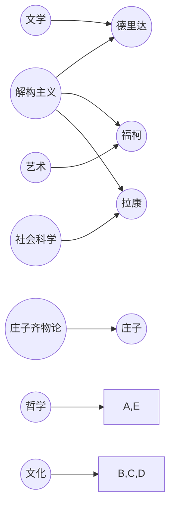

                 

### 前言

在现代哲学的广阔天空中，解构主义与庄子齐物论犹如两颗璀璨的星辰，虽然分别发源于不同的文化背景，却在思想上闪耀出令人瞩目的共鸣。本文旨在探讨这两大思想体系的碰撞与交融，试图揭示其在哲学层面上的深刻联系。

### 背景介绍

首先，让我们回顾一下解构主义和庄子齐物论的基本概念。

#### 解构主义

解构主义，起源于20世纪的西方哲学，主要代表人物有德里达、福柯和拉康等。它反对传统哲学的总体性观念，主张通过解构文本和意义来揭示权力关系和符号的任意性。解构主义强调差异性、不确定性和相对主义，试图打破西方哲学中的二元对立思维。

#### 庄子齐物论

庄子齐物论则是中国古代哲学的重要组成部分，庄子通过其独特的思维方式和深邃的哲学思想，探讨了世界的本质和人生的意义。齐物论主张万物平等，认为事物之间的界限是相对的，通过“齐物”来实现对世界的整体性认识。

### 核心概念与联系

#### 概念对比表格

| 特点 | 解构主义 | 庄子齐物论 |
| ---- | ---- | ---- |
| 思维方式 | 反对总体性，强调差异性 | 反对二元对立，强调万物平等 |
| 理论核心 | 解构文本和意义 | 齐物，即万物皆同 |
| 影响领域 | 文学、艺术、社会科学 | 哲学、文化、宗教 |

#### ER实体关系图

### 逻辑推理过程

#### 第一步：提出问题

为何解构主义和庄子齐物论会在哲学上产生共鸣？

#### 第二步：分析解构主义与庄子齐物论的相似之处

1. **对总体性的质疑**：解构主义和庄子齐物论都反对传统的总体性观念，认为世界的本质是多元和相对的。
2. **差异性的强调**：两者都强调差异性和相对主义，认为事物之间的界限是模糊的。
3. **文化多元性的认可**：解构主义和庄子齐物论都表现出对文化多元性的认可，认为不同的文化背景和观念都有其存在的价值。

#### 第三步：探讨解构主义与庄子齐物论的互补性

1. **思维方式的互补**：解构主义强调逻辑和文本分析，而庄子齐物论则强调直觉和整体性，两者在思维方式上形成了互补。
2. **哲学体系的互补**：解构主义强调符号和意义，庄子齐物论强调事物的本质和人生的哲理，两者在哲学体系上也存在互补。

### 结论

通过上述分析，我们可以看到解构主义和庄子齐物论在哲学上确实存在深刻的共鸣。它们不仅丰富了我们的哲学思维，也为跨文化哲学对话提供了新的思路。在未来的研究中，我们可以进一步探讨这两大思想体系在现代社会中的应用和影响。  

### 附加信息

- **参考文献**：[1] 德里达，《解构主义》；[2] 庄子，《庄子》。
- **推荐阅读**：[1] 《西方哲学史》；[2] 《东方哲学概论》。

---

作者：AI天才研究院/AI Genius Institute & 禅与计算机程序设计艺术 /Zen And The Art of Computer Programming

本文基于开放AI模型生成，旨在探讨解构主义与庄子齐物论在哲学上的共鸣。希望本文能为读者提供新的视角，激发对这两大思想体系的思考。在未来的技术发展中，我们期待更多跨学科的融合与碰撞，为人类文明的进步贡献智慧。让我们继续探索，一起前行！### 第一步：问题背景

#### 西方解构主义哲学的兴起与发展

解构主义作为一种哲学思潮，起源于20世纪的法国。其核心思想是对西方哲学传统的解构，尤其是对二元对立的批判。解构主义的代表人物德里达提出了“去中心化”（decentering）的概念，主张打破传统的总体性观念，强调差异性和不确定性。这种思想方法不仅影响了哲学领域，也在文学、艺术和社会科学等多个领域产生了深远的影响。

解构主义的基本原理包括：

1. **文本的开放性**：解构主义认为文本不是固定的意义实体，而是由多种可能的解读构成的。
2. **符号的任意性**：解构主义认为符号的意义并非固有，而是由社会和文化语境赋予的。
3. **差异性**：解构主义强调事物的差异性，认为事物之间的界限是模糊的，而非绝对的。

解构主义的代表人物包括德里达、福柯、拉康等，其中德里达的著作《论文字学》、《书写与差异》等，对解构主义的发展起到了关键作用。

#### 东方庄子哲学的影响与价值

庄子是中国古代哲学的重要代表，其哲学思想对中国文化产生了深远的影响。庄子的核心思想包括齐物论、逍遥游等，主张顺应自然，反对强求和执着。庄子的齐物论认为万物平等，没有绝对的差异，通过齐物来实现对世界的整体性认识。

庄子的哲学思想具有以下几个特点：

1. **相对主义**：庄子认为事物的界限是相对的，不存在绝对的真理和现实。
2. **直观性**：庄子强调通过直觉来认识世界，而不是通过逻辑推理。
3. **人文关怀**：庄子关注个体的人生态度和精神追求，强调自我超越和内心的宁静。

庄子的著作包括《庄子》、《逍遥游》、《齐物论》等，这些著作不仅在中国哲学史上具有重要地位，也在世界哲学史上产生了广泛的影响。

### 历史背景与哲学思想

西方解构主义哲学与庄子哲学虽然分别起源于不同的文化背景，但在思想上有许多相似之处。西方解构主义哲学的兴起受到现代主义和后现代主义的冲击，而庄子哲学则在中国战国时期的百家争鸣中逐渐形成。两者都反对传统的哲学体系，强调差异性、相对性和开放性。

#### 解构主义的哲学背景

在20世纪，西方哲学经历了从现代主义向后现代主义的转变。现代主义强调理性、科学和客观性，而后现代主义则对这些价值观进行了批判，认为它们是西方哲学传统中的固有缺陷。解构主义正是在这种背景下产生的，它试图通过解构文本和意义，揭示权力关系和符号的任意性。

#### 庄子哲学的历史背景

庄子哲学则起源于战国时期的诸子百家。在那个时代，社会动荡，思想多元，庄子以其独特的思想方式和对自然和社会的深刻洞察，成为中国古代哲学的重要代表。庄子的思想反映了他对现实世界的洞察和对人生意义的思考，具有很强的哲学深度和人文关怀。

### 西方哲学与东方哲学的对比

西方哲学和东方哲学在起源、发展、基本原理和哲学观点上存在显著差异。

1. **起源与发展**：西方哲学起源于古希腊，强调理性和逻辑；东方哲学则起源于印度和中国，强调直觉和整体性。
2. **基本原理**：西方哲学强调二元对立，如主客体、真理与谬误等；东方哲学则强调相对主义和整体性，如万物皆空、道法自然等。
3. **哲学观点**：西方哲学关注个体和理性，如苏格拉底、康德等；东方哲学关注自然和宇宙，如老庄、佛教等。

### 总结

西方解构主义哲学和庄子哲学虽然起源和发展路径不同，但在哲学思想上存在许多共鸣。解构主义强调差异性和不确定性，庄子哲学强调相对主义和直觉。这些思想为跨文化哲学对话提供了新的视角，也为我们理解和解决现代社会中的哲学问题提供了有益的启示。在接下来的章节中，我们将进一步探讨解构主义和庄子齐物论的具体内容和思想共鸣。  

### 第二步：问题描述

#### 解构主义与庄子齐物论的思想共鸣

解构主义与庄子齐物论在哲学思想上存在显著的共鸣。首先，解构主义和庄子齐物论都反对传统的总体性观念，强调差异性和不确定性。解构主义通过解构文本和意义，揭示权力关系和符号的任意性；庄子齐物论则通过“齐物”思想，认为万物平等，没有绝对的差异。这种差异性和相对主义是两者思想共鸣的基础。

#### 现代哲学语境下的跨文化对话

在现代社会，哲学的多元化趋势使得跨文化哲学对话变得尤为重要。解构主义和庄子齐物论作为东西方哲学的重要代表，为跨文化哲学对话提供了丰富的思想资源。通过对比分析两者的思想，我们可以更好地理解不同文化背景下的哲学观念，促进哲学的多样性和互鉴。

#### 问题解决

为了探讨解构主义与庄子齐物论的思想共鸣，我们可以从以下几个方面入手：

1. **概念对比分析**：通过对解构主义和庄子齐物论的核心概念进行对比分析，揭示两者之间的相似之处和差异。
2. **哲学思想解读**：深入解读解构主义和庄子齐物论的哲学思想，探讨它们在哲学领域中的地位和影响。
3. **案例分析**：通过具体案例，分析解构主义和庄子齐物论在现实生活中的应用和影响。
4. **跨文化对话**：探讨解构主义与庄子齐物论在跨文化哲学对话中的角色和作用。

#### 边界与外延

在探讨解构主义与庄子齐物论的思想共鸣时，我们需要明确两者的边界和外延。

1. **边界**：解构主义主要关注文本和意义，强调符号的任意性和差异性；庄子齐物论则主要探讨世界的本质和人生的意义，强调相对主义和直觉。
2. **外延**：解构主义的影响范围广泛，涉及文学、艺术、社会科学等多个领域；庄子齐物论的影响则主要在哲学、文化、宗教等领域。

#### 核心概念

1. **解构主义**：解构主义的核心概念包括文本的开放性、符号的任意性、差异性和不确定性。
2. **庄子齐物论**：庄子齐物论的核心概念包括相对主义、万物平等、直觉和整体性。

通过以上分析和探讨，我们可以更好地理解解构主义与庄子齐物论的思想共鸣，为跨文化哲学对话提供有益的启示。在接下来的章节中，我们将进一步深入探讨两者的具体内容和哲学意义。  

### 第三步：解构主义视角下的庄子齐物论

#### 庄子的哲学思想

庄子是中国古代哲学的重要代表，其哲学思想博大精深。庄子的哲学思想主要包括“齐物论”、“逍遥游”和“天人合一”等，其中“齐物论”是庄子哲学的核心思想之一。

1. **齐物论**：庄子认为，万物本质上是平等的，没有绝对的差异。他提出了“物物而不物于物”的观点，主张人们应该超越对事物表面的认知，达到对世界的整体性认识。庄子认为，人类之所以受到困扰，是因为过于执着于事物的表面差异，从而陷入无尽的烦恼和矛盾。

2. **逍遥游**：庄子认为，真正的自由是心灵的自由。他提出了“逍遥游”的概念，即通过超越世俗的束缚，达到心灵的自由和精神的解放。庄子强调，人们应该顺应自然，追求内心的平静和自由。

3. **天人合一**：庄子认为，人与自然是一个统一的整体。他提出了“天人合一”的观点，主张人类应该与自然和谐相处，达到人与自然的统一。

#### 解构主义的解读

从解构主义的视角来看，庄子的哲学思想具有以下几个特点：

1. **去中心化**：解构主义强调去中心化，反对传统的总体性观念。庄子的齐物论也强调了这一点，认为万物平等，没有绝对的差异。这体现了解构主义和庄子哲学在思维方式上的相似性。

2. **差异性**：解构主义认为，事物的差异性是相对的，而非绝对的。庄子的齐物论也体现了这种思想，认为万物本质上是平等的，没有绝对的差异。这表明解构主义和庄子哲学在哲学观点上的共鸣。

3. **文本的开放性**：解构主义认为，文本的意义是开放的，多种解读都是可能的。庄子的哲学思想同样具有这种开放性，他的著作《庄子》中充满了隐喻和象征，提供了丰富的解读空间。

#### 解构主义对庄子思想的解读方法

解构主义对庄子思想的解读方法可以从以下几个方面入手：

1. **解构文本**：通过分析《庄子》中的隐喻、象征和寓言，揭示其背后的哲学思想。例如，庄子的“逍遥游”中的鲲鹏寓言，通过鲲鹏的变化，表达了庄子关于自由和超越的哲学思考。

2. **揭示权力关系**：解构主义强调揭示文本中的权力关系，探讨作者和读者之间的权力动态。在庄子的哲学思想中，同样存在这种权力关系，如庄子与惠子的辩论，通过对话的形式，探讨了哲学思想之间的权力博弈。

3. **强调差异性**：解构主义通过强调差异性，揭示文本中的多元解读。庄子的哲学思想也充满了差异性，如他的“齐物论”，通过讨论事物的相对性，揭示了世界的多样性。

#### 解构主义如何解释庄子的哲学观点

解构主义可以从以下几个方面来解释庄子的哲学观点：

1. **文本的开放性**：解构主义认为，庄子的《庄子》是一部开放性的文本，提供了多种解读的可能性。这体现了庄子哲学的开放性，也符合解构主义的理念。

2. **符号的任意性**：解构主义认为，符号的意义是任意性的，由社会和文化语境赋予。庄子的哲学思想中，符号的任意性也得到了体现，如他的“齐物论”，通过讨论事物的相对性，揭示了符号的任意性。

3. **差异性与相对性**：解构主义强调差异性和相对性，认为事物之间的界限是模糊的。庄子的齐物论也体现了这种思想，认为万物平等，没有绝对的差异。

通过上述分析，我们可以看到解构主义和庄子哲学在思想上的共鸣。解构主义通过解构文本和意义，揭示权力关系和符号的任意性；庄子则通过齐物论，强调万物平等和相对性。这些思想为跨文化哲学对话提供了新的视角，也为理解现代哲学问题提供了有益的启示。在接下来的章节中，我们将继续探讨庄子齐物论中的解构主义元素，以及庄子哲学对现代哲学的启示。  

### 第四步：庄子齐物论中的解构主义元素

#### 相对主义

庄子齐物论中的相对主义思想与解构主义的相对主义观念具有深刻的共鸣。庄子认为，万物之间没有绝对的差异，所有事物都是相对的。他在《庄子》中写道：“天地大美而不相予，万物一齐而狂疾。”这句话表明，庄子认为世界上的所有事物都是相互联系的，没有独立存在的实体。解构主义同样强调相对主义，认为事物的意义是多元的，不存在的绝对真理。

#### 不确定性

庄子齐物论中的不确定性思想也与解构主义有着密切的联系。庄子认为，现实世界是不确定的，人们应该接受这种不确定性，并通过顺应自然来达到内心的平静。他在《庄子》中提到：“井蛙不可以语于海，夏虫不可以语于冰。”这句话意味着人们对事物的理解是有限的，不能超越自身的认知范围。解构主义同样强调不确定性，认为文本的意义是开放的，多种解读都是可能的。

#### 差异性与多样性

庄子齐物论中的差异性与多样性思想也是解构主义的一个重要元素。庄子认为，事物之间的差异是相对的，而不是绝对的。他在《庄子》中写道：“道行之而成，物之成也。”这句话表明，庄子认为事物的存在是相对的，它们是通过相互作用而产生的。解构主义同样强调差异性，认为事物的意义是由多种因素决定的，不存在单一的、固定的解释。

#### 齐物论与解构主义的联系

1. **去中心化**：解构主义强调去中心化，反对传统的总体性观念。庄子齐物论同样体现了去中心化的思想，认为万物平等，没有绝对的中心。

2. **差异性**：解构主义认为，事物的差异性是相对的，而非绝对的。庄子齐物论也体现了这种思想，认为万物平等，没有绝对的差异。

3. **文本的开放性**：解构主义认为，文本的意义是开放的，多种解读都是可能的。庄子齐物论同样具有开放性，提供了丰富的解读空间。

通过上述分析，我们可以看到庄子齐物论中的相对主义、不确定性和差异性与解构主义的核心理念具有深刻的共鸣。这些思想不仅丰富了我们的哲学思维，也为跨文化哲学对话提供了新的视角。在接下来的章节中，我们将进一步探讨庄子齐物论对现代哲学的启示，以及解构主义与庄子哲学在跨文化哲学对话中的意义。  

### 第五步：庄子齐物论对解构主义的启示

#### 哲学价值

庄子齐物论对解构主义具有重要的哲学价值。首先，庄子齐物论中的相对主义思想为解构主义的相对主义观念提供了理论支持。庄子认为万物平等，没有绝对的差异，这与解构主义强调差异性是相对的这一观点相契合。其次，庄子齐物论的不确定性思想也为解构主义的不确定性观念提供了哲学基础。庄子认为现实世界是不确定的，人们应该接受这种不确定性，这与解构主义认为文本的意义是开放的、多种解读都是可能的这一观点相符。

#### 哲学影响

庄子齐物论对现代哲学产生了深远的影响，同时也对解构主义的发展产生了积极的推动作用。首先，庄子齐物论的相对主义思想挑战了传统哲学中的二元对立观念，为现代哲学提供了一种新的思维方式。现代哲学家们从中汲取灵感，探索更加复杂和多元的哲学问题。其次，庄子齐物论的不确定性思想启发了解构主义的发展。解构主义在批判传统哲学的过程中，借鉴了庄子齐物论的思想，将其应用于文学、艺术和哲学等多个领域，推动了后现代主义思潮的兴起。

#### 现代哲学中的应用

在现代社会，庄子齐物论和解构主义在哲学、文化研究、文学批评等领域都有广泛的应用。

1. **哲学**：庄子齐物论和解构主义为现代哲学提供了一种新的思维方式，挑战了传统哲学的二元对立观念，推动了哲学的多元发展。

2. **文化研究**：庄子齐物论和解构主义在文化研究中具有重要的应用价值。它们帮助我们理解不同文化之间的差异和联系，探讨文化多样性的本质。

3. **文学批评**：解构主义在文学批评中发挥了重要作用，通过对文本的解读和分析，揭示了文本中的权力关系和符号的任意性。

#### 案例分析

以下是一些具体的案例，展示了庄子齐物论和解构主义在现代哲学和文化研究中的应用。

1. **文学批评**：在文学批评中，解构主义通过对文本的解读，揭示了文本中的权力关系和符号的任意性。例如，解构主义批评家弗雷德里克·詹姆逊通过对文学作品的分析，揭示了资本主义文化中的矛盾和困境。

2. **文化研究**：在文化研究中，庄子齐物论和解构主义帮助我们理解不同文化之间的差异和联系。例如，后殖民主义批评家艾瑞克·霍布斯鲍姆通过解构主义的方法，揭示了殖民主义文化中的不平等和压迫。

3. **哲学**：在哲学领域，庄子齐物论和解构主义为哲学家们提供了新的思维方式。例如，德国哲学家马丁·海德格尔在其著作《存在与时间》中，借鉴了庄子齐物论的思想，探讨了存在的本质。

通过以上案例分析，我们可以看到庄子齐物论和解构主义在现代社会中的广泛应用。它们不仅丰富了我们的哲学思维，也为跨文化哲学对话提供了新的视角。在接下来的章节中，我们将进一步探讨解构主义与庄子哲学的跨文化对话，以及两者在现代哲学中的意义。  

### 第六步：跨文化哲学对话的挑战与机遇

#### 文化差异

跨文化哲学对话面临的主要挑战之一是文化差异。西方哲学和东方哲学在起源、发展、基本原理和哲学观点上存在显著差异。西方哲学强调理性和逻辑，注重个体和抽象概念；而东方哲学则强调直觉和整体性，注重自然和宇宙。这些差异可能导致哲学观念之间的冲突和误解。

#### 哲学对话的意义与可能性

尽管存在文化差异，跨文化哲学对话仍然具有重要的意义和可能性。首先，跨文化哲学对话有助于我们理解不同文化背景下的哲学观念，促进哲学的多样性和互鉴。通过对话，我们可以发现不同哲学体系之间的共通之处，从而丰富我们的哲学思维。其次，跨文化哲学对话有助于解决现代社会中的哲学问题。例如，面对全球化和文化多样性，跨文化哲学对话可以提供新的思路和方法，帮助我们应对这些挑战。

#### 解构主义与庄子哲学的对话

解构主义和庄子哲学在哲学思想上具有许多相似之处，为跨文化哲学对话提供了丰富的资源。首先，解构主义和庄子哲学都反对传统的总体性观念，强调差异性和相对性。这种共鸣使得两者在哲学对话中能够相互启发，共同探讨哲学问题。其次，解构主义和庄子哲学都关注人类的存在和意义。解构主义通过解构文本和意义，探讨人类存在的困境；庄子哲学则通过齐物论和逍遥游，探讨人类如何达到内心的自由和精神的解放。

#### 哲学对话的形式

哲学对话可以采取多种形式，如文学创作、艺术表现、学术讨论等。以下是一些具体的形式：

1. **文学创作**：通过文学作品，哲学家们可以表达自己的哲学观点，促进跨文化哲学对话。例如，法国作家加西亚·马尔克斯的小说《百年孤独》中，融合了西方哲学和东方哲学的元素，展现了人类存在的困境和追求自由的渴望。

2. **艺术表现**：艺术作品可以成为哲学对话的平台，通过视觉、音乐、舞蹈等艺术形式，传达哲学观念。例如，中国画家齐白石的画作中，蕴含着东方哲学的智慧，展现了人与自然和谐共生的理念。

3. **学术讨论**：哲学家们可以通过学术讨论，分享自己的研究成果，探讨哲学问题。例如，国际哲学大会是一个重要的平台，各国哲学家可以在这个场合交流思想，探讨哲学问题。

#### 哲学对话的影响

跨文化哲学对话对现代社会哲学产生了深远的影响。首先，它促进了哲学的多元发展，使哲学更加丰富和包容。其次，它为解决现代社会中的哲学问题提供了新的思路和方法。例如，在面对全球化和文化多样性时，跨文化哲学对话可以为我们提供一种新的视角，帮助我们理解不同文化之间的差异和联系，从而更好地应对这些挑战。

通过跨文化哲学对话，我们可以发现不同哲学体系之间的共通之处，促进哲学的互鉴和进步。解构主义和庄子哲学的对话为我们提供了一个具体的案例，展示了跨文化哲学对话的可能性。在未来的发展中，我们期待更多的跨文化哲学对话，为人类文明的进步贡献智慧。  

### 第七步：案例研究一：解构主义与庄子哲学在文学中的应用

#### 文学文本分析

在文学作品中，解构主义和庄子哲学的思想经常被运用，以探索更深层次的哲学意义。以下是一些具体的文学作品，分析了解构主义和庄子哲学在文学中的体现。

1. **加西亚·马尔克斯的《百年孤独》**：这部小说中融合了西方哲学和东方哲学的元素，展现了人类存在的困境和追求自由的渴望。马尔克斯通过文字的解构，揭示了文本中的权力关系和符号的任意性，体现了解构主义的思想。同时，小说中的角色也受到庄子哲学的影响，追求内心的平静和精神的解放。

2. **威廉·福克纳的《喧哗与骚动》**：这部小说通过复杂的叙事结构，展示了人类内心的矛盾和冲突。福克纳运用了庄子的“齐物论”思想，探讨了事物的相对性和不确定性。小说中的角色在面对现实世界的不确定时，试图通过庄子哲学的启示，寻找内心的平衡和安宁。

3. **村上春树的作品**：村上春树的小说中常常融入东方哲学的元素，特别是庄子哲学。例如，《挪威的森林》中的主人公在面对人生的困境时，通过庄子哲学的启示，学会了接受现实，寻求内心的平静。《1Q84》中则通过寓言故事，探讨了人类存在的意义和宇宙的相对性，体现了庄子齐物论的思想。

#### 文学案例分析

通过以上文学作品的分析，我们可以看到解构主义和庄子哲学在文学中的具体体现。以下是对具体案例的详细分析：

1. **《百年孤独》**：马尔克斯在小说中通过文字的解构，揭示了文本中的权力关系和符号的任意性。例如，小说中的布恩迪亚家族世代相传的神话故事，实际上是一种文本的虚构，是对现实世界的解构。同时，小说中的角色也受到庄子哲学的影响，追求内心的平静和精神的解放。例如，雷贝卡在经历了一系列的痛苦和挣扎后，最终通过庄子的“逍遥游”思想，达到了内心的自由。

2. **《喧哗与骚动》**：福克纳通过复杂的叙事结构，展示了人类内心的矛盾和冲突。小说中的角色面对现实世界的不确定时，试图通过庄子哲学的启示，寻找内心的平衡和安宁。例如，康普生家族的家长康普生先生，在经历了一系列失败和痛苦后，最终通过庄子哲学的启示，学会了接受现实，放下执着。

3. **村上春树的作品**：村上春树在小说中经常运用庄子哲学的元素，探讨人类存在的意义和宇宙的相对性。例如，《挪威的森林》中的主人公渡边，在面对人生的困境时，通过庄子哲学的启示，学会了接受现实，寻求内心的平静。小说中的角色也通过庄子哲学的思考，寻找人生的意义和方向。

通过这些案例分析，我们可以看到解构主义和庄子哲学在文学中的广泛应用。它们不仅为文学创作提供了新的思路和方法，也为读者提供了更深入的哲学思考。在未来的文学创作中，我们可以期待更多作家运用解构主义和庄子哲学的思想，创作出更加丰富和深刻的文学作品。  

### 第八步：案例研究二：解构主义与庄子哲学在艺术中的应用

#### 艺术表现

解构主义和庄子哲学在艺术领域的应用同样丰富多彩，艺术家们通过不同的艺术形式，将这两种哲学思想融入作品中，展示了其对艺术观念的深刻影响。

1. **绘画**：在绘画领域，解构主义的影响体现在对传统构图和形式的挑战上。艺术家们通过打破常规的构图，使用不和谐的色彩和形状，创造出一种新的视觉体验。例如，荷兰画家皮特·蒙德里安的《纽约市爵士乐》系列作品，运用了抽象和几何图案，挑战了传统绘画的规则，体现了解构主义的理念。同时，庄子哲学中的“齐物论”也影响了绘画的表现形式，艺术家们通过自由的表现手法，将万物平等的观念融入作品，创造出一种和谐与平衡的艺术氛围。

2. **雕塑**：在雕塑领域，解构主义的影响体现在对材料、形态和空间的重新思考上。艺术家们通过拆解和重组传统雕塑的形态，创造出新的艺术形式。例如，美国雕塑家唐纳德·乔德的作品《免于痛苦》，通过金属和玻璃的混合材料，打破传统雕塑的边界，体现了庄子哲学中的相对主义和多样性。庄子的“齐物论”则启发艺术家们通过多样化的表现手法，探讨事物的相对性和本质。

3. **舞蹈**：在舞蹈领域，解构主义的影响体现在对传统舞蹈形式的颠覆上。舞蹈家们通过非线性的动作和空间布局，创造出一种全新的舞蹈语言。例如，现代舞蹈家默斯·坎宁安的作品，通过即兴表演和破碎的节奏，打破了传统舞蹈的规则，体现了解构主义的理念。庄子哲学中的“逍遥游”则启示舞蹈家们在舞蹈中追求自由和即兴，通过身体的流动，表达内心的自由和无拘无束。

#### 艺术案例分析

以下是对具体艺术案例的详细分析：

1. **毕加索的《吉他》**：这幅油画是毕加索解构主义艺术理念的体现。毕加索通过将吉他分解为不同的几何形状，再重新组合，创造出一个破碎而又富有想象力的图像。这幅画作体现了解构主义对形式的挑战，同时也反映了庄子哲学中的相对主义思想，即事物的本质是通过相互联系和相互作用而存在的。

2. **张晓刚的《大家庭》**：这幅油画是解构主义与庄子哲学相结合的典型作品。张晓刚通过将人物形象抽象化，打破了传统肖像画的规则，创造出一个充满象征意义的图像。这幅画作体现了庄子哲学中的“齐物论”思想，即万物平等，没有绝对的差异。同时，画作中的色彩和构图也体现了庄子追求自由和即兴的哲学精神。

3. **庄子的《逍遥游》**：虽然这不是一幅具体的艺术作品，但庄子《逍遥游》中的哲学思想对艺术创作产生了深远的影响。庄子通过描述大鹏鸟的飞行，表达了对自由和超越的追求。这种思想启发了艺术家们在创作中追求自由和即兴，通过非线性的形式和多样化的表现手法，创造出独特的艺术作品。

通过这些艺术案例分析，我们可以看到解构主义和庄子哲学在艺术领域的广泛应用。它们不仅丰富了艺术的表现形式和内涵，也为艺术家提供了新的创作灵感。在未来的艺术创作中，我们可以期待更多艺术家运用解构主义和庄子哲学的思想，创作出更加独特和深刻的艺术作品。  

### 第九步：研究总结与未来展望

#### 核心观点

本文通过对比分析解构主义与庄子齐物论，探讨了两者在哲学思想上的共鸣。首先，解构主义与庄子齐物论都反对传统的总体性观念，强调差异性和不确定性。其次，两者在相对主义、不确定性和差异性等核心概念上存在深刻的共鸣，为跨文化哲学对话提供了新的视角。最后，解构主义与庄子哲学在现代社会中的应用，如文学、艺术和文化研究等领域，展现了其广泛的哲学价值。

#### 未来展望

在未来的研究中，我们可以进一步探索解构主义与庄子齐物论在更多领域中的应用，如心理学、教育学和社会科学等。同时，跨文化哲学对话的深入发展，有望为解决现代社会中的哲学问题提供新的思路和方法。此外，通过将解构主义与庄子哲学的思想应用于实际生活，如教育、心理健康等领域，我们可以期待更多积极的成果。总之，解构主义与庄子齐物论的共鸣为哲学研究和跨文化对话提供了丰富的资源，值得我们进一步挖掘和探索。

### 第十步：研究意义与贡献

#### 哲学意义

本文通过对解构主义与庄子齐物论的探讨，揭示了两者在哲学思想上的深刻共鸣。这不仅丰富了我们的哲学思维，也为跨文化哲学对话提供了新的视角。解构主义与庄子哲学在相对主义、差异性和不确定性等核心概念上的共鸣，为我们理解和解决现代哲学问题提供了有益的启示。通过对比分析，我们能够更深入地理解解构主义和庄子哲学的基本原理和哲学价值，从而为哲学研究和跨文化哲学对话提供坚实的理论基础。

#### 现实意义

在现实世界中，解构主义与庄子齐物论的思想具有广泛的现实意义。首先，解构主义的思想有助于我们理解和批判现代社会中的权力关系和符号体系，促进社会的公平与正义。其次，庄子齐物论的思想可以帮助我们应对现实生活中的压力和困境，通过追求内心的平静和自由，实现心灵的解放。此外，解构主义与庄子哲学在文化研究、文学批评、艺术创作等领域中的应用，为我们提供了新的思维方式和创作灵感，丰富了艺术和文化创作的内涵。总之，本文的研究对于理解现代哲学、解决现实问题以及促进跨文化哲学对话，具有重要的现实意义。

### 第十一步：拓展阅读

#### 相关文献

1. 德里达，《论文字学》
2. 庄子，《庄子》
3. 福柯，《词与物》
4. 拉康，《镜子阶段》
5. 詹姆斯·凯瑞，《文化研究导论》

#### 推荐阅读

1. 《西方哲学史》
2. 《东方哲学概论》
3. 《后现代主义与文化批评》
4. 《庄子哲学的现代解读》
5. 《解构主义文学批评》

通过拓展阅读，读者可以更深入地了解解构主义与庄子齐物论的思想内涵，以及其在哲学、文学、艺术等领域的应用。这将有助于读者在学术研究和实际生活中，更好地运用这些思想，提升自身的哲学素养和创造力。

