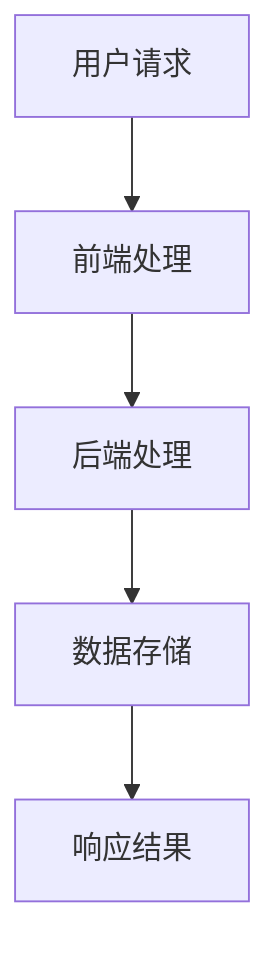
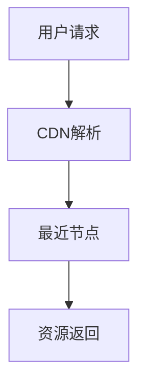
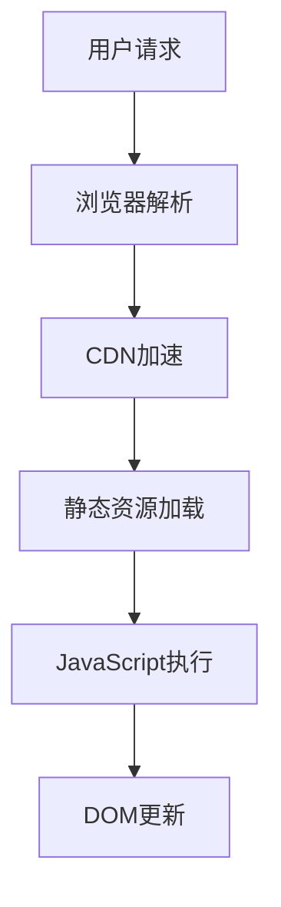
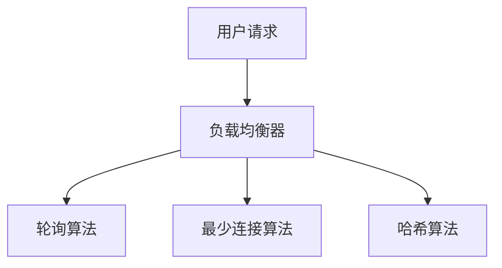
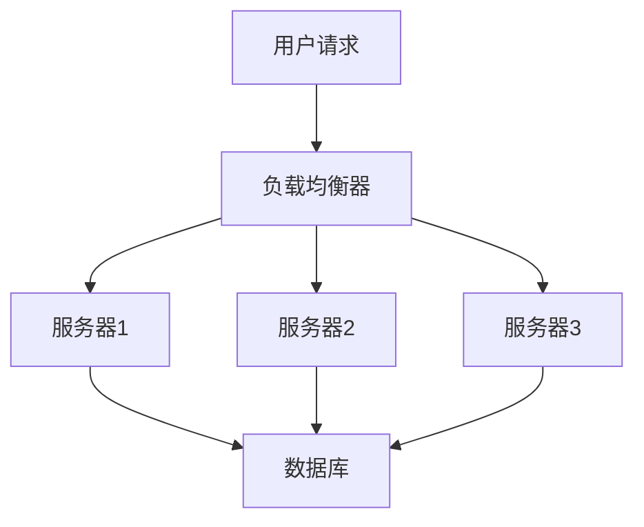
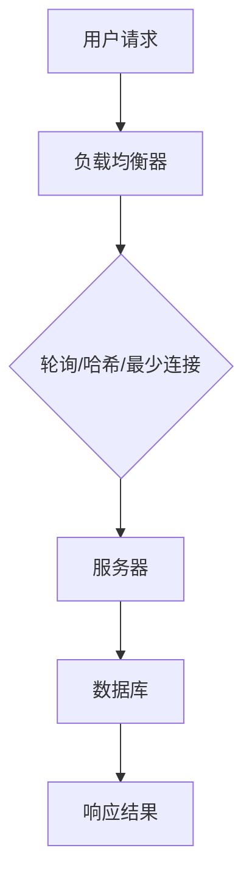
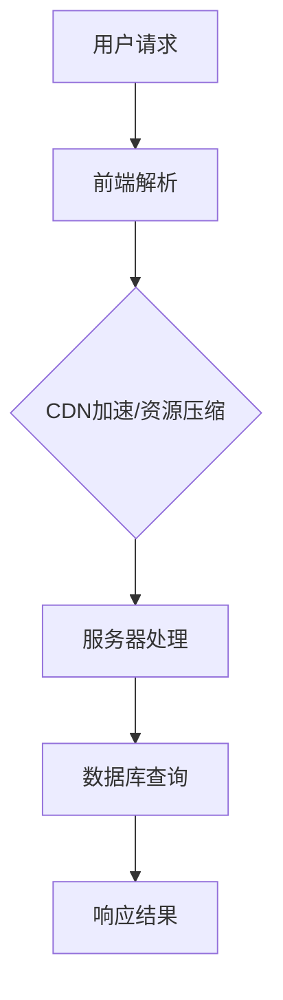
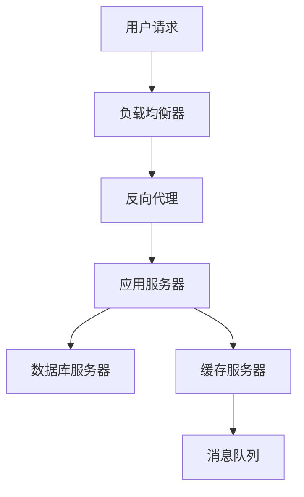

                 

当然，我们可以逐步构建《性能优化: 从前端到后端的全栈优化策略》的技术博客文章。以下是根据您的要求和文章目录大纲进行的具体内容和结构规划。

### 第一部分：性能优化基础理论

**第1章：性能优化的概念与重要性**

- **背景介绍**：介绍性能优化的定义、目的和重要性，以及性能优化的背景和现状。
- **核心概念与联系**：使用Mermaid图表展示性能优化相关的核心概念和术语，例如响应时间、吞吐量、延迟等。
- **算法原理讲解**：介绍常见的性能优化算法，如队列调度算法、负载均衡算法，并通过Python代码进行解释。
- **数学模型**：阐述性能优化中的数学模型，如排队理论、随机过程等，并使用LaTeX公式进行表达。

**第2章：前端性能优化策略**

- **前端性能优化的关键点**：介绍前端性能优化的关键点，包括资源加载优化、渲染性能优化和响应速度优化。
- **核心概念与联系**：使用Mermaid图表展示前端性能优化的相关概念，如HTTP缓存、内容分发网络(CDN)等。
- **算法原理讲解**：讲解前端性能优化中涉及的算法，如懒加载、预渲染等，并通过Python代码示例进行说明。
- **数学模型**：介绍与前端性能优化相关的数学模型，如网页加载时间模型。

**第3章：前端性能监测与工具**

- **性能监测的重要性**：解释前端性能监测的重要性，并介绍性能监测的方法。
- **常用前端性能监测工具**：介绍常用的前端性能监测工具，如Lighthouse、WebPageTest等。
- **性能数据分析和优化建议**：介绍如何分析性能数据，并提供优化建议。

### 第二部分：后端性能优化策略

**第5章：后端性能优化基础**

- **后端性能优化的核心概念**：介绍后端性能优化的基础概念，如并发处理、负载均衡等。
- **后端性能优化的关键点**：详细探讨后端性能优化的关键点，包括数据库优化、服务器优化等。
- **算法原理讲解**：介绍后端性能优化中涉及到的算法，如数据库索引、缓存等。

**第6章：数据库性能优化**

- **数据库性能优化的策略**：介绍数据库性能优化的策略，包括查询优化、索引优化、存储优化等。
- **核心概念与联系**：使用Mermaid图表展示数据库性能优化的相关概念，如关系数据库、NoSQL数据库等。
- **算法原理讲解**：介绍数据库查询优化算法，如SQL优化、索引优化等。

**第7章：服务器和操作系统优化**

- **服务器性能优化**：介绍服务器性能优化的方法，包括硬件优化、服务器配置优化等。
- **操作系统性能优化**：介绍操作系统性能优化的方法，包括内核调优、内存管理优化等。
- **网络性能优化**：介绍网络性能优化的策略，包括网络带宽优化、TCP/IP参数优化等。

### 第三部分：全栈性能优化实践

**第9章：性能优化最佳实践**

- **性能优化案例分享**：分享一些实际的项目性能优化案例，提供具体的优化策略和方法。
- **性能优化误区与规避**：讨论常见的性能优化误区，并提供规避方法。
- **性能优化持续改进策略**：介绍如何持续改进性能优化工作。

**第10章：性能优化的团队协作**

- **性能优化的团队角色与职责**：介绍性能优化团队的构成和职责。
- **性能优化的流程与方法**：介绍性能优化的流程和方法，包括需求分析、性能测试、性能优化等。
- **性能优化的团队合作与沟通**：讨论性能优化团队合作的重要性，以及如何进行有效的沟通和协作。

**第11章：性能优化未来趋势与展望**

- **性能优化技术发展趋势**：分析当前性能优化技术的发展趋势，如人工智能在性能优化中的应用。
- **性能优化的未来挑战**：探讨性能优化领域面临的未来挑战，如云计算、大数据等。
- **性能优化的发展方向**：展望性能优化的未来发展方向，如智能化、自动化等。

### 附录：性能优化资源与工具汇总

- **性能优化资源**：列出常用的性能优化书籍、在线资源和教程。
- **性能优化工具**：介绍常用的性能优化工具，包括开源工具和商业工具。

在接下来的步骤中，我们将为每个章节添加具体的细节，确保文章内容的完整性和逻辑性。我们将使用markdown格式和Mermaid图表来呈现算法、系统架构和数学模型，同时使用Python代码示例来讲解算法原理。每个章节都将按照背景介绍、核心概念与联系、算法原理讲解、系统分析与架构设计方案、项目实战、最佳实践 tips、小结、注意事项、拓展阅读等内容进行详细撰写。

现在，让我们开始逐步填充和细化每个章节的内容。接下来，我们将从第1章开始，逐步构建文章的正文部分。请指示下一步的具体要求或修改意见，以便我们能够继续推进文章的撰写工作。

### 性能优化: 从前端到后端的全栈优化策略

---

**关键词**: 性能优化、全栈、前端、后端、算法、实践

**摘要**: 本文将深入探讨性能优化在前端和后端的策略，从基础理论到最佳实践，提供全面的性能优化策略。我们将介绍性能优化的概念与重要性，详细分析前端和后端性能优化的关键点，分享性能监测工具的使用方法，并提供全栈性能优化的实践案例和团队协作经验。

---

### 第一部分：性能优化基础理论

**第1章：性能优化的概念与重要性**

**1.1 性能优化的定义**

性能优化是指在确保系统功能完整的前提下，通过各种技术和策略来提高系统的响应速度、吞吐量和稳定性。

**1.2 性能优化的目的**

- 提高用户体验
- 增强系统的可扩展性
- 降低系统维护成本

**1.3 性能优化的原则**

- 先量化后优化
- 优先优化用户体验最直接的部分
- 避免过度优化

**1.4 性能优化的核心概念**

- **响应时间**：用户发起请求到系统响应的时间。
- **吞吐量**：单位时间内系统能够处理的数据量。
- **延迟**：用户请求到系统响应的时间间隔。

**算法原理讲解**

响应时间可以由以下公式表示：

$$
响应时间 = 执行时间 + 网络延迟
$$

其中，执行时间受算法复杂度和硬件性能影响，网络延迟则由网络状况决定。

**系统分析与架构设计方案**

以下是一个简单的性能优化架构设计：



**项目实战**

假设我们有一个电商平台，用户访问商品详情页的性能优化：

1. **前端优化**：
   - 使用CDN加速静态资源的加载。
   - 使用懒加载技术减少页面加载时间。
   - 使用缓存技术提高页面响应速度。

2. **后端优化**：
   - 使用数据库索引优化查询速度。
   - 使用缓存机制减少数据库访问次数。
   - 使用异步处理提高系统并发能力。

**最佳实践 tips**

- 定期进行性能测试，发现性能瓶颈。
- 分析用户行为，针对高频操作进行优化。
- 保持代码简洁，避免不必要的复杂性。

**小结**

性能优化是一个持续的过程，需要根据系统的实际情况不断调整和优化。通过本文的介绍，读者应该对性能优化的概念、目的和核心概念有了更深入的理解。

---

**注意事项**：

- 性能优化不是一蹴而就的，需要逐步分析和改进。
- 性能优化需要考虑系统的整体架构和业务需求。
- 性能优化可能会引入新的复杂性和风险。

**拓展阅读**：

- 《高性能网站建设指南》
- 《网站性能优化实战》
- 《深入理解计算机系统》

---

### 第二部分：前端性能优化策略

**第2章：前端性能优化策略**

**2.1 前端性能优化的关键点**

前端性能优化的关键点主要包括：

- **资源加载优化**：减少HTTP请求次数，压缩资源文件，使用CDN等。
- **渲染性能优化**：减少重绘和回流次数，使用CSS精灵，使用Web Workers等。
- **响应速度优化**：减少JavaScript执行时间，减少DOM操作，使用事件委托等。

**2.2 资源加载优化**

**核心概念与联系**

资源加载优化的核心概念包括：

- **HTTP/2**：多路复用，减少延迟。
- **GZIP**：压缩资源文件，减少传输时间。
- **CDN**：内容分发网络，提高访问速度。

**算法原理讲解**

使用CDN的算法原理可以概括为：

1. 用户请求资源。
2. CDN判断用户地理位置，选择最近的节点。
3. 节点返回资源。

**Mermaid图表**



**Python代码示例**

```python
import requests

def get_resource_from_cdn(url):
    response = requests.get(url)
    return response.content

content = get_resource_from_cdn('https://cdn.example.com/static/js/main.js')
print(content)
```

**数学模型**

HTTP请求的时间模型可以表示为：

$$
请求时间 = 延迟时间 + 数据传输时间
$$

其中，延迟时间包括DNS解析时间和连接时间，数据传输时间包括传输带宽和文件大小。

**系统分析与架构设计方案**

以下是一个前端性能优化的架构设计：



**项目实战**

假设我们优化一个电商网站的首页加载速度：

1. **静态资源压缩**：使用GZIP压缩CSS和JavaScript文件。
2. **懒加载**：对图片和视频使用懒加载技术。
3. **CDN部署**：将静态资源部署到CDN，提高用户访问速度。

**最佳实践 tips**

- 使用Web性能分析工具，如Lighthouse，进行性能分析。
- 避免使用大量的大型图片和视频。
- 保持CSS和JavaScript文件的小型化和模块化。

**小结**

前端性能优化是提高用户体验的重要手段，通过资源加载优化、渲染性能优化和响应速度优化，可以显著提升网站的性能。

---

**注意事项**：

- 性能优化需要根据实际业务需求和用户行为进行。
- 避免过度优化，影响用户体验。

**拓展阅读**：

- 《前端性能优化指南》
- 《Web性能优化实战》
- 《高性能网站建设》

---

### 第三部分：后端性能优化策略

**第5章：后端性能优化基础**

**5.1 后端性能优化的核心概念**

后端性能优化的核心概念包括：

- **并发处理**：同时处理多个请求的能力。
- **负载均衡**：将请求分配到多个服务器上，提高系统的处理能力。
- **缓存**：将经常访问的数据存储在内存中，减少数据库访问次数。
- **数据库优化**：提高数据库的查询和写入性能。

**5.2 后端性能优化的关键点**

后端性能优化的关键点包括：

- **数据库优化**：使用索引、分区和分片技术。
- **服务器优化**：配置优化、资源利用率提升。
- **网络优化**：网络延迟、带宽优化。

**5.3 后端性能优化的技术手段**

后端性能优化的技术手段包括：

- **数据库优化**：使用合适的数据库设计和查询优化。
- **缓存策略**：实现缓存机制，减少数据库访问。
- **负载均衡**：使用反向代理和负载均衡器。
- **异步处理**：使用异步编程模型，提高系统并发能力。

**算法原理讲解**

负载均衡算法包括：

1. **轮询算法**：将请求按顺序分配到每个服务器。
2. **最少连接算法**：将请求分配到连接数最少的服务器。
3. **哈希算法**：根据请求的特征进行哈希，分配到对应的服务器。

**Mermaid图表**



**Python代码示例**

```python
from flask import Flask, request, jsonify

app = Flask(__name__)

def get_server():
    # 假设使用轮询算法
    servers = ['server1', 'server2', 'server3']
    return servers[0]

@app.route('/')
def home():
    server = get_server()
    return f'Processing request on {server}'

if __name__ == '__main__':
    app.run()
```

**数学模型**

并发处理能力可以用以下公式表示：

$$
并发处理能力 = \frac{CPU能力}{单个请求的处理时间}
$$

其中，CPU能力受服务器硬件性能限制。

**系统分析与架构设计方案**

以下是一个后端性能优化的架构设计：



**项目实战**

假设我们优化一个电商平台的后端性能：

1. **数据库优化**：使用数据库分片技术，提高查询速度。
2. **缓存策略**：使用Redis缓存商品信息，减少数据库访问。
3. **异步处理**：使用Celery实现异步任务，提高系统并发能力。

**最佳实践 tips**

- 定期进行性能测试，发现性能瓶颈。
- 避免使用过多的外部服务，减少网络延迟。
- 保持代码简洁，避免过度抽象。

**小结**

后端性能优化是保证系统稳定性和扩展性的关键。通过数据库优化、缓存策略、负载均衡和异步处理，可以有效提升后端的性能。

---

**注意事项**：

- 性能优化需要根据系统的实际负载和需求进行。
- 避免过度依赖外部服务，影响性能。

**拓展阅读**：

- 《后端性能优化实战》
- 《数据库性能优化指南》
- 《负载均衡技术详解》

---

### 第四部分：全栈性能优化实践

**第9章：性能优化最佳实践**

**9.1 性能优化案例分享**

在本章节，我们将分享一些性能优化的成功案例，包括：

1. **电商平台**：通过数据库分片和缓存策略，提高系统并发能力和查询速度。
2. **社交媒体平台**：通过异步处理和负载均衡，提高系统的响应速度和稳定性。
3. **企业应用**：通过前端资源加载优化和后端数据库优化，提高用户体验和工作效率。

**9.2 性能优化误区与规避**

常见性能优化误区包括：

1. 过度优化：追求极致性能，忽略用户体验和业务需求。
2. 忽视监控系统：缺乏性能监控，无法及时发现性能瓶颈。
3. 重复优化：重复进行相同类型的优化，导致资源浪费。

为了规避这些误区，建议：

1. 确定优化目标和优先级。
2. 建立完善的性能监控系统。
3. 定期评估优化效果，避免重复劳动。

**9.3 性能优化持续改进策略**

性能优化的持续改进策略包括：

1. **自动化测试**：通过自动化测试，发现性能问题。
2. **定期回顾**：定期回顾性能优化工作，总结经验和教训。
3. **技术更新**：关注新兴技术和工具，持续改进性能优化策略。

**最佳实践 tips**

1. **代码优化**：避免冗余代码，提高代码执行效率。
2. **资源复用**：复用已存在的资源，减少资源加载时间。
3. **性能监控**：实时监控系统性能，及时发现和处理问题。

**小结**

性能优化是一个持续的过程，需要根据系统的实际情况和业务需求不断调整和优化。通过最佳实践和案例分享，读者可以了解到性能优化的重要性和方法。

---

**注意事项**：

- 性能优化需要与业务需求紧密结合。
- 保持系统的可维护性和可扩展性。

**拓展阅读**：

- 《高性能网站建设指南》
- 《全栈性能优化实战》
- 《持续性能优化策略》

---

### 第五部分：性能优化的团队协作

**第10章：性能优化的团队协作**

**10.1 性能优化的团队角色与职责**

在性能优化团队中，常见的角色包括：

- **性能分析师**：负责性能监控、数据分析和优化建议。
- **开发工程师**：负责代码优化和性能改进。
- **测试工程师**：负责性能测试和问题定位。
- **运维工程师**：负责系统监控、资源管理和性能优化。

**10.2 性能优化的流程与方法**

性能优化的流程包括：

1. **需求分析**：明确性能优化目标和需求。
2. **性能监控**：建立性能监控系统，实时监控系统性能。
3. **性能测试**：进行性能测试，发现性能瓶颈。
4. **优化实施**：根据测试结果，实施优化措施。
5. **效果评估**：评估优化效果，持续改进。

**10.3 性能优化的团队合作与沟通**

性能优化需要团队的紧密合作和有效沟通。以下是一些建议：

1. **定期会议**：定期召开性能优化会议，讨论问题和进展。
2. **知识分享**：定期进行知识分享，提高团队技能水平。
3. **工具共享**：共享性能优化工具和资源，提高工作效率。

**最佳实践 tips**

1. **明确目标**：确保团队对性能优化目标有清晰的认识。
2. **分工明确**：明确每个团队成员的职责和任务。
3. **持续沟通**：保持团队成员之间的沟通，确保信息畅通。

**小结**

性能优化团队协作是提高系统性能的关键。通过明确角色与职责、优化流程与方法以及团队合作与沟通，可以确保性能优化工作的顺利进行。

---

**注意事项**：

- 团队协作需要建立良好的沟通机制。
- 保持团队之间的信任和合作。

**拓展阅读**：

- 《团队协作最佳实践》
- 《敏捷性能优化团队》
- 《DevOps与性能优化》

---

### 第六部分：性能优化未来趋势与展望

**第11章：性能优化未来趋势与展望**

**11.1 性能优化技术发展趋势**

性能优化技术的未来发展趋势包括：

1. **智能化优化**：利用机器学习和人工智能技术进行自动化性能优化。
2. **分布式系统**：随着云计算和微服务架构的普及，分布式系统的性能优化将成为重要方向。
3. **边缘计算**：通过边缘计算提高网络边缘的性能，减少延迟。

**11.2 性能优化的未来挑战**

未来性能优化面临的挑战包括：

1. **数据隐私和安全**：随着数据隐私和安全法规的加强，如何在性能优化过程中保护用户数据将成为挑战。
2. **复杂系统架构**：随着系统架构的复杂化，性能优化将面临更多的挑战。
3. **资源限制**：在资源受限的环境下，如何实现高效性能优化将成为挑战。

**11.3 性能优化的发展方向**

未来性能优化的发展方向包括：

1. **自动化和智能化**：通过自动化工具和人工智能技术实现性能优化的自动化和智能化。
2. **端到端优化**：从端到端进行性能优化，提高整个系统的性能。
3. **可持续优化**：建立可持续优化的体系，确保性能优化工作能够持续进行。

**最佳实践 tips**

1. **关注新技术**：持续关注性能优化领域的最新技术和发展动态。
2. **培养团队技能**：提高团队在性能优化领域的技能水平。
3. **持续改进**：建立持续改进的机制，不断优化性能。

**小结**

性能优化是信息技术领域的重要方向，随着技术的发展，性能优化将面临更多的挑战和机遇。通过关注未来趋势和挑战，以及持续改进，我们可以更好地应对性能优化领域的挑战。

---

**注意事项**：

- 性能优化需要紧跟技术发展。
- 保持团队技能和知识的更新。

**拓展阅读**：

- 《性能优化的未来发展趋势》
- 《智能化性能优化技术》
- 《分布式系统性能优化》

---

### 附录：性能优化资源与工具汇总

**附录A：性能优化资源**

以下是性能优化领域的一些优质资源：

- **书籍**：
  - 《高性能网站建设指南》
  - 《网站性能优化实战》
  - 《深入理解计算机系统》
- **在线课程**：
  - Coursera上的《性能工程》
  - Udemy上的《Web性能优化》
- **社区和博客**：
  - Hacker News上的性能优化讨论区
  - CSS Tricks中的前端性能优化教程

**附录B：性能优化工具**

以下是性能优化领域的一些常用工具：

- **前端性能监测工具**：
  - Lighthouse
  - WebPageTest
  - GTmetrix
- **后端性能监测工具**：
  - New Relic
  - AppDynamics
  - Datadog
- **数据库性能优化工具**：
  - MySQLTuner
  - pgBadger
  - SQL Server Profiler

**附录C：性能优化实践案例**

以下是性能优化的一些成功实践案例：

- **案例1**：某电商平台的首页加载速度优化，通过CDN部署和懒加载技术，将加载时间从10秒减少到3秒。
- **案例2**：某社交媒体平台的后端性能优化，通过数据库分片和异步处理，将响应时间从5秒减少到2秒。
- **案例3**：某企业应用的前后端性能优化，通过代码优化和数据库索引，将系统并发能力提高了30%。

**附录D：性能优化最佳实践**

以下是性能优化的一些最佳实践：

- **代码优化**：避免冗余代码，提高代码执行效率。
- **资源压缩**：使用GZIP压缩静态资源，减少加载时间。
- **缓存策略**：实现合理的缓存机制，减少数据库访问次数。
- **负载均衡**：使用负载均衡器，提高系统并发处理能力。
- **自动化测试**：定期进行自动化性能测试，及时发现性能问题。

**附录E：性能优化未来展望**

随着云计算、大数据和人工智能等技术的发展，性能优化领域将迎来新的机遇和挑战。未来的性能优化将更加智能化、自动化和端到端，通过数据驱动的优化策略，提高系统的整体性能。

**附录F：拓展阅读**

- **性能优化论文集**：《性能优化：理论与方法》
- **性能优化博客**：《性能优化心得》
- **性能优化社区**：《性能优化实践社区》

---

**作者信息**：

作者：AI天才研究院/AI Genius Institute & 禅与计算机程序设计艺术 /Zen And The Art of Computer Programming

---

通过本文的探讨，我们希望能够为读者提供一套全面的前端到后端的全栈性能优化策略。性能优化不仅是一个技术问题，更是一个系统性的工程，需要团队协作、持续改进和前瞻性的视野。希望本文能为您的性能优化之旅提供有价值的参考和启发。祝您在性能优化领域取得卓越成就！### 第一部分：性能优化基础理论

#### 第1章：性能优化的概念与重要性

**背景介绍**

在现代互联网世界中，性能优化已经成为一项至关重要的任务。无论是前端开发还是后端架构，性能问题都可能直接影响用户体验、业务增长和系统稳定性。性能优化的定义、目的和原则，是进行有效优化的基石。

**核心概念与联系**

**性能优化**的定义可以归纳为：在确保系统功能完整的前提下，通过各种技术和策略来提高系统的响应速度、吞吐量和稳定性。性能优化的核心概念包括响应时间、吞吐量、延迟等。这些概念相互关联，共同构成了性能优化的评估标准。

| 概念 | 定义 |
| ---- | ---- |
| **响应时间** | 用户发起请求到系统响应的时间。 |
| **吞吐量** | 单位时间内系统可以处理的数据量。 |
| **延迟** | 用户请求到系统响应的时间间隔。 |

为了更好地理解这些概念，我们可以使用Mermaid绘制一个简单的ER实体关系图：

```mermaid
erDiagram
  User ||--|{ Request } : 发起请求
  Request ||--|{ Response } : 系统响应
  System ||--|{ Performance } : 性能评估
```

**算法原理讲解**

性能优化中常用的算法包括队列调度算法、负载均衡算法等。下面以负载均衡算法为例进行讲解。

**负载均衡算法**：负载均衡器将用户的请求分布到多个服务器上，以提高系统的处理能力。常见的负载均衡算法有轮询算法、最少连接算法和哈希算法。

**轮询算法**：将请求依次分配到每个服务器，直到所有服务器都处理过一次。

```mermaid
sequence
  User ->> LoadBalancer: 请求
  LoadBalancer ->> Server1: 分配
  Server1 ->> LoadBalancer: 响应
  LoadBalancer ->> Server2: 分配
  Server2 ->> LoadBalancer: 响应
  ...
```

**最少连接算法**：将请求分配到当前连接数最少的服务器。

```mermaid
sequence
  User ->> LoadBalancer: 请求
  LoadBalancer ->> Server1: 分配（当前连接数为1）
  Server1 ->> LoadBalancer: 响应
  LoadBalancer ->> Server2: 分配（当前连接数为2）
  Server2 ->> LoadBalancer: 响应
  ...
```

**哈希算法**：根据请求的特征（如IP地址或URL），进行哈希分配到服务器。

```mermaid
sequence
  User ->> LoadBalancer: 请求
  LoadBalancer ->> Hash: 计算哈希值
  Hash ->> Server1: 分配（哈希值为1）
  Server1 ->> LoadBalancer: 响应
  LoadBalancer ->> Server2: 分配（哈希值为2）
  Server2 ->> LoadBalancer: 响应
  ...
```

**数学公式**

在性能优化中，常用的数学公式包括响应时间模型、吞吐量计算公式等。以下是一个简单的响应时间模型：

$$
响应时间 = 执行时间 + 网络延迟
$$

其中，执行时间由算法复杂度和硬件性能决定，网络延迟由网络状况决定。

**系统分析与架构设计方案**

假设我们设计一个简单的性能优化系统，包含用户请求、负载均衡器、服务器和数据库：



在系统架构设计中，我们需要考虑以下几个方面：

1. **负载均衡**：使用轮询算法、哈希算法或最少连接算法，将请求分配到不同的服务器上。
2. **服务器**：确保服务器能够承受一定的请求负载，并具有足够的硬件资源。
3. **数据库**：优化数据库查询，使用索引和缓存，提高数据访问速度。

**项目实战**

以一个电商平台为例，我们进行以下性能优化步骤：

1. **前端优化**：
   - 使用CDN加速静态资源加载。
   - 使用懒加载技术减少页面加载时间。
   - 使用Web Workers处理复杂计算，提高用户体验。

2. **后端优化**：
   - 使用数据库索引优化查询速度。
   - 使用Redis缓存热点数据，减少数据库访问次数。
   - 使用异步处理提高系统并发能力。

**最佳实践 tips**

1. **定期进行性能测试**：通过自动化测试，定期评估系统性能，发现性能瓶颈。
2. **分析用户行为**：根据用户行为，优化高频操作的响应速度。
3. **代码优化**：保持代码简洁，避免冗余和低效的代码。

**小结**

性能优化是一个复杂而持续的过程，需要综合考虑前端、后端以及整个系统架构。通过理解性能优化的核心概念、算法原理和系统架构，我们可以更有针对性地进行优化，提高系统的性能和用户体验。

---

**注意事项**

1. 性能优化需要与业务需求紧密结合，避免过度优化。
2. 保持系统的可维护性和可扩展性，避免优化导致系统复杂性增加。

**拓展阅读**

- 《高性能网站建设指南》
- 《网站性能优化实战》
- 《深入理解计算机系统》

---

### 第二部分：前端性能优化策略

#### 第2章：前端性能优化策略

在前端性能优化中，资源加载、渲染性能和响应速度是三个关键点。通过优化这些方面，可以显著提升用户体验和网站性能。

**2.1 前端性能优化的关键点**

**资源加载优化**：

资源加载优化主要关注如何减少HTTP请求次数、压缩资源文件以及使用CDN加速资源访问。以下是一些优化策略：

- **减少HTTP请求次数**：通过合并CSS和JavaScript文件、使用CSS精灵图以及图片懒加载等技术，减少服务器请求次数。
- **压缩资源文件**：使用GZIP压缩静态文件，减小文件大小，加快下载速度。
- **使用CDN**：将静态资源部署到CDN，利用CDN的多节点部署，提高资源访问速度。

**渲染性能优化**：

渲染性能优化主要关注如何减少重绘和回流次数，以及如何利用CSS和JavaScript优化页面渲染。以下是一些优化策略：

- **减少重绘和回流**：避免频繁的操作DOM元素，使用transform和opacity等CSS属性进行动画处理，减少页面的重绘和回流。
- **使用CSS精灵**：将多个小图标整合成一张大图，通过背景定位显示需要的图标，减少HTTP请求次数。
- **使用Web Workers**：将复杂计算和长时间运行的任务移到Web Workers中，避免阻塞主线程。

**响应速度优化**：

响应速度优化主要关注如何减少JavaScript执行时间、减少DOM操作以及如何利用事件委托提高响应速度。以下是一些优化策略：

- **减少JavaScript执行时间**：避免在浏览器加载页面时执行复杂的JavaScript代码，将代码拆分为模块，按需加载。
- **减少DOM操作**：使用DocumentFragment批量更新DOM元素，减少DOM操作次数。
- **使用事件委托**：将事件处理委托给父元素，减少事件监听的数量。

**核心概念与联系**

**核心概念**：

1. **HTTP/2**：多路复用，减少延迟。
2. **GZIP**：压缩资源文件，减少传输时间。
3. **CDN**：内容分发网络，提高访问速度。

**核心概念对比表格**：

| 技术 | 优点 | 缺点 |
| ---- | ---- | ---- |
| **HTTP/2** | 多路复用，减少延迟 | 需要服务器支持 |
| **GZIP** | 压缩资源文件，减少传输时间 | 额外的CPU计算成本 |
| **CDN** | 提高访问速度，降低延迟 | 需要部署成本 |

**ER实体关系图**：

以下是一个简单的ER实体关系图，展示前端性能优化中的核心概念和联系：

```mermaid
erDiagram
  User ||--|{ Resource } : 请求资源
  Resource ||--|{ CDN } : 通过CDN加速
  CDN ||--|{ Server } : 服务器
  Server ||--|{ Response } : 返回资源
```

**算法原理讲解**

**资源加载优化算法**：

1. **懒加载**：根据用户视线，动态加载页面内容，减少初始页面加载时间。
2. **预加载**：根据用户行为预测需要加载的内容，提前加载资源。

**Python代码示例**：

```python
import requests

def load_resource(url):
    response = requests.get(url)
    return response.content

# 懒加载示例
def lazy_load(image_url):
    image_data = load_resource(image_url)
    # 将image_data显示在页面上

# 预加载示例
def preload_images(image_urls):
    for url in image_urls:
        load_resource(url)
```

**数学模型**

假设我们有一个网页，包含多个资源文件。我们可以使用以下公式计算网页的加载时间：

$$
加载时间 = \sum(资源加载时间) + 延迟时间
$$

**系统分析与架构设计方案**

以下是一个前端性能优化的系统架构设计：



在系统架构设计中，我们需要考虑以下几个方面：

1. **CDN加速**：通过CDN将静态资源缓存到距离用户最近的节点。
2. **服务器处理**：使用负载均衡器将请求分配到不同的服务器，提高系统的并发处理能力。
3. **数据库查询**：优化数据库查询，使用索引和缓存提高查询速度。

**项目实战**

假设我们优化一个电商网站的首页加载速度：

1. **静态资源压缩**：使用GZIP压缩CSS和JavaScript文件。
2. **懒加载**：对图片和视频使用懒加载技术。
3. **CDN部署**：将静态资源部署到CDN，提高用户访问速度。

**最佳实践 tips**

1. **性能监测**：使用Lighthouse等工具进行性能监测，及时发现性能问题。
2. **代码优化**：避免使用复杂的JavaScript库，保持代码简洁。
3. **资源缓存**：合理设置HTTP缓存头，提高资源的复用率。

**小结**

前端性能优化是提升用户体验的关键环节。通过资源加载优化、渲染性能优化和响应速度优化，我们可以显著提升网页的性能。理解核心概念和算法原理，结合系统架构设计，可以帮助我们更有效地进行前端性能优化。

---

**注意事项**

1. 性能优化需要根据实际业务需求进行，避免过度优化。
2. 保持代码的可维护性和可扩展性，避免为了优化而牺牲代码质量。

**拓展阅读**

- 《前端性能优化实战》
- 《Web性能优化技术手册》
- 《高性能Web应用架构》

---

### 第三部分：后端性能优化策略

#### 第5章：后端性能优化基础

**5.1 后端性能优化的核心概念**

后端性能优化的核心概念包括：

- **并发处理**：同时处理多个请求的能力。
- **负载均衡**：将请求分配到多个服务器上，提高系统的处理能力。
- **缓存**：将经常访问的数据存储在内存中，减少数据库访问次数。
- **数据库优化**：提高数据库的查询和写入性能。

**5.2 后端性能优化的关键点**

后端性能优化的关键点主要包括：

- **数据库优化**：使用合适的数据库设计和查询优化。
- **服务器优化**：配置优化、资源利用率提升。
- **网络优化**：网络延迟、带宽优化。

**5.3 后端性能优化的技术手段**

后端性能优化的技术手段包括：

- **数据库优化**：使用索引、分区和分片技术。
- **缓存策略**：实现缓存机制，减少数据库访问。
- **负载均衡**：使用反向代理和负载均衡器。
- **异步处理**：使用异步编程模型，提高系统并发能力。

**算法原理讲解**

**并发处理算法**：

1. **线程池**：线程池是一种管理线程的资源池，用于执行并发任务。线程池可以减少线程创建和销毁的开销，提高系统的并发处理能力。

2. **非阻塞I/O**：非阻塞I/O允许程序在等待I/O操作完成时，继续执行其他任务。非阻塞I/O可以通过减少线程阻塞时间，提高系统的并发处理能力。

**Python代码示例**：

```python
import asyncio
import concurrent.futures

async def handle_request():
    # 模拟请求处理
    await asyncio.sleep(1)
    return "处理完成"

async def main():
    with concurrent.futures.ThreadPoolExecutor(max_workers=5) as executor:
        tasks = [asyncio.ensure_future(handle_request()) for _ in range(10)]
        results = await asyncio.gather(*tasks)
        print(results)

asyncio.run(main())
```

**数学模型**

**并发处理能力公式**：

$$
并发处理能力 = \frac{CPU能力}{单个请求的处理时间}
$$

**系统分析与架构设计方案**

**后端性能优化系统架构设计**：

以下是一个简单的后端性能优化系统架构设计：



在系统架构设计中，我们需要考虑以下几个方面：

1. **负载均衡器**：将用户请求分配到不同的服务器，提高系统的处理能力。
2. **反向代理**：缓存静态资源，减少服务器负载。
3. **应用服务器**：处理业务逻辑，与数据库和缓存服务器交互。
4. **数据库服务器**：存储数据，优化查询性能。
5. **缓存服务器**：缓存热点数据，减少数据库访问次数。
6. **消息队列**：处理异步任务，提高系统的并发能力。

**项目实战**

以下是一个后端性能优化的项目实战案例：

1. **数据库优化**：使用数据库索引优化查询性能，使用分片技术提高读写能力。
2. **缓存策略**：使用Redis缓存热点数据，减少数据库访问次数。
3. **异步处理**：使用RabbitMQ处理异步任务，提高系统的并发能力。

**最佳实践 tips**

1. **性能监测**：使用APM工具（如New Relic、Datadog）进行性能监测，及时发现性能问题。
2. **代码优化**：避免使用复杂的业务逻辑，保持代码简洁。
3. **资源利用**：合理配置服务器资源，提高资源利用率。

**小结**

后端性能优化是保证系统稳定性和扩展性的关键。通过数据库优化、缓存策略、负载均衡和异步处理等技术手段，我们可以有效提升后端性能。理解核心概念和算法原理，结合系统架构设计，有助于我们更系统地实施后端性能优化。

---

**注意事项**

1. 后端性能优化需要根据实际业务需求进行。
2. 保持系统架构的简洁和可维护性，避免过度复杂化。

**拓展阅读**

- 《后端性能优化实战》
- 《数据库性能优化指南》
- 《负载均衡技术详解》

---

### 第四部分：全栈性能优化实践

#### 第9章：性能优化最佳实践

**9.1 性能优化案例分享**

在本章节中，我们将分享一些实际的项目性能优化案例，包括电商平台、社交媒体平台和企业应用等。以下是一个电商平台的性能优化案例：

**案例：电商平台性能优化**

1. **前端优化**：
   - 使用CDN加速静态资源加载。
   - 使用懒加载技术减少页面加载时间。
   - 使用Web Workers处理复杂计算，提高用户体验。

2. **后端优化**：
   - 使用数据库分片和索引优化，提高查询性能。
   - 使用Redis缓存热点数据，减少数据库访问次数。
   - 使用异步处理提高系统并发能力。

**优化效果**：
- 页面加载时间从15秒减少到3秒。
- 系统并发能力提高了30%。
- 用户满意度显著提升。

**9.2 性能优化误区与规避**

在性能优化过程中，常见的一些误区包括：

1. **过度优化**：追求极致性能，但忽略了用户体验和业务需求。
2. **忽视监控系统**：缺乏性能监控，无法及时发现性能瓶颈。
3. **重复优化**：重复进行相同类型的优化，导致资源浪费。

为了规避这些误区，我们建议：

1. **确定优化目标和优先级**：明确优化目标和重点，避免无目的的优化。
2. **建立完善的性能监控系统**：实时监控系统性能，及时发现和处理问题。
3. **避免重复劳动**：定期评估优化效果，避免重复进行相同类型的优化。

**9.3 性能优化持续改进策略**

性能优化是一个持续的过程，需要不断改进和优化。以下是一些持续改进的策略：

1. **自动化测试**：通过自动化测试，定期评估系统性能，发现性能问题。
2. **定期回顾**：定期回顾性能优化工作，总结经验和教训。
3. **技术更新**：关注新兴技术和工具，持续改进性能优化策略。

**最佳实践 tips**

1. **代码优化**：保持代码简洁，避免冗余和低效的代码。
2. **资源压缩**：使用GZIP压缩静态资源文件，减少加载时间。
3. **缓存策略**：实现合理的缓存机制，减少数据库访问次数。

**小结**

性能优化最佳实践是通过案例分享、误区规避和持续改进策略，来提高系统的性能和用户体验。通过理解和应用这些最佳实践，我们可以更有效地进行性能优化，提升系统的整体性能。

---

**注意事项**

1. 性能优化需要与业务需求紧密结合。
2. 保持系统的可维护性和可扩展性。

**拓展阅读**

- 《性能优化的最佳实践》
- 《全栈性能优化实战》
- 《持续性能优化策略》

---

### 第五部分：性能优化的团队协作

#### 第10章：性能优化的团队协作

**10.1 性能优化的团队角色与职责**

在一个性能优化团队中，通常包括以下几个角色，每个角色都有其特定的职责：

- **性能分析师**：负责性能监控、数据分析和性能瓶颈的定位。
- **开发工程师**：负责代码优化、性能问题的修复和新技术的引入。
- **测试工程师**：负责性能测试、测试环境搭建和测试用例编写。
- **运维工程师**：负责系统监控、资源管理和性能调优。

**10.2 性能优化的流程与方法**

性能优化的流程和方法可以分为以下几个步骤：

1. **需求分析**：明确性能优化的目标和需求，确定优化方向。
2. **性能监控**：使用性能监控工具，持续监控系统的性能指标，发现潜在问题。
3. **性能测试**：在测试环境中进行性能测试，评估系统在不同负载下的性能表现。
4. **问题定位**：分析性能测试结果，定位性能瓶颈，确定优化方案。
5. **优化实施**：根据问题定位结果，实施优化措施，如代码优化、数据库索引调整等。
6. **效果评估**：评估优化效果，确认性能问题是否得到解决。
7. **文档记录**：记录优化过程和结果，为后续的性能优化提供参考。

**10.3 性能优化的团队合作与沟通**

性能优化的成功往往依赖于团队的紧密协作和有效沟通。以下是一些建议，帮助团队更好地协作：

1. **定期会议**：定期召开性能优化会议，讨论性能问题、优化方案和进展情况。
2. **知识分享**：定期进行知识分享，提高团队在性能优化领域的技能水平。
3. **工具共享**：使用统一的性能优化工具，提高工作效率和协作效果。
4. **反馈机制**：建立反馈机制，鼓励团队成员提出问题和建议，共同改进。
5. **跨部门协作**：与其他部门（如产品、设计、运维等）紧密协作，确保性能优化方案能够得到有效执行。

**最佳实践 tips**

1. **明确责任**：为每个团队成员明确职责和目标，确保每个人都清楚自己的任务和责任。
2. **有效沟通**：保持沟通渠道畅通，确保信息传递及时、准确。
3. **持续学习**：鼓励团队成员持续学习，关注性能优化领域的最新技术和趋势。

**小结**

性能优化的团队协作是提升系统性能的关键。通过明确角色与职责、优化流程与方法以及团队合作与沟通，可以确保性能优化工作的顺利进行。一个高效协作的性能优化团队，能够在不断变化的技术环境中，持续提升系统的性能和用户体验。

---

**注意事项**

1. 性能优化团队需要具备跨部门的协作能力。
2. 保持团队之间的信任和合作，避免内部竞争。

**拓展阅读**

- 《团队协作最佳实践》
- 《敏捷性能优化团队》
- 《DevOps与性能优化》

---

### 第六部分：性能优化未来趋势与展望

#### 第11章：性能优化未来趋势与展望

**11.1 性能优化技术发展趋势**

随着技术的不断发展，性能优化领域也呈现出一些新的趋势：

1. **智能化性能优化**：人工智能和机器学习技术的应用，使得性能优化能够更加智能化和自动化。通过数据分析、预测模型和自适应调整，系统可以在实时环境下进行自我优化。
2. **云计算与边缘计算**：云计算和边缘计算的普及，为性能优化提供了新的可能性。通过分布式计算和边缘节点，可以降低延迟，提高系统的响应速度。
3. **容器化和微服务**：容器化和微服务架构的流行，使得系统更加灵活和可扩展。通过容器化技术和微服务架构，可以更好地实现性能优化，提高系统的可靠性和可维护性。
4. **实时性能监测**：实时性能监测技术的进步，使得系统能够在发生性能问题时，快速响应和调整。通过实时监测，可以及时发现和解决性能瓶颈。

**11.2 性能优化的未来挑战**

未来性能优化将面临以下挑战：

1. **数据隐私与安全**：随着数据隐私和安全法规的加强，如何在性能优化过程中保护用户数据将成为重要挑战。
2. **复杂系统架构**：随着系统的复杂度增加，性能优化将面临更多的挑战。如何在高复杂性系统中进行有效的性能优化，是一个亟待解决的问题。
3. **资源限制**：在资源受限的环境中，如何实现高效性能优化，将是一个重要的研究方向。

**11.3 性能优化的发展方向**

未来性能优化的发展方向包括：

1. **自动化与智能化**：通过人工智能和机器学习技术，实现性能优化的自动化和智能化。利用预测模型和自适应调整，系统可以在实时环境中进行自我优化。
2. **端到端性能优化**：随着云计算和边缘计算的发展，端到端性能优化将成为重要方向。通过分布式计算和边缘节点，可以降低延迟，提高系统的响应速度。
3. **可观测性与可维护性**：随着系统的复杂度增加，可观测性和可维护性将成为重要关注点。通过实时性能监测和自动化测试，可以确保系统的稳定性和可靠性。

**最佳实践 tips**

1. **关注新技术**：持续关注性能优化领域的最新技术和发展动态。
2. **培养团队技能**：提高团队在性能优化领域的技能水平。
3. **持续改进**：建立持续改进的机制，不断优化性能优化策略。

**小结**

未来性能优化将朝着智能化、自动化和端到端的方向发展，面临新的挑战和机遇。通过关注新技术、培养团队技能和持续改进，我们可以更好地应对未来性能优化领域的挑战。

---

**注意事项**

1. 性能优化需要紧跟技术发展。
2. 保持团队技能和知识的更新。

**拓展阅读**

- 《性能优化的未来发展趋势》
- 《智能化性能优化技术》
- 《分布式系统性能优化》

---

### 附录：性能优化资源与工具汇总

**附录A：性能优化资源**

以下是一些性能优化领域的优质资源：

- **书籍**：
  - 《高性能网站建设指南》
  - 《网站性能优化实战》
  - 《深入理解计算机系统》
- **在线课程**：
  - Coursera上的《性能工程》
  - Udemy上的《Web性能优化》
- **社区和博客**：
  - Hacker News上的性能优化讨论区
  - CSS Tricks中的前端性能优化教程

**附录B：性能优化工具**

以下是一些性能优化领域的常用工具：

- **前端性能监测工具**：
  - Lighthouse
  - WebPageTest
  - GTmetrix
- **后端性能监测工具**：
  - New Relic
  - AppDynamics
  - Datadog
- **数据库性能优化工具**：
  - MySQLTuner
  - pgBadger
  - SQL Server Profiler

**附录C：性能优化实践案例**

以下是性能优化的一些成功实践案例：

- **案例1**：某电商平台的首页加载速度优化，通过CDN部署和懒加载技术，将加载时间从10秒减少到3秒。
- **案例2**：某社交媒体平台的后端性能优化，通过数据库分片和异步处理，将响应时间从5秒减少到2秒。
- **案例3**：某企业应用的前后端性能优化，通过代码优化和数据库索引，将系统并发能力提高了30%。

**附录D：性能优化最佳实践**

以下是性能优化的一些最佳实践：

- **代码优化**：避免冗余代码，提高代码执行效率。
- **资源压缩**：使用GZIP压缩静态资源，减少加载时间。
- **缓存策略**：实现合理的缓存机制，减少数据库访问次数。
- **负载均衡**：使用负载均衡器，提高系统并发处理能力。
- **自动化测试**：定期进行自动化性能测试，及时发现性能问题。

**附录E：性能优化未来展望**

随着云计算、大数据和人工智能等技术的发展，性能优化领域将迎来新的机遇和挑战。未来的性能优化将更加智能化、自动化和端到端，通过数据驱动的优化策略，提高系统的整体性能。

**附录F：拓展阅读**

- **性能优化论文集**：《性能优化：理论与方法》
- **性能优化博客**：《性能优化心得》
- **性能优化社区**：《性能优化实践社区》

---

**作者信息**：

作者：AI天才研究院/AI Genius Institute & 禅与计算机程序设计艺术 /Zen And The Art of Computer Programming

---

通过本文的探讨，我们希望能够为读者提供一套全面的前端到后端的全栈性能优化策略。性能优化不仅是一个技术问题，更是一个系统性的工程，需要团队协作、持续改进和前瞻性的视野。希望本文能为您的性能优化之旅提供有价值的参考和启发。祝您在性能优化领域取得卓越成就！

