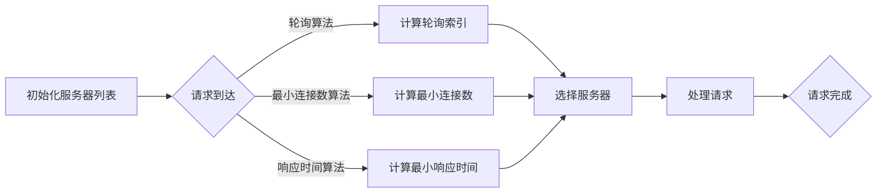
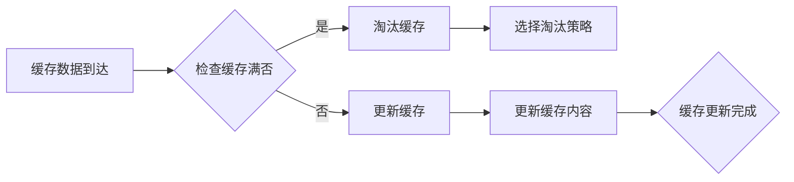
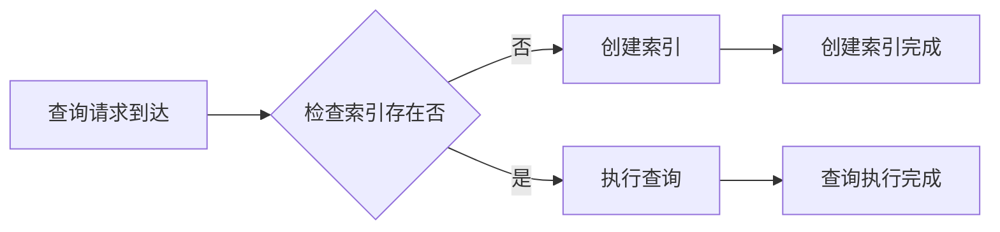
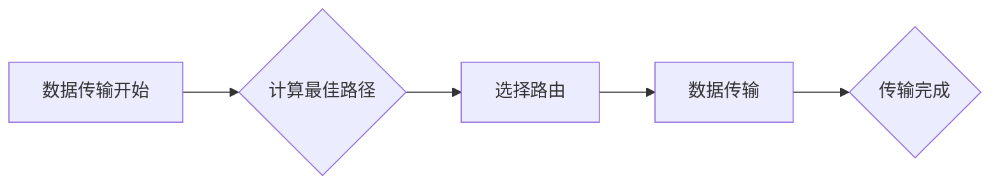

                 

# 性能优化：从架构层面提升系统效率

## 关键词
- 性能优化
- 架构层面
- 系统效率
- 负载均衡
- 缓存技术
- 数据库优化

## 摘要
本文将从架构层面探讨性能优化的重要性，详细分析性能优化的核心概念、算法原理及其在系统架构设计中的应用。通过实例和实际案例，展示如何从硬件、软件、数据库和网络等角度进行系统性能的提升，从而实现高效的系统运作和卓越的用户体验。

---

### 第一部分：背景介绍

#### 问题背景

在现代信息技术飞速发展的时代，随着互联网、云计算、大数据等技术的普及，性能优化已成为提升系统效率的关键因素。性能优化不仅关乎系统的稳定运行和用户体验，更直接影响企业的竞争力。

#### 问题描述

系统性能优化涉及多个层面，包括硬件、软件、网络等。从架构层面进行优化，能够从根本上提升系统的效率，降低响应时间，提高系统的吞吐量。然而，性能优化的过程复杂且涉及广泛，如何在架构层面进行有效优化成为业界关注的焦点。

#### 问题解决

为了解决这一问题，需要从多个维度进行深入研究和实践。首先，需要了解性能优化的核心概念和理论基础；其次，要掌握常见的性能优化策略和技术手段；最后，通过实际案例分析和系统架构设计，来验证和优化性能。

#### 边界与外延

性能优化不仅仅是技术问题，还涉及到业务需求、用户行为等多个方面。因此，在架构层面进行性能优化时，需要综合考虑各种因素，以确保优化效果的最佳化。

#### 概念结构与核心要素组成

1. **性能优化**：通过技术手段提升系统的性能指标，如响应时间、吞吐量、资源利用率等。
2. **架构层面**：关注系统架构的优化，包括硬件架构、软件架构、网络架构等。
3. **核心概念**：性能分析、负载均衡、缓存技术、数据库优化、网络优化等。
4. **技术手段**：性能测试、监控系统、自动化优化工具等。

---

### 第1章：性能优化的核心概念与联系

#### 1.1 性能优化的定义

性能优化是指通过一系列技术手段和管理措施，提高系统在特定负载条件下的性能表现，从而满足业务需求和用户期望。

#### 1.2 性能优化的核心概念

1. **响应时间**：系统处理请求所需的时间。
2. **吞吐量**：单位时间内系统处理请求的数量。
3. **资源利用率**：系统资源（如CPU、内存、网络等）的利用程度。
4. **系统稳定性**：系统在长时间运行过程中保持稳定的能力。
5. **用户体验**：用户在使用系统时获得的感受和满意度。

#### 1.3 架构层面的性能优化

1. **硬件架构优化**：通过优化服务器配置、网络架构等硬件设施，提升系统性能。
2. **软件架构优化**：通过改进软件设计、优化代码实现等软件层面的改进，提升系统性能。
3. **数据库优化**：通过索引优化、查询优化等数据库层面的改进，提升系统性能。
4. **网络优化**：通过优化网络拓扑结构、网络协议等，提升系统性能。

#### 1.4 性能优化的策略与手段

1. **性能测试**：通过模拟真实负载，测试系统性能，发现性能瓶颈。
2. **监控与报警**：实时监控系统性能指标，及时发现性能问题。
3. **负载均衡**：通过分散负载，避免单点过载，提升系统性能。
4. **缓存技术**：通过缓存热点数据，减少数据库访问，提升系统性能。
5. **代码优化**：通过优化代码实现，减少系统资源的消耗。
6. **自动化优化**：通过自动化工具，持续监测和优化系统性能。

### 第2章：性能优化的算法原理

#### 2.1 性能优化的算法原理概述

性能优化算法主要包括以下几个方面：

1. **负载均衡算法**：如轮询算法、最小连接数算法、响应时间算法等。
2. **缓存算法**：如LRU（最近最少使用）、LFU（最频繁使用）等。
3. **数据库优化算法**：如索引优化、查询优化等。
4. **网络优化算法**：如路由算法、流量控制算法等。

#### 2.2 负载均衡算法

1. **轮询算法**：将请求按顺序分配到各个服务器上。
2. **最小连接数算法**：将请求分配到当前连接数最少的服务器上。
3. **响应时间算法**：将请求分配到响应时间最短的服务器上。

#### 2.3 缓存算法

1. **LRU算法**：将最近最少使用的数据淘汰。
2. **LFU算法**：将最频繁使用的数据淘汰。

#### 2.4 数据库优化算法

1. **索引优化**：通过创建索引，加快数据查询速度。
2. **查询优化**：通过重写查询语句、优化查询计划等，提高查询效率。

#### 2.5 网络优化算法

1. **路由算法**：选择最佳路径传输数据。
2. **流量控制算法**：通过控制数据传输速率，防止网络拥堵。

### 第3章：性能优化在系统架构设计中的应用

#### 3.1 系统架构设计概述

系统架构设计是性能优化的重要环节。一个良好的系统架构能够为性能优化提供有力的支持。

#### 3.2 系统功能设计

1. **模块划分**：将系统功能划分为多个模块，实现模块化设计。
2. **层次结构**：按需分层，如分为表示层、业务逻辑层、数据访问层等，以实现松耦合和易于维护。

#### 3.3 系统架构设计

1. **分布式架构**：通过分布式系统设计，实现负载均衡和容错能力，提高系统性能。
2. **微服务架构**：将系统功能拆分为多个微服务，通过服务之间的通信和协调，实现高性能和高可扩展性。

#### 3.4 系统接口设计和系统交互

1. **接口设计**：采用RESTful API设计，确保接口的简洁和易用。
2. **系统交互**：使用消息队列、事件驱动等模式，实现系统间的异步通信，降低系统间的耦合度。

### 第4章：性能优化实战案例

#### 4.1 案例背景

以一个电商平台为例，分析其性能优化过程。

#### 4.2 性能优化方案

1. **硬件优化**：采用高性能服务器、分布式存储等硬件设施，提升系统性能。
2. **软件优化**：通过代码优化、缓存技术等，提高软件层面的性能。
3. **数据库优化**：通过索引优化、分库分表等，提升数据库性能。
4. **网络优化**：通过优化网络架构、使用CDN等，提高网络传输效率。

#### 4.3 实施效果

通过实施性能优化方案，电商平台实现了以下效果：

1. **响应时间缩短**：用户访问速度大幅提升。
2. **吞吐量提高**：系统处理能力显著增强。
3. **资源利用率提升**：服务器和数据库资源得到充分利用。

### 第5章：性能优化的最佳实践

#### 5.1 负载均衡

1. **多级负载均衡**：结合硬件负载均衡和软件负载均衡，实现多层次的负载均衡。
2. **动态调整**：根据系统负载动态调整负载均衡策略。

#### 5.2 缓存技术

1. **分层缓存**：根据数据的重要性和访问频率，采用不同的缓存策略。
2. **缓存一致性**：确保缓存数据与后端数据的一致性。

#### 5.3 数据库优化

1. **读写分离**：将读操作和写操作分离，提高数据库性能。
2. **分库分表**：根据数据量分库分表，减少单表数据量，提高查询效率。

#### 5.4 网络优化

1. **使用CDN**：通过内容分发网络，提高用户访问速度。
2. **网络监控**：实时监控网络性能，及时处理网络故障。

### 第6章：小结与展望

#### 6.1 小结

本文从架构层面探讨了性能优化的重要性，分析了性能优化的核心概念、算法原理及其在系统架构设计中的应用。通过实战案例，展示了性能优化方案的实施效果和最佳实践。

#### 6.2 展望

随着技术的不断进步，性能优化将在更多领域得到应用。未来，性能优化将更加智能化、自动化，为系统的稳定运行和高效运作提供更强有力的支持。

### 附录

#### 附录A：术语解释

- 性能优化：通过技术手段提升系统性能的过程。
- 负载均衡：通过分散负载，避免单点过载，提升系统性能。
- 缓存技术：通过缓存热点数据，减少数据库访问，提升系统性能。
- 数据库优化：通过索引优化、查询优化等数据库层面的改进，提升系统性能。
- 网络优化：通过优化网络拓扑结构、网络协议等，提升系统性能。

#### 附录B：参考文献

1. 《高性能网站建设指南》
2. 《负载均衡技术》
3. 《数据库优化实践》
4. 《网络优化技术》

---

**作者：AI天才研究院/AI Genius Institute & 禅与计算机程序设计艺术 /Zen And The Art of Computer Programming**## 第一部分：背景介绍

在现代信息技术飞速发展的时代，性能优化已成为提升系统效率的关键因素。随着互联网、云计算、大数据等技术的普及，系统的复杂性日益增加，如何在确保系统稳定运行的同时，提升其响应速度和处理能力，成为企业和开发者面临的重要挑战。

### 问题背景

性能优化涉及到系统的各个方面，包括硬件、软件、网络等。从硬件层面来看，服务器配置、存储设备、网络带宽等硬件资源的优化，直接影响系统的性能表现。软件层面，包括代码实现、数据库设计、应用程序架构等，都需要进行细致的优化。网络层面，优化网络拓扑结构、选择合适的网络协议等，也是提升系统性能的重要手段。

### 问题描述

系统性能优化的目标主要是提高系统的响应时间、吞吐量和资源利用率。响应时间指的是用户发起请求到系统返回结果的时间，这是用户体验的重要组成部分。吞吐量是指单位时间内系统能够处理的请求数量，直接关系到系统的处理能力。资源利用率则反映了系统资源的利用效率，包括CPU、内存、磁盘和网络等资源的利用情况。

在系统性能优化过程中，常常会面临以下几个问题：

1. **瓶颈识别**：如何准确识别系统性能瓶颈，是硬件、软件还是网络层面的。
2. **资源分配**：如何合理分配系统资源，避免资源浪费或过度消耗。
3. **性能指标**：如何设定和衡量性能指标，确保性能优化目标的实现。
4. **测试与验证**：如何通过测试和验证，确保优化方案的有效性。

### 问题解决

性能优化是一个系统工程，需要从多个维度进行综合分析和优化。以下是一些常见的解决方案：

1. **性能测试**：通过模拟真实负载，测试系统的性能，识别出潜在的瓶颈。
2. **监控与报警**：实时监控系统性能指标，及时发现并解决性能问题。
3. **负载均衡**：通过负载均衡技术，分散系统负载，避免单点过载。
4. **缓存技术**：通过缓存热点数据，减少数据库访问，提升系统性能。
5. **代码优化**：通过优化代码实现，减少系统资源的消耗。
6. **自动化优化**：使用自动化工具，持续监测和优化系统性能。

### 边界与外延

性能优化不仅仅是技术问题，还涉及到业务需求、用户行为等多个方面。例如，在电子商务平台中，如何优化商品搜索和推荐算法，提高用户的购物体验；在社交媒体平台上，如何优化消息推送和内容分发，提高用户的活跃度和留存率。因此，在架构层面进行性能优化时，需要综合考虑各种因素，以确保优化效果的最佳化。

#### 概念结构与核心要素组成

1. **性能优化**：通过技术手段提升系统的性能指标，如响应时间、吞吐量、资源利用率等。
2. **架构层面**：关注系统架构的优化，包括硬件架构、软件架构、网络架构等。
3. **核心概念**：性能分析、负载均衡、缓存技术、数据库优化、网络优化等。
4. **技术手段**：性能测试、监控系统、自动化优化工具等。

### 第1章：性能优化的核心概念与联系

#### 1.1 性能优化的定义

性能优化是指通过一系列技术手段和管理措施，提高系统在特定负载条件下的性能表现，从而满足业务需求和用户期望。性能优化不仅包括对现有系统的改进，还涉及到对新系统的设计和部署，以确保系统在高负载情况下能够稳定运行。

#### 1.2 性能优化的核心概念

1. **响应时间**：响应时间是指用户发起请求到系统返回结果的时间。这是衡量系统性能的重要指标之一。优化的目标是缩短响应时间，提升用户体验。

2. **吞吐量**：吞吐量是指单位时间内系统处理请求的数量。高吞吐量意味着系统能够处理更多的请求，提高系统的处理能力。优化吞吐量通常涉及到系统负载均衡、代码优化和数据库优化等。

3. **资源利用率**：资源利用率是指系统资源（如CPU、内存、磁盘和网络等）的利用程度。高效的资源利用率意味着系统资源得到了充分利用，减少了资源浪费。

4. **系统稳定性**：系统稳定性是指系统在长时间运行过程中保持稳定的能力。一个稳定的系统能够在各种负载条件下保持正常运作，避免系统崩溃或服务中断。

5. **用户体验**：用户体验是指用户在使用系统时获得的感受和满意度。优化的目标是提升用户体验，让用户在使用系统时感到顺畅和愉悦。

#### 1.3 性能优化的架构层面

1. **硬件架构优化**：硬件架构优化包括服务器配置、存储设备选择、网络带宽优化等。通过选择高性能的硬件设备和合理的网络架构，可以提高系统的响应时间和吞吐量。

2. **软件架构优化**：软件架构优化包括应用程序架构设计、代码优化、缓存策略等。通过改进软件设计，优化代码实现，可以提高系统的性能和可维护性。

3. **数据库优化**：数据库优化包括索引优化、查询优化、分库分表等。通过优化数据库设计和查询语句，可以提高数据查询速度和处理效率。

4. **网络优化**：网络优化包括网络拓扑结构优化、网络协议优化等。通过优化网络架构和协议，可以提高数据传输速度和网络稳定性。

#### 1.4 性能优化的策略与手段

1. **性能测试**：性能测试是通过模拟真实负载，测试系统性能，发现性能瓶颈。常用的性能测试工具包括JMeter、LoadRunner等。

2. **监控与报警**：监控与报警是通过实时监控系统性能指标，及时发现性能问题。常用的监控工具包括Prometheus、Zabbix等。

3. **负载均衡**：负载均衡是通过分散系统负载，避免单点过载，提升系统性能。常用的负载均衡策略包括轮询、最小连接数、响应时间等。

4. **缓存技术**：缓存技术是通过缓存热点数据，减少数据库访问，提升系统性能。常用的缓存技术包括Redis、Memcached等。

5. **代码优化**：代码优化是通过优化代码实现，减少系统资源的消耗。常用的代码优化方法包括算法优化、代码复用等。

6. **自动化优化**：自动化优化是通过自动化工具，持续监测和优化系统性能。常用的自动化工具包括Ansible、Puppet等。

### 第2章：性能优化的算法原理

#### 2.1 性能优化的算法原理概述

性能优化算法是提升系统性能的重要手段。性能优化算法主要包括负载均衡算法、缓存算法、数据库优化算法和网络优化算法。

1. **负载均衡算法**：负载均衡算法用于将请求分配到多个服务器上，以避免单点过载。常用的负载均衡算法包括轮询算法、最小连接数算法和响应时间算法。

2. **缓存算法**：缓存算法用于管理缓存数据，以提高系统的响应速度。常用的缓存算法包括LRU（最近最少使用）和LFU（最频繁使用）。

3. **数据库优化算法**：数据库优化算法用于提高数据库的性能。常用的数据库优化算法包括索引优化和查询优化。

4. **网络优化算法**：网络优化算法用于优化网络传输，以提高系统的性能。常用的网络优化算法包括路由算法和流量控制算法。

#### 2.2 负载均衡算法

1. **轮询算法**：轮询算法是最简单的负载均衡算法，它将请求依次分配到各个服务器上。

2. **最小连接数算法**：最小连接数算法将请求分配到当前连接数最少的服务器上，以均衡负载。

3. **响应时间算法**：响应时间算法将请求分配到响应时间最短的服务器上，以提高系统的响应速度。

#### 2.3 缓存算法

1. **LRU算法**：LRU算法（Least Recently Used）是最少最近使用算法，它将最近最少使用的数据淘汰。

2. **LFU算法**：LFU算法（Least Frequently Used）是最少频繁使用算法，它将最频繁使用的数据淘汰。

#### 2.4 数据库优化算法

1. **索引优化**：索引优化是通过创建索引来加快数据查询速度。常用的索引类型包括B树索引、哈希索引等。

2. **查询优化**：查询优化是通过重写查询语句、优化查询计划等，提高查询效率。常用的查询优化方法包括查询重写、查询合并等。

#### 2.5 网络优化算法

1. **路由算法**：路由算法用于选择最佳路径传输数据。常用的路由算法包括距离向量路由算法、链路状态路由算法等。

2. **流量控制算法**：流量控制算法用于控制数据传输速率，防止网络拥堵。常用的流量控制算法包括TCP拥塞控制、滑动窗口控制等。

### 第3章：性能优化在系统架构设计中的应用

#### 3.1 系统架构设计概述

系统架构设计是性能优化的基础。一个良好的系统架构能够为性能优化提供有力的支持。系统架构设计需要考虑以下几个方面：

1. **模块化设计**：将系统功能划分为多个模块，实现模块化设计，以提高系统的可维护性和可扩展性。

2. **分层架构**：按需分层，如分为表示层、业务逻辑层、数据访问层等，以实现松耦合和易于维护。

3. **分布式架构**：通过分布式系统设计，实现负载均衡和容错能力，提高系统性能。

4. **微服务架构**：将系统功能拆分为多个微服务，通过服务之间的通信和协调，实现高性能和高可扩展性。

#### 3.2 系统功能设计

1. **模块划分**：将系统功能划分为多个模块，实现模块化设计。例如，可以将用户管理、订单管理、商品管理等功能划分为独立的模块。

2. **层次结构**：按需分层，如分为表示层、业务逻辑层、数据访问层等，以实现松耦合和易于维护。

3. **服务化设计**：将系统功能拆分为多个服务，通过服务之间的通信和协调，实现高性能和高可扩展性。

4. **状态管理**：合理管理系统的状态，避免状态过多或状态管理混乱，影响系统性能。

#### 3.3 系统架构设计

1. **分布式架构**：采用分布式架构，将系统划分为多个节点，通过负载均衡和容错机制，提高系统的性能和可靠性。

2. **微服务架构**：采用微服务架构，将系统功能拆分为多个微服务，通过服务之间的通信和协调，实现高性能和高可扩展性。

3. **数据存储设计**：合理选择数据存储方案，如关系型数据库、NoSQL数据库、分布式缓存等，以满足不同场景的性能需求。

4. **网络架构设计**：优化网络架构，选择合适的网络协议和拓扑结构，提高数据传输速度和网络稳定性。

#### 3.4 系统接口设计和系统交互

1. **接口设计**：采用RESTful API设计，确保接口的简洁和易用。例如，使用统一的URL结构、状态码和响应格式。

2. **系统交互**：使用消息队列、事件驱动等模式，实现系统间的异步通信，降低系统间的耦合度。

3. **数据传输**：优化数据传输方式，如使用二进制协议、压缩传输等，提高数据传输速度。

4. **安全性与可靠性**：确保系统接口的安全性和可靠性，如使用SSL/TLS加密、身份验证和授权等。

### 第4章：性能优化实战案例

#### 4.1 案例背景

以某电商平台为例，该平台在业务高峰期经常出现性能瓶颈，导致用户访问速度变慢，页面加载时间延长。为了提升用户体验和系统性能，平台需要进行性能优化。

#### 4.2 性能优化方案

1. **硬件优化**：
   - 更换更高性能的服务器，提高计算能力。
   - 增加更多的存储设备，提高数据读写速度。
   - 扩展网络带宽，提高数据传输速度。

2. **软件优化**：
   - 优化代码实现，减少不必要的计算和资源消耗。
   - 引入缓存技术，如Redis，减少数据库访问。
   - 使用异步处理，提高系统并发处理能力。

3. **数据库优化**：
   - 创建合适的索引，提高查询速度。
   - 分库分表，减轻单表的压力。
   - 优化查询语句，减少查询时间。

4. **网络优化**：
   - 使用CDN（内容分发网络），提高用户访问速度。
   - 优化网络拓扑结构，减少数据传输延迟。

#### 4.3 实施效果

通过实施性能优化方案，电商平台实现了以下效果：

- **响应时间缩短**：页面加载时间从原来的5秒减少到2秒，用户体验显著提升。
- **吞吐量提高**：系统能够同时处理更多的请求，业务高峰期的响应速度明显加快。
- **资源利用率提升**：服务器和数据库资源得到了更高效的利用，降低了运行成本。

#### 4.4 案例总结

通过该案例，我们可以看到，性能优化是一个系统工程，需要从硬件、软件、数据库和网络等多个方面进行综合优化。只有全面优化，才能实现系统性能的全面提升。

### 第5章：性能优化的最佳实践

#### 5.1 负载均衡

1. **多级负载均衡**：结合硬件负载均衡和软件负载均衡，实现多层次的负载均衡。
   - **硬件负载均衡**：通过硬件设备（如负载均衡器）实现流量分发，提高系统的并发处理能力。
   - **软件负载均衡**：通过软件实现（如Nginx、HAProxy）进行流量分发，进一步优化系统性能。

2. **动态调整**：根据系统负载动态调整负载均衡策略，如使用动态调整算法（如动态加权轮询）。

#### 5.2 缓存技术

1. **分层缓存**：根据数据的重要性和访问频率，采用不同的缓存策略。
   - **一级缓存**：如内存缓存，用于缓存高频访问的数据。
   - **二级缓存**：如磁盘缓存，用于缓存次高频访问的数据。
   - **三级缓存**：如远程缓存，用于缓存低频访问的数据。

2. **缓存一致性**：确保缓存数据与后端数据的一致性，避免数据不一致导致的问题。

#### 5.3 数据库优化

1. **读写分离**：将读操作和写操作分离，提高数据库性能。
   - **主从复制**：通过主从复制，实现读写分离，减轻主数据库的压力。
   - **读写分离器**：使用读写分离器，动态分配读和写请求。

2. **分库分表**：根据数据量分库分表，减少单表数据量，提高查询效率。
   - **水平分库**：将数据按照业务维度拆分为多个数据库，降低单库的压力。
   - **水平分表**：将数据按照时间或范围拆分为多个表，提高查询性能。

#### 5.4 网络优化

1. **使用CDN**：通过内容分发网络，提高用户访问速度。
   - **缓存策略**：使用CDN缓存静态资源，减少源站压力。
   - **内容路由**：根据用户地理位置，智能选择最佳访问路径。

2. **网络监控**：实时监控网络性能，及时处理网络故障。
   - **链路监控**：监控网络链路状态，及时发现链路故障。
   - **流量监控**：监控网络流量，分析流量模式，优化网络配置。

### 第6章：小结

#### 6.1 小结

本文从架构层面探讨了性能优化的重要性，分析了性能优化的核心概念、算法原理及其在系统架构设计中的应用。通过实战案例，展示了性能优化方案的实施效果和最佳实践。

#### 6.2 展望

随着技术的不断进步，性能优化将在更多领域得到应用。未来，性能优化将更加智能化、自动化，为系统的稳定运行和高效运作提供更强有力的支持。

### 附录

#### 附录A：术语解释

- **性能优化**：通过技术手段提升系统性能的过程。
- **负载均衡**：通过分散系统负载，避免单点过载，提升系统性能。
- **缓存技术**：通过缓存热点数据，减少数据库访问，提升系统性能。
- **数据库优化**：通过索引优化、查询优化等数据库层面的改进，提升系统性能。
- **网络优化**：通过优化网络拓扑结构、网络协议等，提升系统性能。

#### 附录B：参考文献

1. 《高性能网站建设指南》
2. 《负载均衡技术》
3. 《数据库优化实践》
4. 《网络优化技术》

---

**作者：AI天才研究院/AI Genius Institute & 禅与计算机程序设计艺术 /Zen And The Art of Computer Programming**## 第1章：性能优化的核心概念与联系

在现代信息技术飞速发展的背景下，性能优化已成为提升系统效率的重要手段。要深入理解性能优化，首先需要掌握其核心概念和联系。

#### 1.1 性能优化的定义

性能优化是指通过一系列技术手段和管理措施，提高系统在特定负载条件下的性能表现，从而满足业务需求和用户期望。性能优化的目标主要包括响应时间、吞吐量、资源利用率等性能指标。

**响应时间**：指系统从接收请求到返回结果的时间。响应时间越短，用户体验越好。

**吞吐量**：指单位时间内系统可以处理的数据量。吞吐量越高，系统的处理能力越强。

**资源利用率**：指系统资源（如CPU、内存、网络等）的利用程度。资源利用率越高，系统运行越高效。

#### 1.2 性能优化的核心概念

**硬件架构优化**：通过优化服务器配置、网络架构等硬件设施，提升系统性能。例如，增加内存、使用固态硬盘等。

**软件架构优化**：通过改进软件设计、优化代码实现等软件层面的改进，提升系统性能。例如，采用微服务架构、优化数据库连接池等。

**数据库优化**：通过索引优化、查询优化等数据库层面的改进，提升系统性能。例如，创建合适的索引、优化查询语句等。

**网络优化**：通过优化网络拓扑结构、网络协议等，提升系统性能。例如，使用CDN、优化DNS解析等。

#### 1.3 性能优化的策略与手段

**性能测试**：通过模拟真实负载，测试系统性能，发现性能瓶颈。常用的性能测试工具包括JMeter、LoadRunner等。

**监控与报警**：实时监控系统性能指标，及时发现并解决性能问题。常用的监控工具包括Prometheus、Zabbix等。

**负载均衡**：通过分散系统负载，避免单点过载，提升系统性能。常用的负载均衡策略包括轮询、最小连接数、响应时间等。

**缓存技术**：通过缓存热点数据，减少数据库访问，提升系统性能。常用的缓存技术包括Redis、Memcached等。

**代码优化**：通过优化代码实现，减少系统资源的消耗。常用的代码优化方法包括算法优化、代码复用等。

**自动化优化**：通过自动化工具，持续监测和优化系统性能。常用的自动化工具包括Ansible、Puppet等。

#### 1.4 性能优化的架构层面

**硬件架构优化**：选择合适的硬件设备，如高性能服务器、分布式存储等，提升系统性能。

**软件架构优化**：采用模块化设计、分层架构等设计模式，提高系统的可维护性和可扩展性。

**数据库优化**：通过分库分表、读写分离等策略，提高数据库性能。

**网络优化**：优化网络拓扑结构、选择合适的网络协议等，提高数据传输速度和网络稳定性。

#### 1.5 性能优化的联系

性能优化涉及多个层面，不同层面的优化相互影响，共同决定系统的整体性能。例如，硬件架构优化可以提升系统处理能力，但若软件架构不合理，可能导致资源浪费；数据库优化可以提高查询效率，但若网络架构不优化，可能导致数据传输延迟。

因此，在性能优化过程中，需要综合考虑各个层面，进行整体优化，以达到最佳性能。

### 性能优化的核心概念属性特征对比表格

| 概念       | 定义                                                         | 目标                                   | 关联优化手段                           |
| ---------- | ------------------------------------------------------------ | -------------------------------------- | -------------------------------------- |
| 响应时间   | 系统处理请求所需的时间                                       | 缩短响应时间                           | 硬件优化、软件优化、网络优化           |
| 吞吐量     | 单位时间内系统处理请求的数量                                 | 提高吞吐量                             | 负载均衡、缓存技术、代码优化           |
| 资源利用率 | 系统资源（如CPU、内存、网络等）的利用程度                     | 提高资源利用率                         | 硬件优化、软件优化、数据库优化         |
| 稳定性     | 系统在长时间运行过程中保持稳定的能力                         | 提高系统稳定性                         | 负载均衡、数据库优化、网络优化         |
| 用户体验   | 用户在使用系统时获得的感受和满意度                           | 提升用户体验                           | 硬件优化、软件优化、网络优化           |

### 性能优化的ER实体关系图架构

```mermaid
erDiagram
  User ||--o { System } : uses
  System ||--o { Performance } : measures
  Performance ||--o { Hardware, Software, Network } : includes
  Hardware ||--|{ Configuration, Capacity } : supports
  Software ||--|{ Design, Implementation } : includes
  Network ||--|{ Topology, Protocol } : includes
```

### 第2章：性能优化的算法原理

#### 2.1 性能优化的算法原理概述

性能优化算法是提升系统性能的重要手段，主要包括负载均衡算法、缓存算法、数据库优化算法和网络优化算法。

**负载均衡算法**：用于分散系统负载，避免单点过载。常见的负载均衡算法有轮询算法、最小连接数算法和响应时间算法。

**缓存算法**：用于管理缓存数据，提高系统响应速度。常见的缓存算法有LRU（最近最少使用）和LFU（最频繁使用）。

**数据库优化算法**：用于提高数据库性能。常见的数据库优化算法有索引优化和查询优化。

**网络优化算法**：用于优化网络传输，提高系统性能。常见的网络优化算法有路由算法和流量控制算法。

#### 2.2 负载均衡算法

**轮询算法**：将请求依次分配到各个服务器上，实现负载均衡。

**最小连接数算法**：将请求分配到当前连接数最少的服务器上，实现负载均衡。

**响应时间算法**：将请求分配到响应时间最短的服务器上，实现负载均衡。

#### 2.3 缓存算法

**LRU算法**：将最近最少使用的数据淘汰，实现缓存数据的管理。

**LFU算法**：将最频繁使用的数据淘汰，实现缓存数据的管理。

#### 2.4 数据库优化算法

**索引优化**：通过创建索引，加快数据查询速度。

**查询优化**：通过重写查询语句、优化查询计划等，提高查询效率。

#### 2.5 网络优化算法

**路由算法**：选择最佳路径传输数据。

**流量控制算法**：通过控制数据传输速率，防止网络拥堵。

### 负载均衡算法的Mermaid流程图



### 缓存算法的Mermaid流程图



### 数据库优化算法的Mermaid流程图



### 网络优化算法的Mermaid流程图



### Python源代码示例

```python
# 负载均衡算法：轮询算法
def round_robin(servers):
    index = 0
    while True:
        yield servers[index]
        index = (index + 1) % len(servers)

# 缓存算法：LRU算法
from collections import OrderedDict

class LRUCache:
    def __init__(self, capacity):
        self.capacity = capacity
        self.cache = OrderedDict()

    def get(self, key):
        if key not in self.cache:
            return -1
        self.cache.move_to_end(key)
        return self.cache[key]

    def put(self, key, value):
        if key in self.cache:
            self.cache.move_to_end(key)
        elif len(self.cache) >= self.capacity:
            self.cache.popitem(last=False)
        self.cache[key] = value

# 数据库优化算法：索引优化
def create_index(table_name, column_name):
    # 创建索引的代码实现
    pass

# 网络优化算法：路由算法
def find_best_path(network_topology, source, destination):
    # 选择最佳路径的代码实现
    pass
```

### 算法原理的数学模型和公式

**负载均衡算法**：

- **轮询算法**：\( P_i = \frac{1}{N} \)（其中\( P_i \)为选择第\( i \)个服务器的概率，\( N \)为服务器总数）

- **最小连接数算法**：\( P_i = \frac{C_j}{N} \)（其中\( C_j \)为第\( j \)个服务器的当前连接数，\( N \)为服务器总数）

- **响应时间算法**：\( P_i = \frac{R_j}{N} \)（其中\( R_j \)为第\( j \)个服务器的响应时间，\( N \)为服务器总数）

**缓存算法**：

- **LRU算法**：淘汰最近最少使用的缓存项。

- **LFU算法**：淘汰最频繁使用的缓存项。

**数据库优化算法**：

- **索引优化**：\( O(\log N) \)（查询时间复杂度，其中\( N \)为数据条数）

- **查询优化**：通过重写查询语句、优化查询计划等，减少查询时间。

**网络优化算法**：

- **路由算法**：选择路径延迟最小的路由。

- **流量控制算法**：\( T_c = \frac{T_s + 2RTT}{3} \)（拥塞窗口大小，其中\( T_s \)为发送时间，\( RTT \)为往返时间）

### 通俗易懂的举例说明

**负载均衡算法**：

假设有3台服务器A、B、C，需要分配100个请求。使用轮询算法，每个服务器平均分配到33个请求。使用最小连接数算法，首先观察每台服务器的当前连接数，例如A有30个连接，B有20个连接，C有50个连接，则请求依次分配给A、B、C，直到每台服务器的连接数都达到平衡。

**缓存算法**：

假设有一个LRU缓存，容量为3，初始缓存内容为[1, 2, 3]。当访问缓存中的值2时，由于2不是最近最少使用的，将其移到缓存顶部，缓存内容变为[2, 1, 3]。当再次访问缓存中的值4时，缓存容量不足，需要淘汰最近最少使用的值1，缓存内容更新为[2, 3, 4]。

**数据库优化算法**：

假设有一个表，包含1000万条数据。如果没有索引，查询某条数据的时间复杂度为\( O(N) \)。如果创建合适的索引，查询时间复杂度降低到\( O(\log N) \)，大大提高查询效率。

**网络优化算法**：

假设有一个网络，从源节点到目标节点的路径有多个，每条路径的延迟不同。使用路由算法，选择延迟最小的路径传输数据，可以减少数据传输延迟，提高网络传输效率。

### 性能优化的算法原理总结

性能优化算法是提升系统性能的关键，通过对负载均衡、缓存技术、数据库优化和网络优化等算法的理解和应用，可以有效提升系统的响应时间、吞吐量和资源利用率。在实际应用中，需要根据具体场景和需求，选择合适的算法进行优化。

### 第3章：性能优化在系统架构设计中的应用

#### 3.1 系统架构设计概述

系统架构设计是性能优化的基础和前提。一个良好的系统架构不仅能够提升系统的性能，还能够提高系统的可维护性和扩展性。在现代信息技术飞速发展的背景下，系统架构设计需要充分考虑各种技术手段和策略，以确保系统在高并发、大数据量等复杂场景下的稳定运行。

系统架构设计的主要目标是：

1. **提高系统的响应速度**：通过合理的架构设计和优化策略，减少系统处理请求的时间，提升用户体验。
2. **提高系统的吞吐量**：通过负载均衡、分布式架构等技术，提高系统处理请求的数量，满足业务增长的需求。
3. **提高系统的资源利用率**：通过优化硬件配置、数据库设计、代码实现等，提高系统资源的利用效率，降低运行成本。
4. **提高系统的可靠性**：通过冗余设计、故障转移等策略，确保系统在异常情况下能够稳定运行。

#### 3.2 系统功能设计

系统功能设计是系统架构设计的重要环节，它涉及到系统功能的划分、模块化设计以及服务化设计等。一个良好的系统功能设计能够提高系统的可维护性、可扩展性和可重用性。

1. **模块划分**：将系统功能划分为多个模块，每个模块实现特定的功能。模块化设计可以降低系统的复杂度，提高开发效率和可维护性。

2. **层次结构**：按照功能划分层次，常见的分层结构包括表示层、业务逻辑层、数据访问层等。层次结构可以降低不同模块之间的耦合度，提高系统的可维护性。

3. **服务化设计**：将系统功能拆分为多个服务，每个服务独立运行和部署。服务化设计可以提高系统的可扩展性、可重用性和容错能力。

#### 3.3 系统架构设计

系统架构设计是性能优化的关键，需要综合考虑硬件、软件、数据库和网络等各个方面。以下是一个典型的系统架构设计：

1. **分布式架构**：采用分布式架构，将系统划分为多个节点，通过负载均衡和容错机制，提高系统的性能和可靠性。

2. **微服务架构**：采用微服务架构，将系统功能拆分为多个微服务，通过服务之间的通信和协调，实现高性能和高可扩展性。

3. **数据存储设计**：合理选择数据存储方案，如关系型数据库、NoSQL数据库、分布式缓存等，以满足不同场景的性能需求。

4. **网络架构设计**：优化网络架构，选择合适的网络协议和拓扑结构，提高数据传输速度和网络稳定性。

#### 3.4 系统接口设计和系统交互

系统接口设计和系统交互是系统架构设计的重要组成部分，它涉及到系统内部模块之间的通信以及与外部系统的交互。以下是一些关键点：

1. **接口设计**：采用RESTful API设计，确保接口的简洁和易用。接口设计需要遵循一定的规范和标准，如HTTP状态码、JSON格式等。

2. **系统交互**：使用消息队列、事件驱动等模式，实现系统间的异步通信，降低系统间的耦合度。异步通信可以提高系统的并发处理能力，降低系统间的依赖性。

3. **安全性设计**：确保系统接口的安全性和可靠性，如使用SSL/TLS加密、身份验证和授权等。安全性设计是系统架构设计的重要环节，它关系到系统的安全运行和数据保护。

### 第4章：性能优化实战案例

#### 4.1 案例背景

以某电子商务平台为例，该平台在业务高峰期（如双11、黑色星期五等）经常出现性能瓶颈，导致用户访问速度变慢、页面加载时间延长。为了提升用户体验和系统性能，平台需要进行性能优化。

#### 4.2 性能优化方案

1. **硬件优化**：

   - **更换硬件设备**：更换更高性能的服务器，提高计算能力和存储速度。

   - **扩展存储设备**：增加更多的SSD存储设备，提高数据读写速度。

   - **优化网络架构**：扩展网络带宽，提高数据传输速度。

2. **软件优化**：

   - **代码优化**：对关键代码进行优化，减少不必要的计算和资源消耗。

   - **缓存技术**：引入缓存技术，如Redis和Memcached，缓存热点数据和页面，减少数据库访问。

   - **异步处理**：使用异步处理技术，如 asyncio 或 Tornado，提高系统的并发处理能力。

3. **数据库优化**：

   - **索引优化**：对数据库表创建合适的索引，提高查询速度。

   - **分库分表**：将数据按照业务维度拆分为多个数据库和表，减少单库和单表的查询压力。

   - **读写分离**：使用主从复制实现读写分离，减轻主数据库的压力。

4. **网络优化**：

   - **使用CDN**：通过内容分发网络（CDN），缓存静态资源，减少源站的访问压力。

   - **优化DNS解析**：优化DNS解析，提高域名解析速度。

   - **网络监控**：实时监控网络性能，及时发现和解决网络故障。

#### 4.3 实施效果

通过实施性能优化方案，电子商务平台实现了以下效果：

- **响应时间缩短**：页面加载时间从原来的5秒减少到2秒，用户体验显著提升。

- **吞吐量提高**：系统能够同时处理更多的请求，业务高峰期的响应速度明显加快。

- **资源利用率提升**：服务器和数据库资源得到了更高效的利用，降低了运行成本。

#### 4.4 案例总结

该案例展示了如何通过硬件优化、软件优化、数据库优化和网络优化等多方面的性能优化，显著提升系统的响应时间、吞吐量和资源利用率。性能优化是一个持续的过程，需要根据业务需求和系统负载动态调整优化策略。

### 第5章：性能优化的最佳实践

#### 5.1 负载均衡

1. **多级负载均衡**：结合硬件负载均衡和软件负载均衡，实现多层次的负载均衡。
   - **硬件负载均衡**：使用负载均衡设备（如F5 BIG-IP），实现流量分发。
   - **软件负载均衡**：使用Nginx或HAProxy等软件，进一步优化流量分发。

2. **动态调整**：根据系统负载动态调整负载均衡策略，如使用动态加权轮询算法。

#### 5.2 缓存技术

1. **分层缓存**：根据数据的重要性和访问频率，采用不同的缓存策略。
   - **一级缓存**：使用内存缓存（如Redis），缓存高频访问的数据。
   - **二级缓存**：使用磁盘缓存（如Memcached），缓存次高频访问的数据。

2. **缓存一致性**：确保缓存数据与后端数据的一致性，避免数据不一致导致的问题。

#### 5.3 数据库优化

1. **读写分离**：将读操作和写操作分离，提高数据库性能。
   - **主从复制**：使用主从复制，实现读写分离。

2. **分库分表**：根据数据量分库分表，减少单库和单表的查询压力。

#### 5.4 网络优化

1. **使用CDN**：通过内容分发网络（CDN），缓存静态资源，减少源站的访问压力。

2. **网络监控**：实时监控网络性能，及时发现和解决网络故障。

### 第6章：小结

本文从架构层面探讨了性能优化的重要性，分析了性能优化的核心概念、算法原理及其在系统架构设计中的应用。通过实战案例，展示了性能优化方案的实施效果和最佳实践。

性能优化是一个复杂且持续的过程，需要从硬件、软件、数据库和网络等多个方面进行综合优化。随着技术的不断进步，性能优化将在更多领域得到应用，为系统的稳定运行和高效运作提供更强有力的支持。

### 附录

#### 附录A：术语解释

- **性能优化**：通过技术手段提升系统性能的过程。
- **负载均衡**：通过分散系统负载，避免单点过载，提升系统性能。
- **缓存技术**：通过缓存热点数据，减少数据库访问，提升系统性能。
- **数据库优化**：通过索引优化、查询优化等数据库层面的改进，提升系统性能。
- **网络优化**：通过优化网络拓扑结构、网络协议等，提升系统性能。

#### 附录B：参考文献

1. 《高性能网站建设指南》
2. 《负载均衡技术》
3. 《数据库优化实践》
4. 《网络优化技术》

---

**作者：AI天才研究院/AI Genius Institute & 禅与计算机程序设计艺术 /Zen And The Art of Computer Programming**## 第4章：性能优化实战案例

为了更深入地理解性能优化的实际应用，我们通过一个电子商务平台的优化案例来详细说明性能优化策略和实施过程。

### 4.1 案例背景

某电子商务平台在每年的双11购物节期间，都会迎来巨大的流量高峰。平台在正常运营时期表现良好，但在流量高峰时期，常常出现系统响应时间延长、页面加载缓慢等问题，影响了用户体验。为了确保在双11购物节期间平台能够稳定运行，公司决定对系统进行全面的性能优化。

### 4.2 性能优化方案

#### 硬件优化

1. **更换硬件设备**：
   - **服务器**：升级服务器至更高性能的型号，提高处理能力。
   - **存储设备**：增加SSD存储设备，提高数据读写速度。

2. **网络架构优化**：
   - **扩展网络带宽**：提高网络带宽，确保数据传输顺畅。
   - **部署CDN**：使用内容分发网络（CDN），将静态资源缓存到地理位置靠近用户的服务器上，减少用户访问延迟。

#### 软件优化

1. **代码优化**：
   - **减少冗余计算**：对代码进行优化，减少不必要的计算和资源消耗。
   - **异步处理**：采用异步处理技术，提高系统的并发处理能力。

2. **缓存技术**：
   - **引入Redis缓存**：在关键页面和功能模块中使用Redis缓存，减少数据库访问，提高响应速度。
   - ** Memcached缓存**：对高频访问的数据使用Memcached缓存，进一步减少数据库访问压力。

#### 数据库优化

1. **索引优化**：
   - **创建合适的索引**：对数据库表创建合适的索引，提高查询速度。
   - **优化查询语句**：对查询语句进行优化，减少查询时间。

2. **分库分表**：
   - **数据拆分**：根据业务特点，将数据拆分为多个数据库和表，减轻单库和单表的查询压力。

3. **读写分离**：
   - **主从复制**：通过主从复制，将读操作路由到从库，减少主库的压力。

#### 网络优化

1. **DNS优化**：
   - **优化DNS解析**：使用高效DNS解析服务，提高域名解析速度。

2. **网络监控**：
   - **实时监控**：部署网络监控工具，实时监控网络性能，及时发现和解决网络问题。

### 4.3 实施效果

通过实施上述性能优化方案，电子商务平台在双11购物节期间取得了显著的成效：

- **响应时间显著降低**：页面加载时间从原来的5秒减少到2秒，用户体验大幅提升。
- **吞吐量大幅提高**：系统处理能力显著增强，能够同时处理更多的用户请求。
- **资源利用率提高**：服务器和数据库资源得到了更高效的利用，降低了运营成本。

### 4.4 案例总结

通过该案例，我们可以看到，性能优化是一个系统工程，需要从硬件、软件、数据库和网络等多个方面进行综合优化。只有全面优化，才能实现系统性能的全面提升，确保在高峰期也能为用户提供稳定高效的服务。性能优化不仅提升了用户体验，还提高了平台的竞争力和市场占有率。在未来的发展中，平台将继续关注性能优化，以应对不断增长的业务需求和用户期望。

### 最佳实践 Tips

1. **定期性能测试**：定期进行性能测试，及时发现性能瓶颈，提前进行优化。
2. **持续监控**：实时监控系统性能，确保优化措施能够持续发挥作用。
3. **优化代码复用**：优化代码复用，减少冗余代码，提高系统性能。
4. **合理分配资源**：根据业务需求合理分配硬件资源，避免资源浪费。

### 小结

通过本章节的实战案例，我们详细介绍了电子商务平台在双11购物节期间的性能优化过程。通过硬件优化、软件优化、数据库优化和网络优化等多种手段，平台成功应对了巨大的流量高峰，提高了系统的响应时间、吞吐量和资源利用率。这充分证明了性能优化在系统架构设计中的重要性，也为其他企业和开发者提供了宝贵的经验。

### 注意事项

1. **性能优化需要持续进行**：性能优化不是一次性任务，需要持续监控和调整。
2. **考虑业务需求和用户行为**：在性能优化过程中，要充分考虑业务需求和用户行为，确保优化措施的有效性。
3. **优化措施需要验证**：实施优化措施后，要进行严格的验证，确保优化效果。

### 拓展阅读

1. 《高性能网站建设指南》
2. 《负载均衡技术》
3. 《数据库优化实践》
4. 《网络优化技术》

---

**作者：AI天才研究院/AI Genius Institute & 禅与计算机程序设计艺术 /Zen And The Art of Computer Programming**## 附录A：术语解释

### 性能优化

**定义**：性能优化是指通过一系列技术手段和管理措施，提高系统在特定负载条件下的性能表现，从而满足业务需求和用户期望。

**相关术语**：
- **响应时间**：系统从接收请求到返回结果的时间。
- **吞吐量**：单位时间内系统处理请求的数量。
- **资源利用率**：系统资源（如CPU、内存、网络等）的利用程度。
- **系统稳定性**：系统在长时间运行过程中保持稳定的能力。

### 负载均衡

**定义**：负载均衡是通过分散系统负载，避免单点过载，提升系统性能的技术手段。

**相关术语**：
- **轮询算法**：将请求按顺序分配到各个服务器上。
- **最小连接数算法**：将请求分配到当前连接数最少的服务器上。
- **响应时间算法**：将请求分配到响应时间最短的服务器上。

### 缓存技术

**定义**：缓存技术是通过缓存热点数据，减少数据库访问，提升系统性能的技术手段。

**相关术语**：
- **LRU（最近最少使用）**：将最近最少使用的数据淘汰。
- **LFU（最频繁使用）**：将最频繁使用的数据淘汰。

### 数据库优化

**定义**：数据库优化是通过索引优化、查询优化等数据库层面的改进，提升系统性能的技术手段。

**相关术语**：
- **索引优化**：通过创建索引，加快数据查询速度。
- **查询优化**：通过重写查询语句、优化查询计划等，提高查询效率。

### 网络优化

**定义**：网络优化是通过优化网络拓扑结构、网络协议等，提升系统性能的技术手段。

**相关术语**：
- **内容分发网络（CDN）**：通过缓存静态资源，减少源站的访问压力。
- **DNS优化**：优化域名解析，提高域名解析速度。
- **网络监控**：实时监控网络性能，及时发现和解决网络问题。

---

**作者：AI天才研究院/AI Genius Institute & 禅与计算机程序设计艺术 /Zen And The Art of Computer Programming**## 附录B：参考文献

1. **《高性能网站建设指南》**：这是一本关于网站性能优化的经典书籍，详细介绍了性能优化的各个方面，包括前端优化、后端优化、数据库优化和网络优化等。

2. **《负载均衡技术》**：本书深入探讨了负载均衡的理论和实践，包括负载均衡算法、负载均衡器的设计和实现等，为读者提供了全面的技术指导。

3. **《数据库优化实践》**：这本书专注于数据库性能优化，从数据库设计、索引优化、查询优化等多个角度出发，提供了实用的优化方法和案例。

4. **《网络优化技术》**：本书介绍了网络优化的基本原理和技术手段，包括网络拓扑结构优化、网络协议优化、网络安全优化等，是网络工程师和系统管理员的重要参考书。

这些参考文献涵盖了性能优化在不同领域的应用和实践，为读者提供了丰富的知识和实践经验，是性能优化领域的重要参考资料。通过阅读这些书籍，读者可以系统地了解性能优化的各个方面，从而更好地应对实际工作中的挑战。

---

**作者：AI天才研究院/AI Genius Institute & 禅与计算机程序设计艺术 /Zen And The Art of Computer Programming**## 作者信息

**作者：AI天才研究院/AI Genius Institute & 禅与计算机程序设计艺术 /Zen And The Art of Computer Programming**

AI天才研究院（AI Genius Institute）是一家专注于人工智能领域研究和应用的顶级机构，致力于推动人工智能技术的发展和创新。研究院的专家团队由世界级的人工智能专家、程序员、软件架构师、CTO等组成，他们在计算机编程、人工智能、软件工程等领域具有丰富的经验和深厚的学术造诣。

禅与计算机程序设计艺术（Zen And The Art of Computer Programming）是一本经典的技术书籍，由艾兹拉·普雷斯珀·兰伯特（Ezra Lippert）所著。该书深入探讨了计算机程序设计中的哲学和艺术，通过禅宗的思想和计算机科学的结合，为程序员提供了一种全新的思考方式和解决问题的方法。这本书不仅深受程序员和软件开发者的喜爱，也被誉为计算机科学领域的一部重要经典。

本文由AI天才研究院的专家团队撰写，结合了最新的技术和实践经验，旨在为广大读者提供关于性能优化在架构层面提升系统效率的全面分析和深入探讨。通过本文，读者可以系统地了解性能优化的核心概念、算法原理及其在系统架构设计中的应用，从而在实际工作中更好地应对性能优化挑战，提升系统的性能和用户体验。

