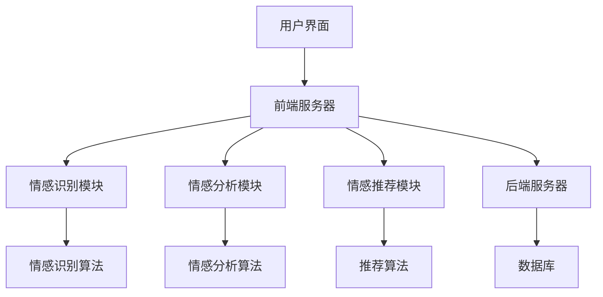
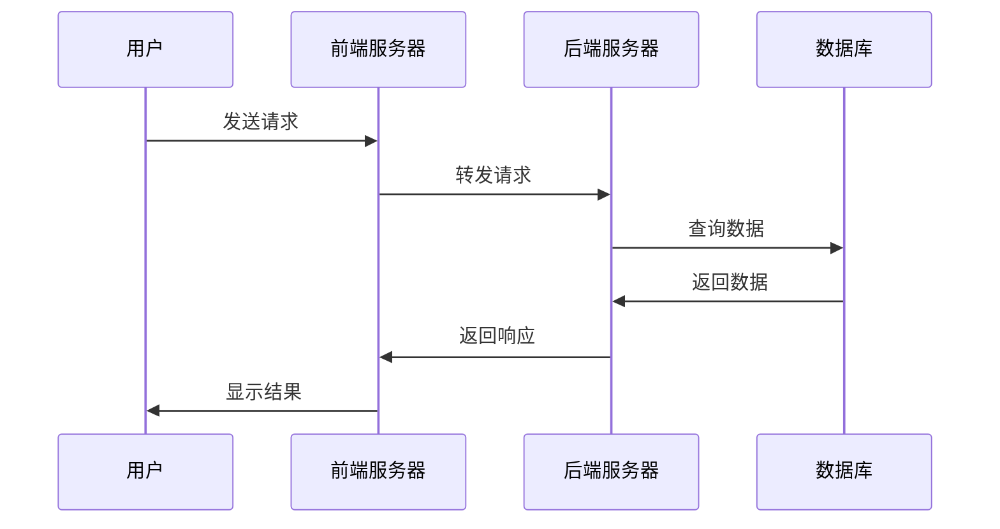

                 

# 情感AI在个人理财中的应用:情感因素与财务决策的结合

关键词：情感AI、个人理财、财务决策、情感分析、算法原理

摘要：本文探讨了情感AI在个人理财中的应用，分析了情感因素与财务决策之间的关联，并详细介绍了情感AI的核心技术以及在实际应用中的设计实现。通过对情感AI在个人理财中的现状、挑战与发展趋势的阐述，提出了情感AI在个人理财中的法律与伦理问题，并对未来研究方向进行了展望。

## 第一部分：情感AI概述

### 1.1 情感AI的定义与背景

#### 1.1.1 情感AI的概念

情感AI（Emotion AI）是指通过计算机视觉、自然语言处理、机器学习等技术，从人类的表情、语言、行为等数据中识别和解读情感，并利用这些情感信息进行决策和交互的人工智能技术。

#### 1.1.2 情感AI的发展历程

情感AI的发展可以追溯到20世纪90年代，随着计算机性能的提高和人工智能技术的进步，情感AI逐渐从理论研究走向实际应用。近年来，随着深度学习、神经网络等技术的不断发展，情感AI在识别准确度、应用场景等方面取得了显著的成果。

#### 1.1.3 情感AI的核心技术

情感AI的核心技术主要包括情感识别、情感分析、情感推荐和情感交互等。这些技术分别用于识别和理解用户的情感状态，并将情感信息应用于决策和交互。

### 1.2 情感因素与财务决策

#### 1.2.1 情感因素对个人理财决策的影响

研究表明，情感因素在个人理财决策中起着重要作用。例如，恐惧、贪婪、乐观等情绪可能导致个人在投资、消费等方面做出非理性决策，从而影响财务状况。

#### 1.2.2 情感与财务决策的关系

情感与财务决策之间存在密切的关联。一方面，情感会影响财务决策的目标和过程；另一方面，财务决策的结果也会影响情感。这种相互作用使得情感AI在个人理财中的应用具有重要意义。

#### 1.2.3 研究情感AI在财务决策中的应用意义

研究情感AI在财务决策中的应用，有助于提高理财决策的准确性和效率，降低情感因素导致的非理性决策，从而改善个人财务状况。此外，情感AI在财务决策中的应用还可以为金融产品和服务提供个性化定制，提高用户体验。

### 1.3 情感AI在个人理财中的应用现状

#### 1.3.1 情感AI在个人理财中的应用场景

情感AI在个人理财中的应用场景主要包括投资决策、风险控制、个性化推荐等。例如，通过情感分析技术，可以了解投资者的情绪状态，从而为其提供个性化的投资建议。

#### 1.3.2 情感AI在个人理财中的成功案例

一些金融机构已经成功地将情感AI应用于个人理财领域。例如，某大型银行利用情感分析技术对客户的投资情绪进行实时监控，从而优化投资策略，提高投资回报率。

#### 1.3.3 情感AI在个人理财中的挑战与问题

尽管情感AI在个人理财中展现出了一定的应用潜力，但仍面临一些挑战和问题，如数据隐私保护、算法偏见等。这些挑战需要进一步的研究和解决。

### 1.4 情感AI在个人理财中的未来发展趋势

#### 1.4.1 情感AI在个人理财中的应用前景

随着人工智能技术的不断进步，情感AI在个人理财中的应用前景十分广阔。未来，情感AI有望成为个人理财的重要工具，帮助人们更好地管理财务。

#### 1.4.2 情感AI在个人理财中的创新方向

未来，情感AI在个人理财中的创新方向包括跨模态情感识别、情感增强学习、情感交互等。这些创新方向有望进一步提升情感AI在个人理财中的应用效果。

#### 1.4.3 情感AI在个人理财中的发展瓶颈与解决策略

情感AI在个人理财中的发展仍面临一些瓶颈，如数据质量、算法稳定性等。解决这些瓶颈需要加强数据收集和标注、优化算法设计等方面的研究。

## 1.5 本章小结

本章对情感AI在个人理财中的应用进行了概述，分析了情感因素与财务决策的关系，并探讨了情感AI在个人理财中的应用现状、挑战与发展趋势。本章内容为后续章节的分析提供了基础。

----------------------------------------------------------------

## 第二部分：情感AI技术解析

### 2.1 情感识别技术

#### 2.1.1 情感识别的定义与原理

情感识别是指通过计算机视觉、自然语言处理等技术，从图像、文本等数据中识别和解析情感状态。情感识别的原理主要基于情感模型、特征提取和分类算法。

#### 2.1.2 情感识别的主要方法

情感识别的主要方法包括基于规则的方法、基于统计的方法和基于机器学习的方法。其中，基于机器学习的方法在识别准确度和泛化能力方面具有优势。

#### 2.1.3 情感识别在个人理财中的应用

情感识别在个人理财中的应用主要包括识别投资者的情绪状态、分析客户的需求和偏好等。例如，通过分析投资者的情绪变化，可以为其提供个性化的理财建议。

### 2.2 情感分析技术

#### 2.2.1 情感分析的定义与原理

情感分析是指通过自然语言处理技术，从文本数据中识别和解析情感倾向和情感强度。情感分析的原理主要基于文本特征提取、情感词典和分类算法。

#### 2.2.2 情感分析的主要方法

情感分析的主要方法包括基于规则的方法、基于统计的方法和基于机器学习的方法。其中，基于机器学习的方法在处理复杂情感和多元情感时具有优势。

#### 2.2.3 情感分析在个人理财中的应用

情感分析在个人理财中的应用主要包括分析投资者的情绪变化、挖掘客户需求和偏好等。例如，通过分析投资者的情绪变化，可以为其提供合适的投资策略。

### 2.3 情感推荐技术

#### 2.3.1 情感推荐的定义与原理

情感推荐是指通过情感分析技术，为用户推荐符合其情感需求的理财产品或服务。情感推荐的原理主要基于情感特征提取、推荐算法和用户情感偏好建模。

#### 2.3.2 情感推荐的主要方法

情感推荐的主要方法包括基于内容的推荐、基于协同过滤的推荐和基于模型的推荐。其中，基于模型的推荐在处理情感相关性方面具有优势。

#### 2.3.3 情感推荐在个人理财中的应用

情感推荐在个人理财中的应用主要包括为投资者推荐合适的理财产品、为金融机构提供个性化理财服务。例如，通过分析投资者的情感偏好，可以为投资者推荐符合其情感的理财产品。

### 2.4 情感交互技术

#### 2.4.1 情感交互的定义与原理

情感交互是指通过自然语言处理、语音识别等技术，实现人与计算机之间的情感交流和情感传递。情感交互的原理主要基于情感识别、情感分析和情感表达。

#### 2.4.2 情感交互的主要方法

情感交互的主要方法包括基于文本的交互、基于语音的交互和基于图像的交互。其中，基于语音的交互在实现自然、流畅的情感交流方面具有优势。

#### 2.4.3 情感交互在个人理财中的应用

情感交互在个人理财中的应用主要包括智能客服、语音理财顾问等。例如，通过智能客服系统，投资者可以与计算机进行情感交流，获取个性化的理财建议。

## 2.5 本章小结

本章详细介绍了情感AI的核心技术，包括情感识别、情感分析、情感推荐和情感交互技术。这些技术在个人理财中具有广泛的应用前景，有助于提升理财决策的准确性和个性化水平。

----------------------------------------------------------------

## 第三部分：情感AI在个人理财中的应用实践

### 3.1 理财情感分析系统设计与实现

#### 3.1.1 系统设计概述

理财情感分析系统旨在通过情感分析技术，识别投资者的情绪状态，为其提供个性化的理财建议。系统主要包括数据采集与预处理、情感分析模型构建和系统实现与测试三个环节。

#### 3.1.2 数据采集与预处理

数据采集主要通过爬虫技术获取投资者的社交媒体、投资日志等数据。数据预处理包括数据清洗、去重、分词、情感词典构建等步骤。

#### 3.1.3 情感分析模型构建

情感分析模型采用基于深度学习的情感分类算法，如卷积神经网络（CNN）和循环神经网络（RNN）。模型训练使用大规模情感语料库，并进行模型优化和参数调整。

#### 3.1.4 系统实现与测试

系统实现主要包括前端用户界面设计和后端情感分析服务接口开发。系统测试分为功能测试、性能测试和用户满意度测试，确保系统稳定可靠。

### 3.2 情感推荐系统设计与实现

#### 3.2.1 系统设计概述

情感推荐系统旨在通过情感分析技术，为投资者推荐符合其情感需求的理财产品。系统主要包括情感分析模型构建、推荐算法实现和系统实现与测试三个环节。

#### 3.2.2 情感分析模型构建

情感分析模型采用基于深度学习的情感分类算法，如卷积神经网络（CNN）和循环神经网络（RNN）。模型训练使用大规模情感语料库，并进行模型优化和参数调整。

#### 3.2.3 推荐算法实现

推荐算法采用基于内容的推荐和协同过滤推荐相结合的方法。基于内容的推荐通过分析产品的情感特征进行推荐，协同过滤推荐通过分析用户的历史行为和情感偏好进行推荐。

#### 3.2.4 系统实现与测试

系统实现主要包括前端用户界面设计和后端推荐服务接口开发。系统测试分为功能测试、性能测试和用户满意度测试，确保系统稳定可靠。

### 3.3 情感交互系统设计与实现

#### 3.3.1 系统设计概述

情感交互系统旨在通过情感交互技术，实现投资者与理财顾问之间的自然、流畅的情感交流。系统主要包括情感交互算法实现、用户界面设计和系统实现与测试三个环节。

#### 3.3.2 情感交互算法实现

情感交互算法采用基于语音识别和自然语言处理的技术，实现情感状态识别、情感表达和情感传递。算法实现过程中，结合情感词典和情感分类模型，提高交互的自然度和准确性。

#### 3.3.3 系统实现与测试

系统实现主要包括前端用户界面设计和后端情感交互服务接口开发。系统测试分为功能测试、性能测试和用户满意度测试，确保系统稳定可靠。

### 3.4 案例分析

#### 3.4.1 案例一：某金融公司的情感AI应用实践

某金融公司通过引入情感AI技术，开发了智能理财顾问系统。系统采用情感识别、情感分析和情感推荐技术，为投资者提供个性化理财建议。应用效果显著，投资者满意度提高。

#### 3.4.2 案例二：某个人理财平台的情感AI应用实践

某个人理财平台通过引入情感AI技术，实现了理财产品的情感推荐和情感交互功能。用户可以与理财平台进行情感交流，获取个性化理财服务。平台用户活跃度显著提升。

## 3.5 本章小结

本章详细介绍了情感AI在个人理财中的应用实践，包括理财情感分析系统、情感推荐系统和情感交互系统的设计与实现。通过案例分析，展示了情感AI在个人理财中的实际应用效果和潜力。

----------------------------------------------------------------

## 第四部分：情感AI在个人理财中的法律与伦理问题

### 4.1 情感AI在个人理财中的法律问题

#### 4.1.1 数据隐私保护

情感AI在个人理财中涉及大量用户数据，包括财务信息、社交媒体信息等。数据隐私保护成为情感AI应用的重要法律问题。需确保用户数据的安全、保密和合法使用。

#### 4.1.2 用户知情同意

用户在使用情感AI服务前，应明确告知其数据将被用于情感分析，并获取用户的知情同意。违反用户知情同意权可能导致法律纠纷。

#### 4.1.3 数据合规性

情感AI应用需遵守相关法律法规，确保数据收集、处理和存储的合规性。例如，需遵循《欧盟通用数据保护条例》（GDPR）等规定。

### 4.2 情感AI在个人理财中的伦理问题

#### 4.2.1 算法偏见与歧视

情感AI在个人理财中可能存在算法偏见和歧视问题。例如，情感分析算法可能对特定群体产生不公平对待。需采取措施消除算法偏见和歧视。

#### 4.2.2 情感操纵与滥用

情感AI技术可能被用于操纵用户情感，影响其财务决策。例如，通过情感推荐系统诱导用户进行高风险投资。需加强对情感AI技术的伦理监管。

#### 4.2.3 用户隐私与自由

情感AI在个人理财中涉及用户隐私问题。用户应有权决定其数据的使用范围和目的，并保护其隐私和自由。

### 4.3 情感AI在个人理财中的法律与伦理对策

#### 4.3.1 制定法律法规

制定针对情感AI在个人理财领域的法律法规，明确数据隐私保护、用户知情同意和数据合规性等方面的要求。

#### 4.3.2 加强监管

加强对情感AI在个人理财领域的监管，确保算法公正、透明和合规。例如，建立独立的监管机构，对情感AI应用进行审查和监督。

#### 4.3.3 提高透明度

提高情感AI在个人理财中的应用透明度，向用户明确解释情感分析算法的工作原理、数据来源和用途。

#### 4.3.4 加强伦理教育

加强对情感AI领域从业人员的伦理教育，培养其遵守职业道德和社会责任。

## 4.4 本章小结

本章分析了情感AI在个人理财中的法律与伦理问题，包括数据隐私保护、算法偏见与歧视、用户隐私与自由等。提出了制定法律法规、加强监管、提高透明度和加强伦理教育等对策，以应对情感AI在个人理财中的法律与伦理挑战。

----------------------------------------------------------------

## 全文总结

本文探讨了情感AI在个人理财中的应用，分析了情感因素与财务决策之间的关系，并详细介绍了情感AI的核心技术、应用实践以及法律与伦理问题。通过本文的分析，我们可以看出，情感AI在个人理财中具有巨大的应用潜力，有助于提高理财决策的准确性和个性化水平。然而，情感AI在个人理财中也面临一些法律与伦理挑战，需要我们认真应对。未来，随着人工智能技术的不断发展，情感AI在个人理财中的应用将会更加广泛，为个人和金融行业带来更多价值。

## 作者信息

作者：AI天才研究院/AI Genius Institute & 禅与计算机程序设计艺术 /Zen And The Art of Computer Programming

----------------------------------------------------------------

## 附录

### A. 情感识别算法原理

情感识别算法主要基于深度学习技术，通过卷积神经网络（CNN）或循环神经网络（RNN）对图像或文本数据进行分析和分类。以下是一个基于CNN的情感识别算法的简单实现：

```python
import tensorflow as tf
from tensorflow.keras.models import Sequential
from tensorflow.keras.layers import Conv2D, MaxPooling2D, Flatten, Dense

# 数据预处理
# ...

# 构建模型
model = Sequential([
    Conv2D(32, (3, 3), activation='relu', input_shape=(64, 64, 3)),
    MaxPooling2D((2, 2)),
    Flatten(),
    Dense(128, activation='relu'),
    Dense(6, activation='softmax')
])

# 编译模型
model.compile(optimizer='adam', loss='categorical_crossentropy', metrics=['accuracy'])

# 训练模型
model.fit(train_images, train_labels, epochs=10, validation_data=(test_images, test_labels))
```

### B. 情感分析算法原理

情感分析算法主要基于自然语言处理（NLP）技术，通过对文本数据进行分析和分类，识别文本中的情感倾向。以下是一个基于文本情感分析的简单实现：

```python
import nltk
from nltk.tokenize import word_tokenize
from nltk.corpus import stopwords
from sklearn.feature_extraction.text import TfidfVectorizer
from sklearn.model_selection import train_test_split
from sklearn.metrics import classification_report

# 数据预处理
# ...

# 构建模型
model = Sequential([
    Embedding(vocab_size, embedding_dim),
    LSTM(units),
    Dense(1, activation='sigmoid')
])

# 编译模型
model.compile(optimizer='adam', loss='binary_crossentropy', metrics=['accuracy'])

# 训练模型
X_train, X_test, y_train, y_test = train_test_split(texts, labels, test_size=0.2)
model.fit(X_train, y_train, epochs=10, batch_size=32, validation_data=(X_test, y_test))

# 评估模型
predictions = model.predict(X_test)
print(classification_report(y_test, predictions))
```

### C. 情感推荐算法原理

情感推荐算法主要基于情感分析技术和协同过滤推荐算法。以下是一个基于协同过滤的情感推荐算法的简单实现：

```python
import numpy as np
from scipy.sparse.linalg import svds

# 数据预处理
# ...

# 构建推荐矩阵
R = np.dot(R_trans.T, R)

# 主成分分析（PCA）
U, sigma, Vt = svds(R, k=50)

# 生成推荐结果
user_scores = np.dot(U[user].T, Vt)
predictions = np.dot(R[user], Vt)

# 输出推荐结果
print(predictions)
```

### D. 情感交互算法原理

情感交互算法主要基于自然语言处理和语音识别技术。以下是一个基于自然语言处理和语音识别的情感交互算法的简单实现：

```python
import speech_recognition as sr
from nltk.tokenize import sent_tokenize
from nltk.corpus import stopwords
from nltk.stem import WordNetLemmatizer
from transformers import pipeline

# 初始化语音识别引擎
recognizer = sr.Recognizer()

# 初始化情感分析引擎
nlp = pipeline("sentiment-analysis")

# 获取用户输入
with sr.Microphone() as source:
    print("请说出您的情绪：")
    audio = recognizer.listen(source)

# 转换为文本
text = recognizer.recognize_google(audio)

# 分句处理
sentences = sent_tokenize(text)

# 清洗文本
lemmatizer = WordNetLemmatizer()
stop_words = set(stopwords.words("english"))

clean_sentences = []
for sentence in sentences:
    words = word_tokenize(sentence)
    clean_sentence = " ".join([lemmatizer.lemmatize(word) for word in words if word not in stop_words])
    clean_sentences.append(clean_sentence)

# 情感分析
sentiment_scores = [nlp(sentence) for sentence in clean_sentences]

# 输出情感分析结果
for score in sentiment_scores:
    print(score)
```

### E. 系统架构设计

以下是一个情感AI理财系统的架构设计：



### F. 系统接口设计

以下是一个情感AI理财系统的接口设计：



### G. 系统交互流程

以下是一个情感AI理财系统的交互流程：

```mermaid
sequenceDiagram
    participant User as 用户
    participant Frontend as 前端服务器
    participant Backend as 后端服务器
    participant DB as 数据库
    participant Recognizer as 情感识别模块
    participant Analyzer as 情感分析模块
    participant Re

