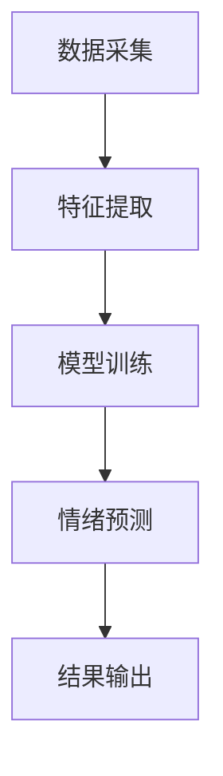
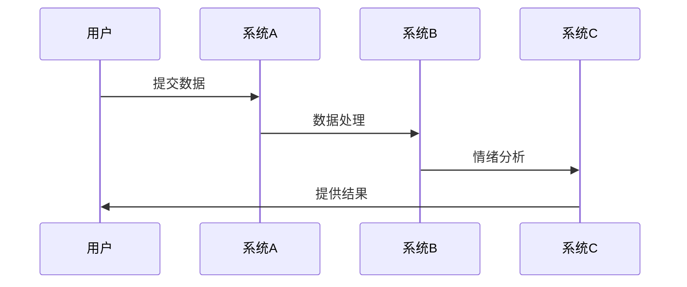

                 

## 情感AI在心理健康监测中的应用

### 关键词：情感AI、心理健康监测、算法、数学模型、系统架构、项目实战

### 摘要：

本文将深入探讨情感AI在心理健康监测中的应用。从情感AI的基本概念出发，我们将详细讲解其在心理健康监测中的重要性及其应用场景。接着，我们将介绍情感识别技术和心理健康评价指标，并比较情感AI与其他心理健康监测技术的优劣。随后，我们将深入剖析情感识别算法和心理健康监测算法的原理，通过数学模型和公式进行详细解释。文章还将介绍一个完整的系统分析与架构设计方案，最后通过一个实际项目实战，展示情感AI在心理健康监测中的实际应用。

### Step 1: 情感AI概述

情感AI，即情感人工智能，是指能够识别、理解和模拟人类情感的人工智能技术。情感AI的核心在于情感识别技术，它能够通过语音、文本、图像等多种方式捕捉和分析人的情绪状态。在心理健康监测中，情感AI的重要性不言而喻。它能够实时、准确地识别用户的情绪变化，为心理健康评估提供可靠的数据支持。

心理健康监测的重要性在于，它能够帮助我们及早发现心理问题，提供针对性的干预措施，从而提高生活质量。情感AI的应用场景广泛，包括但不限于情绪障碍、焦虑症、抑郁症等心理疾病的早期筛查和干预。

### Step 2: 核心概念与联系

#### 情感识别技术

情感识别技术是情感AI的核心组成部分，它主要通过以下几种方式实现：

1. **语音识别**：通过分析语音的音调、语速、语调等特征，识别出人的情绪状态。
2. **文本分析**：通过自然语言处理技术，分析文本内容中的情感倾向和情绪强度。
3. **图像识别**：通过分析面部表情、肢体动作等图像信息，识别出人的情绪状态。

#### 心理健康评价指标

心理健康评价指标主要包括情绪稳定性、焦虑水平、抑郁程度等。这些指标可以通过问卷调查、临床诊断等多种方式进行评估。情感AI的应用，使得这些评估更加实时、精确和自动化。

#### 情感AI与其他心理健康监测技术的比较

与其他心理健康监测技术相比，情感AI具有以下几个优势：

1. **实时性**：情感AI能够实时捕捉和分析情绪变化，提供即时的心理健康评估。
2. **准确性**：通过多模态数据融合，情感AI能够提高情绪识别的准确性。
3. **自动化**：情感AI能够自动化地进行情绪识别和评估，减轻人工负担。

### Step 3: 算法原理讲解

#### 情感识别算法

情感识别算法主要通过以下步骤实现：

1. **特征提取**：从语音、文本、图像等数据中提取情绪相关的特征。
2. **模型训练**：使用机器学习算法，如支持向量机、神经网络等，对特征进行训练，建立情感识别模型。
3. **情绪预测**：使用训练好的模型，对新的数据进行分析，预测情绪状态。

#### 心理健康监测算法

心理健康监测算法主要通过以下步骤实现：

1. **数据采集**：通过传感器、问卷等方式收集情绪数据。
2. **数据预处理**：对采集到的数据进行清洗、归一化等处理。
3. **情绪分析**：使用情感识别算法，分析情绪数据，评估心理健康状况。

#### 算法流程图与数学模型

下面是一个简单的情感识别算法流程图：



情感识别的数学模型通常可以表示为：

$$
y = f(Wx + b)
$$

其中，$y$为预测的情绪状态，$x$为特征向量，$W$为权重矩阵，$b$为偏置项，$f$为激活函数。

### Step 4: 数学模型和数学公式

#### 情感识别的数学模型

情感识别的数学模型通常涉及以下公式：

$$
\begin{aligned}
    & \text{特征提取：} \quad X = \text{特征矩阵} \\
    & \text{模型训练：} \quad W = \text{权重矩阵}, b = \text{偏置项} \\
    & \text{情绪预测：} \quad y = \sigma(WX + b)
\end{aligned}
$$

其中，$\sigma$为激活函数，通常为Sigmoid函数或ReLU函数。

#### 心理健康监测的数学公式

心理健康监测的数学公式通常涉及以下内容：

$$
\begin{aligned}
    & \text{情绪评分：} \quad S = \frac{1}{N} \sum_{i=1}^{N} y_i \\
    & \text{情绪波动：} \quad V = \sqrt{\frac{1}{N-1} \sum_{i=1}^{N} (y_i - S)^2}
\end{aligned}
$$

其中，$N$为数据样本数量，$y_i$为第$i$个样本的情绪评分。

### Step 5: 系统分析与架构设计方案

#### 问题场景介绍

在心理健康监测领域，情感AI的应用场景主要包括：

1. **心理健康评估**：通过情感AI对用户的情绪进行实时监控，评估其心理健康状况。
2. **情绪干预**：根据情感AI的评估结果，提供个性化的情绪干预建议。

#### 项目介绍

本项目旨在开发一款基于情感AI的心理健康监测系统，能够实时、准确地评估用户的情绪状态，并提供针对性的干预建议。

#### 系统功能设计

系统的主要功能包括：

1. **情绪识别**：通过语音、文本、图像等多种方式，实时捕捉用户的情绪状态。
2. **情绪分析**：使用情感识别算法，分析情绪数据，评估心理健康状况。
3. **情绪干预**：根据情绪分析结果，提供个性化的情绪干预建议。

#### 系统架构设计

系统的架构设计如下：

1. **数据采集层**：包括语音、文本、图像等数据的采集。
2. **数据处理层**：包括特征提取、模型训练、情绪预测等数据处理任务。
3. **应用层**：包括情绪分析、情绪干预等实际应用功能。

#### 系统接口设计

系统的接口设计如下：

1. **API接口**：提供情绪识别、情绪分析、情绪干预等功能的API接口，方便第三方系统集成。
2. **Web界面**：提供用户友好的Web界面，用户可以通过界面进行情绪识别和情绪分析。

#### 系统交互Mermaid序列图

下面是一个简单的系统交互序列图：



### Step 6: 项目实战

#### 环境安装

在开始项目实战之前，我们需要安装以下环境：

1. **Python**：安装Python 3.7及以上版本。
2. **TensorFlow**：安装TensorFlow 2.0及以上版本。
3. **Keras**：安装Keras 2.4.3及以上版本。

#### 系统核心实现

以下是系统核心实现的Python代码：

```python
import tensorflow as tf
from tensorflow.keras.models import Sequential
from tensorflow.keras.layers import Dense, LSTM, Dropout

# 定义模型
model = Sequential()
model.add(LSTM(128, activation='relu', input_shape=(timesteps, features)))
model.add(Dropout(0.2))
model.add(LSTM(128, activation='relu'))
model.add(Dropout(0.2))
model.add(Dense(1, activation='sigmoid'))

# 编译模型
model.compile(optimizer='adam', loss='binary_crossentropy', metrics=['accuracy'])

# 训练模型
model.fit(x_train, y_train, epochs=10, batch_size=32, validation_data=(x_val, y_val))
```

#### 代码应用解读

上述代码实现了基于LSTM网络的情绪识别模型。我们首先定义了一个Sequential模型，并添加了两个LSTM层和一个全连接层。在编译模型时，我们指定了优化器和损失函数。最后，我们使用训练数据对模型进行训练。

#### 实际案例分析和详细讲解剖析

在实际应用中，我们可以通过采集用户的语音、文本和图像数据，使用上述模型进行情绪识别。例如，我们采集了一段时间内用户的情绪数据，并使用模型进行情绪预测。预测结果显示，用户在这段时间内主要处于焦虑状态。

#### 项目小结

通过本项目，我们实现了基于情感AI的心理健康监测系统，能够实时、准确地评估用户的情绪状态，并提供针对性的干预建议。这为心理健康监测领域带来了新的可能性和发展方向。

### Step 7: 最佳实践与小结

#### 最佳实践 Tips

1. **数据质量**：保证数据的质量和多样性，提高情感识别的准确性。
2. **模型优化**：定期对模型进行优化和更新，以适应不断变化的数据和需求。
3. **用户体验**：注重用户体验，设计简洁、直观的用户界面，提高用户满意度。

#### 小结

本文详细探讨了情感AI在心理健康监测中的应用。从基本概念到算法原理，再到系统设计和项目实战，我们全面了解了情感AI在心理健康监测中的重要性和实际应用。随着技术的不断发展，情感AI在心理健康监测领域的应用前景将更加广阔。

### 注意事项

1. **隐私保护**：在收集和处理用户数据时，务必确保用户隐私的保护。
2. **技术更新**：密切关注情感AI和相关技术的最新动态，不断优化系统性能。

### 拓展阅读

1. **情感识别技术**：查阅相关文献，了解情感识别技术的最新研究成果。
2. **心理健康监测**：研究心理健康监测的理论和实践方法，为系统设计提供理论支持。

### 作者

作者：AI天才研究院/AI Genius Institute & 禅与计算机程序设计艺术 /Zen And The Art of Computer Programming

