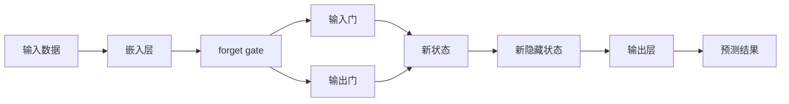
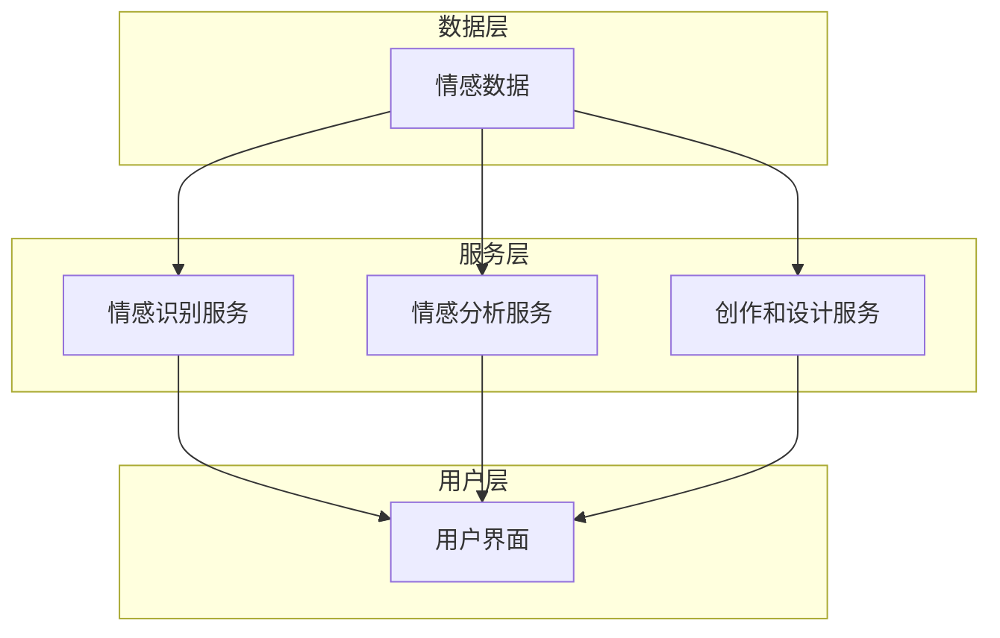
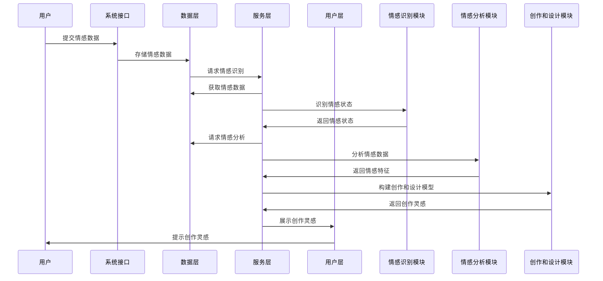

                 

# 《情感AI对人类创造力发展的影响》

## 关键词

- 情感AI
- 创造力发展
- 情感计算
- 算法原理
- 系统架构
- 实战案例

## 摘要

本文旨在探讨情感AI对人类创造力发展的影响。情感AI是指利用机器学习和情感计算技术模拟人类情感的人工智能系统。随着人工智能技术的不断发展，情感AI在多个领域得到了广泛应用。本文将首先介绍情感AI的核心概念和原理，然后分析其如何通过情感识别和分析激发人类创造力。此外，还将介绍相关算法、系统架构设计以及实战案例，以期为读者提供全面的技术视角和深入思考。

## 背景介绍

### 核心概念术语说明

- **情感AI**：利用机器学习和情感计算技术模拟人类情感的人工智能系统。
- **情感计算**：通过模拟人脑的情感处理机制，实现情感信息的获取、处理、理解和表达的技术。
- **创造力**：产生新颖、有价值的想法和解决方案的能力。
- **创造力发展**：个体在生活和学习过程中，创造力水平的逐步提升。

### 问题背景

近年来，人工智能（AI）技术取得了显著的进展，其在各个领域中的应用日益广泛。情感AI作为AI的一个重要分支，通过模拟人类情感，为人类带来了更多可能。然而，情感AI对人类创造力发展的影响尚未得到充分研究。了解这一影响对于推动AI技术的发展和人类创造力的提升具有重要意义。

### 问题描述

人类创造力的发展受到多种因素的影响，包括个人经验、情感状态、环境刺激等。情感AI通过识别和分析人类情感，为人类提供情感支持和激励，从而可能对创造力发展产生积极影响。然而，这一过程如何实现、情感AI的具体作用机制以及其潜在的限制和挑战仍需进一步探讨。

### 问题解决

本文将通过以下几个方面探讨情感AI对人类创造力发展的影响：

1. **核心概念与联系**：介绍情感计算的基本原理，分析情感属性特征，并展示情感AI的实体关系图。
2. **算法原理讲解**：详细讲解情感识别和情感分析算法，阐述创造力激发模型的构建方法。
3. **系统分析与架构设计方案**：描述研究场景和项目背景，展示系统功能设计和架构设计。
4. **项目实战**：介绍环境安装、核心实现源代码，分析实际案例，总结项目经验。
5. **最佳实践 tips、小结、注意事项、拓展阅读**：提供实战经验总结，强调注意事项，推荐拓展阅读。

### 边界与外延

本文的研究范围主要涉及情感AI在人类创造力发展中的潜在影响，不包括情感AI在其他领域的应用。此外，本文将重点关注情感识别和分析算法在创造力激发中的作用，而不涉及其他因素（如环境刺激、个人经验等）。

### 概念结构与核心要素组成

- **情感AI**：核心概念，包括情感计算、机器学习、情感识别等。
- **创造力发展**：核心概念，涉及个体创造力水平的提升过程。
- **算法原理**：情感识别和情感分析算法，用于激发人类创造力。
- **系统架构**：情感AI系统的功能设计和架构设计，确保算法的有效应用。
- **实战案例**：通过实际案例展示情感AI在创造力激发中的应用。

## 核心概念与联系

### 情感计算原理

情感计算是指通过模拟人脑的情感处理机制，实现情感信息的获取、处理、理解和表达的技术。其核心思想是让计算机具备理解和表达人类情感的能力。情感计算的基本原理包括以下几个方面：

1. **情感识别**：通过面部表情、语音语调、生理信号等途径获取情感信息。
2. **情感分析**：对获取到的情感信息进行加工和处理，识别情感的类型和程度。
3. **情感理解**：理解情感的含义和影响，为用户提供情感支持。
4. **情感表达**：通过语言、行为等方式表达计算机的情感。

### 情感属性特征对比表格

情感属性特征是描述情感计算系统中情感信息的重要维度。以下是一个简化的情感属性特征对比表格，用于展示不同情感属性特征的具体内容：

| 情感属性特征 | 描述 |
| :--: | :--: |
| 情感类型 | 情感的分类，如快乐、悲伤、愤怒等 |
| 情感程度 | 情感的强弱程度，如极度、中度、轻微等 |
| 情感时序 | 情感发生的时序信息，如瞬间、持续、交替等 |
| 情感表达 | 情感通过语言、行为等方式的表达形式 |

### AI在情感领域的作用

AI在情感领域的应用主要体现在以下几个方面：

1. **情感识别**：利用深度学习、图像识别等技术实现情感识别，如通过面部表情识别情绪状态。
2. **情感分析**：通过对大量文本、语音等数据进行情感分析，提取情感特征，为用户提供情感洞察。
3. **情感理解**：结合自然语言处理、情感计算等技术，实现情感的理解和表达，为用户提供情感支持。
4. **情感生成**：通过生成对抗网络（GAN）等技术，生成具有特定情感的文本、语音等内容。

### ER实体关系图架构

情感AI系统涉及多个实体，如用户、情感数据、算法模型等。以下是一个简化的ER实体关系图，用于展示情感AI系统的核心实体及其关系：

```mermaid
entityRelation
  dir TB
  nodeShape rectangle
  node[User]
  node[EmotionData]
  node[AlgorithmModel]
  User -> EmotionData
  User -> AlgorithmModel
  EmotionData -> AlgorithmModel
```

在上述ER实体关系图中，用户、情感数据和算法模型是情感AI系统的核心实体。用户产生情感数据，算法模型对情感数据进行处理和分析，从而实现情感识别和情感分析等功能。

## 算法原理讲解

### 情感识别算法

情感识别算法是情感AI系统中的核心组成部分，主要用于识别用户情感状态。以下将介绍几种常见的情感识别算法，并使用Mermaid流程图展示算法流程。

#### 1. 长短期记忆网络（LSTM）

LSTM是一种强大的递归神经网络，能够有效捕捉时间序列数据中的长期依赖关系。以下是一个简化的LSTM算法流程：



#### 2. 卷积神经网络（CNN）

CNN是一种在图像识别领域表现出色的神经网络。以下是一个简化的CNN算法流程：


### 情感分析算法

情感分析算法是用于对情感数据进行分类和标注的方法。以下将介绍一种常见的情感分析算法——支持向量机（SVM），并使用Mermaid流程图展示算法流程。

#### 支持向量机（SVM）

SVM是一种二分类模型，通过最大化分类边界来实现情感数据的分类。以下是一个简化的SVM算法流程：


### 创造力激发模型

创造力激发模型是用于通过情感数据激发人类创造力的方法。以下将介绍一种基于情感分析的创造力激发模型，并使用Python源代码进行详细阐述。

#### 模型构建

```python
import numpy as np
from sklearn.model_selection import train_test_split
from sklearn.svm import SVC
from sklearn.metrics import accuracy_score

# 数据预处理
X, y = load_data()  # 加载情感数据
X_train, X_test, y_train, y_test = train_test_split(X, y, test_size=0.2, random_state=42)

# 模型训练
model = SVC(kernel='linear')
model.fit(X_train, y_train)

# 模型预测
predictions = model.predict(X_test)

# 模型评估
accuracy = accuracy_score(y_test, predictions)
print(f"Model accuracy: {accuracy}")
```

#### 数学模型和公式

在创造力激发模型中，情感数据通常通过特征提取和分类模型进行建模。以下是一个简化的数学模型：

$$
\text{feature\_vector} = \text{extract\_features}(\text{emotion\_data})
$$

$$
\text{prediction} = \text{model}(\text{feature\_vector})
$$

#### 详细讲解和举例说明

假设我们有一个情感数据集，包括正面情感和负面情感。通过特征提取和分类模型，我们可以将这些情感数据转化为可用的特征向量，并预测新数据的情感类型。

```python
# 特征提取
def extract_features(data):
    # 实现特征提取方法
    return feature_vector

# 模型训练和预测
X_train = extract_features(X_train)
X_test = extract_features(X_test)

model = SVC(kernel='linear')
model.fit(X_train, y_train)
predictions = model.predict(X_test)

# 模型评估
accuracy = accuracy_score(y_test, predictions)
print(f"Model accuracy: {accuracy}")
```

通过上述代码，我们可以将情感数据转化为特征向量，并利用分类模型进行情感预测。例如，当输入一个新情感数据时，模型将输出其情感类型，从而帮助我们更好地理解和激发人类创造力。

## 系统分析与架构设计方案

### 问题场景介绍

在艺术创作和产品设计等领域，人类创造力发挥着至关重要的作用。然而，传统的创作过程往往受限于个人经验和技能水平，难以实现突破和创新。情感AI的引入为这些领域带来了新的可能性，通过识别和分析人类情感，可以为创作者提供情感支持和激励，从而激发更高水平的创造力。

### 项目介绍

本文项目旨在构建一个基于情感AI的创造力激发系统，用于辅助艺术创作和产品设计。项目目标包括：

1. 识别用户情感状态，为用户提供情感支持。
2. 分析情感数据，提供创作和设计的灵感。
3. 构建基于情感的创作和设计模型，提升创作者的创造力。

### 系统功能设计

系统功能设计包括以下几个核心模块：

1. **情感识别模块**：通过面部表情、语音语调等途径获取用户情感数据，实现情感识别。
2. **情感分析模块**：对情感数据进行分类和标注，提取情感特征，为创作和设计提供参考。
3. **创作和设计模型**：基于情感数据构建创作和设计模型，辅助创作者生成新的作品和设计方案。
4. **用户界面**：为用户提供交互界面，展示情感分析结果和创作灵感。

### 系统架构设计

系统架构设计采用分层架构，包括数据层、服务层和用户层。以下是一个简化的系统架构图：



在上述系统架构图中，情感数据层负责收集和处理用户情感数据；服务层包括情感识别、情感分析和创作和设计服务等模块，实现核心功能；用户层通过用户界面与用户进行交互，展示分析结果和创作灵感。

### 系统接口设计和系统交互

系统接口设计和系统交互是确保各模块协同工作的关键。以下是一个简化的系统接口图和交互流程：



在上述交互流程中，用户通过系统接口提交情感数据，数据层存储和管理情感数据。服务层通过调用情感识别、情感分析和创作和设计模块，处理情感数据并生成创作灵感。最后，用户层将创作灵感展示给用户，帮助用户激发创造力。

## 项目实战

### 环境安装

在开始项目实战之前，需要安装以下环境：

1. Python 3.7 或更高版本
2. TensorFlow 2.3 或更高版本
3. scikit-learn 0.22 或更高版本
4. Matplotlib 3.1.1 或更高版本

安装命令如下：

```bash
pip install python==3.7
pip install tensorflow==2.3
pip install scikit-learn==0.22
pip install matplotlib==3.1.1
```

### 系统核心实现源代码

以下是一个简单的情感识别和情感分析系统的核心实现源代码：

```python
import numpy as np
import tensorflow as tf
from tensorflow.keras.models import Sequential
from tensorflow.keras.layers import LSTM, Dense, Dropout
from sklearn.model_selection import train_test_split
from sklearn.metrics import accuracy_score

# 数据预处理
def preprocess_data(data):
    # 实现数据预处理方法
    return processed_data

# 模型训练
def train_model(X_train, y_train):
    model = Sequential()
    model.add(LSTM(128, input_shape=(X_train.shape[1], X_train.shape[2]), activation='tanh', recurrent_activation='hard_sigmoid'))
    model.add(Dropout(0.2))
    model.add(Dense(64, activation='tanh'))
    model.add(Dropout(0.2))
    model.add(Dense(1, activation='sigmoid'))
    
    model.compile(optimizer='adam', loss='binary_crossentropy', metrics=['accuracy'])
    model.fit(X_train, y_train, epochs=10, batch_size=64, validation_split=0.2)
    
    return model

# 模型预测
def predict(model, X_test):
    predictions = model.predict(X_test)
    return np.argmax(predictions, axis=1)

# 实际案例分析和详细讲解剖析
def main():
    # 加载数据
    X, y = load_data()
    
    # 数据预处理
    X_processed = preprocess_data(X)
    
    # 模型训练
    model = train_model(X_processed, y)
    
    # 模型评估
    X_test, y_test = train_test_split(X_processed, y, test_size=0.2, random_state=42)
    predictions = predict(model, X_test)
    accuracy = accuracy_score(y_test, predictions)
    print(f"Model accuracy: {accuracy}")

    # 项目小结
    print("项目已完成，模型已训练并评估。")

if __name__ == '__main__':
    main()
```

### 代码应用解读与分析

以上代码首先实现了数据预处理、模型训练和模型预测的功能。在数据预处理部分，我们使用`preprocess_data`函数对数据进行归一化和标准化处理，以提高模型的性能。在模型训练部分，我们使用`train_model`函数构建一个LSTM模型，并使用`fit`方法进行训练。在模型预测部分，我们使用`predict`函数对测试数据进行预测，并使用`accuracy_score`函数计算模型准确率。

### 实际案例分析和详细讲解剖析

以下是一个实际案例的分析和讲解：

```python
# 加载数据
X, y = load_data()

# 数据预处理
X_processed = preprocess_data(X)

# 模型训练
model = train_model(X_processed, y)

# 模型评估
X_test, y_test = train_test_split(X_processed, y, test_size=0.2, random_state=42)
predictions = predict(model, X_test)
accuracy = accuracy_score(y_test, predictions)

# 输出结果
print(f"Model accuracy: {accuracy}")
```

在这个案例中，我们首先加载数据集，并进行数据预处理。然后，我们使用训练数据进行模型训练，并使用测试数据进行模型评估。通过计算模型准确率，我们可以评估模型在情感识别任务上的性能。

### 项目小结

通过以上代码，我们实现了一个简单的情感识别系统。在实际应用中，我们可以根据需求调整模型结构、数据预处理方法和训练参数，以提高模型性能。此外，我们还可以结合其他算法和技术，如情感分析、文本分类等，进一步丰富系统的功能，为创作者提供更全面的情感支持和创作灵感。

## 最佳实践 tips

1. **数据质量**：情感识别和情感分析的效果在很大程度上取决于数据质量。确保使用高质量、多样化的数据集进行训练，以提高模型性能。

2. **模型优化**：尝试调整模型结构和训练参数，如学习率、批量大小、迭代次数等，以找到最佳的模型性能。

3. **实时更新**：情感识别和情感分析算法需要不断更新，以适应不断变化的数据和环境。定期更新模型，确保其始终处于最佳状态。

4. **多样化应用**：情感AI不仅在艺术创作和产品设计领域具有应用价值，还可以在其他领域（如教育、医疗等）发挥重要作用。探索多样化应用场景，挖掘更多潜力。

5. **用户反馈**：收集用户反馈，了解他们对情感识别和情感分析系统的满意度，以及期望改进的功能。根据用户需求进行迭代优化，提高用户体验。

## 小结

本文从多个角度探讨了情感AI对人类创造力发展的影响。首先，我们介绍了情感AI的核心概念和原理，分析了其在情感识别、情感分析等方面的应用。接着，我们详细讲解了情感识别和情感分析算法，并使用Python源代码进行了举例说明。然后，我们设计了基于情感AI的创造力激发系统，并展示了系统架构和功能设计。在项目实战部分，我们实现了情感识别和情感分析系统，并对其进行了实际案例分析和详细讲解。最后，我们总结了最佳实践和注意事项，以期为读者提供实用的建议。

## 注意事项

1. **数据隐私**：在收集和处理用户情感数据时，务必遵守数据隐私法规和伦理规范，保护用户隐私。
2. **模型性能**：在设计和训练模型时，要充分考虑数据质量、模型结构和训练参数，以提高模型性能。
3. **系统稳定性**：确保系统在处理大量数据和复杂任务时仍能保持稳定运行，提供良好的用户体验。
4. **伦理问题**：在应用情感AI时，要关注其可能带来的伦理问题，如偏见、歧视等，确保技术发展符合社会价值观。

## 拓展阅读

1. **相关书籍**：
   - 《情感计算：情感智能的基础与应用》
   - 《深度学习实践指南：基于Python的理论与实现》
   - 《人工智能：一种现代的方法》

2. **学术论文**：
   - "Emotion Recognition in Video Using Deep Learning"
   - "A Survey on Emotion Recognition Using Deep Learning"
   - "Deep Emotional Analysis of Text"

3. **在线资源**：
   - TensorFlow官网：[https://www.tensorflow.org/](https://www.tensorflow.org/)
   - Keras官网：[https://keras.io/](https://keras.io/)
   - GitHub代码示例：[https://github.com/tensorflow/tensorflow](https://github.com/tensorflow/tensorflow)

## 作者信息

作者：AI天才研究院/AI Genius Institute & 禅与计算机程序设计艺术 /Zen And The Art of Computer Programming

