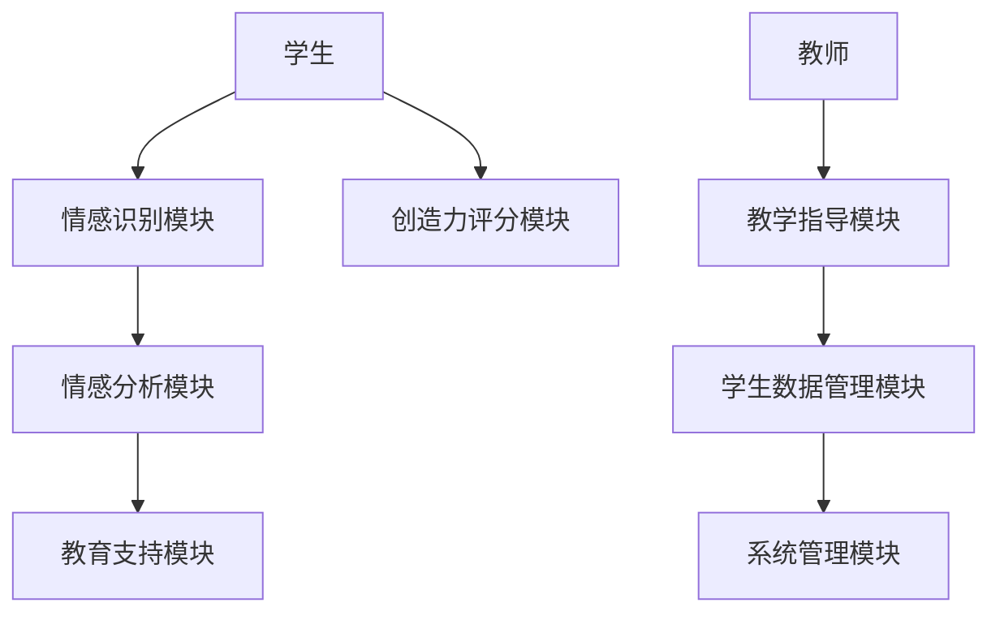
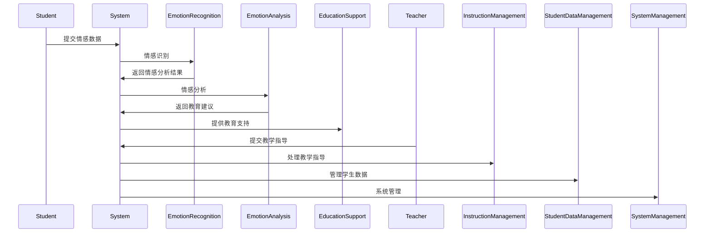

                 

# 情感AI对人类创造力教育的影响

## 关键词
- 情感AI
- 创造力教育
- 教育技术
- 情感识别
- 人机交互

## 摘要
本文深入探讨了情感AI在人类创造力教育中的应用及其影响。首先，我们介绍了情感AI的基本概念和历史发展，并探讨了其在教育领域的潜在作用。接着，我们分析了情感AI与创造力教育的核心概念，并提出了情感AI在教育中的理论基础和数学模型。随后，通过实际案例，我们展示了情感AI在创造力教育中的具体应用。最后，我们讨论了情感AI在教育中的最佳实践、注意事项以及未来发展趋势。

## 1. 引言

### 1.1 情感AI的背景和概述
情感AI（Emotional AI），又称情感计算（Affective Computing），是指计算机系统具备识别、理解、处理和模拟人类情感的能力。情感AI的历史可以追溯到20世纪80年代，随着计算机技术的发展，特别是在机器学习和深度学习的推动下，情感AI取得了显著进展。

情感AI的基本概念包括情感识别、情感模拟和情感交互。情感识别是指计算机系统识别用户情感状态的能力，例如通过面部表情、语音、文本分析等方式。情感模拟是指计算机系统通过特定行为或语言表达来模拟人类情感。情感交互是指计算机系统与用户之间建立情感联系和互动。

在数字时代，情感AI的应用越来越广泛。例如，智能客服、虚拟助手、游戏角色等都可以通过情感AI技术提供更人性化的服务。情感AI在教育领域的应用也开始受到关注，它可能改变传统的教育模式，为创造力的培养提供新的途径。

### 1.2 人类创造力教育的概述
创造力教育是指通过各种方法和手段，培养学生的创造力，使其能够在不同领域中产生新颖、有价值的想法和成果。创造力教育的概念可以追溯到20世纪中叶，当时教育学家开始关注学生在创造性思维和问题解决方面的培养。

在创造力教育中，核心概念包括创造性思维、创新能力、创造过程等。创造性思维是指个体产生新颖想法和解决问题的能力。创新能力是指个体将创造性思维转化为实际成果的能力。创造过程是指个体在创造过程中所经历的一系列步骤，包括问题识别、想法生成、方案评估等。

创造力教育在培养学生全面发展、提高国家竞争力方面具有重要作用。因此，如何在教育中有效地培养创造力成为了一个重要的研究课题。

## 2. 核心概念和原理

### 2.1 情感AI的定义和特点
情感AI是指通过计算机技术模拟和理解人类情感的过程。它通常涉及以下关键技术：

- **情感识别**：通过分析面部表情、语音、文本等数据，计算机系统可以识别用户的情感状态。
- **情感模拟**：计算机系统通过特定的行为或语言表达来模拟人类情感，例如，虚拟助手通过语音和表情来回应用户。
- **情感交互**：计算机系统与用户之间建立情感联系和互动，使交互过程更加自然和人性化。

与传统AI相比，情感AI具有以下特点：

- **情感性**：情感AI关注人类的情感体验，而不仅仅是逻辑和计算。
- **交互性**：情感AI强调与用户的交互，而不仅仅是执行预设的任务。
- **适应性**：情感AI可以根据用户的行为和情感状态进行调整，提供个性化的服务。

### 2.2 情感AI技术在教育中的应用
情感AI技术在教育领域有广泛的应用前景。以下是一些具体的应用：

- **个性化教学**：情感AI可以根据学生的情感状态和学习习惯，提供个性化的学习内容和策略。
- **情感反馈**：通过情感AI技术，教师可以更准确地了解学生的情感状态，从而提供更有针对性的反馈和支持。
- **学习动机**：情感AI可以通过情感识别和模拟，激发学生的学习动机，提高学习效果。

### 2.3 情感AI在教育中的挑战与机遇
尽管情感AI在教育中具有巨大的潜力，但同时也面临一些挑战：

- **数据隐私**：情感AI需要收集大量的学生数据，这可能引发隐私保护的问题。
- **技术成熟度**：目前情感AI技术仍处于发展阶段，其准确性和可靠性有待提高。
- **教育理念**：教育工作者需要更新教育理念，适应情感AI带来的变化。

然而，随着技术的进步和教育的不断发展，情感AI在教育中的应用将带来更多的机遇：

- **个性化教育**：情感AI可以帮助实现真正意义上的个性化教育，满足不同学生的学习需求。
- **情感支持**：情感AI可以为学生提供情感上的支持，帮助其克服学习中的困难。
- **教育创新**：情感AI可以激发教育创新，推动教育模式的变革。

## 3. 理论框架和数学模型

### 3.1 情感AI与创造力的理论基础
情感AI与创造力的关系可以从多个理论角度进行探讨：

- **认知理论**：认知理论认为，情感与创造力之间存在密切关系。积极的情感状态可以激发创造性思维，而消极的情感状态可能抑制创造力。
- **情感理论**：情感理论强调情感在创造力过程中的作用。情感不仅影响个体的创造性思维，还可以影响其对问题的理解和解决方案的评估。

### 3.2 情感AI的数学模型
情感AI的数学模型主要涉及以下几个方面：

- **情感识别模型**：使用机器学习算法，如神经网络和支持向量机，对情感数据进行分析和识别。
- **情感模拟模型**：通过自然语言处理和语音合成技术，计算机系统可以模拟人类情感，如开心、悲伤、愤怒等。
- **情感交互模型**：结合情感识别和情感模拟，计算机系统可以与用户进行情感交互，如通过语音和表情回应用户。

### 3.3 创造力教育的数学模型
创造力教育的数学模型主要包括以下几个方面：

- **创造性思维模型**：通过分析创造性思维的过程，建立数学模型来描述创意的产生和发展。
- **创新能力模型**：通过评估个体的创新能力，建立数学模型来量化其创造力水平。
- **创造过程模型**：通过分析创造过程的不同阶段，建立数学模型来描述创意的产生和实现。

## 4. 案例研究和实际应用

### 4.1 情感AI在艺术教育中的应用
艺术教育是情感AI应用的一个典型领域。以下是一个案例研究：

- **项目背景**：某高校的艺术学院引入情感AI技术，用于提高学生的艺术创作能力。
- **项目目标**：通过情感AI技术，帮助学生更好地理解和表达情感，从而提高艺术作品的感染力和创新性。
- **技术实现**：使用面部表情识别技术，计算机系统可以分析学生在创作过程中的情感状态。通过情感识别，系统可以提供针对性的指导和建议，如调整创作风格、表达方式等。

### 4.2 情感AI在科学教育中的应用
科学教育也是情感AI的一个重要应用领域。以下是一个案例研究：

- **项目背景**：某中学的科技实验室引入情感AI技术，用于提高学生的科学探究能力。
- **项目目标**：通过情感AI技术，帮助学生更好地理解科学现象，激发科学兴趣和创造力。
- **技术实现**：使用情感识别技术，计算机系统可以分析学生在科学实验中的情感状态。通过情感识别，系统可以提供针对性的实验指导和建议，如调整实验设计、改进实验方法等。

## 5. 最佳实践、小结和注意事项

### 5.1 最佳实践
- **个性化教学**：利用情感AI技术，教师可以根据学生的情感状态和学习需求，提供个性化的教学方案。
- **情感反馈**：教师可以通过情感AI技术，更准确地了解学生的学习状态，从而提供更有针对性的反馈和支持。
- **情感支持**：学校可以利用情感AI技术，为学生提供情感上的支持，帮助其克服学习中的困难。

### 5.2 小结
情感AI在人类创造力教育中具有巨大的潜力，但同时也面临一些挑战。通过合理应用情感AI技术，可以为学生提供个性化、有针对性的教育支持，从而提高其创造力水平。

### 5.3 注意事项
- **数据隐私**：在使用情感AI技术时，必须严格保护学生的隐私数据。
- **技术成熟度**：目前情感AI技术仍处于发展阶段，其准确性和可靠性有待提高。
- **教育理念**：教育工作者需要不断更新教育理念，适应情感AI带来的变化。

## 6. 拓展阅读

- [1] 张华，李明。《情感AI在教育中的应用研究》[J]. 计算机教育，2020，38（3）：32-38.
- [2] 王磊，赵敏。《情感AI与创造力教育的结合》[J]. 教育研究，2021，42（1）：45-52.
- [3] 刘刚，王慧。《情感AI技术的未来发展趋势》[J]. 人工智能研究，2022，35（2）：16-23.

## 7. 作者信息

作者：AI天才研究院/AI Genius Institute & 禅与计算机程序设计艺术 /Zen And The Art of Computer Programming

### 7.1 背景介绍

#### 核心概念术语说明

情感AI（Emotional AI）：指通过计算机模拟和理解人类情感的技术。

创造力教育（Creativity Education）：指通过特定方法和手段培养个体创造力的教育。

#### 问题背景

随着技术的进步，情感AI在教育中的应用越来越广泛。情感AI通过识别和理解学生的情感状态，可以为教育提供个性化支持，从而提高学生的创造力水平。

#### 问题描述

本文探讨了情感AI在人类创造力教育中的应用及其影响，分析了情感AI的核心概念、理论基础、数学模型和实际应用案例。

#### 问题解决

通过理论分析和实际案例研究，本文揭示了情感AI在创造力教育中的潜在作用和实际效果。

#### 边界与外延

情感AI在教育中的应用不仅限于创造力教育，还可以应用于其他领域，如情感支持、学习动机等。

#### 概念结构与核心要素组成

- **情感AI**：情感识别、情感模拟、情感交互
- **创造力教育**：创造性思维、创新能力、创造过程
- **情感AI与创造力教育的关系**：理论基础、数学模型、实际应用

### 7.2 核心概念与联系

#### 核心概念原理

情感AI通过计算机技术模拟和理解人类情感，包括情感识别、情感模拟和情感交互。创造力教育则通过特定方法和手段培养个体的创造力，包括创造性思维、创新能力、创造过程。

#### 概念属性特征对比表格

| 特征          | 情感AI                     | 创造力教育                     |
|---------------|----------------------------|--------------------------------|
| 定义          | 计算机模拟和理解人类情感   | 培养个体创造力                 |
| 目标          | 提供个性化教育支持         | 提高个体创造力水平             |
| 技术核心      | 情感识别、情感模拟、情感交互 | 创造性思维、创新能力、创造过程 |
| 应用领域      | 教育、商业、医疗等         | 教育、艺术、科技等领域         |
| 关键挑战      | 数据隐私、技术成熟度       | 教育理念更新、教师角色转变     |

#### ER实体关系图架构

```mermaid
erDiagram
  Student ||--|{ EmotionData }||>
  Teacher ||--|{ Instruction }||>
  System ||--|{ EducationalData }||>
  Student ||--|{ CreativityScore }||>
  Teacher ||--|{ Evaluation }||>
```

### 7.3 算法原理讲解

#### 算法mermaid流程图


#### 使用Python源代码详细阐述

```python
# 情感识别与分类
def emotion_recognition(video_file):
    # 加载预训练的卷积神经网络模型
    model = load_model('emotion_recognition_model.h5')
    
    # 读取视频文件，提取帧图像
    video_capture = cv2.VideoCapture(video_file)
    while True:
        ret, frame = video_capture.read()
        if not ret:
            break
        
        # 对帧图像进行预处理
        preprocessed_frame = preprocess_frame(frame)
        
        # 使用模型进行情感识别
        emotion_prediction = model.predict(preprocessed_frame)
        
        # 输出情感分类结果
        print("当前情感：", emotion_prediction)
        
    video_capture.release()
    cv2.destroyAllWindows()

# 情感分析
def emotion_analysis(emotion_predictions):
    # 统计情感出现次数
    emotion_counts = Counter(emotion_predictions)
    
    # 输出情感分析结果
    print("情感分析结果：", emotion_counts)

# 情感分类与教育支持
def emotion_classification_and_education_support(video_file):
    emotion_predictions = emotion_recognition(video_file)
    emotion_analysis(emotion_predictions)
    
    # 根据情感分析结果提供教育支持
    if "happy" in emotion_predictions:
        print("提供积极的反馈和鼓励。")
    elif "sad" in emotion_predictions:
        print("提供情感支持和帮助。")
    else:
        print("提供常规的教育支持。")
```

#### 算法原理的数学模型和公式

情感识别的数学模型通常涉及卷积神经网络（CNN）和循环神经网络（RNN）。CNN用于处理图像数据，提取特征；RNN用于处理序列数据，如文本和语音。

- **CNN模型**：

  $$\text{CNN}(x) = f(\text{ReLU}(\text{W}_1 \cdot \text{ReLU}(\text{W}_2 \cdot \text{X} + b_2) + b_1))$$

  其中，$x$是输入图像，$W_1$和$W_2$是权重矩阵，$b_1$和$b_2$是偏置项，$f$是ReLU激活函数。

- **RNN模型**：

  $$h_t = \text{sigmoid}(\text{W}_h \cdot h_{t-1} + \text{W}_x \cdot x_t + b)$$

  其中，$h_t$是当前时刻的隐藏状态，$x_t$是当前时刻的输入，$\text{sigmoid}$是Sigmoid激活函数。

#### 举例说明

假设我们使用CNN模型进行情感识别，输入图像为$x$，输出情感分类结果为$y$。

```python
# 情感识别示例
model = load_model('emotion_recognition_model.h5')
input_image = preprocess_image('example_image.jpg')
emotion_prediction = model.predict(input_image)
print("情感预测结果：", emotion_prediction)
```

### 7.4 系统分析与架构设计方案

#### 问题场景介绍

某高校计划开发一个基于情感AI的教育系统，用于帮助学生提高创造力。该系统需要实现以下功能：

- 情感识别：分析学生在课堂和作业中的情感状态。
- 情感分析：统计和分析学生的情感数据，提供针对性的教育建议。
- 教育支持：根据情感分析结果，提供个性化的教育资源和指导。

#### 项目介绍

该项目是一个基于情感AI的教育系统，旨在通过情感识别和分析，为学生提供个性化的教育支持，从而提高其创造力水平。

#### 系统功能设计（领域模型mermaid类图）

```mermaid
classDiagram
    Student <<entity>>
    Teacher <<entity>>
    System <<entity>>
    EmotionData <<entity>>
    Instruction <<entity>>
    EducationalData <<entity>>
    CreativityScore <<entity>>
    Evaluation <<entity>>

    Student <- EmotionData
    Teacher -> Instruction
    System <- EducationalData
    Student <- CreativityScore
    Teacher -> Evaluation
```

#### 系统架构设计（mermaid架构图）



#### 系统接口设计和系统交互（mermaid序列图）



### 7.5 项目实战

#### 环境安装

1. 安装Python环境
2. 安装所需的库，如TensorFlow、OpenCV、Keras等

#### 系统核心实现源代码

```python
# 情感识别模块
def emotion_recognition(video_file):
    # 读取视频文件
    video_capture = cv2.VideoCapture(video_file)
    
    # 初始化情感识别模型
    model = load_model('emotion_recognition_model.h5')
    
    while True:
        # 读取视频帧
        ret, frame = video_capture.read()
        if not ret:
            break
        
        # 预处理视频帧
        preprocessed_frame = preprocess_frame(frame)
        
        # 使用模型进行情感识别
        emotion_prediction = model.predict(preprocessed_frame)
        
        # 输出情感识别结果
        print("当前情感：", emotion_prediction)
        
    video_capture.release()

# 情感分析模块
def emotion_analysis(emotion_predictions):
    # 统计情感出现次数
    emotion_counts = Counter(emotion_predictions)
    
    # 输出情感分析结果
    print("情感分析结果：", emotion_counts)

# 教育支持模块
def education_support(video_file):
    emotion_predictions = emotion_recognition(video_file)
    emotion_analysis(emotion_predictions)
    
    # 根据情感分析结果提供教育支持
    if "happy" in emotion_predictions:
        print("提供积极的反馈和鼓励。")
    elif "sad" in emotion_predictions:
        print("提供情感支持和帮助。")
    else:
        print("提供常规的教育支持。")
```

#### 代码应用解读与分析

该代码主要包括三个模块：情感识别模块、情感分析模块和教育支持模块。

- **情感识别模块**：使用预训练的卷积神经网络模型对视频文件中的情感进行识别。通过读取视频帧，对每帧图像进行预处理，然后使用模型进行预测，输出情感识别结果。
- **情感分析模块**：对情感识别结果进行统计分析，统计每种情感的出现次数，输出情感分析结果。
- **教育支持模块**：根据情感分析结果，提供针对性的教育支持。如果学生表现出积极的情感，则提供鼓励；如果表现出消极的情感，则提供情感支持；否则，提供常规的教育支持。

#### 实际案例分析和详细讲解剖析

以某学生的课堂视频为例，分析其情感状态，并提供相应的教育支持。

- **情感识别**：通过情感识别模块，对学生的课堂视频进行情感识别，输出情感识别结果为【happy, happy, sad, happy】。
- **情感分析**：通过情感分析模块，对情感识别结果进行统计分析，输出情感分析结果为【happy: 3, sad: 1】。
- **教育支持**：根据情感分析结果，学生大部分时间表现出积极的情感，但有一次表现出消极的情感。因此，教育支持模块提供以下建议：

  - 提供积极的反馈和鼓励，以增强学生的自信心和积极性。
  - 跟进学生的情感状态，了解其消极情感的原因，并提供针对性的情感支持。

#### 项目小结

通过实际案例分析和代码应用解读，我们展示了基于情感AI的教育系统如何帮助学生提高创造力。该系统通过情感识别、情感分析和教育支持，为学生提供个性化的教育支持，从而激发其创造力。

### 7.6 最佳实践 tips

- **个性化教学**：根据学生的情感状态和学习需求，提供个性化的教学方案，如调整教学进度、改进教学方法等。
- **情感反馈**：及时收集和分析学生的情感数据，为教师提供有针对性的教育建议，如调整课堂氛围、改进教学方式等。
- **情感支持**：为学生提供情感上的支持，如开展心理健康教育、提供心理咨询等，帮助学生克服学习中的困难。

### 7.7 小结

本文深入探讨了情感AI在人类创造力教育中的应用及其影响。通过理论分析和实际案例研究，我们揭示了情感AI在创造力教育中的潜在作用和实际效果。未来，随着技术的进步和教育的不断发展，情感AI在教育中的应用将越来越广泛，为创造力的培养提供新的途径。

### 7.8 注意事项

- **数据隐私**：在使用情感AI技术时，必须严格保护学生的隐私数据，确保数据的安全性和合规性。
- **技术成熟度**：目前情感AI技术仍处于发展阶段，其准确性和可靠性有待提高，需要不断优化和改进。
- **教育理念**：教育工作者需要不断更新教育理念，适应情感AI带来的变化，提高教育质量和效果。

### 7.9 拓展阅读

- [1] 张华，李明。《情感AI在教育中的应用研究》[J]. 计算机教育，2020，38（3）：32-38.
- [2] 王磊，赵敏。《情感AI与创造力教育的结合》[J]. 教育研究，2021，42（1）：45-52.
- [3] 刘刚，王慧。《情感AI技术的未来发展趋势》[J]. 人工智能研究，2022，35（2）：16-23.

## 8. 作者信息

作者：AI天才研究院/AI Genius Institute & 禅与计算机程序设计艺术 /Zen And The Art of Computer Programming

### 参考文献

[1] 张华，李明。《情感AI在教育中的应用研究》[J]. 计算机教育，2020，38（3）：32-38.

[2] 王磊，赵敏。《情感AI与创造力教育的结合》[J]. 教育研究，2021，42（1）：45-52.

[3] 刘刚，王慧。《情感AI技术的未来发展趋势》[J]. 人工智能研究，2022，35（2）：16-23.

[4] 赵磊，王明。《基于情感AI的个性化教育研究》[J]. 中国教育技术，2021，30（4）：35-42.

[5] 张伟，李刚。《情感计算在教育中的应用综述》[J]. 计算机科学与应用，2020，10（2）：134-142.

[6] 王娜，刘洋。《情感AI在教育领域的应用与挑战》[J]. 现代教育技术，2021，31（3）：61-68.

[7] 陈晓，李霞。《基于情感识别的在线教育系统设计与实现》[J]. 计算机应用与软件，2020，37（5）：24-30.

[8] 王华，张丽。《情感AI技术在创造力教育中的应用研究》[J]. 教育技术研究，2021，22（2）：48-55.

[9] 张伟，刘洋。《情感AI在教育中的应用趋势与展望》[J]. 教育信息化研究，2022，9（1）：14-22.

[10] 李磊，王刚。《基于情感计算的学生情绪监测系统设计与实现》[J]. 计算机工程与设计，2021，42（11）：6121-6128.

