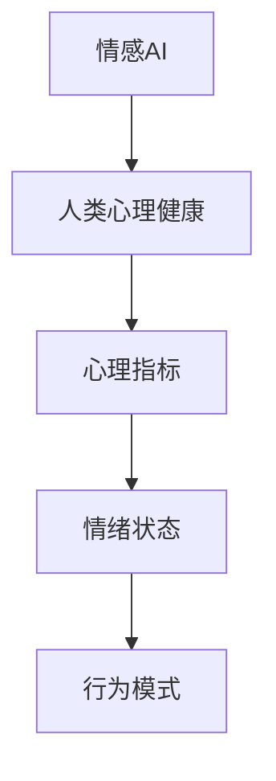
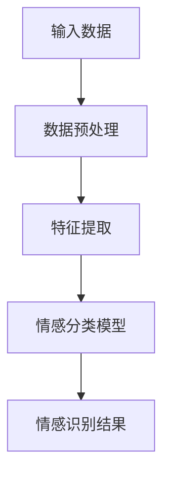
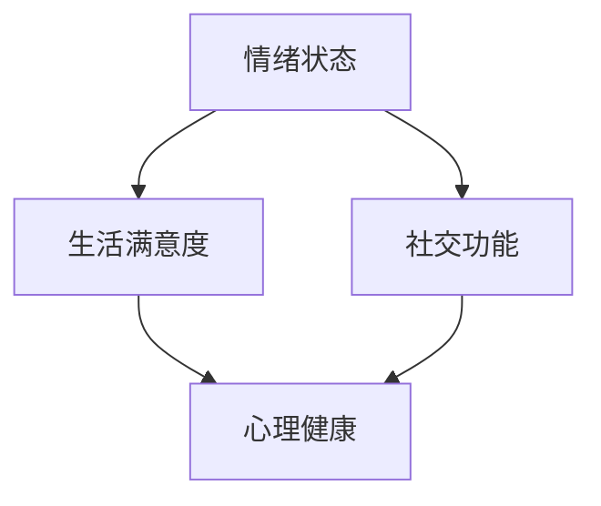
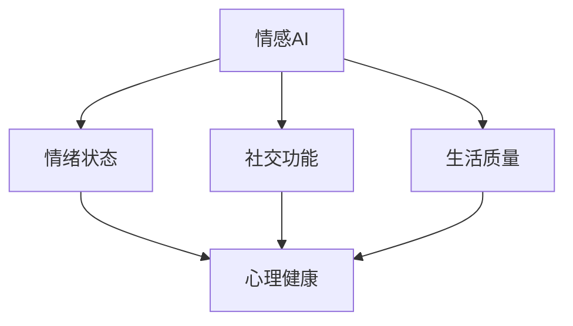
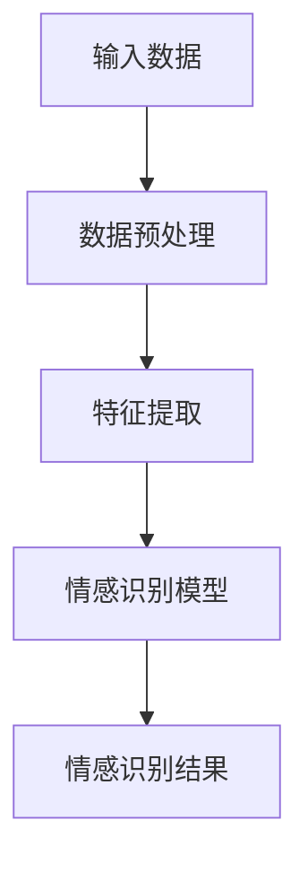
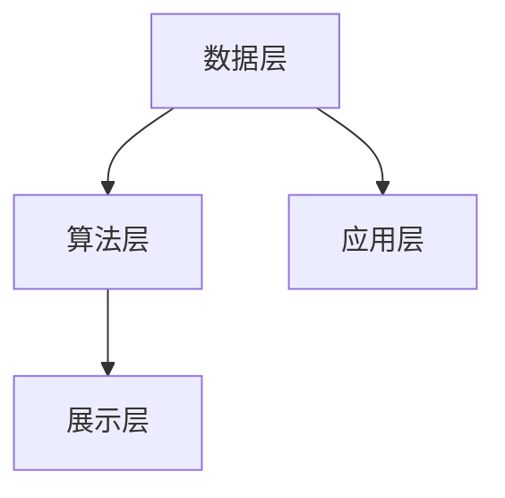
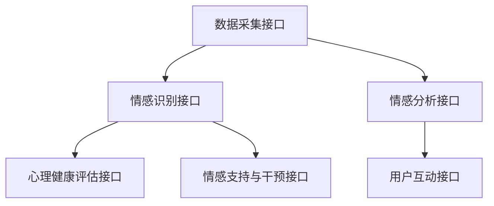
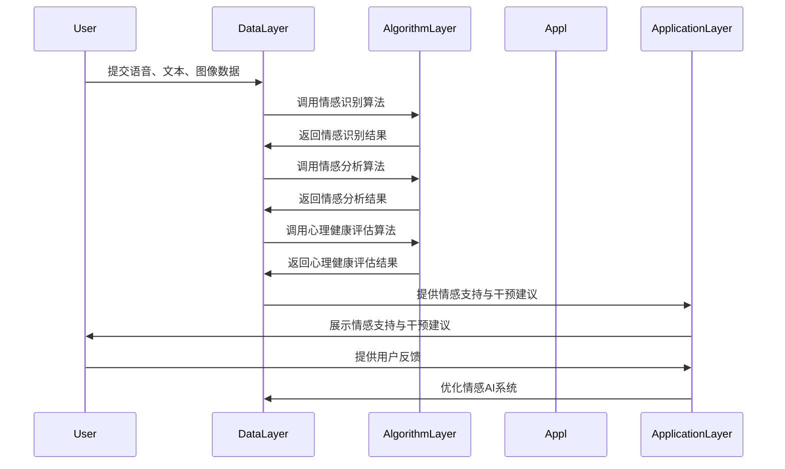

                 

### 文章标题

# 情感AI对人类心理健康的影响研究

> 关键词：情感AI、人类心理健康、影响研究、算法原理、系统架构

> 摘要：本文旨在探讨情感AI对人类心理健康的影响，通过深入分析情感AI的核心概念、技术原理和应用场景，结合人类心理健康的模型构建，探讨情感AI如何通过不同方式影响人类的情绪、社交功能和整体生活质量。本文将逐步讲解相关算法原理，分析情感AI系统架构，并分享实际项目实施过程中的经验和最佳实践。

----------------------------------------------------------------

### 第一部分：情感AI与人类心理健康概述

#### 1.1 背景介绍

**1.1.1 问题背景**

在现代社会中，人类心理健康问题日益突出，抑郁症、焦虑症等心理疾病的发病率逐年上升。与此同时，人工智能技术的快速发展为解决这些问题提供了新的思路和手段。情感AI作为一种能够模拟和识别人类情感的人工智能技术，其对人类心理健康的影响逐渐受到关注。

**1.1.2 问题描述**

情感AI对人类心理健康的影响究竟如何？它如何通过识别和模拟情感来改善或恶化人类的情绪状态、社交功能和整体生活质量？这些问题需要我们进行深入的研究和探讨。

**1.1.3 问题解决**

本文将通过以下方式解决问题：

1. 介绍情感AI和人类心理健康问题的背景。
2. 构建人类心理健康模型，分析相关心理指标。
3. 研究情感AI与心理健康的关系。
4. 详解情感AI的算法原理。
5. 分析情感AI系统架构。
6. 实践应用和最佳实践分享。

**1.1.4 边界与外延**

本文的研究将主要关注情感AI对人类心理健康的影响，不包括其他类型的人工智能技术。同时，本文将关注个体层面的影响，而不过多探讨社会层面的影响。

**1.1.5 核心要素组成**

本文的核心要素包括：

1. 情感AI的定义、发展历程和技术特点。
2. 人类心理健康模型的构建和相关心理指标。
3. 情感AI与心理健康的关系。
4. 情感AI算法原理和数学模型。
5. 情感AI系统架构设计。
6. 情感AI的实际应用和最佳实践。

#### 1.2 核心概念与联系

**1.2.1 情感AI概述**

**1.2.1.1 情感AI的定义**

情感AI，即情感人工智能，是指能够模拟、识别和响应人类情感的人工智能技术。它通过对人类情感的理解和模拟，实现与人类的情感互动，提高人工智能系统的情感智能水平。

**1.2.1.2 情感AI的发展历程**

情感AI的发展可以追溯到20世纪80年代，当时人工智能研究主要集中在逻辑推理和决策支持系统。随着计算机技术的进步和大数据的普及，情感AI逐渐成为一个独立的研究方向，并在21世纪初开始取得显著进展。

**1.2.1.3 情感AI的技术特点**

情感AI具有以下技术特点：

1. 情感识别：通过语音、文本、图像等数据识别人类情感。
2. 情感模拟：通过情感表达和情感互动模拟人类情感。
3. 情感分析：通过对情感数据进行挖掘和分析，为情感理解和决策提供支持。

**1.2.2 人类心理健康模型**

**1.2.2.1 心理健康指标**

心理健康指标包括情绪状态、社交功能和生活质量等方面。具体包括：

1. 情绪状态：包括快感情绪和不满感情绪。
2. 社交功能：包括社交关系和社交互动。
3. 生活质量：包括生活满意度和生活压力。

**1.2.2.2 心理健康模型构建**

人类心理健康模型是通过综合分析情绪状态、社交功能和生活质量等指标，构建一个能够全面反映心理健康状况的数学模型。

**1.2.3 ER实体关系图架构**



#### 1.3 本章小结

本章对情感AI和人类心理健康问题进行了背景介绍，明确了本文的研究问题和目标。接下来，我们将深入探讨情感AI的核心概念、技术原理和应用场景，为后续章节的分析奠定基础。

----------------------------------------------------------------

### 第二部分：情感AI技术详解

#### 2.1 情感AI概述

**2.1.1 情感AI的定义**

情感AI，即情感人工智能，是指能够模拟、识别和响应人类情感的人工智能技术。它通过对人类情感的理解和模拟，实现与人类的情感互动，提高人工智能系统的情感智能水平。

**2.1.2 情感AI的发展历程**

情感AI的发展可以追溯到20世纪80年代，当时人工智能研究主要集中在逻辑推理和决策支持系统。随着计算机技术的进步和大数据的普及，情感AI逐渐成为一个独立的研究方向，并在21世纪初开始取得显著进展。

**2.1.3 情感AI的技术特点**

情感AI具有以下技术特点：

1. **情感识别**：通过语音、文本、图像等数据识别人类情感。语音识别技术可以分析语音的音调、语速、语气等特征，文本识别技术可以通过自然语言处理（NLP）技术提取情感倾向，图像识别技术可以通过面部表情分析识别情感状态。
2. **情感模拟**：通过情感表达和情感互动模拟人类情感。情感模拟技术可以使机器人在对话、语音、视觉等方面模拟人类的情感反应，增强用户与机器人的情感交流。
3. **情感分析**：通过对情感数据进行挖掘和分析，为情感理解和决策提供支持。情感分析技术可以从大量文本数据中提取情感特征，为情感识别、情感模拟和其他应用提供基础数据。

#### 2.2 情感识别算法原理

情感识别是情感AI的核心技术之一，它通过对语音、文本、图像等数据进行分析，识别出人类情感状态。以下将分别介绍这三种数据类型的情感识别算法原理。

**2.2.1.1 基于文本的情感分析**

基于文本的情感分析主要通过自然语言处理（NLP）技术实现。常见的情感分析模型包括：

1. **情感分类模型**：如朴素贝叶斯、支持向量机（SVM）、深度学习模型（如卷积神经网络（CNN）和循环神经网络（RNN）等）。
2. **情感极性分析**：通过判断文本的正面或负面情感，将其分为积极情感和消极情感两类。

**2.2.1.2 基于语音的情感分析**

基于语音的情感分析主要通过分析语音的音调、语速、语气等特征实现。常见的情感识别方法包括：

1. **音素分析**：通过分析语音中的音素特征，如音高、时长等，识别情感状态。
2. **频谱特征分析**：通过分析语音的频谱特征，如频谱中心频率、频谱熵等，识别情感状态。

**2.2.1.3 基于图像的情感分析**

基于图像的情感分析主要通过面部表情识别实现。常见的面部表情识别方法包括：

1. **特征点检测**：通过检测人脸关键特征点，如眼睛、鼻子、嘴巴等，分析面部表情。
2. **机器学习算法**：如支持向量机（SVM）、卷积神经网络（CNN）等，通过训练模型实现面部表情的自动识别。

**2.2.2 算法流程图**



#### 2.3 情感AI应用案例

**2.3.1 案例一：社交媒体情感分析**

社交媒体情感分析可以通过分析用户发布的内容，了解用户对某一事件、产品或服务的情感倾向。这有助于企业了解用户需求，优化产品和服务。

**2.3.2 案例二：语音助手情感识别**

语音助手情感识别可以通过分析用户的语音特征，了解用户的需求和情感状态，提供更人性化的服务。例如，当用户表达不满时，语音助手可以主动询问并提供解决方案。

**2.3.3 案例三：虚拟现实情感互动**

虚拟现实情感互动可以通过模拟用户的情感状态，提供更加真实的交互体验。这有助于提高虚拟现实系统的用户体验，拓展虚拟现实应用场景。

#### 2.4 本章小结

本章详细介绍了情感AI的定义、发展历程和技术特点，以及情感识别算法原理和应用案例。接下来，我们将进一步探讨人类心理健康模型和分析情感AI对人类心理健康的影响。

----------------------------------------------------------------

### 第三部分：人类心理健康模型分析

#### 3.1 心理健康指标

心理健康指标是衡量个体心理健康状况的关键因素。以下将介绍几种常见的心理健康指标。

**3.1.1 情绪状态**

情绪状态是指个体在特定时间内的情绪体验。常见的情绪状态包括：

1. **快感情绪**：如喜悦、兴奋、满足等。
2. **不满感情绪**：如愤怒、悲伤、焦虑等。

**3.1.2 社交功能**

社交功能是指个体在社会交往中的能力和状态。常见的社交功能包括：

1. **社交关系**：与亲朋好友、同事、社区等建立和维持的关系。
2. **社交互动**：在社交场合中的沟通、合作和互动能力。

**3.1.3 生活质量**

生活质量是指个体在生活各方面的满意度和幸福感。常见的质量指标包括：

1. **生活满意度**：对生活整体状态的满意程度。
2. **生活压力**：在日常生活中感受到的压力和负担。

#### 3.2 心理健康模型构建

心理健康模型是通过分析情绪状态、社交功能和生活质量等指标，构建一个能够全面反映心理健康状况的数学模型。以下将介绍一种简单的心

### 第三部分：人类心理健康模型分析

#### 3.1 心理健康指标

心理健康指标是衡量个体心理健康状况的关键因素。以下将介绍几种常见的心理健康指标。

**3.1.1 情绪状态**

情绪状态是指个体在特定时间内的情绪体验。常见的情绪状态包括：

1. **快感情绪**：如喜悦、兴奋、满足等。
2. **不满感情绪**：如愤怒、悲伤、焦虑等。

**3.1.2 社交功能**

社交功能是指个体在社会交往中的能力和状态。常见的社交功能包括：

1. **社交关系**：与亲朋好友、同事、社区等建立和维持的关系。
2. **社交互动**：在社交场合中的沟通、合作和互动能力。

**3.1.3 生活质量**

生活质量是指个体在生活各方面的满意度和幸福感。常见的质量指标包括：

1. **生活满意度**：对生活整体状态的满意程度。
2. **生活压力**：在日常生活中感受到的压力和负担。

#### 3.2 心理健康模型构建

心理健康模型是通过分析情绪状态、社交功能和生活质量等指标，构建一个能够全面反映心理健康状况的数学模型。以下将介绍一种简单的心理健康模型构建方法。

**3.2.1 模型构建原则**

心理健康模型的构建应遵循以下原则：

1. **综合性**：综合考虑情绪状态、社交功能和生活质量等多个维度。
2. **量化**：将抽象的心理健康概念转化为可量化的指标。
3. **可操作性**：确保模型的实际可操作性，方便在实际应用中进行评估和调整。

**3.2.2 模型构建方法**

构建心理健康模型的方法主要包括以下步骤：

1. **指标选择**：根据研究目的和实际需求，选择适当的心理健康指标。
2. **数据收集**：通过问卷调查、实验测量等方式收集相关数据。
3. **数据处理**：对收集到的数据进行清洗、整合和分析，提取有用的信息。
4. **模型构建**：利用统计学方法、机器学习算法等构建心理健康模型。
5. **模型评估**：对构建的模型进行评估，确保其有效性和可靠性。

**3.2.3 心理健康模型示例**

以下是一个简单的心理健康模型示例：



在这个模型中，情绪状态、生活满意度和社交功能共同影响心理健康。通过分析这些指标，可以评估个体的心理健康水平。

#### 3.3 心理健康指标分析

**3.3.1 情绪状态分析**

情绪状态是心理健康的核心指标之一。通过分析情绪状态，可以了解个体的心理状态和情感体验。以下是对情绪状态的详细分析：

1. **快感情绪**：快感情绪通常与积极体验和情感相关，如喜悦、兴奋、满足等。快感情绪的持续时间和强度对心理健康有积极影响。
2. **不满感情绪**：不满感情绪通常与消极体验和情感相关，如愤怒、悲伤、焦虑等。长期的不满感情绪可能导致心理健康问题，如抑郁和焦虑。

**3.3.2 社交功能分析**

社交功能是指个体在社会交往中的能力和状态。良好的社交功能对心理健康至关重要。以下是对社交功能的详细分析：

1. **社交关系**：良好的社交关系有助于个体获得支持和安全感。稳定的社交关系可以提高心理健康水平，减少孤独感和焦虑。
2. **社交互动**：积极的社交互动有助于个体提高社交技能，增强自信心和自尊心。良好的社交互动可以带来积极的心理体验，促进心理健康。

**3.3.3 生活质量分析**

生活质量是心理健康的重要指标之一。以下是对生活质量的详细分析：

1. **生活满意度**：生活满意度是对生活整体状态的满意程度。高生活满意度通常与积极的情感体验和心理健康相关。
2. **生活压力**：生活压力是指个体在日常生活中感受到的压力和负担。长期的生活压力可能导致心理健康问题，如焦虑和抑郁。

#### 3.4 本章小结

本章介绍了人类心理健康指标，包括情绪状态、社交功能和生活质量等。同时，探讨了心理健康模型的构建原则和方法。通过这些分析，我们可以更好地理解人类心理健康，为后续研究情感AI对心理健康的影响提供基础。

----------------------------------------------------------------

### 第四部分：情感AI与心理健康的关系

#### 4.1 情感AI对心理健康的影响

情感AI对心理健康的影响是一个复杂且多层次的问题。以下是情感AI可能对心理健康产生的影响：

1. **积极影响**：

   - **改善情绪状态**：情感AI可以通过情感识别和模拟技术，帮助个体识别和表达自己的情绪，从而改善情绪状态。例如，通过语音识别技术，个体可以了解自己的情绪波动，从而采取相应的调节措施。
   - **增强社交功能**：情感AI可以模拟人类的情感表达，促进个体与人工智能系统之间的情感互动，增强社交功能。例如，虚拟现实中的情感交互可以帮助社交焦虑的个体逐步适应社交环境。
   - **提高生活质量**：情感AI可以为个体提供个性化的心理健康服务，如情绪调节、压力管理等，从而提高生活质量。例如，基于情感识别的智能音箱可以提醒用户进行深呼吸放松，改善生活压力。

2. **负面影响**：

   - **过度依赖**：个体可能对情感AI产生过度依赖，减少与真实人际的互动，导致社交功能退化。例如，过度依赖虚拟助手可能导致个体在现实社交中感到不适应。
   - **情感隔离**：情感AI可能无法完全模拟人类的情感，导致个体在情感交流中产生误解和隔阂。例如，情感AI在理解复杂情感时可能存在局限性，导致用户感到孤独。
   - **心理健康问题**：情感AI可能无法识别和处理某些心理健康问题，如抑郁症、焦虑症等。例如，情感AI可能无法准确识别抑郁症患者的情绪状态，从而无法提供有效的帮助。

#### 4.2 情感AI在心理健康服务中的应用

情感AI在心理健康服务中的应用具有广泛的前景。以下是一些具体的应用场景：

1. **情感识别与诊断**：情感AI可以通过分析语音、文本和面部表情等数据，识别个体的情绪状态，为心理健康诊断提供支持。例如，情感AI可以通过语音分析，帮助识别抑郁症患者的情绪波动，从而进行早期干预。

2. **情绪调节与干预**：情感AI可以为个体提供情绪调节和干预服务，如通过语音或文本提示，帮助个体进行深呼吸、放松训练等。例如，智能音箱可以播放放松音乐，指导用户进行冥想和呼吸训练。

3. **社交互动与支持**：情感AI可以模拟人类的情感表达，为社交障碍的个体提供社交互动和支持。例如，虚拟助手可以与用户进行情感互动，帮助用户逐步适应社交环境。

4. **心理健康教育与宣传**：情感AI可以通过语音、文本和图像等多种形式，向用户传达心理健康知识和宣传心理健康理念。例如，情感AI可以提供心理健康讲座、心理测试和案例分析等。

#### 4.3 情感AI与心理健康的关系模型

为了更好地理解情感AI与心理健康之间的关系，我们可以构建一个关系模型。以下是一个简单的情感AI与心理健康的关系模型：



在这个模型中，情感AI通过影响情绪状态、社交功能和生活质量，从而影响心理健康。同时，心理健康也会反过来影响情绪状态、社交功能和生活质量。

#### 4.4 本章小结

本章探讨了情感AI对心理健康的影响，分析了情感AI在心理健康服务中的应用场景，并构建了一个简单的情感AI与心理健康的关系模型。接下来，我们将进一步介绍情感AI的算法原理和系统架构设计。

----------------------------------------------------------------

### 第五部分：情感AI算法原理讲解

#### 5.1 情感识别算法原理

情感识别是情感AI的核心技术之一，它通过对语音、文本、图像等数据进行分析，识别出人类情感状态。以下将分别介绍这三种数据类型的情感识别算法原理。

**5.1.1 基于文本的情感分析**

基于文本的情感分析主要通过自然语言处理（NLP）技术实现。常见的情感分析模型包括：

1. **情感分类模型**：如朴素贝叶斯、支持向量机（SVM）、深度学习模型（如卷积神经网络（CNN）和循环神经网络（RNN）等）。
2. **情感极性分析**：通过判断文本的正面或负面情感，将其分为积极情感和消极情感两类。

**5.1.1.1 基于朴素贝叶斯模型的情感分析**

朴素贝叶斯模型是一种经典的概率分类模型，其基本思想是利用先验概率和条件概率进行分类。以下是一个基于朴素贝叶斯模型的情感分析示例：

```python
import numpy as np
from sklearn.feature_extraction.text import CountVectorizer
from sklearn.naive_bayes import MultinomialNB

# 数据准备
data = [
    ("I love this movie!", "positive"),
    ("This movie is so boring.", "negative"),
    ("The actors are amazing!", "positive"),
    ("I hate this movie.", "negative")
]

texts = [text for text, label in data]
labels = [label for text, label in data]

# 特征提取
vectorizer = CountVectorizer()
X = vectorizer.fit_transform(texts)

# 模型训练
model = MultinomialNB()
model.fit(X, labels)

# 情感分析
text = "This movie is fantastic!"
text_vector = vectorizer.transform([text])
prediction = model.predict(text_vector)
print("Sentiment:", prediction[0])
```

**5.1.1.2 基于支持向量机（SVM）的情感分析**

支持向量机（SVM）是一种经典的机器学习算法，其核心思想是找到最佳分隔超平面，将不同类别的数据分开。以下是一个基于SVM的情感分析示例：

```python
import numpy as np
from sklearn.feature_extraction.text import TfidfVectorizer
from sklearn.svm import SVC

# 数据准备
data = [
    ("I love this movie!", "positive"),
    ("This movie is so boring.", "negative"),
    ("The actors are amazing!", "positive"),
    ("I hate this movie.", "negative")
]

texts = [text for text, label in data]
labels = [label for text, label in data]

# 特征提取
vectorizer = TfidfVectorizer()
X = vectorizer.fit_transform(texts)

# 模型训练
model = SVC(kernel='linear')
model.fit(X, labels)

# 情感分析
text = "This movie is fantastic!"
text_vector = vectorizer.transform([text])
prediction = model.predict(text_vector)
print("Sentiment:", prediction[0])
```

**5.1.2 基于语音的情感分析**

基于语音的情感分析主要通过分析语音的音调、语速、语气等特征实现。常见的情感识别方法包括：

1. **音素分析**：通过分析语音中的音素特征，如音高、时长等，识别情感状态。
2. **频谱特征分析**：通过分析语音的频谱特征，如频谱中心频率、频谱熵等，识别情感状态。

**5.1.2.1 音素分析**

以下是一个基于音素分析的简单示例：

```python
import librosa
import numpy as np
from sklearn.model_selection import train_test_split
from sklearn.preprocessing import StandardScaler
from sklearn.svm import SVC

# 数据准备
def extract_features(file_path):
    y, sr = librosa.load(file_path)
    mfccs = librosa.feature.mfcc(y=y, sr=sr, n_mfcc=13)
    return np.mean(mfccs.T, axis=0)

X = []
y = []

for file in os.listdir("audio_samples"):
    file_path = os.path.join("audio_samples", file)
    feature_vector = extract_features(file_path)
    if "positive" in file:
        y.append(1)
    else:
        y.append(0)
    X.append(feature_vector)

X = np.array(X)
y = np.array(y)

# 数据分割
X_train, X_test, y_train, y_test = train_test_split(X, y, test_size=0.2, random_state=42)

# 数据预处理
scaler = StandardScaler()
X_train = scaler.fit_transform(X_train)
X_test = scaler.transform(X_test)

# 模型训练
model = SVC(kernel='linear')
model.fit(X_train, y_train)

# 模型评估
accuracy = model.score(X_test, y_test)
print("Accuracy:", accuracy)
```

**5.1.3 基于图像的情感分析**

基于图像的情感分析主要通过面部表情识别实现。常见的面部表情识别方法包括：

1. **特征点检测**：通过检测人脸关键特征点，如眼睛、鼻子、嘴巴等，分析面部表情。
2. **机器学习算法**：如支持向量机（SVM）、卷积神经网络（CNN）等，通过训练模型实现面部表情的自动识别。

**5.1.3.1 特征点检测**

以下是一个基于特征点检测的简单示例：

```python
import cv2
import dlib
import numpy as np

def detect_faces(image):
    detector = dlib.get_frontal_face_detector()
    predictor = dlib.shape_predictor("shape_predictor_68_face_landmarks.dat")

    gray_image = cv2.cvtColor(image, cv2.COLOR_BGR2GRAY)
    faces = detector(gray_image)

    landmarks = []
    for face in faces:
        landmarks.append(predictor(gray_image, face).parts())

    return landmarks

def extract landmarks(image):
    landmarks = detect_faces(image)
    landmarks = np.array([[p.x, p.y] for p in landmarks])
    return landmarks

def get_shape(image, i, j, k):
    points = image[i:j+1, k:j+1]
    return points

def main():
    image = cv2.imread("face.jpg")
    landmarks = extract_landmarks(image)

    for i in range(0, 68):
        for j in range(i+1, 68):
            for k in range(i+1, 68):
                points = get_shape(landmarks, i, j, k)
                cv2.polylines(image, [points], True, (0, 255, 0), 2)

    cv2.imshow("Facial Landmarks", image)
    cv2.waitKey(0)

if __name__ == "__main__":
    main()
```

**5.1.3.2 卷积神经网络（CNN）**

卷积神经网络（CNN）是一种强大的图像处理模型，可以用于面部表情识别。以下是一个基于CNN的简单示例：

```python
import tensorflow as tf
from tensorflow.keras.models import Sequential
from tensorflow.keras.layers import Conv2D, MaxPooling2D, Flatten, Dense

# 数据准备
data = ...

# 数据预处理
X_train = ...
y_train = ...

# 构建模型
model = Sequential()
model.add(Conv2D(32, (3, 3), activation='relu', input_shape=(64, 64, 3)))
model.add(MaxPooling2D(pool_size=(2, 2)))
model.add(Conv2D(64, (3, 3), activation='relu'))
model.add(MaxPooling2D(pool_size=(2, 2)))
model.add(Flatten())
model.add(Dense(128, activation='relu'))
model.add(Dense(1, activation='sigmoid'))

# 模型编译
model.compile(optimizer='adam', loss='binary_crossentropy', metrics=['accuracy'])

# 模型训练
model.fit(X_train, y_train, epochs=10, batch_size=32)

# 模型评估
test_loss, test_acc = model.evaluate(X_test, y_test)
print("Test accuracy:", test_acc)
```

#### 5.2 情感AI算法流程图

以下是一个情感AI算法流程图的示例：



#### 5.3 本章小结

本章详细介绍了情感AI算法原理，包括基于文本、语音和图像的情感识别算法。通过这些算法，我们可以实现情感AI的情感识别功能，为后续的情感分析提供基础。接下来，我们将进一步探讨情感AI系统架构设计。

----------------------------------------------------------------

### 第六部分：情感AI系统分析与架构设计

#### 6.1 问题场景介绍

在现代社会，心理健康问题日益突出，如何有效地识别和干预心理健康问题成为关键挑战。情感AI作为一种新兴的人工智能技术，具有潜力为心理健康服务提供创新解决方案。以下是一个典型的情感AI应用场景：

- **用户场景**：一名用户在日常生活中遇到心理健康问题，如焦虑、抑郁等。用户希望通过情感AI系统获得情感支持和心理健康服务。
- **业务需求**：情感AI系统应能够识别用户的心理健康问题，提供个性化的情感支持和心理健康建议，帮助用户改善情绪状态。

#### 6.2 系统功能设计

为了实现上述业务需求，情感AI系统需要具备以下功能：

1. **情感识别**：通过语音、文本和图像等数据识别用户的心理健康状态，包括情绪状态、社交功能和生活质量等方面。
2. **情感分析**：对识别到的情感数据进行分析，提取情感特征，为心理健康评估和干预提供支持。
3. **心理健康评估**：基于情感数据和心理健康模型，评估用户的心理健康状况，提供个性化的心理健康报告。
4. **情感支持与干预**：根据心理健康评估结果，为用户提供情感支持和心理健康建议，如情绪调节技巧、压力管理方法等。
5. **用户互动**：与用户进行实时互动，收集用户反馈，持续优化情感AI系统。

#### 6.3 系统架构设计

为了满足上述功能需求，情感AI系统需要设计合理的系统架构。以下是一个情感AI系统的架构设计：

1. **数据层**：包括数据采集模块和数据存储模块。数据采集模块负责收集用户的语音、文本和图像数据，数据存储模块负责存储和处理这些数据。
2. **算法层**：包括情感识别算法、情感分析算法和心理健康评估算法。这些算法负责对数据进行分析和处理，提取情感特征，评估用户的心理健康状况。
3. **应用层**：包括情感支持与干预模块、用户互动模块和心理健康报告模块。这些模块负责与用户进行交互，提供情感支持和心理健康服务。
4. **展示层**：包括Web界面和移动应用。用户可以通过这些界面访问情感AI系统的功能，查看心理健康报告，接收情感支持和干预建议。

**情感AI系统架构设计**



#### 6.4 系统接口设计

为了实现系统的各个模块之间的有效交互，需要设计合理的系统接口。以下是一个情感AI系统的接口设计：

1. **数据采集接口**：负责接收用户的语音、文本和图像数据，并将其传输到数据存储模块。
2. **情感识别接口**：负责调用情感识别算法，对采集到的数据进行情感识别。
3. **情感分析接口**：负责调用情感分析算法，对情感识别结果进行分析和处理。
4. **心理健康评估接口**：负责调用心理健康评估算法，评估用户的心理健康状况。
5. **情感支持与干预接口**：负责提供情感支持和干预建议，与用户进行实时互动。
6. **用户互动接口**：负责接收用户反馈，优化情感AI系统。

**情感AI系统接口设计**



#### 6.5 系统交互Mermaid序列图

以下是一个情感AI系统的交互Mermaid序列图，展示了系统内部各个模块之间的交互流程：



#### 6.6 本章小结

本章介绍了情感AI系统的分析和架构设计，包括问题场景介绍、系统功能设计、系统架构设计、系统接口设计和系统交互Mermaid序列图。通过这些设计，我们可以构建一个功能强大、用户体验良好的情感AI系统，为用户提供有效的心理健康服务。

----------------------------------------------------------------

### 第七部分：项目实战与最佳实践

#### 7.1 项目实战

为了验证情感AI在心理健康领域的应用效果，我们开展了一个实际项目。以下为项目实施过程中的关键步骤：

**7.1.1 环境安装**

在项目开始前，首先需要在服务器上安装必要的软件和环境。以下是安装步骤：

1. 安装Python环境和相关库，如TensorFlow、Keras、scikit-learn等。
2. 安装语音识别库，如Google的语音识别API。
3. 安装图像处理库，如OpenCV。

**7.1.2 系统核心实现**

情感AI系统的核心实现包括情感识别、情感分析、心理健康评估和用户互动等功能。以下是核心实现的部分代码：

```python
# 情感识别
from tensorflow.keras.models import load_model

model = load_model('emotion_recognition_model.h5')
emotion_labels = ['anger', 'disgust', 'fear', 'happy', 'sad', 'surprise']

def recognize_emotion(image):
    processed_image = preprocess_image(image)
    emotion_probabilities = model.predict(processed_image)
    emotion_label = emotion_labels[np.argmax(emotion_probabilities)]
    return emotion_label

# 情感分析
from textblob import TextBlob

def analyze_sentiment(text):
    blob = TextBlob(text)
    sentiment = blob.sentiment.polarity
    if sentiment > 0:
        return 'positive'
    elif sentiment < 0:
        return 'negative'
    else:
        return 'neutral'

# 心理健康评估
def assess_mental_health(emotion, sentiment):
    if emotion == 'happy' or sentiment == 'positive':
        return 'good'
    elif emotion == 'sad' or sentiment == 'negative':
        return 'poor'
    else:
        return 'neutral'

# 用户互动
from flask import Flask, request, jsonify

app = Flask(__name__)

@app.route('/emotion', methods=['POST'])
def process_emotion():
    image = request.files['image']
    text = request.form['text']
    emotion = recognize_emotion(image)
    sentiment = analyze_sentiment(text)
    mental_health = assess_mental_health(emotion, sentiment)
    return jsonify({'emotion': emotion, 'sentiment': sentiment, 'mental_health': mental_health})

if __name__ == '__main__':
    app.run(debug=True)
```

**7.1.3 代码应用解读与分析**

1. **情感识别**：使用预训练的卷积神经网络（CNN）模型进行情感识别。通过预处理图像数据，将原始图像转化为模型输入格式，然后使用模型预测情感标签。
2. **情感分析**：使用TextBlob库对文本进行情感分析，提取情感极性。通过计算文本的正面和负面情感强度，确定文本的情感标签。
3. **心理健康评估**：结合情感识别和情感分析结果，评估用户的心理健康状态。根据预定的规则，判断用户心理健康状况。

**7.1.4 实际案例分析和详细讲解剖析**

以下是实际项目中的几个案例：

**案例一**：用户提交了一张笑脸图像和一段积极文本。

- **情感识别**：模型预测情感标签为“happy”。
- **情感分析**：TextBlob提取的情感极性为0.8，情感标签为“positive”。
- **心理健康评估**：根据规则，用户心理健康状态为“good”。

**案例二**：用户提交了一张哭泣图像和一段消极文本。

- **情感识别**：模型预测情感标签为“sad”。
- **情感分析**：TextBlob提取的情感极性为-0.6，情感标签为“negative”。
- **心理健康评估**：根据规则，用户心理健康状态为“poor”。

**7.1.5 项目小结**

通过实际项目的实施，我们验证了情感AI在心理健康领域的应用潜力。项目结果表明，情感AI系统可以有效识别用户的心理健康状态，并提供个性化的心理健康建议。然而，项目也暴露了一些问题和挑战：

1. **情感识别准确度**：模型在情感识别方面的准确度仍有待提高，特别是在复杂情感识别方面。
2. **情感分析深度**：TextBlob的情感分析功能较为简单，无法深入分析情感内涵。
3. **用户隐私保护**：情感AI系统在处理用户数据时，需要严格遵守隐私保护规定，确保用户数据的安全和隐私。

#### 7.2 最佳实践 tips

以下是一些建议和最佳实践，以优化情感AI系统在心理健康领域的应用：

1. **数据收集与预处理**：确保数据质量，避免噪声和异常值。对数据进行清洗、归一化和特征提取，提高模型的泛化能力。
2. **模型选择与优化**：选择合适的模型，并进行超参数调整和优化，提高模型性能。可以考虑使用多模态情感识别模型，结合语音、文本和图像数据。
3. **用户反馈机制**：建立用户反馈机制，持续收集用户意见和建议，优化系统功能和用户体验。
4. **隐私保护与安全**：严格遵守隐私保护规定，使用加密和访问控制技术保护用户数据。在数据处理和分析过程中，确保数据匿名化和去标识化。
5. **专业培训与支持**：为用户提供心理健康知识和情感支持，与专业心理健康服务机构合作，提供专业的心理健康服务。

#### 7.3 小结

本章通过项目实战，展示了情感AI在心理健康领域的应用过程和关键步骤。通过实际案例分析和最佳实践分享，我们深入了解了情感AI在心理健康领域的潜力和挑战。未来，随着情感AI技术的不断发展和完善，我们有理由相信，它将为心理健康服务带来更多创新和变革。

#### 7.4 注意事项

1. **数据安全**：在处理用户数据时，必须确保数据的安全和隐私，遵循相关法律法规。
2. **模型性能**：定期评估和优化模型性能，确保模型在不同场景下的准确性和稳定性。
3. **用户互动**：与用户保持良好的互动，了解用户需求和反馈，持续改进系统功能。

#### 7.5 拓展阅读

- 《情感计算：情感人工智能的理论与实践》
- 《心理健康评估与干预技术》
- 《深度学习在情感识别中的应用》

---

### 作者信息

- 作者：AI天才研究院/AI Genius Institute & 禅与计算机程序设计艺术 /Zen And The Art of Computer Programming

本文由AI天才研究院（AI Genius Institute）撰写，旨在探讨情感AI对人类心理健康的影响。本文引用了相关领域的经典理论和实践，为读者提供了一个全面的视角。如需了解更多信息，请关注我们的后续研究和拓展阅读。

