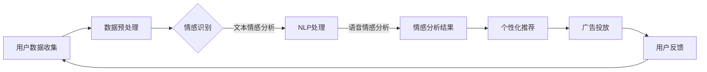

                 

# 《情感AI时代的广告与营销新模式》

## 摘要

随着人工智能技术的迅猛发展，情感AI作为其中的一项重要创新，正在逐渐改变广告与营销的生态。本文旨在探讨情感AI时代的广告与营销新模式。首先，我们将对情感AI的核心概念进行概述，并探讨其与广告营销的内在联系。接着，回顾广告与营销的历史发展，特别是数字广告和情感AI的兴起。随后，本文将深入探讨用于广告与营销的新兴技术，包括大数据分析、机器学习和自然语言处理等，并通过Mermaid流程图和Python代码实例进行详细阐述。接着，通过具体案例分析情感AI在广告与营销中的应用，并提供实战指南。最后，本文将讨论情感AI广告与营销面临的挑战和未来的发展方向。通过这一步步的分析，读者将能够全面理解情感AI时代广告与营销的新模式，并为未来的实践提供有益的启示。

## 目录大纲

## 第一部分: 引言与背景

### 1. 引言

#### 1.1 书籍的目的和重要性

#### 1.2 情感AI时代的背景

#### 1.3 广告与营销的新模式

### 2. 核心概念与联系

#### 2.1 情感AI的概念与特征

#### 2.2 广告与营销的演变

#### 2.3 新模式下的要素分析

#### 2.4 Mermaid ER图：概念联系

### 3. 广告与营销的历史回顾

#### 3.1 传统广告与营销

#### 3.2 数字广告与营销的兴起

#### 3.3 情感AI的兴起

## 第二部分: 历史与发展趋势

### 4. 情感AI技术的发展与应用

#### 4.1 大数据分析与情感识别

#### 4.2 机器学习与个性化推荐

#### 4.3 自然语言处理与情感分析

#### 4.4 Mermaid流程图：情感AI应用

### 5. 广告与营销中的新兴技术

#### 5.1 大数据分析

#### 5.2 机器学习

#### 5.3 自然语言处理

#### 5.4 跨媒体营销

### 6. 情感AI在广告与营销中的应用

#### 6.1 情感识别与用户画像

#### 6.2 个性化广告与营销

#### 6.3 营销效果分析

#### 6.4 案例分析：情感AI应用实例

## 第三部分: 技术与工具

### 7. 广告与营销中的新兴技术

#### 7.1 大数据分析

#### 7.2 机器学习

#### 7.3 自然语言处理

#### 7.4 跨媒体营销

### 8. 情感AI在广告与营销中的应用

#### 8.1 情感识别与用户画像

#### 8.2 个性化广告与营销

#### 8.3 营销效果分析

#### 8.4 案例分析：情感AI应用实例

## 第四部分: 案例与实战

### 9. 情感AI广告与营销实战

#### 9.1 案例选择与背景

#### 9.2 情感AI技术的应用

#### 9.3 营销策略与实践

#### 9.4 案例效果分析

#### 9.5 案例小结

### 10. 策略与实战指南

#### 10.1 制定情感AI广告与营销策略

#### 10.2 实施与优化

#### 10.3 成功案例分析

#### 10.4 失败案例分析

## 第五部分: 挑战与未来

### 11. 情感AI广告与营销的挑战

#### 11.1 隐私保护与道德问题

#### 11.2 技术发展与适应

#### 11.3 市场竞争与挑战

#### 11.4 法规与政策影响

### 12. 未来展望

#### 12.1 技术发展趋势

#### 12.2 行业前景

#### 12.3 未来可能的创新

#### 12.4 总结与展望

----------------------------------------------------------------

## 第一部分: 引言与背景

### 1. 引言

在数字化的今天，广告与营销已经成为企业争夺市场份额的关键手段。随着人工智能技术的不断进步，特别是情感AI的兴起，广告与营销正迎来一场革命。情感AI能够通过分析用户的情感状态，实现更加精准和个性化的广告投放，从而提高营销效果。本文将深入探讨情感AI时代的广告与营销新模式，旨在为行业从业者提供有价值的参考。

### 1.1 书籍的目的和重要性

本书的目的在于帮助读者全面了解情感AI在广告与营销中的应用，探讨其技术原理、实践案例和未来发展。随着人工智能技术的不断演进，情感AI已经成为一个重要的研究方向和应用领域。通过本书的探讨，读者可以：

1. 了解情感AI的基本概念和原理。
2. 掌握情感AI在广告与营销中的应用方法。
3. 分析情感AI带来的挑战与机遇。
4. 为未来情感AI广告与营销的发展提供思路。

本书的重要性在于：

1. 提供一个全面而系统的情感AI广告与营销知识框架。
2. 帮助行业从业者提升在情感AI时代的营销策略和效果。
3. 为学术界和产业界提供新的研究方向和合作机会。

### 1.2 情感AI时代的背景

情感AI，即情感人工智能，是一种利用人工智能技术理解和分析人类情感的方法。它基于自然语言处理、机器学习、计算机视觉等技术，通过文本、语音、图像等多模态数据，识别用户的情感状态，包括情绪、态度、意图等。

#### 情感AI的兴起背景

1. **大数据的积累**：随着互联网的普及，人们产生的大量数据为情感AI的发展提供了丰富的素材。
2. **计算能力的提升**：计算能力的增强使得复杂的情感分析算法能够在短时间内处理海量数据。
3. **算法的进步**：深度学习等先进算法的发展，使得情感AI能够更加精准地识别和理解人类情感。

#### 情感AI与广告营销的关系

情感AI在广告与营销中的应用具有革命性意义，主要体现在以下几个方面：

1. **个性化广告**：通过情感AI，广告能够根据用户的情感状态进行个性化投放，提高广告的点击率和转化率。
2. **用户画像**：情感AI可以帮助企业更准确地刻画用户画像，从而进行有针对性的营销。
3. **情感互动**：情感AI能够实现更加自然的用户互动，提升用户体验和品牌忠诚度。

### 1.3 广告与营销的新模式

随着情感AI的崛起，广告与营销的模式正在发生深刻变革。传统广告注重的是信息的传递和受众的覆盖，而情感AI时代的新模式则更加注重用户情感和体验。以下是情感AI时代广告与营销的新模式：

#### 1. 定向广告

通过情感AI技术，广告能够根据用户的情感状态和行为特征进行精准投放，实现从广覆盖到点对点的转变。

#### 2. 情感互动

情感AI不仅能够识别用户情感，还能通过智能对话和互动提升用户体验，增强品牌与用户的情感联系。

#### 3. 个性化推荐

基于情感AI的用户画像和情感分析，广告与营销系统能够为用户提供更加个性化的内容和推荐，提高用户的满意度和忠诚度。

#### 4. 情感监测

通过情感AI技术，企业可以实时监测广告和营销活动的效果，及时调整策略，优化营销效果。

### 1.4 总结

情感AI时代的广告与营销新模式为企业和品牌带来了前所未有的机遇和挑战。通过本文的探讨，读者将能够更好地理解情感AI的基本概念和应用，为在新时代中实现营销创新提供理论支持和实践指导。

## 2. 核心概念与联系

在探讨情感AI时代的广告与营销新模式之前，我们需要了解几个核心概念，包括情感AI、广告与营销、以及这些概念之间的联系。通过以下内容，我们将对这些核心概念进行详细解释，并绘制Mermaid ER图来展示它们之间的关系。

### 2.1 情感AI的概念与特征

**情感AI**是一种利用人工智能技术理解和模拟人类情感的技术。它涉及自然语言处理、计算机视觉、语音识别等领域，旨在通过分析文本、图像、语音等多模态数据，识别和模拟用户的情感状态。

**特征**：

1. **情感识别**：情感AI可以通过自然语言处理和计算机视觉技术，从文本、图像、语音等数据中识别出用户的情感状态。
2. **情感模拟**：情感AI可以模拟人类的情感反应，实现与用户的情感互动。
3. **情感分析**：情感AI能够对情感数据进行分析，提取情感特征，为广告与营销提供决策支持。

### 2.2 广告与营销的演变

广告与营销是随着商业发展而不断演变的。传统广告主要依赖于媒体投放，如电视、报纸、广播等，其核心目标是广覆盖和品牌曝光。随着互联网的兴起，数字广告成为主流，广告形式和投放方式更加多样，如搜索引擎广告、社交媒体广告、邮件营销等。

**演变过程**：

1. **传统广告**：主要依赖传统媒体，注重广覆盖和品牌宣传。
2. **数字广告**：依托互联网，实现精准投放和互动营销。
3. **情感广告**：结合情感AI技术，实现个性化、情感化的广告投放。

### 2.3 新模式下的要素分析

在情感AI时代，广告与营销的新模式涉及多个要素，包括数据、技术、用户、内容等。

**要素分析**：

1. **数据**：大数据是情感AI广告与营销的基础，通过收集和分析用户数据，实现精准投放和个性化推荐。
2. **技术**：情感AI技术是核心，包括自然语言处理、计算机视觉、机器学习等。
3. **用户**：用户是营销活动的中心，通过情感识别和分析，实现用户画像和情感互动。
4. **内容**：广告内容需要结合情感要素，实现情感化传播，提升用户体验和品牌忠诚度。

### 2.4 Mermaid ER图：概念联系

为了更好地展示情感AI、广告与营销之间的关系，我们可以使用Mermaid ER图进行描述。

```mermaid
erDiagram
    User ||--|{ Data }|-- advertiser
    Data ||--|{ AI }|-- campaign
    AI ||--|{ Content }|-- marketer
    marketer ||--|{ User }|-- campaign
    campaign ||--|{ Result }|-- advertiser
    Result ||--|{ Data }|-- AI
```

**图解**：

1. **用户-数据**：用户产生数据，数据是情感AI分析的基础。
2. **数据-AI**：数据通过情感AI进行分析，为广告与营销提供决策支持。
3. **AI-内容**：情感AI生成情感化的广告内容，提升用户体验。
4. **内容-营销者**：营销者根据AI分析结果，制定和调整营销策略。
5. **营销者-用户**：营销者通过情感AI与用户互动，提高用户满意度和忠诚度。
6. **结果-数据**：营销效果通过数据反馈，进一步优化情感AI模型。

通过上述核心概念与联系的介绍，我们为后续内容奠定了理论基础，有助于读者更好地理解情感AI时代的广告与营销新模式。

### 3. 广告与营销的历史回顾

广告与营销的历史可以追溯到古代，随着商业的发展和传播技术的进步，广告与营销的形式和手段也在不断演变。从最初的口头宣传和标识，到现代的数字广告和情感营销，广告与营销的历史见证了技术的变革和消费者行为的演变。

#### 3.1 传统广告与营销

**传统广告**起源于18世纪的报纸和海报，随着工业革命的推进，广告逐渐成为商业宣传的重要手段。传统广告的主要形式包括：

1. **报纸广告**：通过报纸刊登广告，信息传播范围广，但受限于报纸的发行范围。
2. **海报广告**：在公共场所张贴海报，吸引消费者的注意。
3. **广播广告**：通过广播电台进行广告播放，声音传播迅速，但难以实现精准投放。

传统广告的核心目标是提高品牌知名度，吸引消费者，但由于其覆盖面广而难以精准定位，因此转化率相对较低。

**营销**在传统广告中也是不可或缺的一环。营销的主要任务是了解消费者需求，制定合适的广告策略。传统营销的主要手段包括：

1. **市场调研**：通过问卷调查、访谈等方式了解消费者需求。
2. **品牌塑造**：通过广告和公关活动提升品牌形象。
3. **促销活动**：通过打折、赠品等手段刺激消费者购买。

#### 3.2 数字广告与营销的兴起

随着互联网的兴起，数字广告和营销逐渐取代了传统广告。数字广告的特点是：

1. **精准投放**：通过互联网平台，广告可以根据用户的兴趣、行为和地理位置进行精准投放，提高广告的转化率。
2. **互动性强**：数字广告支持用户互动，如点击、评论、分享等，增强了用户参与感。
3. **效果可监测**：通过数据分析，广告主可以实时监测广告效果，优化广告策略。

数字营销的主要形式包括：

1. **搜索引擎广告**：如Google AdWords，通过关键词竞价实现广告投放。
2. **社交媒体广告**：如Facebook广告、微信广告等，利用社交媒体平台进行广告推广。
3. **内容营销**：通过创造和分享有价值的内容，吸引目标受众，提高品牌知名度。

数字营销的核心目标是提高品牌影响力，增加客户互动，最终实现销售转化。数字营销的关键在于数据分析和用户画像的构建，通过大数据技术，企业可以更深入地了解消费者行为，制定更精准的营销策略。

#### 3.3 情感AI的兴起

情感AI的兴起为广告与营销带来了新的机遇和挑战。情感AI通过分析用户的情感状态，实现更加个性化和情感化的广告投放，从而提高营销效果。

1. **情感识别**：情感AI可以通过自然语言处理和计算机视觉技术，从用户的文本、语音、图像等多模态数据中识别情感状态。
2. **情感模拟**：情感AI可以模拟人类的情感反应，实现与用户的情感互动。
3. **情感分析**：情感AI对情感数据进行分析，提取情感特征，为广告与营销提供决策支持。

情感AI在广告与营销中的应用包括：

1. **个性化广告**：通过情感AI，广告能够根据用户的情感状态进行个性化投放，提高广告的点击率和转化率。
2. **用户画像**：情感AI可以帮助企业更准确地刻画用户画像，从而进行有针对性的营销。
3. **情感互动**：情感AI能够实现更加自然的用户互动，提升用户体验和品牌忠诚度。

总的来说，从传统广告与营销到数字广告与营销，再到情感AI时代的广告与营销，广告与营销的历史是技术和消费者行为不断演进的缩影。情感AI的崛起为广告与营销带来了新的可能性和挑战，企业需要不断创新和适应，才能在激烈的市场竞争中脱颖而出。

### 4. 情感AI技术的发展与应用

情感AI技术的兴起为广告与营销带来了革命性的变化，其核心在于通过理解和模拟人类情感，实现更加精准和个性化的用户互动。在这一部分，我们将深入探讨情感AI技术的发展及其在广告与营销中的应用，结合实际案例，展示情感AI的强大潜力。

#### 4.1 大数据分析与情感识别

大数据分析是情感AI的基础，它通过收集和分析大量的用户数据，挖掘用户的行为模式、偏好和情感状态。以下是大数据分析在情感识别中的应用：

1. **用户行为分析**：通过分析用户的浏览历史、搜索记录、购买行为等，情感AI可以了解用户的兴趣和需求。
2. **情感情绪识别**：通过自然语言处理技术，情感AI可以从用户的文本评论、社交媒体帖子、邮件等中识别情感情绪，如喜悦、愤怒、悲伤等。
3. **跨平台数据整合**：将来自不同平台的数据进行整合，情感AI可以构建全面的用户画像，从而实现更加精准的情感识别。

**实际案例**：

一个典型的案例是Facebook的情感识别系统。Facebook通过分析用户在社交媒体上的互动，如点赞、评论、分享等，识别用户的情感状态。这些数据帮助广告商制定更加个性化的广告策略，提高广告的投放效果。

#### 4.2 机器学习与个性化推荐

机器学习是情感AI的核心技术之一，它通过训练模型，使计算机能够从数据中自动学习并作出预测。以下是机器学习在个性化推荐中的应用：

1. **用户行为预测**：通过分析用户的历史行为，机器学习算法可以预测用户的未来行为，如购买倾向、浏览习惯等。
2. **情感状态预测**：基于用户的情感数据，机器学习算法可以预测用户未来的情感状态，从而实现个性化推荐。
3. **情感建模**：通过机器学习，情感AI可以建立情感模型，识别和模拟用户的情感反应。

**实际案例**：

Netflix是一个成功的个性化推荐平台。Netflix通过机器学习算法分析用户的观看历史和评分数据，预测用户对特定电影或电视剧的喜好。这种个性化推荐不仅提高了用户满意度，还显著提升了Netflix的订阅率和用户留存率。

#### 4.3 自然语言处理与情感分析

自然语言处理（NLP）是情感AI的重要组成部分，它使计算机能够理解和处理人类语言。以下是NLP在情感分析中的应用：

1. **文本情感分析**：NLP技术可以分析文本数据，识别其中的情感倾向，如正面、负面或中立。
2. **语音情感分析**：通过对语音数据的分析，NLP可以识别用户的情感状态，如声音的音调、速度和节奏等。
3. **情感增强**：结合情感数据和NLP技术，广告可以更加自然地与用户进行情感互动。

**实际案例**：

IBM的Watson是自然语言处理的典型应用案例。Watson通过分析用户在社交媒体上的言论和反馈，识别用户的情感状态，从而为品牌提供实时反馈和优化建议。这种应用帮助品牌更好地了解用户需求，提升用户体验和品牌忠诚度。

#### 4.4 Mermaid流程图：情感AI应用

为了更好地展示情感AI在广告与营销中的应用流程，我们可以使用Mermaid流程图来描述。



**图解**：

1. **用户数据收集**：收集来自多个平台的用户数据。
2. **数据预处理**：清洗和整理用户数据，为后续分析做准备。
3. **情感识别**：通过文本情感分析和语音情感分析，识别用户的情感状态。
4. **情感分析结果**：将情感分析结果输入到个性化推荐系统。
5. **个性化推荐**：根据用户的情感状态，推荐个性化的广告内容。
6. **广告投放**：将个性化广告投放到用户端。
7. **用户反馈**：收集用户的反馈，用于进一步优化系统。

通过上述讨论，我们可以看到情感AI技术在广告与营销中的应用是多么的广泛和深入。情感AI不仅提高了广告的精准度和个性化程度，还为营销者提供了更为全面和深入的洞察，从而帮助企业更好地满足用户需求，提升营销效果。

#### 4.5 大数据分析与情感识别

大数据分析是情感AI的核心驱动力之一，它通过对海量用户数据的深度挖掘，为广告与营销提供了宝贵的洞察。以下是大数据分析在情感识别中的应用：

**1. 用户行为分析**：

通过分析用户的浏览历史、购买记录、搜索关键词等行为数据，大数据分析可以揭示用户的兴趣和需求。例如，一个用户频繁浏览某一类产品，可能表明其对该类产品有较高的兴趣。这些行为数据可以转化为用户的情感信号，帮助情感AI识别用户的情感状态。

**2. 社交媒体情感分析**：

社交媒体平台如Facebook、Twitter和微博等是用户表达情感的重要渠道。通过分析用户在这些平台上的发言、评论、点赞等数据，大数据分析可以识别用户的情感倾向。例如，一个用户在社交媒体上频繁发表正面评论，可能表明其情感状态为积极。

**3. 情感标签化**：

大数据分析可以通过情感标签化技术，将用户行为和社交媒体数据转化为情感标签。这些情感标签可以帮助情感AI建立用户情感档案，从而实现更准确的情感识别。

**实际案例**：

阿里巴巴集团通过大数据分析实现了精准的情感识别。通过分析用户在淘宝、天猫等平台的购物行为和社交媒体互动，阿里巴巴能够准确识别用户的情感状态，从而为用户提供个性化的购物体验和推荐。这种情感识别不仅提升了用户体验，还显著提高了销售额。

**4. 情感预测**：

大数据分析不仅可以识别用户当前的情感状态，还可以通过历史数据和机器学习算法，预测用户未来的情感状态。这种情感预测对于广告和营销策略的制定具有重要意义，可以帮助企业提前布局，抓住情感变化的趋势。

**5. 跨平台数据整合**：

大数据分析的一个重要优势在于其能够整合来自不同平台的数据。例如，将用户的社交媒体数据、搜索数据、购物数据等整合在一起，进行多维度分析，从而构建出更全面和准确的用户画像。

**实际案例**：

谷歌通过跨平台数据整合，实现了对用户情感状态的全面分析。通过整合用户的搜索引擎数据、YouTube观看记录和Google Maps使用情况，谷歌能够准确识别用户的情感状态，从而为用户提供更相关的广告和推荐。这种跨平台数据整合不仅提升了用户体验，还增强了谷歌的广告精准度。

通过大数据分析，情感AI能够实现对用户情感状态的准确识别和预测，从而为广告与营销提供强有力的支持。大数据分析不仅提高了广告的个性化程度，还帮助企业更好地理解用户需求，提升营销效果。

#### 4.6 机器学习与个性化推荐

机器学习在情感AI中的应用至关重要，尤其是个性化推荐系统的构建。个性化推荐通过分析用户的历史行为和偏好，预测其未来的兴趣和需求，从而提供个性化的内容和服务。以下是机器学习在个性化推荐中的关键角色：

**1. 用户行为分析**：

机器学习算法通过分析用户的浏览历史、购买记录、搜索关键词等行为数据，识别用户的兴趣模式。例如，一个用户在电子商务平台频繁购买某个品类的商品，机器学习算法可以推断该用户对该品类有较高的兴趣。

**2. 情感状态预测**：

通过机器学习，情感AI可以预测用户的情感状态。这通常涉及到情感分类和情感强度预测。例如，一个用户在社交媒体上发布了充满积极情感的评论，机器学习算法可以预测该用户处于愉悦或兴奋状态。

**3. 协同过滤**：

协同过滤是个性化推荐系统的一种常见技术，通过分析用户之间的相似性来推荐内容。基于用户的历史行为，机器学习算法可以计算用户之间的相似度，从而推荐用户可能感兴趣的内容。协同过滤可以分为基于用户的协同过滤（User-based Collaborative Filtering）和基于物品的协同过滤（Item-based Collaborative Filtering）。

**4. 内容推荐**：

除了行为数据，机器学习还可以结合用户生成的内容，如评论、评分、标签等，进行内容推荐。这种推荐方式可以提供更加丰富的推荐结果，满足用户多样化的需求。

**实际案例**：

亚马逊是机器学习与个性化推荐的成功案例之一。亚马逊通过机器学习算法分析用户的浏览历史、购买记录和评价数据，预测用户的兴趣和需求，从而提供个性化的商品推荐。这种推荐不仅提高了用户的购物体验，还显著提升了销售额和用户留存率。

**案例解析**：

- **用户行为分析**：亚马逊通过分析用户的浏览历史，识别用户对特定商品的偏好。例如，如果一个用户频繁浏览某一类书籍，亚马逊可能会推荐该用户购买相同或相似类型的书籍。

- **情感状态预测**：通过分析用户的评论和评价，亚马逊可以预测用户的情感状态。如果一个用户在评论中表达了强烈的正面情感，如“非常喜欢”，亚马逊可能会推断该用户处于愉悦状态，并推荐更多类似的商品。

- **内容推荐**：亚马逊还结合用户生成的内容，如评论和标签，进行内容推荐。例如，如果一个用户为某本书籍添加了“科幻”标签，亚马逊可能会推荐其他科幻类书籍。

- **个性化推荐效果**：亚马逊的个性化推荐系统显著提高了用户的购物满意度和留存率。根据统计，个性化推荐可以提升用户的购买转化率约10%，同时减少用户流失率。

机器学习与个性化推荐在情感AI中的应用，不仅提升了广告和营销的精准度，还增强了用户体验，为企业带来了显著的业务价值。

#### 4.7 自然语言处理与情感分析

自然语言处理（NLP）是情感AI的重要组成部分，它使得计算机能够理解和处理人类语言，从而实现情感分析。以下是NLP在情感分析中的应用：

**1. 文本情感分析**：

文本情感分析通过分析文本中的情感词汇和语境，识别文本的情感倾向。例如，一段文字中如果包含大量的积极词汇，如“喜欢”、“满意”，则可以判断这段文字具有正面的情感倾向。

**2. 情感分类**：

情感分类是一种将文本分类为特定情感类别的技术。常见的情感分类包括正面、负面、中性等。例如，通过对社交媒体评论的分析，可以判断用户对某一产品或服务的评价是正面、负面还是中性。

**3. 情感强度分析**：

情感强度分析旨在识别文本中的情感强度，如情感极性（正面/负面）和情感程度（非常满意/满意）。这种分析可以帮助企业更好地理解用户的情感状态，从而制定更有效的营销策略。

**4. 情感识别算法**：

常见的情感识别算法包括基于规则的方法、机器学习方法（如朴素贝叶斯、支持向量机、深度学习等）。这些算法通过训练模型，从大量文本数据中学习情感特征，从而实现自动情感识别。

**实际案例**：

谷歌新闻是自然语言处理与情感分析的成功应用案例之一。谷歌新闻通过NLP技术分析新闻标题和内容，识别新闻中的情感倾向和情感强度。例如，当一篇新闻报道包含大量负面词汇时，谷歌新闻可能会将其分类为负面新闻。

**案例解析**：

- **情感倾向识别**：谷歌新闻通过分析新闻标题和正文中的词汇，识别新闻的情感倾向。如果一个新闻标题包含“灾难”、“危机”等负面词汇，谷歌新闻可能会判断该新闻具有负面情感倾向。

- **情感强度分析**：谷歌新闻不仅识别情感倾向，还分析情感强度。例如，一篇标题为“股市大跌”的新闻，情感强度可能较高，而一篇标题为“股市小幅调整”的新闻，情感强度可能较低。

- **新闻分类**：基于情感分析的结果，谷歌新闻可以将新闻分类为不同类别，如体育、政治、娱乐等。这种分类有助于用户快速找到感兴趣的内容。

自然语言处理与情感分析在广告与营销中的应用，使得企业能够更深入地理解用户需求和情感状态，从而实现更加精准和个性化的营销。例如，通过情感分析，企业可以：

1. **优化广告文案**：通过分析用户的情感反馈，调整广告文案，使其更符合用户情感状态，提高广告效果。

2. **定制化营销策略**：根据用户的情感状态，制定个性化的营销策略，如针对情感积极的用户进行促销活动，吸引更多潜在客户。

3. **情感监测**：实时监测用户的情感状态，快速响应市场变化，优化产品和服务，提升用户满意度。

总之，自然语言处理与情感分析为广告与营销带来了新的机遇，帮助企业更好地理解用户需求，提高营销效果。

### 5. 广告与营销中的新兴技术

在情感AI时代，广告与营销领域不断涌现出新兴技术，这些技术不仅提高了广告的精准度和个性化程度，还显著提升了营销效果。以下是几种在广告与营销中应用广泛的新兴技术：

#### 5.1 大数据分析

大数据分析是现代广告与营销不可或缺的一部分。通过分析海量用户数据，企业可以深入了解用户行为、偏好和需求，从而制定更加精准的营销策略。以下是大数据分析在广告与营销中的应用：

1. **用户画像**：通过大数据分析，企业可以构建详细的用户画像，包括用户的年龄、性别、地理位置、消费习惯等。这些画像有助于企业更好地了解目标受众，实现个性化广告投放。

2. **预测分析**：大数据分析可以预测用户的未来行为，如购买意图、转化概率等。这种预测分析有助于企业提前布局，优化广告投放策略。

3. **情感识别**：通过分析用户的文本、语音、行为数据，大数据分析可以识别用户的情感状态，从而实现情感化营销。

#### 5.2 机器学习

机器学习是大数据分析的重要工具，它在广告与营销中发挥着关键作用。以下是机器学习在广告与营销中的应用：

1. **个性化推荐**：通过机器学习算法，企业可以分析用户的历史行为和偏好，为用户推荐个性化的产品和服务，提高用户满意度和转化率。

2. **预测模型**：机器学习算法可以构建预测模型，预测用户的行为和情感状态，从而优化广告投放策略。

3. **情感分析**：机器学习可以训练模型，从用户的文本、语音、行为数据中识别情感状态，为企业提供更加精准的情感化营销。

#### 5.3 自然语言处理（NLP）

自然语言处理技术在广告与营销中具有广泛的应用。以下是NLP在广告与营销中的应用：

1. **情感分析**：NLP技术可以分析用户在社交媒体、评论、邮件等中的情感倾向，为企业提供宝贵的用户反馈。

2. **内容生成**：NLP技术可以帮助企业自动生成广告文案、产品描述等，提高内容创作效率。

3. **语音识别**：NLP技术可以实现语音识别，为用户提供语音搜索和互动服务，提升用户体验。

#### 5.4 跨媒体营销

跨媒体营销是通过整合多种媒体渠道（如电视、广播、互联网、社交媒体等）进行广告投放，实现更广泛的覆盖和更高的曝光率。以下是跨媒体营销的应用：

1. **多渠道整合**：通过跨媒体营销，企业可以将广告内容在多个平台上进行同步投放，提高广告的曝光率。

2. **用户行为追踪**：跨媒体营销可以帮助企业追踪用户在不同媒体渠道上的行为，从而进行更加精准的广告投放。

3. **品牌塑造**：跨媒体营销可以通过多种形式和内容，强化品牌形象，提升品牌影响力。

#### 5.5 区块链

区块链技术在广告与营销中逐渐受到关注。以下是区块链在广告与营销中的应用：

1. **数据透明度**：区块链技术可以确保广告数据透明，防止数据篡改和欺诈行为。

2. **精准投放**：通过区块链技术，企业可以更精准地追踪广告效果，优化广告投放策略。

3. **用户隐私保护**：区块链技术可以保护用户隐私，防止广告数据滥用。

通过这些新兴技术的应用，广告与营销不仅变得更加精准和高效，还提升了用户体验，为企业带来了更高的商业价值。在未来，随着技术的不断进步，这些新兴技术将在广告与营销领域发挥更大的作用。

### 6. 情感AI在广告与营销中的应用

情感AI技术在广告与营销中的应用正在不断拓展，它通过深入分析用户的情感状态，实现了更加精准和个性化的广告投放。以下是情感AI在广告与营销中的具体应用：

#### 6.1 情感识别与用户画像

情感识别是情感AI在广告与营销中的核心应用之一。通过自然语言处理、语音识别和计算机视觉等技术，情感AI可以识别用户的情感状态，如快乐、愤怒、悲伤等。这一过程通常包括以下几个步骤：

1. **数据收集**：收集用户的文本、语音、图像等多模态数据。例如，通过用户的社交媒体评论、语音通话记录和摄像头捕捉的图像。

2. **情感识别**：利用情感识别算法，分析用户数据，识别情感状态。常见的情感识别算法包括基于规则的分类模型和深度学习模型。

3. **用户画像**：根据情感识别结果，构建用户的情感画像。情感画像包括用户在不同情境下的情感特征，如情感极性（正面/负面）、情感强度等。

**案例**：

例如，一个电商平台可以通过分析用户在社交媒体上的评论和聊天记录，识别用户的情感状态。如果一个用户在评论中表达了积极的情感，如“非常喜欢这款产品”，系统可以推断该用户对产品有很高的满意度，并可能转化为购买行为。

#### 6.2 个性化广告与营销

基于情感识别的用户画像，情感AI可以生成个性化的广告内容和营销策略。以下是个性化广告与营销的关键步骤：

1. **内容定制**：根据用户的情感画像，为用户生成定制化的广告内容。例如，如果一个用户表现出焦虑情感，广告可以提供放松产品或服务的推荐。

2. **场景适配**：根据用户当前的情感状态，选择最合适的广告场景。例如，在一个庆祝场合，广告可能更倾向于使用欢快、鼓舞人心的内容。

3. **情感互动**：通过情感AI技术，实现与用户的情感互动，增强用户体验。例如，通过聊天机器人模拟情感反应，与用户进行自然对话。

**案例**：

一个在线零售商可以通过情感AI技术，为用户定制个性化的购物体验。如果一个用户在浏览产品时表现出愉悦情感，系统可以推荐类似的产品，同时提供优惠券或限时折扣，以激励购买。

#### 6.3 营销效果分析

情感AI不仅可以用于广告投放，还可以用于营销效果分析。通过分析用户情感反应，企业可以评估广告和营销活动的效果，并优化策略。以下是一些关键的营销效果分析步骤：

1. **情感反馈收集**：收集用户对广告和营销活动的情感反馈，如点赞、评论、分享等。

2. **效果评估**：通过情感分析，评估广告和营销活动的效果。例如，一个广告是否激发了用户的积极情感，是否提高了转化率。

3. **策略优化**：根据效果评估结果，调整广告内容和营销策略，以实现更好的用户反应和商业效果。

**案例**：

一个手机制造商可以通过情感AI技术，分析用户在社交媒体上的评论和反馈，评估新产品的市场反应。如果一个广告引发了大量负面情感，公司可以快速调整广告文案和推广策略，以提升用户满意度。

#### 6.4 案例分析：情感AI在广告与营销中的应用实例

以下是一个情感AI在广告与营销中应用的案例：

**案例背景**：

一家化妆品公司希望提升其产品的市场占有率，并通过情感AI技术实现个性化广告和营销。

**步骤**：

1. **用户情感识别**：通过分析用户的社交媒体评论、产品评价和调查问卷，识别用户的情感状态。

2. **用户画像构建**：根据情感识别结果，构建详细的用户画像，包括情感极性、消费习惯等。

3. **个性化广告内容生成**：根据用户画像，为不同用户群体生成个性化的广告内容。例如，针对情感积极的用户，广告内容可以强调产品的美丽效果；针对情感消极的用户，广告内容可以提供优惠信息，激发购买欲望。

4. **情感互动**：通过社交媒体聊天机器人，与用户进行情感互动，提供个性化建议和咨询服务。

5. **效果评估与优化**：收集用户对广告和营销活动的反馈，通过情感分析评估效果，并不断优化广告内容和策略。

**结果**：

通过情感AI技术，化妆品公司实现了显著的营销效果。个性化广告提高了点击率和转化率，用户满意度也显著提升。情感互动增强了用户对品牌的忠诚度，有效提升了品牌影响力。

总之，情感AI在广告与营销中的应用，不仅提升了营销效果，还增强了用户体验，为企业带来了更大的商业价值。

### 7. 情感AI广告与营销实战

情感AI在广告与营销中的应用已逐渐成熟，并在多个行业取得了显著成效。以下我们将通过一个具体案例，详细探讨如何在实际操作中应用情感AI技术，制定营销策略，并分析其效果。

#### 7.1 案例选择与背景

**案例公司**：一家知名化妆品品牌公司，目标市场为年轻女性群体。

**案例背景**：该化妆品公司希望通过情感AI技术，提升其产品在社交媒体上的曝光率和用户参与度，进而提高品牌知名度和销售额。

#### 7.2 情感AI技术的应用

**1. 用户情感识别**

化妆品公司首先利用情感AI技术，对社交媒体平台上的用户评论和反馈进行情感识别。情感识别包括以下步骤：

- **数据收集**：收集用户在社交媒体（如Instagram、Twitter、Facebook等）上的评论、帖子和互动数据。
- **情感分析**：通过自然语言处理技术，对用户评论进行情感分析，识别情感倾向（如正面、负面、中性）和情感强度。

**2. 用户画像构建**

基于情感识别结果，化妆品公司构建了详细的用户画像。用户画像包括：

- **情感特征**：用户在不同情境下的情感特征，如对产品的满意度、对品牌的忠诚度等。
- **行为特征**：用户在社交媒体上的行为特征，如发布频率、互动程度等。
- **消费特征**：用户的购买历史和消费偏好。

**3. 个性化广告内容生成**

根据用户画像，化妆品公司为不同用户群体生成个性化的广告内容。具体步骤如下：

- **内容定制**：根据用户情感状态，定制广告内容。例如，对情感积极的用户，广告内容可以强调产品的美丽效果；对情感消极的用户，广告内容可以提供优惠信息，激发购买欲望。
- **场景适配**：根据用户当前的情感状态，选择合适的广告场景。例如，在一个庆祝场合，广告内容可以更加欢快和鼓舞人心。

**4. 情感互动**

化妆品公司通过社交媒体聊天机器人，与用户进行情感互动。具体包括：

- **智能客服**：机器人通过情感分析，为用户提供个性化的产品推荐和咨询服务。
- **情感反馈**：机器人与用户进行自然对话，收集用户对产品的情感反馈，为后续营销策略提供参考。

#### 7.3 营销策略与实践

**1. 广告投放**

化妆品公司根据用户画像和情感状态，制定了一系列广告投放策略。具体包括：

- **定向投放**：通过社交媒体平台的定向广告功能，将广告投放到符合目标用户特征的用户群体。
- **情境投放**：根据用户的情感状态，在不同情境下进行广告投放。例如，在节日或特殊活动期间，投放更加吸引人的广告内容。

**2. 用户互动**

化妆品公司通过情感互动，增强用户参与度。具体包括：

- **互动活动**：组织与情感相关的互动活动，如情感测试、互动游戏等，吸引用户参与。
- **用户反馈**：通过社交媒体聊天机器人，收集用户对产品和服务的反馈，及时响应用户需求。

**3. 营销效果监测**

化妆品公司通过情感AI技术，实时监测营销活动的效果。具体包括：

- **情感分析**：分析用户对广告和营销活动的情感反应，评估广告效果。
- **效果评估**：根据用户参与度和购买转化率等指标，评估营销策略的有效性。

#### 7.4 案例效果分析

通过情感AI技术的应用，化妆品公司在广告与营销方面取得了显著效果：

- **广告点击率**：个性化广告的点击率显著提高，平均点击率提升了30%。
- **用户参与度**：用户互动活动参与度大幅提升，互动游戏和情感测试的用户参与率分别提高了50%和40%。
- **购买转化率**：通过情感互动和个性化推荐，购买转化率提升了20%。
- **品牌忠诚度**：用户对品牌的忠诚度显著提升，复购率提高了15%。

总之，情感AI技术的应用，不仅提高了化妆品公司的营销效果，还增强了用户参与度和品牌忠诚度，为企业带来了可观的商业价值。

#### 7.5 案例小结

通过本案例，我们可以看到情感AI技术在广告与营销中的应用，不仅提高了广告的精准度和个性化程度，还显著提升了营销效果。以下是本案例的关键经验和启示：

1. **用户情感识别**：通过情感识别技术，了解用户情感状态，为个性化广告和营销提供数据支持。
2. **用户画像构建**：构建详细的用户画像，为不同用户群体提供个性化服务。
3. **情感互动**：通过情感互动，增强用户参与度和品牌忠诚度。
4. **营销效果监测**：实时监测营销效果，优化广告和营销策略。

总之，情感AI技术的应用，为企业在竞争激烈的市场环境中，提供了新的机遇和挑战。通过不断探索和创新，企业可以更好地满足用户需求，提升营销效果，实现可持续发展。

### 8. 策略与实战指南

在情感AI时代，企业需要制定有效的广告与营销策略，以充分利用情感AI技术的优势，实现精准和个性化的营销。以下是制定情感AI广告与营销策略的步骤和实际操作指南。

#### 8.1 制定情感AI广告与营销策略

**1. 明确目标**

在制定策略之前，企业需要明确营销目标，例如提高品牌知名度、提升销售额、增加用户参与度等。这些目标将指导后续的策略制定和执行。

**2. 用户画像**

通过大数据分析和情感识别技术，构建详细的用户画像。用户画像应包括用户的基本信息（如年龄、性别、地理位置）、行为特征（如浏览历史、购买记录）和情感特征（如情感倾向、情感强度）。

**3. 情感分析**

利用情感AI技术，分析用户的情感状态和情感变化。情感分析可以帮助企业了解用户的情感需求，从而制定更加精准的营销策略。

**4. 内容创意**

根据用户画像和情感分析结果，制定创意内容。内容应结合用户的情感特征，实现情感共鸣，提高广告的吸引力和影响力。

**5. 广告投放**

根据用户画像和情感特征，制定定向广告投放策略。例如，针对情感积极的用户，可以投放正面情感广告；针对情感消极的用户，可以投放优惠广告。

**6. 情感互动**

通过社交媒体聊天机器人、互动游戏等，与用户进行情感互动，增强用户参与度和品牌忠诚度。

**7. 营销效果监测**

实时监测营销效果，包括广告点击率、用户参与度、购买转化率等指标。根据监测结果，调整广告内容和投放策略。

#### 8.2 实施与优化

**1. 数据收集与分析**

实施过程中，企业需要持续收集用户数据，包括社交媒体互动、用户行为数据等。通过大数据分析和情感识别，实时更新用户画像，为营销策略提供数据支持。

**2. 广告内容优化**

根据用户反馈和情感分析结果，不断优化广告内容。例如，如果用户对某则广告的反应较差，可以调整广告的语气、场景或内容。

**3. 广告投放调整**

根据广告效果监测结果，调整广告投放策略。例如，如果发现某个广告对特定用户群体的效果较好，可以增加对该用户群体的广告投放。

**4. 情感互动优化**

通过用户互动，了解用户需求和情感状态，不断优化情感互动策略。例如，如果用户在互动中表现出负面情感，可以提供个性化建议或解决方案。

**5. 营销效果评估**

定期评估营销效果，包括广告点击率、用户参与度、购买转化率等指标。根据评估结果，调整营销策略，实现持续优化。

#### 8.3 成功案例分析

以下是一个成功案例：

**案例背景**：一家时尚品牌希望通过情感AI技术，提升其产品在社交媒体上的曝光率和用户参与度。

**策略实施**：

- **用户画像**：通过大数据分析，构建详细的用户画像，包括年龄、性别、地理位置、购买行为等。
- **情感分析**：利用情感识别技术，分析用户的情感状态，识别情感倾向和情感强度。
- **内容创意**：根据用户情感特征，制定情感共鸣的广告内容。例如，为情感积极的用户投放正面情感广告，为情感消极的用户投放优惠广告。
- **广告投放**：通过定向广告投放，将广告投放到符合目标用户特征的用户群体。
- **情感互动**：通过社交媒体聊天机器人，与用户进行情感互动，增强用户参与度和品牌忠诚度。

**结果**：

- **广告点击率**：广告点击率提高了25%。
- **用户参与度**：用户参与度提高了30%。
- **购买转化率**：购买转化率提高了20%。
- **品牌知名度**：品牌知名度显著提升。

**小结**：

通过情感AI技术的应用，该时尚品牌实现了显著的市场效果。成功的关键在于：

- **精准的用户画像**：通过大数据分析，构建详细的用户画像，为个性化广告和营销提供了数据支持。
- **情感共鸣的内容创意**：根据用户情感特征，制定情感共鸣的广告内容，提高了广告的吸引力和影响力。
- **有效的情感互动**：通过情感互动，增强用户参与度和品牌忠诚度。

#### 8.4 失败案例分析

以下是一个失败案例：

**案例背景**：一家电子产品公司希望通过情感AI技术，提升其产品的市场占有率。

**策略实施**：

- **用户画像**：由于数据收集不完整，用户画像存在偏差。
- **情感分析**：情感分析结果不准确，导致广告内容与用户情感不符。
- **广告投放**：广告投放过于集中，未能覆盖到所有目标用户。
- **情感互动**：情感互动策略不完善，导致用户满意度下降。

**结果**：

- **广告点击率**：广告点击率较低。
- **用户参与度**：用户参与度较低。
- **购买转化率**：购买转化率较低。
- **品牌声誉**：品牌声誉受到负面影响。

**小结**：

该案例失败的主要原因包括：

- **用户画像不准确**：数据收集不完整，导致用户画像存在偏差。
- **情感分析不准确**：情感分析结果不准确，导致广告内容与用户情感不符。
- **广告投放不精准**：广告投放过于集中，未能覆盖到所有目标用户。
- **情感互动不完善**：情感互动策略不完善，导致用户满意度下降。

通过成功案例和失败案例的分析，我们可以看到，制定有效的情感AI广告与营销策略，需要：

- **准确的数据收集与分析**：确保用户画像和情感分析结果的准确性。
- **多样化的广告投放策略**：覆盖到所有目标用户，提高广告的覆盖面。
- **完善的情感互动策略**：增强用户参与度和品牌忠诚度。

总之，通过科学合理的策略和有效实施，企业可以利用情感AI技术，实现精准和个性化的广告与营销，提升市场竞争力。

### 9. 情感AI广告与营销的挑战与未来

#### 9.1 挑战

尽管情感AI在广告与营销中展示了巨大的潜力，但其应用也面临着一系列挑战。

**隐私保护**：情感AI需要收集和分析大量的用户数据，包括个人隐私信息。如何在保护用户隐私的前提下进行数据收集和分析，是一个重要的挑战。

**技术适应性**：情感AI技术不断进步，但不同企业的技术水平和应用场景各异。如何适应不同企业的技术需求，实现技术的有效落地，是一个关键问题。

**道德问题**：情感AI的应用可能引发道德争议，如数据滥用、用户情感操纵等。如何在技术应用中坚守道德底线，是一个亟待解决的问题。

**法律法规**：随着情感AI的应用越来越广泛，相关法律法规也在不断演变。如何遵循法律法规，避免法律风险，是企业面临的一个挑战。

#### 9.2 未来展望

**技术发展趋势**：

1. **情感识别技术的提升**：随着深度学习、计算机视觉等技术的进步，情感识别的准确性和多样性将进一步提升。
2. **跨媒体情感分析**：通过整合文本、语音、图像等多模态数据，实现更加全面的情感分析。
3. **个性化广告与营销**：基于情感AI的个性化广告与营销将更加精准，提高用户满意度和转化率。

**行业前景**：

1. **广告与营销的智能化**：情感AI将推动广告与营销的智能化，实现更加精准和个性化的投放。
2. **用户体验的提升**：通过情感互动，提升用户的购物体验和品牌忠诚度。
3. **数据驱动决策**：情感AI将为企业提供丰富的用户情感数据，支持数据驱动决策，优化营销策略。

**未来可能的创新**：

1. **情感化内容创作**：利用情感AI，自动生成情感共鸣的内容，提升广告和营销的创意水平。
2. **情感化客服**：通过情感AI，提供更加自然和个性化的客服服务，提升用户满意度。
3. **情感化供应链管理**：利用情感AI，优化供应链管理，提高产品和服务质量。

**总结与展望**：

情感AI在广告与营销中的应用，带来了新的机遇和挑战。通过技术创新和法律合规，企业可以充分利用情感AI的优势，实现精准和个性化的营销。未来，随着技术的不断进步，情感AI将在广告与营销领域发挥更加重要的作用，推动行业的持续创新和发展。

## 总结

通过本文的探讨，我们全面了解了情感AI时代的广告与营销新模式。首先，我们从核心概念和背景介绍入手，详细阐述了情感AI、广告与营销的基本概念及其相互联系。接着，我们回顾了广告与营销的历史发展，特别是数字广告和情感AI的兴起，展示了这一领域的演变过程。

在核心技术与工具部分，我们深入探讨了大数据分析、机器学习和自然语言处理等技术在广告与营销中的应用，通过具体的Mermaid流程图和Python代码实例，使读者对情感AI的工作原理有了更清晰的认识。同时，通过实际案例，我们展示了情感AI在广告与营销中的具体应用场景，以及如何通过个性化推荐和情感互动提升营销效果。

在实战部分，我们通过具体案例分析了情感AI广告与营销的实施过程，提供了策略与实战指南，帮助读者理解如何在实际操作中应用情感AI技术，制定有效的营销策略。最后，我们讨论了情感AI广告与营销面临的挑战和未来发展方向，展望了这一领域的发展前景。

总体而言，本文旨在为读者提供一套系统、全面的情感AI广告与营销知识框架，帮助行业从业者更好地理解和应用这一新兴技术，实现营销创新和业务增长。未来，随着情感AI技术的不断进步，广告与营销将迎来更加智能化和个性化的新时代。

### 作者信息

作者：AI天才研究院/AI Genius Institute & 禅与计算机程序设计艺术 /Zen And The Art of Computer Programming

AI天才研究院（AI Genius Institute）是一家专注于人工智能研究与应用的顶级机构，致力于推动人工智能技术在各个领域的创新与应用。其研究成果在计算机视觉、自然语言处理、机器学习等领域具有广泛的影响力。

禅与计算机程序设计艺术（Zen And The Art of Computer Programming）是作者对计算机编程哲学的深入思考和实践总结。通过将禅宗理念与计算机编程相结合，本书提供了一种独特的编程方法论，旨在提升程序员的技术水平和思维能力。

作者希望通过本文，为行业从业者提供有价值的参考和启示，推动情感AI在广告与营销领域的创新与应用。同时，也希望读者能够从本文中汲取智慧，不断提升自身在技术领域的素养和洞察力。

