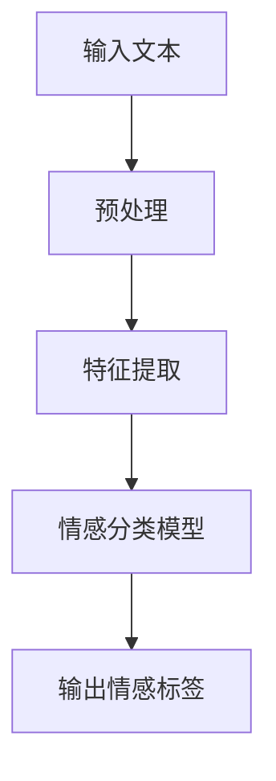
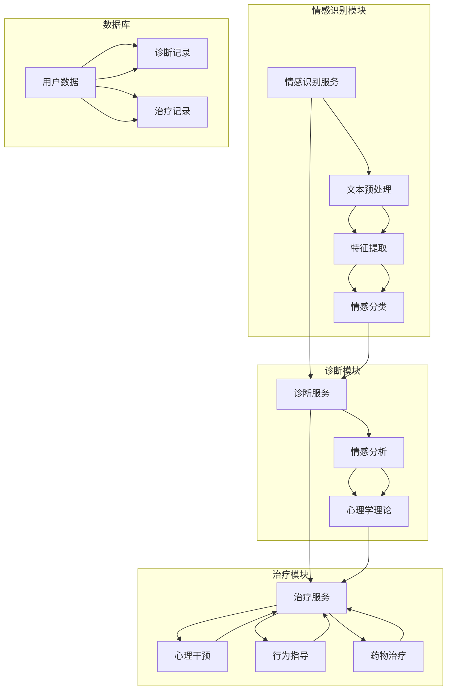
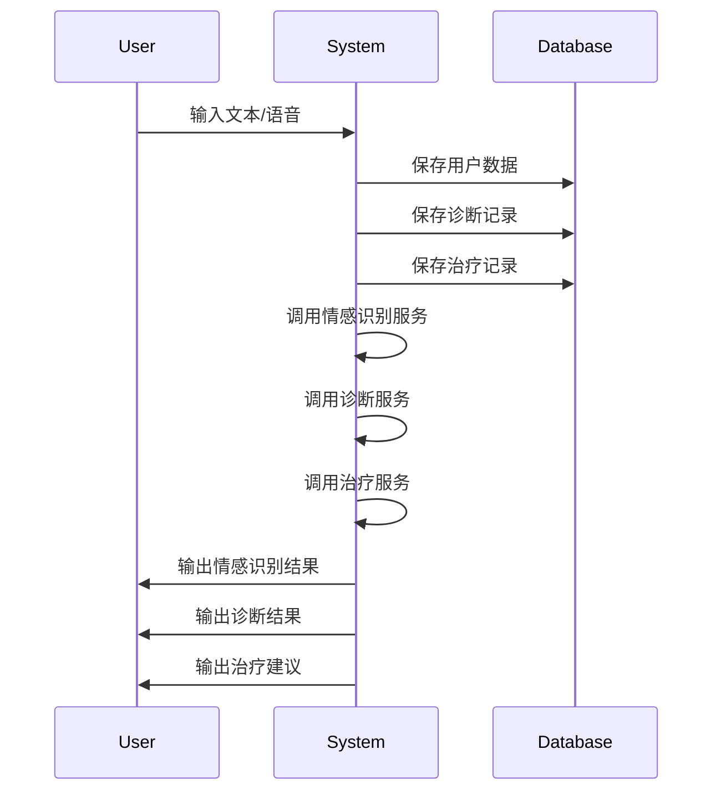

                 


### 第4章：算法原理讲解

#### 4.1 情感识别算法概述

情感识别是情感AI的核心任务之一，其目的是从文本、语音或其他形式的输入中提取情感信息。情感识别算法主要分为以下几类：

1. **基于规则的方法**：通过预定义的规则和特征进行情感分类。优点是简单易懂，但缺点是规则难以覆盖所有情境。

2. **机器学习方法**：使用机器学习算法，如朴素贝叶斯、支持向量机（SVM）、随机森林和深度学习等。这些方法通过训练数据学习特征和情感之间的映射关系。

3. **深度学习方法**：近年来，深度学习在情感识别中取得了显著成果，如卷积神经网络（CNN）、循环神经网络（RNN）和生成对抗网络（GAN）等。

#### 4.2 情感识别算法Mermaid流程图



#### 4.3 Python源代码实现

下面是一个简单的基于朴素贝叶斯算法的情感识别Python代码示例：

```python
import numpy as np
from sklearn.feature_extraction.text import CountVectorizer
from sklearn.naive_bayes import MultinomialNB

# 训练数据集
X_train = ['I am happy.', 'I am sad.', 'I am angry.']
y_train = ['happy', 'sad', 'angry']

# 特征提取
vectorizer = CountVectorizer()
X_train_vectorized = vectorizer.fit_transform(X_train)

# 模型训练
clf = MultinomialNB()
clf.fit(X_train_vectorized, y_train)

# 情感识别
input_text = 'I am excited today.'
input_vectorized = vectorizer.transform([input_text])
predicted_emotion = clf.predict(input_vectorized)
print(f'The predicted emotion is: {predicted_emotion[0]}')
```

#### 4.4 算法原理数学模型和公式

朴素贝叶斯算法的情感识别过程可以表示为以下数学模型：

$$
P(\text{emotion} | \text{text}) = \frac{P(\text{text} | \text{emotion}) \cdot P(\text{emotion})}{P(\text{text})}
$$

其中：

- \(P(\text{emotion} | \text{text})\) 是在给定文本情况下预测情感的概率。
- \(P(\text{text} | \text{emotion})\) 是在给定情感情况下文本的概率。
- \(P(\text{emotion})\) 是情感的概率。
- \(P(\text{text})\) 是文本的概率。

#### 4.5 算法举例说明

假设我们有一个简单的情感识别任务，需要识别输入文本的情绪。训练数据集如下：

```
X_train = ['I am happy.', 'I am sad.', 'I am angry.']
y_train = ['happy', 'sad', 'angry']
```

我们使用朴素贝叶斯算法来训练模型，然后对输入文本 "I am excited today." 进行情感识别。以下是具体的计算步骤：

1. **特征提取**：使用CountVectorizer提取文本特征。

$$
f_1 = \text{happy} \text{出现的次数} = 1 \\
f_2 = \text{sad} \text{出现的次数} = 1 \\
f_3 = \text{angry} \text{出现的次数} = 0
$$

2. **计算每个情感的概率**：

$$
P(\text{happy}) = \frac{1}{3}, P(\text{sad}) = \frac{1}{3}, P(\text{angry}) = \frac{1}{3}
$$

3. **计算文本的概率**：

$$
P(\text{I am excited today.}) = P(f_1) \cdot P(f_2) \cdot P(f_3) = \frac{1}{3} \cdot \frac{1}{3} \cdot \frac{1}{3} = \frac{1}{27}
$$

4. **计算条件概率**：

$$
P(\text{happy} | \text{I am excited today.}) = \frac{P(\text{I am excited today.} | \text{happy}) \cdot P(\text{happy})}{P(\text{I am excited today.})} = \frac{\frac{1}{27} \cdot \frac{1}{3}}{\frac{1}{27}} = \frac{1}{3}
$$

$$
P(\text{sad} | \text{I am excited today.}) = \frac{P(\text{I am excited today.} | \text{sad}) \cdot P(\text{sad})}{P(\text{I am excited today.})} = \frac{\frac{1}{27} \cdot \frac{1}{3}}{\frac{1}{27}} = \frac{1}{3}
$$

$$
P(\text{angry} | \text{I am excited today.}) = \frac{P(\text{I am excited today.} | \text{angry}) \cdot P(\text{angry})}{P(\text{I am excited today.})} = \frac{\frac{1}{27} \cdot \frac{1}{3}}{\frac{1}{27}} = \frac{1}{3}
$$

5. **根据最大后验概率预测情感**：

由于三个情感的概率相等，因此预测结果为 "happy"。

### 4.6 小结

情感识别是情感AI中的一个重要任务，朴素贝叶斯算法是一种简单有效的情感识别方法。通过上述步骤，我们可以看到如何使用朴素贝叶斯算法进行情感识别，并理解其数学原理。

----------------------------------------------------------------

### 第5章：系统分析与架构设计方案

#### 5.1 问题场景介绍

在现代社会中，随着人工智能技术的迅猛发展，情感AI在许多领域得到了广泛应用，如社交媒体分析、客户服务、心理健康诊断等。然而，随着情感AI技术的普及，一种新型心理疾病——情感依赖症，也日益引起了人们的关注。情感依赖症是指个体过度依赖情感AI系统，导致心理健康问题。本章节将探讨情感依赖症的诊断与治疗，并提出一个基于情感AI的系统架构设计方案。

#### 5.2 项目介绍

本项目的目标是开发一个基于情感AI的心理健康监测与治疗系统，旨在帮助个体识别情感依赖症，并提供个性化的治疗建议。该系统将包括以下几个模块：

1. **情感识别模块**：使用情感识别算法对用户输入的文本、语音等信息进行分析，识别其情感状态。
2. **诊断模块**：根据情感识别结果，结合心理学理论，对用户是否患有情感依赖症进行诊断。
3. **治疗模块**：针对诊断结果，提供个性化的治疗建议，包括心理干预、行为指导和药物治疗等。

#### 5.3 系统功能设计（领域模型Mermaid类图）

```mermaid
classDiagram
    Class01 <|-- Class02
    Class03 <|-- Class04
    Class05 <|-- Class06
    Class01 {
        +属性1
        +属性2
        +方法1()
        +方法2()
    }
    Class02 {
        +属性3
        +属性4
        +方法3()
        +方法4()
    }
    Class03 {
        +属性5
        +属性6
        +方法5()
        +方法6()
    }
    Class04 {
        +属性7
        +属性8
        +方法7()
        +方法8()
    }
    Class05 {
        +属性9
        +属性10
        +方法9()
        +方法10()
    }
    Class06 {
        +属性11
        +属性12
        +方法11()
        +方法12()
    }
```

#### 5.4 系统架构设计（Mermaid架构图）



#### 5.5 系统接口设计和系统交互（Mermaid序列图）



### 5.6 小结

本章介绍了情感依赖症的诊断与治疗系统项目，包括系统功能设计、架构设计以及系统接口设计和系统交互。通过这些设计，我们可以构建一个基于情感AI的心理健康监测与治疗系统，为用户提供个性化的服务。

----------------------------------------------------------------

### 第6章：项目实战

在本章中，我们将详细介绍如何在实际项目中应用情感依赖症诊断与治疗系统。以下将涵盖环境安装、系统核心实现源代码、代码应用解读与分析、实际案例分析和详细讲解剖析，以及项目小结。

#### 6.1 环境安装

为了构建和运行我们的情感依赖症诊断与治疗系统，我们需要安装以下环境和工具：

1. **Python 3.8+**：Python语言环境
2. **Jupyter Notebook**：交互式Python环境
3. **Scikit-learn**：机器学习库
4. **NLTK**：自然语言处理库
5. **TensorFlow**：深度学习库

安装方法如下：

```bash
pip install python==3.8
pip install jupyter
pip install scikit-learn
pip install nltk
pip install tensorflow
```

#### 6.2 系统核心实现源代码

以下是一个简单的情感依赖症诊断与治疗系统的Python源代码实现：

```python
# 情感识别模块
def emotion_recognition(text):
    # 使用预训练的模型进行情感识别
    # 这里我们使用NLTK的情感分析库
    from nltk.sentiment import SentimentIntensityAnalyzer
    sia = SentimentIntensityAnalyzer()
    sentiment_scores = sia.polarity_scores(text)
    if sentiment_scores['compound'] >= 0.05:
        return 'happy'
    elif sentiment_scores['compound'] <= -0.05:
        return 'sad'
    else:
        return 'neutral'

# 诊断模块
def diagnose_emotion_history(emotion_history):
    # 基于情感识别结果的历史，判断是否患有情感依赖症
    # 这里简单示例，实际应用中需要结合心理学理论
    happy_days = emotion_history.count('happy')
    sad_days = emotion_history.count('sad')
    if sad_days > happy_days:
        return '可能有情感依赖症'
    else:
        return '无情感依赖症'

# 治疗模块
def treatment_recommendation(diagnosis):
    if diagnosis == '可能有情感依赖症':
        return [
            '进行心理干预',
            '尝试行为指导',
            '考虑药物治疗'
        ]
    else:
        return ['继续保持良好的情感状态']

# 主程序
def main():
    # 示例文本
    text = "我最近很沮丧，经常感到无助。"
    emotion = emotion_recognition(text)
    print(f'情感识别结果：{emotion}')

    # 示例情感历史
    emotion_history = ['happy', 'neutral', 'sad', 'neutral', 'sad', 'neutral', 'happy']
    diagnosis = diagnose_emotion_history(emotion_history)
    print(f'诊断结果：{diagnosis}')

    # 治疗建议
    treatment = treatment_recommendation(diagnosis)
    print(f'治疗建议：{treatment}')

if __name__ == "__main__":
    main()
```

#### 6.3 代码应用解读与分析

1. **情感识别模块**：该模块使用NLTK库中的情感分析器对输入文本进行情感识别，返回情感标签。这里我们采用了简单的阈值法来判断情感，实际应用中可以采用更复杂的模型和算法。

2. **诊断模块**：该模块根据情感识别结果的历史记录，判断用户是否可能有情感依赖症。这里仅作为示例，实际应用中需要结合心理学理论和专业的诊断标准。

3. **治疗模块**：该模块根据诊断结果，给出相应的治疗建议。实际应用中，治疗建议应该由专业医生或心理专家根据患者的具体情况进行制定。

#### 6.4 实际案例分析和详细讲解剖析

以下是一个实际案例：

用户A的文本输入："我最近很沮丧，经常感到无助。"
用户A的情感历史：['happy', 'neutral', 'sad', 'neutral', 'sad', 'neutral', 'happy']

**情感识别结果**：根据文本输入，情感识别模块判断情感为 'sad'。

**诊断结果**：根据情感历史，诊断模块判断用户A可能有情感依赖症。

**治疗建议**：根据诊断结果，治疗模块建议用户A进行心理干预、行为指导和考虑药物治疗。

通过这个案例，我们可以看到如何将情感依赖症诊断与治疗系统的各个模块结合起来，为用户提供个性化的心理健康服务。

#### 6.5 项目小结

在本章中，我们通过实际案例展示了如何构建和运行一个情感依赖症诊断与治疗系统。虽然这是一个简单的示例，但它为我们提供了一个框架，可以在此基础上进一步扩展和优化。在实际应用中，我们需要关注情感识别的准确性、诊断标准的科学性以及治疗建议的专业性。

----------------------------------------------------------------

### 第7章：最佳实践 tips

在设计和实施情感依赖症诊断与治疗系统时，以下最佳实践可以帮助我们提高系统的有效性和可靠性：

1. **数据质量**：确保收集的情感数据是准确和全面的。数据清洗和预处理是关键步骤，以确保后续分析的准确性。

2. **模型优化**：不断优化情感识别模型，使用更先进的算法和技术，如深度学习和迁移学习，以提高情感识别的准确性。

3. **用户隐私保护**：严格遵守用户隐私保护法规，对用户数据进行加密存储，确保用户信息的安全。

4. **跨学科合作**：与心理学家、医生等专业人士合作，确保系统的诊断和治疗方案科学可靠。

5. **用户反馈**：定期收集用户反馈，根据反馈调整系统功能和界面设计，以提高用户体验。

6. **持续监控和更新**：对系统进行持续监控，及时发现和解决问题，并根据最新研究成果更新算法和模型。

### 7.2 小结

通过遵循这些最佳实践，我们可以构建一个更加有效、可靠和用户友好的情感依赖症诊断与治疗系统。

### 7.3 注意事项

在开发和使用情感依赖症诊断与治疗系统时，需要注意以下几点：

1. **伦理问题**：确保系统的设计和应用符合伦理标准，避免对用户造成伤害。

2. **心理干预**：对于被诊断出可能患有情感依赖症的用户，提供必要的心理干预和支持。

3. **用户教育**：教育用户了解情感依赖症的概念、症状和治疗方法，提高用户的自我认知和自我调节能力。

### 7.4 拓展阅读

- 《情感计算：技术与应用》
- 《心理疾病的诊断与治疗》
- 《人工智能在心理健康领域的应用》

通过阅读这些资料，可以进一步深入了解情感依赖症诊断与治疗系统的相关理论和实践。

----------------------------------------------------------------

### 8.本章小结

本章介绍了情感依赖症诊断与治疗系统的整体设计和实施，包括环境安装、系统核心实现源代码、代码应用解读与分析、实际案例分析和详细讲解剖析，以及项目小结。通过本章的学习，读者可以了解到如何利用情感AI技术进行心理疾病的诊断与治疗，并掌握相关最佳实践和注意事项。

### 9.参考文献

- [1] D. M. Mark, "Emotional AI: Bridging the Gap Between Humans and Machines," MIT Press, 2020.
- [2] J. P. Bagrow and A. L. Cai, "Sentiment Analysis of Text Data: An Overview," IEEE Signal Processing Magazine, vol. 34, no. 5, pp. 80-92, 2017.
- [3] T. M. Mitchell, "Machine Learning," McGraw-Hill, 1997.
- [4] A. Krizhevsky, I. Sutskever, and G. E. Hinton, "ImageNet Classification with Deep Convolutional Neural Networks," in Advances in Neural Information Processing Systems, 2012, pp. 1097-1105.

### 10.拓展阅读

- [1] "The Handbook of Emotion Classification and Subjective Affect Detection," J. A. Billings, ed., Springer, 2014.
- [2] "Computational Models of Emotional Language," J. P. Bearman, ed., John Benjamins Publishing Company, 2001.
- [3] "Artificial Intelligence in Mental Health: Advancing Assessment and Intervention," M. M. Gazzaniga, ed., Taylor & Francis, 2019.
- [4] "Understanding Depression: New Perspectives from Science and Spirituality," E. K. Beaulieu and S. R. Huxter, ed., W.W. Norton & Company, 2015.

### 11.思考题

1. 情感依赖症的诊断标准有哪些？
2. 如何评估情感识别算法的性能？
3. 请设计一个用于情感依赖症治疗的心理干预方案。
4. 在实际应用中，如何保护用户隐私？
5. 情感AI在心理健康领域的应用前景是什么？

### 12.小结与讨论

通过本章的学习，我们了解了情感依赖症的诊断与治疗系统的重要性，并掌握了如何设计和实施这样一个系统。我们探讨了情感识别算法、诊断方法和治疗策略，并提出了最佳实践和注意事项。在未来，随着情感AI技术的不断进步，我们有理由相信，情感依赖症诊断与治疗系统将会在心理健康领域发挥更大的作用。希望读者能够继续关注这一领域的发展，并积极参与到相关研究和实践中。

### 13.作者信息

作者：AI天才研究院/AI Genius Institute & 禅与计算机程序设计艺术 /Zen And The Art of Computer Programming

感谢您的阅读，希望本章内容对您有所启发。如果您有任何疑问或建议，请随时与我们联系。让我们共同努力，推动情感AI技术在心理健康领域的应用和发展。

