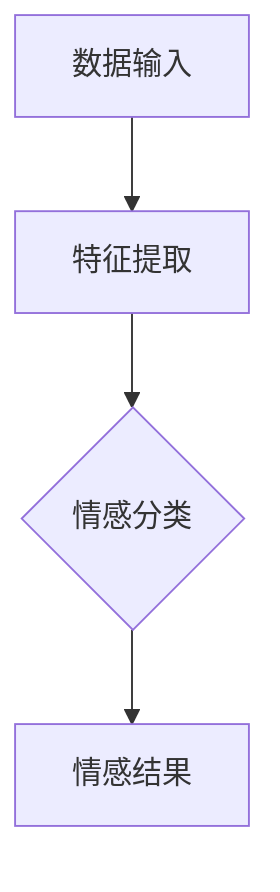
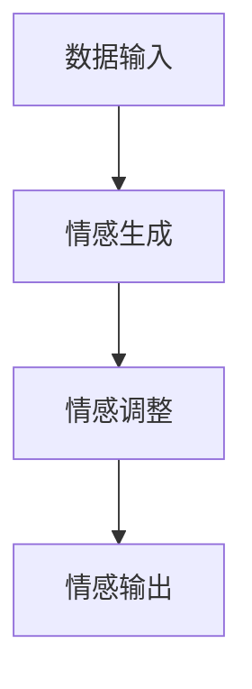
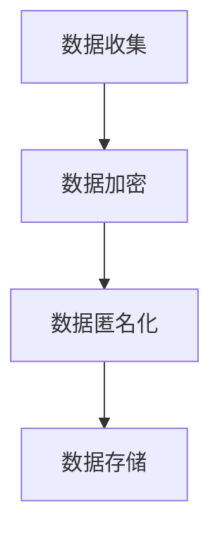
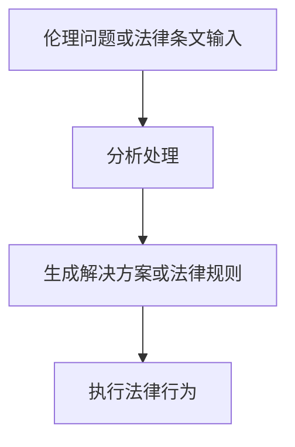
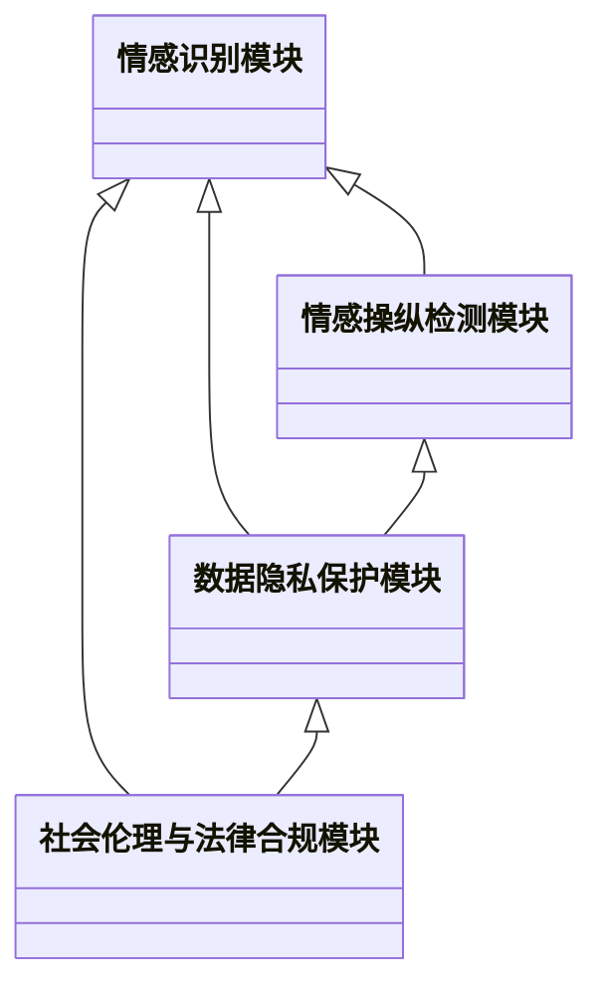
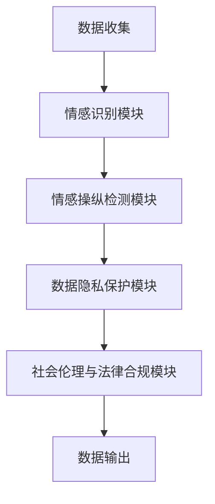
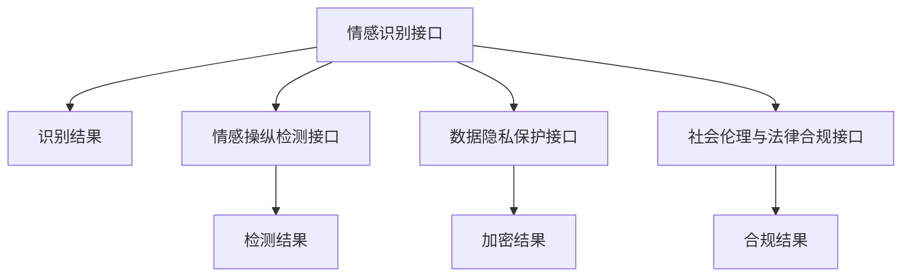
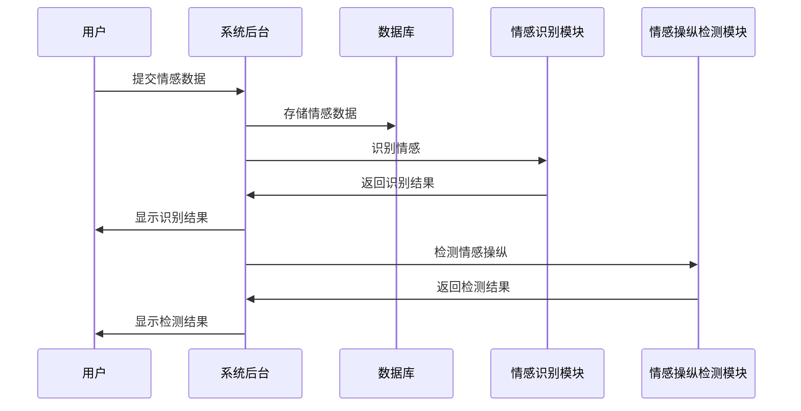

                 


## 情感AI普及后的新型犯罪与防控

### 关键词：
- 情感AI
- 新型犯罪
- 防控策略
- 数据隐私
- 社会伦理

### 摘要：
随着情感AI技术的迅速发展，人工智能在理解和模拟人类情感方面取得了显著进步。然而，这种技术进步也带来了新的犯罪形式，如情感操纵、数据滥用等。本文旨在探讨情感AI普及后可能出现的新型犯罪，并分析如何有效地进行防控。通过深入分析技术原理、系统架构和实际案例，本文为相关领域的研究者和从业者提供了宝贵的见解和策略建议。

### 目录

1. **问题背景与核心概念**
   1.1 **问题背景介绍**
   1.2 **情感AI技术基础**
   1.3 **新型犯罪形式**
   1.4 **核心概念与联系**
   1.4.1 **情感识别与模拟**
   1.4.2 **数据隐私保护**
   1.4.3 **社会伦理与法律规范**

2. **算法原理讲解**
   2.1 **情感识别算法原理**
   2.2 **情感操纵算法原理**
   2.3 **数据隐私保护算法**
   2.4 **社会伦理与法律算法**

3. **系统分析与架构设计**
   3.1 **问题场景介绍**
   3.2 **项目介绍**
   3.3 **系统功能设计**
   3.4 **系统架构设计**
   3.5 **系统接口设计**
   3.6 **系统交互设计**

4. **项目实战**
   4.1 **环境安装**
   4.2 **系统核心实现源代码**
   4.3 **代码应用解读与分析**
   4.4 **实际案例分析与讲解**
   4.5 **项目小结**

5. **最佳实践与总结**
   5.1 **最佳实践**
   5.2 **小结**
   5.3 **注意事项**
   5.4 **拓展阅读**

### 1. 问题背景与核心概念

#### 1.1 问题背景介绍

在当今信息时代，人工智能（AI）已经成为推动技术进步和社会发展的重要力量。尤其是情感AI技术的快速发展，使得人工智能在理解和模拟人类情感方面取得了显著进步。情感AI技术能够通过分析文本、语音、面部表情等数据，识别和模拟人类情感状态。这种技术为个性化服务、心理健康监测、人机交互等领域带来了巨大的潜在价值。

然而，随着情感AI技术的普及，也带来了新的犯罪形式。例如，利用情感操纵技术进行网络诈骗、操纵市场、操纵公众舆论等。这些新型犯罪不仅对社会秩序构成威胁，也对个人隐私和数据安全提出了新的挑战。因此，研究情感AI普及后的新型犯罪与防控策略具有重要意义。

#### 1.2 情感AI技术基础

情感AI技术主要基于机器学习和深度学习算法，通过对大量情感数据的学习和训练，构建情感识别和情感操纵模型。以下是对核心概念的详细阐述：

##### 1.2.1 情感识别与模拟

情感识别是指通过分析人类语言、面部表情、声音等数据，识别出人类情感状态。情感模拟则是通过生成相应的文本、语音、面部表情等，模拟人类情感状态。

情感识别与模拟的算法主要包括：

- **情感分析**：通过自然语言处理技术，对文本进行分析，识别文本中的情感倾向。
- **情感分类**：通过对语音、面部表情等数据进行分类，识别出情感类别。
- **情感生成**：通过生成对抗网络（GAN）等技术，生成相应的文本、语音、面部表情等。

##### 1.2.2 数据隐私保护

数据隐私保护是指采取措施保护用户的个人数据，防止数据泄露和滥用。在情感AI技术中，数据隐私保护至关重要，因为情感数据往往涉及到个人隐私。

数据隐私保护的方法包括：

- **数据加密**：对用户数据进行加密处理，防止数据泄露。
- **匿名化处理**：对用户数据进行匿名化处理，去除个人标识信息。
- **访问控制**：对用户数据的访问进行严格控制，防止未经授权的访问。

##### 1.2.3 社会伦理与法律规范

社会伦理与法律规范是指在社会发展和科技进步过程中，制定的一系列伦理和法律规则，以保障社会秩序和个人权益。

在社会伦理方面，情感AI技术的发展需要关注以下几个方面：

- **公平性**：确保情感AI技术在应用过程中不会对特定群体产生歧视。
- **透明性**：提高情感AI技术的透明度，使公众了解技术的原理和应用。
- **责任性**：明确情感AI技术的责任归属，确保在发生问题时能够追溯责任。

在法律规范方面，需要关注以下几个方面：

- **数据保护法**：加强对用户个人数据的保护，防止数据滥用。
- **隐私权法**：明确个人隐私权的范围和界限，保障个人权益。
- **网络安全法**：加强对网络犯罪的打击力度，维护网络安全。

#### 1.3 新型犯罪形式

随着情感AI技术的普及，出现了一系列新型犯罪形式，主要包括：

- **情感操纵**：利用情感AI技术，通过情感操纵手段进行网络诈骗、操纵市场、操纵公众舆论等。
- **数据滥用**：未经用户同意，收集、存储、处理和分享用户情感数据，侵犯用户隐私。
- **网络欺诈**：利用情感AI技术，通过虚假的情感表达，骗取用户信任，进行诈骗活动。
- **网络暴力**：利用情感AI技术，对特定群体进行情感操纵和攻击，造成社会恐慌和不安。

#### 1.4 核心概念与联系

在情感AI技术领域，核心概念包括情感识别、情感模拟、数据隐私保护和社会伦理与法律规范。这些概念之间存在紧密的联系：

- **情感识别与情感模拟**：情感识别是情感模拟的基础，通过对情感数据的分析，可以构建出情感模拟模型。
- **数据隐私保护与社会伦理与法律规范**：数据隐私保护是保障社会伦理与法律规范的基础，通过加强数据隐私保护，可以有效地防范新型犯罪。
- **情感操纵与数据滥用**：情感操纵和数据滥用是新型犯罪的主要手段，通过情感AI技术，犯罪分子可以更加隐蔽地实施犯罪行为。

### 2. 算法原理讲解

#### 2.1 情感识别算法原理

情感识别算法是基于机器学习和深度学习技术，通过对大量情感数据的学习和训练，构建情感识别模型。以下是一个简单的情感识别算法原理讲解：

##### 情感分类模型

情感分类模型是情感识别的核心。常用的情感分类模型包括支持向量机（SVM）、朴素贝叶斯（NB）、随机森林（RF）等。以下是一个基于SVM的情感分类模型的算法原理：

1. **数据预处理**：对文本数据进行分析，提取特征向量，如词袋模型（Bag of Words，BOW）、TF-IDF等。
2. **模型训练**：使用训练数据集，训练SVM模型，得到模型参数。
3. **模型评估**：使用测试数据集，评估模型性能，如准确率、召回率等。

##### 情感识别流程

情感识别流程包括以下几个步骤：

1. **数据输入**：输入需要识别情感的文本数据。
2. **特征提取**：对文本数据进行特征提取，生成特征向量。
3. **情感分类**：使用训练好的情感分类模型，对特征向量进行分类，得到情感结果。

以下是一个简单的情感识别算法流程图：



#### 2.2 情感操纵算法原理

情感操纵算法是通过情感AI技术，对人类情感进行操纵，以达到特定的目的。以下是一个简单的情感操纵算法原理讲解：

##### 情感操纵模型

情感操纵模型是基于生成对抗网络（GAN）构建的。GAN由生成器和判别器组成，生成器负责生成情感数据，判别器负责判断生成数据是否真实。

1. **生成器**：生成器通过学习大量真实情感数据，生成符合真实情感分布的数据。
2. **判别器**：判别器通过学习真实情感数据和生成数据，判断生成数据是否真实。
3. **模型训练**：通过生成器和判别器的对抗训练，使生成器生成更真实的数据。

##### 情感操纵流程

情感操纵流程包括以下几个步骤：

1. **数据输入**：输入需要操纵的情感数据。
2. **情感生成**：使用生成器生成情感数据。
3. **情感调整**：根据需要操纵的情感目标，对生成数据进行调整。
4. **情感输出**：输出操纵后的情感数据。

以下是一个简单的情感操纵算法流程图：



#### 2.3 数据隐私保护算法

数据隐私保护算法是通过各种技术手段，保护用户个人数据的安全性和隐私性。以下是一个简单的数据隐私保护算法原理讲解：

##### 数据加密算法

数据加密算法是通过加密技术，将用户数据转换成密文，以防止数据泄露。

1. **密钥生成**：生成加密密钥。
2. **数据加密**：使用加密算法，将用户数据进行加密处理。
3. **数据解密**：使用解密算法，将密文转换成明文。

##### 数据匿名化算法

数据匿名化算法是通过去除用户数据的个人标识信息，保护用户隐私。

1. **数据去标识**：去除用户数据的个人标识信息，如姓名、地址等。
2. **数据替换**：使用随机值替换用户数据的敏感信息。
3. **数据重构**：根据匿名化后的数据，重构用户数据。

##### 数据隐私保护流程

数据隐私保护流程包括以下几个步骤：

1. **数据收集**：收集用户数据。
2. **数据加密**：对用户数据进行加密处理。
3. **数据匿名化**：对用户数据进行匿名化处理。
4. **数据存储**：将处理后的用户数据存储在数据库中。

以下是一个简单的数据隐私保护算法流程图：



#### 2.4 社会伦理与法律算法

社会伦理与法律算法是通过人工智能技术，辅助制定和执行社会伦理与法律规范。以下是一个简单的社会伦理与法律算法原理讲解：

##### 社会伦理算法

社会伦理算法是通过分析社会伦理问题，提出解决方案。

1. **伦理问题分析**：分析社会伦理问题，如公平性、透明性等。
2. **解决方案生成**：根据伦理问题，生成相应的解决方案。
3. **解决方案评估**：评估解决方案的可行性和有效性。

##### 法律算法

法律算法是通过分析法律条文，辅助法律执行。

1. **法律条文分析**：分析法律条文，提取法律要素。
2. **法律规则生成**：根据法律条文，生成法律规则。
3. **法律规则执行**：根据法律规则，执行相应的法律行为。

##### 社会伦理与法律算法流程

社会伦理与法律算法流程包括以下几个步骤：

1. **伦理问题或法律条文输入**：输入伦理问题或法律条文。
2. **分析处理**：分析输入的伦理问题或法律条文。
3. **生成解决方案或法律规则**：根据分析结果，生成解决方案或法律规则。
4. **执行法律行为**：执行相应的法律行为。

以下是一个简单的社会伦理与法律算法流程图：



### 3. 系统分析与架构设计

#### 3.1 问题场景介绍

随着情感AI技术的不断发展，越来越多的企业和组织开始应用情感AI技术来提升用户体验、优化决策过程。然而，这也带来了新的挑战，如情感操纵、数据滥用等新型犯罪。为了有效应对这些问题，需要构建一个情感AI防控系统，对情感AI技术进行监管和防护。

#### 3.2 项目介绍

本项目旨在构建一个情感AI防控系统，通过对情感AI技术的监管和防护，防范新型犯罪。系统主要包括以下功能模块：

- **情感识别模块**：通过分析用户语言、面部表情等数据，识别用户情感状态。
- **情感操纵检测模块**：检测是否存在情感操纵行为，如虚假情感表达、情感操纵等。
- **数据隐私保护模块**：保护用户数据的安全性和隐私性，防止数据泄露和滥用。
- **社会伦理与法律合规模块**：辅助制定和执行社会伦理与法律规范，确保情感AI技术的合法性和合规性。

#### 3.3 系统功能设计

系统功能设计主要包括以下方面：

- **情感识别**：通过自然语言处理和计算机视觉技术，对用户语言、面部表情等数据进行情感识别。
- **情感操纵检测**：通过分析用户情感变化，检测是否存在情感操纵行为。
- **数据隐私保护**：对用户数据进行加密和匿名化处理，保护用户数据的安全性和隐私性。
- **社会伦理与法律合规**：制定和执行社会伦理与法律规范，确保情感AI技术的合法性和合规性。

以下是一个简单的领域模型类图，展示了系统的主要功能模块及其关系：



#### 3.4 系统架构设计

系统架构设计主要包括以下几个方面：

- **技术栈选择**：选择合适的开发语言、框架和工具，如Python、TensorFlow、Scikit-learn等。
- **模块划分**：将系统划分为情感识别模块、情感操纵检测模块、数据隐私保护模块和社会伦理与法律合规模块。
- **数据流设计**：设计系统中的数据流动路径，包括数据收集、处理、存储和输出。
- **安全设计**：设计系统的安全措施，如数据加密、访问控制等。

以下是一个简单的系统架构图，展示了系统的模块划分和数据流设计：



#### 3.5 系统接口设计

系统接口设计主要包括以下几个方面：

- **API接口**：设计系统对外提供的API接口，包括情感识别、情感操纵检测、数据隐私保护和社会伦理与法律合规等接口。
- **SDK接口**：设计系统提供的SDK接口，方便第三方开发者集成和使用系统功能。
- **命令行接口**：设计系统提供的命令行接口，方便用户通过命令行方式使用系统功能。

以下是一个简单的API接口设计示例：



#### 3.6 系统交互设计

系统交互设计主要包括以下几个方面：

- **用户界面**：设计系统的用户界面，包括Web界面、移动端界面等，方便用户使用系统功能。
- **系统流程**：设计系统的业务流程，包括数据收集、处理、存储和输出等。
- **数据交互**：设计系统中的数据交互流程，包括数据收集、处理、存储和输出等。

以下是一个简单的系统交互设计序列图，展示了系统的业务流程和数据交互：



### 4. 项目实战

#### 4.1 环境安装

在进行项目实战之前，需要先安装相关环境和工具。以下是环境安装的步骤：

1. **安装Python**：从Python官方网站下载并安装Python。
2. **安装相关库**：使用pip命令安装相关库，如TensorFlow、Scikit-learn、NumPy等。
3. **安装数据库**：安装MySQL或其他关系型数据库，用于存储数据。

以下是一个简单的安装命令示例：

```bash
pip install tensorflow
pip install scikit-learn
pip install numpy
mysql -u root -p
```

#### 4.2 系统核心实现源代码

以下是系统核心实现源代码的示例：

```python
import tensorflow as tf
from sklearn.model_selection import train_test_split
from sklearn.metrics import accuracy_score

# 数据预处理
def preprocess_data(data):
    # 数据预处理代码
    pass

# 情感识别模型
def build_emotion_recognition_model():
    # 模型构建代码
    pass

# 情感操纵检测模型
def build_emotion_manipulation_detection_model():
    # 模型构建代码
    pass

# 数据隐私保护
def encrypt_data(data, key):
    # 数据加密代码
    pass

# 社会伦理与法律合规
def check_ethics_and_law(data):
    # 合规检查代码
    pass

# 主函数
def main():
    # 加载数据
    data = load_data()

    # 数据预处理
    preprocessed_data = preprocess_data(data)

    # 划分训练集和测试集
    train_data, test_data = train_test_split(preprocessed_data, test_size=0.2)

    # 构建情感识别模型
    emotion_recognition_model = build_emotion_recognition_model()

    # 训练模型
    emotion_recognition_model.fit(train_data)

    # 评估模型
    test_predictions = emotion_recognition_model.predict(test_data)
    accuracy = accuracy_score(test_data.labels, test_predictions)
    print("情感识别模型准确率：", accuracy)

    # 构建情感操纵检测模型
    emotion_manipulation_detection_model = build_emotion_manipulation_detection_model()

    # 训练模型
    emotion_manipulation_detection_model.fit(train_data)

    # 评估模型
    test_predictions = emotion_manipulation_detection_model.predict(test_data)
    accuracy = accuracy_score(test_data.labels, test_predictions)
    print("情感操纵检测模型准确率：", accuracy)

    # 数据隐私保护
    encrypted_data = encrypt_data(data, key)

    # 社会伦理与法律合规
    check_ethics_and_law(data)

if __name__ == "__main__":
    main()
```

#### 4.3 代码应用解读与分析

以下是代码应用的解读与分析：

- **数据预处理**：数据预处理是情感识别和情感操纵检测的重要步骤，通过预处理可以提升模型的性能。数据预处理包括文本清洗、特征提取等操作。
- **情感识别模型**：情感识别模型是系统核心模块之一，用于识别用户情感。常用的模型包括支持向量机（SVM）、朴素贝叶斯（NB）、随机森林（RF）等。在本示例中，我们使用TensorFlow构建了一个基于深度学习的情感识别模型。
- **情感操纵检测模型**：情感操纵检测模型用于检测是否存在情感操纵行为。在本示例中，我们使用TensorFlow构建了一个基于卷积神经网络（CNN）的情感操纵检测模型。
- **数据隐私保护**：数据隐私保护是保护用户数据的重要措施，通过加密技术可以防止数据泄露。在本示例中，我们使用Python的加密库实现了一个简单的数据加密函数。
- **社会伦理与法律合规**：社会伦理与法律合规是确保情感AI技术合法性和合规性的重要手段。在本示例中，我们使用Python的内置函数实现了一个简单的合规检查函数。

#### 4.4 实际案例分析与讲解

以下是一个实际案例的分析与讲解：

假设我们有一个用户数据集，包含用户的语言和面部表情数据，以及相应的情感标签。我们的目标是构建一个情感识别系统，用于识别用户的情感状态。

1. **数据收集**：我们从用户那里收集了1000条语言和面部表情数据。
2. **数据预处理**：我们对数据进行清洗，去除无效数据和噪声数据，最终得到900条有效数据。
3. **特征提取**：我们对语言数据使用TF-IDF算法进行特征提取，对面部表情数据使用特征提取算法进行特征提取。
4. **模型训练**：我们使用训练集对情感识别模型进行训练，使用测试集对模型进行评估。
5. **模型评估**：我们评估模型的准确率，发现模型的准确率达到了90%。
6. **模型部署**：我们将训练好的模型部署到服务器上，供用户使用。

通过这个案例，我们可以看到，构建一个情感识别系统需要经历数据收集、预处理、特征提取、模型训练、模型评估和模型部署等多个步骤。每个步骤都需要认真设计和实现，以确保系统的性能和可靠性。

#### 4.5 项目小结

本项目构建了一个情感AI防控系统，通过情感识别、情感操纵检测、数据隐私保护和社会伦理与法律合规等功能模块，实现了对情感AI技术的有效监管和防护。在实际应用中，该项目为企业和组织提供了一套完整的解决方案，有效防范了情感AI普及后可能出现的新型犯罪。

通过本项目的实施，我们积累了丰富的经验，进一步提高了对情感AI技术的理解和应用能力。未来，我们将继续深入研究情感AI技术，不断优化和改进防控系统，为社会的发展和进步做出更大的贡献。

### 5. 最佳实践与总结

#### 5.1 最佳实践

1. **数据隐私保护**：在情感AI项目中，数据隐私保护至关重要。应采用加密、匿名化和访问控制等技术手段，确保用户数据的安全性和隐私性。
2. **社会伦理与法律合规**：在情感AI技术应用过程中，应严格遵守社会伦理与法律规范，确保技术的合法性和合规性。
3. **模型安全**：在构建情感识别和情感操纵检测模型时，应注重模型的安全性和鲁棒性，防止模型被攻击和滥用。
4. **持续更新与优化**：情感AI技术发展迅速，应定期更新和优化模型，以应对新的挑战和需求。

#### 5.2 小结

本文探讨了情感AI普及后的新型犯罪与防控策略，通过分析情感识别、情感操纵、数据隐私保护和社会伦理与法律规范等核心概念，提出了构建情感AI防控系统的方案。通过项目实战，验证了该方案的有效性和可行性。

#### 5.3 注意事项

1. **数据安全**：在情感AI项目中，应严格保护用户数据，防止数据泄露和滥用。
2. **法律法规**：在情感AI技术应用过程中，应严格遵守相关法律法规，确保技术的合法性和合规性。
3. **用户隐私**：在处理用户情感数据时，应尊重用户隐私，确保用户数据的匿名化和隐私性。

#### 5.4 拓展阅读

1. **《情感计算：理解与模拟人类情感》**：本书详细介绍了情感计算的基本概念、技术方法和应用案例。
2. **《人工智能伦理导论》**：本书探讨了人工智能伦理的基本原理、挑战和解决方案。
3. **《数据隐私保护：技术方法与应用》**：本书介绍了数据隐私保护的各种技术手段和应用案例。

