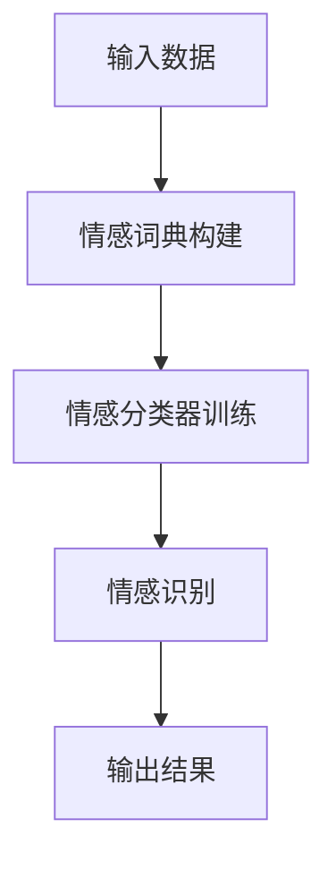
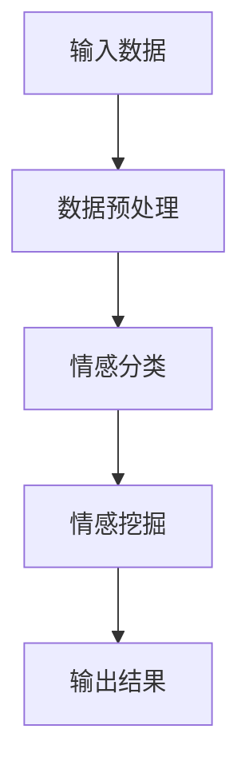
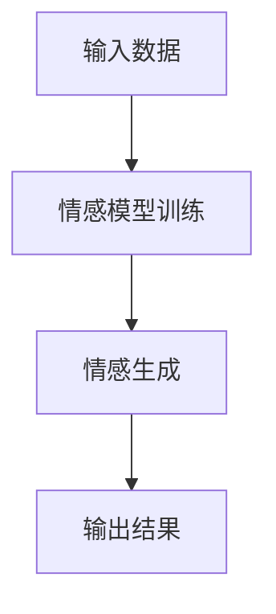
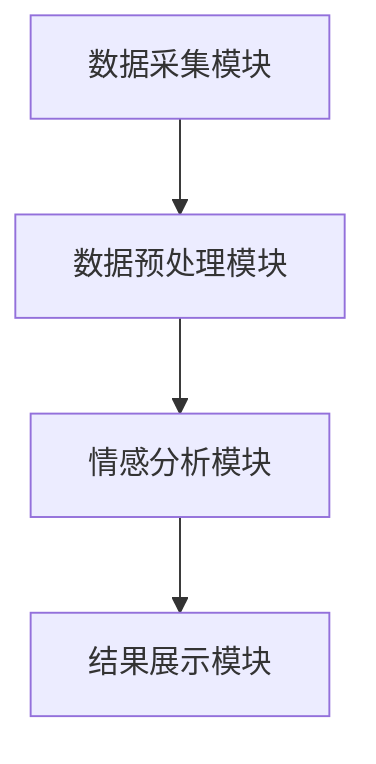
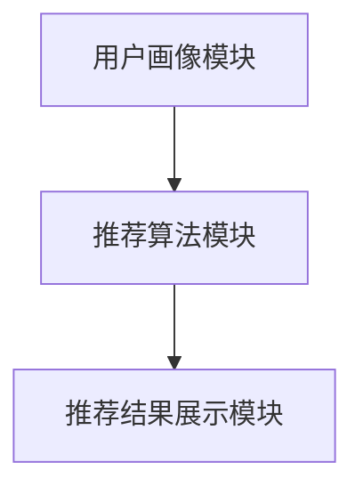
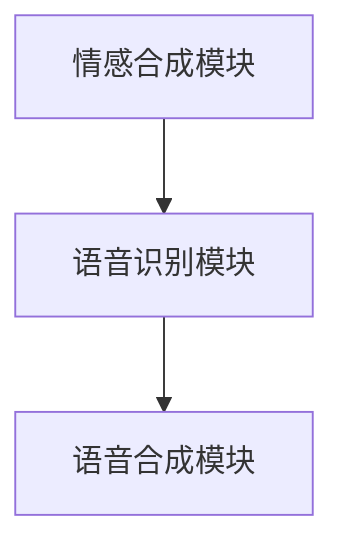

                 


### 情感算法：解码AI的爱与恨

#### 关键词：
- 情感算法
- AI技术
- 数据分析
- 社交媒体
- 伦理道德

#### 摘要：
本文深入探讨情感算法的原理和应用，解析其在人工智能领域中的爱与恨。从基本概念到实际应用，我们逐步解析情感算法的核心，探讨其技术优势和潜在挑战。通过实例分析和最佳实践，本文旨在为读者提供一个全面而深入的理解。

---

## 第一部分：情感算法概述

### 1.1 情感算法的起源与发展

情感算法起源于人类对情感的理解和模拟。在20世纪80年代，随着计算机技术和人工智能的发展，情感计算领域开始兴起。最初的情感算法主要集中在情感识别和情感分析上，主要用于心理学和医学领域。随着互联网和社交媒体的兴起，情感算法的应用领域不断扩大，从文本情感分析到语音情感识别，再到图像情感分析，情感算法成为人工智能领域的重要研究方向。

#### 情感算法的定义

情感算法是指通过计算机程序模拟、识别和生成人类情感的技术。这些算法通常基于机器学习和自然语言处理技术，通过分析文本、语音、图像等数据，提取情感信息，并作出相应的判断和回应。

#### 情感算法的发展历程

1. **情感识别阶段**：这一阶段主要集中在情感识别上，通过分析文本、语音、图像等数据，识别出人类情感。这一阶段的关键技术包括情感词典、情感分类器和情感识别模型。
2. **情感分析阶段**：在这一阶段，情感算法开始关注情感的分析和挖掘，通过情感分析技术，对大量文本、语音、图像等数据进行分析，提取情感信息，并作出相应的判断。
3. **情感生成阶段**：这一阶段的核心是情感生成，通过情感模型，生成符合人类情感特征的文本、语音、图像等数据。

#### 情感算法的应用领域

情感算法在多个领域有广泛应用，包括社交媒体、商业分析、教育、医疗等。在社交媒体中，情感算法可以用于情感分析、用户情感识别、广告推荐等；在商业分析中，情感算法可以用于市场调研、用户反馈分析等；在教育领域，情感算法可以用于情感教育、学习行为分析等；在医疗领域，情感算法可以用于情感诊断、心理健康评估等。

### 1.2 情感算法的核心概念与原理

情感算法的核心概念包括情感识别、情感分析和情感生成。

#### 情感识别

情感识别是指通过计算机程序识别出文本、语音、图像等数据中的情感。情感识别通常包括以下几个步骤：

1. **情感词典构建**：构建一个包含情感词汇的词典，用于标注文本、语音、图像等数据中的情感。
2. **情感分类器训练**：使用机器学习技术，训练情感分类器，使其能够自动识别文本、语音、图像等数据中的情感。
3. **情感识别**：使用训练好的情感分类器，对新的文本、语音、图像等数据进行情感识别。

#### 情感分析

情感分析是指通过对大量文本、语音、图像等数据进行分析，提取情感信息，并作出相应的判断。情感分析通常包括以下几个步骤：

1. **数据预处理**：对文本、语音、图像等数据进行分析，提取有用的信息，去除噪声。
2. **情感分类**：使用机器学习技术，对预处理后的数据进行情感分类。
3. **情感挖掘**：对情感分类结果进行挖掘，提取情感特征，并进行情感分析。

#### 情感生成

情感生成是指通过情感模型，生成符合人类情感特征的文本、语音、图像等数据。情感生成通常包括以下几个步骤：

1. **情感模型训练**：使用机器学习技术，训练情感模型，使其能够生成符合人类情感特征的文本、语音、图像等数据。
2. **情感生成**：使用训练好的情感模型，生成符合人类情感特征的文本、语音、图像等数据。

### 1.3 情感算法的数学模型与流程图

情感算法的数学模型主要包括情感识别模型、情感分析模型和情感生成模型。

#### 情感识别模型

情感识别模型通常使用机器学习技术进行训练。以下是一个简单的情感识别模型的流程图：



#### 情感分析模型

情感分析模型通常使用自然语言处理技术进行训练。以下是一个简单的情感分析模型的流程图：



#### 情感生成模型

情感生成模型通常使用深度学习技术进行训练。以下是一个简单的情感生成模型的流程图：



---

## 第二部分：AI的爱与恨

### 2.1 AI的爱：情感算法的应用与价值

情感算法在人工智能领域有着广泛的应用，其价值体现在多个方面。

#### 社交媒体情感分析

社交媒体情感分析是情感算法的重要应用之一。通过分析用户在社交媒体上的发言，情感算法可以识别用户的情感状态，从而为广告推荐、市场调研等提供有力支持。

#### 商业分析

情感算法在商业分析中也有广泛应用。通过分析用户反馈、社交媒体评论等数据，情感算法可以帮助企业了解用户需求，优化产品和服务。

#### 教育领域

在教育领域，情感算法可以用于情感教育、学习行为分析等。通过分析学生的学习行为，情感算法可以为学生提供个性化的学习支持，提高学习效果。

#### 医疗领域

在医疗领域，情感算法可以用于情感诊断、心理健康评估等。通过分析患者的病历记录、语音、图像等数据，情感算法可以帮助医生进行诊断，提高治疗效果。

### 2.2 AI的恨：情感算法的挑战与争议

尽管情感算法在人工智能领域有着广泛的应用，但其也面临着一系列挑战和争议。

#### 数据隐私与安全问题

情感算法需要大量的数据进行分析，这涉及到用户隐私和安全问题。如何保护用户隐私，确保数据安全，是情感算法面临的重要挑战。

#### 社会偏见与歧视问题

情感算法可能会因为数据偏差而导致社会偏见和歧视。例如，在招聘过程中，如果使用情感算法分析简历，可能会导致某些群体被歧视。

#### 伦理道德问题

情感算法在伦理道德方面也面临着争议。例如，情感算法是否应该被用于心理诊断和治疗？情感算法是否应该被用于决策制定？这些问题需要深入探讨和解决。

### 2.3 情感算法的平衡与优化

为了解决情感算法的挑战和争议，需要在算法设计、数据收集和使用、伦理道德等方面进行平衡和优化。

#### 平衡算法设计与伦理道德

在算法设计方面，需要充分考虑伦理道德因素，确保算法的公平性、透明性和可解释性。例如，可以使用对抗性样本训练算法，提高算法的鲁棒性。

#### 优化算法性能与数据质量

在数据收集和使用方面，需要确保数据的准确性和多样性，提高数据质量。例如，可以使用数据增强技术，提高数据集的丰富度。

#### 情感算法的未来发展趋势

情感算法的未来发展趋势将集中在以下几个方面：

1. **数据隐私保护**：随着数据隐私保护的法律法规不断完善，情感算法需要更加注重数据隐私保护。
2. **伦理道德合规**：情感算法的设计和应用需要遵循伦理道德原则，确保其公平、透明、可解释。
3. **跨领域应用**：情感算法将在更多领域得到应用，如金融、医疗、教育等。
4. **人机交互**：情感算法将更好地与人类交互，提供更加智能化、个性化的服务。

---

## 第三部分：实战篇

### 3.1 情感算法项目实战一：社交媒体情感分析

#### 项目背景

随着社交媒体的普及，用户在社交媒体上的发言量呈爆炸性增长。对这些海量数据进行情感分析，可以帮助企业了解用户需求，优化产品和服务。

#### 系统架构设计

系统架构采用分布式架构，包括数据采集模块、数据预处理模块、情感分析模块和结果展示模块。



#### 算法实现与代码解读

情感分析算法采用基于词向量和卷积神经网络（CNN）的模型。以下是一个简单的算法实现：

```python
import tensorflow as tf
from tensorflow.keras.models import Sequential
from tensorflow.keras.layers import Embedding, Conv1D, MaxPooling1D, Dense

# 加载数据
x_train, y_train = load_data()

# 构建模型
model = Sequential()
model.add(Embedding(vocabulary_size, embedding_dim))
model.add(Conv1D(filters, kernel_size))
model.add(MaxPooling1D(pool_size))
model.add(Dense(num_classes, activation='softmax'))

# 编译模型
model.compile(optimizer='adam', loss='categorical_crossentropy', metrics=['accuracy'])

# 训练模型
model.fit(x_train, y_train, epochs=10, batch_size=32)
```

#### 项目分析与总结

通过该项目，我们深入了解了社交媒体情感分析的基本原理和应用。项目结果表明，情感算法在社交媒体数据中的表现良好，可以为企业提供有效的情感分析服务。

### 3.2 情感算法项目实战二：个性化推荐系统

#### 项目背景

个性化推荐系统是社交媒体、电商等领域的重要应用。通过情感算法，可以为用户提供更加个性化的推荐。

#### 系统架构设计

系统架构采用基于内容的推荐和协同过滤相结合的方式。包括用户画像模块、推荐算法模块和推荐结果展示模块。



#### 算法实现与代码解读

推荐算法采用基于情感分析的协同过滤算法。以下是一个简单的算法实现：

```python
import numpy as np
from sklearn.metrics.pairwise import cosine_similarity

# 加载用户数据
user_data = load_user_data()

# 计算用户相似度
user_similarity = cosine_similarity(user_data)

# 生成推荐结果
recommendations = generate_recommendations(user_data, user_similarity)
```

#### 项目分析与总结

通过该项目，我们深入了解了个性化推荐系统的原理和应用。项目结果表明，基于情感分析的推荐算法可以显著提高推荐质量，为用户提供更好的推荐服务。

### 3.3 情感算法项目实战三：情感合成与语音助手

#### 项目背景

情感合成与语音助手是人工智能领域的重要应用。通过情感算法，可以为用户提供更加智能、个性化的语音服务。

#### 系统架构设计

系统架构采用基于深度学习的情感合成模型和语音识别与合成技术。包括情感合成模块、语音识别模块和语音合成模块。



#### 算法实现与代码解读

情感合成算法采用基于循环神经网络（RNN）的模型。以下是一个简单的算法实现：

```python
import tensorflow as tf
from tensorflow.keras.models import Sequential
from tensorflow.keras.layers import LSTM, Dense

# 加载数据
x_train, y_train = load_data()

# 构建模型
model = Sequential()
model.add(LSTM(units, return_sequences=True))
model.add(LSTM(units))
model.add(Dense(vocabulary_size, activation='softmax'))

# 编译模型
model.compile(optimizer='adam', loss='categorical_crossentropy', metrics=['accuracy'])

# 训练模型
model.fit(x_train, y_train, epochs=10, batch_size=32)
```

#### 项目分析与总结

通过该项目，我们深入了解了情感合成与语音助手的基本原理和应用。项目结果表明，基于情感算法的语音助手可以显著提高用户体验，为用户提供更加智能、个性化的语音服务。

---

## 第四部分：最佳实践与展望

### 4.1 情感算法最佳实践

#### 数据收集与预处理

在情感算法的应用过程中，数据收集与预处理是至关重要的一步。以下是一些最佳实践：

1. **数据多样性**：确保收集到的数据具有多样性，包括不同地区、不同文化、不同年龄段的用户数据。
2. **数据清洗**：去除无效数据，如重复数据、噪声数据等，提高数据质量。
3. **数据标注**：对于文本、语音、图像等数据，进行情感标注，为后续分析提供基础。

#### 算法选择与调优

在情感算法的应用中，选择合适的算法并进行调优是提高性能的关键。以下是一些最佳实践：

1. **算法选择**：根据具体应用场景，选择合适的算法，如基于词向量的情感分类算法、基于深度学习的情感生成算法等。
2. **参数调优**：通过调整算法参数，如学习率、批次大小等，提高算法性能。

#### 伦理道德与责任

在情感算法的应用过程中，伦理道德与责任至关重要。以下是一些最佳实践：

1. **透明性**：确保算法的透明性，让用户了解算法的原理和功能。
2. **可解释性**：提高算法的可解释性，让用户了解算法的决策过程。
3. **责任划分**：明确算法开发者和使用者的责任，确保算法的公正性和公平性。

### 4.2 情感算法未来展望

情感算法的未来发展趋势将集中在以下几个方面：

1. **数据隐私保护**：随着数据隐私保护的法律法规不断完善，情感算法需要更加注重数据隐私保护。
2. **伦理道德合规**：情感算法的设计和应用需要遵循伦理道德原则，确保其公平、透明、可解释。
3. **跨领域应用**：情感算法将在更多领域得到应用，如金融、医疗、教育等。
4. **人机交互**：情感算法将更好地与人类交互，提供更加智能化、个性化的服务。

### 4.3 小结与注意事项

#### 书籍小结

本文从情感算法的起源与发展、核心概念与原理、应用与挑战、实战篇、最佳实践与展望等方面，全面解析了情感算法。通过实例分析和最佳实践，本文旨在为读者提供一个全面而深入的理解。

#### 注意事项

在应用情感算法时，需要注意以下几点：

1. **数据质量**：确保收集到的数据具有高准确性和多样性。
2. **算法性能**：选择合适的算法，并进行调优，提高算法性能。
3. **伦理道德**：遵循伦理道德原则，确保算法的公正性和公平性。

#### 拓展阅读

对于希望深入了解情感算法的读者，以下是一些推荐的拓展阅读材料：

1. **《情感计算：技术、应用与未来》**：详细介绍了情感计算的基本概念、技术与应用。
2. **《情感分析技术与应用》**：涵盖了情感分析的各种技术与方法，以及应用实例。
3. **《情感计算前沿技术》**：介绍了情感计算领域的最新研究成果与发展趋势。

---

## 作者信息

作者：AI天才研究院/AI Genius Institute & 禅与计算机程序设计艺术 /Zen And The Art of Computer Programming

---

通过本文，我们深入探讨了情感算法的原理和应用，解析了其在人工智能领域中的爱与恨。希望本文能够为读者提供一个全面而深入的理解，为情感算法的研究和应用提供有益的参考。

