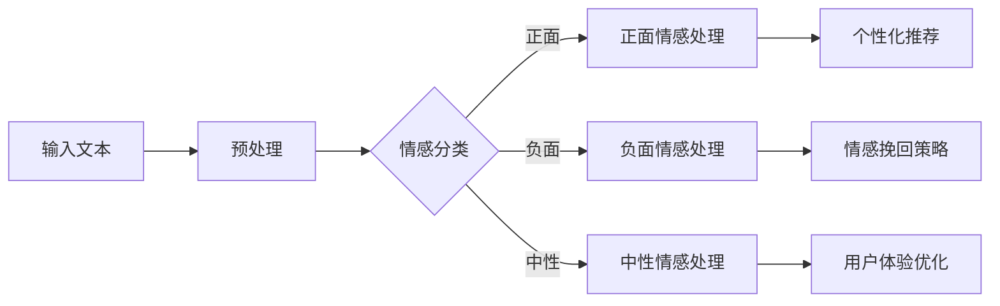
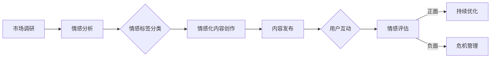
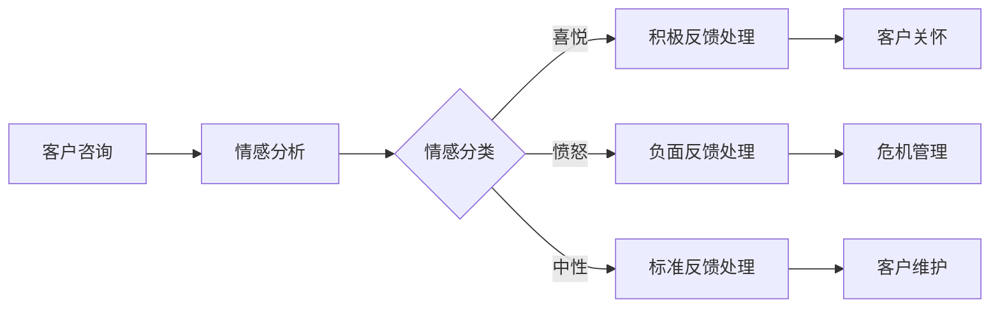

                 

## 情感经济的崛起与AI的变革

### 第1章：情感经济的定义与背景

#### 1.1 情感经济的起源与发展

情感经济，是一种新兴的经济模式，它的核心在于挖掘和利用人类情感的价值。这一概念最早可以追溯到20世纪末，当时心理学家和社会学家开始研究情感在人类行为中的作用。进入21世纪，随着互联网的普及和大数据技术的发展，情感经济逐渐崭露头角。

情感经济并不是简单地指人们用情感来消费，而是通过深入理解消费者的情感需求，来设计产品和服务，从而提升消费者体验，增加品牌忠诚度，最终实现商业价值的提升。在情感经济中，情感分析、情感识别和情感互动等技术成为关键。

#### 1.2 情感经济的特征与趋势

情感经济的特征主要体现在以下几个方面：

1. **情感驱动**：情感经济强调以消费者的情感需求为核心，通过情感分析技术来理解消费者的情感状态，从而提供个性化、情感化的产品和服务。
2. **体验为王**：情感经济注重消费者的体验，通过提升消费者的情感体验，来增加消费者的满意度和忠诚度。
3. **数据驱动**：情感经济依赖于大数据和人工智能技术，通过收集和分析消费者的情感数据，来优化产品和服务，实现精准营销。
4. **跨界融合**：情感经济不仅仅是单一行业的现象，它涉及到多个行业的融合，如电商、娱乐、医疗等，通过跨界合作，实现资源的整合和价值的最大化。

当前，情感经济呈现出以下几个趋势：

1. **个性化服务**：随着消费者个性化需求的增加，情感经济正朝着更加个性化的方向发展，通过情感分析技术来为消费者提供定制化的服务。
2. **智能化互动**：人工智能技术的发展使得情感经济中的互动变得更加智能和自然，如通过聊天机器人与消费者进行情感互动，提升用户体验。
3. **情感化营销**：情感经济下的营销策略更加注重情感因素，通过情感化的内容来吸引消费者，建立情感连接。
4. **跨界融合**：情感经济正在与其他领域如物联网、区块链等相结合，形成新的商业模式和生态系统。

#### 1.3 情感经济对企业的影响

情感经济对企业的影响是深远而广泛的，主要表现在以下几个方面：

1. **商业模式变革**：企业需要从情感需求出发，重新审视自己的商业模式，通过情感驱动来实现商业创新和价值创造。
2. **产品设计优化**：情感经济强调用户体验，企业需要通过情感分析技术来了解消费者的情感需求，从而优化产品设计，提升用户体验。
3. **营销策略创新**：情感经济下的营销策略更加注重情感因素，企业需要通过情感化的内容来吸引消费者，建立情感连接，提升品牌忠诚度。
4. **客户关系管理**：情感经济强调与消费者建立情感连接，企业需要通过情感分析技术来了解消费者的情感状态，从而提供个性化的客户服务，提升客户满意度。

### 总结

情感经济是一种以情感需求为核心的新兴经济模式，它通过人工智能技术来挖掘和利用人类情感的价值，从而实现商业价值的提升。随着大数据和人工智能技术的不断发展，情感经济正在成为新的商业趋势，对企业的商业模式、产品设计、营销策略和客户关系管理等方面都产生了深远的影响。

---

### 第2章：AI在情感经济中的应用

#### 2.1 AI技术的基础与原理

人工智能（AI）技术是情感经济的重要驱动力量。AI技术包括机器学习、深度学习、自然语言处理（NLP）等，这些技术通过算法和模型来实现对数据的处理和分析。

1. **机器学习**：机器学习是AI的核心技术之一，它通过训练模型来发现数据中的模式和规律。常见的机器学习算法包括决策树、支持向量机（SVM）、神经网络等。

2. **深度学习**：深度学习是机器学习的一个分支，它通过多层神经网络来处理复杂数据。深度学习在图像识别、语音识别等领域取得了显著的成果。

3. **自然语言处理**：自然语言处理是AI技术的重要组成部分，它涉及对人类语言的理解和生成。NLP技术包括文本分类、情感分析、命名实体识别等。

#### 2.2 AI在情感分析中的应用

情感分析是AI在情感经济中应用的重要领域，它通过分析文本数据，来判断其中表达的情感倾向。情感分析可以分为文本情感极性分析、情感强度分析和情感主题分析等。

1. **文本情感极性分析**：文本情感极性分析旨在判断文本的情感倾向，如正面、负面或中性。常见的算法包括基于规则的方法、基于机器学习的方法和基于深度学习的方法。

2. **情感强度分析**：情感强度分析旨在判断文本中情感表达的程度，如非常高兴、有些高兴或不太高兴。这一分析需要考虑文本中的情感词汇和句法结构。

3. **情感主题分析**：情感主题分析旨在识别文本中的主要情感主题，如快乐、悲伤、愤怒等。这一分析可以帮助企业了解消费者的情感需求，从而优化产品和服务。

#### 2.3 AI在个性化推荐系统中的应用

个性化推荐系统是AI在情感经济中应用的另一个重要领域，它通过分析用户的情感数据和兴趣偏好，为用户推荐个性化的内容和产品。

1. **基于内容的推荐**：基于内容的推荐通过分析内容的属性和特征，将用户感兴趣的内容推荐给用户。

2. **基于协同过滤的推荐**：基于协同过滤的推荐通过分析用户之间的相似性，将其他用户喜欢的、但用户尚未接触的内容推荐给用户。

3. **基于情感分析的推荐**：基于情感分析的推荐通过分析用户的情感数据和内容情感倾向，为用户推荐情感匹配的内容。

### 案例分析

以电商平台为例，AI技术在情感经济中的应用可以体现在以下几个方面：

1. **个性化推荐**：电商平台通过情感分析技术，分析用户的评论和反馈，了解用户的情感需求，从而为用户推荐个性化的商品。

2. **情感化营销**：电商平台通过情感分析技术，分析用户的购物行为和情感状态，制定情感化的营销策略，提升用户的购物体验。

3. **客户服务**：电商平台通过情感分析技术，分析用户的咨询和反馈，提供个性化的客户服务，提升客户满意度。

### 总结

AI技术在情感经济中扮演着重要的角色，它通过情感分析、个性化推荐等技术，帮助企业和消费者建立情感连接，提升用户体验和商业价值。随着AI技术的不断发展，AI在情感经济中的应用将越来越广泛，也将为企业和消费者带来更多的价值。

---

### 第3章：情感驱动的产品设计

#### 3.1 情感分析在产品需求分析中的应用

情感分析在产品需求分析中扮演着重要的角色，它可以帮助企业更好地理解消费者的情感需求，从而设计出更符合消费者情感需求的产品。

1. **情感需求识别**：通过情感分析，企业可以识别出消费者在产品使用过程中表达的情感需求。例如，消费者可能因为产品的设计、功能、用户体验等方面表达出喜悦、满意、愤怒等情感。

2. **情感趋势分析**：情感分析可以帮助企业了解消费者的情感趋势，例如，消费者的情感状态是积极还是消极，消费者的情感强度如何变化等。这些信息对于产品需求分析至关重要。

3. **情感需求优先级排序**：通过情感分析，企业可以确定哪些情感需求更为重要，从而在产品需求分析中优先考虑。例如，如果大多数消费者的情感需求集中在产品的易用性和功能性上，那么这两个方面将成为产品设计的关键点。

#### 3.2 基于情感数据的用户画像构建

基于情感数据的用户画像构建是情感驱动产品设计的重要环节，它可以帮助企业更深入地了解消费者，从而提供个性化的产品和服务。

1. **情感标签分类**：通过情感分析，企业可以为用户的行为和言论打上情感标签，如快乐、悲伤、愤怒等。这些情感标签可以用于构建用户画像。

2. **情感维度分析**：除了情感标签，企业还可以通过情感维度分析，如情感强度、情感稳定性等，来更全面地了解用户情感状态。

3. **情感画像组合**：通过将情感标签和情感维度结合起来，企业可以构建出更详细的用户情感画像。例如，一个用户可能同时具有快乐和愤怒的情感标签，并且情感强度较高，这表明该用户可能在某些方面有强烈的情感需求。

#### 3.3 情感驱动的设计流程与方法

情感驱动的设计流程和方法可以帮助企业在产品设计中更好地融入情感元素，提升产品的情感价值。

1. **需求分析**：在产品设计初期，通过情感分析，识别和理解消费者的情感需求。

2. **情感建模**：基于情感分析结果，构建情感模型，确定产品中需要融入的情感元素。

3. **原型设计**：在原型设计中，将情感模型融入到产品中，例如，通过颜色、形状、声音等元素来表达情感。

4. **用户测试**：通过用户测试，收集用户对产品的情感反馈，对设计进行优化。

5. **迭代优化**：根据用户测试结果，不断迭代优化产品，提升产品的情感价值。

### 案例分析

以智能手机为例，情感驱动的设计流程可以体现在以下几个方面：

1. **需求分析**：通过情感分析，了解用户对智能手机的情感需求，如对手机的易用性、功能性、美观性等方面的情感反应。

2. **情感建模**：基于情感分析结果，构建情感模型，确定智能手机设计中需要融入的情感元素，如界面设计、声音设计等。

3. **原型设计**：在原型设计中，将情感模型融入到手机设计中，例如，通过颜色搭配来提升用户的情感体验，通过声音设计来增强用户的情感互动。

4. **用户测试**：通过用户测试，收集用户对智能手机的情感反馈，例如，用户对手机界面设计是否满意，对声音设计是否舒适等。

5. **迭代优化**：根据用户测试结果，不断优化智能手机的设计，提升用户的情感体验。

### 总结

情感驱动的产品设计是一种新的设计理念，它通过情感分析技术，识别和理解消费者的情感需求，从而设计出更符合消费者情感需求的产品。情感驱动的设计流程和方法可以帮助企业在产品设计中更好地融入情感元素，提升产品的情感价值，增强用户的情感体验。随着情感分析技术的不断发展，情感驱动的产品设计将越来越受到企业的重视，也将为消费者带来更多的价值。

---

### 第4章：情感驱动的营销策略

#### 4.1 情感分析在市场调研中的应用

情感分析在市场调研中扮演着至关重要的角色，它可以帮助企业深入了解消费者的情感需求，从而制定更有效的营销策略。

1. **情感需求识别**：通过情感分析，企业可以从消费者的评论、反馈、社交媒体帖子等文本数据中识别出消费者的情感需求。例如，消费者可能因为产品的功能、设计、服务等方面表达出喜悦、满意、愤怒等情感。

2. **情感趋势分析**：情感分析可以帮助企业了解消费者的情感趋势，例如，消费者的情感状态是积极还是消极，消费者的情感强度如何变化等。这些信息对于市场调研至关重要。

3. **情感需求优先级排序**：通过情感分析，企业可以确定哪些情感需求更为重要，从而在市场调研中优先考虑。例如，如果大多数消费者的情感需求集中在产品的易用性和功能性上，那么这两个方面将成为市场调研的关键点。

#### 4.2 基于情感的用户行为预测

基于情感的用户行为预测是情感驱动营销策略的重要环节，它可以帮助企业预测消费者的购买行为和偏好。

1. **情感驱动的行为预测模型**：通过情感分析，企业可以构建情感驱动的行为预测模型。例如，如果消费者在评论中对产品的功能表现出强烈的喜悦情感，那么该消费者可能更容易购买该产品。

2. **情感强度与行为关系的分析**：情感强度与用户行为之间存在密切的关系。例如，消费者的情感强度越高，其购买的可能性就越大。因此，企业可以通过分析情感强度来预测用户行为。

3. **情感动态分析**：情感动态分析可以帮助企业了解消费者情感状态的变化趋势。例如，如果消费者的情感状态从消极转为积极，那么该消费者的购买意愿可能会增加。

#### 4.3 情感驱动的营销策略制定

情感驱动的营销策略制定是基于情感分析和用户行为预测的结果，旨在通过情感因素来吸引消费者，提升品牌忠诚度和转化率。

1. **情感化内容营销**：情感化内容营销通过情感化的内容来吸引消费者，例如，通过情感故事、情感视频等形式来传递品牌价值，与消费者建立情感连接。

2. **情感化的广告投放**：情感化的广告投放通过情感因素来提高广告的吸引力。例如，通过情感故事、情感视频等广告形式来提高消费者的情感参与度，从而提升广告效果。

3. **情感化的促销策略**：情感化的促销策略通过情感因素来激发消费者的购买欲望。例如，通过限时优惠、情感红包等形式来提升消费者的情感体验，从而增加购买的可能性。

### 案例分析

以某知名电商平台的营销策略为例，情感驱动营销策略可以体现在以下几个方面：

1. **情感需求识别**：通过情感分析，识别消费者在购物过程中表达的情感需求，例如，对产品的满意度、购买体验等。

2. **情感趋势分析**：分析消费者的情感趋势，了解消费者的情感状态是积极还是消极，从而制定相应的营销策略。

3. **情感驱动的行为预测**：通过情感分析和用户行为预测，预测消费者的购买行为和偏好，从而提供个性化的推荐和优惠。

4. **情感化内容营销**：通过情感故事、情感视频等形式来传递品牌价值，与消费者建立情感连接。

5. **情感化的广告投放**：通过情感化的广告形式，提高广告的吸引力，从而提升广告效果。

6. **情感化的促销策略**：通过限时优惠、情感红包等形式来提升消费者的情感体验，从而增加购买的可能性。

### 总结

情感驱动的营销策略通过情感分析技术和用户行为预测，帮助企业更好地理解消费者的情感需求，从而制定更有效的营销策略。情感化内容营销、情感化的广告投放和情感化的促销策略等手段，可以帮助企业与消费者建立情感连接，提升品牌忠诚度和转化率。随着情感分析技术的不断发展，情感驱动的营销策略将在未来发挥越来越重要的作用。

---

### 第5章：情感驱动的客户关系管理

#### 5.1 情感分析在客户服务中的应用

情感分析在客户服务中发挥着重要作用，它可以帮助企业更好地理解客户的情感需求，提供个性化、高效的客户服务。

1. **情感化客户咨询处理**：通过情感分析，企业可以识别客户在咨询过程中表达的情感，如喜悦、愤怒、失望等。根据情感分析结果，客服人员可以提供更有针对性的解决方案，提升客户满意度。

2. **情感化客户反馈分析**：客户反馈是了解客户情感需求的重要途径。通过情感分析，企业可以识别客户反馈中的情感倾向，了解客户对产品、服务等方面的情感反应。这有助于企业优化产品和服务。

3. **情感化客户情绪监控**：情感分析可以帮助企业实时监控客户的情绪状态。例如，通过社交媒体监测，企业可以了解客户对品牌的情感态度，及时发现和处理负面情绪，预防潜在的客户流失。

#### 5.2 基于情感的客户满意度评估

基于情感的客户满意度评估是情感驱动客户关系管理的重要环节，它有助于企业了解客户对产品和服务的情感反应，从而改进和提升服务质量。

1. **情感指标构建**：通过情感分析，企业可以构建一系列情感指标，如情感强度、情感倾向等。这些指标可以量化客户的情感状态，为满意度评估提供依据。

2. **情感评分系统**：基于情感指标，企业可以构建情感评分系统，对客户的满意度进行量化评估。例如，客户在评价产品或服务时，系统会自动分析情感词汇和句法结构，给出情感评分。

3. **情感满意度趋势分析**：通过分析情感满意度数据，企业可以了解客户满意度的变化趋势。例如，如果客户的情感满意度逐渐下降，企业需要及时采取措施，提升客户体验。

#### 5.3 情感驱动的客户关系维护策略

情感驱动的客户关系维护策略旨在通过情感连接，提升客户忠诚度和留存率。

1. **情感化互动**：通过情感分析，企业可以识别客户的情感需求，提供个性化的互动。例如，在客户生日、节假日等特殊时刻，发送定制化的祝福和优惠，与客户建立情感连接。

2. **情感化关怀**：情感分析可以帮助企业了解客户的情感状态，提供针对性的关怀。例如，如果客户在咨询过程中表现出焦虑或愤怒，客服人员可以提供额外的帮助和安慰，缓解客户情绪。

3. **情感化营销**：基于情感分析，企业可以制定情感化的营销策略，提升客户参与度和忠诚度。例如，通过情感故事、情感视频等形式，传递品牌价值观，与客户建立情感共鸣。

### 案例分析

以某知名银行的情感驱动客户关系管理为例，其实践可以体现在以下几个方面：

1. **情感化客户咨询处理**：通过情感分析，银行可以识别客户在咨询过程中表达的情感，提供个性化的解决方案。例如，对于愤怒的客户，客服人员会优先处理，并提供额外的帮助和安慰。

2. **情感化客户反馈分析**：银行通过情感分析，了解客户对产品和服务的情感反应，及时优化和改进。例如，如果客户在反馈中表达了对某些服务的不满，银行会采取措施进行改进。

3. **情感化客户情绪监控**：银行通过社交媒体监测，了解客户对品牌的情感态度。例如，如果客户在社交媒体上表达了对某项服务的负面情绪，银行会及时响应，采取措施解决问题。

4. **情感化互动**：银行在客户生日、节假日等特殊时刻，发送定制化的祝福和优惠，与客户建立情感连接。例如，在客户生日当天，银行会发送生日贺卡和专属优惠，提升客户满意度。

5. **情感化营销**：银行通过情感故事、情感视频等形式，传递品牌价值观，与客户建立情感共鸣。例如，通过发布关于客户成功故事的短视频，增强品牌形象，提升客户忠诚度。

### 总结

情感驱动的客户关系管理通过情感分析技术，帮助企业更好地理解客户的情感需求，提供个性化、高效的客户服务。基于情感的客户满意度评估和情感驱动的客户关系维护策略，有助于提升客户忠诚度和留存率。随着情感分析技术的不断发展，情感驱动的客户关系管理将在未来发挥越来越重要的作用，为企业带来持续的商业价值。

---

### 第6章：情感驱动的供应链管理

#### 6.1 情感分析在供应链优化中的应用

情感分析在供应链优化中发挥着重要作用，它可以帮助企业更好地了解市场需求和客户情感，从而优化供应链管理。

1. **需求预测**：通过情感分析，企业可以从社交媒体、客户反馈等渠道收集情感数据，了解客户对产品的需求和喜好。例如，通过分析客户对新品发布的评论和反馈，企业可以预测新品的销售趋势，从而调整生产计划。

2. **库存管理**：情感分析可以帮助企业了解库存水平对客户满意度的 影响。例如，通过分析客户对缺货情况的情感反应，企业可以优化库存策略，避免因缺货导致的客户流失。

3. **供应商关系管理**：情感分析可以帮助企业了解与供应商之间的合作情感状态。例如，通过分析供应商反馈中的情感倾向，企业可以评估供应商的满意度和合作意愿，从而优化供应链合作关系。

#### 6.2 基于情感的供应链风险预测与应对

基于情感的供应链风险预测与应对是情感驱动供应链管理的重要环节，它有助于企业及时发现潜在风险，并采取有效措施进行应对。

1. **情感风险识别**：通过情感分析，企业可以识别供应链中可能存在的情感风险。例如，如果供应商在反馈中表达出负面情绪，企业需要评估是否存在合作问题或供应不稳定的风险。

2. **情感风险预警**：基于情感数据，企业可以构建情感风险预警模型，实时监测供应链中的情感风险。例如，通过分析供应商反馈中的情感波动，企业可以提前预警可能出现的供应中断问题。

3. **情感风险应对**：在识别和预警情感风险后，企业需要采取针对性的应对措施。例如，如果预测到某供应商可能存在供应不稳定的风险，企业可以提前与备用供应商建立合作关系，以降低风险。

#### 6.3 情感驱动的供应链管理创新

情感驱动的供应链管理创新是指通过情感分析技术，实现供应链管理的智能化和高效化。

1. **智能化需求预测**：通过情感分析，企业可以实现智能化需求预测，更加精准地预测市场需求，从而优化生产和库存管理。

2. **情感化供应链协同**：情感分析可以帮助企业建立情感化的供应链协同机制，提升供应链各方之间的合作效率和满意度。

3. **情感驱动的供应链优化**：通过情感分析，企业可以不断优化供应链管理策略，提高供应链的整体效率和灵活性。

### 案例分析

以某知名零售企业的供应链管理为例，情感驱动的供应链管理实践可以体现在以下几个方面：

1. **需求预测**：通过情感分析，企业可以从社交媒体、客户反馈等渠道收集情感数据，了解客户对产品的需求和喜好。例如，通过分析客户对新品发布的评论和反馈，企业可以预测新品的销售趋势，从而调整生产计划。

2. **库存管理**：情感分析可以帮助企业了解库存水平对客户满意度的 影响。例如，通过分析客户对缺货情况的情感反应，企业可以优化库存策略，避免因缺货导致的客户流失。

3. **供应商关系管理**：通过情感分析，企业可以了解与供应商之间的合作情感状态。例如，通过分析供应商反馈中的情感倾向，企业可以评估供应商的满意度和合作意愿，从而优化供应链合作关系。

4. **情感风险识别与应对**：企业通过情感分析识别潜在的供应链风险，如供应商的负面情绪可能预示着供应不稳定的风险。针对这些风险，企业可以采取预警措施，如提前与备用供应商建立合作关系，降低风险。

5. **智能化需求预测**：通过情感分析，企业实现了智能化需求预测，更加精准地预测市场需求，从而优化生产和库存管理。

6. **情感化供应链协同**：企业通过情感分析建立情感化的供应链协同机制，提升供应链各方之间的合作效率和满意度。

### 总结

情感驱动的供应链管理通过情感分析技术，实现了供应链管理的智能化和高效化。情感分析在需求预测、库存管理、供应商关系管理等方面发挥着重要作用，有助于企业优化供应链管理策略，提高供应链的整体效率和灵活性。随着情感分析技术的不断发展，情感驱动的供应链管理将在未来发挥越来越重要的作用，为企业带来持续的商业价值。

---

### 第7章：情感经济的未来展望与挑战

#### 7.1 情感经济的技术发展前景

随着人工智能和大数据技术的不断进步，情感经济在未来有着广阔的发展前景。首先，情感分析技术的不断成熟，将使得对人类情感的理解更加精准和深入，从而为企业和消费者提供更加个性化的产品和服务。其次，随着物联网、区块链等技术的发展，情感经济将更加智能化和自动化，例如，通过物联网设备收集的情感数据，可以实时反馈到供应链管理中，实现更加高效的决策。此外，情感经济的跨界融合也将越来越常见，例如，医疗、教育、金融等行业将逐渐应用情感经济理念，提升用户体验和商业价值。

#### 7.2 情感经济的伦理与社会挑战

情感经济的快速发展也带来了一系列伦理和社会挑战。首先，隐私问题成为了一个重要议题。情感经济依赖于收集和分析大量的个人情感数据，这可能导致个人隐私泄露的风险。其次，情感经济可能会加剧社会不平等。例如，情感分析技术可能使得富人获得更多的个性化服务，而穷人则可能被边缘化。此外，情感经济也可能导致人们对情感的人工化，削弱人类情感的多样性和深度。因此，如何在发展情感经济的同时，保护个人隐私，促进社会公平，成为亟待解决的问题。

#### 7.3 情感经济的未来发展趋势

情感经济未来的发展趋势可以从以下几个方面来展望。首先，情感经济将更加个性化，通过深度学习、个性化推荐等技术的应用，企业将能够更好地满足消费者的个性化需求。其次，情感经济将实现跨行业融合，例如，医疗、教育、金融等行业将逐步应用情感经济理念，提升用户体验和商业价值。此外，随着物联网、区块链等技术的发展，情感经济将更加智能化和自动化，实现更高效的情感管理和服务。最后，情感经济将注重社会责任，通过制定伦理准则和法规，确保情感经济的发展不会损害个人隐私和社会公平。

### 总结

情感经济作为一种新兴的经济模式，在未来有着广阔的发展前景。它通过人工智能和大数据技术，实现了对人类情感的深入理解和精准分析，从而为企业提供了新的商业机会。然而，情感经济也面临一系列伦理和社会挑战，需要我们共同努力去解决。随着技术的不断进步和社会的不断发展，情感经济将为我们带来更多的机遇和挑战，成为推动社会进步的重要力量。

---

### 附录：AI驱动的新商业模式

#### 附录1：情感经济的核心要素

情感经济的核心要素包括情感分析、个性化推荐、用户体验、数据驱动和跨界融合。以下是一个简化的ER实体关系图，用于描述这些要素之间的关系。

```mermaid
erDiagram
  Customer ||--|{ Product }|-- Supplier
  Customer ||--|{ Service }|-- Company
  Company ||--|{ Recommendation }|-- Customer
  Company ||--|{ Analytics }|-- Customer
```

#### 附录2：情感经济中的核心算法

情感经济中的核心算法包括情感分析算法和个性化推荐算法。以下是一个简化的Mermaid流程图，用于描述情感分析算法的基本流程。



#### 附录3：情感驱动的市场营销策略

情感驱动的市场营销策略包括情感化内容营销、情感化广告投放和情感化促销策略。以下是一个简化的Mermaid流程图，用于描述情感化内容营销的基本流程。



#### 附录4：情感驱动的客户关系管理

情感驱动的客户关系管理包括情感化客户服务、情感化客户满意度评估和情感化客户关系维护策略。以下是一个简化的Mermaid流程图，用于描述情感化客户服务的流程。



通过这些附录，读者可以更好地理解情感经济中的核心概念、算法和策略，以及它们在实际应用中的流程和实施方法。这些附录不仅有助于深化对情感经济理念的理解，也为企业的实际操作提供了参考和指导。

---

### 总结与展望

《情感经济：AI驱动的新商业模式》探讨了情感经济这一新兴经济模式，以及人工智能技术在其中扮演的关键角色。通过分析情感经济的定义、特征、趋势，我们了解了这一模式如何通过情感分析、个性化推荐等技术，为企业带来新的商业机会和价值。

本文从情感驱动的产品设计、营销策略、客户关系管理、供应链管理等多个方面，详细阐述了情感经济在实际应用中的实施方法和策略。通过具体的案例分析和附录中的流程图和算法描述，读者可以更深入地理解情感经济的核心要素和实施步骤。

展望未来，情感经济将随着人工智能和大数据技术的不断发展，呈现出更加个性化、智能化和跨界融合的趋势。然而，我们也需要面对隐私保护、社会公平等伦理和社会挑战，确保情感经济的可持续发展。

在此，感谢各位读者的关注和支持。希望本文能够为您的商业实践提供有价值的启示，助力您在情感经济的浪潮中把握机遇，创造价值。让我们共同期待情感经济的未来，探索更多可能的商业创新。

### 作者信息

作者：AI天才研究院/AI Genius Institute & 禅与计算机程序设计艺术 /Zen And The Art of Computer Programming

AI天才研究院（AI Genius Institute）专注于人工智能技术的研发和应用，致力于推动人工智能领域的创新和发展。我们的研究涵盖机器学习、深度学习、自然语言处理等多个领域，并在情感经济、智能推荐、客户关系管理等方面取得了显著的成果。

《禅与计算机程序设计艺术》（Zen And The Art of Computer Programming）是作者在计算机编程领域的经典之作，以其深刻的哲学思考和独特的编程理念，为全球程序员提供了宝贵的指导和启示。本书被广泛认为是计算机科学和软件工程领域的里程碑之作。

通过结合人工智能技术和编程艺术的独特视角，我们希望为读者提供有深度、有思考、有见解的技术博客文章，助力您在技术领域中不断进步和成长。

