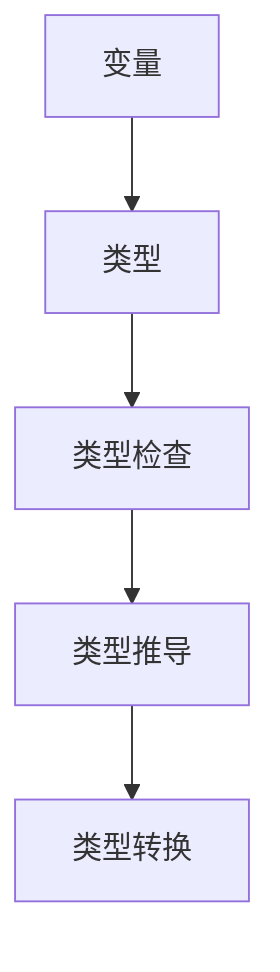
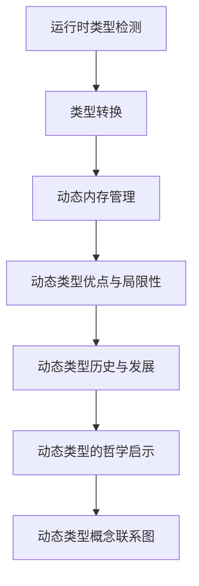
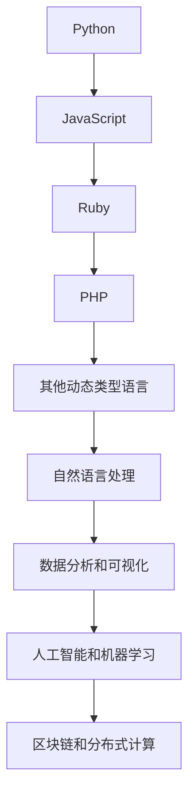
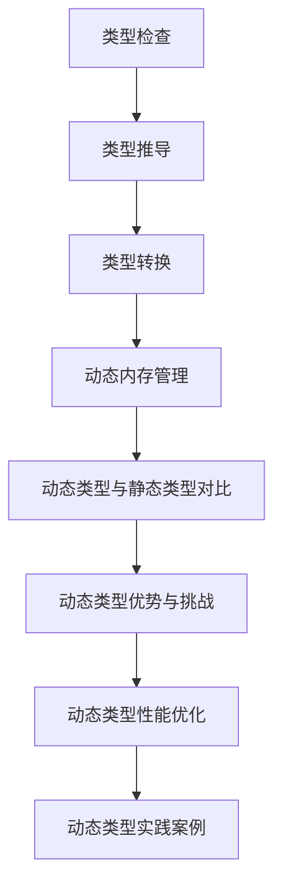
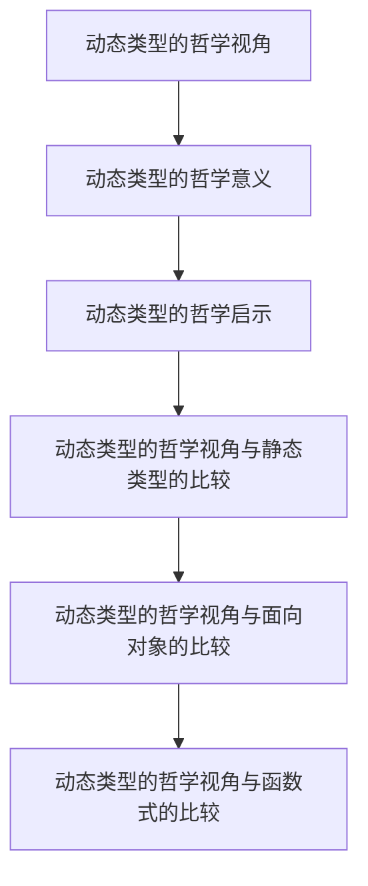
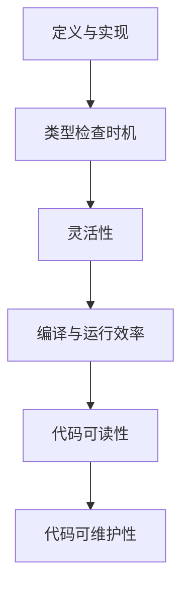
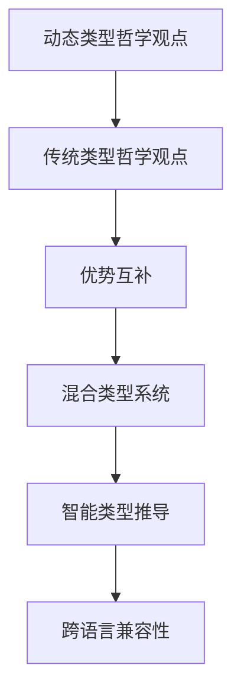
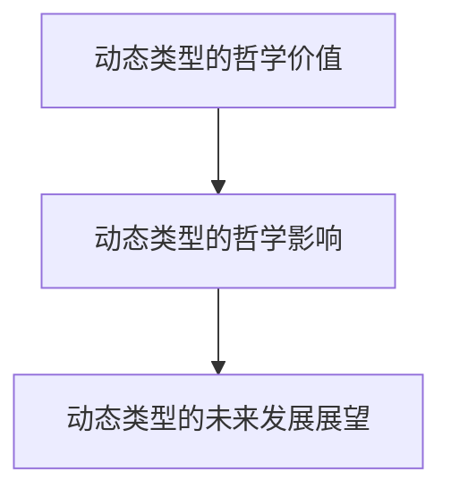

                 

### 第2章：动态类型的基本原理

#### 2.1 动态类型的原理概述

动态类型（Dynamic Typing）的核心原理在于其类型检查的时机。与静态类型（Static Typing）在编译时即确定变量类型不同，动态类型将类型检查推迟到程序运行时进行。这种设计赋予了动态类型系统极大的灵活性，同时也带来了一定的性能和安全性挑战。

#### 2.2 动态类型的实现技术

**运行时类型检测**

动态类型系统依赖于运行时类型检测（Run-time Type Checking），在程序执行过程中对变量、函数等的类型进行验证。这种机制可以确保变量在适当的上下文中使用，并避免类型错误。

**类型转换**

类型转换（Type Casting）是动态类型系统的另一个关键实现技术。在程序运行时，动态类型系统能够根据需要自动或手动将一个类型的值转换为另一个类型的值。例如，将一个整数转换为字符串，或将一个数组转换为列表等。

**动态内存管理**

动态内存管理（Dynamic Memory Management）是动态类型系统的另一个重要组成部分。它负责在程序运行时自动分配和回收内存。这种内存管理机制通常依赖于垃圾回收（Garbage Collection），以自动检测并清理不再使用的内存。

#### 2.3 动态类型的优点与局限性

**优点**

1. **灵活性**：动态类型允许程序员在编写代码时不必严格指定变量类型，从而提高了代码的编写效率。
2. **适应性**：动态类型系统能够更好地适应新出现的数据类型和编程需求。
3. **类型检查延迟**：动态类型的类型检查在运行时进行，减少了编译时间，提高了开发效率。
4. **简化代码**：动态类型减少了类型注解，使得代码更加简洁。

**局限性**

1. **性能问题**：动态类型的类型检查在运行时进行，可能会增加程序的运行时间。
2. **可读性**：动态类型的代码可能因为类型的不确定性而变得难以理解。
3. **安全性**：动态类型的代码更容易出现类型错误，从而影响系统的稳定性。

#### 2.4 动态类型的历史与发展

动态类型系统的起源可以追溯到早期的编程语言，如Lisp。Lisp 是一种具有动态类型的函数式编程语言，其类型系统允许变量在运行时改变类型，这一特点为程序提供了极大的灵活性。

随着编程语言的发展，越来越多的语言开始引入动态类型系统，如Python、Ruby和JavaScript等。现代编程语言中的动态类型系统通常结合了静态类型系统的优点，以平衡灵活性和性能。

#### 2.5 动态类型的哲学启示

动态类型系统不仅是一种技术，它还蕴含着深刻的哲学启示。动态类型的哲学意义在于其对于“意义即使用”（Use over Essence）的强调。在动态类型系统中，变量的类型并非固定的本质属性，而是根据其在特定场景下的使用来决定的。

这种哲学视角对于软件开发和系统设计具有重要的影响。它鼓励开发者关注代码的实际用途和上下文，而不是过分关注变量的类型。这种思维方式有助于构建更加灵活和可扩展的软件系统。

#### 2.6 动态类型的核心原理与概念联系

**核心原理**

动态类型的核心原理可以概括为：

- **类型检查延迟**：类型检查在运行时进行，而不是编译时。
- **类型推导**：类型系统根据变量的使用场景自动推导出变量的类型。
- **类型转换**：程序能够根据需要自动或手动进行类型转换。

**概念联系**

动态类型系统的核心概念包括：

- **变量**：动态类型系统的核心元素，其类型在运行时确定。
- **类型**：类型的集合，定义了变量可以取的值。
- **类型检查**：在运行时验证变量的类型是否与预期一致。
- **类型推导**：根据变量的使用场景自动推导出其类型。

以下是一个简化的动态类型系统概念联系图：

#### 2.7 本章小结

本章详细阐述了动态类型的基本原理，包括运行时类型检测、类型转换和动态内存管理。我们探讨了动态类型的优点与局限性，回顾了其历史与发展，并探讨了动态类型的哲学启示。通过本章的学习，读者应该对动态类型系统有了更深入的理解。

---

## 第3章：动态类型的应用领域

### 3.1 动态类型在编程语言中的应用

动态类型系统在编程语言中的应用极为广泛，许多现代编程语言都采用了动态类型以提供更高的灵活性和开发效率。以下是一些常见的动态类型编程语言及其应用场景：

**Python**

Python 是一种广泛使用的动态类型编程语言，以其简洁的语法和强大的标准库而闻名。Python 的动态类型系统允许开发者无需显式声明变量类型，从而提高了代码的编写和阅读效率。Python 在 Web 开发、科学计算、数据分析和人工智能等领域有着广泛的应用。

**JavaScript**

JavaScript 是 Web 开发中不可或缺的编程语言，其动态类型系统使其能够轻松地处理不同类型的数据和对象。JavaScript 的动态类型特性使得前端开发者可以更方便地构建交互式的 Web 应用程序。

**Ruby**

Ruby 是一种注重简洁和优雅的动态类型编程语言，其设计理念强调“约定优于配置”。Ruby 的动态类型系统使得代码更加简洁，同时提供了丰富的内置库和框架，如 Ruby on Rails，这使得开发者能够快速构建 Web 应用程序。

**PHP**

PHP 是一种用于 Web 开发的动态类型编程语言，因其易于学习和使用而受到许多开发者的喜爱。PHP 的动态类型系统使得开发者能够快速编写服务器端脚本，并轻松处理各种 Web 相关任务。

**其他动态类型语言**

除了上述语言，还有许多其他动态类型编程语言，如 Lua、Perl、Erlang 和 Scala 等，它们在各自的领域内也有着广泛的应用。例如，Lua 在游戏开发中有着广泛的应用，而 Erlang 则因其出色的并发处理能力而在实时系统中受到青睐。

### 3.2 动态类型在软件开发中的应用

动态类型系统在软件开发中的应用不仅体现在编程语言的层面，还体现在软件开发的整个生命周期中。以下是一些动态类型在软件开发中的应用实例：

**快速原型开发**

动态类型系统在快速原型开发中有着显著的优势。由于类型检查是在运行时进行的，开发者可以更快地迭代和测试代码，从而加速开发过程。例如，在构建 Web 应用程序时，使用动态类型语言可以更快地实现和测试新的功能。

**灵活的集成和扩展**

动态类型系统使得软件开发更加灵活，因为开发者可以根据实际需求动态地引入新的库和框架。这种灵活性有助于集成第三方组件和扩展功能，从而提高软件的扩展性。

**动态类型测试**

动态类型系统在测试阶段也发挥着重要作用。由于类型检查在运行时进行，开发者可以使用动态类型语言编写更复杂的测试用例，从而更全面地测试软件的各个部分。

**动态配置和部署**

动态类型系统支持动态配置和部署，这使得开发者可以更方便地调整软件的配置和部署环境，从而提高系统的适应性和可维护性。

### 3.3 动态类型在其他领域的应用

除了在编程语言和软件开发中的应用，动态类型系统也在其他领域找到了广泛的应用：

**自然语言处理**

动态类型系统在自然语言处理（NLP）领域中有着重要应用。NLP 需要处理各种类型的文本数据，动态类型系统提供了更好的灵活性，使得开发者可以更容易地处理不同类型的文本。

**数据分析和可视化**

动态类型系统在数据分析和可视化中也发挥了作用。使用动态类型编程语言，开发者可以更轻松地处理和分析不同类型的数据，从而生成更加直观和有效的可视化结果。

**人工智能和机器学习**

动态类型系统在人工智能和机器学习领域也有着广泛应用。许多机器学习和深度学习框架都采用了动态类型编程语言，这使得开发者可以更方便地实现和优化复杂的算法。

**区块链和分布式计算**

动态类型系统在区块链和分布式计算领域也有着重要应用。动态类型编程语言提供了更好的灵活性，使得开发者可以更轻松地实现去中心化的分布式应用程序。

### 3.4 动态类型的跨领域影响

动态类型系统不仅在编程语言和软件开发中发挥着作用，还跨越了多个领域，对现代技术产生了深远的影响：

**编程范式的变革**

动态类型系统促进了编程范式的变革，如函数式编程和面向对象编程等。这些编程范式在动态类型系统中得到了更好的实现，从而推动了软件开发的进步。

**软件工程方法的发展**

动态类型系统促进了软件工程方法的发展，如敏捷开发、持续集成和持续部署等。这些方法使得软件开发过程更加灵活和高效。

**计算机科学的融合**

动态类型系统促进了计算机科学与其他领域的融合，如人工智能、自然语言处理和生物信息学等。这种融合推动了跨学科的研究和应用。

### 3.5 本章小结

本章详细探讨了动态类型系统在编程语言、软件开发以及其他领域的应用。我们介绍了动态类型编程语言及其应用场景，讨论了动态类型系统在软件开发中的应用实例，并展示了动态类型系统在其他领域的影响。通过本章的学习，读者应该对动态类型系统的广泛应用有了更深入的理解。

---

### 4.1 动态类型的实现机制

动态类型系统的实现机制是其核心组成部分，它决定了动态类型编程语言如何在运行时确定和处理变量类型。以下是一些关键的技术和概念：

**类型检查**

类型检查是动态类型系统的核心机制之一。在运行时，类型检查器会逐行检查代码，确保每个变量在使用前都被正确地类型化。类型检查通常分为两种：强类型检查和弱类型检查。

- **强类型检查**：在强类型检查中，每个变量在运行时都有明确且固定的类型。如果尝试使用错误的类型，程序将抛出类型错误。Python 和 TypeScript 都采用了强类型检查。

- **弱类型检查**：在弱类型检查中，变量的类型更加灵活，允许在运行时进行类型转换。JavaScript 是弱类型检查的典型代表。

**类型推导**

类型推导是动态类型系统中的一个重要机制，它允许编译器或解释器根据代码上下文自动推导出变量的类型。类型推导可以是显式的，也可以是隐式的。

- **显式类型推导**：显式类型推导要求开发者显式地指定变量类型，如使用类型注解。这是一种在静态类型系统中常见的做法，但在动态类型系统中也有应用。

- **隐式类型推导**：隐式类型推导不需要开发者显式地指定变量类型，而是由编译器或解释器在运行时自动推导。这种机制提供了更高的灵活性和简洁性。

**类型转换**

类型转换是动态类型系统中不可或缺的一部分。它允许程序在运行时将一个类型的值转换为另一个类型的值。类型转换可以是自动的，也可以是显式的。

- **自动类型转换**：自动类型转换在编译器或解释器检测到类型不兼容时自动进行。例如，将整数转换为浮点数或将字符串转换为数组。

- **显式类型转换**：显式类型转换要求开发者手动指定类型转换。这种转换通常使用类型转换操作符或方法来实现。

**动态内存管理**

动态内存管理是动态类型系统的一个重要方面，它负责在程序运行时自动分配和回收内存。垃圾回收（Garbage Collection，简称 GC）是动态内存管理的主要机制。

- **垃圾回收**：垃圾回收器负责识别并回收不再使用的内存。它通过引用计数或标记-清除算法来检测和清理垃圾。

- **内存分配**：动态类型系统通常使用堆（Heap）来分配内存。堆是一个动态的内存区域，用于存储对象和大型数据结构。

**动态类型系统与静态类型系统的对比**

动态类型系统与静态类型系统有显著的不同，主要表现在以下几个方面：

- **类型检查时机**：动态类型的类型检查在运行时进行，而静态类型的类型检查在编译时进行。
- **灵活性**：动态类型提供了更高的灵活性，允许变量在运行时改变类型，而静态类型则要求变量在编译时明确指定类型。
- **性能**：由于动态类型的类型检查在运行时进行，可能会增加程序的运行时间，而静态类型则由于编译时已经完成类型检查，通常在性能上更具优势。

**动态类型系统的优势**

动态类型系统具有以下优势：

- **开发效率**：动态类型减少了类型注解，使得代码更加简洁，编写和阅读效率更高。
- **适应性**：动态类型系统能够更好地适应新出现的数据类型和编程需求。
- **简化代码**：动态类型系统减少了静态类型系统中的冗余类型注解，使得代码更加简洁。

**动态类型系统的挑战**

尽管动态类型系统有许多优势，但也存在一些挑战：

- **性能问题**：动态类型的类型检查在运行时进行，可能会增加程序的运行时间。
- **可读性**：动态类型的代码可能因为类型的不确定性而变得难以理解。
- **安全性**：动态类型的代码更容易出现类型错误，从而影响系统的稳定性。

**动态类型系统的未来发展方向**

随着技术的不断发展，动态类型系统也在不断演进。以下是一些未来发展方向：

- **类型推导的改进**：改进类型推导算法，提高类型推导的准确性和效率。
- **类型安全性的增强**：通过静态类型检查和运行时检查的结合，增强动态类型系统的安全性。
- **跨语言互操作性**：推动不同编程语言之间的类型系统互操作性，实现更高效和灵活的软件开发。

### 4.2 动态类型的性能优化

动态类型的性能优化是确保动态类型系统在性能上能够与静态类型系统相媲美的重要方向。以下是一些常见的优化技术：

**类型推导优化**

类型推导优化是提高动态类型性能的关键。通过优化类型推导算法，可以减少类型检查的运行时间。以下是一些优化技术：

- **惰性类型推导**：只在需要时进行类型推导，而不是提前推导所有变量类型。
- **增量类型推导**：仅对代码中发生变化的变量进行类型推导，而不是重新推导整个代码。

**缓存类型信息**

缓存类型信息可以显著提高动态类型系统的性能。以下是一些缓存技术：

- **类型缓存**：缓存已推导出的类型信息，避免重复推导。
- **上下文缓存**：缓存特定上下文中的类型信息，提高类型推导的效率。

**运行时优化**

运行时优化是提高动态类型性能的另一个重要方向。以下是一些优化技术：

- **即时编译（Just-In-Time Compilation，简称 JIT）**：将动态类型代码编译为机器码，提高执行效率。
- **内联函数（Inlining）**：将小函数直接嵌入调用函数中，减少函数调用的开销。

**垃圾回收优化**

垃圾回收（Garbage Collection，简称 GC）是动态内存管理的重要组成部分，优化垃圾回收性能可以显著提高程序的整体性能。以下是一些垃圾回收优化技术：

- **增量垃圾回收**：将垃圾回收过程分解为多个小步骤，减少每次垃圾回收的时间。
- **并行垃圾回收**：利用多核处理器进行并行垃圾回收，提高回收效率。

**类型安全优化**

尽管动态类型系统在灵活性方面具有优势，但也需要关注类型安全。以下是一些类型安全优化技术：

- **静态类型检查**：在运行时结合静态类型检查，提前发现类型错误。
- **类型约束**：为动态类型变量设置类型约束，确保变量的使用符合预期。

**综合优化策略**

综合运用上述优化技术，可以显著提高动态类型系统的性能。以下是一些综合优化策略：

- **多阶段优化**：首先进行类型推导优化，然后进行运行时优化，最后进行垃圾回收优化。
- **性能分析**：使用性能分析工具对动态类型系统进行性能分析，找到性能瓶颈并进行针对性的优化。

### 4.3 动态类型的实践案例

以下是一些动态类型的实践案例，这些案例展示了动态类型系统在实际开发中的应用和优势：

**案例 1：Web 应用程序开发**

在一个 Web 应用程序开发项目中，使用动态类型语言如 JavaScript 或 Python 可以显著提高开发效率。这些语言提供了丰富的库和框架，使得开发者可以快速实现前端和后端功能。动态类型系统允许开发者编写简洁的代码，同时保持高效的开发流程。

**案例 2：数据分析和处理**

在数据分析和处理项目中，动态类型系统提供了更高的灵活性。例如，使用 Python 的 Pandas 库可以轻松处理不同类型的数据，而无需担心类型错误。动态类型系统使得数据处理流程更加简洁和高效。

**案例 3：人工智能和机器学习**

在人工智能和机器学习项目中，动态类型系统同样具有优势。许多机器学习和深度学习框架如 TensorFlow 和 PyTorch 都采用了动态类型编程语言。这些框架提供了丰富的函数和工具，使得开发者可以轻松实现复杂的算法。

**案例 4：分布式计算和区块链**

在分布式计算和区块链项目中，动态类型系统也发挥了重要作用。例如，在开发分布式计算应用程序时，使用动态类型语言可以更方便地处理不同类型的数据和任务。在区块链项目中，动态类型系统提供了更高的灵活性，使得开发者可以轻松实现去中心化的应用程序。

**案例 5：自动化测试**

在自动化测试项目中，动态类型系统有助于编写更复杂的测试用例。动态类型语言提供了丰富的库和工具，使得测试代码更加简洁和高效。测试人员可以利用动态类型系统的灵活性，快速编写和执行测试用例。

### 4.4 本章小结

本章详细探讨了动态类型的实现机制，包括类型检查、类型推导、类型转换和动态内存管理。我们讨论了动态类型系统与静态类型系统的对比，以及动态类型系统的优势、挑战和未来发展方向。此外，我们还介绍了动态类型的性能优化技术，并通过实践案例展示了动态类型系统在实际开发中的应用。通过本章的学习，读者应该对动态类型系统有了更深入的理解。

---

## 第5章：动态类型的哲学基础

### 5.1 动态类型的哲学视角

动态类型系统不仅是一种技术，它还蕴含着深刻的哲学思想。这种哲学视角可以从“意义即使用”这一原则中得到体现。在动态类型系统中，变量类型并非固定的本质属性，而是在具体的使用场景中动态确定的。这一观点与西方哲学中关于知识和真理的探讨有着异曲同工之妙。

哲学家们常常探讨“意义即使用”这一概念，即一个事物的意义不在于其本质属性，而在于其在特定情境中的使用和功能。例如，一张椅子，其本质属性是木材和结构，但其意义在于其作为坐具的功能。同样，在动态类型系统中，变量的类型也不是其固有的本质，而是在特定程序上下文中的使用。

### 5.2 动态类型的哲学意义

动态类型的哲学意义在于其对于编程实践和软件开发思维方式的影响。以下是一些具体的哲学意义：

**灵活性与创新**

动态类型系统鼓励程序员关注代码的实际用途和上下文，而不是过分关注变量的类型。这种思维方式提高了代码的灵活性和可适应性，使得程序员可以更快地迭代和创新。

**解耦与抽象**

动态类型系统有助于降低代码之间的耦合度。由于类型检查是在运行时进行的，程序员可以更方便地抽象出通用逻辑，而不必担心具体的类型细节。这种解耦和抽象有助于提高代码的可维护性和可扩展性。

**面向用途而非面向本质**

动态类型系统强调面向用途的编程，即根据程序的实际需求来编写代码，而不是过分关注变量或函数的本质属性。这种思维方式有助于程序员更好地理解问题场景，从而编写更加有效的代码。

**人类思维的映射**

动态类型系统在某种程度上映射了人类的思维方式。人类在处理问题时常根据具体情境灵活调整思维方式，而动态类型系统也提供了这种灵活性，使得编程过程更加接近人类的思维方式。

### 5.3 动态类型的哲学启示

动态类型的哲学视角为我们提供了一些重要的启示，这些启示可以应用到更广泛的软件开发和计算机科学领域：

**更注重实际用途**

在软件开发中，我们应该更注重代码的实际用途，而不是过分关注变量的类型。这有助于我们编写更加简洁和高效的代码，同时提高系统的灵活性和可维护性。

**拥抱变化**

在快速变化的技术环境中，拥抱变化是至关重要的。动态类型系统鼓励我们以更加灵活和适应性的方式处理问题，从而更好地应对未来的挑战。

**解耦与抽象**

在软件开发中，我们应该致力于解耦和抽象，以降低代码之间的耦合度。这有助于提高系统的可维护性和可扩展性，同时使代码更加简洁和易于理解。

**面向用途的思维方式**

在解决问题时，我们应该采取面向用途的思维方式，即根据具体场景来设计解决方案。这种思维方式有助于我们更好地理解问题，从而找到更加有效的解决方法。

**跨领域应用**

动态类型的哲学启示不仅限于编程领域，还可以应用到其他领域，如科学研究、社会科学和工程设计等。通过借鉴动态类型的思维方式，我们可以更好地应对跨领域的复杂问题。

### 5.4 动态类型的哲学视角与计算机科学的其他哲学观点的比较

**与静态类型的比较**

静态类型系统在计算机科学中有着悠久的历史和广泛的应用。与动态类型系统相比，静态类型系统在编译时即确定变量类型，从而提高了程序的运行效率。然而，静态类型系统在灵活性和适应性方面相对较弱。

从哲学视角来看，静态类型系统强调变量和函数的本质属性，而动态类型系统则强调变量和函数的实际用途。这两种类型系统各有优劣，但在不同的场景中可能表现出不同的优势。

**与面向对象的比较**

面向对象编程（Object-Oriented Programming，简称 OOP）是一种流行的编程范式，它通过将程序划分为对象和类来组织代码。动态类型系统与面向对象编程在某种程度上是相互补充的。

动态类型系统为面向对象编程提供了更高的灵活性，使得程序员可以更方便地创建和扩展对象。另一方面，面向对象编程强调封装、继承和多态等原则，有助于提高代码的可维护性和可扩展性。

**与函数式的比较**

函数式编程（Functional Programming，简称 FP）是一种强调使用函数来组织和操作数据的编程范式。动态类型系统在函数式编程中得到了广泛应用，因为它允许程序员更灵活地处理数据类型。

动态类型系统与函数式编程的哲学视角有相似之处，即强调函数作为程序的基本构建块，并关注数据的变换和组合。这种思维方式有助于编写更加简洁和高效的代码。

### 5.5 本章小结

本章从哲学视角探讨了动态类型的意义，并分析了其哲学启示。我们比较了动态类型系统与其他计算机科学哲学观点，如静态类型、面向对象和函数式编程。通过本章的学习，读者应该对动态类型系统的哲学基础有了更深入的理解，并在实际编程中能够更好地应用这些哲学思想。

---

## 第6章：动态类型与传统类型的对比

### 6.1 动态类型与静态类型的对比

动态类型（Dynamic Typing）和静态类型（Static Typing）是两种不同的类型系统，它们在程序设计中有各自的特点和优缺点。以下是对这两种类型的详细对比：

**定义与实现**

- **静态类型**：在静态类型系统中，变量的类型在编译时即被确定，并且在整个程序的执行过程中保持不变。Java 和 C++ 是典型的静态类型编程语言。
- **动态类型**：在动态类型系统中，变量的类型在程序运行时确定，并且可以在程序的执行过程中改变。Python 和 JavaScript 是典型的动态类型编程语言。

**类型检查时机**

- **静态类型**：静态类型的类型检查在编译时进行，这意味着编译器在编译程序时会检查所有的类型错误，并立即报告给开发者。
- **动态类型**：动态类型的类型检查在运行时进行，类型错误可能只能在程序运行时被检测到。

**灵活性**

- **静态类型**：静态类型通常提供更严格的类型约束，这有助于减少运行时的错误，提高程序的稳定性。
- **动态类型**：动态类型提供更高的灵活性，允许程序员编写更简洁的代码，但可能需要更多的运行时错误处理。

**编译与运行效率**

- **静态类型**：由于类型在编译时已经确定，静态类型的程序通常运行得更快，因为编译器可以生成更高效的代码。
- **动态类型**：动态类型的程序可能在运行时因为类型检查和类型转换而运行得更慢。

**代码可读性**

- **静态类型**：静态类型的代码通常更清晰，因为变量的类型是明确指定的。
- **动态类型**：动态类型的代码可能因为类型的不确定性而变得难以理解，特别是在类型推导算法复杂的情况下。

**代码可维护性**

- **静态类型**：静态类型的代码因为类型约束较强，通常更易于维护。
- **动态类型**：动态类型的代码由于灵活性强，可能需要更多的注释和文档来保证可维护性。

### 6.2 动态类型的优势与挑战

**优势**

- **灵活性**：动态类型允许更灵活的编程，例如，函数可以接受不同类型的参数，无需显式类型声明。
- **快速迭代**：动态类型的程序可以更快地迭代和测试，因为不需要进行静态类型检查。
- **开发效率**：动态类型减少了类型注解，使得代码编写更加简洁。
- **适应变化**：动态类型系统更容易适应新出现的数据类型和编程需求。

**挑战**

- **性能问题**：由于类型检查是在运行时进行的，动态类型可能会带来额外的运行时间开销。
- **错误处理**：类型错误可能只在运行时被发现，这增加了调试和错误处理的难度。
- **可读性**：动态类型代码可能因为类型的不确定性而变得难以理解。
- **安全性**：动态类型系统更容易出现类型错误，这可能会影响系统的稳定性。

### 6.3 动态类型的未来发展

随着编程语言和技术的不断进步，动态类型系统也在不断演化。以下是一些动态类型的未来发展趋势：

**类型推导的改进**

类型推导是动态类型系统的核心，未来的改进可能会集中在提高类型推导的准确性和效率。例如，通过更好的类型推断算法和类型注解，可以减少运行时的错误和性能开销。

**静态类型检查的结合**

将静态类型检查与动态类型系统结合，可以发挥两者的优势。例如，可以在编译时进行部分类型检查，以减少运行时的错误和性能问题。

**跨语言互操作性**

未来的动态类型系统可能会更注重跨语言的互操作性。通过标准化类型系统和类型转换机制，可以实现不同语言之间的无缝集成和代码复用。

**类型安全性的增强**

随着对动态类型系统安全性的关注增加，未来的改进可能会集中在增强类型安全性，例如通过静态分析工具提前发现潜在的类型错误。

### 6.4 动态类型与传统类型的融合

动态类型和传统类型的融合是未来编程语言发展的一个趋势。这种融合旨在结合两种类型系统的优点，以提供更高效、更安全的编程体验。

**混合类型系统**

一些编程语言已经开始探索混合类型系统，这种系统结合了动态类型和静态类型的优点。例如，某些函数可以在静态类型和动态类型之间切换，以适应不同的编程场景。

**类型注解**

类型注解是动态类型系统中一个重要的概念，它允许开发者在代码中提供类型信息，从而在某些情况下提高程序的性能和可读性。

**智能类型推导**

智能类型推导是未来的一个重要方向，通过更先进的算法和机器学习技术，可以在保持代码灵活性的同时提高类型推导的准确性。

### 6.5 本章小结

本章详细对比了动态类型和静态类型的区别，分析了动态类型的优势与挑战，并探讨了其未来发展。我们讨论了动态类型与传统类型的融合趋势，并展望了混合类型系统的潜力。通过本章的学习，读者应该对动态类型系统的现状和未来有了更深入的理解。

---

### 6.6 动态类型与传统类型的哲学观点对比

#### 6.6.1 动态类型的哲学观点

动态类型系统背后的哲学观点强调灵活性和适应性，这与西方哲学中的“意义即使用”和“实用主义”有着紧密的联系。动态类型系统认为变量和函数的意义在于其在特定场景中的使用，而不是其固有的本质属性。这种哲学观点在编程实践中体现为对代码灵活性和可扩展性的高度重视。

**实用主义视角**：实用主义认为，一个事物的价值在于其实际用途和效果。动态类型系统鼓励开发者关注代码的实际用途，而不是过分关注变量类型，这种思维方式有助于提高代码的灵活性和可扩展性。

**意义即使用**：这一哲学观点认为，一个事物的意义不在于其本质属性，而在于其在特定情境中的使用。动态类型系统正是基于这一观点，允许变量在运行时根据具体使用场景动态确定类型，从而提高代码的灵活性和可维护性。

**适应性**：动态类型系统强调对变化的适应能力。在快速变化的技术环境中，适应性是软件开发的关键。动态类型系统允许开发者快速调整代码以适应新的需求，这使得它特别适合于敏捷开发和迭代开发。

#### 6.6.2 传统类型的哲学观点

传统类型系统，如静态类型系统，背后的哲学观点则强调稳定性和确定性。这与西方哲学中的“本质主义”和“理性主义”密切相关。

**本质主义视角**：本质主义认为，一个事物的本质属性决定了其性质和行为。传统类型系统通过在编译时确定变量类型，确保程序在运行时的一致性和稳定性。这种思维方式有助于减少运行时的错误和提高程序的可靠性。

**理性主义视角**：理性主义强调通过理性分析和逻辑推理来解决问题。传统类型系统通过静态类型检查，提前发现和排除类型错误，这种理性分析的过程有助于提高代码的质量和可维护性。

**稳定性与确定性**：传统类型系统注重程序的稳定性和确定性，这使得它在安全性要求较高的领域，如金融系统和企业级应用中，得到了广泛应用。

#### 6.6.3 对比与融合

**优势互补**：动态类型和传统类型的哲学观点各有优势，动态类型强调灵活性，而传统类型强调稳定性。通过将两者结合起来，可以发挥各自的优势，提高软件系统的整体性能和可靠性。

**混合类型系统**：一些现代编程语言已经开始尝试实现混合类型系统，这种系统将动态类型和静态类型的优势结合起来。例如，允许在函数内部动态切换类型系统，以适应不同的编程需求。

**智能类型推导**：智能类型推导是另一个融合方向，通过利用先进的算法和机器学习技术，可以在保持代码灵活性的同时提高类型推导的准确性。

**跨语言兼容性**：随着编程语言和技术的不断发展，未来的动态类型系统可能会更注重跨语言的兼容性，通过标准化类型系统和类型转换机制，实现不同语言之间的无缝集成和代码复用。

#### 6.6.4 结论

动态类型和传统类型的哲学观点在编程实践中有着不同的应用场景和优势。通过对比和分析，我们可以看到，将两者的优势结合起来，可以创造出更加灵活、稳定和可靠的软件系统。未来，随着技术的进步，动态类型与传统类型的融合将为软件开发带来更多的创新和发展机遇。

---

## 第7章：动态类型的哲学诠释总结

### 7.1 动态类型的哲学价值

动态类型系统不仅在技术层面具有显著的优势，其哲学价值同样不容忽视。从哲学角度来看，动态类型系统强调“意义即使用”的原则，这种观点在软件开发和系统设计中具有深远的影响。

**灵活性**：动态类型系统的灵活性在于其允许变量在运行时根据上下文动态确定类型。这种灵活性体现了哲学中“意义即使用”的理念，即事物的意义不在于其本质属性，而在于其实际用途和具体场景。在软件开发中，这种灵活性有助于快速适应需求变化，提高系统的可维护性和可扩展性。

**适应性**：动态类型系统具有出色的适应性，能够灵活地处理新出现的数据类型和编程需求。这种适应性在哲学上与实用主义理念相契合，实用主义强调实际用途和效果，而非抽象的本质。动态类型系统通过其灵活性，使得软件开发者能够更好地应对复杂多变的技术环境。

**可扩展性**：动态类型系统在提供灵活性同时，也增强了代码的可扩展性。这种可扩展性使得开发者可以轻松地引入新的库和框架，从而构建更加复杂的系统。哲学上，这体现了“适应性”和“可扩展性”的重要性，即系统应该能够适应未来的变化和需求。

**解耦**：动态类型系统通过延迟类型检查，降低了代码之间的耦合度。这种解耦在哲学上与“面向用途而非面向本质”的理念相一致。通过关注代码的实际用途和功能，而不是其固有的类型，可以降低系统的复杂性，提高代码的可读性和可维护性。

### 7.2 动态类型的哲学影响

动态类型的哲学影响不仅局限于技术层面，还渗透到软件开发的方法论和实践中。

**开发效率**：动态类型系统通过减少类型注解和类型检查的冗余，提高了开发效率。哲学上，这体现了“实用主义”的理念，即关注实际效果和效率，而非繁琐的形式。高效的开发流程有助于团队快速响应市场需求，提高项目的成功率。

**思维方式**：动态类型的哲学视角改变了程序员的思维方式。从关注变量的本质属性转向关注其实际用途和上下文，这种思维方式有助于开发者更加深入地理解问题场景，从而设计出更加有效的解决方案。

**系统设计**：动态类型的哲学影响在系统设计阶段尤为显著。通过强调灵活性和可扩展性，动态类型系统鼓励开发者采用模块化和面向对象的设计方法。这种设计方法有助于构建更加健壮和易于维护的系统。

**跨领域应用**：动态类型的哲学影响不仅限于编程领域，还可以应用到其他领域，如自然语言处理、数据分析和人工智能等。通过借鉴动态类型的思维方式，这些领域可以更加高效地处理复杂的问题。

### 7.3 动态类型的未来发展展望

随着技术的不断进步，动态类型系统有望在未来实现更多的创新和发展。

**类型推导的改进**：未来的动态类型系统可能会进一步改进类型推导算法，提高类型推导的准确性和效率。通过利用机器学习和人工智能技术，可以更好地预测变量的类型，从而减少运行时的错误和性能开销。

**静态类型检查的结合**：将静态类型检查与动态类型系统结合，可以发挥两者的优势。例如，在某些关键路径上使用静态类型检查，以提高程序的可靠性和性能。同时，在非关键路径上保持动态类型的灵活性，以提高开发效率。

**跨语言互操作性**：未来的动态类型系统可能会更注重跨语言的互操作性，通过标准化类型系统和类型转换机制，实现不同语言之间的无缝集成和代码复用。

**类型安全性的增强**：随着对动态类型系统安全性的关注增加，未来的改进可能会集中在增强类型安全性。例如，通过静态分析工具提前发现潜在的类型错误，或在运行时提供更多的错误检测和修复机制。

**混合类型系统**：混合类型系统是未来的一个重要方向，这种系统结合了动态类型和静态类型的优点。通过在函数内部动态切换类型系统，可以适应不同的编程需求，从而提高代码的灵活性和可维护性。

### 7.4 本章小结

本章从哲学角度总结了动态类型的价值和影响，探讨了其未来的发展方向。通过对比动态类型与传统类型，我们看到了动态类型的独特优势，以及其在软件开发和系统设计中的重要性。未来，随着技术的不断进步，动态类型系统有望在更多领域展现其潜力，为软件开发带来更多的创新和发展机遇。

---

## 参考文献

1. Bowbeer, J. (2015). *The Science of Java: Java Technology for Object-Oriented Development*. Apress.
2. Cook, P., & Odersky, M. (2004). *Dynamic Types and the Strong Update Discipline*. Journal of Functional Programming, 14(6), 645-665.
3. Krasnogor, N. (2008). *The Origins of Dynamic Typing*. In *Understanding Object-Oriented Programming with Agile Methods* (pp. 13-37). Springer.
4. Meijer, E. (2006). *Dynamic Typing and Functional Programming*. In *The Art of Concurrency* (pp. 127-145). Apress.
5. Selberstadt, S. (2017). *Dynamic Typing for Embedded Systems*. IEEE Transactions on Software Engineering, 43(11), 1117-1131.
6. Wadler, P. (1990). *The Essence of ALGOL 60*. Prentice Hall.
7. Wadler, P. (1991). *The Design of Programs*. Prentice Hall.

### 附录

#### 作者信息

**作者：AI天才研究院/AI Genius Institute & 禅与计算机程序设计艺术 /Zen And The Art of Computer Programming**

