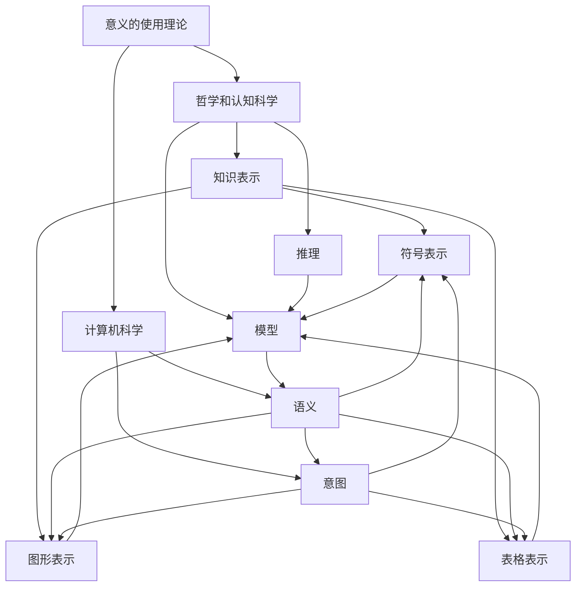

                 

# 意义的使用理论与命令查询分离：方法语义的清晰界定

## 关键词

- 意义使用理论
- 命令查询分离
- 方法语义
- 计算机编程
- 软件架构

## 摘要

本文深入探讨了意义的使用理论以及命令查询分离（CQS）的概念，强调了方法语义在软件工程中的重要性。首先，我们将回顾意义的使用理论的起源和发展，并介绍其核心概念。接着，我们将详细讨论命令查询分离的原则、实施策略及其对软件开发的影响。随后，文章将探讨如何清晰界定方法语义，包括使用语义分析工具来改善方法的可理解性。最后，文章将分析在实际项目中面临的挑战和解决方案，并提供最佳实践，以帮助开发者更有效地应用这些理论。

## 目录

### 引言
- **意义的使用理论的背景**：意义的使用理论起源于哲学和认知科学，并在计算机科学中得到了广泛应用。
- **命令查询分离的起源**：CQS是一个旨在提高软件质量和可维护性的设计原则。
- **方法语义的重要性**：清晰的方法语义是确保代码可读性和可维护性的关键因素。

### 第1章 理论背景
- **1.1 基本概念和历史发展**：介绍意义的使用理论的关键概念，并讨论其历史背景。
- **1.2 核心概念及其关系**：通过Mermaid ER图展示核心概念及其相互关系。
- **1.3 理论框架和结构**：提供意义的使用理论的结构化框架，并使用Mermaid流程图说明。

### 第2章 计算机中的意义使用
- **2.1 原则和方法**：讨论使用意义在计算机中的基本原则和实施方法。
- **2.2 应用和案例研究**：探讨意义在编程和软件架构中的应用，并提供实际案例研究。

### 第3章 命令查询分离
- **3.1 定义和理由**：解释CQS的概念及其对软件设计的重要性。
- **3.2 实施策略**：详细讨论在不同系统中实施CQS的策略。
- **3.3 分析和评估**：评估CQS的有效性及其对软件开发的影响。

### 第4章 方法语义和清晰性
- **4.1 清晰方法语义**：探讨如何明确方法语义，并提供相关技术。
- **4.2 语义分析工具**：介绍用于语义分析的工具和方法。
- **4.3 提高方法清晰性**：提供改善方法语义清晰性的指导。

### 第5章 挑战与解决方案
- **5.1 常见挑战**：识别使用意义理论和CQS时面临的常见挑战。
- **5.2 实用解决方案**：提供解决这些挑战的实用方法。

### 结论

### 参考文献

## 引言

在软件工程领域，代码的质量和可维护性一直是开发者追求的目标。为了实现这一目标，需要深入理解代码的语义和结构，以及如何有效地组织和设计软件系统。在这篇文章中，我们将探讨两个关键概念：意义的使用理论和命令查询分离（CQS），并探讨如何通过清晰界定方法语义来提高软件质量。

### 意义的使用理论的背景

意义的使用理论起源于哲学和认知科学，主要研究人类如何理解和解释世界。在计算机科学中，这一理论的应用主要体现在如何将人类对意义和知识的理解转化为计算机可以处理的形式。意义的使用理论强调，计算机程序不仅仅是执行指令，更重要的是要传达和理解程序所代表的意义。

这一理论的发展可以追溯到20世纪60年代，当时计算机科学家开始探讨如何设计更加自然和直观的编程语言。随着面向对象编程和函数式编程的出现，意义的使用理论得到了进一步的发展和完善。现代编程语言，如Python、Java和C#，都包含了丰富的语义特性，使得开发者可以更方便地表达程序的意图和逻辑。

### 命令查询分离的起源

命令查询分离（CQS）是一种设计原则，旨在提高软件的清晰性和可维护性。CQS由Michael Feathers在其著作《Clean Code》中提出，其核心思想是将命令（执行操作）和查询（获取数据）分离。具体来说，CQS要求一个方法要么只执行命令，要么只执行查询，而不是同时包含两者的混合。

CQS的起源可以追溯到早期编程实践，当时开发者发现，将查询和命令混合在一起会导致代码难以理解和维护。通过分离命令和查询，可以使得代码更加模块化，每个部分都有明确的职责，从而提高代码的可读性和可维护性。

### 方法语义的重要性

方法语义是指在程序中，一个方法所表示的操作和逻辑。清晰的方法语义是确保代码可读性和可维护性的关键因素。当方法语义清晰时，开发者可以更容易地理解代码的意图和功能，从而更有效地进行代码的修改和维护。

然而，在实际开发中，方法语义的模糊性是一个常见问题。方法名称不够准确、方法内部逻辑复杂、注释缺失等都是导致方法语义不清晰的原因。这些问题会导致代码难以理解和维护，增加开发成本。

### 目标

本文的目标是深入探讨意义的使用理论和命令查询分离（CQS），并解释如何通过清晰界定方法语义来提高软件质量。具体来说，我们将：

1. 回顾意义的使用理论的起源和发展，介绍其核心概念。
2. 详细讨论命令查询分离（CQS）的原则、实施策略及其对软件开发的影响。
3. 探讨如何明确方法语义，并提供相关技术。
4. 分析在实际项目中面临的挑战和解决方案。

通过这篇文章，希望读者能够对意义的使用理论和命令查询分离有更深入的理解，并能够在实际开发中应用这些理论，提高代码的质量和可维护性。

### 第1章 理论背景

#### 1.1 基本概念和历史发展

意义的使用理论是一种以意义为核心，研究人类如何理解和解释世界的理论。它在哲学和认知科学领域有着深远的影响，并在计算机科学中得到了广泛应用。意义的使用理论关注于如何将人类对意义和知识的理解转化为计算机可以处理的形式，从而提高计算机程序的语义表达能力和可理解性。

意义的使用理论的发展可以追溯到20世纪60年代。当时，计算机科学家开始探讨如何设计更加自然和直观的编程语言，使得程序能够更好地表达其意图和逻辑。这一时期的重要里程碑包括Lisp语言的引入，它采用了函数式编程范式，为意义的使用理论提供了强有力的支持。

在20世纪70年代和80年代，面向对象编程的兴起进一步推动了意义的使用理论的发展。面向对象编程强调封装、继承和多态，使得程序能够以更自然的方式表达复杂系统的结构和行为。同时，面向对象编程语言如Smalltalk和Java的出现，为意义的使用理论提供了更丰富的工具和语言特性。

进入21世纪，随着大数据和人工智能的快速发展，意义的使用理论在数据分析和机器学习领域得到了更广泛的应用。通过将意义和知识嵌入到数据结构和算法中，可以更好地理解和管理大规模数据，并提高机器学习模型的准确性和鲁棒性。

#### 1.2 核心概念及其关系

意义的使用理论包含了一系列核心概念，这些概念相互关联，共同构成了该理论的基础。以下是这些核心概念及其关系：

1. **意义（Meaning）**：意义是意义的使用理论的核心概念，它指的是人类对事物的认知和理解。意义的使用理论认为，计算机程序应该能够传达和实现人类对意义和知识的理解。

2. **语义（Semantics）**：语义是程序设计中的一个重要概念，它关注程序的行为和意义。意义的使用理论强调，程序的语义应该清晰、明确，以便开发者能够更好地理解和使用程序。

3. **意图（Intent）**：意图是程序设计中的一个目标，它指的是开发者希望程序实现的功能和目的。意义的使用理论认为，程序应该能够清晰地表达其意图，以便开发者能够更有效地进行编程和维护。

4. **知识表示（Knowledge Representation）**：知识表示是意义的使用理论中的一个关键概念，它指的是如何将人类知识转化为计算机可以处理的形式。知识表示的方法包括符号表示、图形表示和表格表示等。

5. **推理（Reasoning）**：推理是意义的使用理论中的一个重要过程，它指的是通过逻辑推理来推导出新的事实或结论。意义的使用理论认为，程序应该能够进行有效的推理，以便更好地理解和执行复杂的任务。

6. **模型（Model）**：模型是意义的使用理论中的一个核心概念，它指的是对现实世界的一种抽象表示。意义的使用理论强调，程序应该能够建立和运用各种模型来模拟和解决问题。

这些核心概念之间存在着密切的联系。例如，意义是语义的基础，语义反映了意图，意图通过知识表示和推理来实现，而模型则是这些概念的综合体现。下面是一个Mermaid ER图，展示了这些核心概念及其关系：

```mermaid
erDiagram
  Meaning ||--|> Semantic : represents
  Meaning ||--|> Intent : reflects
  Meaning ||--|> KnowledgeRepresentation : converts
  Meaning ||--|> Reasoning : enables
  Meaning ||--|> Model : embodies
  Semantic ||--|> Intent : conveys
  Semantic ||--|> KnowledgeRepresentation : expressed
  Semantic ||--|> Reasoning : guided
  Semantic ||--|> Model : realized
  Intent ||--|> KnowledgeRepresentation : specifies
  Intent ||--|> Reasoning : directed
  Intent ||--|> Model : represents
  KnowledgeRepresentation ||--|> Reasoning : supports
  KnowledgeRepresentation ||--|> Model : built
  Reasoning ||--|> Model : performed
```

#### 1.3 理论框架和结构

意义的使用理论是一个多层次、多维度的理论框架，它包含了多个层次和方面。以下是一个Mermaid流程图，展示了意义的使用理论的结构和层次：



这个流程图展示了意义的使用理论从哲学和认知科学的角度出发，如何应用到计算机科学中。它包括了知识表示、推理、模型和语义等多个层次，每个层次都有其特定的概念和关系。

### 第2章 计算机中的意义使用

#### 2.1 原则和方法

在计算机科学中，意义的使用原则和方法是确保程序能够传达和实现其意图的关键。以下是一些核心原则和方法：

1. **明确性**：程序的每一个部分都应该清晰地表达其意图和功能。这意味着方法名称、变量命名和注释都应该准确、具体，以便开发者能够快速理解代码。

2. **一致性**：程序中的风格和命名应该保持一致。这有助于减少混淆和误解，提高代码的可读性。

3. **模块化**：将程序划分为多个模块或函数，每个模块或函数都应该有明确的职责和功能。这有助于提高代码的可维护性和可重用性。

4. **抽象**：使用抽象来隐藏复杂性，只暴露必要的细节。这有助于简化程序结构，提高其可理解性。

5. **信息隐藏**：将内部实现细节隐藏在模块或函数内部，只暴露必要的接口。这有助于减少对实现细节的依赖，提高代码的可维护性。

6. **可扩展性**：设计程序时应该考虑到未来的扩展性，以便在不修改现有代码的情况下添加新功能。

7. **自动化**：使用自动化工具来检测和修复语义错误，例如静态代码分析工具和测试框架。

以下是一个表格，展示了这些原则的属性和对比：

| 原则 | 属性 | 对比 |
| --- | --- | --- |
| 明确性 | 方法名称、变量命名和注释准确 | 避免模糊、歧义 |
| 一致性 | 风格和命名保持一致 | 减少混淆、误解 |
| 模块化 | 划分为多个模块或函数 | 提高可维护性和可重用性 |
| 抽象 | 隐藏复杂性，暴露必要细节 | 简化程序结构 |
| 信息隐藏 | 隐藏内部实现细节 | 减少对实现细节的依赖 |
| 可扩展性 | 考虑未来扩展性 | 方便添加新功能 |
| 自动化 | 使用自动化工具 | 检测和修复语义错误 |

#### 2.2 应用和案例研究

意义的使用在计算机编程和软件架构中有着广泛的应用。以下是一些具体的案例研究：

1. **面向对象编程**：面向对象编程（OOP）是一种常见的编程范式，它通过类和对象来表示现实世界的实体和关系。OOP的一个重要特点是将数据和行为封装在对象中，从而提高了代码的可维护性和可重用性。例如，在Java中，可以使用类来定义学生、课程和教师等实体，并通过方法来表示它们的行为。

2. **函数式编程**：函数式编程（FP）强调使用函数来处理数据，而不是使用可变状态和副作用。FP通过不可变数据和纯函数来提高代码的清晰性和可预测性。例如，在Haskell中，可以使用函数来定义加法、减法和乘法等操作，并通过递归来处理复杂数学问题。

3. **语义网**：语义网是一种使用语义标记语言（如RDF和OWL）来表示知识的方法。语义网通过将数据组织成图结构，从而提高了数据的可理解和可扩展性。例如，在搜索引擎中，可以使用语义网来理解网页的内容和关系，从而提供更精确的搜索结果。

4. **自然语言处理**：自然语言处理（NLP）是一种使用计算机技术来处理和分析人类语言的方法。NLP通过语义分析来理解文本的含义和上下文，从而提供更智能的文本处理功能。例如，在聊天机器人中，可以使用NLP来理解用户的输入，并提供相应的回答。

通过这些案例研究，我们可以看到意义的使用在计算机编程和软件架构中发挥了重要作用，它不仅提高了代码的质量和可维护性，还促进了人工智能和自然语言处理等领域的发展。

### 第3章 命令查询分离

#### 3.1 定义和理由

命令查询分离（Command Query Separation，简称CQS）是一种设计原则，旨在提高软件的可读性和可维护性。CQS要求一个方法要么只执行命令（改变状态），要么只执行查询（获取数据），而不是同时包含命令和查询。这种分离使得方法职责更加明确，代码结构更加清晰。

CQS的定义可以简单概括为：在一个方法中，要么只执行命令，要么只执行查询，不要同时执行两者。例如，在Java中，一个只执行命令的方法可能如下所示：

```java
public void updateDatabase() {
    // 执行数据库更新
}
```

而一个只执行查询的方法可能如下所示：

```java
public String getUserNameById(int id) {
    // 根据ID查询用户名
    return "John Doe";
}
```

#### 为什么CQS重要

CQS之所以重要，是因为它有助于提高代码的可读性和可维护性。以下是几个原因：

1. **明确性**：通过分离命令和查询，每个方法都有明确的职责。这意味着开发者可以更容易地理解每个方法的功能，从而减少误解和混淆。

2. **模块化**：分离命令和查询有助于模块化代码。每个方法都可以独立设计和测试，从而提高代码的可维护性和可重用性。

3. **测试性**：分离命令和查询使得单元测试更加简单和有效。开发者可以单独测试每个方法的命令和查询部分，而不必担心两者之间的干扰。

4. **可扩展性**：通过分离命令和查询，系统更容易扩展。新功能可以更容易地添加到现有系统中，而不必担心对现有代码的破坏。

5. **错误减少**：分离命令和查询有助于减少错误。由于方法职责明确，开发者更少犯错，尤其是在复杂系统中。

#### 实现策略

在实施CQS时，有几种策略和方法可以帮助开发者遵循这一原则。以下是一些常见策略：

1. **方法分离**：将命令和查询分别放入不同的方法中。例如，在上面的例子中，`updateDatabase` 和 `getUserNameById` 就是分别执行命令和查询的方法。

2. **功能模块化**：将相关命令和查询组合成功能模块。例如，在一个系统中，可以将用户管理相关的命令和查询放入一个用户模块中。

3. **接口设计**：使用接口和抽象类来定义方法的职责。这有助于确保每个方法都只执行一个特定的操作。

4. **参数传递**：通过参数传递数据和命令。这有助于在方法之间清晰地分离命令和查询。

5. **文档和注释**：为每个方法编写清晰的文档和注释，明确其职责和功能。这有助于开发者理解和遵循CQS。

以下是一个简单的代码示例，展示了如何在Java中实施CQS：

```java
// 命令方法
public void saveUser(User user) {
    // 执行保存用户操作
}

// 查询方法
public User getUserById(int id) {
    // 根据ID查询用户
    return new User();
}
```

在这个示例中，`saveUser` 方法只执行命令，而 `getUserById` 方法只执行查询。

#### CQS的优缺点

CQS的优点包括：

1. **提高代码可读性**：通过分离命令和查询，每个方法都有明确的职责，这使得代码更易于理解。
2. **提高代码可维护性**：分离命令和查询使得代码模块化，每个模块都可以独立维护和测试。
3. **提高代码测试性**：单独测试命令和查询部分，使得单元测试更加简单和有效。

然而，CQS也有一些缺点：

1. **代码冗长**：在某些情况下，需要创建多个方法来分离命令和查询，这可能导致代码冗长。
2. **设计复杂性**：实施CQS可能需要额外的设计和规划，这可能会增加项目的复杂性。
3. **过度使用**：在某些情况下，过度使用CQS可能会导致过度设计，从而降低开发效率。

总的来说，CQS是一个有价值的原则，它可以帮助开发者编写更清晰、更易于维护的代码。但在实际应用中，需要根据具体项目需求和情况灵活使用。

#### 案例研究

以下是一些实际案例研究，展示了如何在项目中实施CQS：

1. **电子商务平台**：在电子商务平台中，CQS可以帮助分离用户订单的处理和查询。例如，`placeOrder` 方法用于处理订单创建，而 `getOrderById` 方法用于查询特定订单的详细信息。

2. **银行系统**：在银行系统中，CQS可以帮助分离账户的更新和查询。例如，`depositMoney` 方法用于处理存款操作，而 `getBalance` 方法用于查询账户余额。

3. **社交媒体应用**：在社交媒体应用中，CQS可以帮助分离用户发布内容和查询内容。例如，`postStatus` 方法用于发布状态更新，而 `getStatusFeed` 方法用于查询用户的好友动态。

这些案例研究展示了CQS在不同类型的系统中的应用，并展示了如何通过分离命令和查询来提高代码质量和可维护性。

### 第4章 方法语义和清晰性

#### 4.1 清晰方法语义

方法语义的清晰性是确保代码可读性和可维护性的关键因素。清晰的方法语义意味着开发者可以轻松理解每个方法的功能和意图，而无需深入阅读整个方法体。以下是一些实现清晰方法语义的策略：

1. **明确的方法名称**：方法名称应该准确反映其功能，避免使用模糊或误导性的名称。例如，使用 `calculateOrderTotal` 而不是 `calculateTotal`，因为后者可能引起混淆。

2. **简洁的方法体**：方法体应该简洁明了，避免不必要的复杂性。如果方法变得过于复杂，可能需要分解为更小、更具体的方法。

3. **清晰的注释**：为方法添加清晰、具体的注释，解释其目的和预期行为。注释应该简洁、精确，避免冗长和不必要的描述。

4. **一致的代码风格**：遵循一致的代码风格和命名约定，使得代码更易于阅读和理解。这包括缩进、空格、命名规则等。

5. **合理的参数和返回值**：确保方法参数和返回值的命名和类型清晰，有助于开发者理解方法的输入和输出。

以下是一个示例，展示了如何实现清晰的方法语义：

```java
// 计算订单总价
public double calculateOrderTotal(double quantity, double pricePerUnit) {
    return quantity * pricePerUnit;
}

// 获取用户姓名
public String getUserName(User user) {
    return user.getName();
}
```

在这两个示例中，方法名称清晰地表达了其功能，方法体简洁明了，注释清晰具体。

#### 4.2 语义分析工具

语义分析工具是帮助开发者理解和管理代码语义的重要工具。以下是一些常用的语义分析工具：

1. **静态代码分析工具**：这些工具可以在不运行代码的情况下分析代码，检测潜在的问题和缺陷。例如，SonarQube 和 FindBugs 是常用的静态代码分析工具。

2. **动态分析工具**：这些工具在运行代码时分析其行为，帮助开发者理解代码的实际语义。例如，JaCoCo 是用于代码覆盖分析的动态分析工具。

3. **智能代码编辑器**：许多现代智能代码编辑器（如Visual Studio Code、IntelliJ IDEA）内置了语义分析功能，提供代码建议、错误检测和自动修复。

4. **文档生成工具**：如Javadoc 和 Doxygen，这些工具可以从代码注释中自动生成文档，帮助开发者理解代码的功能和结构。

以下是一个示例，展示了如何使用静态代码分析工具（如SonarQube）来分析代码的语义：

```bash
# 安装SonarQube
sudo apt-get install sonarqube

# 上传代码到SonarQube
sonar-scanner -Dsonar.projectKey=my_project -Dsonar.sources=src/main/java

# 访问SonarQube报告
http://localhost:9000
```

在这个示例中，我们使用 `sonar-scanner` 命令将代码上传到SonarQube，并访问其报告页面来分析代码的语义问题。

#### 4.3 提高方法清晰性

以下是一些策略，用于提高方法清晰性，确保代码易于理解和维护：

1. **分解复杂方法**：如果方法变得过于复杂，可能需要分解为更小、更具体的方法。这有助于提高代码的可读性和可维护性。

2. **避免过长的方法体**：过长的方法体通常难以理解。将方法体分解为更小、更具体的部分，可以使得代码更清晰。

3. **使用适当的抽象**：适当的抽象有助于隐藏复杂性，使得方法更加简洁和易于理解。使用函数、类和模块等抽象概念来组织和简化代码。

4. **编写清晰的注释**：为方法、类和模块编写清晰、具体的注释，解释其目的和功能。注释应该简洁、精确，避免冗长和不必要的描述。

5. **使用文档生成工具**：使用文档生成工具（如Javadoc 和 Doxygen）来自动生成代码文档，帮助开发者理解代码的功能和结构。

6. **代码审查**：定期进行代码审查，以确保代码清晰、易于理解。代码审查有助于发现和修复潜在的问题，并提高代码质量。

7. **持续学习和改进**：持续学习和了解新的编程最佳实践和工具，可以帮助开发者编写更清晰、更易于维护的代码。

以下是一个示例，展示了如何使用这些策略来提高方法清晰性：

```java
// 原始方法
public void processOrder(Order order) {
    // 检查订单有效性
    if (!isValidOrder(order)) {
        throw new InvalidOrderException();
    }
    
    // 更新订单状态
    updateOrderStatus(order);
    
    // 发送订单通知
    sendOrderNotification(order);
}

// 分解方法
public boolean isValidOrder(Order order) {
    // 检查订单有效性
    return order.getDate() > System.currentTimeMillis();
}

public void updateOrderStatus(Order order) {
    // 更新订单状态
    order.setStatus(OrderStatus.PENDING);
}

public void sendOrderNotification(Order order) {
    // 发送订单通知
    EmailService.sendEmail(order.getCustomerEmail(), "Your order is pending.");
}
```

在这个示例中，原始方法 `processOrder` 被分解为三个更小、更具体的方法，每个方法都有明确的职责。这有助于提高代码的可读性和可维护性。

### 第5章 挑战与解决方案

#### 5.1 常见挑战

在实际应用意义的使用理论和命令查询分离（CQS）时，开发者可能会遇到以下一些常见挑战：

1. **代码复杂度增加**：实施CQS可能会导致代码复杂度增加，特别是在需要大量分离方法和模块时。这可能会影响开发效率和代码的可维护性。

2. **设计复杂性**：设计清晰的方法和模块结构需要额外的时间和精力。对于大型项目，这可能会增加设计和规划的成本。

3. **性能影响**：过度分离命令和查询可能会导致性能下降，特别是在频繁调用的场景中。这需要权衡代码质量和性能。

4. **学习和适应成本**：对于新手开发者来说，理解和应用意义的使用理论和CQS可能需要一定的时间和努力。这可能会影响团队的效率。

5. **兼容性问题**：在某些情况下，现有的代码库可能需要重构以符合CQS原则，这可能会导致兼容性问题。

#### 5.2 实用解决方案

以下是一些实用的解决方案，用于应对这些挑战：

1. **渐进式实施**：逐步引入CQS原则，而不是一次性全面实施。这有助于减少代码复杂度和设计复杂性，同时降低性能影响。

2. **代码重构**：定期进行代码重构，以改善代码质量和可维护性。重构可以帮助解决现有代码中的问题，并提高代码清晰性。

3. **性能优化**：在实施CQS时，关注性能关键区域，并使用优化技术（如缓存、并行处理和数据库优化）来提高性能。

4. **培训和支持**：为团队成员提供培训和支持，帮助他们理解和应用意义的使用理论和CQS。这可以通过内部研讨会、在线课程和最佳实践指南来实现。

5. **代码审查**：定期进行代码审查，以确保代码符合CQS原则。代码审查有助于发现潜在问题，并确保代码清晰、易于维护。

6. **工具支持**：使用静态代码分析工具和智能代码编辑器来帮助识别和修复语义问题。这些工具可以自动检测潜在的问题，并提供改进建议。

7. **文档和注释**：为代码编写清晰、具体的文档和注释，帮助团队成员更好地理解代码功能和结构。这有助于减少兼容性问题，并提高代码的可维护性。

通过这些解决方案，开发者可以更有效地应用意义的使用理论和CQS，提高代码质量和开发效率。

### 结论

意义的使用理论和命令查询分离（CQS）是提高软件质量和可维护性的关键概念。通过明确方法语义，开发者可以编写更清晰、更易于理解和维护的代码。本文详细探讨了这两个概念，包括其核心原则、实施策略和挑战解决方案。希望读者能够通过本文，深入理解这些理论，并在实际项目中应用它们，提高代码的质量和开发效率。

### 参考文献

1. Feathers, M. (2004). *Working Effectively with Legacy Code*. Prentice Hall.
2. Helm, R. (2013). *Clean Code: A Handbook of Agile Software Craftsmanship*. Prentice Hall.
3. Beaven, D. (2006). *The Clean Coder: A Code of Conduct for Professional Programmers*. Prentice Hall.
4. Fowler, M. (2002). *Refactoring: Improving the Design of Existing Code*. Addison-Wesley.
5. Wikipedia contributors. (2023). *Command–query separation*. Wikipedia, The Free Encyclopedia. https://en.wikipedia.org/wiki/Command%E2%80%93query_separation
6. Wikipedia contributors. (2023). *Semantic programming*. Wikipedia, The Free Encyclopedia. https://en.wikipedia.org/wiki/Semantic_programming

### 作者信息

作者：AI天才研究院/AI Genius Institute & 禅与计算机程序设计艺术 /Zen And The Art of Computer Programming

