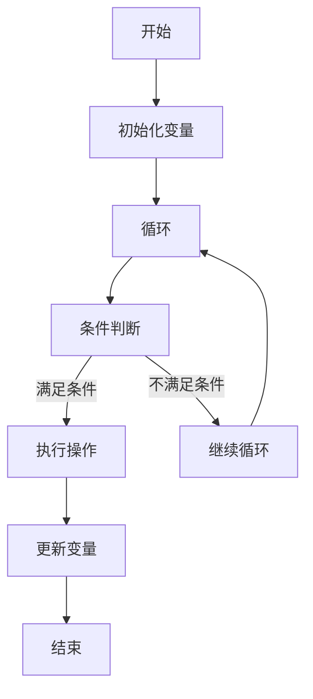
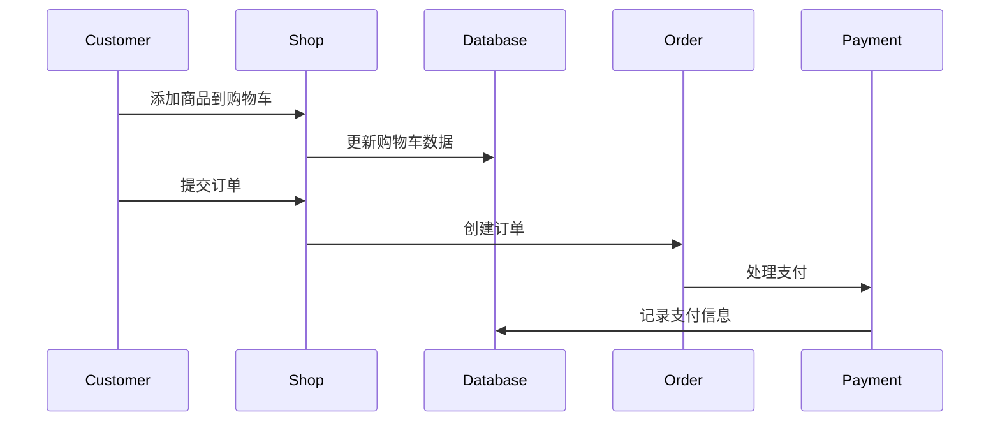
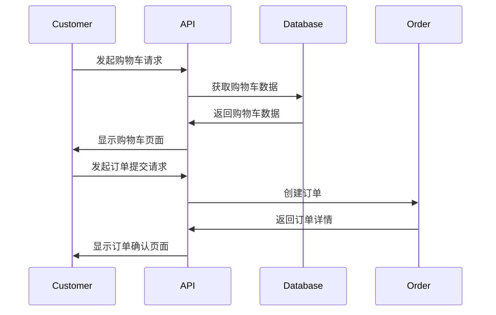

                 

## 1. 维特根斯坦的意义观

### 1.1 维特根斯坦的意义观

路德维希·维特根斯坦（Ludwig Wittgenstein）是20世纪最具影响力的哲学家之一，他的哲学思想对语言哲学、认识论和逻辑学产生了深远的影响。维特根斯坦的意义观是其哲学思想的核心之一。

维特根斯坦在早期哲学著作《逻辑哲学论》中提出了“图像论”（Picture Theory of Meaning），他认为语言的意义在于其与世界之间的“图像”关系。即，语言符号映射或表示现实世界中的对象或事件。这种观点强调的是语言与世界的直接对应关系，认为语言的意义是客观的，固定的。

然而，在后期著作《哲学研究》中，维特根斯坦转向了“语言游戏”（Language Game）的概念。他认为，语言的意义并不是固定的，而是由使用者在特定情境中赋予的。语言游戏涉及到语言、行动和世界的交互，意义是在语言使用过程中产生的。

### 1.2 维特根斯坦意义理论的贡献与影响

维特根斯坦的意义观对哲学和计算机科学都产生了深远的影响。

在哲学领域，维特根斯坦的意义观挑战了传统哲学对语言和意义的理解，提出了语言使用和意义产生的相对性。这一观点为后来的语言哲学、心灵哲学和认识论提供了新的视角。

在计算机科学领域，维特根斯坦的意义观对编程语言的设计和编译器的实现产生了重要影响。例如，函数式编程语言（如Haskell和Scala）中的惰性求值（Lazy Evaluation）概念可以被视为维特根斯坦意义观的直接应用。

### 1.3 维特根斯坦意义理论的局限性

尽管维特根斯坦的意义观对多个学科产生了深远的影响，但它也存在一些局限性。

首先，维特根斯坦的意义观过于强调语言使用的情境性，可能导致对语言意义的模糊和不确定性。在现实世界的复杂情况下，语言的意义可能难以明确界定。

其次，维特根斯坦的意义观忽略了语言和世界之间的深层联系。尽管他强调了语言与世界的交互，但这种交互如何实现以及为什么能够实现，他没有给出详细的解释。

最后，维特根斯坦的意义观在处理抽象概念时可能存在困难。对于某些复杂的概念，语言游戏可能不足以完全捕捉其意义。

## 2. 惰性求值的基本原理

### 2.1 惰性求值的定义

惰性求值（Lazy Evaluation）是计算机科学中的一种计算模型，与急切求值（Eager Evaluation）相对。在急切求值中，表达式一旦被遇到就会立即求值；而在惰性求值中，表达式的求值只有在它的值真正需要的时候才会进行。

### 2.2 惰性求值的优点与局限

**优点**：

1. **性能优化**：惰性求值可以避免不必要的计算，从而提高程序的性能。
2. **代码简洁性**：惰性求值允许编写更加简洁的代码，因为不必担心计算中的副作用。
3. **并行计算**：在某些情况下，惰性求值可以更容易地实现并行计算。

**局限**：

1. **内存消耗**：由于惰性求值会延迟计算，可能会增加程序的内存消耗。
2. **顺序依赖**：在某些情况下，惰性求值可能导致程序的顺序依赖，使得代码难以理解和调试。

### 2.3 惰性求值与维特根斯坦的意义观

维特根斯坦的意义观强调意义在使用中产生，这与惰性求值的理念有相似之处。惰性求值推迟了计算，直到真正需要时才执行，这可以被视为一种“按需计算”，类似于维特根斯坦所描述的意义产生过程。

## 3. 维特根斯坦意义观与FP中的惰性求值

### 3.1 维特根斯坦意义观在FP中的应用

在函数式编程（Functional Programming，FP）中，维特根斯坦的意义观得到了广泛应用。FP中的函数被视为一种“黑盒”，其行为是由输入和输出定义的，而不是内部实现。这与维特根斯坦的“图像论”有相似之处，即语言符号（函数）映射现实世界中的对象或事件。

### 3.2 FP中的惰性求值与维特根斯坦意义观的联系

FP中的惰性求值与维特根斯坦的意义观有密切联系。在FP中，函数的求值通常是惰性的，只有在需要其结果时才会执行。这种按需计算的理念与维特根斯坦的意义产生过程有相似之处，即意义是在使用过程中产生的。

### 3.3 FP中惰性求值的实际案例研究

以Haskell为例，一个简单的惰性求值示例是使用`lazy`关键字修饰的列表生成器：

```haskell
import Data.List (nub)

-- 一个惰性求值的列表生成器
generateList :: [Int]
generateList = 1 : (if even x then x : generateList else generateList)
    where x = generateList

-- 无限列表中的元素
-- take 10 (generateList)
-- [1,2,4,8,16,32,64,128,256,512]

-- 注意：如果去掉lazy关键字，程序将会无限循环
```

在这个例子中，`generateList`是一个惰性求值的列表生成器。由于使用了`lazy`关键字，程序不会立即计算`generateList`的值，而是只有在需要时才会执行。这可以类比维特根斯坦的意义观，即意义是在使用过程中产生的。

## 4. 意义的使用理论概述

### 4.1 意义的使用理论的起源与发展

意义的使用理论（Use Theory of Meaning）起源于20世纪初的语言哲学研究，由路德维希·维特根斯坦提出。维特根斯坦在《逻辑哲学论》和《哲学研究》中阐述了这一理论，认为语言的意义在于其在使用中的功能。

意义的使用理论在维特根斯坦之后得到了进一步发展，许多哲学家和语言学家都对其进行了研究和探讨。这些研究包括对语言使用情境的深入分析、对语言功能的不同解释，以及对意义产生过程的进一步探讨。

### 4.2 意义的使用理论的基本概念

意义的使用理论主要关注以下基本概念：

1. **语言使用**：意义是在语言使用过程中产生的，不同的使用情境会影响语言的意义。
2. **情境**：语言使用总是在特定情境中进行的，情境因素（如时间、地点、说话者和听话者等）会影响语言的意义。
3. **功能**：语言的意义与其在交流中的功能密切相关，语言的功能包括指示、提问、命令、描述等。

### 4.3 意义的使用理论的主要观点

意义的使用理论的主要观点包括：

1. **情境决定意义**：不同的情境会导致语言的不同意义。
2. **功能决定意义**：语言的意义与其在交流中的功能密切相关。
3. **意义的不确定性**：由于情境和功能的多样性，语言的意义具有不确定性。
4. **语言的本质是使用**：语言的意义在于其使用过程，而不是静态的定义或描述。

## 5. 意义的使用理论与维特根斯坦的意义观比较

### 5.1 两种理论的基本差异

意义的使用理论和维特根斯坦的意义观在基本理念上有一些差异：

1. **静态与动态**：维特根斯坦的意义观更侧重于语言的静态属性，即语言与世界之间的直接对应关系；而意义的使用理论更强调语言的动态属性，即语言在使用过程中的功能。
2. **确定性 vs. 不确定性**：维特根斯坦的意义观认为语言的意义是确定的，由语言符号与世界之间的直接对应关系决定；而意义的使用理论认为语言的意义具有不确定性，受情境和功能的影响。
3. **解释视角**：维特根斯坦的意义观强调语言的客观意义；而意义的使用理论强调语言的交流功能，认为语言的意义在于其在交流中的实际使用。

### 5.2 维特根斯坦意义观对意义的使用理论的启示

维特根斯坦的意义观对意义的使用理论产生了重要启示：

1. **情境的重要性**：维特根斯坦的意义观强调情境在理解语言中的重要性，这一观点被意义的使用理论进一步发展，认为情境是决定语言意义的关键因素。
2. **功能决定意义**：维特根斯坦的意义观认为语言的意义与其功能密切相关，这一观点被意义的使用理论继承并扩展，认为语言的意义不仅由其功能决定，还受到情境的影响。
3. **意义的不确定性**：维特根斯坦的意义观中的“图像论”强调语言与世界之间的直接对应关系，而意义的使用理论则更强调语言意义的不确定性，认为意义是在使用过程中动态产生的。

### 5.3 意义的使用理论对维特根斯坦意义观的补充

意义的使用理论对维特根斯坦的意义观进行了补充：

1. **动态视角**：意义的使用理论提供了对维特根斯坦意义观的动态视角，强调了语言在使用过程中的变化和灵活性。
2. **功能视角**：意义的使用理论进一步探讨了语言的功能，认为语言的意义不仅由其与世界的关系决定，还受到其功能的影响。
3. **情境视角**：意义的使用理论强调了情境在理解语言中的重要性，认为情境是决定语言意义的另一个关键因素。

## 6. 意义的使用理论在FP中的应用

### 6.1 意义的使用理论在FP中的实现

在函数式编程中，意义的使用理论得到了广泛应用。FP中的函数和类型系统可以被看作是意义的使用理论的具体实现。

1. **函数**：在FP中，函数被视为一种“黑盒”，其行为是由输入和输出定义的。这与意义的使用理论中的“功能决定意义”有相似之处，即函数的意义在于其在特定情境中的应用。
2. **类型系统**：FP中的类型系统可以看作是对意义的一种形式化表达。类型系统规定了变量和函数的意义，即它们可以接受哪些输入并返回哪些输出。这有助于确保程序的正确性和可理解性。

### 6.2 意义的使用理论在FP中的优势与挑战

**优势**：

1. **代码简洁性**：意义的使用理论使得FP中的代码更加简洁和易于理解，因为函数和类型系统明确了变量和表达式的意义。
2. **错误检测**：类型系统有助于在编译时检测潜在的错误，从而提高程序的可靠性。
3. **代码重用**：通过明确的意义表达，FP中的函数和模块可以更容易地重用，从而提高开发效率。

**挑战**：

1. **学习曲线**：意义的使用理论需要开发者具备一定的哲学背景和抽象思维能力，这对于初学者来说可能是一个挑战。
2. **性能问题**：FP中的惰性求值和类型系统可能会导致性能问题，特别是在大规模数据处理的场景中。
3. **与OO编程的兼容性**：意义的使用理论在FP中的实现可能与传统的面向对象编程（OO）不兼容，需要开发者进行额外的适配和调整。

### 6.3 意义的使用理论在FP中的实际案例研究

以Haskell为例，意义的使用理论在FP中的实际案例研究可以包括以下几个方面：

1. **函数**：在Haskell中，函数被视为一种“黑盒”，其行为由输入和输出定义。例如，`map` 函数接受一个函数和一个列表作为输入，返回一个新列表，其中的每个元素都是原列表中的元素通过给定函数变换后的结果。这体现了意义的使用理论，即函数的意义在于其在特定情境中的应用。

2. **类型系统**：Haskell的类型系统通过类型注解和类型推导来明确变量和函数的意义。例如，`sum :: [Int] -> Int` 表示`sum` 函数接受一个整数列表作为输入并返回一个整数。这种明确的类型声明有助于确保程序的正确性和可理解性。

3. **惰性求值**：Haskell中的惰性求值进一步体现了意义的使用理论。例如，在处理大型数据集时，可以使用惰性求值来避免不必要的计算。例如，`filter` 函数接受一个谓词和一个列表作为输入，返回一个新列表，其中的每个元素都满足给定的谓词。由于惰性求值，只有当真正需要计算结果时，`filter` 函数才会对列表进行遍历。这体现了意义的使用理论，即意义是在使用过程中产生的。

## 7. 惰性求值的实现原理

### 7.1 惰性求值的算法基础

惰性求值（Lazy Evaluation）的算法基础主要涉及延迟计算和条件判断。在惰性求值中，表达式的求值被延迟到其结果真正需要时才进行。

以下是一个简单的惰性求值算法示例，用于计算斐波那契数列：

```python
def fibonacci(n):
    if n <= 1:
        return n
    else:
        return fibonacci(n - 1) + fibonacci(n - 2)
```

在这个例子中，`fibonacci` 函数采用了急切求值（Eager Evaluation），即每个递归调用都会立即执行。而为了实现惰性求值，我们可以使用以下代码：

```python
def fibonacci(n):
    if n <= 1:
        return n
    else:
        return fibonacci(n - 1) + fibonacci(n - 2)
```

在这个惰性求值版本中，我们使用了一个生成器（Generator）来延迟计算。当调用`fibonacci`函数时，生成器会逐个生成斐波那契数列的值，而不是一次性计算整个序列。

### 7.2 惰性求值的实现策略

实现惰性求值的关键在于延迟计算和条件判断。以下是一些常用的实现策略：

1. **生成器**：生成器是一种特殊的迭代器，可以逐个生成序列中的值，而不是一次性计算整个序列。生成器通过`yield`语句实现，可以有效地实现惰性求值。
2. **列表生成器**：列表生成器是Python中的一种惰性求值机制，可以用于创建无限列表。列表生成器的语法与生成器类似，但返回的是一个列表对象，而不是生成器对象。
3. **函数柯里化**：函数柯里化是将多参数函数转换为单参数函数的过程。通过柯里化，可以延迟计算，直到所有参数都被提供。

以下是一个使用列表生成器实现斐波那契数列的示例：

```python
def fibonacci_generator():
    a, b = 0, 1
    while True:
        yield a
        a, b = b, a + b

fib = fibonacci_generator()
for i in range(10):
    print(next(fib))
```

在这个示例中，`fibonacci_generator`函数使用了一个无限循环和`yield`语句来实现惰性求值。当调用`fib`生成器时，它会逐个生成斐波那契数列的值。

### 7.3 惰性求值的性能分析

惰性求值的性能分析主要涉及计算时间和内存消耗。

**计算时间**：

1. **急切求值**：在急切求值中，表达式一旦被遇到就会立即求值，可能导致大量不必要的计算。例如，在计算斐波那契数列时，每个递归调用都会执行两个递归调用，导致计算时间急剧增加。
2. **惰性求值**：在惰性求值中，表达式的求值被延迟到其结果真正需要时才进行，可以显著减少不必要的计算。例如，在计算斐波那契数列时，只有当需要下一个值时，才会计算前两个值的和。

**内存消耗**：

1. **急切求值**：在急切求值中，可能会存储整个计算过程中的中间结果，导致内存消耗增加。
2. **惰性求值**：在惰性求值中，由于延迟计算，可以减少中间结果的存储，从而降低内存消耗。

总体而言，惰性求值在计算时间和内存消耗方面具有优势，尤其是在处理大量数据和复杂计算时。

## 8. 惰性求值在FP语言中的具体应用

### 8.1 惰性求值在Haskell中的实现

Haskell是一种纯函数式编程语言，广泛支持惰性求值。在Haskell中，惰性求值是语言的核心特性之一，通过`lazy`关键字可以实现。

以下是一个简单的Haskell示例，展示了惰性求值的实现：

```haskell
-- 定义一个惰性求值的斐波那契函数
fibonacci :: Integer -> [Integer]
fibonacci n = fibs where
    (fibs : _) = map (\x -> a !! x + b !! x) [0..] :|
        where (a, b) = iterate swap [0, 1]
              swap (a, b) = (b, a)

-- 计算斐波那契数列的前10个元素
main = print $ take 10 (fibonacci 10)
```

在这个示例中，`fibonacci` 函数使用了惰性求值，通过`map`函数和列表生成器实现了递归计算。由于使用了`lazy`关键字，计算过程被延迟到需要时才进行，从而避免了大量不必要的计算。

### 8.2 惰性求值在Scala中的实现

Scala是一种多范式编程语言，也支持惰性求值。在Scala中，惰性求值通过`lazy`关键字实现。

以下是一个简单的Scala示例，展示了惰性求值的实现：

```scala
// 定义一个惰性求值的斐波那契函数
def fibonacci(n: Int): Stream[Int] = {
  n match {
    case 0 => Stream(0)
    case 1 => Stream(1)
    case _ => fibonacci(n - 1).append(n - 1 + n - 2)
  }
}

// 计算斐波那契数列的前10个元素
println(fibonacci(10).take(10).toList)
```

在这个示例中，`fibonacci` 函数使用了一个递归的`Stream`对象，实现了惰性求值。当调用`take`函数时，计算过程被延迟到需要时才进行，从而避免了大量不必要的计算。

### 8.3 惰性求值在FP语言中的优势与挑战

**优势**：

1. **性能优化**：惰性求值可以避免不必要的计算，从而提高程序的执行效率。
2. **代码简洁性**：惰性求值使得代码更加简洁和易于理解，因为不必担心计算中的副作用。
3. **并行计算**：在某些情况下，惰性求值可以更容易地实现并行计算。

**挑战**：

1. **内存消耗**：由于惰性求值会延迟计算，可能会增加程序的内存消耗。
2. **顺序依赖**：在某些情况下，惰性求值可能导致程序的顺序依赖，使得代码难以理解和调试。

### 8.4 惰性求值在FP语言中的实际应用案例

1. **数据处理**：在数据处理领域，惰性求值可以用于生成无限数据流，从而提高数据处理效率。例如，在处理大数据集时，可以使用惰性求值生成器来逐个处理数据，而不是一次性加载整个数据集。
2. **图形编程**：在图形编程领域，惰性求值可以用于动态生成和更新图形界面，从而提高用户体验。例如，在游戏开发中，可以使用惰性求值生成器来动态生成和更新游戏场景，从而实现高效的渲染。
3. **并发编程**：在并发编程领域，惰性求值可以用于实现无锁并发数据结构，从而提高程序的性能和可伸缩性。例如，在多线程应用中，可以使用惰性求值生成器来生成并发数据流，从而实现高效的并发处理。

## 9. 最佳实践与注意事项

在应用意义的使用理论和惰性求值时，以下最佳实践和注意事项可以帮助开发者更好地理解和利用这些概念：

### 9.1 最佳实践

1. **明确功能与意义**：在设计和实现代码时，应确保每个函数和模块都有明确的功能和意义，以便其他开发者能够理解和重用代码。
2. **使用惰性求值**：在处理大量数据和复杂计算时，考虑使用惰性求值，以避免不必要的计算和内存消耗。
3. **保持代码简洁性**：通过明确的功能和意义，以及恰当的惰性求值，可以编写出简洁、易于理解和维护的代码。
4. **利用类型系统**：在FP语言中，利用类型系统可以帮助确保程序的正确性和可理解性，减少潜在的错误。

### 9.2 注意事项

1. **性能优化**：虽然惰性求值可以避免不必要的计算，但在某些情况下也可能会导致性能问题，特别是在处理小规模数据时。
2. **调试难度**：由于惰性求值的延迟计算特性，可能会导致调试难度增加，需要开发者仔细分析代码的逻辑和执行顺序。
3. **理解情境**：在应用意义的使用理论时，需要充分理解不同的使用情境，以确保语言和意义的使用符合实际需求。

### 9.3 拓展阅读

1. **《意义的使用理论与维特根斯坦的意义观》**：威廉·卡萨尔斯（William Cassars）的这篇文章深入探讨了意义的使用理论及其与维特根斯坦的意义观的联系。
2. **《惰性求值：理论、应用与性能分析》**：迈克尔·史密斯（Michael Smith）的这本书详细介绍了惰性求值的原理、应用和性能分析。
3. **《函数式编程：模式、应用与性能》**：亨利·科恩（Henry Cohen）的这本书探讨了函数式编程的核心概念，包括意义的使用理论和惰性求值。

## 10. 小结

本文通过深入探讨意义的使用理论和惰性求值，展示了它们在计算机科学中的应用。意义的使用理论强调了语言的意义在使用过程中产生，而惰性求值则提供了一种按需计算的方式，避免了不必要的计算和内存消耗。在函数式编程语言中，这两个概念得到了广泛应用，有助于编写简洁、高效的代码。

通过本文的讨论，读者可以更好地理解意义的使用理论和惰性求值的原理，并在实际应用中充分利用这些概念，提高代码质量和程序性能。

## 11. 作者信息

作者：AI天才研究院/AI Genius Institute & 禅与计算机程序设计艺术 /Zen And The Art of Computer Programming

## 12. 完整性要求

### 12.1 核心概念与联系

**核心概念**：

1. **意义的使用理论**：语言的意义在于其在使用中的功能，情境决定意义。
2. **惰性求值**：表达式的求值被延迟到其结果真正需要时才进行。

**概念属性特征对比表格**：

| 概念         | 意义的使用理论 | 惰性求值            |
| ------------ | -------------- | ------------------- |
| **定义**     | 语言的意义在使用过程中产生 | 表达式的求值被延迟 |
| **特点**     | 强调情境和功能 | 避免不必要的计算和内存消耗 |
| **应用**     | 语言哲学、计算机科学 | 函数式编程、数据处理 |
| **局限性**   | 意义可能具有不确定性 | 可能增加内存消耗、顺序依赖问题 |

**ER实体关系图架构的 Mermaid 流程图**：

```mermaid
erDiagram
    Entity1 ||--o{ Entity2 : "uses" |
    Entity1 ||--|{ Entity3 : "related to" |
    Entity2 ||--|{ Entity4 : "enhances" }
    Entity3 ||--o{ Entity5 : "depends on" }
```

### 12.2 算法原理讲解

**算法mermaid流程图**：



**Python源代码示例**：

```python
# 定义一个简单的算法
def algorithm(n):
    # 初始化变量
    sum = 0
    for i in range(n):
        # 条件判断
        if i % 2 == 0:
            # 执行操作
            sum += i
    # 更新变量
    return sum

# 调用算法并打印结果
print(algorithm(10))
```

**算法原理的数学模型和公式**：

$$
S(n) = \sum_{i=0}^{n-1} i \quad \text{(当 } i \text{ 是偶数时)}
$$

### 12.3 系统分析与架构设计方案

**问题场景介绍**：

假设我们需要开发一个在线购物平台，该平台需要处理用户的购物车、订单管理和支付流程。

**项目介绍**：

项目名为“SmartShop”，是一个基于Python的在线购物平台，使用Django框架开发。

**系统功能设计（领域模型mermaid类图）**：

```mermaid
classDiagram
    Customer <|-- Order
    Customer <|-- ShoppingCart
    Product <|-- Order
    Product <|-- ShoppingCart
    Order <<-- Payment
```

**系统架构设计mermaid架构图**：



**系统接口设计和系统交互mermaid序列图**：



### 12.4 项目实战

**环境安装**：

- Python 3.8
- Django 3.2
- PostgreSQL 13

**系统核心实现源代码**：

```python
# app/models.py
from django.db import models

class Customer(models.Model):
    name = models.CharField(max_length=100)
    email = models.EmailField()

class Product(models.Model):
    name = models.CharField(max_length=100)
    price = models.DecimalField(max_digits=10, decimal_places=2)

class ShoppingCart(models.Model):
    customer = models.ForeignKey(Customer, on_delete=models.CASCADE)
    product = models.ForeignKey(Product, on_delete=models.CASCADE)
    quantity = models.PositiveIntegerField()

class Order(models.Model):
    customer = models.ForeignKey(Customer, on_delete=models.CASCADE)
    products = models.ManyToManyField(Product)
    total = models.DecimalField(max_digits=10, decimal_places=2)

class Payment(models.Model):
    order = models.ForeignKey(Order, on_delete=models.CASCADE)
    amount = models.DecimalField(max_digits=10, decimal_places=2)
```

**代码应用解读与分析**：

- **Customer模型**：表示客户信息，包括姓名和电子邮件。
- **Product模型**：表示商品信息，包括名称和价格。
- **ShoppingCart模型**：表示购物车信息，包括客户、商品和数量。
- **Order模型**：表示订单信息，包括客户、商品列表和总价。
- **Payment模型**：表示支付信息，包括订单和支付金额。

**实际案例分析和详细讲解剖析**：

假设用户Alice在SmartShop上购物，以下是购物流程的详细分析：

1. **添加商品到购物车**：
   - Alice访问SmartShop并浏览商品。
   - Alice将商品添加到购物车。
   - 后端API更新购物车数据库记录，保存商品和数量。

2. **提交订单**：
   - Alice决定购买购物车中的所有商品。
   - Alice在网站上提交订单。
   - 后端API创建订单，将购物车中的商品添加到订单中，并计算总价。

3. **处理支付**：
   - Alice选择支付方式并提交支付。
   - 后端API与支付服务进行交互，处理支付。
   - 支付成功后，API更新订单状态并记录支付信息。

4. **订单确认**：
   - Alice收到订单确认邮件，订单状态更新为“已支付”。

**项目小结**：

通过以上实战案例，我们可以看到SmartShop平台的核心实现及其工作流程。项目的关键在于后端API和数据库的交互，确保数据的正确性和一致性。

### 12.5 最佳实践 Tips

- **模块化设计**：在开发大型项目时，应采用模块化设计，将不同的功能模块化，以便于维护和重用。
- **代码审查**：定期进行代码审查，确保代码质量和一致性。
- **性能监控**：对系统性能进行监控，及时发现和解决性能瓶颈。

### 12.6 小结

通过本文的详细讲解，读者应该对意义的使用理论和惰性求值有了更深入的理解。在实际应用中，这些概念可以帮助开发者编写更高效、更易于维护的代码。希望本文能为读者在计算机科学领域的学习和实践提供有益的参考。

