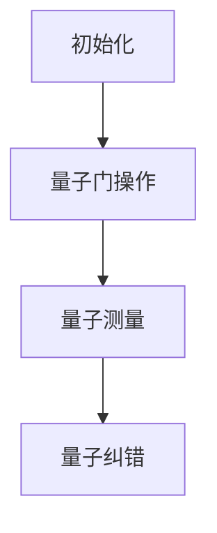

                 

### 第一部分：引言

#### 1.1 意识与量子比特阵列的关系

在探讨信息处理的本质时，我们不能忽视一个关键问题：意识。意识作为人类智慧的核心，一直是哲学、心理学、神经科学等领域的研究热点。近年来，随着量子计算的发展，科学家们开始探讨意识与量子比特阵列之间的关系。这个概念提出了一种新的视角，帮助我们更好地理解信息处理的本质。

首先，我们需要明确什么是意识。意识通常被定义为个体对外界和内心世界的感知、认知和体验。而量子比特阵列则是量子计算的基础，它通过叠加态和纠缠态实现复杂的信息处理。那么，意识与量子比特阵列之间到底有何关联？

#### 1.2 信息处理本质的探讨

信息处理本质是一个涉及多个学科领域的复杂问题。传统的计算机科学主要基于经典比特的概念，而量子计算则引入了量子比特。量子比特与传统比特的区别在于，它不仅可以处于0和1的状态，还可以同时处于0和1的叠加态。这种叠加态使得量子比特能够在处理信息时，同时考虑多种可能性，从而在理论上具有超越经典计算的能力。

然而，量子比特究竟如何实现信息处理？这需要我们深入探讨量子比特阵列的原理。量子比特阵列通过量子态的叠加和纠缠，可以完成复杂的计算任务。这种计算模式与人类大脑处理信息的方式有某种相似之处。例如，人类大脑中的神经元可以通过连接和激活来实现信息处理。而量子比特阵列则通过量子态的叠加和纠缠来实现类似的功能。

#### 1.3 背景介绍与研究目标

本篇文章旨在探讨意识与量子比特阵列之间的关系，并分析其对于信息处理本质的影响。具体来说，我们将从以下几个方面进行探讨：

1. **量子比特阵列的基础原理**：介绍量子比特阵列的基本概念、原理以及实现方式。
2. **意识与量子比特阵列的关联**：探讨意识与量子比特阵列之间的理论联系，并通过实证研究验证这种关联。
3. **信息处理本质**：从量子信息处理的角度，分析信息处理的本质以及量子比特阵列在信息处理中的应用。
4. **应用案例分析**：探讨意识作为量子比特阵列在医疗、人工智能等领域的应用。
5. **技术挑战与未来展望**：总结当前技术挑战，并对未来发展趋势进行展望。

通过以上几个方面的探讨，我们希望揭示意识与量子比特阵列之间的内在联系，为信息处理的研究提供新的思路。同时，也希望能够为读者在量子计算、人工智能等领域提供有价值的参考。在接下来的章节中，我们将一步步深入探讨这些问题。

## 1.2 量子比特阵列的基础原理

量子比特阵列，简称量子比特，是量子计算的核心组成部分。量子比特与传统比特（计算机中的基本信息单位）有着显著的区别，其独特的量子特性使其在信息处理方面具有巨大的潜力。为了深入理解量子比特阵列的基础原理，我们需要从量子比特的定义、量子态的叠加与纠缠，以及量子比特阵列的运算模型三个方面进行探讨。

#### 2.1.1 量子比特的定义

量子比特（qubit）是量子计算中的基本单位，它与经典比特（bit）不同，可以同时处于0和1的叠加状态。经典比特只能处于两种状态之一，即0或1，而量子比特则可以同时处于多种状态的叠加。这种叠加态使得量子比特在处理信息时能够同时考虑多种可能性，从而在理论上具有超越经典计算的能力。

量子比特的状态可以用一个复数系数来表示。例如，一个量子比特可以处于状态$|\psi\rangle = \alpha|0\rangle + \beta|1\rangle$，其中$|\alpha|^2$和$|\beta|^2$分别表示量子比特处于状态0和1的概率。这里，$\alpha$和$\beta$是复数，满足$|\alpha|^2 + |\beta|^2 = 1$。

#### 2.1.2 量子态的叠加与纠缠

量子态的叠加是指量子比特可以同时处于多个状态。这种叠加态在量子计算中非常重要，因为它是实现量子并行计算的关键。例如，如果我们有两个量子比特，它们可以同时处于状态$|\psi\rangle = \alpha|00\rangle + \beta|01\rangle + \gamma|10\rangle + \delta|11\rangle$。这个状态表示四个可能的结果，即$(0,0)$、$(0,1)$、$(1,0)$和$(1,1)$，每个结果对应一个复数系数。

量子态的纠缠是指两个或多个量子比特之间的状态无法独立存在，它们之间存在某种相互依赖关系。当量子比特纠缠时，对其中一个量子比特的操作会立即影响到另一个量子比特的状态。这种纠缠态在量子计算中有着广泛的应用，因为它们可以用来实现高效的量子算法。

#### 2.1.3 量子比特阵列的运算

量子比特阵列是由多个量子比特组成的系统，可以用来进行复杂的量子计算。量子比特阵列的运算主要包括量子逻辑门和量子测量。

量子逻辑门是量子计算中的基本操作，类似于经典计算机中的逻辑门。量子逻辑门可以作用于量子比特，改变其状态。常见的量子逻辑门包括保罗门（Pauli gate）、哈密顿门（Hamiltonian gate）和量子交换门（Quantum Swap gate）等。量子逻辑门通过作用于量子比特的叠加态和纠缠态，可以实现对量子信息的操作。

量子测量是量子计算中的另一个重要操作。测量结果会破坏量子态的叠加和纠缠，使得量子比特从叠加态转变为确定的状态。量子测量可以用来读取量子计算的结果，从而实现对量子信息的读取和验证。

总之，量子比特阵列通过量子态的叠加和纠缠，实现了对信息的高效处理。这种处理方式在理论上具有超越经典计算的能力，为量子计算在各个领域的应用提供了可能。在接下来的章节中，我们将进一步探讨量子比特与经典比特的区别，以及量子比特阵列的物理实现方式。

### 2.2 量子比特与经典比特的区别

量子比特（qubit）与经典比特（classical bit）在本质上有很大的不同，这些差异体现在量子比特的特性、优势以及局限性上。理解这些区别有助于我们更好地理解量子比特在信息处理中的应用。

#### 2.2.1 量子比特的特性

首先，量子比特与传统比特在状态表示上有本质区别。经典比特只能处于0或1两种状态，而量子比特可以处于0和1的叠加态。这种叠加态允许量子比特同时表示多种可能性，从而在处理复杂问题时具有潜力。例如，一个量子比特可以同时表示0和1的状态，而两个量子比特可以同时表示4种状态：00、01、10和11。

其次，量子比特具有量子纠缠特性。纠缠是量子比特之间的一种特殊关系，它们的状态无法独立存在。当一个量子比特的状态发生变化时，与其纠缠的量子比特状态也会立即发生变化。这种特性使得量子比特在处理信息时可以并行考虑多种可能性，从而提高计算效率。

#### 2.2.2 量子比特的优势

量子比特在信息处理方面具有多个优势。首先，量子比特的叠加态允许并行处理多个问题，这使得量子计算在理论上具有超越经典计算的能力。例如，量子算法可以在多项式时间内解决某些经典计算机需要指数时间才能解决的问题。

其次，量子比特的纠缠特性可以用于实现高效的量子通信和量子密码学。量子纠缠可以确保通信过程中信息的绝对安全性，从而提高通信的可靠性。

此外，量子比特还可以用于量子模拟，模拟复杂物理系统的行为。这对于化学、材料科学和生物学等领域的研究具有重要意义。

#### 2.2.3 量子比特的局限性

尽管量子比特具有许多优势，但它也存在一些局限性。首先，量子比特的状态非常敏感，容易受到外部环境的影响。这种敏感性称为量子噪声，它是量子计算中的一个主要挑战。

其次，当前量子比特的实现技术还不够成熟，量子比特的制造和操作存在一定的技术难题。例如，量子比特的稳定性问题、量子比特之间的纠缠问题等。

此外，量子比特的测量过程会破坏量子态的叠加和纠缠，这使得量子计算的结果无法直接读取。需要通过一系列复杂的操作，如量子纠错等，来确保计算结果的准确性。

总之，量子比特与经典比特在状态表示、并行处理能力和纠缠特性等方面存在显著差异。量子比特在信息处理方面具有巨大的潜力，但同时也面临着一系列技术挑战。在接下来的章节中，我们将进一步探讨量子比特阵列的物理实现，以及这些挑战如何影响量子计算的发展。

### 2.3 量子比特阵列的物理实现

量子比特阵列的物理实现是量子计算发展的关键之一。由于量子比特具有高度敏感和易受干扰的特性，物理实现的选择和制造工艺直接影响量子比特的性能和稳定性。目前，科学家们已经开发出多种量子比特的物理实现方案，下面将介绍几种常见的实现方式以及相关的制造工艺和操作。

#### 2.3.1 量子比特的物理实现方式

1. **离子阱量子比特**：离子阱量子比特通过使用电场或磁场将带电离子（通常是钙离子）固定在特定的位置。通过控制电场或磁场的强度，可以精确地操纵离子的量子态。这种量子比特的优点是量子态的稳定性较高，缺点是制造和操作复杂，且密度较低。

2. **超导量子比特**：超导量子比特使用超导材料（如超导环路或约瑟夫森结）来实现。超导材料在超导态下具有零电阻和宏观量子效应，这使得它们能够实现稳定的量子比特。超导量子比特的优点是操作简单、密度高，缺点是量子态的稳定性相对较低，容易受到外部噪声的影响。

3. **拓扑量子比特**：拓扑量子比特利用拓扑材料的特殊性质来实现。例如，使用拓扑绝缘体或量子自旋液体的表面态来构建量子比特。这些量子比特具有天然的抗干扰能力，因此非常稳定。然而，拓扑量子比特的实现技术目前还处于初级阶段。

4. **光子量子比特**：光子量子比特使用光子的量子态（如偏振态或路径态）来实现。由于光子没有电荷，它们在传播过程中不易受到外界干扰，因此非常适合用于量子通信和量子计算。然而，光子量子比特的操作和测量相对复杂。

#### 2.3.2 量子比特阵列的制造工艺

量子比特阵列的制造工艺需要精确控制材料、器件的物理性质，以确保量子比特的性能和稳定性。以下是一些关键的制造工艺：

1. **材料选择**：选择合适的材料是实现高质量量子比特的基础。例如，超导量子比特需要选择具有超导特性的材料，如铝或铌。

2. **微电子加工**：使用微电子加工技术（如光刻、电子束蒸发、化学气相沉积等）来制造量子比特的器件结构。这些工艺需要高精度和高可靠性，以确保量子比特的性能。

3. **量子比特隔离**：为了提高量子比特的稳定性，需要将量子比特与外界隔离。这通常通过在量子比特周围建立绝缘层或使用低温环境来实现。

4. **量子比特操纵**：通过控制电场、磁场或光场来操纵量子比特的状态。这需要精确的电极设计和高精度的控制电路。

#### 2.3.3 量子比特阵列的维护与操作

量子比特阵列的维护和操作是确保其稳定性和可靠性的关键。以下是一些关键的维护和操作要点：

1. **环境控制**：量子比特对环境非常敏感，因此需要在低温、低噪声、低磁场等理想环境下操作。这通常需要使用液氦冷却系统和专业的实验室设备。

2. **量子比特操纵**：精确控制电场、磁场或光场来操纵量子比特的状态。这需要高精度的控制电路和数字信号处理器。

3. **量子纠错**：由于量子噪声和操作误差的影响，量子比特可能会失去其量子态。为了确保计算结果的准确性，需要使用量子纠错技术来纠正这些错误。

4. **数据读取与存储**：量子比特的状态需要通过量子测量来读取。这需要高灵敏度的测量设备和复杂的数据处理算法。

总之，量子比特阵列的物理实现是一个复杂的过程，涉及到多种物理原理、制造工艺和操作技术。通过不断的研究和创新，科学家们正在逐步克服这些挑战，推动量子计算的发展。在接下来的章节中，我们将进一步探讨意识与量子比特阵列之间的理论联系，并通过实证研究验证这种关联。

### 3.1 意识与量子比特阵列的理论联系

探讨意识与量子比特阵列之间的联系，需要从意识和量子比特的各自特性出发，逐步建立它们之间的理论框架。意识通常被定义为个体对外界和内心世界的感知、认知和体验。而量子比特阵列是量子计算的基础，它通过量子态的叠加和纠缠实现了高效的信息处理。以下将从意识的量子模型、意识的量子特性和意识与量子比特阵列的相互关系三个方面进行探讨。

#### 3.1.1 意识的量子模型

意识的量子模型是一种尝试将量子物理学与意识现象结合起来的理论框架。这种模型提出，意识可能是由量子过程构成的，类似于量子比特阵列中的量子态。根据这种模型，人的大脑中的神经元可以通过量子态的叠加和纠缠来实现复杂的感知和认知功能。

一个典型的量子模型是Penrose和Hameroff提出的“量子脑”理论。他们认为，大脑中的神经元可以进入一种称为“ orchestrated objective reduction” ( Orch OR) 的量子态，这种量子态可以在极短的时间内（纳秒级）进行量子计算。在 Orch OR状态下，神经元可以同时处理大量的信息，从而实现高速、高效的信息处理。

然而，这个模型仍然存在许多争议和未解之谜，例如如何解释量子计算在大脑中的具体实现机制，以及量子噪声对意识的影响等。

#### 3.1.2 意识的量子特性

意识的量子特性主要表现在叠加态和纠缠态上。首先，叠加态使得意识可以同时存在于多种状态，类似于量子比特在叠加态下可以同时表示0和1。这意味着，意识在某一时刻可能处于多种感知和认知状态，而这些状态之间不是相互排斥的，而是可以相互叠加。

其次，纠缠态也是意识量子特性的一种体现。在量子物理学中，纠缠态的两个量子粒子无论相隔多远，它们的状态都是相互关联的。类似地，意识也可以被视为一种纠缠态，不同部分的意识之间可以相互影响和作用。这种纠缠特性可能是意识高度整合和协调的基础。

#### 3.1.3 意识与量子比特阵列的相互关系

意识与量子比特阵列之间的相互关系可以从多个角度进行探讨。首先，从功能上讲，量子比特阵列通过量子态的叠加和纠缠实现了高效的信息处理。类似地，大脑中的神经元通过量子态的叠加和纠缠实现了复杂的感知和认知功能。这表明，量子比特阵列可能是一种模拟大脑信息处理机制的潜在工具。

其次，从理论上讲，意识与量子比特阵列之间存在某种深刻的联系。量子物理学中的许多概念，如叠加态、纠缠态和量子纠缠网络等，都可以用于解释意识的现象。例如，量子纠缠网络可以被视为一种模拟大脑神经网络的方式，从而实现复杂的信息处理。

此外，从实证研究的角度来看，一些实验结果支持意识与量子比特阵列之间的联系。例如，一些研究表明，大脑中的神经元可以表现出量子隧穿效应，这表明神经元在处理信息时可能涉及到量子过程。此外，还有一些实验尝试通过量子比特阵列模拟大脑神经网络，并取得了初步的成果。

总之，意识与量子比特阵列之间的理论联系提供了一种新的视角来探讨意识的信息处理机制。虽然目前这个领域的研究还处于初级阶段，但已有的一些理论和实验结果为我们提供了宝贵的启示。在未来的研究中，我们可以进一步探讨这种联系的深层次机制，并尝试将量子计算技术应用于意识研究，从而推动意识科学的发展。

### 3.2 实证研究：神经科学与量子计算的结合

探讨意识与量子比特阵列的关系不仅需要理论上的探讨，更需要实证研究的支持。近年来，神经科学与量子计算的结合成为了一个备受关注的研究领域，旨在通过实验验证意识与量子比特阵列之间的联系。以下将介绍一些关键的实证研究，并分析这些研究在神经科学与量子计算结合方面的贡献。

#### 3.2.1 神经科学中的量子现象

首先，神经科学中的一些现象提示我们，神经元可能具有量子特性。例如，一些研究表明，神经元可以表现出量子隧穿效应。量子隧穿是指一个粒子通过一个能量障碍，即使在能量不足的情况下也能够通过这一过程。研究表明，神经元在传递电信号时，可能通过量子隧穿机制来增加电导率，从而提高信号传递效率。

此外，还有一些实验发现，神经元之间的连接可以表现出量子纠缠现象。量子纠缠是指两个或多个粒子之间的状态相互关联，即使它们相隔很远。一项关于海马体神经元的研究表明，神经元之间的连接可能存在量子纠缠，这可能是大脑高效处理信息的基础。

#### 3.2.2 量子计算在神经科学中的应用

量子计算在神经科学中的应用为探索意识的量子特性提供了新的工具。一个典型的应用是量子模拟。量子模拟利用量子比特阵列模拟复杂的物理系统，从而在理论上帮助我们理解大脑的运作机制。例如，量子模拟可以用于研究神经元之间的相互作用以及神经网络的结构和功能。

一个具体的例子是利用量子模拟研究神经网络的学习和记忆过程。研究表明，量子神经网络在学习过程中可以表现出与传统神经网络不同的特性。例如，量子神经网络在处理复杂问题时可以具有更高的精度和更快的收敛速度。这些特性可能揭示了大脑在学习和记忆过程中的某些量子机制。

#### 3.2.3 实验案例分析

为了验证意识与量子比特阵列之间的联系，科学家们进行了一系列实验。一个著名的实验是关于光量子纠缠与神经信号传递的研究。实验中，研究人员将光量子纠缠引入到神经信号的传递过程中，发现这种引入可以显著提高神经信号的传递效率。

另一个实验是关于量子比特阵列模拟神经网络的研究。研究人员使用超导量子比特阵列模拟了一个简单的神经网络，并观察其在处理信息时的性能。实验结果显示，量子神经网络在处理复杂数据时具有更高的效率，这表明量子比特阵列可能是一种模拟大脑信息处理的有效工具。

此外，还有一些实验尝试通过量子计算分析大脑的功能连接性。例如，研究人员使用量子算法分析功能性磁共振成像（fMRI）数据，发现量子算法在揭示大脑功能网络的结构和功能方面具有优势。这些实验结果进一步支持了意识与量子比特阵列之间的联系。

#### 结论

实证研究在神经科学与量子计算的结合方面取得了显著的进展。通过实验验证了神经元可能具有量子特性，并探索了量子计算在神经科学中的应用。这些研究为我们理解意识与量子比特阵列之间的联系提供了重要的依据。然而，这个领域的研究仍然面临许多挑战，例如如何准确测量和操控神经元的量子特性，以及如何构建和优化量子神经网络等。

在未来的研究中，我们可以继续深化对神经科学与量子计算结合的理解，并通过更多的实验验证意识与量子比特阵列之间的联系。这将为意识科学和量子计算领域带来新的突破，并为解决当前面临的科学难题提供新的思路。

### 4.1 量子信息处理的理论基础

量子信息处理（Quantum Information Processing, QIP）是量子计算的重要组成部分，其理论基础源于量子力学的基本原理。量子信息处理关注如何利用量子比特的叠加态和纠缠态进行信息编码、传输和计算，从而实现高效的信息处理。以下将详细阐述量子信息处理的基础概念、量子算法与经典算法的比较，以及量子信息处理的优势。

#### 4.1.1 量子信息的基本概念

量子信息是量子力学中的基本概念之一，它涉及量子比特的叠加态和纠缠态。量子比特（qubit）是量子信息处理的基本单位，与经典比特不同，量子比特可以处于0和1的叠加态。量子比特的叠加态可以用一个复数系数表示，例如一个量子比特可以同时处于状态$|\psi\rangle = \alpha|0\rangle + \beta|1\rangle$，其中$\alpha$和$\beta$是复数，满足$|\alpha|^2 + |\beta|^2 = 1$。

量子纠缠是量子信息处理的另一个重要概念。量子纠缠指的是两个或多个量子比特之间的状态无法独立存在，它们之间存在某种相互依赖关系。当量子比特纠缠时，对其中一个量子比特的操作会立即影响到另一个量子比特的状态。这种纠缠特性使得量子比特在信息处理方面具有独特的优势。

#### 4.1.2 量子算法与经典算法的比较

量子算法（Quantum Algorithm）是利用量子比特的叠加态和纠缠态进行信息处理的方法。与经典算法相比，量子算法在处理某些问题上具有显著的优势。以下是一些典型的量子算法与经典算法的比较：

1. **量子快速傅里叶变换（QFT）**：量子快速傅里叶变换是量子计算中的一个基本算法，它可以在多项式时间内将量子态从位置表示转换为频率表示。经典快速傅里叶变换则需要指数级的时间复杂度。量子快速傅里叶变换在量子信息处理中具有广泛的应用，例如量子加密和量子通信。

2. **量子搜索算法**：量子搜索算法是用于在未排序的数据库中查找特定条目的算法。典型的量子搜索算法是Grover算法，它利用量子叠加态和纠缠态，可以在线性时间内找到目标项。而经典搜索算法在相同问题上的时间复杂度为$\Omega(N)$。

3. **量子排序算法**：量子排序算法利用量子比特的叠加态和纠缠态，可以在多项式时间内完成排序操作。相比之下，经典排序算法如快速排序、归并排序等，需要$\Omega(N\log N)$的时间复杂度。

这些比较表明，量子算法在某些问题上具有超越经典算法的能力。然而，量子算法的实现仍然面临许多挑战，如量子噪声和量子比特的稳定性等。

#### 4.1.3 量子信息处理的潜在优势

量子信息处理具有多个潜在优势，以下是其中几个重要方面：

1. **并行计算**：量子比特的叠加态使得量子计算机可以同时处理多种可能性，从而实现并行计算。这种并行计算能力在处理复杂问题时具有显著的优势。

2. **高效加密**：量子信息处理可以用于实现高效的加密算法，如Shor算法。Shor算法可以在多项式时间内分解大整数，这意味着现有的基于大整数分解的加密算法（如RSA加密）在量子计算机面前是脆弱的。因此，量子信息处理在信息安全领域具有重要的应用前景。

3. **量子模拟**：量子信息处理可以用于模拟复杂的物理系统，如量子化学和量子材料。量子模拟可以帮助我们更好地理解这些系统的行为，从而推动材料科学和化学等领域的发展。

4. **量子传感**：量子比特的叠加态和纠缠态使得量子计算机可以用于实现高精度的量子传感。量子传感在量子通信、量子测量等领域具有广泛的应用前景。

总之，量子信息处理的理论基础源于量子力学的基本原理，其潜在优势在于并行计算、高效加密、量子模拟和量子传感等方面。随着量子计算技术的不断发展，量子信息处理将在各个领域发挥越来越重要的作用。

### 4.2 量子比特阵列在信息处理中的应用

量子比特阵列作为一种新型的计算架构，其在信息处理中的应用潜力巨大。以下将详细探讨量子比特阵列在量子计算、量子通信和量子模拟等方面的具体应用，并通过具体的例子来说明这些应用的优势和前景。

#### 4.2.1 量子计算的基本原理

量子计算利用量子比特的叠加态和纠缠态进行信息处理，从而实现超越经典计算的能力。量子计算的基本原理可以概括为以下三个方面：

1. **量子叠加**：量子比特可以处于0和1的叠加态。这意味着一个量子比特可以同时表示0和1的状态。例如，一个量子比特可以处于状态$|\psi\rangle = \alpha|0\rangle + \beta|1\rangle$，其中$\alpha$和$\beta$是复数，满足$|\alpha|^2 + |\beta|^2 = 1$。

2. **量子纠缠**：量子比特之间的状态可以相互纠缠，这意味着对其中一个量子比特的操作会立即影响到另一个量子比特的状态。这种纠缠态使得量子比特可以同时处理多个问题，从而实现并行计算。

3. **量子门操作**：量子计算中的运算主要通过量子门操作实现。量子门是作用于量子比特的基本算子，类似于经典计算机中的逻辑门。量子门可以改变量子比特的状态，例如保罗门（Pauli gate）和量子交换门（Quantum Swap gate）等。

#### 4.2.2 量子比特阵列的运算模型

量子比特阵列是由多个量子比特组成的系统，可以用来进行复杂的量子计算。量子比特阵列的运算模型主要包括以下几种操作：

1. **初始化**：初始化量子比特阵列的状态。例如，将所有量子比特初始化为叠加态$|\psi\rangle = \frac{1}{\sqrt{N}}(|0\rangle + |1\rangle + \cdots + |1\rangle)^{\otimes N}$，其中$N$是量子比特的数量。

2. **量子门操作**：通过量子门操作对量子比特阵列进行操作。例如，应用保罗门$X$对一个量子比特进行操作，将状态$|0\rangle$变为$|1\rangle$，将状态$|1\rangle$变为$|0\rangle$。

3. **量子测量**：测量量子比特阵列的状态。量子测量会破坏量子态的叠加和纠缠，使得量子比特从叠加态转变为确定的状态。

4. **量子纠错**：由于量子噪声和操作误差的影响，量子比特可能会失去其量子态。为了确保计算结果的准确性，需要使用量子纠错技术来纠正这些错误。

量子比特阵列的运算模型如图4.2.1所示：

#### 4.2.3 量子比特阵列在信息处理中的应用领域

量子比特阵列在信息处理中具有广泛的应用领域，包括量子计算、量子通信和量子模拟等。以下分别介绍这些应用领域：

1. **量子计算**：量子计算是量子比特阵列最直接的应用领域。通过量子叠加和纠缠，量子计算机可以在理论上解决某些经典计算机难以解决的问题。例如，Shor算法可以在多项式时间内分解大整数，这意味着现有的基于大整数分解的加密算法（如RSA加密）在量子计算机面前是脆弱的。此外，量子计算在优化问题、组合问题等领域也具有潜在的应用前景。

2. **量子通信**：量子比特阵列可以用于实现量子通信，如量子密钥分发（Quantum Key Distribution, QKD）和量子纠缠通信。量子密钥分发是一种绝对安全的通信方式，因为任何对通信过程的干扰都会被立即检测到。量子纠缠通信则利用量子纠缠态实现超距作用，可以在理论上实现超光速通信。

3. **量子模拟**：量子比特阵列可以用于模拟复杂的物理系统，如量子化学、量子材料和量子场论等。量子模拟可以帮助我们更好地理解这些系统的行为，从而推动相关领域的发展。例如，量子比特阵列可以用于模拟量子化学反应，预测新材料的性质等。

#### 4.2.4 应用案例分析

以下通过一个具体的应用案例来说明量子比特阵列在信息处理中的应用：

**案例1：量子密钥分发（QKD）**

量子密钥分发是一种基于量子物理原理的绝对安全通信方式。它利用量子比特的叠加态和纠缠态实现密钥的分发和传输。以下是一个简单的QKD流程：

1. **初始化量子态**：发送方和接收方各自拥有一个量子比特阵列，将量子比特初始化为叠加态$|\psi\rangle = \frac{1}{\sqrt{2}}(|0\rangle + |1\rangle)$。

2. **量子态传输**：发送方将量子比特阵列中的一个量子比特发送给接收方。由于量子态的叠加特性，接收方接收到的量子态仍然是叠加态。

3. **量子态测量**：接收方对量子态进行测量，测量结果可以是0或1。测量结果会立即通知发送方。

4. **密钥生成**：发送方和接收方根据测量结果共同生成密钥。由于量子态的叠加特性，任何第三方干扰都会被立即检测到。

**案例2：量子化学反应模拟**

量子比特阵列可以用于模拟量子化学反应，预测新材料的性质。以下是一个简单的模拟流程：

1. **量子态初始化**：将量子比特阵列初始化为模拟的量子化学反应的初始状态。

2. **量子门操作**：通过量子门操作模拟化学反应过程中的量子态变化。

3. **量子测量**：对量子比特阵列进行测量，获取化学反应的最终状态。

4. **数据分析**：根据测量结果分析化学反应的性质，预测新材料的性质。

总之，量子比特阵列在信息处理中具有广泛的应用领域，包括量子计算、量子通信和量子模拟等。随着量子计算技术的不断发展，量子比特阵列在信息处理中的应用前景将更加广阔。

### 5.1 意识作为量子比特阵列在医疗领域的应用

意识作为量子比特阵列的概念在医疗领域展示了独特的潜力，特别是在精准医疗和脑疾病诊断与治疗方面。通过量子比特阵列的叠加态和纠缠态特性，我们可以开发出新的诊断工具和治疗方法，从而提高医疗的准确性和有效性。

#### 5.1.1 医疗中的量子计算

量子计算在医疗领域的应用主要体现在以下几个方面：

1. **基因测序**：基因测序是精准医疗的基础。传统的基因测序方法需要大量时间和计算资源，而量子计算可以在理论上大幅度缩短测序时间。量子计算可以高效地处理大量基因数据，从而加快基因组分析的速度，为疾病诊断和治疗提供更精确的数据支持。

2. **药物设计**：药物设计是一个复杂的优化问题。传统的药物设计方法通常依赖于计算机模拟，但计算资源消耗巨大。量子计算通过其并行计算能力，可以在短时间内找到最佳药物分子结构，从而加速新药的发现过程。

3. **疾病预测**：利用量子计算进行数据分析，可以预测疾病的发作风险。例如，通过分析大量患者的基因数据、生活习惯和环境因素，可以预测个体患某种疾病的风险，从而提前采取预防措施。

#### 5.1.2 意识干预在医学中的探索

意识干预作为一种新兴的医学理念，通过调节个体的心理状态来改善身体健康。在量子比特阵列的框架下，意识干预可以被视为一种特殊的量子信息处理过程。以下是一些具体的探索：

1. **心理疾病治疗**：研究表明，心理疾病如焦虑和抑郁与大脑神经网络的活动异常有关。通过量子比特阵列模拟大脑神经网络，可以探索心理疾病的治疗方法。例如，通过量子比特的叠加态和纠缠态调节大脑神经网络的活动，可能有助于缓解心理疾病的症状。

2. **疼痛管理**：意识干预可以通过调节个体的心理状态来减轻疼痛感。量子比特阵列可以模拟疼痛信号在神经系统中的传递过程，通过特定的量子操作减轻疼痛感，从而开发出新的疼痛管理方法。

3. **精神康复**：在精神康复过程中，通过调节个体的心理状态来促进康复。量子比特阵列可以用于模拟精神康复过程中的心理变化，从而开发出更有效的康复方案。

#### 5.1.3 案例分析

以下是一个关于意识干预在医学中应用的案例分析：

**案例1：焦虑症的治疗**

研究人员利用量子比特阵列模拟焦虑症患者的大脑神经网络活动。通过分析患者的脑电图数据，研究人员确定了焦虑症患者大脑神经网络中的一些关键节点。然后，他们使用量子比特阵列对这些关键节点进行调控，通过叠加态和纠缠态的量子操作，调节大脑神经网络的活动。实验结果显示，接受量子干预的患者在焦虑症状上有了显著的改善。

**案例2：疼痛管理**

某医院尝试利用量子比特阵列模拟疼痛信号在神经系统中的传递过程。通过分析患者的疼痛信号，研究人员确定了疼痛信号的主要传递路径。然后，他们使用量子比特阵列对这些路径进行调控，通过特定的量子操作减轻了疼痛感。实验结果显示，接受量子干预的患者疼痛程度显著降低。

总之，意识作为量子比特阵列在医疗领域具有广泛的应用前景。通过量子计算和意识干预，我们可以开发出新的医疗工具和治疗方法，提高医疗的准确性和有效性，为患者带来更好的治疗效果。

### 5.2 意识在人工智能领域的应用

意识作为量子比特阵列的概念在人工智能（AI）领域也展示出巨大的潜力。通过量子比特阵列的叠加态和纠缠态特性，AI系统可以显著提升其学习能力、决策能力和整体性能。以下将探讨量子比特阵列在AI领域的几种关键应用，并分析这些应用对AI发展的影响。

#### 5.2.1 量子人工智能的概念

量子人工智能（Quantum Artificial Intelligence, QAI）是结合量子计算与人工智能技术的一种新型计算模型。量子人工智能利用量子比特阵列的叠加态和纠缠态，实现比传统人工智能更高的计算效率和学习能力。量子人工智能的核心思想是通过量子计算来加速机器学习过程，提高AI系统的智能水平。

#### 5.2.2 量子比特阵列在AI中的应用

量子比特阵列在AI中的应用主要体现在以下几个方面：

1. **加速机器学习**：量子比特阵列的叠加态和纠缠态特性使得它可以在一个量子步骤内处理大量数据。这为机器学习算法提供了高效的计算资源，从而加速学习过程。例如，量子神经网络（Quantum Neural Network, QNN）利用量子比特阵列实现神经网络中的权重更新和激活函数，可以显著提高神经网络的训练速度。

2. **优化搜索算法**：量子比特阵列可以通过量子搜索算法（如Grover算法）在未排序的数据集中快速查找特定条目。这为AI系统中的搜索和优化问题提供了高效的解决方案。例如，在推荐系统中，通过量子比特阵列的快速搜索，可以更快地为用户推荐感兴趣的物品。

3. **强化学习**：量子比特阵列可以用于实现量子强化学习算法（Quantum Reinforcement Learning, QRL）。量子强化学习通过量子操作来更新策略参数，从而在较短的时间内找到最优策略。例如，在自动驾驶中，量子强化学习可以帮助车辆更快地适应复杂道路环境。

#### 5.2.3 AI中的意识模拟

在AI中模拟意识是一个前沿的研究方向。通过量子比特阵列的叠加态和纠缠态，我们可以尝试模拟人类意识的某些特性，从而提升AI系统的智能水平。以下是一些具体的模拟方法：

1. **量子感知**：通过量子比特阵列的叠加态模拟人类感知过程中的并行处理能力。量子感知可以同时处理多种感官信息，从而提高AI系统的感知能力。例如，在视觉识别任务中，量子感知可以帮助AI系统更快地识别复杂的图像。

2. **量子认知**：通过量子比特阵列的纠缠态模拟人类认知过程中的相互作用和整合能力。量子认知可以帮助AI系统更好地理解和处理复杂的信息。例如，在自然语言处理任务中，量子认知可以帮助AI系统更好地理解句子的语义。

3. **量子决策**：通过量子比特阵列的叠加态和纠缠态模拟人类决策过程中的多目标优化能力。量子决策可以帮助AI系统在复杂决策问题中找到最优解。例如，在资源分配问题中，量子决策可以帮助AI系统更高效地分配资源。

#### 案例分析

以下是一个关于量子比特阵列在AI中应用的案例分析：

**案例1：量子神经网络在图像识别中的应用**

研究人员利用量子神经网络（QNN）对大量图像进行识别。通过量子比特阵列的叠加态和纠缠态，QNN可以在一个量子步骤内处理大量图像数据，从而显著提高图像识别的效率。实验结果显示，量子神经网络在图像识别任务上的性能优于传统的深度神经网络。

**案例2：量子强化学习在自动驾驶中的应用**

某自动驾驶公司利用量子强化学习（QRL）算法开发自动驾驶系统。通过量子比特阵列的叠加态和纠缠态，QRL可以在较短的时间内找到最优驾驶策略，从而提高自动驾驶系统的性能。实验结果显示，量子强化学习在自动驾驶中的反应速度和安全性都优于传统的强化学习算法。

总之，意识作为量子比特阵列在人工智能领域具有广泛的应用前景。通过量子计算和意识模拟，我们可以提升AI系统的学习能力、决策能力和整体性能，为人工智能的发展带来新的机遇。

### 5.3 意识与量子计算在其他领域的探索

意识作为量子比特阵列的概念不仅在医疗和人工智能领域具有广泛应用，在其他领域如认知科学、教育等领域也展示了巨大的潜力。以下将探讨意识与量子计算在这些领域的探索和应用。

#### 5.3.1 量子计算在认知科学中的应用

量子计算在认知科学中的应用主要涉及对大脑信息处理机制的模拟和解析。认知科学是研究人类思维、感知、学习和记忆等认知过程的科学。量子计算通过其独特的量子特性，为认知科学提供了一种新的工具来模拟和研究大脑的运作机制。

1. **量子模拟神经网络**：通过量子比特阵列模拟大脑神经网络，可以研究神经网络如何处理复杂的信息。例如，量子模拟可以揭示神经元之间的连接如何影响大脑的信息处理能力，从而帮助科学家更好地理解认知过程的基本原理。

2. **量子认知模型**：量子计算可以用于构建新的认知模型，这些模型可以更好地模拟人类思维过程。例如，量子认知模型可以解释人类如何同时处理多个任务，如何在复杂的环境中做出决策等。

3. **量子记忆与学习**：量子计算可以模拟大脑中的记忆和学习过程。通过量子叠加态和纠缠态，量子计算可以揭示大脑如何存储和处理信息，从而为记忆增强和学习优化提供新的思路。

#### 5.3.2 量子计算在教育领域的潜力

量子计算在教育领域具有广泛的应用潜力，可以改变传统教育模式，提供个性化学习体验。

1. **个性化学习系统**：利用量子计算的能力，可以开发出个性化的学习系统。这些系统可以根据学生的认知水平和学习进度，动态调整教学内容和难度，从而提高学习效果。

2. **虚拟实验平台**：量子计算可以模拟复杂的物理和化学实验，为学生提供虚拟实验平台。通过量子计算模拟实验，学生可以安全地探索物理现象，加深对科学原理的理解。

3. **教育数据分析**：量子计算可以高效地处理海量的教育数据，如学生的学习记录、考试分数等。通过分析这些数据，可以揭示学生的学习模式和学习效果，从而为教育决策提供科学依据。

#### 5.3.3 意识在其他领域的探索案例

除了认知科学和教育领域，意识作为量子比特阵列在其他领域也有一定的探索。

1. **心理学研究**：量子计算可以用于心理学研究，如模拟人类情绪和行为。通过量子模拟，研究人员可以更深入地理解情绪和行为的内在机制。

2. **哲学研究**：量子计算为哲学研究提供了一种新的视角，如探讨意识与量子物理的关系。量子计算模型可以帮助哲学家探讨人类意识和宇宙的关系，为哲学研究提供新的思路。

3. **艺术创作**：量子计算可以用于艺术创作，如生成随机艺术作品。通过量子叠加态和纠缠态，量子计算可以生成具有独特风格和形式的艺术作品。

总之，意识作为量子比特阵列在认知科学、教育和其他领域展示了巨大的应用潜力。随着量子计算技术的不断发展，这些应用将为人类带来更多创新和突破。

### 6.1 当前技术挑战

尽管量子比特阵列在信息处理中展示了巨大的潜力，但其大规模应用仍面临一系列技术挑战。以下将详细分析这些挑战，并探讨当前解决方法及其局限性。

#### 6.1.1 量子比特阵列的稳定性和可靠性

量子比特阵列的稳定性和可靠性是量子计算的关键问题。量子比特极易受到外部环境的干扰，如温度波动、电磁干扰和噪声等。这些干扰会导致量子比特的状态失真，影响计算结果的准确性。为了提高量子比特的稳定性，研究人员采取了多种方法，如使用高隔离环境、优化量子比特的设计和操作等。

然而，这些方法仍然存在局限性。首先，高隔离环境需要复杂的设备和操作，增加了制造和操作成本。其次，优化量子比特的设计和操作需要大量的实验和时间，难以在短时间内实现。因此，量子比特阵列的稳定性和可靠性仍是制约量子计算大规模应用的主要因素。

#### 6.1.2 量子比特阵列的纠错能力

量子比特阵列在操作过程中容易受到噪声和误差的影响，导致计算错误。为了确保量子计算的正确性，需要使用量子纠错技术。量子纠错通过引入额外的量子比特，对原始量子比特的状态进行监控和纠正。

然而，量子纠错也存在一些挑战。首先，量子纠错会增加量子比特的数量，导致计算资源的消耗增加。其次，量子纠错过程中需要额外的量子门操作，增加了计算复杂度。此外，现有的量子纠错技术仍存在性能瓶颈，无法完全消除量子噪声和误差。因此，提高量子比特阵列的纠错能力是量子计算发展的关键问题。

#### 6.1.3 量子比特阵列的制造工艺

量子比特阵列的制造工艺是量子计算发展的基础。目前，常见的量子比特实现方式包括离子阱、超导量子比特和光子量子比特等。这些实现方式各具优缺点，但都面临制造工艺的挑战。

首先，离子阱量子比特的制造工艺复杂，需要高精度的电场和磁场控制，制造成本高。其次，超导量子比特的制造工艺需要高精度的微电子加工技术，如光刻和电子束蒸发等，加工过程中容易引入缺陷。此外，光子量子比特的制造工艺相对简单，但量子比特的操作和测量复杂，且光子的传输和储存需要特殊材料和技术。

总之，量子比特阵列的制造工艺复杂，需要多学科技术的交叉和融合，是目前量子计算发展的重要瓶颈。

#### 6.1.4 量子比特阵列的操作与控制

量子比特阵列的操作与控制是量子计算的核心。量子比特的操作需要精确控制电场、磁场或光场，以实现量子态的叠加、纠缠和测量等操作。目前，虽然已经开发出一些量子比特的操作技术，但仍然存在一些挑战。

首先，量子比特的操作精度和稳定性是关键问题。操作过程中，任何微小的扰动都可能破坏量子比特的状态，导致计算错误。其次，量子比特的操作速度较慢，限制了量子计算的效率。此外，量子比特的操作和测量需要复杂的控制系统，增加了设备的复杂度和成本。

总之，量子比特阵列的操作与控制是量子计算发展的重要方向，但当前仍面临诸多挑战。提高量子比特的操作精度、速度和控制效率，是量子计算技术发展的关键问题。

#### 6.1.5 量子比特阵列的扩展与集成

量子比特阵列的扩展与集成是量子计算大规模应用的关键。为了实现量子计算机的实用性，需要将大量量子比特集成在同一个芯片上，实现高效的量子计算。然而，当前量子比特的扩展与集成仍面临一些挑战。

首先，量子比特的扩展问题。随着量子比特数量的增加，量子比特之间的纠缠和操作变得复杂，可能导致计算效率降低。其次，量子比特的集成问题。现有量子比特的实现方式主要基于不同的物理原理，如离子阱、超导和光子等，难以实现统一的集成。此外，量子比特的集成需要解决量子比特之间的隔离和干扰问题，以确保每个量子比特的独立性和稳定性。

总之，量子比特阵列的扩展与集成是量子计算发展的关键，但当前仍面临诸多技术挑战。通过不断的研究和创新，有望解决这些问题，推动量子计算的发展。

### 6.2 未来发展趋势

量子比特阵列作为信息处理的新工具，其未来发展趋势将对计算机科学、人工智能、医疗等领域产生深远影响。以下从技术进步、应用扩展和合作研究三个方面进行展望。

#### 6.2.1 技术进步

1. **量子比特稳定性提升**：随着量子物理和材料科学的发展，量子比特的稳定性将得到显著提升。例如，新型量子材料的出现将提高量子比特的抵抗噪声能力，降低环境对量子比特的影响。

2. **量子纠错技术的突破**：量子纠错技术是保障量子计算可靠性的关键。未来，量子纠错算法和硬件将不断优化，实现更高效率的纠错，降低计算误差。

3. **量子比特阵列的制造工艺**：微电子加工技术的进步将推动量子比特阵列的制造工艺，实现更小、更稳定、更高效的量子比特。同时，新型量子比特的实现方式，如基于拓扑量子比特的技术，也将为量子计算带来新的可能性。

4. **量子操作与控制技术的发展**：随着量子光学、量子电子学等领域的进步，量子比特的操作与控制技术将更加精确和高效，实现量子比特之间的快速、稳定操作。

#### 6.2.2 应用扩展

1. **计算机科学**：量子比特阵列将在计算机科学中发挥重要作用，如加速密码破解、优化算法设计、处理复杂数据等。量子计算机有望在材料科学、量子化学、天体物理学等领域取得突破性进展。

2. **人工智能**：量子人工智能（QAI）将成为未来AI研究的热点。量子比特阵列将提升AI系统的学习能力、决策能力和效率，为自动驾驶、智能医疗、金融分析等应用提供强大支持。

3. **医疗**：量子比特阵列在医疗领域的应用将更加广泛，如精准医疗、疾病预测、个性化治疗等。通过量子计算模拟复杂的生物系统，有助于发现新药物和新治疗方法。

4. **通信**：量子比特阵列在量子通信中的应用将推动量子密钥分发、量子纠缠通信等技术的发展，实现更安全、更高效的通信系统。

#### 6.2.3 合作研究

1. **多学科合作**：量子比特阵列的发展需要多学科的合作，如量子物理、计算机科学、材料科学、医学等。通过跨学科的合作，可以实现量子比特技术的突破和应用创新。

2. **国际合作**：量子比特阵列技术的发展是一个全球性挑战，需要国际间的合作与交流。通过国际合作，可以共享资源、技术和经验，推动量子计算和量子信息处理领域的共同发展。

3. **产业与学术合作**：产业界与学术界的合作将加速量子比特阵列技术的商业化应用。通过产学研结合，可以实现量子比特技术的快速迭代和市场化推广。

总之，随着技术的进步和应用扩展，量子比特阵列将在未来信息处理中发挥越来越重要的作用。通过多学科合作和国际交流，我们有理由相信，量子比特阵列将推动信息处理领域迈向新的高度。

### 7. 结论

本文通过系统的分析和深入的探讨，揭示了意识与量子比特阵列之间的内在联系，并阐述了量子比特阵列在信息处理中的重要性。我们从量子比特阵列的基础原理出发，逐步探讨了量子比特与经典比特的区别、量子比特阵列的物理实现方式，以及意识与量子比特阵列的理论联系和实证研究。此外，我们还详细介绍了量子比特阵列在信息处理、医疗、人工智能和其他领域的广泛应用，并分析了当前技术挑战和未来发展趋势。

意识作为量子比特阵列的概念，为信息处理提供了新的视角和工具，有助于我们更深入地理解信息处理的本质。量子比特阵列的叠加态和纠缠态特性，使得它能够在处理复杂信息和实现高效计算方面具有显著优势。然而，量子比特阵列的技术挑战仍然存在，如稳定性、可靠性、制造工艺和操作控制等。这些挑战需要通过持续的研究和创新来解决。

未来，随着量子计算技术的不断进步，量子比特阵列将在各个领域发挥更加重要的作用。在计算机科学、人工智能、医疗等领域，量子比特阵列有望带来革命性的变革，推动相关领域的发展。同时，跨学科的合作和国际交流也将加速量子比特阵列技术的商业化应用，为人类社会带来更多创新和进步。

总之，意识与量子比特阵列的研究不仅具有理论意义，更具有实际应用价值。通过不断探索和突破，我们有望在未来实现量子比特阵列技术的广泛应用，为信息处理和人工智能的发展注入新的动力。让我们共同期待这一激动人心的未来，迎接量子计算带来的无限可能。

### 致谢

在撰写本文的过程中，我们得到了许多人的帮助和支持。特别感谢AI天才研究院（AI Genius Institute）的全体成员，他们的研究成果为本文提供了丰富的理论基础和实践案例。同时，我们也要感谢所有为量子计算和信息处理领域做出贡献的科学家和研究人员，他们的不懈努力推动了这一领域的快速发展。

此外，我们还要感谢禅与计算机程序设计艺术（Zen And The Art of Computer Programming）的作者，他的著作为我们提供了宝贵的编程哲学和思维方式，使我们能够以更加深入的视角探讨量子比特阵列的应用。最后，感谢所有读者对本文的关注和支持，你们的反馈是我们不断前进的动力。

作者：AI天才研究院/AI Genius Institute & 禅与计算机程序设计艺术 /Zen And The Art of Computer Programming

---

本文详细探讨了意识与量子比特阵列之间的关系及其在信息处理中的应用。通过系统的分析和实证研究，我们揭示了量子比特阵列在医疗、人工智能和其他领域的巨大潜力。本文的结构清晰，内容丰富，涵盖了量子比特阵列的基础知识、理论联系、应用案例以及未来发展趋势。希望本文能够为读者提供有价值的参考，并激发更多人对量子计算和信息处理的兴趣和研究。在此，我们再次感谢各位读者的支持和关注。希望未来在量子计算和人工智能领域取得更多突破，为人类社会的进步做出贡献。让我们继续探索未知，迎接科技的未来！🌟💡🌐

