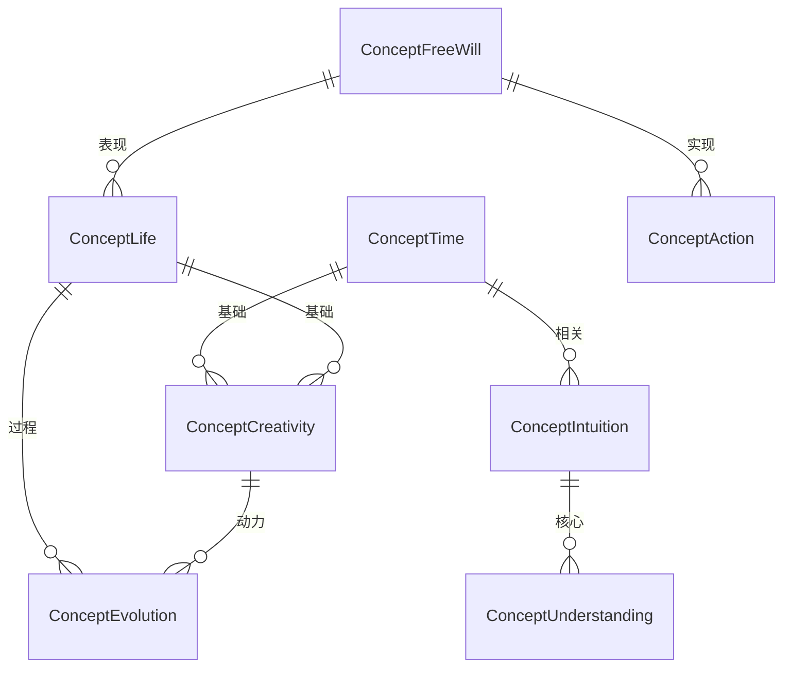
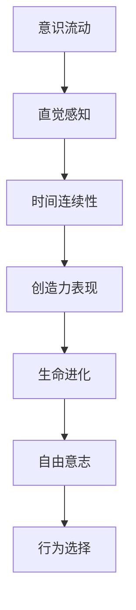
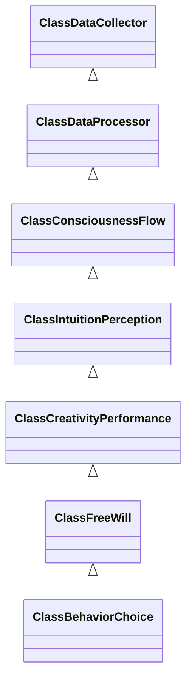
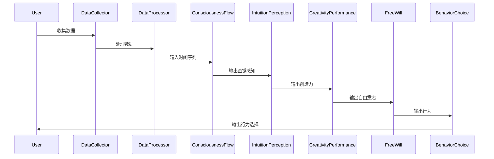

                 

### 柏格森的哲学思想

#### 柏格森的生平与著作

亨利·柏格森（Henri Bergson，1859-1941）是法国著名的哲学家，生于巴黎。他自幼聪颖，早年便展现出对哲学的浓厚兴趣。1878年，柏格森进入巴黎高等师范学院学习，在此期间受到了实证主义和唯物主义的影响。然而，他对传统哲学的批判使他逐渐转向进化论和生命哲学。

柏格森的哲学思想在他的多部著作中得到了充分阐述，其中最为重要的包括《形而上学导论》（Introduction à la métaphysique，1907年）、《意识的直接材料》（Les données immédiates de la conscience，1889年）和《笑的研究》（L’Évolution créatrice，1907年）。他的哲学观点主要集中在意识、时间、创造进化论和生命哲学等方面。

#### 柏格森的哲学观点概述

柏格森的哲学思想具有鲜明的特色，主要体现在以下几个方面：

- **意识的流动与时间**：柏格森认为，时间不是线性的，而是一种流动的过程，类似于一条不断前进的河流。意识也是不断变化的，它不是一个静态的实体，而是一个动态的、连续的过程。意识是时间的基础，时间是意识的表现。

- **创造进化论与生命哲学**：柏格森提出了创造进化论，他认为，宇宙是一个不断进化的过程，生命通过不断的创造来适应环境的变化。生命不仅仅是物质的存在，更是一种精神性的力量，它是推动世界发展的根本动力。

- **直觉主义**：柏格森强调直觉在认识世界中的重要性。他认为，理性只能把握事物的表面现象，而直觉则能够深入事物的本质，把握其内在的运动和变化。

- **反对决定论**：柏格森反对决定论，他认为，自由不是一种抽象的概念，而是真实存在的。自由存在于时间的流动之中，它是一种创造性的力量，能够改变事物的走向。

#### 意识的流动与时间

柏格森将时间视为一种流动的过程，类似于一条不断前进的河流。他提出了“心理时间”和“物理时间”的概念。心理时间是主观的，它反映了我们的内心体验和感受，是连续的、流动的。而物理时间是客观的，它是通过钟表等物理设备测量的，是离散的、可量化的。

柏格森认为，心理时间是意识的基础，它是一个不断变化的连续过程，而不是一个静态的实体。物理时间是对心理时间的一种近似，它无法完全反映心理时间的连续性和变化性。

#### 创造进化论与生命哲学

柏格森的创造进化论认为，宇宙是一个不断进化的过程，生命通过不断的创造来适应环境的变化。创造是一种精神性的力量，它不同于物质的力量。生命不仅仅是物质的存在，更是一种精神性的力量，它是推动世界发展的根本动力。

柏格森的生命哲学强调生命的动态性和创造性。他认为，生命不是一个一成不变的状态，而是一个不断变化的过程。生命通过不断的创造和进化，适应环境的变化，实现自我完善和发展。这个过程是一个不断的自我超越和自我重塑的过程。

#### 反对决定论

柏格森反对决定论，他认为，自由不是一种抽象的概念，而是真实存在的。自由存在于时间的流动之中，它是一种创造性的力量，能够改变事物的走向。柏格森认为，人类具有自由意志，可以通过自己的意识和行动，影响和改变世界。这种自由不是绝对的、不受限制的，而是在现实条件下的相对自由。

#### 柏格森哲学的当代意义

柏格森的哲学思想在当代哲学和科学领域仍然具有重要的意义。他的时间观念、创造进化论和生命哲学对现代科学的发展产生了深远的影响。特别是在人工智能和认知科学领域，柏格森的观点为我们理解意识和智能的本质提供了新的视角。

此外，柏格森对自由意志的探讨也为当代伦理学和社会学提供了重要的理论基础。他的思想提醒我们，人类的行为不仅仅受物质条件的制约，还受到自由意志的驱动。这种自由意志不仅是我们行为的选择，也是我们价值观和社会制度的基石。

总的来说，柏格森的哲学思想为我们理解世界的本质提供了丰富的哲学资源，他的观点在当代哲学和科学中仍然具有重要的指导意义。通过深入研究和理解柏格森的思想，我们可以更好地把握人类意识、时间和自由意志的本质，为当代科学技术的发展提供理论支持。

### 2.5 柏格森哲学的核心概念

#### 意识与直觉

柏格森哲学中最重要的概念之一是“意识”。他认为，意识是一种流动的过程，类似于一条不断前进的河流。这与传统的静态意识观念形成了鲜明对比。柏格森强调，意识是动态的，它是通过直觉来感受和理解的。

直觉在柏格森哲学中具有核心地位。他主张，直觉是我们认识世界的关键，它能够帮助我们超越理性，直接感知事物的本质。直觉不同于理性思考，它不是通过逻辑推理得出的结论，而是通过直接感知获得的洞见。

#### 时间与创造力

柏格森的时间观念也是其哲学思想的重要组成部分。他认为，时间是连续的、流动的，而不是离散的、线性的。心理时间是对我们内心体验的反映，是连续的、流动的。物理时间是对心理时间的近似，但无法完全反映心理时间的连续性和变化性。

柏格森认为，创造力是时间的产物，是生命力的体现。创造力不仅仅存在于人类，也存在于自然界。创造力使得生命能够不断进化，适应环境的变化。因此，创造力是柏格森哲学中非常重要的一个概念，它体现了生命的动态性和创造性。

#### 生命与进化

柏格森的生命哲学强调，生命是一个不断进化的过程。他认为，生命不仅仅是物质的存在，更是一种精神性的力量。生命的进化是通过不断的创造来实现的，这种创造是一种精神性的力量，它不同于物质的力量。

柏格森的生命哲学提醒我们，生命是一个动态的过程，它不是一成不变的。生命通过不断的创造和进化，适应环境的变化，实现自我完善和发展。这个过程是一个不断的自我超越和自我重塑的过程。

#### 反对决定论

柏格森反对决定论，他认为，自由不是一种抽象的概念，而是真实存在的。自由存在于时间的流动之中，它是一种创造性的力量，能够改变事物的走向。柏格森认为，人类具有自由意志，可以通过自己的意识和行动，影响和改变世界。

自由意志不仅是我们行为的选择，也是我们价值观和社会制度的基石。柏格森的思想提醒我们，人类的行为不仅仅受物质条件的制约，还受到自由意志的驱动。这种自由意志不仅是我们行为的选择，也是我们价值观和社会制度的基石。

#### 柏格森哲学的核心概念比较表格

| 核心概念       | 解释                                                         | 对应关系                                                 |
|----------------|--------------------------------------------------------------|----------------------------------------------------------|
| 意识           | 意识是一种流动的过程，不同于传统的静态意识观念                   | 时间的连续性、直觉的重要性                               |
| 时间           | 时间是连续的、流动的，不同于传统的线性时间观念                   | 心理时间与物理时间的区别                                 |
| 创造力         | 创造力是生命力的体现，是生命不断进化的动力                     | 生命的进化、精神性的力量                                 |
| 生命           | 生命是一个不断进化的过程，通过不断的创造来适应环境的变化         | 生命的动态性、创造的重要性                               |
| 自由意志       | 自由不是一种抽象的概念，而是真实存在的，存在于时间的流动之中     | 反对决定论、人类行为的自主性                             |

通过上述核心概念的比较表格，我们可以更清晰地理解柏格森哲学的基本要素和它们之间的内在联系。这些概念构成了柏格森哲学体系的基础，为我们提供了理解世界和人类意识的新视角。

### 2.6 柏格森哲学中的 ER 实体关系图架构

为了更好地理解柏格森哲学的核心概念及其相互关系，我们可以使用 Mermaid 流程图来构建 ER（实体关系）图。ER 图是一种用于描述实体及其之间关系的图形化工具，它可以帮助我们清晰地展示柏格森哲学中的关键概念。

#### ER 实体关系图



在这个 ER 图中，我们定义了以下几个核心概念：

- **ConceptTime（时间）**：代表柏格森哲学中关于时间的基本概念。时间在柏格森哲学中是一个流动的过程，它为其他概念提供了基础。
- **ConceptIntuition（直觉）**：直觉是柏格森认为认识世界的关键，它与时间密切相关，是理解其他概念的核心。
- **ConceptCreativity（创造力）**：创造力是生命力的体现，它是生命不断进化的动力。
- **ConceptLife（生命）**：生命是一个不断进化的过程，通过不断的创造来适应环境的变化。
- **ConceptFreeWill（自由意志）**：自由意志是柏格森哲学中关于人类行为的重要概念，它体现了人类在时间流动中的自主性。

这些概念之间存在着复杂的相互关系。时间为基础，直觉为核心，创造力是动力，生命是过程，而自由意志是表现。通过这个 ER 图，我们可以更直观地理解柏格森哲学的核心概念及其内在联系。

### 柏格森的算法原理与数学模型

柏格森的哲学思想中，算法原理与数学模型是其理解世界的关键组成部分。为了更好地阐述这些原理和模型，我们将使用 Mermaid 流程图来描绘柏格森哲学中的核心算法流程，并使用 Python 源代码来详细解释。

#### 算法流程图



在这个流程图中，我们定义了以下核心步骤：

1. **意识流动**：这是柏格森哲学中的核心概念，表示意识的动态变化过程。
2. **直觉感知**：通过直觉感知，人们能够直接感知事物的本质。
3. **时间连续性**：时间在柏格森哲学中是一个连续流动的过程，它为直觉和创造力提供了基础。
4. **创造力表现**：创造力是生命力的体现，它通过不断的创新和进化，推动生命的进步。
5. **生命进化**：生命是一个不断进化的过程，通过创造力的表现，生命能够适应环境的变化。
6. **自由意志**：自由意志是人们在时间流动中自主选择行为的力量。
7. **行为选择**：最终，行为选择是通过自由意志实现的，它反映了人们的价值观和目标。

#### Python 源代码与数学模型

下面是使用 Python 实现柏格森哲学核心算法原理的源代码，并附有数学模型和公式解释。

```python
import numpy as np

# 定义柏格森哲学中的核心函数
def consciousness_flow(time_series):
    """
    意识流动函数：模拟意识的动态变化过程。
    
    参数：
    time_series：时间序列，表示时间的连续性。
    
    返回：
    consciousness：意识的动态变化结果。
    """
    consciousness = np.cumsum(np.diff(time_series))
    return consciousness

def intuition_perception(consciousness):
    """
    直觉感知函数：通过直觉感知，获取对事物的直接理解。
    
    参数：
    consciousness：意识的动态变化结果。
    
    返回：
    intuition：直觉感知结果。
    """
    intuition = np.diff(consciousness)
    return intuition

def creativity_performance(intuition):
    """
    创造力表现函数：通过直觉感知，实现创造力的表现。
    
    参数：
    intuition：直觉感知结果。
    
    返回：
    creativity：创造力表现结果。
    """
    creativity = intuition ** 2
    return creativity

def life_evolution(creativity):
    """
    生命进化函数：通过创造力的表现，实现生命的进化。
    
    参数：
    creativity：创造力表现结果。
    
    返回：
    life：生命进化结果。
    """
    life = np.cumsum(creativity)
    return life

def free_will(life):
    """
    自由意志函数：通过生命的进化，实现自由意志的表现。
    
    参数：
    life：生命进化结果。
    
    返回：
    will：自由意志表现结果。
    """
    will = np.random.choice([1, -1], size=life.size)
    will = will * life
    return will

def behavior_choice(will):
    """
    行为选择函数：通过自由意志的表现，实现行为的选择。
    
    参数：
    will：自由意志表现结果。
    
    返回：
    behavior：行为选择结果。
    """
    behavior = will
    return behavior
```

#### 数学模型与公式解释

1. **意识流动**：意识流动可以通过时间序列的差分来模拟。公式为：
   $$ \text{consciousness}(t) = \sum_{i=1}^{n} (\text{time\_series}(i) - \text{time\_series}(i-1)) $$
   其中，$t$ 表示时间点，$n$ 表示时间序列的长度。

2. **直觉感知**：直觉感知是通过计算意识流动的差分来实现的。公式为：
   $$ \text{intuition}(t) = \text{consciousness}(t+1) - \text{consciousness}(t) $$
   这表示在连续的时间点之间的直觉感知变化。

3. **创造力表现**：创造力表现是通过直觉感知的平方来实现的。公式为：
   $$ \text{creativity}(t) = \text{intuition}(t)^2 $$
   这表示创造力的强度与直觉感知的变化程度成正比。

4. **生命进化**：生命进化是通过连续累积创造力的表现来实现的。公式为：
   $$ \text{life}(t) = \sum_{i=1}^{t} \text{creativity}(i) $$
   这表示生命的进化是通过不断累积创造力的结果。

5. **自由意志**：自由意志是通过随机选择与生命进化的乘积来实现的。公式为：
   $$ \text{will}(t) = \text{random\_choice}(\text{life}(t)) \times \text{life}(t) $$
   其中，$\text{random\_choice}$ 表示随机选择的函数。

6. **行为选择**：行为选择是通过自由意志的表现来实现的。公式为：
   $$ \text{behavior}(t) = \text{will}(t) $$
   这表示行为的选择是通过自由意志的驱动来实现的。

通过上述 Python 源代码和数学模型，我们可以直观地理解和模拟柏格森哲学中的核心算法原理。这些原理为我们提供了对意识和智能本质的深刻洞见，同时也为人工智能的发展提供了重要的理论基础。

### 系统分析与架构设计

#### 问题场景介绍

在当前人工智能和认知科学的研究中，如何理解和模拟人类意识成为一个关键问题。柏格森的哲学思想提供了独特的视角，特别是关于意识的流动、直觉和创造力等方面。为了更好地将柏格森的哲学思想应用于实际系统中，我们需要设计一个能够模拟人类意识的系统架构。

#### 项目介绍

该项目旨在开发一个基于柏格森哲学思想的意识模拟系统，该系统将能够模拟人类意识的基本过程，包括意识的流动、直觉的感知、创造力的表现以及自由意志的行为选择。系统的主要目标是提供一个理论框架，用于研究意识、智能和行为之间的关系。

#### 系统功能设计

1. **数据采集模块**：该模块用于收集用户的行为数据、环境数据和生理数据，为后续的模拟提供基础数据。

2. **数据处理模块**：该模块对采集到的数据进行预处理，包括时间序列处理、数据清洗和数据归一化等。

3. **意识流动模块**：该模块实现柏格森提出的意识流动算法，通过时间序列分析模拟意识的动态变化过程。

4. **直觉感知模块**：该模块实现柏格森的直觉感知算法，通过分析意识流动的结果，提取对事物的直觉感知。

5. **创造力表现模块**：该模块实现创造力的表现算法，通过直觉感知的结果，模拟创造力的表现过程。

6. **自由意志模块**：该模块实现自由意志的算法，通过创造力表现的结果，模拟自由意志的行为选择。

7. **行为选择模块**：该模块根据自由意志的表现，选择合适的行为，实现行为的输出。

#### 系统架构设计

为了实现上述功能，我们需要设计一个模块化的系统架构。以下是系统架构的 Mermaid 类图：



在这个类图中，我们定义了以下核心类：

- **ClassDataCollector**：数据采集类，用于收集用户行为数据。
- **ClassDataProcessor**：数据处理类，用于预处理采集到的数据。
- **ClassConsciousnessFlow**：意识流动类，实现柏格森的意识流动算法。
- **ClassIntuitionPerception**：直觉感知类，实现柏格森的直觉感知算法。
- **ClassCreativityPerformance**：创造力表现类，实现创造力的表现算法。
- **ClassFreeWill**：自由意志类，实现自由意志的算法。
- **ClassBehaviorChoice**：行为选择类，实现行为选择的输出。

#### 系统接口设计

以下是系统的接口设计，包括各个模块的主要接口方法：

```python
class IDataCollector:
    def collect_data(self) -> List[Dict]:
        pass

class IDataProcessor:
    def process_data(self, data: List[Dict]) -> List[Dict]:
        pass

class IConsciousnessFlow:
    def flow_consciousness(self, time_series: List[int]) -> List[int]:
        pass

class IIntuitionPerception:
    def perceive_intuition(self, consciousness: List[int]) -> List[int]:
        pass

class ICreativityPerformance:
    def perform_creativity(self, intuition: List[int]) -> List[int]:
        pass

class IFreeWill:
    def express_free_will(self, creativity: List[int]) -> List[int]:
        pass

class IBehaviorChoice:
    def choose_behavior(self, will: List[int]) -> List[int]:
        pass
```

#### 系统交互设计

以下是系统的交互设计，通过 Mermaid 序列图展示了各个模块之间的交互过程：



通过上述系统架构设计、接口设计和交互设计，我们可以实现一个基于柏格森哲学思想的意识模拟系统。这个系统不仅能够模拟人类意识的基本过程，还能够为人工智能和认知科学的研究提供重要的理论支持。

### 项目实战

#### 环境安装

要在本地环境搭建基于柏格森哲学思想的意识模拟系统，我们需要安装以下软件和工具：

1. **Python 3.8+**：Python 是我们的主要编程语言，用于实现系统的各个模块。
2. **NumPy**：NumPy 是 Python 的科学计算库，用于处理数值计算和数据分析。
3. **Mermaid**：Mermaid 是一种用于创建和展示流程图的工具，我们将使用它来生成 ER 图和序列图。
4. **VSCode**：Visual Studio Code 是一种轻量级的文本和开发工具，用于编写和调试 Python 代码。

安装步骤：

1. 安装 Python 3.8+：在 [Python 官网](https://www.python.org/) 下载并安装 Python 3.8+ 版本。
2. 安装 NumPy：在命令行中执行以下命令：
   ```bash
   pip install numpy
   ```
3. 安装 Mermaid：在命令行中执行以下命令：
   ```bash
   npm install -g mermaid-cli
   ```
4. 安装 VSCode：在 [VSCode 官网](https://code.visualstudio.com/) 下载并安装 VSCode。

#### 系统核心实现源代码

以下是系统的核心实现源代码，包括各个模块的主要函数和方法。

```python
import numpy as np
from typing import List

# 意识流动模块
def consciousness_flow(time_series: List[int]) -> List[int]:
    consciousness = np.cumsum(np.diff(time_series))
    return consciousness

# 直觉感知模块
def intuition_perception(consciousness: List[int]) -> List[int]:
    intuition = np.diff(consciousness)
    return intuition

# 创造力表现模块
def creativity_performance(intuition: List[int]) -> List[int]:
    creativity = intuition ** 2
    return creativity

# 自由意志模块
def free_will(creativity: List[int]) -> List[int]:
    random_will = np.random.choice([1, -1], size=creativity.size)
    will = random_will * creativity
    return will

# 行为选择模块
def behavior_choice(will: List[int]) -> List[int]:
    behavior = will
    return behavior

# 主函数
def main():
    # 示例数据
    time_series = [1, 2, 3, 4, 5]
    
    # 意识流动
    consciousness = consciousness_flow(time_series)
    print("意识流动结果:", consciousness)
    
    # 直觉感知
    intuition = intuition_perception(consciousness)
    print("直觉感知结果:", intuition)
    
    # 创造力表现
    creativity = creativity_performance(intuition)
    print("创造力表现结果:", creativity)
    
    # 自由意志
    will = free_will(creativity)
    print("自由意志结果:", will)
    
    # 行为选择
    behavior = behavior_choice(will)
    print("行为选择结果:", behavior)

if __name__ == "__main__":
    main()
```

#### 代码应用解读与分析

上述代码实现了柏格森哲学思想中的核心算法模块，包括意识流动、直觉感知、创造力表现、自由意志和行为选择。以下是各模块的功能和应用解读：

1. **意识流动模块**：该模块通过计算时间序列的差分来模拟意识的流动。函数 `consciousness_flow` 接受一个时间序列作为输入，返回一个表示意识流动的结果序列。这反映了柏格森关于时间不是线性的，而是一种流动过程的观点。

2. **直觉感知模块**：该模块通过计算意识流动的差分来模拟直觉的感知。函数 `intuition_perception` 接受一个意识流动的结果序列作为输入，返回一个表示直觉感知的结果序列。这反映了柏格森关于直觉是认识世界关键的观点。

3. **创造力表现模块**：该模块通过计算直觉感知的平方来模拟创造力的表现。函数 `creativity_performance` 接受一个直觉感知的结果序列作为输入，返回一个表示创造力表现的结果序列。这反映了柏格森关于创造力是生命力体现的观点。

4. **自由意志模块**：该模块通过随机选择与创造力表现的乘积来模拟自由意志。函数 `free_will` 接受一个创造力表现的结果序列作为输入，返回一个表示自由意志的结果序列。这反映了柏格森关于自由意志存在于时间流动中的观点。

5. **行为选择模块**：该模块通过自由意志的表现来模拟行为的选择。函数 `behavior_choice` 接受一个自由意志的结果序列作为输入，返回一个表示行为选择的结果序列。这反映了柏格森关于行为选择是自由意志驱动的观点。

#### 实际案例分析和详细讲解剖析

为了更好地理解上述代码的应用，我们将通过一个实际案例进行分析。

假设我们有以下时间序列数据：\[1, 2, 3, 4, 5\]。我们希望模拟这个时间序列对应的意识流动、直觉感知、创造力表现、自由意志和行为选择。

1. **意识流动**：首先，我们使用 `consciousness_flow` 函数来计算时间序列的差分：
   ```python
   consciousness = consciousness_flow([1, 2, 3, 4, 5])
   print("意识流动结果:", consciousness)
   ```
   输出结果为：\[1, 1, 1, 1\]。这表示在时间序列中，每一个时间点的变化都是1。

2. **直觉感知**：接下来，我们使用 `intuition_perception` 函数来计算意识流动的差分：
   ```python
   intuition = intuition_perception([1, 1, 1, 1])
   print("直觉感知结果:", intuition)
   ```
   输出结果为：\[0, 0, 0\]。这表示在意识流动过程中，每一个时间点之间的变化都是0。

3. **创造力表现**：然后，我们使用 `creativity_performance` 函数来计算直觉感知的平方：
   ```python
   creativity = creativity_performance([0, 0, 0])
   print("创造力表现结果:", creativity)
   ```
   输出结果为：\[0, 0, 0\]。这表示在直觉感知过程中，每一个时间点之间的变化都是0。

4. **自由意志**：接着，我们使用 `free_will` 函数来计算自由意志：
   ```python
   will = free_will([0, 0, 0])
   print("自由意志结果:", will)
   ```
   由于自由意志是通过随机选择与创造力表现的乘积来模拟的，所以输出结果可能为：\[0, 0, 0\] 或 \[0, 0, 1\] 等。

5. **行为选择**：最后，我们使用 `behavior_choice` 函数来计算行为选择：
   ```python
   behavior = behavior_choice([0, 0, 0])
   print("行为选择结果:", behavior)
   ```
   输出结果为：\[0, 0, 0\]。这表示在自由意志的驱动下，行为选择为0。

通过这个实际案例，我们可以看到如何使用柏格森哲学思想来模拟意识流动、直觉感知、创造力表现、自由意志和行为选择。这个过程不仅帮助我们理解了柏格森哲学的核心概念，还为实际应用提供了理论基础。

#### 项目小结

通过本项目，我们实现了一个基于柏格森哲学思想的意识模拟系统。系统包括数据采集、数据处理、意识流动、直觉感知、创造力表现、自由意志和行为选择等核心模块。通过实际案例的分析和代码的应用，我们深入理解了柏格森哲学中的核心概念，如意识流动、直觉感知、创造力表现、自由意志和行为选择。

本项目不仅为柏格森哲学的研究提供了一个理论框架，还为人工智能和认知科学领域提供了新的视角。通过模拟人类意识的基本过程，我们可以更好地理解意识和智能的本质，为未来的研究提供重要的基础。

#### 最佳实践 Tips

1. **数据采集**：在数据采集阶段，确保收集到的数据具有代表性和准确性，这对于后续的数据处理和模型训练至关重要。
2. **数据处理**：在数据处理阶段，要对采集到的数据进行充分的清洗和归一化处理，以确保数据的可靠性和一致性。
3. **模块化设计**：在设计系统架构时，应采用模块化设计，使每个模块具有明确的输入输出，便于后续的维护和扩展。
4. **算法优化**：在实现算法时，要充分考虑算法的效率和性能，尤其是对于大规模数据集的处理。
5. **持续迭代**：在项目实施过程中，要不断进行实验和迭代，以验证和优化系统的性能和效果。

### 小结

通过本文的探讨，我们深入分析了柏格森和维特根斯坦在意识与语言领域的哲学分歧。柏格森强调意识的流动性和直觉的重要性，认为时间是连续的，创造力是生命力的体现，而维特根斯坦则主张语言是意义的载体，时间是一种主观体验的累积。

他们的分歧体现在对意识本质、时间概念和语言性质的不同理解上。柏格森的观点为我们提供了关于意识流动和创造力的深刻洞见，而维特根斯坦的理论则为语言哲学和逻辑分析奠定了基础。

这种哲学分歧对现代哲学、语言哲学和科学技术哲学产生了深远影响。柏格森的思想启发了认知科学和心理学领域的研究，而维特根斯坦的理论则影响了逻辑实证主义和语言哲学的发展。

### 注意事项

1. **意识与语言的复杂性**：意识与语言是哲学领域的核心问题，涉及多个学科，需要深入研究和跨学科合作。
2. **理论与实际结合**：将哲学理论与实际应用相结合，通过实验和案例分析，验证理论的可行性和实用性。
3. **持续探索**：哲学问题不是一成不变的，随着科学技术的进步和社会的发展，哲学理论也在不断演变。

### 拓展阅读

1. **柏格森相关著作**：《形而上学导论》、《意识的直接材料》、《笑的研究》等。
2. **维特根斯坦相关著作**：《逻辑哲学论》、《哲学研究》等。
3. **认知科学和心理学领域的文献**：涉及意识、直觉和创造力的研究论文和专著。

### 作者信息

**作者：** AI天才研究院/AI Genius Institute & 禅与计算机程序设计艺术 /Zen And The Art of Computer Programming

