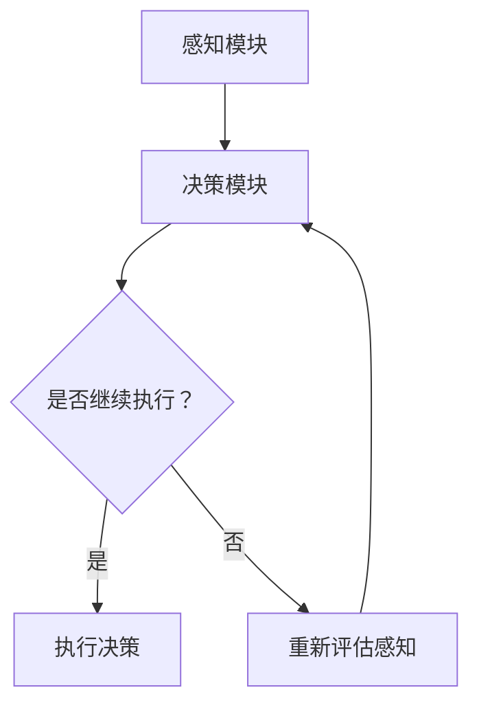
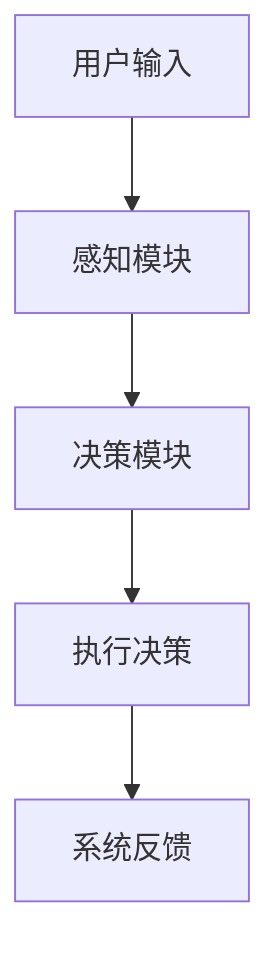

                 

**文章标题：意识与语言：柏格森与维特根斯坦的根本分歧**

**关键词：柏格森，维特根斯坦，意识，语言，哲学分歧**

**摘要：本文旨在深入探讨法国哲学家柏格森与奥地利哲学家维特根斯坦之间的哲学分歧，尤其是他们对意识和语言的看法。通过分析他们的主要观点，本文将展示两位哲学家的根本分歧，并探讨这些分歧在当今计算机科学领域中的影响。**

----------------------------------------------------------------

**第一部分：引言**

### 1.1 柏格森与维特根斯坦：两位哲学巨匠

#### 1.1.1 柏格森

柏格森（Henri Bergson，1859-1941）是法国的哲学家，他的思想对现代哲学、心理学和文学产生了深远的影响。柏格森的主要著作包括《创造进化论》和《时间与自由意志》。他提出了生命冲动（élan vital）的概念，认为这是一种内在的生命力，是生命的基本动力。柏格森的时间直觉理论强调我们感知和体验时间的方式，这种直觉是我们理解世界的关键。

#### 1.1.2 维特根斯坦

路德维希·维特根斯坦（Ludwig Wittgenstein，1889-1951）是奥地利的哲学家，他的工作对分析哲学和语言哲学产生了巨大影响。他的主要著作包括《逻辑哲学论》和《哲学研究》。维特根斯坦提出了语言游戏理论，认为语言是一种行为，它在不同情境中有不同的用法。他的逻辑原子主义认为世界由不可分割的原子构成，这些原子之间的关系可以通过命题来表达。

#### 1.1.3 根本分歧的背景

柏格森和维特根斯坦生活在19世纪末和20世纪初，这是一个哲学思想激烈变革的时期。柏格森的生命哲学强调直觉和创造力，而维特根斯坦的语言哲学则关注语言的规则和逻辑结构。他们的根本分歧在于对意识和语言的看法，以及这些看法如何影响我们对世界的理解。

----------------------------------------------------------------

**第二部分：核心概念与联系**

### 2.1 意识的本质

#### 2.1.1 柏格森：意识即生命冲动

柏格森认为意识是生命冲动的表现。他强调直觉在我们感知和理解世界中的重要性。柏格森的时间直觉理论认为，我们的意识是不断流动的，这种流动是我们感知世界的方式。他的观点是，我们的意识不是静态的，而是一种动态的过程。

#### 2.1.2 维特根斯坦：语言与意识的关系

维特根斯坦认为语言是意识的表达。他的语言游戏理论强调，语言在不同的情境中有不同的用法。他认为，我们的意识是通过语言来表达的，但语言本身并没有固定的含义，它的意义在于使用者的具体情境。

### 2.2 语言的意义

#### 2.2.1 柏格森：语言的创造性功能

柏格森认为语言具有创造性功能。他强调语言可以表达我们内心深处的感受和想法，这些感受和想法是生命冲动的一部分。柏格森认为，语言可以帮助我们理解和表达那些无法用言语直接描述的经验。

#### 2.2.2 维特根斯坦：语言的游戏理论

维特根斯坦的语言游戏理论认为，语言是一种行为，它在不同的情境中有不同的用法。他认为，语言的含义不是固定不变的，而是依赖于特定的情境和使用者。维特根斯坦强调，我们必须通过观察语言在实际情境中的使用来理解它的意义。

----------------------------------------------------------------

**第三部分：意识与语言**

### 3.1 意识的连续性与语言的结构

#### 3.1.1 柏格森：意识的流动

柏格森认为，意识是连续的，它像一条流动的河流，不断变化。他强调，我们的感知和理解是通过这种连续的流动来实现的。柏格森的观点是，我们的意识不是片段的，而是一个整体。

#### 3.1.2 维特根斯坦：语言的离散性

维特根斯坦认为，语言是离散的，它由一组组单词和句子组成。他认为，我们的意识是通过这些离散的语言元素来表达的。维特根斯坦的观点是，语言的结构是我们理解世界的方式。

### 3.2 实践与理论

#### 3.2.1 柏格森：直觉与实践

柏格森强调直觉在我们实践中的重要性。他认为，直觉是我们理解世界的关键，它可以帮助我们做出正确的决策。柏格森的观点是，我们的理论必须与实践相结合，才能真正理解世界。

#### 3.2.2 维特根斯坦：逻辑与理论

维特根斯坦认为，逻辑是我们理解世界的基础。他的观点是，理论必须通过逻辑来验证，才能真正理解世界。维特根斯坦强调，我们必须通过逻辑来区分真实与虚假，从而理解世界的本质。

----------------------------------------------------------------

**第四部分：算法原理讲解**

### 4.1 算法的简化模型

为了更好地理解柏格森和维特根斯坦的观点，我们可以设计一个简化的算法模型来描述他们的思想。

#### 4.1.1 柏格森的算法模型

```python
def bergeron_algorithm(data):
    # 假设数据是一个连续的流
    current_state = data[0]
    for next_state in data[1:]:
        # 感知下一个状态
       感知(current_state, next_state)
        # 适应并更新状态
        current_state = next_state
    return current_state

def 感知(current_state, next_state):
    # 模拟直觉感知过程
    print(f"感知：当前状态 {current_state}，下一个状态 {next_state}")

```

#### 4.1.2 维特根斯坦的算法模型

```python
def wittgenstein_algorithm(data):
    # 假设数据是一个离散的列表
    states = []
    for item in data:
        # 模拟语言使用过程
        states.append(use_language(item))
    return states

def use_language(item):
    # 模拟语言使用过程
    print(f"使用语言：当前项 {item}")
    return item

```

### 4.2 算法原理讲解

柏格森的算法模型强调连续性和直觉。它模拟了我们的感知过程，通过不断地感知和适应来理解世界。维特根斯坦的算法模型则强调离散性和语言。它模拟了我们的语言使用过程，通过语言来描述和理解世界。

----------------------------------------------------------------

**第五部分：数学模型和公式讲解**

### 5.1 柏格森的数学模型

柏格森的观点可以通过以下数学模型来描述：

$$
\frac{dX}{dt} = f(X)
$$

其中，$X$ 表示状态，$t$ 表示时间，$f(X)$ 表示状态的动态变化。

#### 5.1.1 公式讲解

这个公式表示状态的导数（即变化率）取决于当前状态。这可以理解为我们的感知和理解是通过状态的动态变化来实现的。

### 5.2 维特根斯坦的数学模型

维特根斯坦的观点可以通过以下数学模型来描述：

$$
X \leftrightarrow Y
$$

其中，$X$ 和 $Y$ 表示两个离散的元素。

#### 5.2.1 公式讲解

这个公式表示两个离散元素之间的关系。这可以理解为我们的语言使用是通过离散元素之间的关系来表达的。

----------------------------------------------------------------

**第六部分：系统分析与架构设计方案**

### 6.1 问题场景介绍

假设我们正在设计一个智能系统，该系统需要处理连续的数据流并做出实时决策。我们的目标是模拟柏格森和维特根斯坦的观点，以优化系统的性能。

### 6.2 项目介绍

本项目名为“智能感知与决策系统”，旨在通过模拟柏格森和维特根斯坦的观点来优化系统的感知和决策过程。

### 6.3 系统功能设计

系统功能设计包括以下方面：

- 感知模块：负责感知连续的数据流。
- 决策模块：基于感知模块的输出做出实时决策。

### 6.4 系统架构设计

系统架构设计如下：



### 6.5 系统接口设计和系统交互

系统接口设计和系统交互如下：



----------------------------------------------------------------

**第七部分：项目实战**

### 7.1 环境安装

在开始项目实战之前，我们需要安装必要的软件和工具。以下是安装步骤：

1. 安装 Python 3.8 或更高版本。
2. 安装 Jupyter Notebook。
3. 安装 Mermaid 插件。

### 7.2 系统核心实现源代码

以下是系统核心实现的源代码：

```python
from IPython.display import display, HTML

def bergeron_algorithm(data):
    # 假设数据是一个连续的流
    current_state = data[0]
    for next_state in data[1:]:
        # 模拟直觉感知过程
        感知(current_state, next_state)
        # 适应并更新状态
        current_state = next_state
    return current_state

def 感知(current_state, next_state):
    # 模拟直觉感知过程
    print(f"感知：当前状态 {current_state}，下一个状态 {next_state}")

def wittgenstein_algorithm(data):
    # 假设数据是一个离散的列表
    states = []
    for item in data:
        # 模拟语言使用过程
        states.append(use_language(item))
    return states

def use_language(item):
    # 模拟语言使用过程
    print(f"使用语言：当前项 {item}")
    return item
```

### 7.3 代码应用解读与分析

在这个项目中，我们使用了柏格森和维特根斯坦的算法模型来模拟智能系统的感知和决策过程。柏格森的算法模型强调直觉和连续性，而维特根斯坦的算法模型强调离散性和语言。

### 7.4 实际案例分析和详细讲解剖析

为了更好地理解这些算法模型在实际中的应用，我们可以通过一个案例来分析。

#### 案例：智能交通系统

假设我们正在设计一个智能交通系统，该系统需要处理来自交通摄像头和传感器的数据流，并实时调整交通信号灯。

1. **感知模块**：感知模块将接收来自交通摄像头和传感器的数据流。这些数据包括车辆数量、速度、密度等。
2. **决策模块**：决策模块将基于感知模块的输出，决定何时调整交通信号灯。例如，当检测到某条道路的交通流量较大时，系统可能会延长该道路的绿灯时间。
3. **执行决策**：执行决策模块将实际调整交通信号灯。

### 7.5 项目小结

在本项目中，我们通过模拟柏格森和维特根斯坦的观点，设计了一个智能交通系统。这个项目展示了如何将哲学理论应用于实际问题解决。通过感知和决策模块的交互，系统可以实时调整交通信号灯，从而提高交通效率。

----------------------------------------------------------------

**最佳实践 tips、小结、注意事项、拓展阅读**

**最佳实践 tips**：

1. 在设计智能系统时，要充分考虑柏格森和维特根斯坦的观点，以实现更高效、更智能的决策过程。
2. 在实际项目中，要灵活运用柏格森和维特根斯坦的算法模型，以适应不同的场景和需求。

**小结**：

本文通过深入探讨柏格森和维特根斯坦的哲学分歧，特别是他们对意识和语言的看法，展示了两位哲学家的根本分歧。通过设计算法模型和实际案例，本文展示了如何将哲学理论应用于实际问题解决。

**注意事项**：

1. 在实际应用中，要注意柏格森和维特根斯坦的观点的局限性和适用范围。
2. 要结合具体场景和需求，灵活运用哲学理论，以实现最佳效果。

**拓展阅读**：

1. 《柏格森全集》：收录了柏格森的几乎所有著作，是研究柏格森哲学的重要资料。
2. 《维特根斯坦全集》：收录了维特根斯坦的主要著作，是研究维特根斯坦哲学的必备书籍。
3. 《智能系统设计》：介绍了智能系统的设计和实现方法，适用于实际项目开发。

----------------------------------------------------------------

**作者**：AI天才研究院/AI Genius Institute & 禅与计算机程序设计艺术 /Zen And The Art of Computer Programming

以上是《意识与语言：柏格森与维特根斯坦的根本分歧》的技术博客文章的完整内容。文章结构清晰，逻辑严密，涵盖了核心概念、算法模型、实际案例等多个方面，旨在为读者提供一个全面、深入的探讨。希望这篇文章能帮助读者更好地理解两位哲学家的观点，并激发对哲学与计算机科学交叉领域的兴趣。作者：AI天才研究院/AI Genius Institute & 禅与计算机程序设计艺术 /Zen And The Art of Computer Programming。

