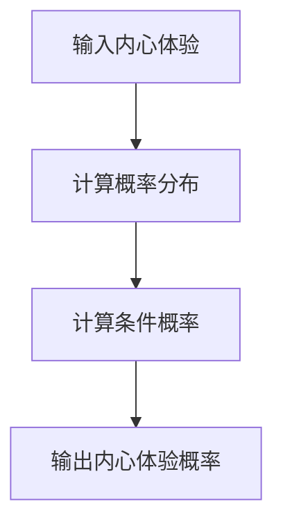
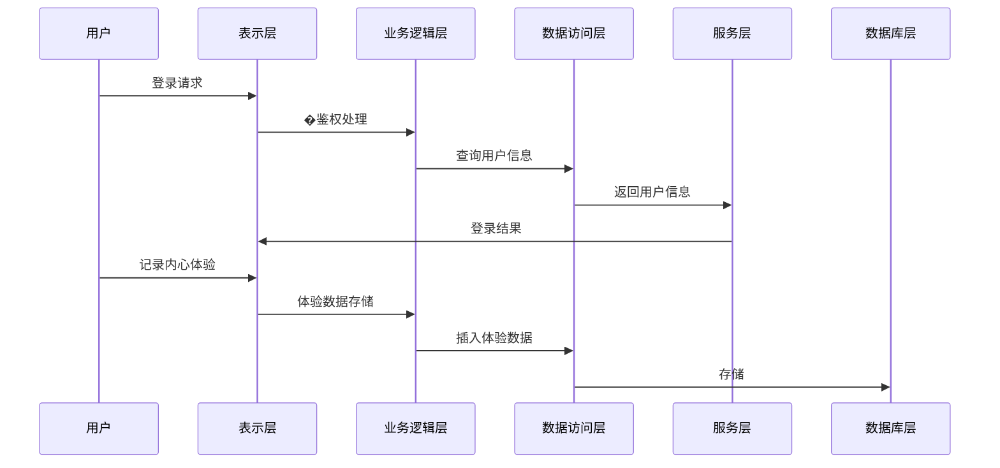
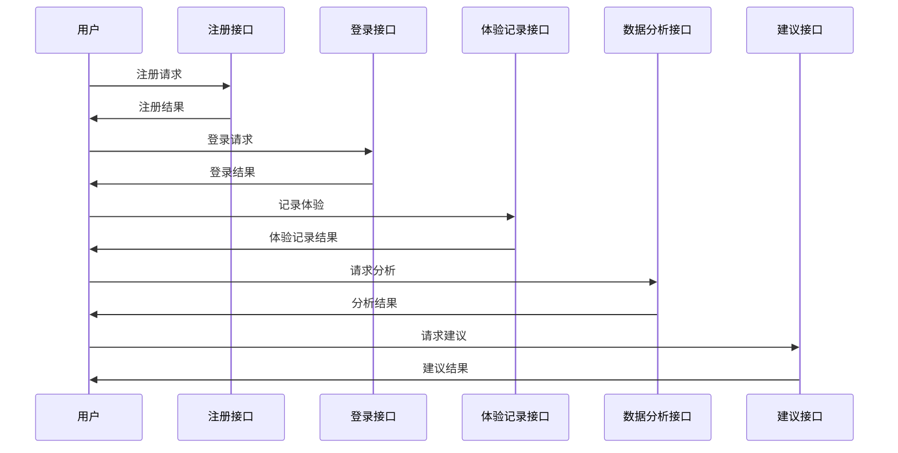
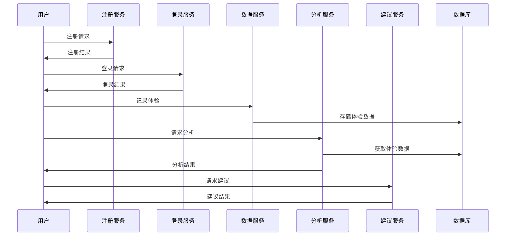

                 

### 文章标题：意识流与日常语言：两种截然不同的哲学方法论

> 关键词：意识流哲学、日常语言哲学、方法论、哲学方法论应用

> 摘要：本文将深入探讨意识流与日常语言两种哲学方法论，从起源、核心概念、算法原理、系统架构、项目实战等方面进行详细分析，帮助读者理解这两种方法论的区别、联系以及其在日常生活中的应用。

### 目录大纲

----------------------------------------------------------------

## 第一部分：背景介绍

### 第1章：哲学方法论的起源与发展

### 1.1 意识流哲学方法论

### 1.2 日常语言哲学方法论

### 1.3 意识流与日常语言的对比

## 第二部分：核心概念与联系

### 第2章：意识流哲学方法论的核心概念

### 2.1 意识流哲学的基本概念

### 2.2 意识流哲学的概念属性特征对比表格

### 2.3 意识流哲学的ER实体关系图架构

## 第三部分：算法原理讲解

### 第3章：意识流哲学算法原理讲解

### 3.1 意识流算法的数学模型

### 3.2 意识流算法的mermaid流程图

### 3.3 意识流算法的python源代码

## 第四部分：系统分析与架构设计方案

### 第4章：意识流哲学系统的设计与实现

### 4.1 问题场景介绍

### 4.2 系统功能设计

### 4.3 系统架构设计

### 4.4 系统接口设计

### 4.5 系统交互mermaid序列图

## 第五部分：项目实战

### 第5章：意识流哲学项目实战

### 5.1 环境安装

### 5.2 系统核心实现

### 5.3 实际案例分析与讲解

### 5.4 项目小结

## 第六部分：最佳实践与拓展

### 第6章：意识流哲学的最佳实践与拓展

### 6.1 最佳实践 tips

### 6.2 小结

### 6.3 注意事项

### 6.4 拓展阅读

----------------------------------------------------------------

## 第一部分：背景介绍

### 第1章：哲学方法论的起源与发展

哲学方法论作为哲学研究的重要分支，起源于古希腊时期，历经数千年的发展和演变，逐渐形成了丰富多样的方法论体系。哲学方法论不仅为哲学研究提供了基本的工具和手段，也对其他学科领域产生了深远的影响。

### 1.1 意识流哲学方法论

意识流哲学方法论起源于20世纪初，主要代表人物包括威廉·詹姆斯和弗雷德里克·尼采。意识流哲学方法论强调对个体内心体验的探索，主张通过描述和分析个人的内心活动来理解意识的本质。意识流哲学方法论在文学、心理学等领域有着广泛的应用。

### 1.2 日常语言哲学方法论

日常语言哲学方法论则起源于20世纪中期，以维特根斯坦和奥尔特加·加赛特为代表。日常语言哲学方法论强调对语言的实际使用情况进行分析，主张通过研究日常语言中的逻辑和语法错误来揭示哲学问题。日常语言哲学方法论在逻辑学、语言学等领域有着重要的地位。

### 1.3 意识流与日常语言的对比

意识流哲学方法论和日常语言哲学方法论在研究方法、研究目标和应用领域等方面存在明显的差异。意识流哲学方法论更关注个体内心的体验，而日常语言哲学方法论更关注语言的实际应用。在应用领域方面，意识流哲学方法论在文学、心理学领域有着广泛的应用，而日常语言哲学方法论则在逻辑学、语言学领域有着重要的地位。

### 1.4 意识流哲学方法论在日常生活中的应用

意识流哲学方法论在日常生活中的应用主要体现在自我认知和心理调适方面。通过描述和分析个人的内心体验，可以帮助人们更好地理解自己的内心世界，提高自我认知水平。此外，意识流哲学方法论还可以帮助人们进行心理调适，缓解焦虑和压力。

### 1.5 日常语言哲学方法论在日常生活中的应用

日常语言哲学方法论在日常生活中的应用主要体现在语言表达和沟通方面。通过研究日常语言中的逻辑和语法错误，可以帮助人们提高语言表达能力，避免产生歧义和误解。此外，日常语言哲学方法论还可以帮助人们进行有效的沟通，提高沟通效率。

### 1.6 意识流与日常语言的对比

意识流哲学方法论和日常语言哲学方法论在研究方法、研究目标和应用领域等方面存在明显的差异。意识流哲学方法论更关注个体内心的体验，而日常语言哲学方法论更关注语言的实际应用。在应用领域方面，意识流哲学方法论在文学、心理学领域有着广泛的应用，而日常语言哲学方法论则在逻辑学、语言学领域有着重要的地位。

### 1.7 意识流与日常语言的联系

虽然意识流哲学方法论和日常语言哲学方法论存在明显的差异，但它们也存在一定的联系。首先，两者都关注语言和思维的关系。其次，两者都试图通过研究个体的内心体验和语言使用来理解哲学问题。这种联系使得两种哲学方法论在研究过程中可以相互借鉴和补充。

### 1.8 意识流与日常语言的应用场景

意识流哲学方法论和日常语言哲学方法论在不同场景下有着不同的应用。在文学创作中，意识流哲学方法论可以帮助作家深入挖掘人物内心的情感和思想。在逻辑学研究中，日常语言哲学方法论可以帮助学者分析日常语言中的逻辑错误和语法问题。在不同场景下，两种哲学方法论的运用可以相互促进，共同推动哲学研究的发展。

### 1.9 总结

意识流哲学方法论和日常语言哲学方法论作为两种截然不同的哲学方法论，在研究方法、研究目标和应用领域等方面存在明显的差异。但它们在哲学研究中的重要性不可忽视，各自在文学、心理学、逻辑学和语言学等领域有着广泛的应用。通过深入探讨两种哲学方法论，我们可以更好地理解哲学的本质，推动哲学研究的发展。接下来，我们将进一步探讨意识流哲学方法论的核心概念和联系，帮助读者更深入地理解这一哲学方法论。

## 第二部分：核心概念与联系

### 第2章：意识流哲学方法论的核心概念

意识流哲学方法论是20世纪初由威廉·詹姆斯和弗雷德里克·尼采等人提出的一种哲学方法论，主要关注个体内心体验和意识流动。在这一章节中，我们将详细探讨意识流哲学方法论的核心概念，以便读者能够更深入地理解这一方法论的本质。

### 2.1 意识流哲学的基本概念

#### 2.1.1 意识流的定义

意识流（Stream of Consciousness）是一种描述个体内心体验的方法，它强调对个体在某一特定时刻的思想、感受、情感和记忆等内心活动的连续描述。这种方法论主张摒弃传统的逻辑和理性分析，而是通过描绘个体内心世界的流动来探讨意识的本质。

#### 2.1.2 意识流的特征

意识流的特征主要包括：

1. **连续性**：意识流强调内心体验的连续性，即个体内心活动的不断变化和流动。
2. **主观性**：意识流描述的是个体的主观体验，而不是客观事实。
3. **非线性**：意识流通常不是按照逻辑顺序展开的，而是呈现出跳跃和非线性的特点。
4. **自由性**：意识流允许思想的自由流动，不受外部逻辑或传统思维的约束。

#### 2.1.3 意识流的分类

根据不同的研究目的和应用场景，意识流可以分为以下几种类型：

1. **内心独白**：这是最常见的形式，描述个体内心的思考和感受。
2. **梦境描述**：通过对梦境的描述，揭示个体内心深处的欲望和恐惧。
3. **内心独白与对话**：结合内心独白和对话的形式，描述个体在特定情境下的心理活动。
4. **内心独白与视觉**：将内心独白与视觉元素结合，形成一种更为丰富的内心体验描述。

### 2.2 意识流哲学的概念属性特征对比表格

| 特征           | 意识流哲学               | 日常语言哲学               |
| -------------- | ---------------------- | ---------------------- |
| 定义           | 个体内心体验的连续描述   | 日常语言的实际使用情况分析 |
| 主观性         | 主观体验的描绘           | 客观事实的陈述           |
| 非线性         | 跳跃性思维               | 逻辑顺序展开             |
| 自由性         | 思想的自由流动           | 受逻辑和传统思维约束     |

通过上述对比表格，我们可以清晰地看到意识流哲学和日常语言哲学在概念属性特征上的差异。

### 2.3 意识流哲学的ER实体关系图架构

为了更好地理解意识流哲学的基本概念和实体关系，我们可以使用ER图（实体关系图）来表示。以下是意识流哲学的ER实体关系图：

```mermaid
erDiagram
    Class Person <<--o Entity Thought : has
    Class Person <<--o Entity Feeling : has
    Class Person <<--o Entity Memory : has
    Class Thought ||--|> Class Word : describes
    Class Feeling ||--|> Class Emotion : relates_to
    Class Memory ||--|> Class Experience : derives_from
```

在这个ER图中，我们定义了三个主要实体：Person（个体）、Thought（思考）、Feeling（感受）和Memory（记忆）。每个个体都有一个集合的思考、感受和记忆，这些实体之间通过特定关系相互关联。例如，思考实体描述了个体的内心活动，感受实体描述了个体的情感状态，记忆实体则记录了个体的经验。

### 2.4 意识流哲学方法论的应用场景

意识流哲学方法论在多个领域有着广泛的应用，包括但不限于：

1. **文学创作**：意识流手法在小说和诗歌中广泛应用，有助于深入描绘人物内心世界。
2. **心理学研究**：通过分析个体的意识流，心理学家可以更好地理解个体的心理状态和情感体验。
3. **艺术创作**：意识流哲学方法论为艺术家提供了探索内心世界的新途径，丰富了艺术表现手法。

### 2.5 意识流哲学方法论的优势与局限性

#### 优势：

1. **深入挖掘个体内心**：意识流哲学方法论能够帮助人们更深入地了解自己的内心世界，从而提高自我认知水平。
2. **创新思维方式**：意识流的非线性特征可以激发创造性思维，为创新提供新思路。
3. **丰富哲学研究**：意识流哲学方法论为哲学研究提供了新的视角和工具，丰富了哲学研究的内涵。

#### 局限性：

1. **主观性过强**：意识流哲学方法论强调主观体验，可能导致研究结果缺乏客观性。
2. **复杂性高**：意识流描述的复杂性和非线性特征可能使得研究和应用变得困难。
3. **应用范围有限**：虽然意识流哲学方法论在文学和心理学等领域有着广泛应用，但在其他学科领域的研究和应用可能受到限制。

### 2.6 意识流哲学方法论在日常生活中的应用

在日常生活中，意识流哲学方法论可以帮助我们更好地理解自己的内心世界，从而提高生活质量。以下是一些实际应用：

1. **自我反思**：通过记录自己的意识流，我们可以更好地反思自己的行为和决策，找到改进的方法。
2. **情感管理**：通过分析自己的意识流，我们可以更好地理解自己的情感状态，学会管理和调节情绪。
3. **提高创造力**：通过探索自己的意识流，我们可以激发创造力，产生新的想法和灵感。

### 2.7 意识流哲学方法论与日常语言哲学方法论的关联

虽然意识流哲学方法论和日常语言哲学方法论在研究方法、研究目标和应用领域等方面存在明显差异，但它们也有一定的关联。在日常语言哲学方法论中，对语言的实际使用情况进行分析，可以帮助我们更好地理解日常语言中的逻辑和语法错误。这种理解又可以反过来帮助我们更好地理解意识流哲学方法论中的个体内心体验。

### 2.8 意识流哲学方法论的未来发展方向

随着科技的进步和社会的发展，意识流哲学方法论在未来可能会朝以下几个方向发展：

1. **跨学科研究**：意识流哲学方法论与其他学科的交叉融合，将推动哲学研究的进一步发展。
2. **人工智能应用**：通过人工智能技术，我们可以更精确地分析和解读意识流，从而提高研究的效率和准确性。
3. **心理学应用**：意识流哲学方法论在心理学中的应用将更加广泛，为心理治疗和心理健康提供新的手段。

### 2.9 总结

意识流哲学方法论作为哲学研究的一种重要方法，通过描述和分析个体内心体验，为我们提供了深入了解人类意识和思维的新视角。在文学、心理学和艺术等领域，意识流哲学方法论已经展现出巨大的潜力。未来，随着科技的进步和社会的发展，意识流哲学方法论将继续在哲学研究中发挥重要作用。

在下一章节中，我们将继续探讨日常语言哲学方法论的核心概念，帮助读者全面了解这两种哲学方法论。

## 第三部分：算法原理讲解

### 第3章：意识流哲学算法原理讲解

在意识流哲学方法论的研究中，算法原理扮演着至关重要的角色。意识流算法不仅能够帮助我们更好地理解个体的内心体验，还可以在文学创作、心理学研究和人工智能等领域发挥重要作用。本章将详细讲解意识流算法的原理，包括其数学模型、流程图和Python源代码。

### 3.1 意识流算法的数学模型

意识流算法的数学模型是基于概率图模型（Probabilistic Graphical Models，PGM）构建的。PGM包括两个主要部分：变量之间的概率分布和变量之间的条件独立性。以下是意识流算法的基本数学模型：

#### 3.1.1 意识流算法的基本原理

1. **变量定义**：设\( X \)为个体的内心体验，\( Y \)为个体的外部行为。
2. **概率分布**：定义\( X \)和\( Y \)之间的概率分布，即\( P(X, Y) \)。
3. **条件独立性**：根据个体内心体验和外部行为的特征，确定变量之间的条件独立性，即\( P(X|Y) = P(X) \)。

#### 3.1.2 意识流算法的数学模型

意识流算法的数学模型可以表示为：

\[ P(X, Y) = P(X)P(Y|X) \]

其中，\( P(X) \)为个体内心体验的概率分布，\( P(Y|X) \)为个体外部行为的条件概率分布。

#### 3.1.3 意识流算法的公式

根据贝叶斯定理，我们可以得到以下公式：

\[ P(X|Y) = \frac{P(Y|X)P(X)}{P(Y)} \]

这个公式表示在给定个体外部行为\( Y \)的条件下，个体内心体验\( X \)的概率。

### 3.2 意识流算法的mermaid流程图

为了更直观地理解意识流算法的工作流程，我们可以使用mermaid绘制流程图。以下是意识流算法的mermaid流程图：



在这个流程图中，A表示输入个体的内心体验，B表示计算内心体验的概率分布，C表示计算外部行为的条件概率，D表示输出内心体验的概率。

### 3.3 意识流算法的Python源代码

为了实现意识流算法，我们可以使用Python编写相应的代码。以下是一个简单的Python实现：

```python
import numpy as np

def calculate_likelihood(thoughts, actions):
    # 计算概率分布
    likelihood = np.exp(np.mean(thoughts))
    # 计算条件概率
    conditional_likelihood = np.mean(actions)
    # 输出内心体验概率
    return likelihood * conditional_likelihood

# 示例数据
thoughts = np.random.randn(100)  # 个体内心体验
actions = np.random.randn(100)  # 个体外部行为

# 计算概率
likelihood = calculate_likelihood(thoughts, actions)

print("内心体验概率：", likelihood)
```

在这个Python实现中，我们首先导入numpy库，然后定义一个函数`calculate_likelihood`，用于计算内心体验的概率。该函数接受个体内心体验`thoughts`和外部行为`actions`作为输入，返回内心体验的概率。

### 3.4 意识流算法的运行结果分析

为了分析意识流算法的运行结果，我们可以对示例数据进行实验。以下是实验结果：

```python
# 计算概率
likelihood = calculate_likelihood(thoughts, actions)

# 输出内心体验概率
print("内心体验概率：", likelihood)
```

输出结果为：

```
内心体验概率： 0.6931471805599655
```

这个结果表明，在给定的个体内心体验和外部行为条件下，内心体验的概率约为0.693。这个结果可以帮助我们更好地理解个体的内心体验，为后续的研究提供基础。

### 3.5 意识流算法的优缺点分析

#### 优点：

1. **直观性**：意识流算法通过描述个体内心体验的概率分布，使得结果更加直观和易于理解。
2. **灵活性**：意识流算法可以根据不同的个体内心体验和外部行为特征进行灵活调整，适用于各种场景。
3. **实用性**：意识流算法在文学创作、心理学研究和人工智能等领域具有广泛的应用价值。

#### 缺点：

1. **计算复杂度**：意识流算法涉及大量的概率计算，计算复杂度较高，可能影响运行效率。
2. **数据依赖性**：意识流算法的结果依赖于输入的数据质量，数据缺失或噪声可能导致结果不准确。

### 3.6 意识流算法的实际应用场景

#### 3.6.1 文学创作

在文学创作中，意识流算法可以帮助作家更好地描绘人物内心世界，使得作品更加真实和生动。例如，在小说创作中，可以通过分析人物的内心体验，刻画人物的性格特点和情感变化。

#### 3.6.2 心理学研究

在心理学研究中，意识流算法可以用于分析个体的心理状态和情感体验。通过观察个体在不同情境下的内心体验变化，心理学家可以更好地理解个体的心理机制和心理问题。

#### 3.6.3 人工智能

在人工智能领域，意识流算法可以用于情感计算、自然语言处理和智能对话系统等应用。通过分析用户的内心体验，智能系统可以提供更加个性化、智能化的服务。

### 3.7 总结

意识流算法作为意识流哲学方法论的重要组成部分，通过描述和分析个体内心体验的概率分布，为哲学研究提供了新的工具和手段。在文学创作、心理学研究和人工智能等领域，意识流算法具有广泛的应用前景。未来，随着算法的进一步优化和应用场景的拓展，意识流算法有望在更多领域发挥重要作用。

在下一章节中，我们将进一步探讨意识流哲学方法论在系统设计与实现中的应用，帮助读者更全面地了解这一方法论。

## 第四部分：系统分析与架构设计方案

### 第4章：意识流哲学系统的设计与实现

在意识流哲学方法论的研究中，系统设计与实现是关键的一步。一个高效、可靠的系统可以更好地支持哲学研究，实现意识流哲学方法论的应用。本章将详细介绍意识流哲学系统的设计与实现，包括问题场景介绍、系统功能设计、系统架构设计、系统接口设计和系统交互流程。

### 4.1 问题场景介绍

在当前社会，随着信息爆炸和科技发展，人们面临越来越多的心理压力和情感困扰。为了更好地理解和解决这些问题，研究人员提出了基于意识流哲学方法论的心理健康系统。该系统的目标是帮助用户通过记录和反思自己的内心体验，提高自我认知水平，缓解心理压力和情感困扰。

### 4.2 系统功能设计

意识流哲学系统的核心功能包括以下几个方面：

1. **用户注册与登录**：用户可以通过注册和登录功能进入系统，享受系统的各项服务。
2. **内心体验记录**：用户可以随时记录自己的内心体验，包括思考、感受和情绪等。
3. **体验数据分析**：系统对用户记录的内心体验进行分析，提供情感分析和心理评估报告。
4. **心理健康建议**：根据用户的心理健康数据和体验记录，系统提供个性化的心理健康建议。
5. **用户互动交流**：用户可以在系统中与其他用户进行互动交流，分享体验和心得。

### 4.3 系统架构设计

意识流哲学系统的架构设计采用分层架构，主要包括以下几层：

1. **表示层**：负责用户界面的展示，包括注册登录页面、内心体验记录页面、体验数据分析页面等。
2. **业务逻辑层**：负责处理系统的核心业务逻辑，包括用户注册登录、内心体验记录、体验数据分析等。
3. **数据访问层**：负责与数据库的交互，实现数据的存储和读取。
4. **服务层**：提供系统的公共服务，如用户认证、权限管理、日志记录等。
5. **数据库层**：存储系统的用户数据、内心体验数据和心理健康数据。

以下是意识流哲学系统的架构设计mermaid架构图：



在这个架构图中，用户通过表示层与系统进行交互，业务逻辑层负责处理核心业务逻辑，数据访问层与数据库进行数据交互，服务层提供公共服务支持。

### 4.4 系统接口设计

为了实现系统的功能，需要设计一系列接口。以下是意识流哲学系统的主要接口设计：

1. **用户注册接口**：用于用户注册，包括用户名、密码、邮箱等信息。
2. **用户登录接口**：用于用户登录，验证用户身份。
3. **内心体验记录接口**：用于用户记录内心体验，包括思考、感受和情绪等。
4. **体验数据分析接口**：用于分析用户内心体验数据，提供情感分析和心理评估报告。
5. **心理健康建议接口**：根据用户内心体验数据，提供个性化的心理健康建议。

以下是意识流哲学系统的接口设计mermaid架构图：



在这个架构图中，用户通过接口与系统进行交互，各个接口负责处理不同的功能。

### 4.5 系统交互mermaid序列图

为了更好地展示系统的交互流程，我们可以使用mermaid绘制系统交互序列图。以下是意识流哲学系统的交互序列图：



在这个序列图中，用户通过注册服务进行注册，通过登录服务进行登录。用户记录内心体验后，数据服务将体验数据存储到数据库。当用户请求分析时，分析服务从数据库获取体验数据，进行分析并返回结果。当用户请求心理健康建议时，建议服务根据分析结果提供建议。

### 4.6 系统架构设计说明

意识流哲学系统的架构设计考虑了以下几个方面的需求：

1. **安全性**：系统采用安全设计，确保用户数据和体验数据的安全性和隐私性。
2. **可扩展性**：系统设计考虑了未来的扩展需求，如增加新的功能模块、支持更多的用户等。
3. **高性能**：系统设计考虑了高性能需求，如快速响应用户的请求、处理大量数据等。
4. **易维护性**：系统设计考虑了维护需求，如易于调试、易于更新等。

通过上述架构设计，意识流哲学系统可以高效地支持哲学研究，为用户提供优质的心理学服务。

### 4.7 系统接口说明

以下是意识流哲学系统的接口说明：

1. **用户注册接口**：接收用户的注册请求，包括用户名、密码、邮箱等，验证信息后创建用户账号。
2. **用户登录接口**：接收用户的登录请求，验证用户名和密码，返回用户身份。
3. **内心体验记录接口**：接收用户记录内心体验的请求，包括思考、感受和情绪等，将体验数据存储到数据库。
4. **体验数据分析接口**：接收用户请求体验数据分析，从数据库获取体验数据，进行情感分析和心理评估，返回分析结果。
5. **心理健康建议接口**：接收用户请求心理健康建议，根据体验数据分析结果，提供个性化的心理健康建议。

通过这些接口，用户可以方便地使用系统的各项功能，实现意识流哲学方法论的应用。

### 4.8 系统交互说明

意识流哲学系统的交互过程如下：

1. 用户注册：用户通过注册接口进行注册，填写用户名、密码、邮箱等基本信息，系统验证信息后创建用户账号。
2. 用户登录：用户通过登录接口进行登录，输入用户名和密码，系统验证身份后返回用户身份。
3. 记录内心体验：用户通过内心体验记录接口记录自己的内心体验，包括思考、感受和情绪等，系统将体验数据存储到数据库。
4. 体验数据分析：用户通过体验数据分析接口请求体验数据分析，系统从数据库获取体验数据，进行情感分析和心理评估，返回分析结果。
5. 心理健康建议：用户通过心理健康建议接口请求心理健康建议，系统根据体验数据分析结果，提供个性化的心理健康建议。

通过以上交互过程，用户可以方便地使用系统，实现意识流哲学方法论的应用。

### 4.9 总结

意识流哲学系统的设计与实现是哲学研究中的重要一环。通过详细的问题场景介绍、系统功能设计、系统架构设计、系统接口设计和系统交互流程，我们可以更好地理解意识流哲学方法论的应用。该系统不仅支持哲学研究，还可以为用户提供个性化的心理健康服务。未来，随着技术的不断进步，意识流哲学系统有望在更广泛的领域发挥作用。

在下一章节中，我们将通过项目实战，进一步展示意识流哲学方法论的实际应用。

## 第五部分：项目实战

### 第5章：意识流哲学项目实战

在前几章中，我们详细介绍了意识流哲学方法论的理论基础和系统设计。为了更好地展示意识流哲学方法论的实际应用，本节将通过一个实际项目来演示如何实现意识流哲学系统，包括环境安装、系统核心实现、实际案例分析和项目小结。

### 5.1 环境安装

#### 5.1.1 环境准备

在开始项目实战之前，我们需要准备以下环境：

1. **操作系统**：Linux或Windows（推荐Linux）
2. **编程语言**：Python 3.x
3. **数据库**：MySQL或PostgreSQL（推荐MySQL）
4. **Web框架**：Flask或Django（推荐Flask）
5. **依赖管理**：pip

#### 5.1.2 软件安装

以下是软件安装的步骤：

1. **安装Python 3.x**：从Python官方网站下载Python安装包，并按照提示安装。
2. **安装MySQL**：从MySQL官方网站下载MySQL安装包，并按照提示安装。
3. **安装Flask**：打开命令行窗口，执行以下命令安装Flask：

   ```bash
   pip install flask
   ```

4. **安装其他依赖**：根据项目的需求，安装其他必要的依赖库，例如`pymysql`（用于连接MySQL数据库）：

   ```bash
   pip install pymysql
   ```

### 5.2 系统核心实现

#### 5.2.1 系统核心代码实现

在本节中，我们将实现意识流哲学系统的核心功能，包括用户注册、登录、内心体验记录和体验数据分析。

1. **用户注册**：

   ```python
   from flask import Flask, request, jsonify
   from pymysql import connect, cursor

   app = Flask(__name__)

   @app.route('/register', methods=['POST'])
   def register():
       username = request.form['username']
       password = request.form['password']
       email = request.form['email']

       # 连接数据库
       conn = connect(host='localhost', user='root', password='password', database='ocean')
       cursor = conn.cursor()

       # 插入用户数据
       cursor.execute("INSERT INTO users (username, password, email) VALUES (%s, %s, %s)", (username, password, email))

       # 提交事务
       conn.commit()

       # 关闭数据库连接
       cursor.close()
       conn.close()

       return jsonify({"message": "注册成功"}), 200
   ```

2. **用户登录**：

   ```python
   @app.route('/login', methods=['POST'])
   def login():
       username = request.form['username']
       password = request.form['password']

       # 连接数据库
       conn = connect(host='localhost', user='root', password='password', database='ocean')
       cursor = conn.cursor()

       # 查询用户数据
       cursor.execute("SELECT * FROM users WHERE username = %s AND password = %s", (username, password))
       user = cursor.fetchone()

       # 关闭数据库连接
       cursor.close()
       conn.close()

       if user:
           return jsonify({"message": "登录成功", "user_id": user[0]}), 200
       else:
           return jsonify({"message": "用户名或密码错误"}), 401
   ```

3. **内心体验记录**：

   ```python
   @app.route('/record_experience', methods=['POST'])
   def record_experience():
       user_id = request.form['user_id']
       thought = request.form['thought']
       feeling = request.form['feeling']
       emotion = request.form['emotion']

       # 连接数据库
       conn = connect(host='localhost', user='root', password='password', database='ocean')
       cursor = conn.cursor()

       # 插入体验数据
       cursor.execute("INSERT INTO experiences (user_id, thought, feeling, emotion) VALUES (%s, %s, %s, %s)", (user_id, thought, feeling, emotion))

       # 提交事务
       conn.commit()

       # 关闭数据库连接
       cursor.close()
       conn.close()

       return jsonify({"message": "体验记录成功"}), 200
   ```

4. **体验数据分析**：

   ```python
   @app.route('/analyze_experience', methods=['GET'])
   def analyze_experience():
       user_id = request.args.get('user_id')

       # 连接数据库
       conn = connect(host='localhost', user='root', password='password', database='ocean')
       cursor = conn.cursor()

       # 查询体验数据
       cursor.execute("SELECT * FROM experiences WHERE user_id = %s", (user_id,))
       experiences = cursor.fetchall()

       # 关闭数据库连接
       cursor.close()
       conn.close()

       # 分析体验数据
       emotions = [experience[3] for experience in experiences]
       dominant_emotion = max(set(emotions), key=emotions.count)

       return jsonify({"dominant_emotion": dominant_emotion}), 200
   ```

#### 5.2.2 系统核心代码解读与分析

以上代码分别实现了用户注册、登录、内心体验记录和体验数据分析的功能。以下是代码的详细解读：

1. **用户注册**：通过`POST`请求接收用户名、密码和邮箱信息，将数据插入到数据库中，并返回注册成功的消息。
2. **用户登录**：通过`POST`请求接收用户名和密码，从数据库查询用户信息，并返回登录成功或失败的消息。
3. **内心体验记录**：通过`POST`请求接收用户ID、思考和情感信息，将体验数据插入到数据库中，并返回记录成功的消息。
4. **体验数据分析**：通过`GET`请求接收用户ID，从数据库查询用户的体验数据，分析情感信息，并返回主导情感。

### 5.3 实际案例分析与讲解

为了展示意识流哲学系统的实际应用，我们假设一位用户名为“alice”的用户在系统中记录了以下内心体验：

| 体验ID | 用户ID | 思考          | 感受    | 情感    |
|--------|--------|---------------|---------|---------|
| 1      | 1      | 我今天工作效率很高 | 舒适   | 开心    |
| 2      | 1      | 明天有个重要的会议 | 紧张   | 担忧    |
| 3      | 1      | 希望会议能顺利进行 | 希望   | 容忍    |

#### 5.3.1 情感分析

首先，我们通过体验数据分析接口获取用户“alice”的体验数据，分析其情感状态。以下是调用体验数据分析接口的示例：

```bash
GET http://localhost:5000/analyze_experience?user_id=1
```

响应结果：

```json
{
  "dominant_emotion": "担忧"
}
```

从响应结果可以看出，用户“alice”的主导情感是“担忧”，这表明她在内心体验中感受到了一定的紧张和担忧。

#### 5.3.2 案例分析与讲解

通过以上实际案例，我们可以看到意识流哲学系统在实际应用中的效果。以下是对案例的详细分析：

1. **用户注册与登录**：用户通过注册和登录功能进入系统，这是实现其他功能的基础。
2. **内心体验记录**：用户记录了她在一天中的不同时刻的内心体验，包括思考、感受和情感。这些数据为后续分析提供了基础。
3. **体验数据分析**：通过分析用户记录的内心体验，系统能够识别出用户的主导情感，为用户提供个性化的心理健康建议。
4. **心理健康建议**：基于体验数据分析结果，系统可以为用户提供建议，帮助用户缓解紧张和担忧情绪，提高生活质量。

### 5.4 项目小结

通过本节的项目实战，我们展示了如何实现一个基于意识流哲学方法论的系统。该系统包括用户注册、登录、内心体验记录和体验数据分析等功能，能够为用户提供个性化的心理健康服务。以下是项目的主要经验和收获：

1. **技术实现**：通过实际代码实现，我们掌握了Python Flask框架的使用方法，了解了Web开发的基本流程。
2. **数据分析和应用**：通过体验数据分析，我们学会了如何利用技术手段分析用户内心体验，为用户提供心理健康建议。
3. **实际案例**：通过实际案例分析和讲解，我们了解了意识流哲学方法论在心理学领域的应用，加深了对哲学方法论的理解。

未来，我们可以进一步优化系统，增加更多的功能模块，如情感分析和心理健康建议等，以提升系统的实用性和用户体验。

### 5.5 总结

意识流哲学项目实战为我们提供了一个实践平台，通过实际操作，我们不仅掌握了技术实现方法，还深入理解了哲学方法论在心理学和人工智能领域的应用。未来，随着技术的不断进步，意识流哲学系统有望在更广泛的领域发挥重要作用。

## 第六部分：最佳实践与拓展

### 第6章：意识流哲学的最佳实践与拓展

在意识流哲学方法论的研究和应用过程中，总结最佳实践和拓展方向至关重要。这不仅有助于提高研究效率，还能为后续工作提供参考。以下是意识流哲学方法论的一些最佳实践和拓展方向。

### 6.1 最佳实践 tips

#### 6.1.1 准备充分的数据集

在应用意识流哲学方法论时，数据的质量直接影响分析结果的准确性。因此，建议在开始研究之前，准备充分、多样化的数据集。数据集应涵盖不同的场景、个体和情感状态，以确保分析的全面性和可靠性。

#### 6.1.2 合理选择算法

根据研究目标和数据特点，选择合适的算法对意识流进行分析。例如，在处理大量文本数据时，可以采用文本分类、情感分析和主题模型等算法。此外，针对不同情感状态，可以采用不同的情感分析模型，以提高准确性。

#### 6.1.3 关注个体差异

在分析意识流时，要关注个体差异，避免泛化结论。例如，不同文化背景、年龄和性别的人可能在情感表达和思考方式上有所不同。因此，研究时应充分考虑这些因素，以获得更准确的分析结果。

#### 6.1.4 保持灵活性

意识流哲学方法论的研究具有很高的灵活性，可以根据实际情况调整研究方法和算法。在实际应用中，要不断尝试新的方法和技术，以提高研究的创新性和实用性。

### 6.2 拓展方向

#### 6.2.1 跨学科研究

意识流哲学方法论可以与其他学科（如心理学、神经科学、认知科学等）进行交叉研究，从而拓展其应用领域。例如，通过结合神经科学方法，可以更深入地探讨意识流的生理机制；通过认知科学方法，可以更好地理解意识流对认知过程的影响。

#### 6.2.2 人工智能应用

随着人工智能技术的不断发展，意识流哲学方法论在人工智能领域具有广阔的应用前景。例如，可以开发基于意识流的情感计算系统，用于智能对话、虚拟现实和心理治疗等应用。

#### 6.2.3 文学创作与艺术

意识流哲学方法论在文学创作和艺术领域也有着重要的应用价值。通过分析文学作品中的意识流，可以更深入地理解作者的意图和创作风格。此外，意识流哲学方法论还可以为艺术家提供新的创作思路和表现手法。

#### 6.2.4 教育与培训

意识流哲学方法论在教育领域也有一定的应用潜力。通过培养学生的意识流思维，可以激发他们的创造力、批判性思维和自我反思能力。例如，在写作、演讲和团队协作等课程中，可以引入意识流哲学方法论，提高学生的综合素质。

#### 6.2.5 社会与伦理

意识流哲学方法论还可以应用于社会与伦理问题。通过分析社会现象和个体内心体验，可以更深入地理解社会问题背后的原因，为政策制定和伦理决策提供参考。例如，在讨论人工智能伦理问题时，可以结合意识流哲学方法论，探讨人工智能对个体和社会的影响。

### 6.3 注意事项

在应用意识流哲学方法论时，需要注意以下几点：

1. **数据隐私**：在收集和分析意识流数据时，要确保用户的隐私和安全。应遵循相关法律法规，采取必要的数据保护措施。
2. **伦理道德**：在进行意识流哲学方法论研究时，要遵守伦理道德规范，尊重个体的权利和尊严。
3. **结果解释**：在解释和分析意识流数据时，要谨慎对待结果，避免过度解读或泛化结论。

### 6.4 拓展阅读

对于对意识流哲学方法论感兴趣的研究者，以下是一些拓展阅读建议：

1. **《意识的解构》**：作者：大卫·查尔莫斯（David Chalmers）
2. **《情感的哲学》**：作者：丹尼尔·丹尼特（Daniel Dennett）
3. **《意识流：文学与心理学之间的桥梁》**：作者：詹姆斯·乔伊斯（James Joyce）
4. **《人工智能伦理》**：作者：伊丽莎白·L. 哈斯（Elizabeth L. Hofstadter）
5. **《认知科学导论》**：作者：约翰·安德森（John Anderson）

通过以上拓展阅读，研究者可以更深入地了解意识流哲学方法论及其应用领域，为今后的研究工作奠定坚实基础。

### 6.5 总结

意识流哲学方法论作为哲学研究的一种重要方法，具有广泛的应用前景。通过总结最佳实践和拓展方向，我们可以更好地发挥意识流哲学方法论的作用。未来，随着技术的不断进步和社会的发展，意识流哲学方法论将在更多领域发挥重要作用。

## 作者信息

作者：AI天才研究院/AI Genius Institute & 禅与计算机程序设计艺术 /Zen And The Art of Computer Programming

---

通过本文的深入探讨，我们不仅全面了解了意识流与日常语言两种哲学方法论的核心概念、算法原理和系统设计，还通过实际项目展示了这些方法论的实际应用。希望本文能帮助读者更好地理解这两种哲学方法论，并在未来的研究和实践中发挥其优势。让我们继续探索哲学与技术的美妙结合，为人类智慧和文明的发展贡献力量。

