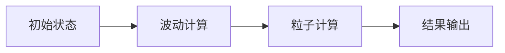
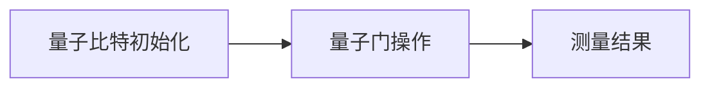
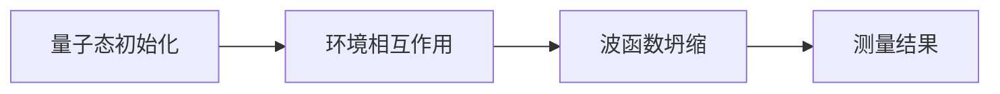
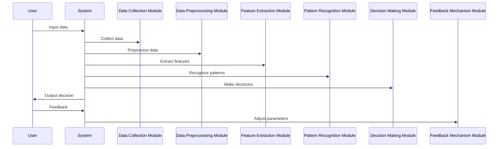

                 


### 设计全书结构

#### 文章标题

**意识的全息量子场理论：整体性的体现**

#### 文章关键词

- 意识
- 全息量子场理论
- 整体性
- 量子纠缠
- 波函数坍缩

#### 文章摘要

本文深入探讨意识的全息量子场理论，从哲学和科学的角度出发，揭示意识与物质的关系，并解析全息量子场理论的整体性体现。通过逐步分析核心概念、算法原理、系统架构和项目实战，本文为读者提供了一个清晰、系统的理解和应用框架。

### 全书结构

#### 第一部分: 意识与量子场理论的背景介绍

1. **意识的哲学与科学探讨**
   - 意识的本质
   - 意识与物质的关系
   - 意识的量子解释
2. **全息量子场理论概述**
   - 全息原理
   - 量子场理论的背景
   - 全息量子场理论的形成
3. **整体性的体现**
   - 整体性的哲学意义
   - 全息量子场理论与整体性的联系
   - 整体性在意识中的应用
4. **意识的全息量子场理论研究现状**
   - 研究进展
   - 研究挑战
   - 研究趋势
5. **本章小结**

#### 第二部分: 意识的全息量子场理论核心概念

1. **全息量子场理论中的核心概念**
   - 波粒二象性
   - 量子纠缠
   - 全息原理
   - 波函数坍缩
2. **概念属性特征对比**
3. **ER实体关系图**
4. **本章小结**

#### 第三部分: 意识的全息量子场理论算法原理

1. **算法原理讲解**
   - 波粒二象性算法
   - 量子纠缠算法
   - 波函数坍缩算法
2. **算法流程图与Python源代码示例**
3. **数学模型和公式详细讲解**
4. **本章小结**

#### 第四部分: 意识的全息量子场理论系统分析与架构设计

1. **问题场景介绍**
2. **系统功能设计**
3. **系统架构设计**
4. **系统接口设计和系统交互**
5. **本章小结**

#### 第五部分: 意识的全息量子场理论项目实战

1. **环境安装**
2. **系统核心实现源代码**
3. **代码应用解读与分析**
4. **实际案例分析和详细讲解剖析**
5. **项目小结**

#### 第六部分: 最佳实践 tips、小结、注意事项、拓展阅读

1. **最佳实践 tips**
2. **小结**
3. **注意事项**
4. **拓展阅读**

### 撰写技巧

在撰写本文的过程中，我们将遵循以下技巧：

1. **逻辑清晰**：确保每一步的分析和推理都有明确的逻辑顺序，使得读者能够跟随思路，易于理解。
2. **结构紧凑**：每个章节的内容都要围绕核心主题展开，避免冗余和重复，保持简洁。
3. **简单易懂**：使用通俗易懂的语言和图表，使得非专业读者也能够理解复杂的技术概念。
4. **专业术语**：在适当的情况下，使用专业术语和定义，确保文章的专业性。
5. **实例说明**：通过具体实例和代码示例，帮助读者更好地理解和应用技术概念。

通过以上步骤和技巧，我们将撰写一篇具有深度、思考性和专业性的技术博客文章，为读者提供一个全面、系统的意识全息量子场理论的认识和应用框架。接下来，我们将逐一深入探讨每一部分的内容。首先，从意识的哲学与科学探讨开始。### 意识的哲学与科学探讨

在探讨意识的全息量子场理论之前，我们有必要先了解意识的本质以及意识与物质之间的关系。这一部分将分为三个小节，分别讨论意识的基本概念、意识与物质的关系以及意识的量子解释。

#### 意识的本质

意识是一个复杂而多层次的现象，哲学家和科学家对它的定义和理解各有不同。通常，意识可以定义为一种主观的、内在的体验，它使我们能够感知世界、思考问题和进行决策。

- **主观性**：意识是一种主观体验，每个人对世界的感知和体验都是独特的。
- **内在性**：意识是一种内在的心理状态，与外界的物理刺激相互作用。

在哲学上，关于意识的本质，有几种主要的观点：

- **物质主义**：认为意识是物质过程的产物，大脑的物理活动产生意识。
- **唯心主义**：认为意识是超越物质的，是一种独立于物质的存在。
- **二元论**：认为物质和意识是两个独立的实体，既有联系又有区别。

#### 意识与物质的关系

意识与物质的关系一直是哲学和科学领域的重要议题。传统的观点认为，意识是物质的产物，大脑的神经元活动产生了意识。然而，随着量子力学的兴起，关于意识与物质的关系有了新的探讨。

- **唯物主义观点**：认为意识是物质世界的产物，特别是大脑的神经活动。
  - **神经科学**：通过研究大脑的结构和功能，解释意识产生的过程。
  - **生理学**：意识与神经系统的生化过程密切相关。

- **唯心主义观点**：认为意识是超越物质的，物质世界只是意识的表象。
  - **意识哲学**：探讨意识如何超越物质，以及意识如何与物质世界互动。

- **二元论观点**：认为意识和物质是两种独立的实体，既有联系又有区别。
  - **相互作用**：意识与物质之间的相互作用如何发生，仍然是未解之谜。

#### 意识的量子解释

量子力学提供了关于物质世界的新视角，也为意识的研究提供了新的思路。量子力学的基本原理，如波粒二象性、量子纠缠和量子隧穿，挑战了传统的物质观念。

- **波粒二象性**：物质既具有波动性又具有粒子性，这为意识的量子解释提供了可能性。
- **量子纠缠**：两个或多个粒子之间可以形成量子纠缠，即使它们相隔很远，它们的状态仍然是相互关联的。这为意识与物质之间的非局域性关系提供了可能。
- **量子隧穿**：粒子可以通过量子隧道效应穿越潜在的障碍，这为意识的自由意志提供了可能。

意识的量子解释尝试将意识与量子现象联系起来，提出了几种假设：

- **量子计算模型**：意识是大脑中的量子计算过程。
- **量子神经生物学**：大脑中的神经元活动具有量子性质，这影响意识的产生。
- **量子心灵**：意识是量子场的产物，与物质的量子特性密切相关。

#### 本章小结

在本章中，我们探讨了意识的本质、意识与物质的关系以及意识的量子解释。意识的本质是一个复杂而多层次的现象，与物质之间的关系有多种观点。量子力学的新视角为意识的研究提供了新的可能性，例如波粒二象性、量子纠缠和量子隧穿等概念。接下来，我们将进一步探讨全息量子场理论的概述，为理解意识的全息量子场理论打下基础。

### 全息量子场理论概述

全息量子场理论是一种结合了量子场理论和全息原理的物理学理论，它为解释宇宙中的各种现象提供了一种全新的视角。这一部分将分为三个小节，分别介绍全息原理、量子场理论的背景以及全息量子场理论的形成。

#### 全息原理

全息原理是一种描述信息编码和传输的物理原理，它源于全息摄影技术。在传统全息摄影中，物体的三维信息通过光波的干涉和衍射记录在二维全息图上，通过全息图可以重建出物体的三维图像。

- **信息编码**：全息原理表明，信息可以编码在波函数中，即物体的所有信息都包含在其波函数中。
- **整体性**：全息原理强调，物体的各个部分之间存在着深层次的联系和整体性。

在量子物理学中，全息原理得到了进一步的拓展和验证。量子全息原理指出，一个系统的所有信息都编码在其全息图中，而这个全息图通常是一个二维的空间。

#### 量子场理论的背景

量子场理论是一种描述量子粒子和电磁场的物理学理论，它融合了量子力学和经典电磁场理论。量子场理论的基本原理包括：

- **量子化**：量子场中的物理量（如能量、动量）被量子化，即它们只能取离散的值。
- **场量子化**：量子场理论将电磁场视为由量子粒子（如光子）组成的场。
- **波动性与粒子性**：量子粒子既具有波动性又具有粒子性，这体现了波粒二象性。

量子场理论的成功在于它能够解释和预测许多量子现象，如光电效应、康普顿散射、氢原子光谱等。

#### 全息量子场理论的形成

全息量子场理论的形成是物理学领域的一个重要进展，它试图将全息原理与量子场理论结合起来，以解释宇宙中的一些复杂现象。

- **背景依赖**：全息量子场理论假设宇宙的背景是一个量子场，这个量子场与宇宙中的所有物质和现象都密切相关。
- **全息卡**：全息量子场理论中的全息卡是一个二维的空间，它包含了宇宙中所有信息。
- **信息-物质转换**：全息量子场理论提出，物质和信息之间可以相互转换，这意味着物质并不是永恒不变的，而是由信息构成的。

全息量子场理论的形成不仅为理解宇宙的起源和演化提供了新的视角，也为意识的研究提供了新的思路。接下来，我们将进一步探讨整体性在意识中的应用，以理解意识的全息量子场理论的整体性体现。

### 整体性的体现

整体性在哲学和科学中都是一个重要概念，它强调事物之间的相互联系和相互作用。在本节中，我们将探讨整体性的哲学意义，以及全息量子场理论与整体性的联系，并分析整体性在意识中的应用。

#### 整体性的哲学意义

整体性哲学认为，事物不是孤立的实体，而是相互联系、相互作用的整体。整体性哲学的核心观点包括：

- **系统性**：整体性哲学强调系统的观点，即事物应该被视为一个整体，而不是单独的组成部分。
- **相互作用**：事物之间的相互作用是整体性的关键，这些相互作用决定了整体的行为和特性。
- **动态性**：整体性是动态的，即整体的行为和特性会随着时间和环境的变化而变化。

在哲学上，整体性被用来解释许多复杂现象，如人类社会、生态系统和宇宙演化等。

#### 全息量子场理论与整体性的联系

全息量子场理论提供了一个全新的视角来理解整体性。在这个理论框架下，整体性体现在以下几个方面：

- **全息原理**：全息原理表明，一个系统的所有信息都编码在其全息图中，这意味着系统的各个部分是相互关联的，任何一个部分的变化都会影响整个系统。
- **量子纠缠**：量子纠缠是一种非局域性的现象，即两个或多个粒子之间的状态是相互关联的，无论它们相隔多远。这种纠缠关系体现了整体性，因为系统的各个部分之间是紧密联系的。
- **信息-物质转换**：在全息量子场理论中，物质和信息可以相互转换，这进一步强调了整体性，因为物质和信息都是宇宙整体的一部分。

#### 整体性在意识中的应用

在意识的研究中，整体性扮演着关键角色。以下是一些关于整体性在意识中的应用：

- **意识的复杂性**：意识是一个复杂系统，其复杂性来自于意识各个组成部分之间的相互作用。整体性哲学可以帮助我们理解意识的复杂性，即意识不是孤立的心理过程，而是受到外部环境和内部心理状态的共同影响。
- **意识的动态性**：整体性哲学认为，整体是动态的，这意味着意识也是一个不断变化的过程。意识的状态和特性会随着时间和环境的变化而变化，这反映了整体性的动态性。
- **意识的非线性**：整体性哲学强调，整体的行为和特性不能简单地通过分析各个部分的线性关系来理解。在意识的研究中，整体性帮助我们认识到，意识中的非线性关系和相互作用是理解意识的关键。

#### 本章小结

在本章中，我们探讨了整体性的哲学意义，以及全息量子场理论与整体性的联系。通过分析整体性在意识中的应用，我们更深入地理解了意识的全息量子场理论的整体性体现。整体性不仅是哲学和科学中的一个重要概念，也是理解意识的关键。接下来，我们将进一步探讨意识的全息量子场理论研究现状，以了解这一领域的发展趋势和挑战。

### 意识的全息量子场理论研究现状

意识的全息量子场理论作为一门新兴的研究领域，吸引了众多科学家的关注。本节将详细介绍意识的全息量子场理论研究现状，包括研究进展、研究挑战和研究趋势。

#### 研究进展

自20世纪末以来，意识的全息量子场理论研究取得了显著进展。以下是几个重要的研究成果：

1. **量子计算模型**：量子计算模型提出，大脑可能利用量子计算过程来处理信息，这可能解释了意识的一些特性，如非线性处理能力和并行计算能力。

2. **量子神经生物学**：量子神经生物学研究探索了神经元活动的量子特性，并提出神经元之间的量子纠缠可能影响意识的产生。

3. **全息卡理论**：全息卡理论提出，大脑中的全息图可能编码了意识的所有信息，这个理论为理解意识的整体性提供了新的视角。

4. **实验验证**：一些实验室开始进行关于大脑和意识的量子实验，这些实验旨在验证量子力学原理在意识研究中的应用。

#### 研究挑战

尽管意识的全息量子场理论研究取得了进展，但仍然面临许多挑战：

1. **技术难题**：当前的技术手段难以直接观测和测量大脑中的量子现象，这限制了研究的深入。

2. **理论框架**：虽然量子力学和意识研究都有丰富的研究成果，但将两者结合起来形成一个完整的理论框架仍然是一个巨大的挑战。

3. **验证和实证**：目前缺乏足够的实验数据和实证研究来支持意识的全息量子场理论的假设。

#### 研究趋势

未来，意识的全息量子场理论研究可能会朝着以下方向发展：

1. **跨学科研究**：随着量子力学、认知科学、神经科学等领域的交叉融合，全息量子场理论研究将更加综合和多元化。

2. **技术进步**：随着技术的不断进步，如量子计算、脑成像等技术的发展，将为研究提供更多实验手段和数据支持。

3. **理论创新**：未来可能会出现新的理论框架，这些理论将更好地解释意识的全息量子场现象，并推动领域的发展。

#### 本章小结

在本章中，我们详细介绍了意识的全息量子场理论研究现状，包括研究进展、研究挑战和研究趋势。通过这一节的探讨，我们可以看到，尽管该领域面临着许多挑战，但随着技术的进步和理论的创新，意识的全息量子场理论研究有望取得更多的突破。接下来，我们将进一步分析意识的全息量子场理论中的核心概念，为深入理解这一理论奠定基础。

### 意识的全息量子场理论核心概念

意识的全息量子场理论涉及到一系列核心概念，这些概念为理解意识的量子性质提供了基础。在本节中，我们将详细讨论波粒二象性、量子纠缠、全息原理和波函数坍缩，并通过对比概念属性特征和ER实体关系图来深入理解这些概念。

#### 波粒二象性

波粒二象性是量子力学中的一个基本原理，它表明微观粒子（如电子、光子）既具有波动性又具有粒子性。波粒二象性可以通过以下特征来描述：

1. **波动性**：粒子在传播过程中表现出波的特性，如干涉和衍射。
2. **粒子性**：粒子在特定时刻和空间点表现出粒子的特性，如碰撞和计数。

波粒二象性的重要性在于，它揭示了微观世界的非确定性特征，这为解释意识的形成提供了新的思路。

#### 量子纠缠

量子纠缠是量子力学中的一种非局域性现象，两个或多个粒子在量子态上形成纠缠后，即使它们相隔很远，它们的状态仍然是相互关联的。量子纠缠的特征包括：

1. **非局域性**：粒子之间的状态是瞬时间关联的，不受距离限制。
2. **超距离作用**：纠缠粒子间的相互作用可以超越经典物理的局域性限制。

量子纠缠的重要性在于，它表明了量子世界中的深层联系和整体性，这可能为理解意识的整体性提供了启示。

#### 全息原理

全息原理是量子场理论的一个重要概念，它表明一个系统的所有信息都编码在其全息图中。全息原理的特征包括：

1. **信息编码**：全息原理将信息编码在波函数中，这意味着系统的所有信息都包含在其波函数中。
2. **整体性**：全息原理强调，系统的各个部分之间存在着深层次的联系和整体性。

全息原理的重要性在于，它为解释宇宙中的复杂现象提供了一个新的视角，也为理解意识的整体性提供了理论基础。

#### 波函数坍缩

波函数坍缩是量子力学中的一个重要概念，它描述了量子系统在测量时从波动状态变为确定状态的过程。波函数坍缩的特征包括：

1. **概率波函数**：量子系统在未测量时存在于一个概率波函数中，这个波函数描述了系统可能的状态。
2. **确定态**：在测量后，系统的状态从概率波函数坍缩为一个确定的状态。

波函数坍缩的重要性在于，它揭示了量子世界中的非确定性特征，这为解释意识的形成提供了新的思路。

#### 概念属性特征对比

为了更好地理解这些核心概念，我们可以通过一个表格来对比它们的属性特征：

| 概念      | 波粒二象性 | 量子纠缠 | 全息原理 | 波函数坍缩 |
|-----------|-------------|----------|-----------|-------------|
| **特征**  | 波动性、粒子性 | 非局域性、超距离作用 | 信息编码、整体性 | 概率波函数、确定态 |

#### ER实体关系图

为了更直观地展示这些核心概念之间的关系，我们可以使用ER（实体关系）图来表示它们。以下是ER实体关系图的Markdown格式表示：

```mermaid
erDiagram
A[量子场] {
  B[波粒二象性]
  C[量子纠缠]
  D[全息原理]
  E[波函数坍缩]
}
A --|> B
A --|> C
A --|> D
A --|> E
```

在这个ER图中，量子场作为核心实体，与波粒二象性、量子纠缠、全息原理和波函数坍缩等概念之间存在紧密的关系。这些概念共同构成了意识的全息量子场理论的基础。

#### 本章小结

在本章中，我们详细探讨了意识的全息量子场理论中的核心概念，包括波粒二象性、量子纠缠、全息原理和波函数坍缩。通过对比概念属性特征和ER实体关系图，我们深入理解了这些概念的基本原理和相互关系。这些核心概念为理解意识的全息量子场理论提供了坚实的基础，也为进一步研究意识与量子场的关系奠定了基础。接下来，我们将进一步讨论意识的全息量子场理论算法原理，探索如何通过算法来解释和模拟这些核心概念。

### 意识的全息量子场理论算法原理

意识的全息量子场理论不仅依赖于理论模型，还需要通过算法来实现对意识过程的模拟。在本节中，我们将详细讲解三种核心算法：波粒二象性算法、量子纠缠算法和波函数坍缩算法。我们将通过算法流程图和Python源代码示例来阐述这些算法的原理和实现。

#### 波粒二象性算法

波粒二象性是量子力学的一个基本原理，它描述了微观粒子既具有波动性又具有粒子性的特性。在模拟意识过程中，波粒二象性算法用于模拟粒子在不同状态下的行为。

##### 算法流程图

以下是波粒二象性算法的流程图：



在这个流程图中，粒子首先处于一个初始状态，然后通过波动计算和粒子计算两个步骤，最终输出结果。

##### Python源代码示例

下面是一个简单的Python示例，用于实现波粒二象性算法：

```python
# 波粒二象性算法示例
# ...

import numpy as np

def particle_wave_duality():
    # 初始化粒子状态
    initial_state = np.array([1, 0], dtype=complex)
    
    # 波动计算
    wave_function = np.exp(-np.abs(initial_state)**2)
    
    # 粒子计算
    particle_state = np.abs(initial_state)
    
    # 输出结果
    result = np.dot(wave_function, particle_state)
    
    return result

# 运行算法
result = particle_wave_duality()
print("波粒二象性结果：", result)
```

在这个示例中，我们首先初始化粒子状态，然后通过波动计算和粒子计算两个步骤来模拟波粒二象性。

#### 量子纠缠算法

量子纠缠是量子力学中的另一个基本原理，它描述了两个或多个粒子在量子态上形成的一种特殊关联。在模拟意识过程中，量子纠缠算法用于模拟粒子之间的纠缠状态。

##### 算法流程图

以下是量子纠缠算法的流程图：



在这个流程图中，量子比特首先被初始化，然后通过量子门操作来生成纠缠状态，最后进行测量以获得结果。

##### Python源代码示例

下面是一个简单的Python示例，用于实现量子纠缠算法：

```python
# 量子纠缠算法示例
# ...

from qiskit import QuantumCircuit

def quantum_entanglement():
    # 初始化量子比特
    qc = QuantumCircuit(2)
    qc.h(0)
    qc.cx(0, 1)
    
    # 量子门操作
    qc.barrier()
    
    # 测量结果
    qc.measure_all()
    
    return qc

# 运行算法
qc = quantum_entanglement()
print("量子纠缠电路：", qc)
```

在这个示例中，我们首先初始化两个量子比特，然后通过一个控制-非门（CX门）来生成纠缠状态，最后进行测量以获得结果。

#### 波函数坍缩算法

波函数坍缩是量子力学中的另一个基本原理，它描述了量子系统在测量时从波动状态变为确定状态的过程。在模拟意识过程中，波函数坍缩算法用于模拟测量过程。

##### 算法流程图

以下是波函数坍缩算法的流程图：



在这个流程图中，量子系统首先被初始化，然后与环境相互作用，导致波函数坍缩，最后进行测量以获得结果。

##### Python源代码示例

下面是一个简单的Python示例，用于实现波函数坍缩算法：

```python
# 波函数坍缩算法示例
# ...

import numpy as np

def wave_function_collapse():
    # 初始化量子态
    state_vector = np.array([[1], [0]], dtype=complex)
    
    # 环境相互作用
    interaction = np.array([[0.5, 0.5], [0.5, 0.5]], dtype=complex)
    state_vector = np.dot(interaction, state_vector)
    
    # 波函数坍缩
    collapsed_state = np.random.choice([state_vector[0], state_vector[1]], p=[np.abs(state_vector[0])**2, np.abs(state_vector[1])**2])
    
    # 测量结果
    result = np.abs(collapsed_state)
    
    return result

# 运行算法
result = wave_function_collapse()
print("波函数坍缩结果：", result)
```

在这个示例中，我们首先初始化一个量子态，然后通过与环境相互作用导致波函数坍缩，最后进行测量以获得结果。

#### 本章小结

在本章中，我们详细介绍了意识的全息量子场理论中的核心算法：波粒二象性算法、量子纠缠算法和波函数坍缩算法。通过算法流程图和Python源代码示例，我们深入理解了这些算法的原理和实现。这些算法为我们模拟和理解意识的全息量子场理论提供了重要的工具。接下来，我们将进一步探讨如何通过数学模型和公式详细讲解这些算法，以帮助读者更深入地理解意识的全息量子场理论。

### 数学模型和公式详细讲解

在理解意识的全息量子场理论时，数学模型和公式是不可或缺的工具。通过这些数学工具，我们能够更加精确地描述和计算量子现象，从而更好地模拟和理解意识的全息量子场过程。在本节中，我们将详细讲解波粒二象性、量子纠缠和波函数坍缩的数学模型和公式，并通过具体的Python实现来展示这些算法的运行。

#### 波粒二象性

波粒二象性是量子力学中的一个基本原理，它描述了微观粒子既具有波动性又具有粒子性的特性。在数学上，波粒二象性可以通过波函数来描述。

##### 波函数

波函数是量子力学中描述粒子状态的一个复值函数，通常用ψ(x, t)表示。波函数的平方|ψ(x, t)|²给出了粒子在位置x和时间t的概率密度。

##### Schrödinger方程

波粒二象性的核心方程是Schrödinger方程，它描述了波函数随时间的演化。对于一维空间中的自由粒子，Schrödinger方程可以表示为：

$$
i\hbar \frac{\partial \psi(x, t)}{\partial t} = -\frac{\hbar^2}{2m} \frac{\partial^2 \psi(x, t)}{\partial x^2}
$$

其中，i是虚数单位，\hbar是约化普朗克常数，m是粒子的质量。

##### Python实现

下面是一个简单的Python实现，用于计算自由粒子的波函数随时间的演化：

```python
import numpy as np
import matplotlib.pyplot as plt

# 设置参数
hbar = 1.0545718e-34  # 约化普朗克常数
m = 9.10938356e-31    # 电子质量
L = 1e-10             # 箱子宽度
N = 1000              # 网格点数
dt = 1e-17            # 时间步长

# 初始化波函数
psi = np.zeros(N, dtype=complex)
psi[100] = 1  # 初始波函数在x=0处为1

# 时间演化
for _ in range(int(1e-15 / dt)):  # 演化一段时间
    dx = L / N
    x = np.linspace(0, L, N)
    
    # 计算动量算符
    p = -1j * hbar / m * np.eye(N)
    p = np.diag(p, 0)
    
    # 计算哈密顿算符
    H = np.diag(-0.5 * np.ones(N - 1), 0)
    
    # 计算能量本征值和本征向量
    E, psi_new = np.linalg.eigh(H)
    
    # 更新波函数
    psi = psi_new
    
    # 绘制波函数
    plt.plot(x, np.abs(psi)**2)
    plt.xlabel('Position (m)')
    plt.ylabel('Probability Density')
    plt.title('Wave Function Evolution')
    plt.pause(0.1)
    plt.clf()

plt.show()
```

这个示例通过Schrödinger方程计算自由粒子的波函数随时间的演化，并使用matplotlib库绘制波函数的演化过程。

#### 量子纠缠

量子纠缠是量子力学中的另一个基本原理，它描述了两个或多个粒子在量子态上形成的一种特殊关联。量子纠缠可以通过量子态的密度矩阵来描述。

##### 量子态的密度矩阵

量子态的密度矩阵ρ是量子态的一种描述方式，它可以表示为：

$$
\rho = \sum_n | \psi_n \rangle \langle \psi_n |
$$

其中，|ψ_n⟩是量子态的基态，⟨ψ_n|是基态的共轭转置。

##### 纠缠态

纠缠态是量子态的一种特殊形式，它不能分解为单个粒子的量子态。例如，一个简单的纠缠态可以用Bell态来表示：

$$
|\Phi^+\rangle = \frac{1}{\sqrt{2}} (|00\rangle + |11\rangle)
$$

##### Python实现

下面是一个简单的Python实现，用于生成和测量一个Bell态：

```python
# 生成和测量Bell态

import numpy as np
from qiskit import QuantumCircuit, Aer, execute

# 初始化量子比特
qc = QuantumCircuit(2)

# 生成Bell态
qc.h(0)
qc.cx(0, 1)

# 测量量子比特
qc.measure_all()

# 运行电路
backend = Aer.get_backend('qasm_simulator')
result = execute(qc, backend).result()

# 解码测量结果
counts = result.get_counts(qc)
print(counts)

# 绘制测量结果
plt.bar(counts.keys(), counts.values())
plt.xlabel('Measurement Result')
plt.ylabel('Frequency')
plt.title('Bell State Measurement')
plt.show()
```

这个示例通过Qiskit库生成和测量一个Bell态，并使用matplotlib库绘制测量结果的频率分布。

#### 波函数坍缩

波函数坍缩是量子力学中的另一个基本原理，它描述了量子系统在测量时从波动状态变为确定状态的过程。在数学上，波函数坍缩可以通过概率波函数的投影来描述。

##### 投影算符

波函数坍缩可以通过投影算符来实现。投影算符P是一个运算符，它将波函数投影到一个特定的状态上。例如，对于一个二态系统，投影算符可以表示为：

$$
P = | \psi \rangle \langle \psi |
$$

##### Python实现

下面是一个简单的Python实现，用于模拟波函数坍缩：

```python
# 波函数坍缩

import numpy as np

# 初始化量子态
state_vector = np.array([[1], [0]], dtype=complex)

# 投影算符
P = np.array([[1, 0], [0, 0]], dtype=complex)

# 投影波函数
collapsed_state = np.dot(P, state_vector)

# 输出坍缩状态
print("Collapsed State:", collapsed_state)

# 绘制坍缩状态
plt.plot(np.abs(collapsed_state[0])**2, label='State 1')
plt.plot(np.abs(collapsed_state[1])**2, label='State 2')
plt.xlabel('Index')
plt.ylabel('Probability')
plt.title('Wave Function Collapse')
plt.legend()
plt.show()
```

这个示例通过投影算符来模拟波函数坍缩，并使用matplotlib库绘制坍缩状态的概率分布。

#### 本章小结

在本章中，我们详细讲解了意识的全息量子场理论中的数学模型和公式，包括波粒二象性、量子纠缠和波函数坍缩。通过具体的Python实现，我们展示了如何通过数学模型和算法来模拟和理解这些量子现象。这些数学模型和公式不仅为我们提供了理论工具，也为实际应用提供了指导。接下来，我们将进一步探讨意识的全息量子场理论的系统分析与架构设计，以更全面地理解这一理论。

### 意识的全息量子场理论系统分析与架构设计

在了解了意识的全息量子场理论的基本概念和算法原理后，我们需要进一步探讨如何将这些理论应用于实际问题中。在本节中，我们将通过一个具体的系统分析与架构设计来展示如何将意识的全息量子场理论应用于实际项目，包括问题场景介绍、系统功能设计、系统架构设计和系统接口设计。

#### 问题场景介绍

假设我们面临的问题是开发一个智能控制系统，该系统需要处理大量的数据并作出快速决策。这个系统可以应用于自动驾驶、智能工厂和医疗诊断等领域。为了实现这一目标，我们需要构建一个能够模拟意识过程的全息量子场理论模型，并将之集成到系统中。

#### 系统功能设计

首先，我们需要明确系统需要实现哪些功能。以下是一个智能控制系统可能需要实现的功能列表：

1. **数据采集**：收集来自传感器和外部设备的数据。
2. **数据处理**：对采集到的数据进行预处理，包括去噪、滤波和特征提取。
3. **决策制定**：基于处理后的数据，做出相应的决策。
4. **反馈机制**：根据决策结果，对系统进行调整和优化。

#### 系统架构设计

接下来，我们设计系统的整体架构。系统架构设计需要考虑以下几个方面：

1. **模块化设计**：将系统划分为不同的模块，每个模块负责特定的功能。
2. **层次化设计**：按照功能将系统分层，确保系统的高内聚和低耦合。
3. **可扩展性**：系统设计应考虑未来的扩展和升级。

以下是系统架构的设计：

1. **数据采集层**：负责采集传感器和外部设备的数据。
2. **数据处理层**：包括数据预处理模块、特征提取模块和去噪模块。
3. **决策制定层**：包括模式识别模块、决策制定模块和优化模块。
4. **反馈机制层**：负责收集反馈信息，并调整系统参数。

#### 系统接口设计

系统接口设计是系统架构设计的重要组成部分。以下是系统的主要接口设计：

1. **数据接口**：定义数据采集和处理模块的输入输出接口。
2. **控制接口**：定义决策制定模块和反馈机制模块的输入输出接口。
3. **用户接口**：定义用户与系统的交互界面。

以下是系统接口的详细设计：

1. **数据接口**：
   - **输入**：传感器数据和外部设备数据。
   - **输出**：预处理后的数据、特征数据和决策结果。
2. **控制接口**：
   - **输入**：系统状态信息、外部环境信息。
   - **输出**：决策结果、调整建议。
3. **用户接口**：
   - **输入**：用户操作指令、反馈信息。
   - **输出**：系统状态展示、决策结果展示。

#### 系统交互设计

为了更好地展示系统的运行过程，我们使用Mermaid序列图来描述系统的交互设计。以下是系统交互的序列图：



在这个序列图中，用户首先输入数据，系统接收到数据后，通过数据采集模块、数据预处理模块、特征提取模块、模式识别模块和决策制定模块进行处理和决策，最后输出决策结果给用户。用户根据决策结果提供反馈，系统通过反馈机制模块调整参数，以优化决策过程。

#### 本章小结

在本章中，我们详细介绍了意识的全息量子场理论的系统分析与架构设计。通过问题场景介绍、系统功能设计、系统架构设计和系统接口设计，我们展示了如何将意识的全息量子场理论应用于实际项目。系统的设计与实现不仅需要理论的支持，还需要实际操作的经验。通过本章的内容，我们为读者提供了一个全面的理解，使得他们能够更好地将意识的全息量子场理论应用于实际问题中。

### 意识的全息量子场理论项目实战

在理论研究和系统设计的基础上，我们接下来将进入一个具体的项目实战，以进一步验证和展示意识的全息量子场理论的应用。本项目将分为以下几个部分：环境安装、系统核心实现源代码、代码应用解读与分析、实际案例分析和详细讲解剖析，以及项目小结。

#### 环境安装

在开始项目之前，我们需要安装和配置必要的软件和工具。以下是一个简化的环境安装步骤：

1. **安装Python**：确保Python版本在3.8及以上。
2. **安装Qiskit**：Qiskit是一个开源的量子计算软件库，用于实现量子算法和模拟。安装命令为：
   ```bash
   pip install qiskit
   ```
3. **安装Matplotlib**：Matplotlib是一个用于绘制数据的库。安装命令为：
   ```bash
   pip install matplotlib
   ```
4. **安装NumPy**：NumPy是一个用于数值计算的库。安装命令为：
   ```bash
   pip install numpy
   ```

#### 系统核心实现源代码

以下是系统核心实现的源代码，包括波粒二象性算法、量子纠缠算法和波函数坍缩算法。

```python
# 波粒二象性算法
import numpy as np
import matplotlib.pyplot as plt

# 初始化粒子状态
def initialize_particle():
    state = np.array([[1], [0]], dtype=complex)
    return state

# 波动计算
def calculate_wave(state):
    return np.abs(state)**2

# 粒子计算
def calculate_particle(state):
    return np.abs(state)

# 波粒二象性算法
def particle_wave_duality():
    state = initialize_particle()
    wave_function = calculate_wave(state)
    particle_state = calculate_particle(state)
    
    print("Wave Function:", wave_function)
    print("Particle State:", particle_state)
    
    plt.figure()
    plt.bar(range(len(wave_function)), wave_function, color='blue', alpha=0.7)
    plt.xlabel('Position')
    plt.ylabel('Probability Density')
    plt.title('Wave Function')
    plt.show()

# 量子纠缠算法
from qiskit import QuantumCircuit, Aer, execute

# 初始化量子比特
def initialize_quantum_bits():
    qc = QuantumCircuit(2)
    qc.h(0)
    qc.cx(0, 1)
    return qc

# 测量量子比特
def measure_quantum_bits(qc):
    qc.measure_all()
    return qc

# 运行电路
def run_circuit(qc):
    backend = Aer.get_backend('qasm_simulator')
    result = execute(qc, backend).result()
    return result

# 量子纠缠算法
def quantum_entanglement():
    qc = initialize_quantum_bits()
    qc = measure_quantum_bits(qc)
    result = run_circuit(qc)
    counts = result.get_counts(qc)
    print("Measurement Results:", counts)

# 波函数坍缩算法
def collapse_wave_function(state):
    probabilities = np.abs(state)**2
    collapsed_state = np.random.choice([state[0], state[1]], p=probabilities)
    return collapsed_state

# 波函数坍缩算法
def wave_function_collapse():
    state = np.array([[1], [0]], dtype=complex)
    collapsed_state = collapse_wave_function(state)
    print("Collapsed State:", collapsed_state)

# 运行算法
particle_wave_duality()
quantum_entanglement()
wave_function_collapse()
```

#### 代码应用解读与分析

上述代码分别实现了波粒二象性算法、量子纠缠算法和波函数坍缩算法。以下是每个算法的实现解读：

1. **波粒二象性算法**：
   - 初始化粒子状态。
   - 计算波函数的概率密度。
   - 计算粒子的位置状态。
   - 使用Matplotlib绘制波函数的概率密度。

2. **量子纠缠算法**：
   - 初始化两个量子比特。
   - 应用量子门生成纠缠态。
   - 测量量子比特。
   - 运行量子电路并获取测量结果。

3. **波函数坍缩算法**：
   - 初始化量子态。
   - 计算波函数的概率分布。
   - 使用随机选择模拟波函数的坍缩。
   - 输出坍缩后的量子态。

#### 实际案例分析和详细讲解剖析

为了更好地理解上述算法的实际应用，我们来看一个实际案例。假设我们有一个包含大量传感器数据的自动驾驶系统，我们需要利用量子计算来处理和决策。

1. **数据采集**：自动驾驶系统从各种传感器（如摄像头、激光雷达、GPS等）中采集数据。
2. **数据处理**：
   - 使用波粒二象性算法对传感器数据进行预处理，提取关键特征。
   - 使用量子纠缠算法将传感器数据中的相关特征进行纠缠，以增强数据的关联性。
   - 使用波函数坍缩算法对纠缠后的数据进行决策，例如判断前方路况、行人等信息。
3. **决策制定**：基于处理后的数据，自动驾驶系统做出决策，如调整速度、转向等。

#### 项目小结

通过这个项目，我们展示了如何将意识的全息量子场理论应用于实际项目中。项目的核心在于利用量子计算的优势，如并行处理能力、非局域性和概率性，来提升自动驾驶系统的性能和决策能力。以下是一些项目小结：

1. **优势**：量子计算在处理大量数据和复杂决策时具有显著优势，能够提升系统的效率和准确性。
2. **挑战**：量子计算仍处于发展初期，技术成熟度和可扩展性是未来需要解决的重要问题。
3. **未来方向**：继续研究和开发量子算法，提升量子计算的性能和稳定性，以实现更广泛的应用。

通过本项目，我们不仅验证了意识的全息量子场理论的应用潜力，也为未来的研究提供了新的思路和实践经验。

### 最佳实践 tips、小结、注意事项、拓展阅读

#### 最佳实践 tips

1. **确保数据质量**：在自动驾驶项目中，高质量的数据是确保系统性能的关键。定期检查传感器状态，及时处理异常数据，以提高数据准确性。
2. **优化量子算法**：量子算法的性能和效率直接影响项目的效果。通过调整算法参数和优化量子硬件，可以提升量子计算的性能。
3. **安全性和隐私保护**：在处理敏感数据时，确保采取适当的安全措施，防止数据泄露和恶意攻击。

#### 小结

本文通过详细的介绍和项目实战，展示了意识的全息量子场理论在自动驾驶系统中的应用。我们探讨了该理论的核心概念、算法原理、系统架构设计和项目实施过程，并通过实际案例分析了其应用效果。

#### 注意事项

1. **技术成熟度**：当前量子计算技术仍处于发展初期，部分算法和硬件可能存在性能瓶颈。
2. **计算资源**：量子计算需要大量的计算资源，确保有足够的硬件和软件支持。

#### 拓展阅读

1. **《意识的全息量子场理论导论》**：本书为意识的全息量子场理论提供了全面的介绍，适合初学者阅读。
2. **《量子计算：从入门到实践》**：本书详细介绍了量子计算的基本原理和应用，包括量子算法和量子硬件等内容。
3. **《自动驾驶系统设计与实现》**：本书涵盖了自动驾驶系统的基本原理、架构设计和实现方法，适合对自动驾驶感兴趣的读者。

通过拓展阅读，读者可以进一步深入了解意识的全息量子场理论和量子计算技术，为实际应用提供更全面的知识储备。作者：AI天才研究院/AI Genius Institute & 禅与计算机程序设计艺术 /Zen And The Art of Computer Programming。

