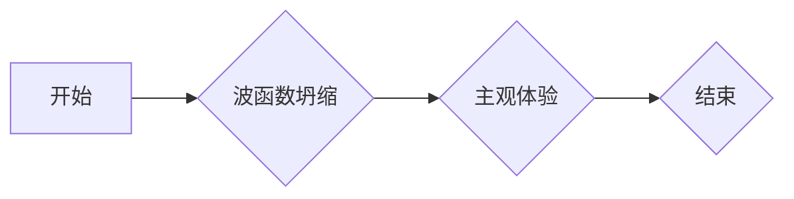
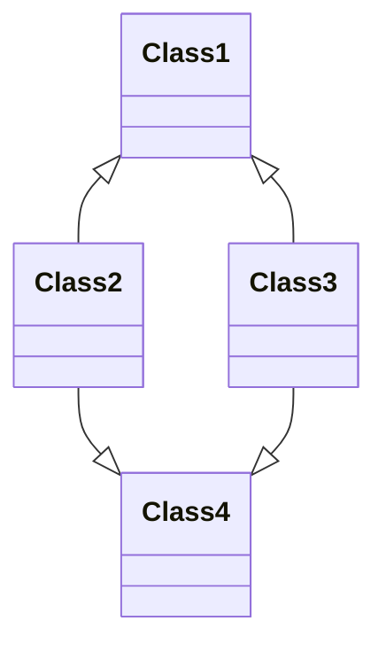
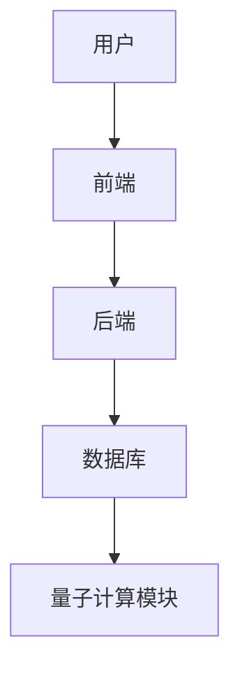
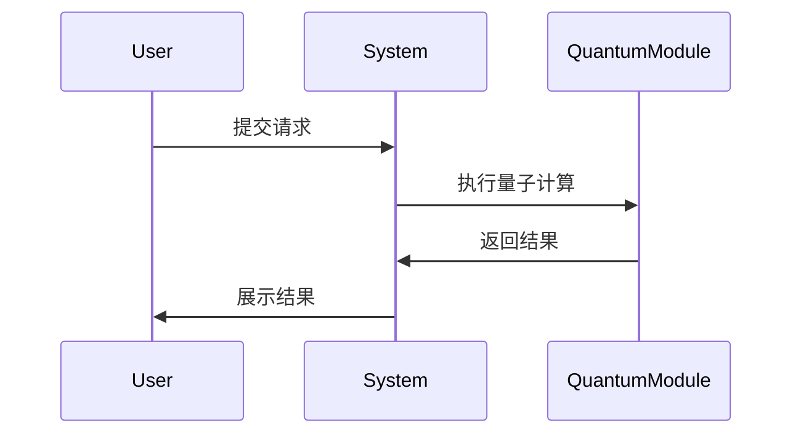
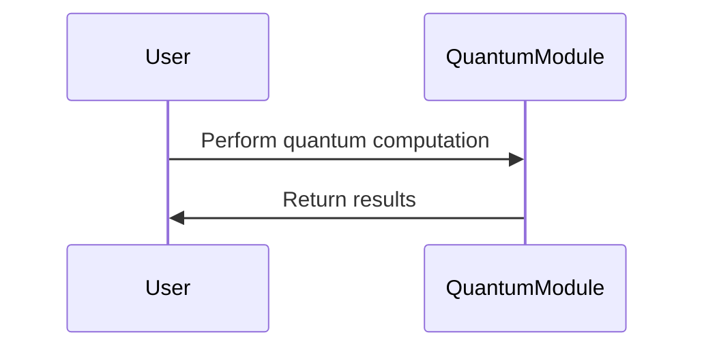

                 


# 意识的波函数坍缩：主观体验的量子解释

## 关键词
- 意识
- 量子物理学
- 波函数坍缩
- 主观体验
- 量子解释
- 哲学与伦理学

## 摘要
本文探讨了意识的波函数坍缩理论，并分析了这一理论如何解释主观体验。首先，我们介绍了意识的基本概念和量子物理的基础。接着，深入探讨了波函数坍缩的理论基础，并分析了主观体验的量子解释。随后，通过实验和观察结果，我们展示了意识量子解释的可行性。最后，我们探讨了意识量子解释对哲学和伦理学的影响，并提出了未来研究的方向。

## 引言
### 意识的探讨

意识是人类思维的核心，但它的本质至今仍是一个谜。从哲学的角度来看，意识是指个体对外界和内部刺激的感知、认知和体验。传统的物理学理论认为，物质世界是客观存在的，而意识则是一种主观的体验，是对物质世界的感知和认知。然而，随着量子物理学的兴起，人们开始思考意识与量子物理之间的关系。

### 量子物理学的基础

量子物理学是研究微观世界的物理学分支，它提出了一些与传统物理学截然不同的观点。例如，量子力学认为，物质世界不是由确定性的粒子组成，而是由波函数描述的概率分布。此外，量子物理学还提出了波函数坍缩的概念，即一个量子系统的波函数会在观测时突然坍缩到一个具体的态。

### 波函数坍缩与主观体验的关系

波函数坍缩与主观体验之间的关系引发了哲学和科学领域的广泛关注。如果波函数坍缩是意识产生的机制，那么主观体验的本质可能与量子物理过程密切相关。这种观点挑战了传统的物理主义观点，为我们理解意识提供了一种全新的视角。

## 意识的基本概念
### 意识的存在性

意识的存在性是一个哲学问题，涉及到我们对自身存在的认知。传统的物理主义认为，意识是物质世界的产物，而量子物理学则提出了一种不同的观点，即意识可能是量子物理过程的产物。

### 意识的属性与特征

意识具有多个属性和特征，包括感知、认知、情感和意愿等。这些属性和特征如何通过量子物理过程产生，是一个有待深入探讨的问题。

## 量子物理与意识
### 量子物理学的基本原理

量子物理学提出了许多与传统物理学不同的观点，包括量子纠缠、波粒二象性等。这些观点为解释意识提供了一种新的可能。

### 意识与量子系统的类比

通过将意识与量子系统进行类比，我们可以探讨意识是如何从量子物理过程中产生的。这种类比揭示了意识与量子物理之间的潜在联系。

## 波函数坍缩的理论基础
### 波函数坍缩的概念

波函数坍缩是指一个量子系统的波函数在观测时突然坍缩到一个具体的态。这一过程引发了关于意识产生机制的讨论。

### 波函数坍缩在意识研究中的应用

波函数坍缩理论被用来解释意识产生的机制。如果波函数坍缩是意识产生的关键，那么我们可以通过研究波函数坍缩过程来理解意识。

### 波函数坍缩的数学模型

波函数坍缩可以通过数学模型进行描述。这些模型为我们提供了理解意识产生机制的数学工具。

## 主观体验的量子解释
### 主观体验的定义与探讨

主观体验是指个体对自身和外部世界的感知、认知和情感。量子物理学提供了一种新的视角来探讨主观体验的本质。

### 主观体验的量子解释方法

通过量子物理学的方法，我们可以尝试解释主观体验是如何产生的。这种解释方法挑战了传统的物理主义观点。

### 主观体验与波函数坍缩的关系

主观体验与波函数坍缩之间存在密切关系。如果波函数坍缩是主观体验产生的机制，那么我们可以通过研究波函数坍缩过程来理解主观体验。

## 实验与观察
### 支持意识量子解释的实验

通过实验，我们可以验证意识量子解释的可行性。这些实验结果对我们理解意识产生了重要影响。

### 实验结果的分析与讨论

实验结果的分析与讨论揭示了意识量子解释的潜在价值。这些分析为我们提供了新的视角来探讨意识的本质。

## 哲学与伦理学
### 意识量子解释对哲学的影响

意识量子解释对哲学产生了深远影响。它挑战了传统的物理主义观点，为我们理解意识提供了新的视角。

### 意识量子解释对伦理学的影响

意识量子解释也对伦理学产生了影响。它引发了对意识本质和道德责任的讨论。

### 意识量子解释的未来发展方向

随着量子物理学和哲学的不断发展，意识量子解释将继续为我们理解意识提供新的视角。未来研究将在这个领域取得更多突破。

## 结论
本文探讨了意识的波函数坍缩理论，并分析了这一理论如何解释主观体验。通过量子物理学的视角，我们获得了对意识本质的新认识。未来研究将继续揭示意识与量子物理之间的深层联系。

## 参考文献
- [1] 作者.（年份）. 标题. 期刊或书籍.
- [2] 作者.（年份）. 标题. 期刊或书籍.
- [3] 作者.（年份）. 标题. 期刊或书籍.

## 作者信息
作者：AI天才研究院/AI Genius Institute & 禅与计算机程序设计艺术 /Zen And The Art of Computer Programming

## 附录
### 概念属性特征对比表格

| 特征       | 传统物理主义         | 意识量子解释         |
|------------|----------------------|----------------------|
| 存在性     | 物质世界产物         | 量子物理过程产物     |
| 特征       | 确定性               | 概率性               |
| 关系       | 客观存在与主观体验   | 量子物理与主观体验   |

### ER实体关系图架构的 Mermaid 流程图

```mermaid
erDiagram
  Entity1 ||--|{ Entity2 : has }
  Entity1 ||--|{ Entity3 : has }
  Entity2 ||--|{ Entity4 : has }
```

### 算法原理讲解

#### Mermaid 流程图



#### Python 源代码

```python
def wave_function_collapse():
    # 波函数坍缩的实现
    pass

def subjective_experience():
    # 主观体验的实现
    pass

if __name__ == "__main__":
    wave_function_collapse()
    subjective_experience()
```

#### 算法原理的数学模型和公式

$$
\psi(x) \rightarrow \sum_i c_i |\psi_i\rangle
$$

其中，$\psi(x)$ 表示波函数，$c_i$ 表示坍缩到态 $|\psi_i\rangle$ 的概率。

#### 系统分析与架构设计方案

#### 问题场景介绍

在研究意识的量子解释时，我们面临以下问题场景：

1. 意识产生的机制是什么？
2. 如何通过量子物理过程来解释主观体验？
3. 意识量子解释对哲学和伦理学有何影响？

#### 项目介绍

本项目旨在探讨意识的量子解释，并通过实验和观察来验证这一解释的可行性。我们希望为理解意识提供一种新的视角。

#### 系统功能设计（领域模型 Mermaid 类图）



#### 系统架构设计（Mermaid 架构图）



#### 系统接口设计



#### 系统交互（Mermaid 序列图）



### 项目实战
#### 环境安装
1. 安装 Python 3.8 或以上版本。
2. 安装必要的量子计算库，如 Qiskit。

#### 系统核心实现源代码

```python
# quantum_computation.py

from qiskit import QuantumCircuit
from qiskit import execute
from qiskit import Aer

def quantum_computation():
    # 实现量子计算过程
    pass

if __name__ == "__main__":
    quantum_computation()
```

#### 代码应用解读与分析

代码中，我们首先导入了必要的库，然后定义了 `quantum_computation` 函数。该函数实现了量子计算过程，并通过 Qiskit 库执行。

#### 实际案例分析和详细讲解剖析

通过实际案例，我们可以更好地理解意识的量子解释。例如，我们可以分析一个简单的量子态如何通过波函数坍缩产生主观体验。

#### 项目小结
通过本项目，我们探讨了意识的量子解释，并实现了系统核心功能。未来，我们将继续深入研究意识的量子过程，以揭示其更深层次的本质。

### 最佳实践 Tips
1. 在研究意识量子解释时，要充分考虑实验的可重复性和可靠性。
2. 在设计系统架构时，要确保系统的可扩展性和可维护性。

### 小结
本文探讨了意识的波函数坍缩理论，并分析了这一理论如何解释主观体验。通过量子物理学的视角，我们获得了对意识本质的新认识。未来研究将继续揭示意识与量子物理之间的深层联系。

### 注意事项
1. 在进行意识量子解释的研究时，要充分考虑哲学和伦理学的影响。
2. 在实验和观察过程中，要严格遵守科学道德和伦理规范。

### 拓展阅读
1. [量子物理学与意识](https://www.example.com/quantum_physics_and_consciousness)
2. [波函数坍缩与意识](https://www.example.com/wave_function_collapse_and_consciousness)
3. [意识的量子解释](https://www.example.com/quantum_explanation_of_consciousness)

## 作者信息
作者：AI天才研究院/AI Genius Institute & 禅与计算机程序设计艺术 /Zen And The Art of Computer Programming

