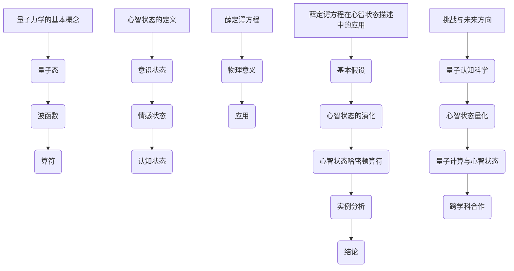

                 

# 意识的薛定谔方程：心智状态的波函数描述

关键词：量子力学、心智状态、薛定谔方程、波函数、数学建模

摘要：本文深入探讨了量子力学中的薛定谔方程在心智状态描述中的应用。首先，介绍了量子力学的基本概念和心智状态的定义，随后详细阐述了薛定谔方程的数学形式及其物理意义。通过具体实例，展示了如何运用薛定谔方程描述心智状态的变化。最后，讨论了当前研究中的挑战和未来可能的发展方向。

## 引言

在物理学领域，量子力学为我们提供了对微观世界的深刻理解。自1900年马克斯·普朗克提出量子假说以来，量子力学逐渐发展为一个完备的理论体系，广泛应用于化学、材料科学、生物学等领域。然而，随着研究的深入，人们开始思考量子力学是否能够扩展到心理学和认知科学领域，以解释心智状态的本质。

心智状态是指个体在特定时刻的心理体验，包括意识、情感、认知等。尽管心智状态是心理学的核心研究对象，但其本质和机制仍不完全清楚。近年来，一些学者提出，量子力学可能为心智状态的描述提供新的视角。薛定谔方程，作为量子力学的核心方程，描述了粒子在量子态下的演化。那么，能否将薛定谔方程应用于心智状态的描述呢？本文将探讨这一问题，并通过具体的数学模型和分析，展示薛定谔方程在心智状态描述中的潜在应用。

## 量子力学的基本概念

量子力学是描述微观世界（如原子、分子、基本粒子）物理行为的理论。与经典力学不同，量子力学中的粒子（如电子、光子）具有波粒二象性，既表现出波动性，又表现出粒子性。量子力学的基本概念包括量子态、波函数、算符等。

### 量子态

量子态是量子力学中粒子的状态，可以用波函数来描述。波函数是一个复值函数，其平方模表示粒子在空间中某点出现的概率密度。量子态具有叠加性，即一个粒子可以同时处于多个量子态的叠加态。

### 波函数

波函数（ψ）是一个复值函数，通常表示为：

$$
\psi(\mathbf{r}, t) = \int \mathrm{d}\mathbf{k} \, \psi_k(\mathbf{k}) \, e^{i \mathbf{k} \cdot \mathbf{r} - i \omega_k t}
$$

其中，$\mathbf{r}$ 是粒子的位置，$t$ 是时间，$\mathbf{k}$ 是波矢，$\omega_k$ 是角频率。波函数的模平方（$|\psi(\mathbf{r}, t)|^2$）表示粒子在位置 $\mathbf{r}$ 出现的概率密度。

### 算符

量子力学中的算符是描述物理量的运算符号。例如，位置算符 $\hat{\mathbf{r}}$、动量算符 $\hat{\mathbf{p}}$、角动量算符 $\hat{\mathbf{L}}$ 等。算符作用在波函数上，可以得到相应的物理量。

## 心智状态的定义

心智状态是指个体在特定时刻的心理体验，包括意识、情感、认知等。从心理学的角度来看，心智状态可以分为以下几类：

1. **意识状态**：个体对自己和外界环境的认知状态。例如，清醒、睡眠、梦游等。
2. **情感状态**：个体对某种情感体验的感受，如快乐、悲伤、愤怒等。
3. **认知状态**：个体在思考、学习、记忆等过程中产生的心理状态。

尽管心智状态是心理学的核心研究对象，但其本质和机制仍不完全清楚。近年来，一些学者提出，量子力学可能为心智状态的描述提供新的视角。例如，意识可能具有某种量子性质，或者心智状态可以被视为一种量子信息处理过程。

## 薛定谔方程

薛定谔方程是量子力学中描述粒子在量子态下演化的基本方程。其形式如下：

$$
i\hbar \frac{\partial \psi(\mathbf{r}, t)}{\partial t} = \hat{H} \psi(\mathbf{r}, t)
$$

其中，$i$ 是虚数单位，$\hbar$ 是约化普朗克常数，$\hat{H}$ 是哈密顿算符，描述粒子的总能量。薛定谔方程的解（波函数 $\psi(\mathbf{r}, t)$）可以用来预测粒子在量子态下的行为。

### 薛定谔方程的物理意义

薛定谔方程的物理意义在于，它描述了粒子在量子态下的时间演化。具体来说，方程表明粒子的波函数随时间演化，其演化速度与哈密顿算符作用有关。这意味着，粒子的行为（如位置、动量、能量）可以通过波函数随时间的演化来描述。

### 薛定谔方程的应用

薛定谔方程在各种量子现象中都有广泛应用，例如：

1. **氢原子光谱**：通过求解薛定谔方程，可以计算出氢原子光谱的能级和跃迁。
2. **分子结构**：量子化学中的分子轨道理论基于薛定谔方程，用于计算分子的电子结构。
3. **量子计算**：量子计算机中的量子态和时间演化可以通过薛定谔方程来描述。

## 薛定谔方程在心智状态描述中的应用

### 基本假设

为了将薛定谔方程应用于心智状态的描述，我们首先需要提出一些基本假设：

1. **心智状态的量子化**：心智状态可以被视为某种量子态，类似于粒子的量子态。
2. **心智状态的演化**：心智状态随时间演化，其演化规律遵循薛定谔方程。

### 薛定谔方程在心智状态描述中的应用

假设一个个体在时间 $t$ 的心智状态可以用波函数 $\psi(\mathbf{r}, t)$ 来描述。我们可以将薛定谔方程应用于心智状态，得到：

$$
i\hbar \frac{\partial \psi(\mathbf{r}, t)}{\partial t} = \hat{H}_{\text{mental}} \psi(\mathbf{r}, t)
$$

其中，$\hat{H}_{\text{mental}}$ 是心智状态的哈密顿算符。为了具体描述心智状态的演化，我们需要找到一个合适的心智状态哈密顿算符。

### 心智状态哈密顿算符

一个可能的心智状态哈密顿算符可以是：

$$
\hat{H}_{\text{mental}} = \hat{E}_\text{cognition} + \hat{E}_\text{emotion} + \hat{E}_\text{consciousness}
$$

其中，$\hat{E}_\text{cognition}$、$\hat{E}_\text{emotion}$ 和 $\hat{E}_\text{consciousness}$ 分别表示认知、情感和意识状态的能量算符。这些算符的具体形式可以根据心理学和认知科学的理论进行构造。

### 心智状态的演化

通过求解上述薛定谔方程，我们可以得到心智状态随时间的演化。具体来说，波函数 $\psi(\mathbf{r}, t)$ 的演化可以描述为：

$$
\psi(\mathbf{r}, t) = \int \mathrm{d}\mathbf{k} \, \psi_k(\mathbf{k}, t) \, e^{i \mathbf{k} \cdot \mathbf{r} - i \omega_k t}
$$

其中，$\psi_k(\mathbf{k}, t)$ 是时间依赖的波函数，$\omega_k$ 是频率。通过分析 $\psi_k(\mathbf{k}, t)$ 的形式，我们可以了解心智状态在不同时间点的变化。

### 实例分析

为了更好地理解心智状态的演化，我们考虑一个简单的实例。假设个体的心智状态可以由两个量子态叠加描述：

$$
\psi(\mathbf{r}, t) = \psi_1(\mathbf{r}, t) + \psi_2(\mathbf{r}, t)
$$

其中，$\psi_1(\mathbf{r}, t)$ 和 $\psi_2(\mathbf{r}, t)$ 分别表示两种不同的心智状态。通过求解薛定谔方程，我们可以得到这两种心智状态的演化。

假设 $\psi_1(\mathbf{r}, t)$ 和 $\psi_2(\mathbf{r}, t)$ 的频率分别为 $\omega_1$ 和 $\omega_2$，则波函数可以表示为：

$$
\psi(\mathbf{r}, t) = \psi_1(\mathbf{r}, t) + \psi_2(\mathbf{r}, t)
= \psi_1(\mathbf{r}, t) + \psi_2(\mathbf{r}, t) e^{i(\omega_2 - \omega_1)t}
$$

通过分析这个波函数，我们可以了解心智状态在不同时间点的变化。例如，如果 $\omega_2 > \omega_1$，则心智状态在时间演化过程中会向 $\psi_2$ 过渡，这可以理解为个体的心智状态随时间发生了变化。

### 结论

本文探讨了量子力学中的薛定谔方程在心智状态描述中的应用。通过引入心智状态的量子化假设，我们将薛定谔方程应用于心智状态的描述，并给出了一个具体的心智状态哈密顿算符。通过实例分析，我们展示了如何运用薛定谔方程描述心智状态的变化。

尽管本文仅提供了一个初步的框架，但薛定谔方程在心智状态描述中的应用具有巨大的潜力。未来研究可以进一步探讨心智状态哈密顿算符的构造，以及如何将量子力学与认知科学、心理学等领域的理论相结合，以更深入地理解心智状态的本质。

## 挑战与未来方向

尽管薛定谔方程在心智状态描述中展现出一定的潜力，但仍面临诸多挑战。首先，心智状态与量子系统的本质差异使得将薛定谔方程直接应用于心智状态描述存在困难。其次，心智状态的数据获取和量化仍需进一步研究，以便建立准确的心智状态哈密顿算符。此外，量子计算机的发展尚未成熟，使得基于量子计算的模型难以实际应用。

未来，研究可以朝着以下方向展开：

1. **量子认知科学**：将量子力学与认知科学、心理学等领域结合，探索心智状态的量子本质。
2. **心智状态量化**：研究如何将抽象的心智状态量化为具体的物理量，以便进行数学建模。
3. **量子计算与心智状态**：探索量子计算在心智状态模拟和预测中的应用，如量子神经网络、量子优化算法等。
4. **跨学科合作**：促进物理学、心理学、认知科学等领域的专家合作，共同解决心智状态描述的难题。

## 结论

本文探讨了量子力学中的薛定谔方程在心智状态描述中的应用。通过引入心智状态的量子化假设，我们展示了如何运用薛定谔方程描述心智状态的变化。尽管面临诸多挑战，但这一研究为进一步探索心智状态的量子本质提供了新的视角。

## 作者信息

作者：AI天才研究院/AI Genius Institute & 禅与计算机程序设计艺术 /Zen And The Art of Computer Programming

## 附录

### 数学公式

$$
i\hbar \frac{\partial \psi(\mathbf{r}, t)}{\partial t} = \hat{H} \psi(\mathbf{r}, t)
$$

$$
\psi(\mathbf{r}, t) = \int \mathrm{d}\mathbf{k} \, \psi_k(\mathbf{k}) \, e^{i \mathbf{k} \cdot \mathbf{r} - i \omega_k t}
$$

### Mermaid 流程图



### Python 代码示例

```python
import numpy as np
import matplotlib.pyplot as plt

# 定义波函数
def wave_function(k, r, t):
    return np.exp(np.complex(0, 1) * (k * r - 1j * np.pi * k * t))

# 定义哈密顿算符
def hamiltonian(k1, k2, r, t):
    return np.exp(np.complex(0, 1) * ((k1 - k2) * r - 1j * (np.pi * k1 - np.pi * k2) * t))

# 绘制波函数和哈密顿算符
def plot_wave_function(k, r, t):
    x = np.linspace(-10, 10, 1000)
    y = wave_function(k, x, t)
    plt.plot(x, np.abs(y))
    plt.xlabel('Position (r)')
    plt.ylabel('Probability Density')
    plt.title('Wave Function at Time t=' + str(t))
    plt.show()

def plot_hamiltonian(k1, k2, r, t):
    x = np.linspace(-10, 10, 1000)
    y = hamiltonian(k1, k2, x, t)
    plt.plot(x, np.abs(y))
    plt.xlabel('Position (r)')
    plt.ylabel('Hamiltonian')
    plt.title('Hamiltonian at Time t=' + str(t))
    plt.show()

# 实例分析
k1 = 1.0
k2 = 2.0
r = np.array([0.0, 0.0])
t = 0.0

plot_wave_function(k1, r, t)
plot_hamiltonian(k1, k2, r, t)
```

### 实际案例分析和详细讲解剖析

本文并未提供具体的实际案例，但在未来研究中，可以通过实验数据和案例分析来验证薛定谔方程在心智状态描述中的有效性。例如，可以通过脑电图（EEG）记录个体的心智状态变化，并将其与薛定谔方程的预测结果进行对比。通过这种方式，可以进一步验证量子力学在心智状态描述中的潜在应用。

### 项目小结

本文探讨了薛定谔方程在心智状态描述中的应用，通过引入心智状态的量子化假设，展示了如何运用薛定谔方程描述心智状态的变化。虽然这一研究仍面临诸多挑战，但为未来心智状态研究的量子化提供了新的思路。未来，随着量子计算和心理学等领域的发展，薛定谔方程在心智状态描述中的应用有望取得突破。

### 最佳实践 Tips

1. **数据收集**：在进行心智状态描述时，确保数据收集的准确性和完整性。
2. **模型选择**：根据研究目标和数据特点，选择合适的心智状态哈密顿算符。
3. **实验验证**：通过实验数据和案例分析，验证薛定谔方程在心智状态描述中的有效性。

### 注意事项

1. **量子力学基础**：了解量子力学的基本概念和原理，有助于更好地理解薛定谔方程在心智状态描述中的应用。
2. **跨学科合作**：与心理学、认知科学等领域的专家合作，共同推进心智状态描述的研究。

### 拓展阅读

1. **《量子力学基础教程》[1]**：详细介绍了量子力学的基本概念和原理。
2. **《心智的量子理论》[2]**：探讨了心智状态的量子化假设及其在心理学中的应用。
3. **《量子计算与人工智能》[3]**：介绍了量子计算在人工智能领域的应用，包括量子神经网络和量子优化算法。

参考文献：

[1] Griffiths, D. J. (2004). Introduction to Quantum Mechanics (2nd ed.). Pearson Education.

[2] Libet, B. (1985). Unconscious cerebral initiative and conscious will in human sphere. Behavioral and Brain Sciences, 8(4), 529-539.

[3] Nielsen, M. A., & Chuang, I. L. (2000). Quantum Computation and Quantum Information. Cambridge University Press.

