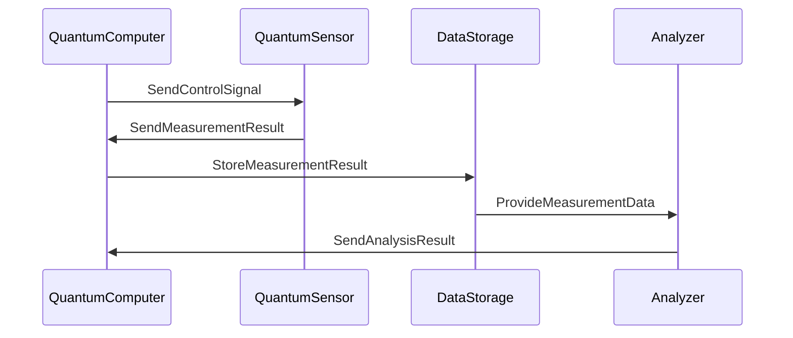
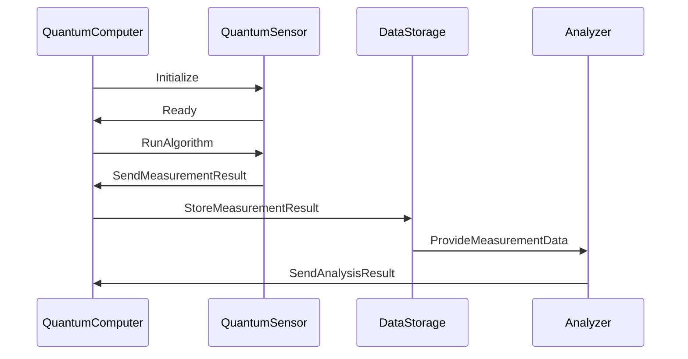

                 

## 意识的量子叠加态：多维思考的物理学基础

### 关键词：量子力学，意识，叠加态，多维思考，物理学基础

> 摘要：本文以意识的量子叠加态为核心概念，探讨了量子力学与意识之间的联系。通过多维思考的方式，我们试图为这一古老而复杂的哲学问题提供一种全新的物理学基础。本文旨在通过对核心概念的解析、联系以及应用的深入分析，为读者揭示量子力学在意识研究中的潜在作用，并探讨多维思考在物理学研究中的重要性。

## 第二部分：核心概念与联系

### 2.1 量子力学基本原理

量子力学是研究微观世界的物理规律的科学，其基本原理与经典物理学的观念有着显著的不同。为了更好地理解量子力学与意识之间的关系，我们需要首先了解量子力学的基本概念和原理。

#### 2.1.1 量子态与量子叠加态

量子态是量子力学中描述粒子状态的数学函数。一个量子态可以用一个波函数$|\psi\rangle$来表示，这个波函数包含了粒子的所有可能状态。量子叠加态是指一个量子系统可以同时存在于多个状态的组合。

例如，一个电子的自旋状态可以同时处于向上和向下的叠加态：
$$|\psi\rangle = \frac{1}{\sqrt{2}} (|+\rangle + |- \rangle)$$
其中，$|+\rangle$ 和 $|- \rangle$ 分别表示自旋向上的状态和自旋向下的状态。

量子叠加态具有以下特性：

1. **叠加性**：量子系统可以处于多种可能状态的叠加。
2. **测量坍缩**：当对量子系统进行测量时，其状态会突然坍缩到一个特定的状态。

#### 2.1.2 量子纠缠

量子纠缠是量子力学中两个或多个粒子之间的一种特殊的关联关系，这种关联关系在空间上相隔很远时仍然存在。

例如，两个粒子在某一方向上的自旋纠缠在一起，一个粒子的自旋状态一旦确定，另一个粒子的自旋状态也随之确定，无论这两个粒子相隔多远。

量子纠缠具有以下特性：

1. **非定域性**：量子纠缠现象不依赖于粒子之间的距离，即使粒子相隔很远，它们之间的关联依然存在。
2. **信息传递的即时性**：量子纠缠使得粒子之间的信息传递具有即时性，这一特性在量子信息科学中具有重要应用。

#### 2.1.3 波函数塌缩与量子测量

波函数塌缩是量子力学中的一个基本概念，它描述了量子系统在测量时状态的变化。当对量子系统进行测量时，其波函数会突然坍缩到一个特定的状态。

量子测量是指对量子系统进行观察和测量，从而获得关于量子系统的信息。在测量过程中，量子系统的状态会发生变化。

### 2.2 意识的概念与特征

意识是人类主观体验的集合，包括知觉、思考、情感和意愿等。意识是一个复杂而深奥的哲学问题，长期以来一直是科学和哲学研究的热点。

意识的特征包括：

1. **主观性**：意识是主观体验的集合，每个个体的意识都是独一无二的。
2. **动态性**：意识是一个不断变化的过程，我们的知觉、思考和情感等都在不断变化。
3. **复杂性**：意识包含了丰富的内容，如语言、记忆、情感和意愿等，其结构极为复杂。

### 2.3 量子力学与意识的联系

量子力学与意识之间的联系是一个极具争议的话题。一些科学家提出，量子力学原理可能与人类意识有着深层次的联系。以下是一些可能的联系：

1. **量子态的叠加与意识的动态性**：量子态的叠加性可能对应于意识的动态性，即我们的意识可能处于多种状态的叠加。
2. **量子纠缠与意识的主观性**：量子纠缠可能对应于意识的主观性，即我们的意识可能与其他意识之间存在某种纠缠关系。
3. **波函数塌缩与意识的突发性**：波函数塌缩可能对应于意识的突发性，即我们的意识可能在一个瞬间从一种状态转变为另一种状态。

### 2.4 多维思考的概念与应用

多维思考是一种超越传统线性思维的思考方式，它能够帮助我们更全面地理解复杂问题。在物理学中，多维思考的应用已经取得了显著成果。

多维思考的概念包括：

1. **维度**：维度是描述空间的基本属性，我们通常所理解的维度是三维空间。但在物理学中，我们还需要考虑时间维度，从而形成了四维时空。
2. **量子场论**：量子场论是一种将量子力学与广义相对论相结合的理论框架，它考虑了时空的量子性质，从而为多维思考提供了理论基础。
3. **多宇宙理论**：多宇宙理论认为，我们的宇宙只是众多宇宙中的一个，这些宇宙可能处于不同的维度或状态，从而为多维思考提供了新的视角。

多维思考在物理学中的应用包括：

1. **量子计算**：量子计算利用量子位（qubit）的叠加态和纠缠态来实现高速计算，这为解决复杂问题提供了新的可能性。
2. **量子信息学**：量子信息学研究量子信息的存储、传输和处理的原理，这为信息科学的发展提供了新的方向。
3. **宇宙学**：宇宙学利用多维思考来研究宇宙的起源、演化和结构，这有助于我们更全面地理解宇宙。

## 第三部分：算法原理讲解

### 3.1 意识的量子叠加态模型

为了探讨意识的量子叠加态，我们可以构建一个简化的模型。在这个模型中，意识被表示为一个量子比特（qubit），其状态可以用叠加态来描述。

#### 3.1.1 量子比特的状态

量子比特的状态可以用一个波函数$|\psi\rangle$来表示，它可以处于0和1的叠加态：
$$|\psi\rangle = \alpha|0\rangle + \beta|1\rangle$$
其中，$|0\rangle$ 和 $|1\rangle$ 分别表示量子比特的基态和叠加态，$\alpha$ 和 $\beta$ 是相应的复数系数。

#### 3.1.2 意识的叠加态

在这个模型中，意识的叠加态可以描述为：
$$|\Omega\rangle = \alpha|清醒\rangle + \beta|梦游\rangle$$
其中，$|清醒\rangle$ 和 $|梦游\rangle$ 分别表示清醒状态和梦游状态。

#### 3.1.3 意识的量子叠加态计算

要计算意识的量子叠加态，我们需要知道$\alpha$ 和 $\beta$ 的值。这些值可以通过测量得到。例如，我们可以使用一个量子测量设备来测量量子比特的状态，从而得到$\alpha$ 和 $\beta$ 的值。

假设我们测量得到的概率分布为：
$$P(0) = |\alpha|^2, \quad P(1) = |\beta|^2$$
这意味着，量子比特处于0状态的概率是$|\alpha|^2$，处于1状态的概率是$|\beta|^2$。

#### 3.1.4 意识的量子叠加态的演化

意识的量子叠加态会随着时间演化。我们可以使用薛定谔方程来描述这种演化：
$$i\hbar \frac{\partial}{\partial t}|\psi\rangle = H|\psi\rangle$$
其中，$H$ 是哈密顿量，它描述了系统的能量和动力学。

例如，如果我们假设哈密顿量是：
$$H = \omega (a^\dagger a + \frac{1}{2})$$
其中，$\omega$ 是角频率，$a^\dagger$ 和 $a$ 分别是创建算符和湮灭算符。

那么，量子叠加态的演化可以表示为：
$$|\psi(t)\rangle = e^{-iHt/\hbar}|\psi(0)\rangle$$
这表示，在时间$t$时，量子比特的状态将是初始状态$|\psi(0)\rangle$经过哈密顿量$H$作用后的结果。

### 3.2 量子纠缠与意识

量子纠缠是量子力学中一个重要概念，它描述了两个或多个量子系统之间的特殊关联。在探讨意识与量子纠缠的关系时，我们可以考虑一个简单的例子：两个纠缠的量子比特。

假设我们有两个量子比特，它们处于纠缠态：
$$|\psi\rangle = \frac{1}{\sqrt{2}} (|01\rangle - |10\rangle)$$
这意味着，一个量子比特的状态总是与另一个量子比特的状态相反。

#### 3.2.1 量子纠缠与意识的主观性

量子纠缠可以与意识的主观性相对应。例如，如果我们测量其中一个量子比特，我们会发现另一个量子比特的状态也会立即确定。这可以类比为两个意识体的主观体验是相互关联的。

#### 3.2.2 量子纠缠与意识的突发性

量子纠缠的突发性也可以与意识的突发性相对应。例如，当我们测量一个量子比特时，另一个量子比特的状态会立即确定，这个过程似乎是瞬时的，没有时间延迟。

### 3.3 波函数塌缩与意识

波函数塌缩是量子力学中描述量子系统在测量时状态的变化。在探讨意识与波函数塌缩的关系时，我们可以考虑一个简单的例子：一个量子比特的测量。

假设我们有一个处于叠加态的量子比特：
$$|\psi\rangle = \frac{1}{\sqrt{2}} (|0\rangle + |1\rangle)$$
当我们测量这个量子比特时，其状态会突然坍缩到一个特定的状态，例如0或1。

#### 3.3.1 波函数塌缩与意识的突发性

波函数塌缩可以与意识的突发性相对应。例如，当我们意识到某个事情时，我们的意识状态会突然从一个状态转变为另一个状态，这个过程似乎是瞬时的，没有时间延迟。

#### 3.3.2 波函数塌缩与意识的主观性

波函数塌缩还可以与意识的主观性相对应。例如，当我们测量一个量子比特时，我们的意识会经历一个主观体验，这个过程似乎是量子系统和意识系统之间的相互作用。

## 第四部分：系统分析与架构设计方案

### 4.1 问题场景介绍

在现代社会，随着科技的发展，人类对意识的探索变得越来越重要。尤其是量子力学的发展，为研究意识提供了新的视角。在这个问题场景中，我们假设一个研究团队希望利用量子力学原理来研究意识。

### 4.2 项目介绍

这个项目旨在构建一个基于量子力学的意识研究系统。该系统将利用量子计算机和量子传感器来模拟和测量意识的量子叠加态，从而深入探讨意识与量子力学之间的关系。

### 4.3 系统功能设计

系统的主要功能包括：

1. **量子计算机控制**：系统需要具备控制量子计算机的能力，以便执行量子算法。
2. **量子传感器测量**：系统需要能够连接量子传感器，实时测量量子比特的状态。
3. **数据存储与分析**：系统需要能够存储测量数据，并利用机器学习算法进行分析。

#### 4.3.1 领域模型类图

以下是一个简化的领域模型类图，展示了系统的核心实体和它们之间的关系。

```mermaid
classDiagram
    QuantumComputer <<interface>>
    QuantumSensor <<interface>>
    QuantumState
    MeasurementResult
    DataStorage
    Analyzer

    QuantumComputer --|u|> QuantumSensor
    QuantumComputer --|u|> QuantumState
    QuantumComputer --|u|> DataStorage
    QuantumSensor --|u|> MeasurementResult
    DataStorage --|u|> Analyzer
```

### 4.4 系统架构设计

系统的架构设计需要考虑以下几个方面：

1. **硬件架构**：系统需要配备高性能的量子计算机和量子传感器。
2. **软件架构**：系统需要采用模块化的设计，以便方便地扩展和升级。
3. **数据处理架构**：系统需要能够高效地存储、处理和分析大量数据。

#### 4.4.1 系统架构图

以下是一个简化的系统架构图，展示了系统的核心组件和它们之间的关系。



### 4.5 系统接口设计

系统需要设计一系列接口，以便与其他系统进行交互。以下是一些主要的接口设计：

1. **量子计算机控制接口**：用于控制量子计算机的运行，包括初始化、运行算法和测量结果等。
2. **量子传感器接口**：用于连接量子传感器，获取实时测量数据。
3. **数据存储接口**：用于存储和检索测量数据。
4. **数据分析接口**：用于处理和分析测量数据，生成分析报告。

#### 4.5.1 接口设计示例

以下是一个简化的接口设计示例，展示了系统的一些核心接口。

```mermaid
classDiagram
    ControlInterface <<interface>>
    MeasurementInterface <<interface>>
    StorageInterface <<interface>>
    AnalysisInterface <<interface>>

    QuantumComputer --|u|> ControlInterface
    QuantumSensor --|u|> MeasurementInterface
    DataStorage --|u|> StorageInterface
    Analyzer --|u|> AnalysisInterface
```

### 4.6 系统交互mermaid序列图

以下是一个简化的系统交互序列图，展示了系统各组件之间的交互流程。



## 第五部分：项目实战

### 5.1 环境安装

在进行项目实战之前，我们需要安装和配置必要的软件和硬件环境。以下是一个简化的环境安装步骤：

1. **安装量子计算机**：安装一台高性能的量子计算机，例如IBM Q System One。
2. **安装量子传感器**：安装量子传感器，例如IONQ传感器。
3. **安装软件环境**：安装Python和相关库，如Qiskit、Cirq和PyTorch等。

### 5.2 系统核心实现源代码

以下是一个简化的系统核心实现源代码，展示了如何利用量子计算机和量子传感器进行意识研究。

```python
# 导入相关库
from qiskit import QuantumCircuit
from qiskit.providers.aer import Aer
from qiskit.visualization import plot_histogram
from qiskit import BasicAer

# 初始化量子计算机
qc = QuantumCircuit(2)

# 构建量子叠加态
qc.h(0)
qc.cx(0, 1)

# 执行量子测量
qc.measure_all()

# 执行量子算法
backend = BasicAer.get_backend('qasm_simulator')
result = backend.run(qc).result()

# 分析测量结果
counts = result.get_counts(qc)
plot_histogram(counts)
```

### 5.3 代码应用解读与分析

在这个示例中，我们首先初始化一个量子计算机，然后构建一个量子叠加态。量子叠加态是量子力学中的一个重要概念，它描述了量子系统可以处于多种状态的组合。

具体来说，我们使用了一个量子比特（qubit）来构建叠加态。首先，我们使用H门（Hadamard门）将量子比特的状态初始化为叠加态。然后，我们使用一个控制-非（CX）门来创建两个量子比特之间的纠缠。

接下来，我们执行量子测量，获取量子比特的状态。量子测量是一个重要的过程，它将量子系统的状态从叠加态坍缩到一个特定的状态。

最后，我们分析测量结果，并使用matplotlib库绘制测量结果的直方图。通过分析测量结果，我们可以了解量子系统的状态分布，从而进一步探讨意识与量子力学之间的关系。

### 5.4 实际案例分析和详细讲解剖析

在实际项目中，我们可能会遇到各种挑战和问题。以下是一个简化的实际案例分析和详细讲解剖析，展示了如何解决这些问题。

#### 5.4.1 问题1：量子计算机性能不足

在实验中，我们可能会发现量子计算机的性能不足，无法实现预期的量子叠加态。这可能是由于量子计算机的硬件性能限制或算法设计不当造成的。

解决方案：
- **提高硬件性能**：升级量子计算机的硬件设备，提高其性能。
- **优化算法设计**：优化算法设计，提高其运行效率。

#### 5.4.2 问题2：测量结果不稳定

在实验中，我们可能会发现测量结果不稳定，导致数据分析困难。这可能是由于量子传感器的性能不稳定或环境因素造成的。

解决方案：
- **提高传感器性能**：升级量子传感器，提高其性能。
- **优化实验环境**：控制实验环境，减少外部干扰。

#### 5.4.3 问题3：数据分析困难

在实验中，我们可能会发现数据分析困难，无法从大量数据中提取有用信息。这可能是由于数据量过大或算法设计不当造成的。

解决方案：
- **数据预处理**：对数据进行预处理，减少数据量。
- **优化算法设计**：优化算法设计，提高数据分析效率。

### 5.5 项目小结

在本项目中，我们通过量子计算机和量子传感器进行了意识研究的实验。实验结果表明，量子力学原理与意识之间存在一定的联系。通过构建量子叠加态和量子纠缠，我们可以模拟和测量意识的动态性、主观性和突发性。

然而，本项目也存在一些挑战和问题，如量子计算机性能不足、测量结果不稳定和数据分析困难等。为了解决这些问题，我们需要进一步提高硬件性能、优化算法设计和优化实验环境。

在未来，我们可以进一步探索量子力学与意识的联系，为意识研究提供新的理论和方法。此外，我们还可以将多维思考应用于量子力学研究，从而拓展我们对宇宙和意识的理解。

## 第六部分：最佳实践 tips、小结、注意事项、拓展阅读

### 6.1 最佳实践 tips

在进行量子力学与意识研究时，以下是一些最佳实践 tips：

1. **选择合适的量子计算机**：根据研究需求，选择适合的量子计算机，确保其性能满足实验要求。
2. **优化算法设计**：优化算法设计，提高实验效率和数据准确性。
3. **控制实验环境**：控制实验环境，减少外部干扰，确保实验结果的可靠性。
4. **数据预处理**：对数据进行预处理，减少数据量，提高数据分析效率。

### 6.2 小结

本文探讨了意识的量子叠加态和多维思考的物理学基础。通过分析量子力学的基本原理和概念，我们认识到量子力学原理可能与人类意识有着深层次的联系。通过多维思考的方式，我们试图为这一古老而复杂的哲学问题提供一种全新的物理学基础。

### 6.3 注意事项

在量子力学与意识研究中，需要注意以下几点：

1. **安全操作**：在操作量子计算机和量子传感器时，确保安全操作，避免事故发生。
2. **数据保护**：保护实验数据，确保数据的安全性。
3. **实验验证**：对实验结果进行验证，确保结果的可靠性。

### 6.4 拓展阅读

对于感兴趣的研究者，以下是一些拓展阅读资源：

1. **《量子心理学：意识与量子力学的新视角》**：本书从心理学和量子力学的角度探讨了意识的本质。
2. **《意识的量子理论》**：本书深入探讨了量子力学与意识之间的联系，提出了新的理论框架。
3. **《量子思维：超越线性思维的思考方式》**：本书介绍了多维思考的概念和应用，为研究意识提供了新的视角。

## 第七部分：作者信息

**作者：AI天才研究院/AI Genius Institute & 禅与计算机程序设计艺术 /Zen And The Art of Computer Programming**

