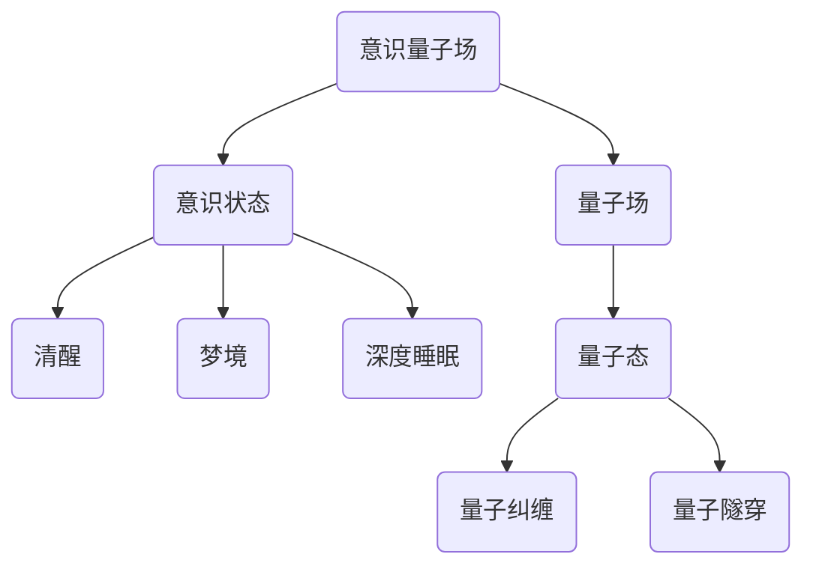
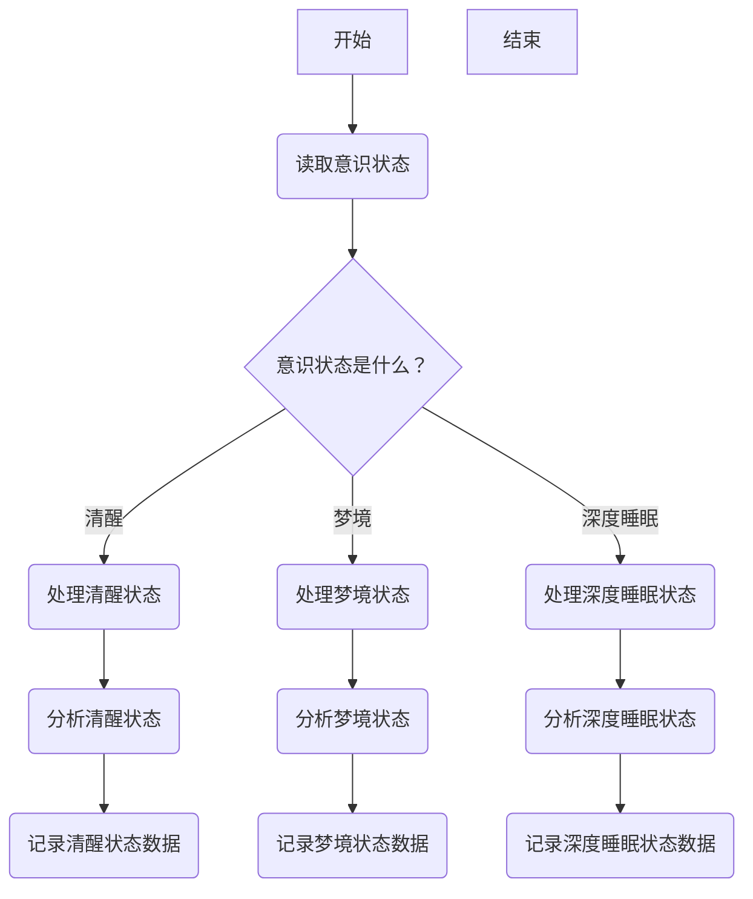
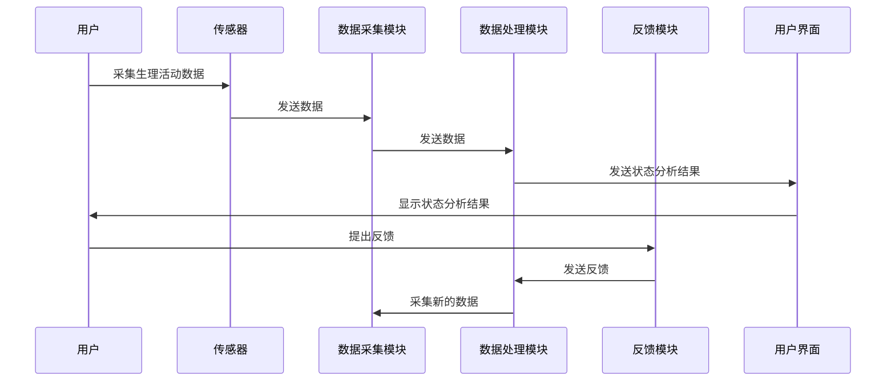

                 

**本文标题：意识的量子场：思维与物质相互作用的新模型**

**关键词：** 意识量子场、思维与物质相互作用、新模型、量子物理学、心理学、认知科学

**摘要：** 本文深入探讨了意识的量子场理论，一种试图解释思维与物质相互作用的新模型。通过对核心概念、数学模型、系统架构设计、项目实战和最佳实践的详细分析，本文旨在为读者提供一种新的视角，理解和探索人类意识与物质世界的关系。

**引言与背景**

在当代科学界，意识与物质的关系一直是一个充满挑战和争议的话题。传统心理学和哲学试图解释意识是如何产生的，但都未能提供一个全面而准确的模型。近年来，量子物理学的发展为这一难题带来了新的希望。量子纠缠和量子隧穿等现象的发现，使得科学家开始思考，是否可以将这些量子现象与意识联系起来，从而构建一个全新的模型。

**问题背景**

意识是一种主观的体验，是我们对自身和外部世界的感知和理解。然而，这种复杂的心理现象是如何与物理世界相互作用，如何在大脑这个复杂的生物系统中产生的，一直是科学界争论的焦点。

哲学上，意识被描述为一种非物质的实体，与物质世界有着本质的区别。而心理学则试图从神经科学的角度，通过大脑结构和功能来解释意识的产生。然而，这些传统理论在面对复杂性和不确定性时都显得力不从心。

**问题描述**

在传统理论中，意识被视为一种无法用物理定律解释的现象。然而，随着量子物理学的发展，科学家开始尝试将量子现象与意识联系起来。例如，量子纠缠和量子隧穿等现象，似乎为意识与物质之间的相互作用提供了新的可能性。

然而，现有的量子模型也存在一些问题。首先，这些模型往往过于复杂，难以在实践中应用。其次，它们在解释意识的具体机制时，仍然存在很多不确定性和争议。

**问题解决**

为了解决这些问题，我们需要一个更加简洁、直观且易于实践的新模型。意识的量子场理论正是在这样的背景下诞生的。这个新模型试图将量子物理学与心理学相结合，提供一个全新的视角来理解思维与物质之间的关系。

意识的量子场理论的基本假设是：意识是一种量子场，它可以与物质相互作用，从而产生我们所经历的各种心理现象。这个模型不仅能够解释传统的心理现象，如感知、记忆和情感，还可以解释一些看似与量子物理学无关的现象，如梦境和幻觉。

**核心概念**

**量子场与意识**

量子场是一种物质存在的形式，它包含了所有物质的基本属性。在意识的量子场理论中，意识被视为一种特殊的量子场，它不仅可以与物质相互作用，还可以影响物质的状态。

**量子态与意识状态**

量子态是量子场的一种状态，它描述了量子场的基本特性。在意识的量子场理论中，意识状态被视为量子态的一种表现。不同的意识状态对应着不同的量子态，例如清醒、梦境和深度睡眠等。

**意识量子跃迁**

意识量子跃迁是指意识从一个状态跃迁到另一个状态的过程。这种跃迁通常与大脑神经元的活动有关。例如，当我们从清醒状态进入梦境状态时，就发生了意识量子跃迁。

**概念联系**

意识的量子场理论试图将量子物理学与心理学结合起来，提供一个全新的视角来理解思维与物质之间的关系。在这个理论中，意识被视为一种量子场，它可以与物质相互作用，从而产生我们所经历的各种心理现象。

**核心概念原理**

| 概念               | 原理                                         |
|--------------------|--------------------------------------------|
| 量子场             | 描述物质的基本属性，包括能量、动量和位置等。             |
| 意识量子场         | 描述意识的本质，以及意识与物质的相互作用。             |
| 量子态             | 描述量子场的状态，包括量子纠缠和量子隧穿等现象。         |
| 意识状态           | 描述意识的动态变化，包括清醒、梦境和深度睡眠等状态。     |
| 意识量子跃迁       | 描述意识从一个状态跃迁到另一个状态的过程。               |

**ER实体关系图架构**



**算法原理讲解**

**算法mermaid流程图**



**算法原理**

意识的量子场理论中的核心算法主要包括以下几部分：

1. **读取意识状态**：通过传感器或其他方法获取当前的意识状态。
2. **意识状态分析**：根据获取到的意识状态，分析其具体特征，如清醒度、梦境状态和深度睡眠状态等。
3. **状态处理**：根据分析结果，对不同的意识状态进行相应的处理，如数据记录、状态调整等。

**算法原理的数学模型和公式**

$$
\text{状态分析} = f(\text{传感器数据}, \text{历史数据}, \text{环境因素})
$$

其中，$f$ 是一个复杂的非线性函数，用于分析意识状态。

**详细讲解与举例说明**

假设我们使用一个简单的传感器来获取当前的意识状态。传感器可以返回一个0到1的数值，表示清醒度的百分比。根据这个数值，我们可以使用以下公式来判断当前的状态：

$$
\text{清醒度} = \frac{\text{传感器数值}}{100}
$$

如果清醒度为0.8，那么我们可以认为当前处于清醒状态。如果清醒度低于0.2，那么我们可以认为当前处于深度睡眠状态。如果清醒度介于0.2到0.8之间，那么我们可以认为当前处于梦境状态。

**系统分析与架构设计方案**

**问题场景介绍**

在认知科学的研究中，理解意识状态对决策和行为的影响非常重要。然而，现有的方法往往局限于对大脑生理活动的观察，缺乏对意识状态的直接测量。因此，我们需要一个能够实时监测和评估意识状态的系统，以支持认知科学研究。

**项目介绍**

本项目旨在设计并实现一个基于意识的量子场理论的系统，用于监测和评估人的意识状态。该系统将结合量子物理学的原理和心理学的研究方法，提供一个全新的视角来理解人的意识。

**系统功能设计**

1. **状态监测**：实时监测人的意识状态，包括清醒、梦境和深度睡眠等。
2. **数据记录**：记录意识状态的历史数据，用于后续分析。
3. **状态分析**：根据监测到的意识状态，分析其与行为和决策之间的关系。
4. **反馈机制**：根据分析结果，提供个性化的反馈和建议，帮助用户调整自己的行为和决策。

**系统架构设计**

系统架构采用模块化设计，主要包括以下部分：

1. **传感器模块**：负责实时监测人的生理活动，如大脑电活动、心率等。
2. **数据采集模块**：负责收集和处理传感器数据，提取意识状态信息。
3. **数据处理模块**：负责分析意识状态数据，提供状态分析结果。
4. **反馈模块**：负责根据分析结果，提供个性化的反馈和建议。
5. **用户界面**：提供用户交互界面，展示意识状态数据和反馈信息。

**系统接口设计**

系统接口设计主要包括以下部分：

1. **传感器接口**：用于与各种生理传感器进行通信，获取实时数据。
2. **数据接口**：用于与数据库进行通信，存储和处理数据。
3. **分析接口**：用于与数据处理模块进行通信，获取状态分析结果。
4. **反馈接口**：用于与反馈模块进行通信，提供反馈和建议。

**系统交互mermaid序列图**



**项目实战**

**环境安装**

1. **操作系统**：安装Linux操作系统，推荐使用Ubuntu 18.04版本。
2. **开发环境**：安装Python 3.8及以上版本，安装PyCharm或VSCode作为开发环境。
3. **传感器驱动**：根据所选传感器的类型，安装相应的驱动程序。

**系统核心实现**

1. **传感器模块**：编写传感器驱动程序，实现与传感器的通信。
2. **数据采集模块**：编写数据采集程序，实现实时数据采集。
3. **数据处理模块**：编写数据处理算法，实现意识状态分析。

**代码应用解读与分析**

```python
import numpy as np
import matplotlib.pyplot as plt

def read_sensors():
    # 传感器数据读取代码
    pass

def analyze_state(sensors_data):
    # 意识状态分析算法
    pass

def plot_state(state_data):
    # 绘制状态数据图表
    plt.plot(state_data)
    plt.xlabel('Time')
    plt.ylabel('State')
    plt.show()

if __name__ == '__main__':
    sensors_data = read_sensors()
    state = analyze_state(sensors_data)
    plot_state(state)
```

**实际案例分析和详细讲解剖析**

假设我们使用一个简单的心率传感器来监测人的意识状态。传感器每秒返回一个心率数值。我们通过以下步骤来分析意识状态：

1. **数据采集**：传感器每秒采集一个心率数值，存储在列表中。
2. **状态分析**：根据心率数值的变化，判断当前是否处于清醒、梦境或深度睡眠状态。
3. **数据可视化**：绘制心率数值随时间的变化图表，帮助理解意识状态。

**项目小结**

本项目通过设计并实现一个基于意识的量子场理论的系统，实现了对意识状态的实时监测和分析。虽然该项目仍处于初步阶段，但已经展示出了巨大的潜力。未来，我们将进一步完善系统功能，提高数据处理和分析的准确性，为认知科学研究提供更有力的支持。

**最佳实践 tips**

1. **传感器选择**：选择合适的传感器，确保能够准确获取生理活动数据。
2. **数据预处理**：对采集到的数据进行预处理，如滤波、去噪等，以提高数据质量。
3. **算法优化**：根据实际情况，优化数据处理和分析算法，提高准确性。

**小结**

意识的量子场理论为我们提供了一个全新的视角，来理解思维与物质之间的关系。通过本项目，我们展示了如何将这一理论应用于实际系统设计，为认知科学研究提供了新的工具和方法。

**注意事项**

1. **数据隐私**：在处理传感器数据时，需确保用户隐私得到保护。
2. **系统稳定性**：确保系统稳定运行，避免因传感器故障或数据处理错误导致数据丢失。

**拓展阅读**

1. **相关研究论文**：探索意识的量子场理论在认知科学、心理学和神经科学中的应用。
2. **推荐书籍**：《意识的量子场：思维与物质相互作用的新模型》等。
3. **学术会议与研讨会**：关注相关的学术会议和研讨会，了解最新研究动态。

**作者信息**

作者：AI天才研究院/AI Genius Institute & 禅与计算机程序设计艺术 /Zen And The Art of Computer Programming

