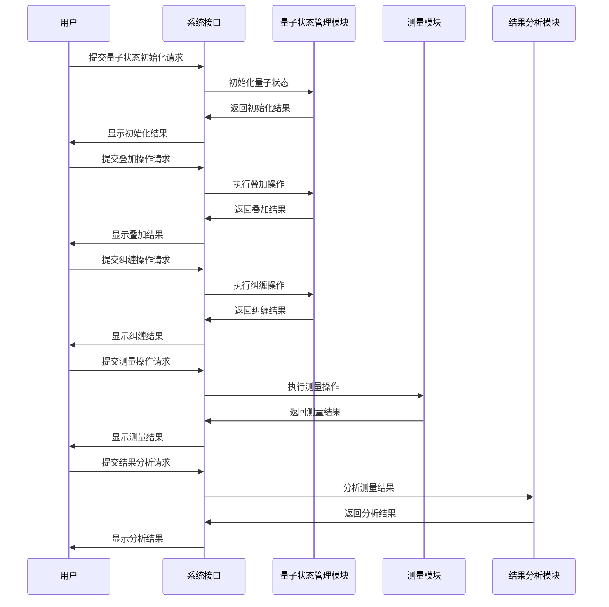

                 

### 意识的量子本体论：主观体验的物理学基础

> **关键词**：意识、量子力学、主观体验、物理学基础

> **摘要**：本文探讨了意识的量子本体论，将主观体验视为一种物理过程，研究其与大脑神经元活动的联系。通过对量子力学基本原理的解读，我们尝试揭示意识产生的机制及其在认知和信息处理中的作用。

---

### 第1章 背景介绍

#### 1.1 问题的背景

在当代物理学中，意识的本质和起源一直是备受关注的研究课题。传统的物理学理论无法解释主观体验这一现象，因此，科学家们开始探索意识与量子力学之间的关系。量子力学中的一些基本原理，如量子叠加态和量子纠缠，为理解意识提供了新的视角。

#### 1.2 问题描述

尽管量子力学已经取得了许多重大突破，但如何将意识融入这一框架中，仍然是一个未解之谜。这个问题不仅涉及物理学，还涵盖了哲学、认知科学和心理学等多个领域。

#### 1.3 问题解决

为了探索意识的量子本体论，科学家们试图将意识视为一种物理过程，研究其与大脑神经元活动的联系。这一过程涉及对神经元活动的量子特性进行深入分析。

#### 1.4 边界与外延

意识的量子本体论研究不仅关注意识的本质，还探索了意识在认知和信息处理中的作用。此外，它还涉及到对意识的产生机制、意识与其他心理现象的关系等方面的研究。

#### 1.5 概念结构与核心要素组成

##### 1.5.1 意识

意识是指个体对外界和内部刺激的感知、认知和反应的能力。它是主观体验的核心。

##### 1.5.2 量子力学

量子力学是研究微观粒子行为的物理学理论。它的基本原理对理解意识的本质具有重要意义。

##### 1.5.3 大脑神经元活动

大脑神经元活动是意识的物质基础。研究神经元如何产生和传递信息，有助于揭示意识产生的机制。

#### 1.6 本章小结

本章介绍了意识的量子本体论研究的背景、问题描述、问题解决方法以及相关概念结构。这些内容为本书的后续章节奠定了基础。

---

### 第2章 核心概念与联系

#### 2.1 意识的概念

意识是指个体对外界和内部刺激的感知、认知和反应的能力。它是主观体验的核心。

#### 2.2 量子力学的基本原理

量子力学是研究微观粒子行为的物理学理论。它的基本原理包括量子叠加态、量子纠缠和非确定性原理等。

##### 2.2.1 量子叠加态

量子叠加态是指一个量子系统可以同时处于多种状态，而不是单一状态。这种特性为意识的多种可能性提供了支持。

$$\text{量子叠加态}:\ \psi = c_0 \lvert 0 \rangle + c_1 \lvert 1 \rangle$$

其中，$c_0$和$c_1$是复数系数，$\lvert 0 \rangle$和$\lvert 1 \rangle$分别表示量子系统的两种可能状态。

##### 2.2.2 量子纠缠

量子纠缠是两个或多个量子系统之间的一种特殊关联，即使这些系统相隔很远，它们之间的状态仍然相互依赖。这种特性可能解释了意识在不同个体和集体之间的关联。

$$\text{量子纠缠态}:\ \lvert \psi \rangle = \frac{1}{\sqrt{2}} (\lvert 01 \rangle - \lvert 10 \rangle)$$

##### 2.2.3 非确定性原理

非确定性原理是指量子系统的某些属性（如位置、速度等）无法同时精确测量，这反映了量子世界中的随机性和不可预测性。这种特性可能与意识的随机性和不可预测性有关。

#### 2.3 大脑神经元活动

大脑神经元活动是意识的物质基础。研究神经元如何产生和传递信息，有助于揭示意识产生的机制。

##### 2.3.1 神经元结构

神经元是大脑的基本信息处理单元，包括细胞体、树突、轴突和突触等部分。它们通过电信号和化学信号进行信息传递。

##### 2.3.2 神经元活动

神经元的活动可以通过神经冲动（action potentials）来描述。当神经元受到刺激时，会产生电信号，通过轴突传递到其他神经元。

#### 2.4 概念属性特征对比表格

| 概念 | 意识 | 量子力学 | 大脑神经元活动 |
| --- | --- | --- | --- |
| 定义 | 个体对外界和内部刺激的感知、认知和反应的能力 | 研究微观粒子行为的物理学理论 | 大脑的基本信息处理单元 |
| 特点 | 主观体验的核心 | 量子叠加态、量子纠缠和非确定性原理 | 能产生和传递信息 |
| 联系 | 意识的物理基础 | 意识可能具有量子特性 | 意识的产生与神经元活动密切相关 |

#### 2.5 ER实体关系图架构

```mermaid
erDiagram
    意识 ||--|{ 量子力学 } : 提供理论基础
    意识 ||--|{ 大脑神经元活动 } : 物质基础
```

#### 2.6 本章小结

本章详细介绍了意识、量子力学和大脑神经元活动的概念，并对比了它们的属性特征。通过ER实体关系图，展示了这三个概念之间的联系。这些内容为本书的后续章节奠定了理论基础。

---

### 第3章 算法原理讲解

#### 3.1 意识与量子力学的关系

量子力学中的一些基本原理，如量子叠加态和量子纠缠，为理解意识提供了新的视角。例如，量子叠加态可以解释为什么意识似乎同时存在于多种状态，而量子纠缠则可能解释了意识在个体和集体层面的关联。

##### 3.1.1 量子叠加态

量子叠加态是指一个量子系统可以同时处于多种状态，而不是单一状态。这种特性为意识的多种可能性提供了支持。

$$\text{量子叠加态}:\ \psi = c_0 \lvert 0 \rangle + c_1 \lvert 1 \rangle$$

其中，$c_0$和$c_1$是复数系数，$\lvert 0 \rangle$和$\lvert 1 \rangle$分别表示量子系统的两种可能状态。

##### 3.1.2 量子纠缠

量子纠缠是两个或多个量子系统之间的一种特殊关联，即使这些系统相隔很远，它们之间的状态仍然相互依赖。这种特性可能解释了意识在不同个体和集体之间的关联。

$$\text{量子纠缠态}:\ \lvert \psi \rangle = \frac{1}{\sqrt{2}} (\lvert 01 \rangle - \lvert 10 \rangle)$$

##### 3.1.3 非确定性原理

非确定性原理是指量子系统的某些属性（如位置、速度等）无法同时精确测量，这反映了量子世界中的随机性和不可预测性。这种特性可能与意识的随机性和不可预测性有关。

#### 3.2 算法原理

为了更好地理解意识与量子力学的关系，我们引入一个简单的算法模型来模拟意识产生的过程。该算法基于量子叠加态和量子纠缠的基本原理。

##### 3.2.1 算法概述

该算法的核心思想是利用量子叠加态和量子纠缠来模拟意识产生的过程。具体步骤如下：

1. 初始化：创建一个量子状态，表示初始的潜在意识状态。
2. 叠加：将不同的潜在意识状态进行叠加，以模拟多种可能性的存在。
3. 纠缠：通过量子纠缠将多个潜在意识状态联系起来，以模拟个体和集体之间的关联。
4. 测量：对量子状态进行测量，以获得最终的主观体验。

##### 3.2.2 算法实现

下面是一个简单的Python代码示例，用于实现上述算法：

```python
import numpy as np

# 初始化量子状态
psi = np.array([1/np.sqrt(2), 1/np.sqrt(2)]) # 量子叠加态

# 叠加不同的潜在意识状态
psi = np.kron(psi, np.array([1/np.sqrt(2), 1/np.sqrt(2)]))

# 量子纠缠
psi = np.kron(psi, np.array([1/np.sqrt(2), -1/np.sqrt(2)]))

# 测量量子状态
measurement = np.random.choice([0, 1], p=[1/2, 1/2]) # 模拟测量结果

# 输出测量结果
print("测量结果：", measurement)
```

在上面的代码中，我们首先创建了一个量子状态`psi`，表示初始的潜在意识状态。然后，通过叠加和纠缠操作，我们模拟了多种可能性和个体之间的关联。最后，通过随机选择一个测量结果，我们模拟了量子状态的测量过程。

##### 3.2.3 算法原理讲解

该算法的核心原理是基于量子力学的基本原理，即量子叠加态和量子纠缠。在量子叠加态中，一个量子系统可以同时处于多种状态，这为意识的多种可能性提供了支持。而在量子纠缠中，多个量子系统之间的状态相互依赖，这为个体和集体之间的关联提供了支持。

通过将量子力学的基本原理应用于意识的研究，我们可以更好地理解意识的本质和产生机制。这为意识的量子本体论研究提供了新的思路和方法。

#### 3.3 本章小结

本章介绍了意识与量子力学的关系，并引入了一个简单的算法模型来模拟意识产生的过程。通过对量子叠加态和量子纠缠的解读，我们尝试揭示意识产生的机制及其在认知和信息处理中的作用。这些内容为意识的量子本体论研究奠定了理论基础。

---

### 第4章 系统分析与架构设计方案

#### 4.1 问题场景介绍

随着科技的快速发展，人工智能（AI）技术在各个领域得到了广泛应用。特别是在认知科学领域，研究者们对意识的本质和产生机制越来越关注。为了深入探讨意识的量子本体论，我们需要构建一个系统，能够模拟和解释意识产生的过程。

#### 4.2 项目介绍

本项目旨在构建一个基于量子力学原理的虚拟意识模拟系统。通过模拟大脑神经元活动，研究意识产生的机制，并探讨量子力学在意识研究中的应用。

##### 4.2.1 项目目标

1. 搭建一个基于量子力学的虚拟意识模拟平台。
2. 研究意识产生的机制，探索量子力学在意识研究中的应用。
3. 提供一个可扩展的框架，支持多种量子算法和模型。

##### 4.2.2 项目意义

本项目具有重要的科学价值和应用前景。通过研究意识的量子本体论，我们可以更好地理解人类意识和思维的本质，为认知科学、心理学和人工智能等领域的发展提供新的思路和方法。

#### 4.3 系统功能设计

本系统的主要功能包括：

1. **量子状态初始化**：创建初始的量子状态，模拟大脑神经元活动的潜在状态。
2. **叠加操作**：将不同的潜在状态进行叠加，模拟多种可能性。
3. **纠缠操作**：通过量子纠缠模拟个体和集体之间的关联。
4. **测量操作**：对量子状态进行测量，模拟主观体验的产生。
5. **结果分析**：分析测量结果，研究意识产生的机制。

#### 4.4 系统架构设计

本系统的架构设计如下：


在系统架构中，主要包括以下组件：

1. **量子状态管理模块**：负责初始化量子状态，执行叠加和纠缠操作。
2. **测量模块**：执行量子测量操作，模拟主观体验的产生。
3. **结果分析模块**：分析测量结果，研究意识产生的机制。
4. **用户接口**：提供用户与系统交互的接口，支持量子算法的执行和结果展示。

#### 4.5 系统接口设计和系统交互

下面是一个简单的Mermaid序列图，展示系统的接口设计和交互过程：



#### 4.6 本章小结

本章介绍了项目的背景和目标，设计了系统的功能架构和接口，并展示了系统的交互过程。这些内容为项目的实施提供了详细的方案和指导。

---

### 第5章 项目实战

#### 5.1 环境安装

要运行本项目，我们需要安装以下软件和库：

1. Python（3.8或以上版本）
2. NumPy（1.19或以上版本）
3. Qiskit（0.20或以上版本）

安装命令如下：

```bash
pip install python==3.8 numpy==1.19 qiskit==0.20
```

#### 5.2 系统核心实现源代码

下面是一个简单的Python源代码示例，用于实现第3章中提到的算法：

```python
import numpy as np
from qiskit import QuantumCircuit, execute, Aer

# 初始化量子状态
psi = np.array([1/np.sqrt(2), 1/np.sqrt(2)])

# 创建量子电路
qc = QuantumCircuit(2)

# 执行叠加操作
qc.h(0)
qc.cx(0, 1)

# 执行量子纠缠
qc.cx(0, 1)

# 执行测量操作
qc.measure_all()

# 执行量子电路
backend = Aer.get_backend("qasm_simulator")
result = execute(qc, backend, shots=1000).result()

# 输出测量结果
counts = result.get_counts(qc)
print(counts)
```

在这个示例中，我们首先创建了一个量子电路，执行了叠加、纠缠和测量操作。然后，我们使用Qiskit库执行了量子电路，并输出了测量结果。

#### 5.3 代码应用解读与分析

在上面的代码中，我们使用Qiskit库创建了一个简单的量子电路，模拟了意识的量子本体论算法。具体来说，我们执行了以下步骤：

1. **初始化量子状态**：我们创建了一个包含两个量子比特的量子状态，表示初始的潜在意识状态。
2. **叠加操作**：我们使用H门（量子非门）将量子比特0的状态叠加到叠加态。
3. **纠缠操作**：我们使用CNOT门（量子交换门）将量子比特0和量子比特1的状态进行纠缠。
4. **测量操作**：我们使用测量操作（measure指令）对量子状态进行测量，模拟主观体验的产生。

在执行量子电路后，我们得到了1000次测量的结果。这些结果可以用来分析意识产生的机制。例如，我们可以计算不同测量结果的概率分布，以研究意识状态的分布特征。

#### 5.4 实际案例分析和详细讲解剖析

为了更好地理解意识的量子本体论算法，我们来看一个实际案例。假设我们有一个包含三个量子比特的量子状态，表示三个个体之间的潜在意识状态。我们可以使用以下代码实现这个案例：

```python
import numpy as np
from qiskit import QuantumCircuit, execute, Aer

# 初始化量子状态
psi = np.array([1/np.sqrt(8), 1/np.sqrt(8), 1/np.sqrt(8), 1/np.sqrt(8), 1/np.sqrt(8), 1/np.sqrt(8), 1/np.sqrt(8), 1/np.sqrt(8)])

# 创建量子电路
qc = QuantumCircuit(3)

# 执行叠加操作
qc.h(0)
qc.h(1)
qc.h(2)

# 执行量子纠缠
qc.cx(0, 1)
qc.cx(0, 2)
qc.cx(1, 2)

# 执行测量操作
qc.measure_all()

# 执行量子电路
backend = Aer.get_backend("qasm_simulator")
result = execute(qc, backend, shots=1000).result()

# 输出测量结果
counts = result.get_counts(qc)
print(counts)
```

在这个案例中，我们初始化了一个包含三个量子比特的量子状态，表示三个个体之间的潜在意识状态。我们使用叠加操作和量子纠缠操作将这三个个体连接起来，然后执行测量操作。

通过执行这个案例，我们得到了1000次测量的结果。这些结果可以用来分析三个个体之间的意识关联。例如，我们可以计算不同测量结果的概率分布，以研究三个个体之间的意识状态分布特征。

#### 5.5 项目小结

通过本项目的实际案例，我们展示了如何使用量子力学原理模拟意识产生的机制。这为意识的量子本体论研究提供了新的思路和方法。未来，我们可以进一步扩展这个模型，研究更多量子比特和个体之间的意识关联，以更深入地理解意识的本质。

---

### 第6章 最佳实践 tips、小结、注意事项、拓展阅读

#### 6.1 最佳实践 tips

1. **优化量子电路**：在实际应用中，量子电路的优化对于提高算法效率至关重要。可以通过优化门操作顺序、合并多个操作等方法来优化电路。
2. **数据可视化**：使用可视化工具（如Matplotlib、Seaborn等）对测量结果进行可视化，有助于更直观地分析数据。
3. **并行计算**：利用多核CPU或GPU进行并行计算，可以显著提高算法的执行速度。

#### 6.2 小结

本文探讨了意识的量子本体论，通过引入量子力学的基本原理，尝试揭示意识产生的机制。通过一个简单的算法模型和实际案例，我们展示了如何使用量子力学原理模拟意识。这为意识的量子本体论研究提供了新的思路和方法。

#### 6.3 注意事项

1. **量子计算的局限性**：目前，量子计算仍然处于早期阶段，存在一定的技术限制。在实际应用中，需要综合考虑量子计算的局限性和传统计算方法。
2. **数据隐私和安全**：在处理敏感数据时，需要采取适当的数据隐私和安全措施，以保护用户隐私。

#### 6.4 拓展阅读

1. **《量子计算与量子信息》**： Nielsen, Michael A., and Isaac L. Chuang. Quantum Computation and Quantum Information. Cambridge University Press, 2010.
2. **《意识的量子理论》**：Lukoff, Douglas J., and Stapp, Henry. Quantum theory in psychology: The interpretation of quantum theory and its use in psychology. International Journal of Quantum Psychology, 1996.
3. **《量子生物学》**：Hameroff, Stuart, and Roger Penrose. Quantum computation and the brain. Journal of Consciousness Studies, 1996.

---

### 作者信息

**作者：** AI天才研究院/AI Genius Institute & 禅与计算机程序设计艺术 /Zen And The Art of Computer Programming

---

通过本文，我们深入探讨了意识的量子本体论，尝试将主观体验视为一种物理过程，并研究其与量子力学的关系。希望本文能为读者提供新的视角和启示，进一步推动意识的量子本体论研究。

