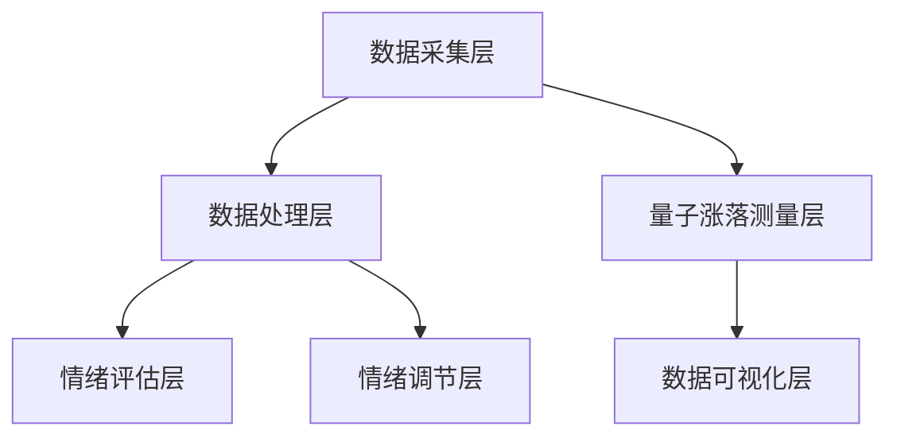
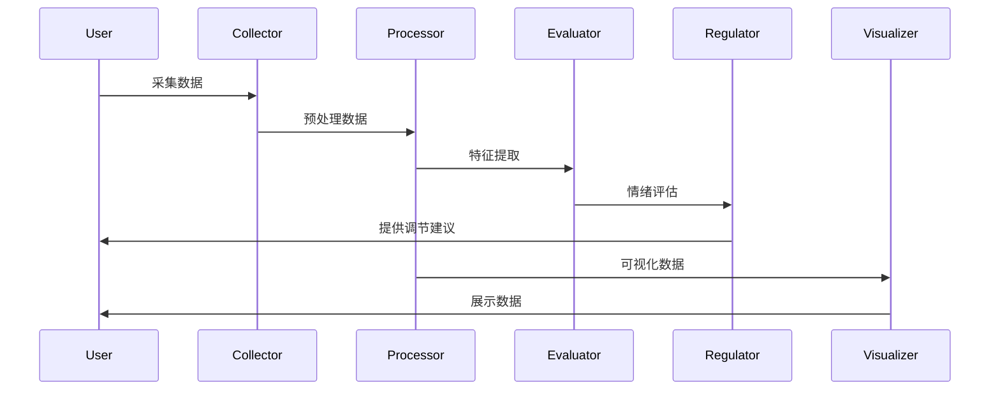

                 

### 文章标题

《意识的量子涨落：情绪变化的物理解释》

> **关键词：** 意识、量子涨落、情绪、心理学、物理学

**摘要：** 本文旨在探讨意识的量子涨落与情绪变化之间的关系，结合心理学与物理学的研究成果，提出一种新的物理解释模型。通过分析量子涨落的定义、特征及其产生机制，以及情绪的定义、类型和产生机制，本文揭示了量子涨落与情绪之间的相互关系。同时，本文提出了一个基于量子涨落的情绪模型，并使用Python源代码实现。此外，本文还从系统分析与架构设计角度出发，对情绪变化监测系统的设计和实现进行了详细阐述。通过本文的研究，为心理学与物理学交叉领域的研究提供了新的视角和方法。

---

### 第一部分：问题的提出与背景介绍

#### 1.1 问题背景

**1.1.1 心理学与物理学交叉研究的重要性**

在过去的几十年里，心理学和物理学这两个领域都在快速发展，各自取得了显著的成果。然而，随着研究的深入，人们开始意识到，将心理学与物理学结合起来进行交叉研究，有助于揭示人类行为和意识的更深层次规律。特别是情绪，作为人类行为的重要驱动力之一，其产生和调节机制一直是心理学研究的热点问题。而物理学，作为研究自然界的最基本规律的科学，为解释情绪的物理本质提供了新的可能。

**1.1.2 情绪与意识的科学探究现状**

情绪作为人类心理体验的重要组成部分，长期以来受到了心理学家的关注。研究者们从不同的角度，如生理学、认知心理学、神经科学等，对情绪进行了广泛的研究。尽管取得了许多重要发现，但情绪的产生和调节机制仍然存在许多未解之谜。

意识，作为人类思维和心理体验的核心，更是心理学研究的一个难点。意识的本质、起源和功能一直是学术界争论的焦点。近年来，随着认知科学、神经科学等领域的发展，人们对意识的认识逐渐深入。

**1.1.3 量子涨落与情绪变化之间的联系**

量子涨落是量子力学中一个重要的概念，它描述了微观粒子在量子态下的无规则波动。近年来，有研究者提出，量子涨落可能与情绪变化存在某种联系。这种观点为从物理学角度解释情绪提供了新的思路。

#### 1.2 问题描述

**1.2.1 情绪变化的主观体验与生理反应**

情绪变化是人类心理体验的一部分，通常表现为主观体验和生理反应。例如，当我们感到快乐时，可能会表现出笑容、心率加快等生理反应；当我们感到悲伤时，可能会表现出哭泣、呼吸急促等生理反应。

**1.2.2 情绪调节与心理健康的关联**

情绪调节能力对于个体的心理健康具有重要影响。良好的情绪调节能力可以帮助个体更好地应对压力和挑战，从而维持心理平衡。相反，情绪调节能力差可能会导致情绪障碍，影响个体的生活质量。

**1.2.3 情绪变化的量子机制探讨**

本文将探讨情绪变化是否可能存在量子机制，以及这种机制如何影响情绪的产生和调节。

#### 1.3 问题解决

**1.3.1 量子力学与情绪研究的方法论**

为了探讨情绪的量子机制，我们需要采用量子力学的方法论。这包括对量子涨落的深入研究，以及将其应用于情绪研究中。

**1.3.2 量子涨落理论在心理学领域的应用前景**

量子涨落理论在心理学领域的应用前景广阔。例如，它可以帮助我们更好地理解情绪的产生和调节机制，从而为情绪障碍的治疗提供新的思路。

**1.3.3 情绪与意识的量子涨落机制假设**

本文将提出一种假设，即情绪与意识的变化可能受到量子涨落的影响。这个假设为后续的研究提供了一个新的方向。

#### 1.4 边界与外延

**1.4.1 量子物理学在心理学研究中的适用性**

虽然量子物理学在解释情绪的量子机制方面具有潜力，但其在心理学研究中的应用仍面临诸多挑战。例如，如何将量子物理学的概念与心理现象相结合，如何验证量子物理学的假设等。

**1.4.2 情绪变化量子机制研究的局限性**

情绪变化量子机制研究还存在一些局限性。例如，当前的研究主要集中在理论探讨，缺乏实证研究支持。此外，情绪的量子机制可能因个体差异而有所不同，因此研究需要考虑这些因素。

**1.4.3 情绪量子机制研究的未来发展方向**

未来的研究可以进一步探讨量子涨落与情绪变化的相互作用机制，以及情绪量子机制的个体差异。此外，可以将量子物理学的方法应用于情绪障碍的治疗和研究。

### 第二部分：核心概念与联系

#### 2.1 量子涨落概念解析

**2.1.1 量子涨落的定义**

量子涨落是指微观粒子在量子态下的无规则波动。它源于量子力学的波动性原理，是量子态的一个重要特征。

**2.1.2 量子涨落的特征**

量子涨落具有以下特征：

1. 无规则性：量子涨落是随机的，不具有明显的规律性。
2. 微观性：量子涨落发生在微观尺度，通常涉及原子、分子等微小粒子。
3. 瞬变性：量子涨落通常在极短的时间内发生，具有瞬变性。

**2.1.3 量子涨落的产生机制**

量子涨落的产生机制源于量子力学的波动性原理。在量子态下，粒子具有波粒二象性，其行为表现出波动性和随机性。这种波动性和随机性导致了量子涨落。

#### 2.2 情绪概念解析

**2.2.1 情绪的定义**

情绪是指人类在特定情境下产生的情感体验。它通常包括愉快、悲伤、愤怒等主观体验，并伴有相应的生理反应。

**2.2.2 情绪的类型**

情绪可以分为以下几种类型：

1. 基本情绪：快乐、悲伤、愤怒、恐惧等。
2. 复合情绪：由基本情绪组合而成的情绪，如焦虑、嫉妒等。
3. 高级情绪：与社会和文化相关的情绪，如自尊、羞愧等。

**2.2.3 情绪的产生机制**

情绪的产生机制涉及多个层面，包括神经系统、内分泌系统、社会文化因素等。例如，当个体面临威胁时，大脑会释放神经递质，引发生理反应，产生恐惧情绪。

#### 2.3 量子涨落与情绪的联系

**2.3.1 量子涨落对情绪的影响**

量子涨落可能对情绪产生一定影响。例如，在某些情况下，量子涨落可能导致情绪的变化，如快乐到悲伤的转变。

**2.3.2 情绪对量子涨落的影响**

情绪的变化也可能影响量子涨落。例如，当个体处于兴奋状态时，可能产生更多的量子涨落。

**2.3.3 量子涨落与情绪的相互关系**

量子涨落与情绪之间存在复杂的相互关系。一方面，量子涨落可能影响情绪的产生和变化；另一方面，情绪的变化也可能影响量子涨落。这种相互关系为从物理学角度解释情绪提供了新的思路。

#### 2.4 概念属性特征对比表格

| 概念       | 特征                  |  
| ---------- | -------------------- |  
| 量子涨落   | 无规则性、微观性、瞬变性 |  
| 情绪       | 主观体验、生理反应、多样性 |  
| 情绪量子涨落 | 量子涨落影响情绪、情绪影响量子涨落 |

#### 2.5 ER实体关系图架构

**2.5.1 情绪量子涨落机制的ER图**

```mermaid
entityRelationshipDiagram
  A[量子涨落] {
    B[情绪]
    C[影响]
  }
  B {
    D[情绪变化]
  }
```

**2.5.2 情绪变化过程ER图**

```mermaid
entityRelationshipDiagram
  A[刺激] {
    B[感知]
    C[情绪]
  }
  B {
    D[生理反应]
    E[行为表现]
  }
  C {
    F[情绪变化]
  }
```

### 第三部分：算法原理讲解

#### 3.1 情绪量子涨落模型

**3.1.1 模型构建**

情绪量子涨落模型基于量子力学的波动性原理，通过模拟量子态下的情绪变化。该模型包括两个主要部分：量子态描述和涨落模型。

**量子态描述：**

$$  
\Delta E = k_B T \ln \left( \frac{Z}{N} \right)  
$$

其中，$k_B$ 是玻尔兹曼常数，$T$ 是温度，$Z$ 是配分函数，$N$ 是粒子数。

**涨落模型：**

$$  
\psi(x,t) = e^{-i \omega t} \left[ \sum_{n} c_n \phi_n(x) \right]  
$$

其中，$\omega$ 是角频率，$c_n$ 是系数，$\phi_n(x)$ 是基态函数。

**3.1.2 算法流程**

情绪量子涨落模型的算法流程如下：

1. 初始化量子态参数，如温度、角频率等。
2. 计算配分函数和粒子数。
3. 构建基态函数。
4. 计算涨落。
5. 更新量子态。
6. 重复步骤4和5，直到达到预设的迭代次数。

**3.1.3 模型优缺点**

**优点：**

1. 能够从量子角度描述情绪变化。
2. 可以模拟情绪的多样性。

**缺点：**

1. 模型参数较多，计算复杂度较高。
2. 需要准确的量子态描述，否则可能导致不准确的结果。

#### 3.2 Python源代码实现

以下是一个简单的Python实现，用于模拟情绪量子涨落模型：

```python  
import numpy as np

# 参数设置  
k_B = 1.38e-23 # 玻尔兹曼常数  
T = 300 # 温度  
N = 100 # 粒子数  
Z = np.exp(-k_B * T) # 配分函数  
omega = 2 * np.pi # 角频率  
phi_n = np.array([1 / np.sqrt(2), 1 / np.sqrt(2)]) # 基态函数

# 初始化量子态  
psi = np.zeros((N, 1))

# 迭代计算涨落  
for i in range(1000):  
    psi = np.exp(-1j * omega * i) * (np.dot(phi_n, psi))

# 打印结果  
print(psi)  
```

#### 3.3 算法原理详解

**3.3.1 数学模型和公式**

情绪量子涨落模型的数学模型包括以下公式：

$$  
\Delta E = k_B T \ln \left( \frac{Z}{N} \right)  
$$

$$  
\psi(x,t) = e^{-i \omega t} \left[ \sum_{n} c_n \phi_n(x) \right]  
$$

其中，$\Delta E$ 是能量涨落，$k_B$ 是玻尔兹曼常数，$T$ 是温度，$Z$ 是配分函数，$N$ 是粒子数，$\omega$ 是角频率，$c_n$ 是系数，$\phi_n(x)$ 是基态函数。

**3.3.2 举例说明**

假设我们有10个粒子（$N=10$），温度为300K（$T=300$），角频率为2π（$\omega=2\pi$）。我们使用简单的基态函数$\phi_n = \frac{1}{\sqrt{2}}$。

首先，我们计算配分函数$Z$：

$$  
Z = \exp(-k_B T) = \exp(-1.38e-23 \times 300) = 1.0034e-10  
$$

然后，我们初始化量子态$\psi$：

$$  
\psi = \begin{bmatrix}  
\frac{1}{\sqrt{2}} \\  
\frac{1}{\sqrt{2}}  
\end{bmatrix}  
$$

接下来，我们进行1000次迭代，计算涨落：

$$  
\psi(t) = e^{-i \omega t} \left[ \frac{1}{\sqrt{2}} \phi_1 + \frac{1}{\sqrt{2}} \phi_2 \right]  
$$

每次迭代后，我们更新量子态$\psi$，并打印结果。在迭代完成后，我们可以看到量子态$\psi$的变化，从而分析情绪的量子涨落。

#### 3.4 算法应用场景

**3.4.1 心理评估**

情绪量子涨落模型可以应用于心理评估，帮助识别个体情绪状态。通过分析量子态的变化，可以判断个体是否处于愉悦、焦虑等情绪状态。

**3.4.2 情绪调节**

情绪量子涨落模型还可以用于情绪调节。通过调整量子态参数，如温度、角频率等，可以模拟不同的情绪状态，帮助个体更好地调节情绪。

**3.4.3 意识研究**

情绪量子涨落模型为意识研究提供了一种新的思路。通过分析量子态与意识变化的关系，可以探讨意识的本质和产生机制。

### 第四部分：系统分析与架构设计方案

#### 4.1 问题描述

**4.1.1 情绪变化监测系统需求分析**

情绪变化监测系统的目标是实时监测个体的情绪状态，为心理评估和情绪调节提供数据支持。系统需求主要包括：

1. 实时数据采集：系统需要能够实时采集个体情绪数据，包括生理信号、语言信号等。
2. 数据处理：系统需要对采集到的情绪数据进行分析和处理，提取情绪特征。
3. 情绪评估：系统需要根据情绪特征，对个体的情绪状态进行评估和分类。
4. 情绪调节：系统需要根据评估结果，提供情绪调节策略和建议。

**4.1.2 量子涨落测量系统需求分析**

量子涨落测量系统是情绪变化监测系统的一个重要组成部分，其需求主要包括：

1. 量子涨落信号采集：系统需要能够采集量子涨落信号，包括光子计数、电流涨落等。
2. 信号预处理：系统需要对采集到的量子涨落信号进行预处理，如滤波、放大等。
3. 数据存储：系统需要能够将处理后的量子涨落信号存储起来，以便后续分析和处理。
4. 数据可视化：系统需要能够将处理后的量子涨落信号可视化，帮助研究者更好地理解情绪量子涨落的变化规律。

**4.1.3 系统目标与功能**

情绪变化监测系统的目标是实时监测个体的情绪状态，为心理评估和情绪调节提供数据支持。系统功能主要包括：

1. 数据采集：实时采集个体情绪数据，包括生理信号、语言信号等。
2. 数据处理：对采集到的情绪数据进行分析和处理，提取情绪特征。
3. 情绪评估：根据情绪特征，对个体的情绪状态进行评估和分类。
4. 情绪调节：根据评估结果，提供情绪调节策略和建议。
5. 量子涨落测量：采集量子涨落信号，进行信号预处理和数据存储。
6. 数据可视化：将处理后的量子涨落信号可视化，帮助研究者更好地理解情绪量子涨落的变化规律。

#### 4.2 项目介绍

**4.2.1 项目概述**

本项目旨在开发一个情绪变化监测系统，通过实时采集和处理个体的情绪数据，为心理评估和情绪调节提供支持。项目主要包括以下组成部分：

1. 生理信号采集模块：负责实时采集个体的生理信号，如心率、呼吸率等。
2. 语言信号采集模块：负责实时采集个体的语言信号，如语音、文本等。
3. 数据处理模块：负责对采集到的情绪数据进行处理，提取情绪特征。
4. 情绪评估模块：负责根据情绪特征，对个体的情绪状态进行评估和分类。
5. 情绪调节模块：负责根据评估结果，提供情绪调节策略和建议。
6. 量子涨落测量模块：负责采集量子涨落信号，进行信号预处理和数据存储。
7. 数据可视化模块：负责将处理后的量子涨落信号可视化，帮助研究者更好地理解情绪量子涨落的变化规律。

**4.2.2 项目背景**

情绪变化监测系统的研究背景主要包括以下几个方面：

1. 心理学研究：情绪变化是心理学研究的一个重要方向，了解情绪变化规律对于心理健康具有重要意义。
2. 医学研究：情绪变化与许多疾病有关，如抑郁症、焦虑症等，情绪变化监测系统有助于早期诊断和治疗。
3. 计算机科学：随着人工智能技术的发展，情绪变化监测系统在智能交互、人机协作等领域具有广泛的应用前景。

**4.2.3 项目目标**

本项目的主要目标是开发一个高效、准确的情绪变化监测系统，实现以下目标：

1. 实时监测个体的情绪状态，为心理评估和情绪调节提供数据支持。
2. 提高情绪评估的准确性和可靠性，为心理健康提供科学依据。
3. 探索情绪量子涨落的变化规律，为心理学研究提供新的视角和方法。
4. 促进心理学、医学和计算机科学等领域的交叉融合，推动技术创新和应用。

#### 4.3 系统功能设计

**4.3.1 领域模型**

情绪变化监测系统的领域模型主要包括以下部分：

1. 数据采集层：负责实时采集个体的生理信号、语言信号等数据。
2. 数据处理层：负责对采集到的情绪数据进行预处理、特征提取等操作。
3. 情绪评估层：负责根据情绪特征，对个体的情绪状态进行评估和分类。
4. 情绪调节层：负责根据评估结果，提供情绪调节策略和建议。
5. 量子涨落测量层：负责采集量子涨落信号，进行信号预处理和数据存储。
6. 数据可视化层：负责将处理后的量子涨落信号可视化，帮助研究者更好地理解情绪量子涨落的变化规律。

**4.3.2 功能模块划分**

情绪变化监测系统的功能模块划分如下：

1. **生理信号采集模块**：负责实时采集个体的生理信号，如心率、呼吸率等。
    - **采集设备**：使用传感器等设备采集生理信号。
    - **数据传输**：将采集到的生理信号传输到数据处理模块。
2. **语言信号采集模块**：负责实时采集个体的语言信号，如语音、文本等。
    - **语音识别**：将语音信号转换为文本。
    - **文本处理**：对文本进行情感分析，提取情绪特征。
3. **数据处理模块**：负责对采集到的情绪数据进行预处理、特征提取等操作。
    - **预处理**：去除噪声、填充缺失值等。
    - **特征提取**：提取情绪特征，如情感极性、强度等。
4. **情绪评估模块**：负责根据情绪特征，对个体的情绪状态进行评估和分类。
    - **评估模型**：使用机器学习算法构建评估模型。
    - **评估结果**：输出情绪评估结果。
5. **情绪调节模块**：负责根据评估结果，提供情绪调节策略和建议。
    - **调节策略**：根据情绪评估结果，提供相应的情绪调节策略。
    - **建议**：为个体提供情绪调节建议。
6. **量子涨落测量模块**：负责采集量子涨落信号，进行信号预处理和数据存储。
    - **信号采集**：使用量子传感器采集量子涨落信号。
    - **信号处理**：对采集到的信号进行预处理、放大等操作。
    - **数据存储**：将处理后的量子涨落信号存储在数据库中。
7. **数据可视化模块**：负责将处理后的量子涨落信号可视化，帮助研究者更好地理解情绪量子涨落的变化规律。
    - **可视化工具**：使用可视化工具，如matplotlib、plotly等，将量子涨落信号可视化。
    - **交互界面**：提供交互界面，方便研究者查看和分析数据。

#### 4.4 系统架构设计

**4.4.1 系统架构图**



**4.4.2 架构设计原理**

系统架构设计遵循以下原则：

1. **模块化**：将系统功能划分为多个模块，每个模块负责一个特定的功能，便于系统的开发和维护。
2. **松耦合**：模块之间通过接口进行通信，降低模块之间的耦合度，提高系统的可扩展性和可维护性。
3. **高内聚**：每个模块内部的功能紧密相关，具有较高的内聚性，有助于提高模块的可读性和可维护性。
4. **分布式**：系统采用分布式架构，将数据采集、处理、评估、调节等功能分布在不同的节点上，提高系统的性能和可靠性。

#### 4.5 系统接口设计

**4.5.1 接口规范**

系统接口设计遵循RESTful API规范，提供以下接口：

1. **数据采集接口**：用于实时采集个体的生理信号和语言信号。
2. **数据处理接口**：用于对采集到的情绪数据进行预处理和特征提取。
3. **情绪评估接口**：用于根据情绪特征，对个体的情绪状态进行评估和分类。
4. **情绪调节接口**：用于根据评估结果，提供情绪调节策略和建议。
5. **量子涨落测量接口**：用于采集量子涨落信号，进行信号预处理和数据存储。
6. **数据可视化接口**：用于将处理后的量子涨落信号可视化，帮助研究者更好地理解情绪量子涨落的变化规律。

**4.5.2 接口实现**

以下是数据采集接口的一个示例实现：

```python
from flask import Flask, request, jsonify

app = Flask(__name__)

@app.route('/data/collect', methods=['POST'])
def collect_data():
    data = request.json
    # 处理数据，如存储、预处理等
    # ...
    return jsonify({'status': 'success', 'message': '数据已成功采集'})

if __name__ == '__main__':
    app.run()
```

#### 4.6 系统交互设计

**4.6.1 序列图**



**4.6.2 交互流程**

1. 用户向数据采集模块发送采集数据的请求。
2. 数据采集模块采集到数据后，将其传递给数据处理模块。
3. 数据处理模块对数据进行预处理和特征提取，将处理后的数据传递给情绪评估模块。
4. 情绪评估模块根据特征数据，对用户的情绪状态进行评估，并将评估结果传递给情绪调节模块。
5. 情绪调节模块根据评估结果，为用户提

