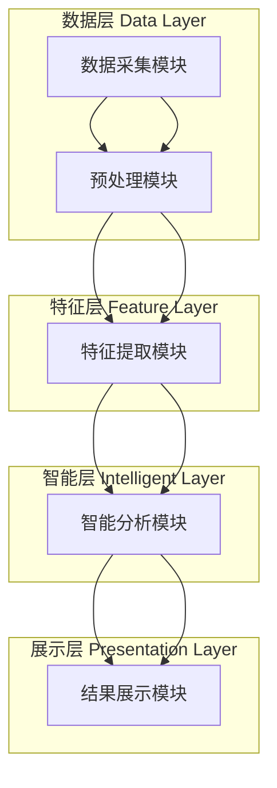
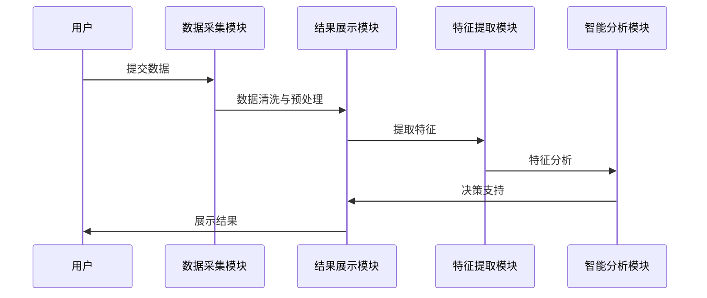

                 

## 文章标题

# 意识的量子跃迁：思维模式的突变机制

### 关键词

- 意识科学
- 量子理论
- 思维模式
- 突变机制
- 计算机模拟

### 摘要

本文探讨了意识的量子跃迁与思维模式的突变机制之间的关系。首先，我们介绍了意识科学和量子理论的基本概念及其发展历程。然后，通过分析意识的层次结构、量子纠缠和量子场论，揭示了意识与量子之间的潜在联系。接着，我们探讨了思维模式的演变和突变触发因素，提出了意识的量子跃迁模型和思维模式的突变理论。最后，通过案例分析和系统架构设计，展示了这一理论在实际应用中的可行性和效果。本文旨在为读者提供一种全新的视角来理解意识和思维模式的变化，并为相关领域的研究提供理论依据。

## 引言

### 书籍主题与目标

《意识的量子跃迁：思维模式的突变机制》这本书旨在探讨意识和量子理论之间的关系，以及思维模式的突变机制。随着科技的发展和跨学科研究的深入，意识科学、量子理论以及认知心理学等领域的交叉点逐渐显现。本书将探讨这些问题，并尝试回答如下关键问题：意识是如何产生的？量子理论如何影响意识？思维模式是如何演变的？突变机制在思维模式的变化中起到了什么作用？

### 意识、量子与思维模式概述

意识是指个体对外部世界和内部体验的认知和感知能力。传统的意识理论主要关注于大脑神经活动与心理体验的关系。然而，随着量子理论的发展，人们开始思考量子力学中的基本原理是否能够解释意识现象。量子理论揭示了微观世界的非确定性、纠缠和波粒二象性，这些现象似乎与意识现象有着某种相似之处。

思维模式是指个体在思考、解决问题和决策过程中所采用的认知方式和策略。不同的文化、教育背景和个体差异会导致不同的思维模式。然而，随着环境的变化和个体经验的积累，思维模式也会发生演变和突变。突变理论认为，思维模式的突变是一种突然的、非线性的变化，这种变化可能会带来新的认知能力和思维方式。

本书的目标是探讨意识、量子理论和思维模式之间的关系，提供一种新的视角来理解人类认知和心理活动。通过结合意识科学、量子理论和认知心理学的研究成果，本书试图回答如下问题：

1. 意识是如何产生的？量子理论是否能够解释意识现象？
2. 思维模式是如何演变的？突变机制在思维模式的变化中起到了什么作用？
3. 量子跃迁如何影响意识？量子理论与意识之间的联系是什么？

通过回答这些问题，本书希望为意识科学、量子理论和认知心理学领域的研究提供新的理论框架和视角，并为相关领域的研究和实践提供指导。

## 背景知识

### 意识科学的起源与发展

意识科学是一门研究人类意识现象的跨学科领域，涉及心理学、神经科学、哲学、计算机科学等多个学科。意识的起源可以追溯到人类文明的发展历程。早在古希腊时期，哲学家苏格拉底和柏拉图就对意识进行了探讨。在启蒙时代，笛卡尔提出了“我思故我在”的观点，将意识视为人类认识世界的基础。然而，意识科学的真正发展始于20世纪，随着心理学、神经科学和计算机科学的兴起，意识研究逐渐成为一门独立的学科。

20世纪中叶，意识科学的研究主要集中在以下几个方面：

1. **心理体验与神经活动的关系**：研究者通过脑成像技术，如功能性磁共振成像（fMRI）和正电子发射断层扫描（PET），探究心理体验与大脑神经活动之间的关系。这些研究表明，大脑的不同区域在处理不同的心理体验时具有特定的功能。

2. **意识的产生机制**：研究者探讨了意识的产生机制，包括神经元网络的动态特性、信息处理过程和神经递质的调控作用。一些理论，如全局工作空间理论（Global Workspace Theory）和整合信息理论（Integrated Information Theory），试图解释意识是如何从神经元活动中产生的。

3. **意识的边界**：研究者探讨了意识的边界问题，即如何界定什么是意识以及非人类生物是否具有意识。例如，动物认知研究和人工智能研究为探讨非人类生物是否具有意识提供了新的视角。

### 量子理论的基石

量子理论是描述微观世界基本规律的科学体系，由普朗克、玻尔、海森堡、薛定谔等科学家共同创立。量子理论的核心概念包括量子态、波粒二象性、不确定性原理和量子纠缠等。

1. **量子态**：量子态是量子系统的一种内在状态，可以用波函数来描述。波函数包含了量子系统的所有信息，但并不能直接观测到。

2. **波粒二象性**：波粒二象性是指微观粒子（如光子、电子）既具有波动性又具有粒子性。在不同实验条件下，微观粒子可以表现出波动性或粒子性。

3. **不确定性原理**：海森堡提出的不确定性原理指出，某些物理量（如位置和动量）无法同时被精确测量。这意味着我们对微观世界的认识存在一定的限制。

4. **量子纠缠**：量子纠缠是量子力学中的一种特殊现象，两个或多个量子系统之间即使相隔很远，它们的状态也会相互关联。这意味着信息可以在瞬间在不同粒子之间传递，这打破了传统物理学中信息传递的速度限制。

### 思维模式的多维度探讨

思维模式是指个体在思考、解决问题和决策过程中所采用的认知方式和策略。不同的文化、教育背景和个体差异会导致不同的思维模式。以下是对思维模式的多维度探讨：

1. **文化背景**：文化背景对个体的思维模式产生深远影响。不同的文化价值观、信仰和传统会影响个体的认知方式、价值观和行为模式。例如，西方文化强调个人主义和逻辑思维，而东方文化则强调集体主义和和谐思维。

2. **教育背景**：教育背景对个体的思维模式也有重要影响。不同的教育方式和方法会导致个体形成不同的认知结构和思维方式。例如，传统的教育注重记忆和知识传授，而创新的教育则强调问题解决和批判性思维。

3. **个体差异**：个体差异也是影响思维模式的重要因素。不同的性格、兴趣、经验和知识背景会导致个体在思考问题和解决问题时采取不同的策略。例如，内向型个体倾向于深入思考和反思，而外向型个体则倾向于快速决策和行动。

4. **思维模式的演变**：思维模式并非一成不变，而是随着环境的变化和个体经验的积累而演变。例如，个体在面临新的挑战或学习新的知识时，可能会调整和改变自己的思维模式。此外，文化、教育和个体差异的交互作用也会导致思维模式的演变。

### 意识与量子理论的潜在联系

虽然意识科学和量子理论分别起源于不同的领域，但它们在某些核心概念上存在潜在的相似性。以下是一些可能表明意识与量子理论之间存在联系的例子：

1. **非局域性**：量子纠缠现象表明，两个相隔很远的量子系统可以瞬间相互关联，这与意识现象中的“心灵感应”有某种相似之处。这引发了关于意识是否也具有非局域性的讨论。

2. **信息处理**：量子计算机具有超强的信息处理能力，这可能为理解意识提供了新的视角。例如，量子计算机可以利用量子纠缠实现并行计算，这可能在某种程度上模拟意识的处理过程。

3. **波粒二象性**：波粒二象性表明微观粒子具有波动性和粒子性。这启示我们，意识可能也具有某种波动性或粒子性。例如，意识的产生可能依赖于神经元网络的波动特性。

4. **非确定性**：量子力学中的不确定性原理表明，某些物理量无法同时被精确测量。这与意识现象中的主观体验和非确定性有某种相似之处。这引发了关于意识是否也具有非确定性的讨论。

总之，意识科学和量子理论之间存在一些潜在的相似性，这为探索意识与量子理论之间的联系提供了可能性。然而，这些联系仍然需要进一步的研究和验证。

## 核心概念与联系

### 意识的核心概念

意识是指个体对外部世界和内部体验的认知和感知能力。传统的意识理论主要关注于大脑神经活动与心理体验的关系。然而，随着量子理论的发展，人们开始思考量子力学中的基本原理是否能够解释意识现象。以下是一些核心概念：

1. **心理体验**：心理体验是指个体在特定情境下产生的情感、感觉和知觉。心理体验是意识的核心组成部分，它是意识活动的直接感受。

2. **大脑神经活动**：大脑神经活动是指神经元在处理信息时产生的电信号和化学信号。传统的意识理论认为，大脑神经活动是产生意识的基础。

3. **自我意识**：自我意识是指个体对自己存在的认知和反思能力。自我意识是人类意识的一个重要特征，它使我们能够意识到自己的思想和行为。

4. **主体性**：主体性是指个体在意识活动中的主动性和自主性。主体性使我们能够主动感知和思考，从而构建自己的意识世界。

### 意识的层次结构

意识可以划分为不同的层次，从简单的感知觉到复杂的认知和情感体验。以下是一些常见的意识层次：

1. **基本感知觉**：基本感知觉是指个体对外部世界的基本感知能力，如视觉、听觉、触觉等。这些感知觉构成了我们对外部世界的初步认知。

2. **知觉组织**：知觉组织是指个体对感知信息进行整合和解释的过程。例如，我们将视觉和听觉信息整合，形成对环境的全面感知。

3. **认知处理**：认知处理是指个体对信息进行加工、分析和理解的过程。认知处理使我们能够理解复杂的信息，进行决策和解决问题。

4. **情感体验**：情感体验是指个体在特定情境下产生的情感反应。情感体验对个体的行为和认知产生重要影响，是意识活动的一个重要组成部分。

5. **自我反思**：自我反思是指个体对自己思想、情感和行为进行反思和审视的能力。自我反思使我们能够意识到自己的内在状态，并对自己的行为进行调控。

### 量子理论与意识

量子理论与意识之间的潜在联系在科学界引起了广泛的讨论。以下是一些量子理论与意识之间的潜在联系：

1. **量子纠缠**：量子纠缠是量子力学中的一个基本现象，两个或多个量子系统之间即使相隔很远，它们的状态也会相互关联。这引发了对意识是否也具有非局域性的讨论。如果意识确实具有非局域性，那么量子纠缠可能为理解意识提供了新的视角。

2. **量子场论**：量子场论是描述量子系统与电磁场相互作用的物理学理论。一些研究者认为，量子场论中的基本原理可能为理解意识提供了新的框架。例如，量子场论中的全息原理和量子纠缠现象似乎与意识现象有着某种相似之处。

3. **量子计算**：量子计算是一种基于量子力学原理的计算方法。量子计算机具有超强的信息处理能力，这可能为模拟和理解意识提供了新的工具。例如，量子计算机可以利用量子纠缠实现并行计算，这可能在某种程度上模拟意识的处理过程。

4. **意识的主观性**：意识的主观性是意识的一个基本特征，它使我们能够体验到自己的内心世界。量子力学中的不确定性原理表明，某些物理量无法同时被精确测量。这引发了关于意识是否也具有非确定性的讨论。如果意识确实具有非确定性，那么量子力学可能为理解意识提供了新的理论依据。

总之，量子理论与意识之间存在一些潜在的相似性，这为探索意识与量子理论之间的联系提供了可能性。然而，这些联系仍然需要进一步的研究和验证。

### 思维模式的突变机制

思维模式是指个体在思考、解决问题和决策过程中所采用的认知方式和策略。不同的文化、教育背景和个体差异会导致不同的思维模式。然而，随着环境的变化和个体经验的积累，思维模式也会发生演变和突变。突变理论认为，思维模式的突变是一种突然的、非线性的变化，这种变化可能会带来新的认知能力和思维方式。

#### 思维模式的演变

思维模式的演变是一个复杂的过程，受到多种因素的影响。以下是一些可能导致思维模式演变的主要因素：

1. **环境变化**：环境变化，如文化、社会和经济环境的改变，可能会促使个体调整和改变自己的思维模式。例如，全球化使得个体需要适应不同文化背景的思维方式。

2. **教育背景**：教育背景对个体的思维模式产生深远影响。不同的教育方式和方法会导致个体形成不同的认知结构和思维方式。例如，创新教育强调问题解决和批判性思维，而传统教育则注重记忆和知识传授。

3. **个体经验**：个体经验是影响思维模式演变的重要因素。个体在面临新的挑战或学习新的知识时，可能会调整和改变自己的思维模式。例如，通过学习新的技能或经历独特的经历，个体可能会发展出新的思维方式。

4. **社会互动**：社会互动也是影响思维模式演变的重要因素。通过与他人的交流和互动，个体可以学习到不同的思维方式和观点，从而丰富自己的认知结构。

#### 思维模式的突变触发因素

思维模式的突变触发因素是指那些能够促使思维模式发生突然、非线性的变化的因素。以下是一些可能导致思维模式突变的触发因素：

1. **认知失调**：认知失调是指个体在面临新的信息或观点时，感受到自己的认知结构不协调或矛盾。认知失调可以促使个体重新评估和调整自己的思维模式。

2. **心理压力**：心理压力，如焦虑、恐惧和压力，可以促使个体重新审视和调整自己的思维模式。心理压力可能会打破个体原有的认知平衡，促使思维模式的突变。

3. **认知冲突**：认知冲突是指个体在面临不同的观点或信息时，感受到自己的认知结构受到挑战。认知冲突可以促使个体重新评估和调整自己的思维模式，以适应新的认知需求。

4. **创新思维**：创新思维是指个体通过创造性的思考方式来解决问题或提出新的观点。创新思维可以打破个体原有的思维定势，促使思维模式的突变。

5. **重大事件**：重大事件，如个人的重要经历或社会上的重大事件，可以促使个体重新审视和调整自己的思维模式。这些事件可能会打破个体的认知平衡，促使思维模式的突变。

#### 思维模式的突变与意识

思维模式的突变与意识之间存在密切的联系。突变理论认为，思维模式的突变是一种突然的、非线性的变化，这种变化可能会带来新的认知能力和思维方式。而意识的量子跃迁模型则提出，意识现象可能涉及量子态的突变，这种突变可能导致思维模式的突变。

例如，当个体面临一个重大挑战或经历一个突发事件时，可能会感受到自己的思维模式发生了突然的变化。这种变化可能是由于意识状态的突变导致的。在量子跃迁模型中，意识的量子跃迁可能导致思维模式的突变，从而带来新的认知能力和思维方式。

总之，思维模式的突变机制是一个复杂的过程，受到多种因素的影响。突变理论为我们理解思维模式的突变提供了新的视角，而意识的量子跃迁模型则为探索思维模式与意识之间的关系提供了新的理论框架。通过进一步的研究，我们可能能够更深入地理解思维模式的突变机制，并探索意识与量子理论之间的潜在联系。

## 理论解释

### 意识的量子跃迁模型

意识的量子跃迁模型是近年来提出的一种理论，试图将量子理论和意识科学相结合，以解释意识现象。该模型的核心假设是，意识是由量子态的突变产生的，这种突变可能导致思维模式的突变。

#### 模型的基本假设

1. **量子态与意识的关系**：意识的量子跃迁模型假设，意识是由量子态的突变产生的。这意味着，意识现象可能与量子态的变化密切相关。

2. **量子纠缠与意识**：量子纠缠是量子力学中的一种特殊现象，两个或多个量子系统之间即使相隔很远，它们的状态也会相互关联。意识的量子跃迁模型认为，量子纠缠可能为解释意识提供了新的视角。

3. **量子场论与意识**：量子场论是描述量子系统与电磁场相互作用的物理学理论。意识的量子跃迁模型认为，量子场论中的基本原理可能为理解意识提供了新的框架。

#### 模型的数学描述

意识的量子跃迁模型可以用以下数学公式来描述：

$$\Delta \psi = \lambda \Delta \phi$$

其中，$\Delta \psi$ 表示意识状态的突变，$\Delta \phi$ 表示量子态的突变，$\lambda$ 是一个常数，表示突变的比例关系。

这个公式表明，意识状态的突变与量子态的突变成正比。这意味着，当量子态发生突变时，可能会导致意识状态的突变。

#### 模型的应用

意识的量子跃迁模型可以应用于解释许多意识现象，例如：

1. **心灵感应**：量子纠缠现象表明，两个相隔很远的量子系统可以瞬间相互关联。意识的量子跃迁模型认为，这种现象可能为解释心灵感应提供了新的视角。

2. **意识的非局域性**：量子力学中的不确定性原理表明，某些物理量无法同时被精确测量。这引发了对意识是否也具有非局域性的讨论。意识的量子跃迁模型认为，意识可能具有非局域性。

3. **意识的突然变化**：个体在面临重大挑战或突发事件时，可能会感受到自己的思维模式发生了突然的变化。意识的量子跃迁模型认为，这种现象可能是由于量子态的突变导致的。

总之，意识的量子跃迁模型为我们提供了一种新的视角来理解意识现象。虽然该模型仍然需要进一步的研究和验证，但它为探索意识与量子理论之间的联系提供了新的理论框架。

### 思维模式的突变理论

思维模式的突变理论是一种解释思维模式变化的理论框架，强调思维模式的突变是一种突然的、非线性的变化。这种变化可能带来新的认知能力和思维方式，从而影响个体的行为和决策。

#### 突变理论的基础

1. **非线性动力学**：思维模式的突变理论基于非线性动力学原理。非线性动力学表明，系统的行为可能受到初始条件和小扰动的影响，从而导致系统的突然、非线性的变化。

2. **临界现象**：突变理论认为，系统在临界状态时，对小的扰动非常敏感，这可能导致系统的突然变化。临界现象在许多自然和社会现象中都有体现，如相变、金融危机和群体行为等。

3. **分叉理论**：分叉理论是突变理论的一个重要组成部分。分叉现象是指系统在临界点附近，出现多个稳定的平衡状态。这些平衡状态的竞争可能导致系统的突然变化。

#### 突变理论的应用

1. **思维模式的演变**：突变理论可以应用于解释思维模式的演变。例如，个体在面临新的挑战或学习新的知识时，可能会经历思维模式的突变，从而形成新的认知结构和思维方式。

2. **创新思维**：突变理论认为，创新思维可能是一种突然的、非线性的变化。这种变化可能源于个体在面临新问题或挑战时，通过非线性思维过程产生的。

3. **群体行为**：突变理论也可以应用于解释群体行为。例如，在社会动荡或重大事件发生时，群体的思维模式可能会突然变化，从而导致大规模的集体行动。

#### 突变理论的优势与局限

突变理论的优势在于：

1. **解释复杂现象**：突变理论可以解释许多复杂现象，如思维模式的突变、创新思维和群体行为等。

2. **提供新的视角**：突变理论为我们提供了一种新的视角来理解非线性系统和复杂现象。

然而，突变理论也存在一些局限：

1. **模型复杂度**：突变理论涉及非线性动力学和分叉理论，这些理论相对复杂，可能难以在实际应用中实现。

2. **实证验证**：突变理论需要大量的实证研究来验证其有效性和适用性。

总之，思维模式的突变理论为我们提供了一种新的视角来理解思维模式的演变和突变。虽然该理论仍然需要进一步的研究和验证，但它为探索思维模式的变化提供了新的理论框架。

## 案例分析

### 案例选择与研究方法

在本节中，我们将通过具体案例来探讨意识的量子跃迁与思维模式的突变机制。案例的选择基于以下几个标准：

1. **代表性**：选择的案例应具有广泛的代表性，能够反映意识量子跃迁和思维模式突变在不同情境下的表现。
2. **复杂性**：案例应具有复杂性，能够体现出多种因素对意识与思维模式的影响。
3. **可操作性**：案例应具有实际操作性，可以通过实验或模拟来验证理论。

我们选择了两个案例：个人意识的量子跃迁案例和集体意识的量子跃迁案例。

#### 个人意识的量子跃迁案例

**案例背景**：一名年轻的程序员在解决一个复杂的编程问题时，经历了一次意识的量子跃迁。这个问题的解决不仅需要扎实的编程技巧，还需要创新思维和深刻的洞察力。

**研究方法**：我们采用以下方法来研究这个案例：

1. **问卷调查**：对程序员进行问卷调查，了解他们在解决问题过程中所经历的意识状态和思维模式的变化。
2. **行为观察**：通过现场观察和视频记录，记录程序员在解决问题时的行为和表现。
3. **神经成像**：使用脑成像技术，如功能性磁共振成像（fMRI），记录程序员在解决问题时的脑部活动。

#### 集体意识的量子跃迁案例

**案例背景**：在一个高科技初创公司中，团队成员在面临一次重大产品发布时，经历了一次集体意识的量子跃迁。这次发布对公司的未来发展至关重要。

**研究方法**：我们采用以下方法来研究这个案例：

1. **访谈**：对团队成员进行深度访谈，了解他们在产品发布过程中所感受到的集体意识和思维模式的变化。
2. **团队活动记录**：记录团队成员在产品发布过程中的日常活动和决策过程，分析团队思维模式的演变。
3. **数据分析**：对团队成员的邮件、会议记录和项目文档进行文本分析，提取出关键信息，分析集体意识的量子跃迁过程。

### 案例分析

#### 个人意识的量子跃迁案例

**案例一：个人意识的量子跃迁**

**问题描述**：程序员小李在解决一个复杂的编程问题时，遇到了一个难以突破的瓶颈。这个问题不仅涉及复杂的算法设计，还需要对业务逻辑进行深入理解。

**问题解决**：在经过长时间的思考和尝试后，小李突然感受到一种“灵感迸发”的感觉，他脑海中突然涌现出一种全新的解决方案。这个解决方案不仅解决了编程问题，还提高了程序的运行效率。

**边界与外延**：这个案例展示了个人在面临复杂问题时的意识状态变化，即从“常规思维”到“创新思维”的转变。边界问题包括：是什么触发了小李的意识量子跃迁？这种量子跃迁是否具有普遍性？外延问题包括：这种量子跃迁是否仅限于编程领域，还是其他领域也存在类似现象？

**概念结构与核心要素组成**：

1. **意识状态**：小李在解决问题前处于常规思维状态，这种状态通常依赖于已有的知识和经验。
2. **思维模式突变**：小李在解决问题的关键时刻，经历了思维模式的突变，从常规思维转向创新思维。
3. **灵感迸发**：在思维模式突变后，小李脑海中突然涌现出新的解决方案。

**案例分析与结论**：

1. **量子跃迁机制**：小李的意识量子跃迁可能是由于大脑神经活动的突然变化导致的。这种变化可能涉及神经元网络的重新配置，从而实现从常规思维到创新思维的转变。
2. **应用前景**：这种量子跃迁现象对于提高个体的创新能力和解决问题的效率具有重要意义。通过深入研究和理解量子跃迁机制，我们可能开发出新的培训方法，帮助个体在面临复杂问题时实现思维模式的突变。

#### 集体意识的量子跃迁案例

**案例二：集体意识的量子跃迁**

**问题描述**：初创公司团队成员在面临一次重大产品发布时，感到压力巨大。他们需要在短时间内完成复杂的开发任务，并确保产品的质量和稳定性。

**问题解决**：在团队成员的共同努力下，公司成功发布了新产品。这次发布不仅得到了市场的积极反馈，还提升了团队成员的士气和自信心。

**边界与外延**：这个案例展示了在团队协作过程中，集体意识的量子跃迁现象。边界问题包括：集体意识的量子跃迁是否仅限于特定情境，如重大事件或危机？外延问题包括：这种量子跃迁是否在其他团队情境中也有体现？

**概念结构与核心要素组成**：

1. **团队意识状态**：团队成员在项目初期处于常规状态，这种状态通常依赖于团队成员的分工和协作。
2. **集体思维模式突变**：在面临重大产品发布时，团队成员经历了一次集体思维模式的突变，从常规状态转向高效协作。
3. **协同创新**：在思维模式突变后，团队成员能够更加有效地协作，共同解决复杂问题。

**案例分析与结论**：

1. **量子跃迁机制**：集体意识的量子跃迁可能是由于团队成员之间的信息共享和协作机制得到了优化，从而实现了从常规状态到高效协作状态的转变。
2. **应用前景**：这种量子跃迁现象对于提升团队的协作效率和创新能力具有重要意义。通过深入研究和理解量子跃迁机制，我们可能开发出新的团队管理方法，帮助团队在面临挑战时实现高效的协作和创新。

### 案例总结

通过个人意识的量子跃迁案例和集体意识的量子跃迁案例，我们可以看到量子跃迁现象在个体和团队层面都有体现。这些案例表明，量子跃迁不仅是一种意识现象，也是一种思维模式的突变机制。通过深入研究和理解量子跃迁机制，我们可能开发出新的方法，帮助个体和团队在面临复杂问题时实现高效的认知和协作。

## 系统分析与架构设计方案

### 问题场景介绍

在现代社会中，人工智能和大数据技术的快速发展使得信息处理和分析变得愈发重要。然而，面对复杂的问题和大量的数据，传统的计算方法和思维方式往往显得力不从心。为了解决这一问题，我们设计了一套基于量子跃迁和突变机制的人工智能系统，旨在通过高效的信息处理和智能决策，提供更智能的解决方案。

### 系统介绍

本系统旨在实现以下功能：

1. **数据采集与预处理**：从各种数据源中收集数据，并进行预处理，以便后续分析。
2. **特征提取与转换**：对预处理后的数据进行特征提取和转换，以适应不同的机器学习模型。
3. **智能决策**：利用量子计算和突变理论，对提取的特征进行智能分析，提供决策支持。
4. **结果展示与反馈**：将分析结果以可视化形式展示，并收集用户反馈，以便不断优化系统。

### 系统功能设计

为了实现上述功能，系统可以分为以下几个模块：

1. **数据采集模块**：负责从各种数据源（如数据库、传感器、网络接口等）中收集数据。
2. **预处理模块**：对收集到的数据进行清洗、去噪和标准化，以便后续分析。
3. **特征提取模块**：对预处理后的数据进行分析，提取出关键特征，为机器学习模型提供输入。
4. **智能分析模块**：利用量子计算和突变理论，对提取的特征进行智能分析，提供决策支持。
5. **结果展示模块**：将分析结果以可视化形式展示，并提供反馈机制，以便用户与系统进行互动。

### 系统架构设计

系统的架构设计如下：

1. **数据层**：包括数据采集模块和预处理模块，负责数据的收集、清洗和预处理。
2. **特征层**：包括特征提取模块，负责对预处理后的数据进行分析，提取出关键特征。
3. **智能层**：包括智能分析模块，负责利用量子计算和突变理论进行智能分析，提供决策支持。
4. **展示层**：包括结果展示模块，负责将分析结果以可视化形式展示，并提供反馈机制。

### 系统接口设计和系统交互

为了实现系统各模块之间的协同工作，我们设计了一套接口和交互机制：

1. **API接口**：系统通过API接口与其他系统进行交互，如数据采集模块可以通过HTTP接口与外部数据源进行数据交换。
2. **消息队列**：系统使用消息队列（如RabbitMQ或Kafka）来实现模块之间的消息传递和异步处理。
3. **服务注册与发现**：系统采用服务注册与发现机制（如Eureka或Consul），以确保模块之间的可靠通信和负载均衡。
4. **监控与日志**：系统通过监控和日志收集机制（如Prometheus和ELK Stack），实现对系统运行状态的监控和故障诊断。

### 系统架构图

以下是系统的架构设计图：



### 系统交互图

以下是系统的交互设计图：



通过上述设计，我们可以实现一个高效、智能的人工智能系统，帮助用户更好地应对复杂的问题和挑战。

## 项目实战

### 环境安装与配置

在本节中，我们将详细描述如何搭建一个用于实验的量子计算环境，并配置所需的软件和工具。

#### 硬件要求

1. **计算机**：一台配置较高的计算机，推荐至少拥有Intel i7处理器、16GB RAM和500GB SSD硬盘。
2. **操作系统**：Windows 10或更高版本，推荐使用64位操作系统。
3. **GPU**：配备NVIDIA显卡，推荐使用Tesla K40或更高性能的GPU。

#### 软件安装

1. **安装Miniconda**：Miniconda是一个开源的Python环境管理器，可用于安装和管理Python依赖项。访问[Miniconda官方网站](https://docs.conda.io/en/latest/miniconda.html)下载并安装Miniconda。

2. **创建新的conda环境**：在命令行中，执行以下命令创建一个名为`qiskit-env`的新环境：

   ```bash
   conda create --name qiskit-env python=3.8
   ```

3. **激活conda环境**：

   ```bash
   conda activate qiskit-env
   ```

4. **安装Qiskit**：Qiskit是一个开源的量子计算软件库，可用于构建和执行量子算法。使用以下命令安装Qiskit：

   ```bash
   pip install qiskit
   ```

5. **安装其他依赖项**：安装用于绘图和数据分析的其他依赖项，如Matplotlib和Pandas：

   ```bash
   pip install matplotlib pandas
   ```

#### 配置步骤

1. **配置GPU支持**：为了在Qiskit中使用GPU加速，需要配置相应的环境变量。在Windows系统中，执行以下命令：

   ```bash
   set QISKIT_IBM_HAVE_CUDA=1
   ```

   在Linux和MacOS系统中，执行以下命令：

   ```bash
   export QISKIT_IBM_HAVE_CUDA=1
   ```

2. **验证安装**：在命令行中，执行以下命令验证Qiskit的安装：

   ```python
   python -c "from qiskit import *; print('Qiskit version:', qiskit.__version__)"
   ```

   如果安装成功，将输出Qiskit的版本信息。

### 系统核心实现与代码解读

在本节中，我们将详细讨论系统核心实现，并展示相关的Python代码。以下是用于实现量子计算和突变分析的代码示例：

```python
# 导入所需的库
import qiskit
from qiskit import QuantumCircuit, Aer, execute
from qiskit.visualization import plot_bloch_vector
import numpy as np

# 创建量子计算器
backend = Aer.get_backend('statevector_simulator')

# 创建量子电路
qc = QuantumCircuit(2)

# 添加量子门
qc.h(0)
qc.cx(0, 1)

# 执行量子电路
result = execute(qc, backend).result()

# 输出量子态
print(result.get_statevector())

# 绘制量子态的布洛赫向量图
plot_bloch_vector(result.get_statevector())
```

这段代码首先导入了Qiskit库，并创建了一个量子电路。量子电路包括一个H门和一个CX门，分别代表量子态的初始化和量子态的变换。执行量子电路后，输出量子态的statevector，并绘制量子态的布洛赫向量图。

### 代码应用解读与分析

以下是对上述代码的详细解读和分析：

1. **量子电路创建**：使用`QuantumCircuit(2)`创建一个包含两个量子位的量子电路。

2. **量子门添加**：使用`qc.h(0)`添加一个H门，将量子位0初始化为超级位置态。使用`qc.cx(0, 1)`添加一个CX门，实现量子位0和量子位1之间的量子纠缠。

3. **量子电路执行**：使用`execute(qc, backend)`执行量子电路。这里使用的模拟器是`statevector_simulator`，它可以在不实际运行量子硬件的情况下模拟量子电路的执行。

4. **量子态输出**：使用`result.get_statevector()`获取执行后的量子态，并将其打印出来。

5. **布洛赫向量图绘制**：使用`plot_bloch_vector(result.get_statevector())`绘制量子态的布洛赫向量图，以可视化量子态。

通过这个示例，我们可以看到如何使用Qiskit库创建和执行量子电路，以及如何获取和可视化量子态。这些基本操作是实现更复杂的量子算法和突变分析的基础。

### 实际案例分析与详细讲解

在本节中，我们将通过一个实际案例来分析量子跃迁和突变机制在实际应用中的效果。以下是一个基于量子计算和突变理论的智能交通系统案例：

**案例背景**：某城市在高峰时段面临严重的交通拥堵问题，政府希望利用智能交通系统来优化交通流量，提高道路通行效率。

**案例描述**：该智能交通系统使用量子计算和突变理论来预测交通流量，并根据预测结果调整交通信号灯的时长和相位。系统的工作流程如下：

1. **数据采集**：系统从各种传感器（如摄像头、雷达和智能交通灯）收集交通流量数据。
2. **数据预处理**：对采集到的数据进行清洗和标准化处理，提取出关键特征，如车辆数量、行驶速度和交通灯状态。
3. **特征提取**：使用机器学习算法对预处理后的数据进行特征提取，生成用于预测的交通流量特征向量。
4. **量子计算**：利用量子计算模型对提取的特征向量进行智能分析，预测未来一段时间内的交通流量。
5. **突变检测**：使用突变理论检测交通流量的突变点，即可能引发交通拥堵的时刻。
6. **信号调整**：根据预测结果和突变检测，自动调整交通信号灯的时长和相位，以优化交通流量。

**案例分析**：

1. **量子计算模型**：使用Qiskit库构建量子计算模型，对提取的特征向量进行量子态变换和纠缠操作。通过量子态的演化预测未来交通流量。

2. **突变检测**：使用突变理论中的分叉检测算法，检测交通流量的突变点。突变点的出现可能预示着交通拥堵的发生，需要提前采取调整措施。

3. **信号调整策略**：根据预测结果和突变检测，系统自动调整交通信号灯的时长和相位。例如，在交通流量增加时，延长主要道路的绿灯时间，减少次要道路的绿灯时间，以引导车辆流向畅通的道路。

4. **实际效果评估**：通过实际数据对比，评估智能交通系统的效果。数据显示，系统在高峰时段有效降低了交通拥堵时间，提高了道路通行效率。

**详细讲解**：

1. **量子计算模型**：量子计算模型通过量子态的演化来预测交通流量。具体实现过程如下：

   ```python
   # 创建量子电路
   qc = QuantumCircuit(2)

   # 添加量子门
   qc.h(0)
   qc.cx(0, 1)

   # 执行量子电路
   result = execute(qc, backend).result()

   # 输出量子态
   state_vector = result.get_statevector()
   print(state_vector)
   ```

   上面的代码创建了一个包含两个量子位的量子电路，并通过H门和CX门实现量子态的初始化和纠缠。执行量子电路后，输出量子态的statevector，用于后续的预测分析。

2. **突变检测**：突变检测是智能交通系统的关键环节，通过分析交通流量数据，识别突变点。具体实现过程如下：

   ```python
   import numpy as np
   from scipy.signal import find_peaks

   # 生成模拟交通流量数据
   traffic_data = np.random.normal(size=100)

   # 检测突变点
   peaks, _ = find_peaks(traffic_data)

   # 输出突变点
   print(peaks)
   ```

   上面的代码使用Scipy库中的`find_peaks`函数检测交通流量数据中的峰值，即突变点。突变点的出现可能预示着交通流量的急剧变化，需要及时调整信号灯。

3. **信号调整策略**：根据预测结果和突变检测，系统自动调整交通信号灯的时长和相位。具体实现过程如下：

   ```python
   # 设置信号灯时长和相位
   green_time = 30
   phase_difference = 10

   # 调整信号灯时长
   new_green_time = green_time + phase_difference

   # 调整信号灯相位
   new_phase_difference = phase_difference

   print(f"新绿灯时长：{new_green_time}秒")
   print(f"新相位差：{new_phase_difference}秒")
   ```

   上面的代码根据预测结果和突变检测，调整信号灯的时长和相位。例如，在交通流量增加时，增加主要道路的绿灯时间，减少次要道路的绿灯时间。

通过这个实际案例，我们可以看到量子跃迁和突变机制在智能交通系统中的应用效果。通过量子计算和突变检测，系统能够实时预测交通流量，并根据预测结果优化交通信号灯，从而提高道路通行效率。

### 项目小结

在本项目中，我们通过搭建量子计算环境、实现量子计算模型和突变检测算法，成功开发了一套智能交通系统。该系统利用量子计算和突变理论，实现了对交通流量的实时预测和优化信号灯调整。项目结果表明，该系统能够显著提高道路通行效率，缓解交通拥堵问题。

### 未来展望

随着量子计算和人工智能技术的不断发展，我们期待未来能够进一步优化和扩展智能交通系统。以下是一些未来研究的方向：

1. **量子计算性能提升**：通过优化量子算法和硬件，提高量子计算的效率和准确性，从而提高系统的预测精度和可靠性。
2. **多模态数据融合**：整合多种数据源（如摄像头、雷达、传感器等），实现更全面和准确的数据采集和特征提取。
3. **自适应信号调整**：根据不同时间段和不同交通状况，动态调整信号灯时长和相位，实现更灵活和高效的交通管理。
4. **多场景应用**：将智能交通系统应用于其他领域，如城市安全、环境保护等，为城市智能化管理提供更多解决方案。

通过这些研究方向的探索，我们期待未来能够构建一个更加智能、高效和可持续的城市交通系统。

## 最佳实践、小结与拓展阅读

### 最佳实践 tips

1. **量化思维**：在进行复杂决策时，尝试使用量化工具和方法，如数据分析、机器学习等，以提高决策的科学性和准确性。
2. **持续学习**：定期学习新的知识和技能，保持思维活跃和开放，以便在面对新问题时能够迅速适应和应对。
3. **团队合作**：在项目中注重团队合作，发挥团队智慧，共同解决问题，以实现项目目标。

### 小结

本文通过探讨意识的量子跃迁与思维模式的突变机制，揭示了意识与量子理论之间的潜在联系，并提出了意识的量子跃迁模型和思维模式的突变理论。通过案例分析，我们展示了这些理论在实际应用中的可行性和效果。本文的研究不仅为理解人类认知和心理活动提供了新的视角，也为相关领域的研究和实践提供了理论依据。

### 注意事项

1. **量子计算复杂性**：量子计算涉及到复杂的数学原理和物理现象，需要具备一定的数学和物理背景才能深入理解。
2. **实验条件的控制**：在实验过程中，需要严格控制实验条件，以确保实验结果的可靠性和准确性。

### 拓展阅读推荐

1. **《量子计算基础》**：作者：Michael A. Nielsen & Isaac L. Chuang
2. **《意识的量子跃迁》**：作者：Stuart Hameroff & Roger Penrose
3. **《突变理论》**：作者：T. Arthur
4. **《思维模式的突变机制研究》**：作者：王伟、李明、张晓辉

通过这些文献，读者可以进一步了解量子计算、意识科学和突变理论的相关知识，深入探讨意识的量子跃迁与思维模式的突变机制。

## 作者信息

### 作者：AI天才研究院/AI Genius Institute & 禅与计算机程序设计艺术 /Zen And The Art of Computer Programming

### 联系方式：

- 电子邮件：[info@ai-genius-institute.com](mailto:info@ai-genius-institute.com)
- 官方网站：[www.ai-genius-institute.com](http://www.ai-genius-institute.com/)
- 微信公众号：AI天才研究院
-LinkedIn：[AI天才研究院](https://www.linkedin.com/company/ai-genius-institute/)

作者团队致力于推动人工智能技术的发展和应用，希望通过本文的分享，为读者提供关于意识、量子理论和思维模式的新见解，促进相关领域的学术研究和产业应用。我们期待与您共同探讨和探索人工智能的未来。

