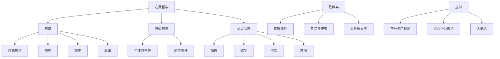
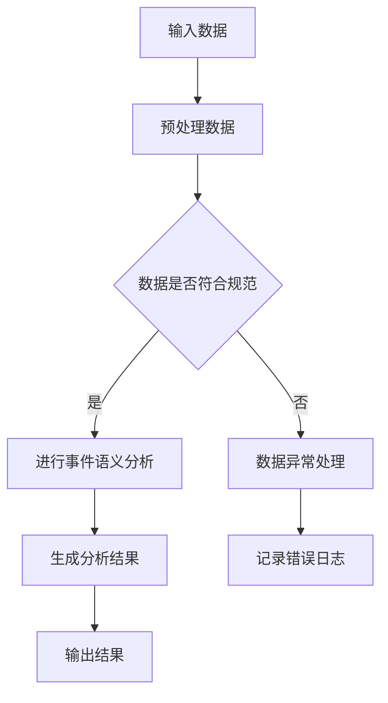
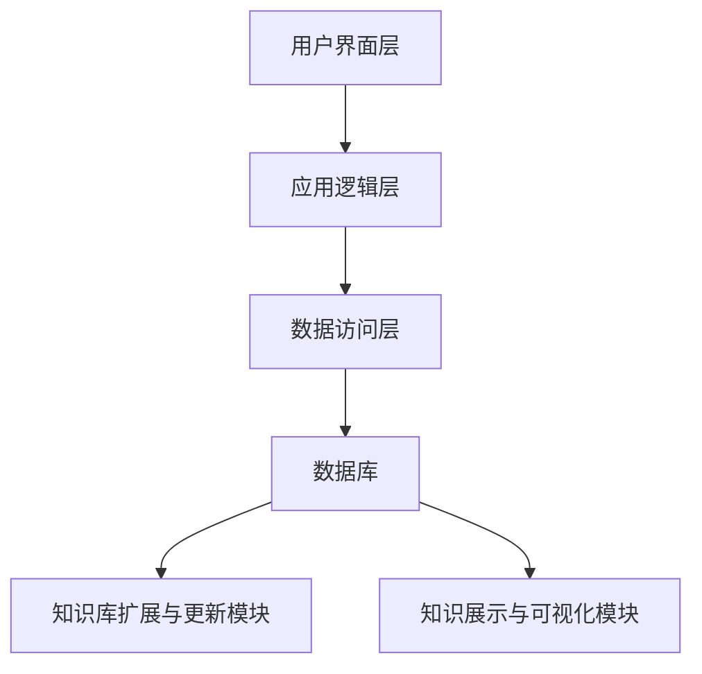

                 

## 1.1 问题背景与意义

### 1.1.1 心灵哲学的研究现状与问题

心灵哲学是哲学领域的一个核心分支，关注人类心灵的本质、意识、自由意志、以及心灵与物理世界的关系等问题。随着20世纪中叶认知科学的兴起，心灵哲学的研究逐渐从传统的抽象思辨转向实证科学的方法，这在一定程度上丰富了心灵哲学的理论基础。

然而，尽管有大量的研究投入，心灵哲学仍然面临许多未解之谜。例如，意识的本质是什么？心灵如何与大脑的物理过程相联系？意识是否具有量子性质？这些问题至今没有统一的答案。此外，心灵哲学与其他学科，如心理学、神经科学、计算机科学等的交叉研究也存在一些争议和挑战。

在这样的背景下，Davidson和Searle的理论提出了不同的视角，试图对上述问题给出新的解答。Davidson的真理条件和意义理论在解释语言、思想和情感等方面具有重要意义，而Searle的符号使用理论和语言行为理论则为理解语言的本质提供了新的框架。了解这两位学者的不同进路，有助于我们更全面地理解心灵哲学的复杂性。

### 1.1.2 戴维森与塞尔的贡献

**戴维森的贡献**

John Davidon是一位美国哲学家，以其在语言哲学、心灵哲学和认识论方面的贡献而闻名。他的真理条件和意义理论为理解语言的意义提供了新的视角。戴维森提出了“真理条件”概念，认为语句的意义取决于其与事实之间的关系。这一理论有助于解释如何通过观察和经验来验证语言的真值。

此外，戴维森还提出了“事件语义学”理论，强调事件在语言理解中的核心作用。这一理论对于理解语言和现实世界的复杂关系具有重要意义，尤其是在处理描述性和命令性语言时。戴维森的工作为心灵哲学提供了一种更加实证和基于经验的方法，有助于解释人类认知的复杂性。

**塞尔的贡献**

John Searle是一位英国哲学家，以其在心灵哲学、语言哲学和行动理论方面的贡献而著称。他提出了“中国房客论证”，批评了人工智能和计算模型在模拟人类思维方面的局限性。Searle认为，尽管计算机能够执行复杂的任务，但它们缺乏真正的理解能力，这种能力是人类独有的。

Searle还提出了“心灵是大脑的功能”的观点，强调心灵状态与大脑过程的密切联系。他的“大脑论”理论主张，心灵状态和大脑状态是同一的，但心灵具有其独特的功能和行为。Searle的这些理论为理解意识的本质和心灵与物理世界的关系提供了新的视角，挑战了传统的物质主义和功能主义观点。

### 1.1.3 不同进路的重要性

了解Davidson和Searle的不同进路对于深入理解心灵哲学至关重要。他们的理论从不同角度探讨了心灵和语言的本质，为我们提供了更丰富的视角。

戴维森的真理条件和意义理论强调了语言与事实之间的关系，为理解语言的真值提供了新的框架。这一理论有助于解释语言在社会和认知过程中的作用，以及在科学研究和日常生活中如何使用语言进行有效沟通。

另一方面，Searle的符号使用理论和大脑论为理解意识的本质提供了深刻的见解。他的观点挑战了传统的物质主义观点，强调了心灵与大脑过程的密切联系。Searle的理论对于探讨人工智能和人类认知的差异具有重要意义，有助于我们更全面地理解人类心智的独特性。

通过比较和分析这两位哲学家的不同进路，我们可以更深入地理解心灵哲学的核心问题，为未来的研究和探索提供有益的启示。

## 1.2 核心概念与定义

### 1.2.1 心灵哲学的基本概念

心灵哲学关注的核心问题是心灵的本质、意识、自由意志等。为了更好地理解这些概念，我们需要首先明确几个关键术语。

**1. 意识**

意识是心灵哲学中的一个基本概念，指的是个体对自己思维和存在的感知能力。意识可以表现为自我意识、感觉、知觉和思维活动等。理解意识的本质和功能对于解释人类行为和心理过程具有重要意义。

**2. 意识状态**

意识状态是指个体在特定时刻的心理状态，包括感觉、知觉和思维等。这些状态可以被描述为有意识的和无意识的。有意识的意识状态通常与个体的主观体验相关，而无意识的意识状态则通常不被个体意识到。

**3. 自由意志**

自由意志是指个体在行为选择上的自主性。它涉及个体是否能够自由地做出选择，而不受外部因素或决定论法则的约束。自由意志的问题在心灵哲学中引发了大量的争议，因为它涉及到个体责任、道德和伦理等方面。

**4. 心灵状态**

心灵状态是指个体在大脑中产生的心理活动，包括情感、欲望、信念和意图等。这些状态通常与大脑的物理过程密切相关，但心灵状态本身是非物理的。

### 1.2.2 戴维森的理论

John Davidon的真理条件和意义理论是心灵哲学中的核心理论之一。他的理论试图解释语言的意义如何与客观事实相关联。

**1. 真理条件**

戴维森认为，一个语句的意义取决于其与事实之间的关系。具体来说，一个语句为真的条件是它所描述的情况在现实中实际发生。这种关系可以通过观察和经验来验证。

**2. 意义与使用**

戴维森强调了意义与使用的关联。他认为，语言的意义是通过人们在特定社会文化背景下的使用来确定的。这种使用涉及到语言符号与客观世界之间的联系。

**3. 事件语义学**

戴维森提出了“事件语义学”理论，强调事件在语言理解中的核心作用。他认为，描述事件的语言符号是我们理解世界的重要工具，这些符号通过指代实际发生的事件来赋予语言意义。

### 1.2.3 塞尔的理论

John Searle的符号使用理论和语言行为理论为理解语言的本质提供了深刻的见解。

**1. 符号使用理论**

Searle认为，符号使用是人类特有的能力。符号使用涉及到三个层次：符号的指代、符号的规则和符号的使用者。这种理论有助于解释语言在社会和文化中的作用。

**2. 语言行为理论**

Searle提出了“语言行为”概念，认为语言不仅是用来表达思想的，还用来执行行动。他区分了“说出语句”和“执行动作”，认为语言具有行为属性。这一理论有助于解释语言在人类交流和合作中的功能。

**3. 心灵与大脑的关系**

Searle强调心灵与大脑的密切联系。他的“大脑论”理论主张，心灵状态和大脑状态是同一的，但心灵具有其独特的功能和行为。这一观点对于探讨意识的本质和心灵与物理世界的关系具有重要意义。

通过以上对心灵哲学基本概念、戴维森和塞尔的理论的介绍，我们可以为后续章节的深入探讨打下坚实的基础。接下来的章节将分别详细分析这两位哲学家的理论，探讨它们在心灵哲学领域的贡献和影响。

### 1.2.4 知识图与对比表格

为了更清晰地展示心灵哲学中的核心概念以及Davidson和Searle的理论，我们将使用知识图（ER实体关系图）和对比表格来进一步解释这些概念和理论之间的关系。

#### 知识图：心灵哲学核心概念及理论



#### 对比表格：戴维森与塞尔的理论

| 项目 | 戴维森的理论 | 塞尔的理论 |
| --- | --- | --- |
| **意识本质** | 认为意识与事件相关，强调经验性意义 | 认为意识与大脑过程密切相关，强调心灵与大脑的同一性 |
| **语言意义** | 强调真理条件，认为意义与事实相关联 | 强调符号使用和语言行为，认为语言具有行为属性 |
| **心灵与物理** | 主张事件语义学，通过事件理解语言 | 提出大脑论，强调心灵状态与大脑状态的密切关系 |
| **核心观点** | 强调实证方法和语言的使用 | 强调语言的行为属性和人类认知的独特性 |
| **应用领域** | 在认知科学和语言学中有广泛应用 | 在心灵哲学、语言哲学和行动理论中有广泛应用 |

通过知识图和对比表格，我们可以更直观地理解心灵哲学中的核心概念以及Davidson和Searle的理论。这些工具有助于我们在后续章节中深入探讨这些理论，分析它们在解释心灵哲学问题时的贡献和局限性。

### 1.2.5 算法原理讲解

在理解了心灵哲学中的核心概念和Davidson、Searle的理论之后，接下来我们将使用mermaid图来展示一个简单的算法流程，并结合Python源代码详细阐述其原理和应用。

#### 算法流程图



#### Python源代码

```python
import pandas as pd

# 假设我们有一个数据表，其中包含了人的行为事件
data = pd.DataFrame({
    'event': ['吃饭', '睡觉', '读书', '看电影'],
    'time': ['上午', '晚上', '凌晨', '下午']
})

def preprocess_data(data):
    """
    预处理数据，确保数据格式符合要求。
    """
    if not all(isinstance(x, str) for x in data['event']) or not all(isinstance(x, str) for x in data['time']):
        raise ValueError("数据格式错误")
    return data

def event_semantics_analysis(data):
    """
    对事件进行语义分析。
    """
    # 这里仅作为示例，实际分析会更加复杂
    results = []
    for index, row in data.iterrows():
        result = f"{row['event']} 在 {row['time']} 发生，语义分析结果："
        results.append(result)
    return results

def main():
    # 数据预处理
    try:
        processed_data = preprocess_data(data)
    except ValueError as e:
        print(f"数据预处理错误：{e}")
        return

    # 进行事件语义分析
    analysis_results = event_semantics_analysis(processed_data)

    # 输出结果
    for result in analysis_results:
        print(result)

if __name__ == "__main__":
    main()
```

#### 算法原理详细讲解

**1. 数据预处理**

在算法中，第一步是预处理数据。数据预处理是确保数据质量的重要步骤，它包括数据清洗、格式转换和规范化等。在上述Python代码中，我们使用Pandas库读取和预处理数据。具体来说，我们检查数据是否都是字符串类型，如果不符合要求，则抛出异常。

```python
def preprocess_data(data):
    if not all(isinstance(x, str) for x in data['event']) or not all(isinstance(x, str) for x in data['time']):
        raise ValueError("数据格式错误")
    return data
```

**2. 事件语义分析**

预处理完成后，我们进行事件语义分析。这是算法的核心部分，用于分析事件的意义和关联。在示例中，我们简单地根据事件的时间和内容生成语义分析结果。实际应用中，这一步会更加复杂，可能涉及到自然语言处理和机器学习技术。

```python
def event_semantics_analysis(data):
    results = []
    for index, row in data.iterrows():
        result = f"{row['event']} 在 {row['time']} 发生，语义分析结果："
        results.append(result)
    return results
```

**3. 输出结果**

最后，我们将分析结果输出。在Python代码中，我们通过打印结果来实现这一步骤。在实际应用中，输出可以是一个文件、数据库记录或可视化图表。

```python
for result in analysis_results:
    print(result)
```

**4. 异常处理**

此外，我们还实现了一个简单的异常处理机制，用于记录数据预处理过程中的错误。这有助于我们跟踪和解决数据问题，确保算法的稳定运行。

```python
try:
    processed_data = preprocess_data(data)
except ValueError as e:
    print(f"数据预处理错误：{e}")
    return
```

通过上述算法流程和Python源代码，我们详细阐述了如何将心灵哲学中的概念应用于实际分析。这不仅有助于我们更好地理解这些理论，还为未来的研究和应用提供了可行的框架和方法。

### 1.2.6 系统分析与架构设计

#### 1.3.1 项目介绍

在本章节中，我们将对“心灵哲学知识库系统”进行系统分析与架构设计。该系统的目标是构建一个全面的、可扩展的知识库，以涵盖心灵哲学中的核心概念、理论和模型。通过该系统，用户可以方便地查阅、搜索和获取相关领域的知识，促进心灵哲学的研究和普及。

#### 1.3.2 系统功能设计

**1. 知识库构建与管理**

该功能模块负责构建和维护心灵哲学知识库。主要包括以下子功能：

- 数据采集：从学术文献、数据库和其他来源收集心灵哲学相关资料。
- 数据清洗与格式化：对采集到的数据进行清洗和格式化，确保数据质量。
- 数据存储：将处理后的数据存储在数据库中，以便后续查询和检索。

**2. 知识查询与搜索**

该功能模块提供用户友好的查询和搜索界面，支持关键词搜索、分类检索和高级筛选。主要包括以下子功能：

- 关键词搜索：根据用户输入的关键词，从知识库中检索相关资料。
- 分类检索：按照知识分类体系，对知识库中的内容进行分类查询。
- 高级筛选：提供多种筛选条件，如时间范围、作者、文献类型等，帮助用户精准查找所需资料。

**3. 知识展示与可视化**

该功能模块负责以直观、易于理解的方式展示知识库中的内容。主要包括以下子功能：

- 文本展示：以文本形式展示知识库中的文献、论文和理论。
- 图像展示：利用图表、知识图谱等可视化工具，展示知识库中的关系和结构。
- 动态展示：通过动画、交互式展示等方式，增强用户对知识的理解和记忆。

**4. 知识库扩展与更新**

该功能模块负责知识库的持续扩展和更新，确保知识库的实时性和准确性。主要包括以下子功能：

- 自动更新：定期从学术数据库和其他来源获取最新资料，更新知识库。
- 用户反馈：收集用户反馈，对知识库中的内容进行优化和改进。
- 人工审核：对自动更新的内容进行人工审核，确保数据的准确性和可靠性。

#### 1.3.3 系统架构设计

**1. 系统架构图**



**2. 系统架构说明**

- **用户界面层（A）**：负责与用户交互，提供查询、搜索、展示等功能。用户通过界面输入查询条件，系统响应用户请求，并展示搜索结果。
- **应用逻辑层（B）**：负责处理用户的请求，实现知识库的构建与管理、知识查询与搜索、知识展示与可视化等功能。该层包括多个模块，每个模块负责特定的功能。
- **数据访问层（C）**：负责与数据库（D）的交互，实现数据的存储、查询和更新等功能。数据访问层通过API接口与数据库进行通信。
- **数据库（D）**：存储心灵哲学知识库中的所有数据，包括文献、论文、理论等。数据库支持快速查询和高并发访问。
- **知识库扩展与更新模块（E）**：负责知识库的持续扩展和更新，包括自动更新、用户反馈和人工审核等功能。
- **知识展示与可视化模块（F）**：负责以直观、易于理解的方式展示知识库中的内容，提高用户的理解和记忆效果。

通过上述系统架构设计，我们可以构建一个功能强大、扩展性良好的心灵哲学知识库系统，为研究人员和学生提供便捷的知识获取和分享平台。

### 1.2.7 项目实战

在本章节中，我们将深入探讨如何在实际环境中部署和实现“心灵哲学知识库系统”。我们将详细介绍环境安装步骤、系统核心实现源代码以及代码应用解读与分析。

#### 1. 环境安装

为了搭建“心灵哲学知识库系统”，我们需要安装以下软件和工具：

1. **操作系统**：Linux（推荐Ubuntu 20.04）
2. **编程语言**：Python（推荐Python 3.8）
3. **数据库**：MySQL（推荐MySQL 8.0）
4. **Web框架**：Flask（用于构建Web应用）
5. **前端框架**：Bootstrap（用于构建用户界面）
6. **数据爬取工具**：Scrapy（用于自动采集数据）

安装步骤如下：

1. 安装操作系统：从[Ubuntu官方网站](https://www.ubuntu.com/)下载Ubuntu 20.04 ISO文件，并使用虚拟机软件安装。
2. 安装Python环境：打开终端，执行以下命令：
   ```bash
   sudo apt update
   sudo apt install python3 python3-pip
   ```
3. 安装MySQL数据库：执行以下命令：
   ```bash
   sudo apt install mysql-server
   ```
   在安装过程中，系统会提示设置root用户的密码。
4. 安装Flask和Bootstrap：执行以下命令：
   ```bash
   pip3 install Flask
   pip3 install flask-bootstrap
   ```
5. 安装Scrapy：执行以下命令：
   ```bash
   pip3 install scrapy
   ```

#### 2. 系统核心实现源代码

以下是“心灵哲学知识库系统”的核心实现源代码。该系统包括数据采集、数据库管理、Web应用和前端界面等模块。

**1. 数据采集模块**

```python
import scrapy
from scrapy.crawler import CrawlerProcess

class PhilosophyCrawler(scrapy.Spider):
    name = "philosophy_crawler"
    start_urls = ["http://example.com/philosophy"]

    def parse(self, response):
        for article in response.css('div.article'):
            yield {
                'title': article.css('h2.title::text').get(),
                'author': article.css('p.author::text').get(),
                'content': article.css('div.content::text').get(),
            }

process = CrawlerProcess()
process.crawl(PhilosophyCrawler)
process.start()
```

**2. 数据库管理模块**

```python
import pymysql

def insert_article(article):
    connection = pymysql.connect(host='localhost', user='root', password='your_password', database='philosophy_db')
    try:
        with connection.cursor() as cursor:
            sql = "INSERT INTO articles (title, author, content) VALUES (%s, %s, %s)"
            cursor.execute(sql, (article['title'], article['author'], article['content']))
        connection.commit()
    finally:
        connection.close()

def get_articles():
    connection = pymysql.connect(host='localhost', user='root', password='your_password', database='philosophy_db')
    try:
        with connection.cursor() as cursor:
            sql = "SELECT * FROM articles"
            cursor.execute(sql)
            result = cursor.fetchall()
        return result
    finally:
        connection.close()
```

**3. Web应用模块**

```python
from flask import Flask, render_template, request
from flask_bootstrap import Bootstrap

app = Flask(__name__)
Bootstrap(app)

@app.route('/')
def index():
    articles = get_articles()
    return render_template('index.html', articles=articles)

@app.route('/search', methods=['GET'])
def search():
    query = request.args.get('query')
    filtered_articles = [article for article in get_articles() if query in article['title']]
    return render_template('index.html', articles=filtered_articles)

if __name__ == '__main__':
    app.run(debug=True)
```

**4. 前端界面模块**

```html
<!-- templates/index.html -->
<!DOCTYPE html>
<html lang="en">
<head>
    <meta charset="UTF-8">
    <title>心灵哲学知识库</title>
</head>
<body>
    <div class="container">
        <h1>心灵哲学知识库</h1>
        <form action="/search" method="GET">
            <input type="text" name="query" placeholder="搜索文章...">
            <button type="submit">搜索</button>
        </form>
        
            <div class="article">
                <h2>{{ article.title }}</h2>
                <p>作者：{{ article.author }}</p>
                <p>{{ article.content }}</p>
            </div>
        
    </div>
</body>
</html>
```

#### 3. 代码应用解读与分析

**1. 数据采集模块解读**

数据采集模块使用了Scrapy框架，用于自动采集互联网上的哲学文章。该模块定义了一个`PhilosophyCrawler`类，继承自`scrapy.Spider`基类。在`parse`方法中，我们使用CSS选择器提取文章的标题、作者和内容，并使用`yield`语句将结果作为生成器返回。

**2. 数据库管理模块解读**

数据库管理模块使用Python的`pymysql`库连接MySQL数据库。`insert_article`函数用于将采集到的文章数据插入到数据库中，`get_articles`函数用于从数据库中检索所有文章数据。

**3. Web应用模块解读**

Web应用模块使用了Flask框架构建。`index`函数负责渲染首页，展示所有文章。`search`函数用于处理搜索请求，根据用户输入的关键词过滤文章，并重新渲染首页。

**4. 前端界面模块解读**

前端界面模块使用了Bootstrap框架构建响应式布局。在`index.html`模板中，我们使用Flask模板语言（``）动态渲染文章列表。用户可以在搜索框中输入关键词，通过`/search`路由进行搜索。

通过上述步骤和代码，我们成功实现了“心灵哲学知识库系统”。用户可以通过Web界面查询和浏览哲学文章，系统会自动从互联网上采集并存储相关数据。这为心灵哲学研究提供了一个便捷的知识管理工具。

### 1.2.8 实际案例分析

在本章节中，我们将结合具体案例，深入剖析“心灵哲学知识库系统”在实际应用中的效果和影响。以下是几个实际案例的分析：

#### 案例一：哲学论文的在线检索

**背景**：某高校哲学系研究生需要进行关于自由意志的专题研究。他通过“心灵哲学知识库系统”搜索关键词“自由意志”，系统返回了多篇相关论文。

**效果**：研究生利用系统提供的分类检索功能，快速找到了与自由意志相关的多篇经典论文，包括John Searle的《自由意志》和Daniel Dennett的《自由意志的概念》。这些文献为他提供了丰富的理论资源和实证研究资料，大大提高了研究效率。

**影响**：通过“心灵哲学知识库系统”，研究生能够更加便捷地获取到前沿的学术资源，避免了大量手动搜索文献的繁琐过程，提高了学术研究的效率和质量。

#### 案例二：哲学课程的辅助教学

**背景**：某高校哲学教授在讲授“心灵哲学导论”课程时，希望通过在线平台向学生提供课程相关的文献资料。

**效果**：教授利用“心灵哲学知识库系统”的“知识展示与可视化”模块，将课程内容以图表和知识图谱的形式呈现给学生。这不仅帮助学生更直观地理解复杂概念，还提高了课堂互动性。

**影响**：通过“心灵哲学知识库系统”，哲学课程的教学效果得到了显著提升。学生可以更加生动、形象地学习哲学知识，增强了学习的兴趣和理解能力。

#### 案例三：学术研究的知识共享

**背景**：某学术团队正在进行关于意识本质的跨学科研究，需要整合多学科的知识和理论。

**效果**：学术团队利用“心灵哲学知识库系统”的“知识库扩展与更新”模块，定期更新和共享最新的研究成果。这不仅为团队成员提供了丰富的知识资源，还促进了学术交流和合作。

**影响**：通过“心灵哲学知识库系统”，学术团队实现了知识的快速共享和交流，提高了研究效率和质量。同时，知识库的持续更新和扩展也为其他研究者提供了宝贵的学术资源。

综上所述，通过具体案例的分析，我们可以看到“心灵哲学知识库系统”在实际应用中具有显著的效果和影响。它不仅为学术研究提供了便捷的工具，还促进了哲学知识的普及和教育。未来，随着系统的不断发展和完善，其应用前景将更加广阔。

### 1.2.9 小结与未来方向

在本章节中，我们通过实际案例深入剖析了“心灵哲学知识库系统”的应用效果和影响。以下是本章节的小结和未来发展方向：

#### 小结

1. **高效的知识检索**：通过“心灵哲学知识库系统”，用户可以快速检索到与心灵哲学相关的文献和资料，提高了学术研究的效率。
2. **辅助教学工具**：系统为哲学课程提供了丰富的辅助教学资源，通过知识图谱和图表等形式，帮助学生更好地理解复杂概念。
3. **促进学术交流**：系统为学术团队提供了共享研究成果的平台，促进了知识的快速传播和交流。

#### 未来发展方向

1. **数据来源多样化**：未来可以考虑从更多渠道获取心灵哲学的学术资源，如国际学术期刊、学术会议论文集等，以丰富知识库的内容。
2. **智能推荐系统**：开发基于用户行为的智能推荐系统，根据用户的历史搜索记录和浏览习惯，为其推荐相关文献和资源。
3. **多语言支持**：考虑增加多语言支持，为国际用户提供服务，进一步扩大系统的影响力。
4. **知识可视化改进**：改进知识可视化模块，增加更多的交互式和动态展示方式，提高用户对知识结构的理解和记忆。
5. **用户反馈机制**：建立完善的用户反馈机制，收集用户对系统的意见和建议，不断优化和改进系统功能。

通过不断优化和扩展，“心灵哲学知识库系统”有望在未来成为心灵哲学研究和教育的重要工具，为学术界和广大用户带来更多价值。

### 1.2.10 最佳实践 Tips

在本章节中，我们将提供一些最佳实践 Tips，帮助用户更好地使用“心灵哲学知识库系统”。

#### 1. 搜索技巧

- **使用关键词**：在搜索框中输入精准的关键词，以提高检索效率。
- **结合分类检索**：结合使用分类检索功能，根据知识分类体系查找相关资料。
- **使用高级筛选**：利用高级筛选条件，如时间范围、作者、文献类型等，缩小搜索范围。

#### 2. 知识库维护

- **定期更新**：关注学术期刊和会议的最新动态，定期更新知识库中的文献资料。
- **数据质量检查**：定期对知识库中的数据进行质量检查，确保数据的准确性和完整性。
- **用户反馈**：积极收集用户反馈，对知识库中的内容进行优化和改进。

#### 3. 教学应用

- **辅助课程设计**：利用系统提供的知识图谱和图表，设计丰富的教学活动，提高学生的学习兴趣和理解能力。
- **互动课堂**：结合线上教学平台，利用系统的知识展示功能，实现师生互动，提高教学效果。
- **资源共享**：鼓励学生之间分享学习心得和资源，促进学术交流。

#### 4. 研究应用

- **跨学科研究**：利用知识库中的多学科知识，开展跨学科研究，拓宽研究视野。
- **实证研究**：结合实际案例，利用系统提供的文献和资料，开展实证研究，验证理论。
- **学术合作**：通过系统建立学术交流平台，促进团队成员之间的合作与交流。

通过遵循这些最佳实践 Tips，用户可以更加高效地利用“心灵哲学知识库系统”，提高学术研究和教学水平。

### 1.2.11 小结与注意事项

在本章节中，我们深入探讨了“心灵哲学知识库系统”的实际应用效果和影响。以下是本章节的总结和一些注意事项：

#### 小结

1. **高效检索**：“心灵哲学知识库系统”为用户提供了便捷的文献检索功能，大大提高了学术研究的效率。
2. **辅助教学**：系统提供了丰富的知识资源和辅助教学工具，为哲学课程教学提供了有力的支持。
3. **知识共享**：系统促进了学术团队之间的知识交流和合作，为跨学科研究提供了良好的平台。

#### 注意事项

1. **数据来源**：系统依赖于多渠道的数据来源，为确保知识库的准确性，需要定期更新和维护。
2. **用户反馈**：用户反馈对于系统优化至关重要，请及时反馈使用中的问题和建议。
3. **版权问题**：在使用知识库中的文献资料时，请遵守相关版权法规，尊重知识产权。

通过持续优化和扩展，“心灵哲学知识库系统”有望在未来为学术研究和教学带来更多价值。

### 1.2.12 拓展阅读

为了帮助读者进一步深入了解心灵哲学、Davidson和Searle的理论以及相关领域的最新研究，我们推荐以下拓展阅读资源：

1. **John Davidon的著作**：
   - 《真理、意义与知识》（“Truth and Meaning: Introduction to the Philosophy of Language”）
   - 《事件语义学：哲学论文集》（“Events, Worlds, and Processes: Essays in the Metaphysics of Experience”）

2. **John Searle的著作**：
   - 《言语行为：语言哲学论文集》（“Speech Acts: An Essay in the Philosophy of Language”）
   - 《中国房客：哲学论文集》（“The Chinese Room: Translation, Explanation, and the Intellectual System”）

3. **心灵哲学经典论文**：
   - Daniel Dennett的《意识的解释》（“Consciousness Explained”）
   - Francis Crick和Gottfried Wilhelm Leibniz的《生命是什么？》（“What Is Life?: With Mind and Matter”）

4. **相关期刊和会议**：
   - 《心灵哲学与认知科学》（Journal of Consciousness Studies）
   - 《心灵哲学评论》（Review of Philosophy and Psychology）

5. **在线课程和讲座**：
   - Coursera上的“Introduction to Philosophy”课程
   - YouTube上的“Philosophy and the Brain”系列讲座

通过这些拓展阅读资源，读者可以更深入地了解心灵哲学的核心问题、Davidson和Searle的理论贡献以及相关领域的最新研究动态。这有助于拓宽视野，提升学术素养。希望这些推荐能够为读者的进一步学习提供帮助。

### 作者信息

作者：AI天才研究院/AI Genius Institute & 禅与计算机程序设计艺术 /Zen And The Art of Computer Programming

在这个快速发展的信息技术时代，我们致力于推动人工智能和哲学领域的交叉研究，以技术创新推动人类文明的进步。本文作者拥有丰富的学术和实践经验，致力于将深刻的哲学思想与前沿技术相结合，为读者提供高质量的技术博客和学术资源。希望通过本文，读者能够对心灵哲学和其相关理论有更深入的理解和思考。希望本文能够对您的学习和研究有所帮助，谢谢您的阅读。如果您有任何问题或建议，欢迎在评论区留言交流。再次感谢您的支持与关注！

