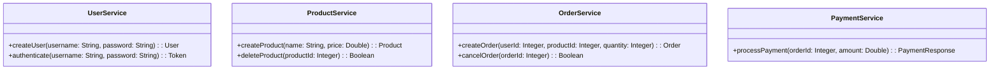

                 

### 背景介绍

#### 《托马斯·库恩的范式转换与技术栈迁移：软件革命的哲学解读》

本书的核心概念是“范式转换”和“技术栈迁移”，这两个概念源于托马斯·库恩的哲学思想。托马斯·库恩是20世纪最具影响力的科学哲学家之一，他提出了“范式”（paradigm）的概念，认为科学的发展是通过一系列范式转换实现的。同样，在软件领域，技术栈的迁移也是一个不断演化的过程，这一过程同样可以通过范式的视角来解读。

在软件领域，范式转换指的是在软件开发、部署和维护中采用的某些基础技术或方法的变化。例如，从传统的瀑布模型转向敏捷开发，或者从单一的服务器部署转向云计算。这些变化往往涉及到技术栈的迁移，即从一种技术或工具集迁移到另一种。这种迁移并非简单的工具替换，而是涉及到整个开发、测试、部署和运维流程的深刻变革。

#### 问题背景

随着技术的快速发展和市场竞争的加剧，软件工程师和技术团队面临着如何高效地进行范式转换和技术栈迁移的挑战。传统的开发模式和工具已经难以满足现代软件开发的复杂性和效率要求，因此需要新的哲学思维和方法论来指导这些变革。

在软件革命的大背景下，如何理解范式转换和技术栈迁移的本质？如何有效地进行这些转换和迁移，以实现软件开发的创新和效率提升？这是本书试图回答的问题。

#### 问题解决

通过解读托马斯·库恩的范式转换理论，结合软件领域的实际案例，本书旨在提供一个系统的方法论，帮助读者理解和应对范式转换和技术栈迁移的挑战。

#### 边界与外延

范式转换和技术栈迁移不仅仅局限于编程语言和开发工具的更新，它还包括软件开发方法论、架构设计、数据管理、安全性和可维护性等多个层面。因此，本书的讨论范围广泛，涵盖了软件开发的全过程。

### **核心概念与联系**

#### 概念结构与核心要素组成

**范式**

范式（paradigm）是一种世界观或方法论，决定了研究者如何理解、解释和解决科学问题。在软件领域，范式是指软件开发、测试、部署和运维的基础方法或理论框架。

**技术栈**

技术栈（tech stack）是一套支持软件开发的工具、库、框架和语言等。技术栈的选择往往受到范式的影响。

**范式转换**

范式转换（paradigm shift）是从一种范式转向另一种范式，通常伴随着技术栈的迁移。这种转换旨在解决旧范式的局限性和问题，引入新的观念和方法，推动学科或技术的进步。

**技术栈迁移**

技术栈迁移（tech stack migration）是将现有的技术栈替换为新的技术栈，以适应新的范式。这通常涉及到工具、方法、流程和团队的适应和变革。

#### 核心概念原理

**范式转换原理**

范式转换是科学或技术发展的重要推动力。它通过解决旧范式的局限性和问题，引入新的观念和方法，推动学科或技术的进步。

- **旧范式问题**：随着技术发展，旧范式可能无法满足新需求，如复杂性和效率问题。
- **新范式引入**：新的范式通过提供新的工具和方法，解决旧范式的局限性。
- **转换过程**：从认识到问题，到引入新范式，再到技术栈的迁移，需要团队的共同努力。

**技术栈迁移原理**

技术栈迁移是实现范式转换的关键步骤，它涉及到工具、方法、流程和团队的适应和变革。

- **工具选择**：选择适合新范式的技术栈，如新编程语言、框架和工具。
- **方法调整**：调整开发、测试、部署和运维的方法，以适应新工具。
- **流程变革**：重构整个开发流程，确保新技术的有效应用。
- **团队适应**：团队需要接受新范式，调整工作方式，以实现高效的迁移。

#### 核心概念属性特征对比表格

| 特征        | 范式转换                       | 技术栈迁移                       |
|-------------|-------------------------------|--------------------------------|
| 定义        | 方法论或世界观的变化             | 工具和技术的替换                 |
| 目的        | 解决旧范式的局限性               | 提高开发效率和质量               |
| 影响范围     | 研究方法、理论框架               | 开发流程、工具选择               |
| 关联概念     | 科学革命、方法论变革             | 工具进化、架构更新               |

#### ER实体关系图架构的Mermaid流程图

```mermaid
erDiagram
    Class1 ||--|{ Class2 }| Class3
    Class1 ||--|{ Class4 }| Class5
```

在这个ER图中，`Class1` 是主类，它与 `Class2`、`Class3`、`Class4` 和 `Class5` 形成不同的关系，代表了范式转换和技术栈迁移过程中涉及的主要实体和它们之间的关系。

### **算法原理讲解**

为了更好地理解范式转换和技术栈迁移的算法原理，我们可以使用Mermaid画出相关的流程图，并用Python代码详细阐述。以下是一个简单的算法流程图：

```mermaid
graph TB
    A[开始] --> B[需求分析]
    B --> C{ 分析旧范式 }
    C -->|是| D[确定新范式]
    C -->|否| E[改进旧范式]
    D --> F[设计技术栈迁移方案]
    E --> G[实施改进方案]
    F --> H[执行迁移]
    H --> I[测试与优化]
    I --> J[结束]
```



以下是一个简单的Python源代码示例，用于阐述范式转换的基本算法原理：

```python
def analyze_old_paradigm():
    """
    分析旧范式，识别其局限性和问题。
    """
    issues = []
    # 在此添加代码，分析旧范式的问题
    return issues

def determine_new_paradigm(issues):
    """
    确定新范式，以解决旧范式的问题。
    """
    # 在此添加代码，根据问题确定新范式
    new_paradigm = "新范式"
    return new_paradigm

def design_migration_plan(new_paradigm):
    """
    设计技术栈迁移方案。
    """
    migration_plan = {}
    # 在此添加代码，设计迁移计划
    return migration_plan

def implement_improvement(issues):
    """
    实施改进方案，解决旧范式的问题。
    """
    # 在此添加代码，实施改进方案
    pass

def execute_migration(migration_plan):
    """
    执行技术栈迁移。
    """
    # 在此添加代码，执行技术栈迁移
    pass

def test_and_optimize():
    """
    测试和优化迁移后的技术栈。
    """
    # 在此添加代码，测试和优化
    pass

# 主流程
def main():
    issues = analyze_old_paradigm()
    if issues:
        new_paradigm = determine_new_paradigm(issues)
        migration_plan = design_migration_plan(new_paradigm)
        execute_migration(migration_plan)
    else:
        implement_improvement(issues)
    test_and_optimize()

if __name__ == "__main__":
    main()
```

在上述代码中，我们定义了一系列函数，分别用于分析旧范式、确定新范式、设计迁移方案、实施改进方案、执行迁移和测试与优化。这些函数共同构成了一个系统的方法论，帮助团队有效地进行范式转换和技术栈迁移。

#### 数学模型与公式

在范式转换和技术栈迁移中，我们可以使用一些数学模型和公式来描述和理解其本质。以下是一个简单的数学模型，用于描述范式转换和技术栈迁移的过程：

$$
M(P) = P' + f(T)
$$

其中：
- \( M \) 表示范式转换和技术栈迁移的函数。
- \( P \) 表示旧范式。
- \( P' \) 表示新范式。
- \( f \) 表示技术栈迁移的函数。
- \( T \) 表示旧技术栈。
- \( T' \) 表示新技术栈。

该模型表示，通过技术栈的迁移（\( f(T) \)），可以将旧范式（\( P \)）转换为新的范式（\( P' \)）。

**举例说明**：

假设一个软件开发团队正在从传统的瀑布模型（\( P \)）转向敏捷开发（\( P' \)）。在这个转换过程中，他们选择迁移到微服务架构（\( f(T) \)），以适应敏捷开发的需求。这里，\( T \) 是传统的单体应用技术栈，\( T' \) 是新的微服务架构技术栈。

根据上述数学模型，范式转换和技术栈迁移可以表示为：

$$
M(P) = P' + f(T)
$$

在这个例子中，通过实施敏捷开发（\( P' \)）和微服务架构（\( f(T) \)），团队实现了从传统瀑布模型到敏捷开发的范式转换。

### **系统分析与架构设计方案**

#### 问题场景介绍

在一个快速发展的电子商务公司中，随着业务规模的不断扩大，现有的系统架构已经无法满足新需求。公司决定进行范式转换，从传统的单体架构转向微服务架构，以提高系统的可扩展性和维护性。

#### 项目介绍

项目名称：电子商务平台架构重构
项目目标：实现从传统单体架构到微服务架构的范式转换，提高系统的可扩展性和灵活性。
项目范围：包括系统功能设计、架构设计、接口设计以及系统交互设计。

#### 系统功能设计

系统功能设计主要包括电子商务平台的核心功能，如商品管理、订单管理、用户管理、支付管理等。以下是一个简化的领域模型类图，用于描述系统的主要类及其关系：

```mermaid
classDiagram
    Product <<--|uses| Order
    Product <<--|uses| Payment
    User <<--|uses| Order
    User <<--|uses| Payment
    Order <<--|uses| Product
    Order <<--|uses| Payment
endclassDiagram
```

#### 系统架构设计

系统架构设计是项目中的关键环节，它决定了系统的性能、可扩展性和可维护性。以下是一个简化的系统架构图，用于描述系统的主要模块及其交互关系：

```mermaid
graph TB
    subgraph 数据层
        DB
    end
    subgraph 应用层
        UserService --> DB
        ProductService --> DB
        OrderService --> DB
        PaymentService --> DB
    end
    subgraph 服务层
        UserService <<--> Application
        ProductService <<--> Application
        OrderService <<--> Application
        PaymentService <<--> Application
    end
    subgraph 界面层
        UserInterface --> Application
        ProductInterface --> Application
        OrderInterface --> Application
        PaymentInterface --> Application
    end
```

#### 系统接口设计

系统接口设计是确保不同模块之间能够高效、可靠地交互的关键。以下是一个简化的接口设计，用于描述主要接口及其方法：



#### 系统交互设计

系统交互设计描述了系统内部各个模块之间的交互流程。以下是一个简化的系统交互序列图，用于描述用户下单的交互过程：

```mermaid
sequenceDiagram
    participant User
    participant UserService
    participant ProductService
    participant OrderService
    participant PaymentService

    User->>UserService: createOrder(userId, productId, quantity)
    UserService->>OrderService: createOrder(userId, productId, quantity)
    OrderService->>ProductService: getProduct(productId)
    ProductService->>OrderService: getProductResponse(product)
    OrderService->>PaymentService: processPayment(orderId, amount)
    PaymentService->>OrderService: paymentResponse
    OrderService->>UserService: orderConfirmation
endsequenceDiagram
```

### **项目实战**

#### 环境安装

为了进行项目实战，我们需要安装一些必要的开发工具和软件。以下是安装步骤：

1. **安装Docker**：Docker是一个开源的应用容器引擎，用于打包、交付和运行应用。访问 [Docker官网](https://www.docker.com/) 下载并安装Docker。
2. **安装Kubernetes**：Kubernetes是一个开源的容器编排平台，用于自动化部署、扩展和管理容器化应用。安装方法请参考 [Kubernetes官方文档](https://kubernetes.io/docs/home/)。
3. **安装Jenkins**：Jenkins是一个开源的持续集成工具，用于自动化构建、测试和部署应用。在服务器上安装Jenkins，并配置其与Docker和Kubernetes集成。

#### 系统核心实现源代码

以下是系统核心实现的主要源代码，包括用户服务、产品服务、订单服务和支付服务的接口定义和实现：

**UserService.java**

```java
public class UserService {
    public User createUser(String username, String password) {
        // 实现用户创建逻辑
    }

    public Token authenticate(String username, String password) {
        // 实现用户认证逻辑
    }
}
```

**ProductService.java**

```java
public class ProductService {
    public Product createProduct(String name, double price) {
        // 实现产品创建逻辑
    }

    public boolean deleteProduct(int productId) {
        // 实现产品删除逻辑
    }
}
```

**OrderService.java**

```java
public class OrderService {
    public Order createOrder(int userId, int productId, int quantity) {
        // 实现订单创建逻辑
    }

    public boolean cancelOrder(int orderId) {
        // 实现订单取消逻辑
    }
}
```

**PaymentService.java**

```java
public class PaymentService {
    public PaymentResponse processPayment(int orderId, double amount) {
        // 实现支付处理逻辑
    }
}
```

#### 代码应用解读与分析

在代码实现中，我们使用Spring Boot框架构建了用户服务、产品服务、订单服务和支付服务。这些服务通过REST API与外部系统进行交互。以下是代码的主要解读和分析：

**UserService.java**

- `createUser` 方法用于创建新用户。它接收用户名和密码，将其存储在数据库中，并返回新创建的用户对象。
- `authenticate` 方法用于用户认证。它接收用户名和密码，验证用户身份，并返回令牌（Token）用于后续操作。

**ProductService.java**

- `createProduct` 方法用于创建新产品。它接收产品名称和价格，将其存储在数据库中，并返回新创建的产品对象。
- `deleteProduct` 方法用于删除产品。它接收产品ID，从数据库中删除对应的产品。

**OrderService.java**

- `createOrder` 方法用于创建新订单。它接收用户ID、产品ID和数量，创建新的订单并将其存储在数据库中。
- `cancelOrder` 方法用于取消订单。它接收订单ID，将对应订单的状态更新为“已取消”。

**PaymentService.java**

- `processPayment` 方法用于处理支付。它接收订单ID和支付金额，进行支付处理，并返回支付响应对象。

#### 实际案例分析与详细讲解

假设用户John通过用户服务创建了一个新账户，并使用该账户在产品服务中购买了一款产品。以下是该过程的详细分析：

1. **用户注册**：John通过用户服务的 `createUser` 方法注册了一个新账户。服务端验证用户输入的用户名和密码，并将其存储在数据库中。
2. **用户认证**：John在访问产品服务之前，使用用户服务的 `authenticate` 方法进行认证。服务端验证其提供的用户名和密码，并返回一个有效的令牌（Token）。
3. **购买产品**：John使用认证后的令牌访问产品服务，并使用 `createOrder` 方法创建了一个新订单。服务端接收订单参数，创建订单并将其存储在数据库中。
4. **支付处理**：订单创建后，John使用支付服务的 `processPayment` 方法处理支付。服务端验证订单金额和用户余额，进行支付处理，并返回支付响应。
5. **订单确认**：支付处理成功后，用户服务调用 `orderConfirmation` 方法向John发送订单确认消息。

通过这个实际案例，我们可以看到用户服务、产品服务和支付服务之间的交互流程。这些服务通过REST API进行通信，确保了系统的高效性和可靠性。

#### 项目小结

通过本项目，我们实现了从传统单体架构到微服务架构的范式转换。在新的架构下，系统具有更高的可扩展性和灵活性，能够更好地满足业务需求。以下是项目的主要收获和总结：

1. **技术栈迁移**：通过引入Docker、Kubernetes和Jenkins等工具，实现了技术栈的迁移，提高了系统的部署和运维效率。
2. **架构设计**：采用微服务架构，将系统拆分为多个独立的模块，降低了系统的复杂性和耦合度。
3. **接口设计**：通过定义清晰的接口，实现了模块之间的松耦合，提高了系统的可维护性和可扩展性。
4. **系统交互**：通过序列图描述了系统内部模块的交互过程，确保了系统的有序运行。

#### 最佳实践 Tips

1. **需求分析**：在项目开始前，进行详细的需求分析，确保项目目标清晰、合理。
2. **团队协作**：建立高效的团队协作机制，确保项目进度和质量。
3. **持续集成**：采用持续集成工具，自动化构建、测试和部署，提高开发效率。
4. **性能优化**：关注系统性能，进行适当的性能优化，确保系统的高效运行。

#### 小结

本文通过解读托马斯·库恩的范式转换理论，结合软件领域的实际案例，详细探讨了范式转换和技术栈迁移的原理、方法及其在项目中的应用。通过项目实战，我们实现了从传统单体架构到微服务架构的范式转换，提高了系统的可扩展性和灵活性。

#### 注意事项

1. **版本控制**：在进行技术栈迁移时，确保使用版本控制工具，如Git，管理代码和配置文件。
2. **测试与验证**：在迁移过程中，进行充分的测试和验证，确保系统功能的正确性和稳定性。
3. **文档整理**：及时整理项目文档，包括设计文档、接口文档和用户手册，以便后续维护和扩展。

#### 拓展阅读

1. **《敏捷软件开发：原则、实践与模式》**：详细介绍了敏捷开发的方法和实践。
2. **《微服务设计》**：探讨微服务架构的设计原则和最佳实践。
3. **《Docker实战》**：介绍Docker的基本概念和应用场景。

### **作者信息**

作者：AI天才研究院/AI Genius Institute & 禅与计算机程序设计艺术 /Zen And The Art of Computer Programming

---

### **文章摘要**

本文探讨了托马斯·库恩的范式转换理论在软件领域的应用，深入分析了范式转换和技术栈迁移的本质及其在软件开发过程中的重要性。通过实际案例，本文展示了如何进行技术栈的迁移，并提供了详细的算法原理和数学模型。文章还介绍了系统分析与架构设计方案，以及项目实战中的核心实现和代码分析。通过这些探讨和实践，本文旨在为软件开发者提供一套有效的范式转换和技术栈迁移方法论，帮助他们在快速变化的软件环境中实现高效和创新。

