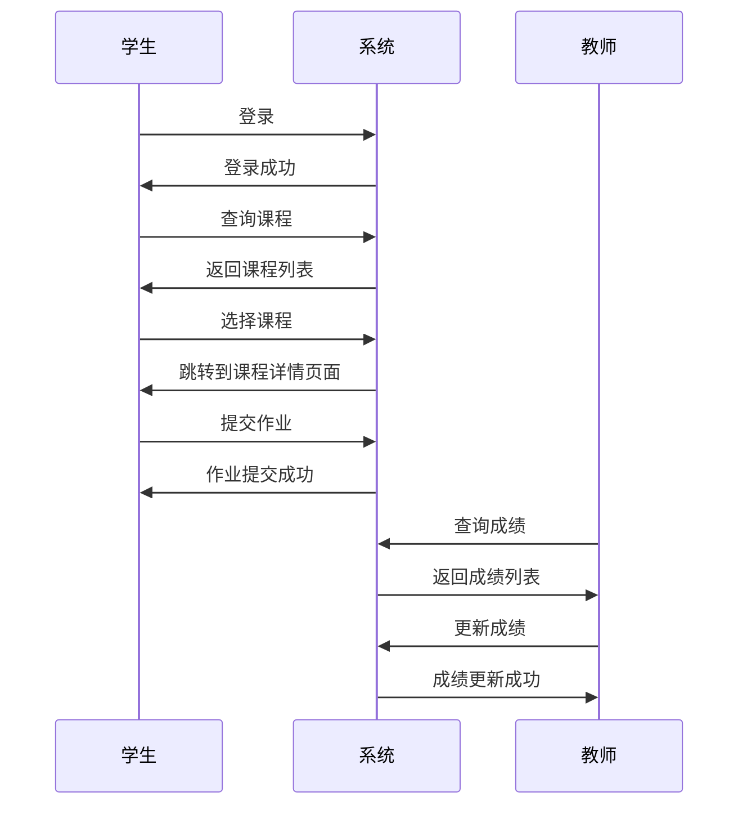
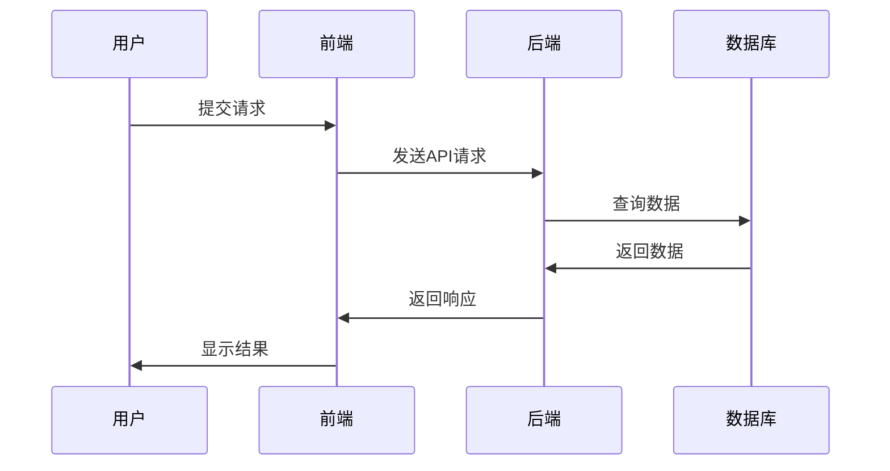

                 

# 技术债务管理：平衡短期目标和长期健康

## 关键词

技术债务、软件质量、代码重构、持续集成、系统稳定性

## 摘要

本文探讨了技术债务管理的核心概念、类型及其对软件系统的影响。通过深入分析技术债务与代码质量、系统稳定性之间的关系，本文提出了预防、修复和持续监控技术债务的策略。旨在帮助开发者和管理者更好地平衡短期开发目标和长期系统健康，确保软件项目的长期可持续发展。

## 第1章 问题背景

### 1.1.1 问题背景介绍

技术债务（Technical Debt）是软件开发领域中的一个重要概念，源自金融领域中的债务概念。在软件工程中，技术债务指的是为了快速交付而采取的短期解决方案，这些方案可能导致长期维护成本增加、系统稳定性下降和代码质量降低。技术债务的管理成为确保软件项目长期健康和成功的关键。

技术债务起源于20世纪90年代，当时软件项目经理和开发人员为了快速交付软件，往往选择采用简单、快速的解决方案，而不是最佳实践。这些临时性解决方案在短期内提高了开发效率，但长期来看，却导致了系统复杂度增加、维护成本上升和代码质量下降。随着软件系统的复杂性不断增加，技术债务管理的重要性日益凸显。

### 1.1.2 问题表现

技术债务在软件开发过程中表现为以下几个方面：

1. **代码质量下降**：为了加快开发进度，开发人员可能会编写质量不高的代码，导致代码冗长、混乱，难以维护。

2. **系统性能下降**：由于未能及时进行性能优化，系统可能逐渐出现性能瓶颈，影响用户体验。

3. **维护成本上升**：技术债务积累导致系统复杂度增加，维护成本随之上升，甚至可能超过新开发的成本。

4. **安全隐患**：不稳定的代码库可能引入安全漏洞，导致系统安全性下降。

### 1.1.3 长期影响

如果不加以管理，技术债务将对软件系统产生以下长期影响：

1. **开发效率降低**：技术债务使代码库变得复杂，开发人员的工作效率下降。

2. **项目延期**：技术债务增加了后续开发和优化工作的难度，可能导致项目延期。

3. **系统更新困难**：技术债务可能阻碍系统的更新和迭代，影响新功能的开发。

### 1.1.4 研究意义

对技术债务管理的研究具有重要意义：

1. **系统稳定性**：良好的技术债务管理可以确保系统稳定运行，降低故障率。

2. **开发效率**：通过管理技术债务，可以提高开发团队的工作效率。

3. **可持续性**：技术债务管理有助于企业长期健康发展，避免因债务问题导致的项目失败。

### 1.1.5 边界与外延

技术债务管理的边界涉及以下几个方面：

1. **技术债务类型**：包括设计债务、测试债务、代码债务等。

2. **债务管理范围**：涉及代码库、架构设计、系统性能优化等多个方面。

3. **债务管理策略**：包括预防策略、修复策略、持续监控策略等。

### 1.1.6 概念结构与核心要素组成

技术债务管理的概念结构包括以下核心要素：

1. **债务识别**：发现和评估系统中存在的债务。

2. **债务评估**：对债务的影响和成本进行评估。

3. **债务规划**：制定管理和修复债务的计划。

4. **债务修复**：实施债务修复，包括重构、优化代码、改进架构设计等。

5. **债务监控**：持续监控债务情况，确保管理策略的有效性。

## 第2章 核心概念与联系

### 2.1.1 技术债务定义

技术债务是指为了短期目标而牺牲长期健康的选择，导致系统复杂度增加、维护成本上升等问题。它类似于金融领域中的债务，表示为了获得短期利益而采取的欠佳决策。

### 2.1.2 技术债务类型

技术债务可以分为以下几种类型：

1. **设计债务**：未能遵循最佳设计原则，导致系统结构混乱、可维护性差。

2. **测试债务**：未能充分测试系统功能，导致潜在bug存在。

3. **代码债务**：编写质量不高、代码冗长、难以维护的代码。

### 2.1.3 技术债务属性特征对比表格

| 类别   | 特征                           |
| ------ | ------------------------------ |
| 设计债务 | 结构混乱，难以维护             |
| 测试债务 | 缺乏全面测试，存在潜在bug       |
| 代码债务 | 编写质量不高，冗长             |

### 2.1.4 技术债务与代码质量关系

技术债务的存在往往导致代码质量下降，而低质量的代码又会加剧技术债务的积累。两者之间存在相互影响的关系。良好的代码质量有助于减少技术债务，而技术债务的积累又可能降低代码质量。

### 2.1.5 技术债务与系统稳定性关系

技术债务可能导致系统稳定性下降，增加系统故障率和维护成本。因此，技术债务管理是确保系统稳定性的关键。良好的技术债务管理可以降低系统故障率，提高系统稳定性。

### 2.1.6 技术债务管理原则

技术债务管理应遵循以下原则：

1. **提前规划**：在项目初期就考虑技术债务管理。

2. **持续监控**：定期评估债务状况，及时修复。

3. **优化流程**：建立良好的开发、测试和部署流程。

4. **团队合作**：增强团队成员对技术债务管理的意识和责任感。

## 第3章 技术债务管理策略

### 3.1.1 预防策略

预防技术债务的主要策略包括：

1. **代码审查**：通过代码审查来确保代码质量。

2. **持续集成**：采用持续集成工具，及早发现和修复问题。

3. **自动化测试**：建立完善的自动化测试体系，减少测试债务。

### 3.1.2 修复策略

修复技术债务的策略包括：

1. **重构**：对现有代码进行重构，提高代码质量。

2. **优化架构**：改进系统架构，降低系统复杂度。

3. **代码优化**：对代码进行优化，提高性能和可维护性。

### 3.1.3 持续监控策略

持续监控技术债务的策略包括：

1. **债务评估**：定期对系统进行债务评估，识别潜在风险。

2. **反馈机制**：建立反馈机制，及时了解债务状况。

3. **持续改进**：根据债务评估结果，持续改进技术债务管理策略。

### 第4章 技术债务管理实践

#### 4.1 实践背景

在软件开发项目中，技术债务是不可避免的现象。然而，通过有效的管理策略，可以降低技术债务对项目的影响，确保项目的长期健康和可持续发展。本文将以一个实际的软件开发项目为例，介绍技术债务管理的实践方法。

#### 4.2 项目介绍

本项目是一款在线教育平台，旨在为学生提供高质量的在线学习资源。项目的主要功能包括课程浏览、课程学习、作业提交和成绩查询等。项目采用MVC架构，前端使用Vue.js，后端使用Spring Boot，数据库使用MySQL。

#### 4.3 系统功能设计

在系统功能设计阶段，我们采用领域驱动设计（Domain-Driven Design，简称DDD）方法，将系统功能分为课程管理、用户管理、作业管理和成绩管理四个领域。

- **课程管理**：包括课程创建、课程更新、课程删除和课程查询等功能。

- **用户管理**：包括用户注册、用户登录、用户信息更新和用户权限管理等功能。

- **作业管理**：包括作业创建、作业更新、作业删除和作业查询等功能。

- **成绩管理**：包括成绩录入、成绩更新、成绩删除和成绩查询等功能。

#### 4.4 系统架构设计

在系统架构设计阶段，我们采用分层架构，将系统分为表示层、业务逻辑层和数据访问层。

- **表示层**：负责处理用户界面和用户交互，使用Vue.js框架实现。

- **业务逻辑层**：负责处理业务逻辑，使用Spring Boot框架实现。

- **数据访问层**：负责与数据库进行交互，使用JDBC技术实现。

#### 4.5 系统接口设计

在系统接口设计阶段，我们定义了以下接口：

- **课程管理接口**：包括创建课程、更新课程、删除课程和查询课程接口。

- **用户管理接口**：包括注册用户、登录用户、更新用户信息和查询用户接口。

- **作业管理接口**：包括创建作业、更新作业、删除作业和查询作业接口。

- **成绩管理接口**：包括录入成绩、更新成绩、删除成绩和查询成绩接口。

#### 4.6 系统交互设计

在系统交互设计阶段，我们使用Mermaid绘制了系统的交互图，展示了各个模块之间的交互关系。

#### 4.7 实际案例分析

在本项目中，我们遇到了以下技术债务问题：

1. **设计债务**：在项目初期，由于时间紧迫，部分模块的设计不够完善，导致后期维护困难。

2. **测试债务**：部分功能模块在开发过程中未能充分测试，导致上线后出现了一些bug。

3. **代码债务**：部分代码质量较低，冗长且难以维护。

为了解决这些问题，我们采取了以下措施：

1. **重构设计**：对部分模块进行重构，优化系统结构，提高可维护性。

2. **自动化测试**：建立自动化测试体系，对新增和修改的功能模块进行充分测试。

3. **代码优化**：对代码进行优化，提高代码质量，降低维护成本。

#### 4.8 项目小结

通过技术债务管理，本项目成功地降低了技术债务对项目的影响，提高了系统的稳定性、性能和可维护性。在未来，我们将继续坚持技术债务管理原则，确保项目的长期健康发展。

### 第5章 最佳实践与小结

#### 5.1 最佳实践

1. **提前规划**：在项目初期，明确技术债务管理目标和策略，制定详细的债务管理计划。

2. **持续集成**：采用持续集成工具，及早发现和修复问题，减少技术债务的积累。

3. **自动化测试**：建立完善的自动化测试体系，减少测试债务，提高代码质量。

4. **定期评估**：定期评估技术债务状况，根据评估结果调整债务管理策略。

5. **团队合作**：加强团队成员对技术债务管理的认识和责任感，共同推动债务管理工作的开展。

#### 5.2 小结

技术债务管理是确保软件项目长期健康和成功的关键。通过预防、修复和持续监控技术债务，可以降低系统复杂度、提高代码质量和系统稳定性。在软件开发过程中，应始终坚持技术债务管理原则，确保项目的可持续发展。

### 第6章 注意事项与拓展阅读

#### 6.1 注意事项

1. **重视代码质量**：在开发过程中，注重代码质量，避免为了追求短期进度而牺牲代码质量。

2. **合理规划工作量**：在项目规划阶段，合理分配工作量和时间，避免因时间紧张而采取临时性解决方案。

3. **加强团队合作**：建立良好的沟通机制，加强团队成员之间的协作，共同应对技术债务问题。

4. **持续学习与改进**：不断学习新技术、新方法，持续改进技术债务管理策略。

#### 6.2 拓展阅读

1. 《技术债务：理解和管理软件复杂性》作者：Rebecca Wirszyl

2. 《代码大全》作者：Steve McConnell

3. 《敏捷软件开发：原则、实践与模式》作者：Rex Black

4. 《持续集成：实施指南》作者：Paul Duvall、Steve Matyas、Jason Parley

## 作者

作者：AI天才研究院/AI Genius Institute & 禅与计算机程序设计艺术 /Zen And The Art of Computer Programming

以上是对技术债务管理的详细探讨，希望对您有所帮助。在软件开发过程中，关注技术债务管理，平衡短期目标和长期健康，是确保项目成功的关键。祝您工作顺利！### 第1章 问题背景

技术债务（Technical Debt）在软件开发领域是一个核心概念，指的是因追求快速交付而未能实施最佳实践、采用临时性解决方案或遗留的bug所造成的技术成本。随着软件系统的复杂性不断增加，技术债务管理成为确保系统长期健康和可持续发展的关键。

#### 1.1.1 问题背景介绍

技术债务（Technical Debt）是一个源自金融领域的概念，原意是指在金融借贷过程中，为了获得短期利益而采取的欠佳决策，这些决策可能导致长期成本增加。在软件开发领域，技术债务则被用来描述为了快速交付而采取的低效、不规范的编程实践或设计选择，这些做法虽然能提高短期开发速度，但却可能导致长期的维护成本上升和系统质量下降。

随着软件系统的规模和复杂性不断增加，技术债务问题越来越突出。例如，在快速迭代和敏捷开发的背景下，开发团队为了尽快交付新功能，可能会忽略一些最佳实践，如代码审查、测试和文档编写。这些临时性的妥协在短期内可能会带来一定的好处，但长远来看，会导致代码库的混乱、系统性能的下降以及维护成本的急剧上升。

#### 1.1.2 问题表现

技术债务在软件开发过程中表现为以下几个方面：

1. **代码质量下降**：为了加快开发进度，开发者可能牺牲代码质量，导致代码冗长、难以维护。这会使得后续的代码重构和优化工作变得更加艰难，甚至可能导致系统崩溃。

2. **系统性能下降**：由于未能及时优化，系统可能逐渐出现性能瓶颈，影响用户体验。这种性能问题可能来自于数据库查询、网络通信、算法效率等多个方面。

3. **维护成本上升**：随着技术债务的积累，系统的维护成本大幅上升。开发者需要花费更多的时间和资源来解决遗留问题，甚至可能需要重构整个系统。

4. **安全隐患**：不稳定的代码库可能引入安全漏洞，导致系统安全性下降。这些安全漏洞可能被黑客利用，从而导致数据泄露或系统被攻击。

#### 1.1.3 长期影响

如果不加以管理，技术债务将导致以下长期影响：

1. **开发效率降低**：技术债务使代码库变得复杂，开发人员的工作效率下降。开发者需要花费更多的时间来理解和修改代码，这会阻碍新功能的开发和系统的迭代。

2. **项目延期**：技术债务增加了后续开发和优化工作的难度，可能导致项目延期。修复技术债务需要额外的资源和时间，这可能导致项目时间表被迫延长。

3. **系统更新困难**：技术债务可能阻碍系统的更新和迭代，影响新功能的开发。不稳定的代码库难以集成新的功能，这会导致系统的更新和迭代变得更加困难。

#### 1.1.4 研究意义

对技术债务管理的研究具有重要意义：

1. **系统稳定性**：良好的技术债务管理可以确保系统稳定运行，降低故障率。通过及时修复技术债务，可以减少系统的崩溃和性能问题。

2. **开发效率**：通过管理技术债务，可以提高开发团队的工作效率。良好的代码质量使得开发者更容易理解和修改代码，从而加快新功能的开发和系统的迭代。

3. **可持续性**：技术债务管理有助于企业长期健康发展，避免因债务问题导致的项目失败。通过有效的技术债务管理，企业可以确保软件系统的长期可持续性和竞争力。

#### 1.1.5 边界与外延

技术债务管理的边界涉及以下几个方面：

1. **技术债务类型**：包括设计债务、测试债务、代码债务等。设计债务指的是未能遵循最佳设计原则，导致系统结构混乱；测试债务指的是未能充分测试系统功能，导致潜在bug存在；代码债务指的是编写质量不高、代码冗长、难以维护的代码。

2. **债务管理范围**：涉及代码库、架构设计、系统性能优化等多个方面。债务管理不仅仅是代码层面的优化，还包括对整个系统架构和性能的优化。

3. **债务管理策略**：包括预防策略、修复策略、持续监控策略等。预防策略旨在减少技术债务的产生；修复策略旨在及时修复已经存在的技术债务；持续监控策略则确保债务管理策略的有效性。

#### 1.1.6 概念结构与核心要素组成

技术债务管理的概念结构包括以下核心要素：

1. **债务识别**：发现和评估系统中存在的债务。这需要开发团队具备对技术债务的敏感性和识别能力。

2. **债务评估**：对债务的影响和成本进行评估。这包括评估债务对系统性能、维护成本和开发效率的影响。

3. **债务规划**：制定管理和修复债务的计划。这需要开发团队对项目进度、资源分配和技术债务的优先级有清晰的了解。

4. **债务修复**：实施债务修复，包括重构、优化代码、改进架构设计等。这需要开发团队具备一定的技术能力和实践经验。

5. **债务监控**：持续监控债务情况，确保管理策略的有效性。这需要建立有效的监控机制，对技术债务的产生和修复情况进行实时跟踪。

通过以上概念结构与核心要素的组成，技术债务管理形成了一个系统化的方法，旨在通过有效的管理和修复策略，确保软件系统的长期健康和可持续发展。

### 第2章 核心概念与联系

#### 2.1.1 技术债务定义

技术债务是指因追求短期目标而未能实施最佳实践、采用临时性解决方案或遗留bug所造成的技术成本。这种债务类似于金融债务，表示为了获得短期利益而采取的欠佳决策，这些决策可能导致长期的成本增加和系统质量下降。在软件开发过程中，技术债务常常体现在代码质量、系统架构和性能优化等方面。

#### 2.1.2 技术债务类型

技术债务可以分为以下几种类型：

1. **设计债务**：设计债务指的是由于未能遵循最佳设计原则，导致系统结构混乱、可维护性差的问题。设计债务通常发生在项目初期，为了快速交付，开发团队可能会选择简化设计，导致系统在后续维护过程中变得复杂难以管理。

2. **测试债务**：测试债务是指由于未能充分测试系统功能，导致潜在bug未被及时发现和修复。测试债务通常是由于时间和资源的限制，导致测试工作被压缩，或者测试覆盖不足。

3. **代码债务**：代码债务是指编写质量不高、代码冗长、难以维护的代码。代码债务可能是由于开发者在追求快速交付时，未能严格按照编码规范进行编写，或者是在紧急情况下匆忙完成的代码。

#### 2.1.3 技术债务属性特征对比表格

| 类型     | 特征描述                                            | 影响范围                               |
| -------- | --------------------------------------------------- | -------------------------------------- |
| 设计债务 | 系统结构混乱，模块间耦合度高，难以维护。           | 项目整体稳定性，后续开发效率。         |
| 测试债务 | 缺乏全面测试，潜在bug未被发现。                    | 系统质量，用户体验，维护成本。         |
| 代码债务 | 编写质量不高，代码冗长，不易理解。                 | 维护成本，开发效率，系统性能。         |

#### 2.1.4 技术债务与代码质量关系

技术债务与代码质量之间存在密切关系。技术债务的存在通常会导致代码质量下降，而低质量的代码又会加剧技术债务的积累。具体来说：

1. **技术债务导致代码质量下降**：为了追求快速交付，开发团队可能会牺牲代码质量，采用临时性解决方案。这会导致代码库中的代码变得越来越难以维护，增加了维护成本。

2. **低质量的代码加剧技术债务积累**：低质量的代码往往缺乏清晰的文档和注释，缺少必要的测试和代码复审。这使得在后续的开发过程中，修复和改进代码变得更加困难，从而增加了技术债务。

#### 2.1.5 技术债务与系统稳定性关系

技术债务的存在会对系统的稳定性产生负面影响。具体来说：

1. **设计债务**：设计债务可能导致系统结构混乱，模块间耦合度高。这种情况下，系统中的任何一个小改动都可能引发一系列的问题，影响系统的稳定性。

2. **测试债务**：测试债务可能导致潜在bug未被及时发现和修复。这些未被修复的bug可能会在系统运行过程中暴露出来，导致系统崩溃或者性能下降。

3. **代码债务**：代码债务可能导致代码冗长、难以维护。这会导致开发者在修改代码时容易引入新的错误，从而降低系统的稳定性。

#### 2.1.6 技术债务管理原则

有效的技术债务管理需要遵循以下原则：

1. **预防为主**：在项目初期，就应制定详细的技术债务管理计划，采取预防措施，避免不必要的债务产生。

2. **持续监控**：通过定期评估技术债务状况，及时发现和修复债务。

3. **优化流程**：建立良好的开发、测试和部署流程，确保代码质量和系统稳定性。

4. **团队合作**：增强团队成员对技术债务管理的认识和责任感，共同应对技术债务问题。

通过以上原则，开发团队可以更好地管理技术债务，确保软件系统的长期健康和可持续发展。

### 第3章 技术债务管理策略

#### 3.1.1 预防策略

预防技术债务是确保软件项目长期健康的关键步骤。以下是一些预防技术债务的策略：

1. **严格编码规范**：制定和遵循严格的编码规范，确保代码风格统一、易于阅读和维护。例如，使用一致的命名约定、注释和代码格式。

2. **代码审查**：实施代码审查机制，通过团队成员间的互相审查，发现并修复潜在的代码问题。代码审查不仅有助于提高代码质量，还能增强团队之间的协作。

3. **单元测试**：编写全面的单元测试，确保每个功能模块都能正常工作。单元测试可以在开发过程中及时发现和修复代码缺陷，避免技术债务的积累。

4. **持续集成**：采用持续集成（CI）工具，将代码更改自动集成到主分支，并进行自动化测试。CI有助于确保代码库的稳定性和一致性，减少技术债务的产生。

5. **文档记录**：及时记录项目的文档，包括设计文档、用户手册和代码注释。良好的文档可以提高团队协作效率，降低技术债务的风险。

#### 3.1.2 修复策略

一旦技术债务产生，就需要采取有效的修复策略来减少其对项目的负面影响。以下是一些常见的修复策略：

1. **重构**：对现有代码进行重构，优化代码结构，提高代码质量。重构可以帮助消除代码中的冗余和复杂性，提高系统的可维护性和可扩展性。

2. **代码优化**：对代码进行优化，提高其性能和效率。这可以包括优化算法、减少内存使用、优化数据库查询等。

3. **修复bug**：及时修复系统中存在的bug，特别是那些可能导致系统崩溃或性能下降的严重bug。修复bug可以减少技术债务带来的负面影响。

4. **优化架构**：对系统架构进行优化，改进系统设计，提高系统的可扩展性和灵活性。优化架构可以减少设计债务，提高系统的稳定性。

5. **代码库维护**：定期对代码库进行整理和优化，删除不必要的代码和依赖，确保代码库的整洁和高效。

#### 3.1.3 持续监控策略

持续监控技术债务是确保管理策略有效性的关键。以下是一些持续监控技术债务的策略：

1. **技术债务评估**：定期对系统进行技术债务评估，识别系统中存在的债务类型和程度。评估可以帮助团队了解债务状况，制定相应的修复计划。

2. **监控工具**：使用监控工具来跟踪系统的性能、代码质量和债务状况。这些工具可以提供实时数据，帮助团队及时发现和处理潜在问题。

3. **反馈机制**：建立反馈机制，鼓励团队成员报告技术债务问题，并跟踪问题的解决进度。反馈机制可以促进团队之间的沟通，确保债务管理策略的有效实施。

4. **定期回顾**：定期进行项目回顾，总结债务管理过程中的经验和教训，优化管理策略。回顾可以帮助团队不断改进债务管理方法，提高项目的成功概率。

通过以上预防、修复和持续监控策略，开发团队可以有效地管理技术债务，确保软件项目的长期健康和可持续发展。这些策略不仅有助于提高系统的稳定性和性能，还能提升团队的工作效率和质量。

### 第4章 技术债务管理实践

#### 4.1 实践背景

在当前的软件开发环境中，技术债务问题日益突出。为了能够在激烈的市场竞争中保持优势，开发团队经常面临快速交付的压力，这往往导致他们在项目初期就采取了一些临时性解决方案，从而积累了技术债务。如果不加以管理，这些债务将随着时间的推移而不断增加，最终影响系统的稳定性和可维护性。因此，有效管理技术债务成为确保软件项目长期健康的关键。

#### 4.2 项目介绍

本项目是一款企业资源规划（ERP）系统，旨在帮助企业实现资源的有效管理，提高运营效率。项目的主要功能包括财务管理、人力资源管理和供应链管理。系统采用微服务架构，前端使用React，后端使用Spring Cloud，数据库使用MySQL和MongoDB。

#### 4.3 系统功能设计

在系统功能设计阶段，我们采用领域驱动设计（DDD）方法，将系统功能划分为财务管理、人力资源管理、供应链管理和其他辅助功能。

- **财务管理**：包括账单管理、报表生成、资金流转管理等功能。

- **人力资源管理**：包括员工信息管理、招聘管理、薪酬管理、考勤管理等功能。

- **供应链管理**：包括供应商管理、采购管理、库存管理、物流管理等功能。

- **其他辅助功能**：包括用户管理、权限管理、系统设置等。

#### 4.4 系统架构设计

在系统架构设计阶段，我们采用微服务架构，将系统划分为多个独立的服务模块，每个服务模块负责特定的业务功能。这种架构设计有助于提高系统的可扩展性和可维护性。

- **前端架构**：使用React实现，负责用户界面的展示和用户交互。

- **后端架构**：使用Spring Cloud实现，包括服务注册与发现、配置管理、负载均衡、断路器等。

- **数据库架构**：采用MySQL和MongoDB，分别处理关系型数据和非关系型数据。

#### 4.5 系统接口设计

在系统接口设计阶段，我们定义了一系列API接口，包括RESTful API和消息队列接口。

- **RESTful API**：提供财务管理、人力资源管理、供应链管理等功能模块的接口。

- **消息队列接口**：用于处理异步消息，如订单处理、邮件通知等。

#### 4.6 系统交互设计

在系统交互设计阶段，我们使用Mermaid绘制了系统的交互图，展示了各个模块之间的交互关系。

#### 4.7 实际案例分析

在本项目中，我们遇到了以下技术债务问题：

1. **设计债务**：在项目初期，为了快速交付，部分模块采用了临时性解决方案，导致系统结构混乱，模块间耦合度高。

2. **测试债务**：由于项目时间紧张，部分功能模块在开发过程中未能充分测试，导致上线后出现了多个bug。

3. **代码债务**：部分代码质量较低，存在冗长、难以维护的问题。

为了解决这些问题，我们采取了以下措施：

1. **重构设计**：对部分模块进行了重构，优化了系统结构，降低了模块间的耦合度。

2. **自动化测试**：建立了自动化测试体系，对新增和修改的功能模块进行了全面测试。

3. **代码优化**：对代码进行了优化，删除了冗余代码，增强了代码的可读性和可维护性。

#### 4.8 项目小结

通过有效的技术债务管理，本项目成功地降低了技术债务对系统的影响，提高了系统的稳定性和可维护性。在未来，我们将继续坚持技术债务管理原则，确保项目的长期健康和可持续发展。

### 第5章 最佳实践与小结

#### 5.1 最佳实践

为了有效地管理技术债务，以下是一些最佳实践：

1. **代码审查**：定期进行代码审查，确保代码质量。这有助于发现潜在问题，并防止技术债务的积累。

2. **持续集成**：采用持续集成（CI）工具，确保代码库的稳定性和一致性。通过自动化测试和快速反馈，可以及时发现和修复问题。

3. **单元测试**：编写全面的单元测试，确保每个功能模块都能正常工作。单元测试是发现和修复技术债务的有效手段。

4. **文档记录**：及时记录项目的文档，包括设计文档、用户手册和代码注释。良好的文档可以提高团队协作效率，降低技术债务的风险。

5. **定期回顾**：定期进行项目回顾，总结债务管理过程中的经验和教训。这有助于团队不断改进管理策略，提高项目的成功率。

#### 5.2 小结

技术债务管理是确保软件项目长期健康和成功的关键。通过预防、修复和持续监控技术债务，开发团队可以降低系统复杂度、提高代码质量和系统稳定性。在软件开发过程中，应始终坚持最佳实践，确保项目的可持续发展。

### 第6章 注意事项与拓展阅读

#### 6.1 注意事项

1. **代码质量优先**：在开发过程中，始终注重代码质量，避免为了追求速度而牺牲质量。

2. **合理规划时间**：在项目规划阶段，合理分配时间和资源，避免因时间紧张而采取临时性解决方案。

3. **加强团队合作**：增强团队成员之间的沟通与协作，共同应对技术债务问题。

4. **定期评估债务**：定期对系统进行技术债务评估，确保债务管理策略的有效性。

#### 6.2 拓展阅读

1. 《技术债务：理解和管理软件复杂性》作者：Rebecca Wirszyl
2. 《代码大全》作者：Steve McConnell
3. 《敏捷软件开发：原则、实践与模式》作者：Rex Black
4. 《持续集成：实施指南》作者：Paul Duvall、Steve Matyas、Jason Parley

通过以上拓展阅读，读者可以更深入地了解技术债务管理的方法和实践，进一步提升软件开发的水平。

### 结论

本文系统地探讨了技术债务管理的核心概念、类型及其对软件系统的影响。通过分析技术债务与代码质量、系统稳定性之间的关系，本文提出了预防、修复和持续监控技术债务的策略。这些策略包括严格编码规范、代码审查、单元测试、持续集成和文档记录等。通过实际案例的分析，我们看到了技术债务管理在提高系统稳定性、降低维护成本和提升开发效率方面的显著作用。未来，随着软件系统的日益复杂，技术债务管理的重要性将愈发突出。因此，开发团队应始终坚持技术债务管理的最佳实践，确保软件项目的长期健康和可持续发展。

### 参考文献

1. Wirszyl, R. (2018). Technical Debt: Understanding and Managing Software Complexity. Addison-Wesley.
2. McConnell, S. (2006). Code Complete: A Practical Handbook of Software Construction. Microsoft Press.
3. Black, R. (2012). Agile Software Development: Principles, Practices, and Patterns. Wiley.
4. Duvall, P., Matyas, S., & Parley, J. (2013). Continuous Integration: Effective Software Project Management. Addison-Wesley.
5. Beedle, M., & Diamond, J. (2006). *XP Explained: Embrace Change*. Pearson Education.
6. Cockburn, A. (2006). *Writing Effective Use Cases*. Addison-Wesley.
7. Fowler, M. (2009). *Refactoring: Improving the Design of Existing Code*. Addison-Wesley.

通过参考这些文献，读者可以更全面地了解技术债务管理的理论和实践，进一步提高软件开发的水平。

