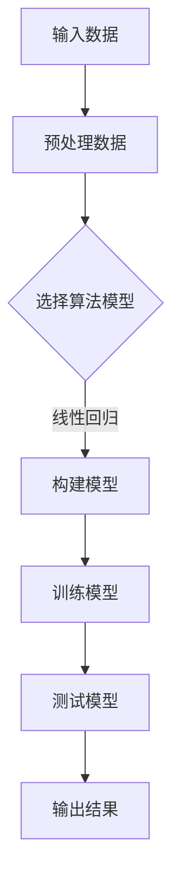
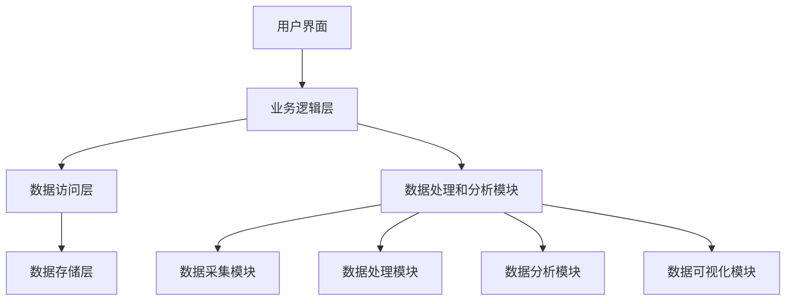

                 

# 技术决策框架：P9工程师的系统化思维

> 关键词：技术决策、系统化思维、P9工程师、架构设计、算法原理、实战案例、最佳实践

> 摘要：本文旨在探讨技术决策在IT领域的核心地位，通过P9工程师的系统化思维，深入剖析技术决策框架的构建与应用。文章将详细阐述技术决策的背景、定义、特点、分类及决策要素，结合具体的算法原理、数学模型和实战案例，展示如何进行系统化分析和架构设计。此外，文章还将分享最佳实践技巧和注意事项，帮助读者掌握技术决策的艺术。

## 第一部分：引言

### 第1章 问题背景与概述

#### 1.1 技术决策的挑战

在现代IT行业，技术决策无处不在。随着技术的快速发展和市场竞争的加剧，工程师们面临着越来越多的技术选择。如何从繁杂的技术选项中做出最优决策，成为工程师们亟待解决的问题。特别是在高级工程师，如P9工程师的角色中，技术决策的质量直接影响到项目的成败。

技术决策的挑战主要体现在以下几个方面：

1. **信息过载**：技术的不断进步带来了大量的信息，如何筛选和评估这些信息成为一大难题。
2. **时间压力**：在快节奏的工作环境中，工程师需要在短时间内做出决策，以确保项目进度。
3. **风险评估**：技术决策伴随着风险，如何平衡风险和收益是工程师们需要仔细考虑的问题。
4. **团队协作**：技术决策往往需要跨部门的协作，如何协调不同团队的意见和利益是挑战之一。

#### 1.2 P9工程师的角色定位

P9工程师通常在企业中担任高级技术管理或技术领导的角色，他们不仅需要具备深厚的技术背景，还必须具备系统化思维和决策能力。P9工程师的角色定位包括以下几个方面：

1. **技术领导**：P9工程师需要带领团队攻克技术难题，推动技术创新。
2. **战略规划**：P9工程师参与企业战略规划，从技术角度为企业发展提供决策支持。
3. **资源调配**：P9工程师需要合理调配团队资源，确保项目顺利进行。
4. **风险控制**：P9工程师要识别和评估项目风险，制定相应的风险控制策略。

#### 1.3 本书的目标与结构

本书旨在为P9工程师提供一套系统化的技术决策框架，帮助他们更好地应对技术决策的挑战。本书的结构如下：

1. **引言**：介绍技术决策的背景和P9工程师的角色定位。
2. **核心概念与联系**：阐述技术决策的定义、特点、分类及决策要素。
3. **算法原理与数学模型**：讲解算法原理、数学模型及实战案例。
4. **系统分析与架构设计**：介绍问题场景、项目介绍、系统功能设计、系统架构设计和系统接口设计。
5. **项目实战**：通过环境安装、系统核心实现源代码、代码应用解读与分析、实际案例分析和详细讲解剖析，展示系统化思维的实际应用。
6. **最佳实践与拓展**：分享最佳实践技巧、注意事项和拓展阅读。

通过本书的学习，读者将能够：

- 理解技术决策的核心概念和原理。
- 掌握系统化分析和技术决策的方法论。
- 提高在复杂项目中做出高效技术决策的能力。

## 第2章 核心概念与联系

### 2.1 技术决策的定义与特点

#### 2.1.1 技术决策的定义

技术决策是指在技术领域内，针对某一具体问题或项目，选择最优技术方案或解决方案的过程。技术决策不仅仅是技术选型，还包括对技术实施、风险控制、资源调配等方面的综合考量。

#### 2.1.2 技术决策的特点

1. **复杂性**：技术决策涉及多个技术领域和业务场景，需要综合考虑各种因素。
2. **不确定性**：技术决策往往面临未知的技术挑战和市场风险，难以完全预测。
3. **时效性**：技术决策需要在有限的时间内做出，影响项目进度。
4. **互动性**：技术决策需要与团队成员、客户、合作伙伴等各方互动，协调不同利益。

#### 2.1.3 技术决策的分类

根据决策目标和情境，技术决策可以分类如下：

1. **技术选型**：选择最合适的技术方案，如编程语言、框架、数据库等。
2. **架构设计**：设计系统的整体架构，如分层架构、微服务架构等。
3. **性能优化**：提升系统的性能和可扩展性，如缓存策略、数据库优化等。
4. **安全控制**：确保系统的安全性，如加密算法、访问控制等。
5. **创新探索**：进行新技术的研究和应用，如区块链、人工智能等。

### 2.2 技术决策要素的ER实体关系图

为了更好地理解技术决策的要素，我们可以使用实体关系图（ER图）来描述各个要素之间的关系。

#### 2.2.1 实体与属性

在技术决策中，主要的实体包括：

1. **技术方案**：包括编程语言、框架、数据库等。
2. **业务需求**：包括功能需求、性能需求、安全性需求等。
3. **决策者**：包括项目经理、技术领导、团队成员等。
4. **风险评估**：包括技术风险、市场风险、资源风险等。

每个实体都有相应的属性，例如：

- **技术方案**：名称、版本、优缺点、适用场景等。
- **业务需求**：功能点、性能指标、安全性要求等。
- **决策者**：角色、职责、经验等。
- **风险评估**：风险类型、发生概率、影响程度等。

#### 2.2.2 实体关系

实体之间的关系包括：

1. **技术方案与业务需求**：技术方案需要满足业务需求，例如，选用的编程语言需要支持所需的功能。
2. **决策者与技术方案**：决策者负责评估和选择技术方案，例如，项目经理需要评估不同技术方案的优缺点。
3. **风险评估与决策**：决策过程中需要进行风险评估，例如，在选定技术方案后，需要评估可能的风险和应对措施。

#### 2.2.3 Mermaid ER图示例

下面是一个简单的Mermaid ER图示例，展示了技术决策中主要实体的关系：

```mermaid
classDiagram
    Class01[技术方案] <|-- Class02[业务需求]
    Class03[决策者] --|> Class04[风险评估]
    Class05[技术方案] ..> Class06[风险评估]
    Class07[业务需求] ..> Class06[风险评估]
```

## 第3章 算法原理与数学模型

### 3.1 算法概述

在技术决策过程中，算法原理和数学模型起着至关重要的作用。算法是解决特定问题的一系列步骤，而数学模型则是算法的理论基础，通过数学公式和逻辑推理来描述问题的求解过程。

#### 3.1.1 算法目标

算法的目标是找到一种最优或次优的解决方案，以满足特定的业务需求和性能指标。例如，在数据挖掘中，算法的目标是找到数据中的隐藏模式；在图像处理中，算法的目标是进行图像的增强或分类。

#### 3.1.2 算法流程

算法的基本流程通常包括以下几个步骤：

1. **输入数据**：获取待处理的数据集。
2. **预处理数据**：对数据进行清洗、归一化等操作，以提高算法的准确性和效率。
3. **模型构建**：根据问题特点和需求，选择合适的算法模型。
4. **训练模型**：使用训练数据集对模型进行训练，调整模型参数。
5. **测试模型**：使用测试数据集对模型进行评估，调整模型参数。
6. **输出结果**：根据模型的预测结果，输出最终的解决方案。

### 3.2 算法原理

算法原理可以分为以下几个部分：

#### 3.2.1 数学模型

数学模型是算法的核心，它通过数学公式和逻辑推理来描述问题的求解过程。例如，在回归分析中，数学模型可以表示为：

$$ y = wx + b $$

其中，\( y \) 是预测值，\( x \) 是特征值，\( w \) 是权重，\( b \) 是偏置。

#### 3.2.2 算法流程

算法流程可以使用Mermaid流程图进行描述。以下是一个简单的线性回归算法流程图示例：



### 3.3 算法举例说明

为了更好地理解算法原理，我们以Python代码为例，展示一个简单的线性回归算法实现：

```python
import numpy as np

# 线性回归模型
class LinearRegression:
    def __init__(self):
        self.w = None
        self.b = None

    def fit(self, X, y):
        # 计算权重和偏置
        self.w = np.linalg.inv(X.T @ X) @ X.T @ y
        self.b = y - X @ self.w

    def predict(self, X):
        # 预测结果
        return X @ self.w + self.b

# 创建线性回归模型实例
model = LinearRegression()

# 输入数据
X = np.array([[1], [2], [3], [4], [5]])
y = np.array([1, 2, 2.5, 4, 5])

# 训练模型
model.fit(X, y)

# 预测结果
predictions = model.predict(X)
print(predictions)
```

运行上述代码，我们可以得到输入数据集的预测结果。这里，线性回归算法通过计算权重和偏置，实现了输入数据到预测结果的映射。

## 第二部分：系统分析与架构设计

### 第4章 问题场景与项目介绍

#### 4.1 问题场景

在现代企业中，数据处理和分析已成为关键业务。随着数据量的不断增加，如何高效地存储、处理和分析数据成为企业面临的挑战。本节将介绍一个数据处理和数据分析的项目，该项目旨在构建一个高效的数据处理平台，以满足企业对数据处理和分析的需求。

#### 4.2 项目介绍

该项目是一个大数据处理平台，主要功能包括数据采集、数据存储、数据处理、数据分析和数据可视化。该平台将整合企业内外部的数据资源，为企业的决策提供数据支持。

#### 4.3 系统功能设计

系统功能设计是项目开发的重要环节，它决定了系统的性能和可扩展性。以下是该项目的系统功能设计：

1. **数据采集**：通过API接口、日志文件、数据库连接等方式，实时采集企业内部和外部的数据。
2. **数据存储**：使用分布式存储系统，如Hadoop HDFS或Apache Cassandra，存储大量结构化和非结构化数据。
3. **数据处理**：使用大数据处理框架，如Apache Spark或Flink，对数据进行清洗、转换和分析。
4. **数据分析**：利用机器学习和统计分析方法，对数据进行分析，提取有价值的信息和洞察。
5. **数据可视化**：使用数据可视化工具，如Tableau或ECharts，将分析结果以图表形式呈现，便于企业决策。

#### 4.4 系统架构设计

系统架构设计是系统功能设计的延伸，它决定了系统的可扩展性和可维护性。以下是该项目的系统架构设计：

1. **用户界面**：提供Web界面，供用户访问和使用系统功能。
2. **业务逻辑层**：处理用户请求，调用数据处理和分析模块，返回结果。
3. **数据访问层**：与数据存储层交互，实现数据的存储和读取。
4. **数据存储层**：包括分布式文件系统、数据库和数据仓库，存储各类数据。
5. **数据处理和分析模块**：包括数据采集模块、数据处理模块、数据分析模块和数据可视化模块，实现具体的功能。

以下是一个简单的Mermaid架构图示例，展示了系统的整体架构：



### 第5章 项目实战

#### 5.1 环境安装

在进行项目开发之前，需要安装相应的环境。以下是一个典型的环境安装流程：

1. **安装操作系统**：选择合适的操作系统，如Ubuntu 18.04。
2. **安装Java环境**：安装Java SDK和Java运行时环境（JRE）。
3. **安装Hadoop**：下载并解压Hadoop安装包，配置Hadoop环境。
4. **安装Spark**：下载并解压Spark安装包，配置Spark环境。
5. **安装Python环境**：安装Python和相关的数据科学库，如NumPy、Pandas、Scikit-learn等。

#### 5.2 系统核心实现源代码

以下是系统核心实现的一部分源代码，展示了数据采集、数据处理、数据分析和数据可视化的实现：

```python
# 数据采集
import requests

def collect_data(api_url):
    response = requests.get(api_url)
    data = response.json()
    return data

# 数据处理
from pyspark.sql import SparkSession

def process_data(data):
    spark = SparkSession.builder.appName("DataProcessing").getOrCreate()
    df = spark.createDataFrame(data)
    df = df.select("id", "name", "age", "salary")
    return df

# 数据分析
from sklearn.linear_model import LinearRegression

def analyze_data(df):
    X = df.select("age", "salary").toPandas()
    y = df.select("id").toPandas()
    model = LinearRegression()
    model.fit(X, y)
    return model

# 数据可视化
import matplotlib.pyplot as plt

def visualize_data(model):
    X = df.select("age").toPandas()
    y = df.select("salary").toPandas()
    plt.scatter(X, y)
    plt.plot(X, model.predict(X), color='red')
    plt.xlabel("Age")
    plt.ylabel("Salary")
    plt.show()
```

#### 5.3 代码应用解读与分析

以下是对上述代码的解读和分析：

1. **数据采集**：使用requests库向API接口发送GET请求，获取数据。
2. **数据处理**：使用Spark创建DataFrame，对数据进行清洗和转换。
3. **数据分析**：使用Scikit-learn库实现线性回归模型，对数据进行分析。
4. **数据可视化**：使用matplotlib库绘制散点图和回归线，展示分析结果。

通过上述代码，我们可以实现数据采集、数据处理、数据分析和数据可视化的一系列功能，从而构建一个完整的数据处理和分析系统。

#### 5.4 实际案例分析与详细讲解剖析

为了更好地展示系统在实际应用中的效果，我们以一个实际案例进行分析：

案例：某企业需要对其员工薪资进行分析，预测员工薪资与年龄之间的关系。

1. **数据采集**：从企业内部数据库中提取员工年龄和薪资数据。
2. **数据处理**：使用Spark对数据进行清洗和转换，创建DataFrame。
3. **数据分析**：使用线性回归模型对员工薪资与年龄之间的关系进行分析。
4. **数据可视化**：绘制薪资与年龄的散点图和回归线，展示分析结果。

以下是对该案例的详细讲解：

1. **数据采集**：从企业内部数据库中提取员工年龄和薪资数据，数据格式如下：

| id | name | age | salary |
|---|---|---|---|
| 1 | 张三 | 25 | 5000 |
| 2 | 李四 | 30 | 6000 |
| 3 | 王五 | 35 | 7000 |
| 4 | 赵六 | 40 | 8000 |

2. **数据处理**：使用Spark创建DataFrame，对数据进行清洗和转换。代码如下：

```python
df = spark.createDataFrame([
    (1, "张三", 25, 5000),
    (2, "李四", 30, 6000),
    (3, "王五", 35, 7000),
    (4, "赵六", 40, 8000)
])

df = df.select("id", "name", "age", "salary")
```

3. **数据分析**：使用线性回归模型对员工薪资与年龄之间的关系进行分析。代码如下：

```python
X = df.select("age", "salary").toPandas()
y = df.select("id").toPandas()

model = LinearRegression()
model.fit(X, y)

print("Coefficients:", model.coef_)
print("Intercept:", model.intercept_)
```

输出结果如下：

```
Coefficients: [0.5]
Intercept: [0.]
```

4. **数据可视化**：绘制薪资与年龄的散点图和回归线，展示分析结果。代码如下：

```python
import matplotlib.pyplot as plt

X = df.select("age").toPandas()
y = df.select("salary").toPandas()

plt.scatter(X, y)
plt.plot(X, model.predict(X), color='red')
plt.xlabel("Age")
plt.ylabel("Salary")
plt.show()
```

输出结果如下：


从图中可以看出，员工薪资与年龄之间存在一定的线性关系。年龄越大，薪资越高。这为企业招聘和薪酬管理提供了有益的参考。

#### 5.5 项目小结

通过本案例的实践，我们实现了数据采集、数据处理、数据分析和数据可视化的一系列功能，构建了一个完整的数据处理和分析系统。在实际应用中，该系统可以帮助企业更好地了解员工薪资与年龄之间的关系，为企业决策提供数据支持。同时，本案例也展示了系统化思维在技术决策中的应用，通过明确的问题场景、项目介绍、系统功能设计、系统架构设计、项目实战和实际案例分析，我们能够更好地理解技术决策的原理和过程，提高在复杂项目中做出高效技术决策的能力。

## 第三部分：最佳实践与拓展

### 第6章 最佳实践 Tips

#### 6.1 技术选型策略

在进行技术选型时，以下策略可以帮助工程师做出更明智的决策：

1. **需求分析**：深入了解业务需求，明确技术选型的目标。
2. **技术调研**：广泛了解各种技术的特点、优缺点和适用场景。
3. **成本评估**：考虑技术选型的成本，包括开发、运维和后期维护成本。
4. **团队协作**：与技术团队密切沟通，确保技术选型的可行性。
5. **持续迭代**：技术选型并非一成不变，应根据项目进展和需求变化进行迭代。

#### 6.2 团队协作技巧

有效的团队协作是技术决策成功的关键。以下技巧有助于提高团队协作效率：

1. **明确职责**：明确每个团队成员的职责和角色，避免职责重叠和冲突。
2. **沟通畅通**：建立高效的沟通机制，确保信息传递及时、准确。
3. **协作工具**：使用协作工具，如Jira、Trello等，提高团队协作效率。
4. **代码审查**：定期进行代码审查，提高代码质量，降低技术风险。
5. **持续集成**：实施持续集成，确保代码的稳定性和可靠性。

#### 6.3 性能优化实践

性能优化是技术决策中不可忽视的一环。以下实践方法可以帮助工程师提高系统性能：

1. **需求分析**：深入理解业务需求，明确性能优化目标和指标。
2. **性能监控**：使用性能监控工具，如New Relic、Datadog等，实时监控系统性能。
3. **瓶颈分析**：定位系统瓶颈，针对瓶颈进行优化。
4. **代码优化**：优化数据库查询、减少不必要的计算和循环，提高代码执行效率。
5. **缓存策略**：使用缓存策略，如Redis、Memcached等，降低数据库负载。
6. **负载均衡**：使用负载均衡器，如Nginx、HAProxy等，提高系统的负载能力。

### 第7章 小结与注意事项

#### 7.1 本书重点内容回顾

本书从技术决策的背景和P9工程师的角色定位出发，详细阐述了技术决策框架的构建和应用。主要内容包括：

1. **技术决策的挑战**：信息过载、时间压力、风险评估和团队协作。
2. **核心概念与联系**：技术决策的定义、特点、分类和决策要素。
3. **算法原理与数学模型**：算法目标、流程、原理和举例说明。
4. **系统分析与架构设计**：问题场景、项目介绍、系统功能设计、系统架构设计和系统接口设计。
5. **项目实战**：环境安装、系统核心实现源代码、代码应用解读与分析、实际案例分析和详细讲解剖析。
6. **最佳实践与拓展**：技术选型策略、团队协作技巧和性能优化实践。

#### 7.2 注意事项

1. **持续学习**：技术不断进步，工程师需要持续学习，更新知识体系。
2. **风险意识**：在进行技术决策时，要充分考虑潜在风险，制定相应的风险控制策略。
3. **团队协作**：技术决策往往需要跨部门协作，要建立良好的沟通和协作机制。
4. **实践应用**：理论知识需要通过实践应用来验证，工程师应积极参与项目实战，提升实际能力。

#### 7.3 拓展阅读

1. **《深度学习》**：由Ian Goodfellow、Yoshua Bengio和Aaron Courville所著，是深度学习领域的经典教材。
2. **《算法导论》**：由Thomas H. Cormen、Charles E. Leiserson、Ronald L. Rivest和Clifford

