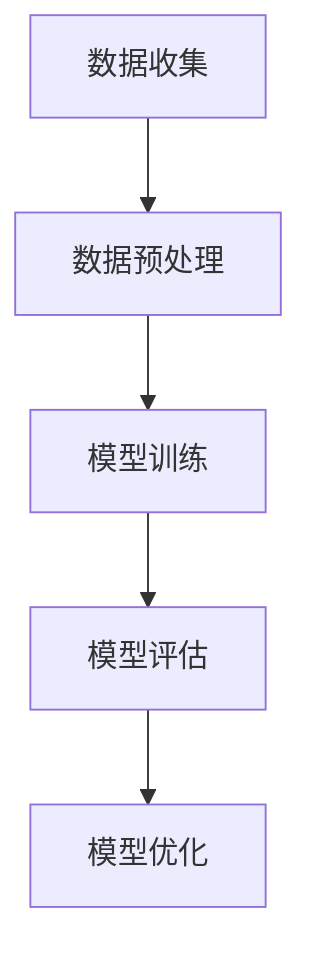
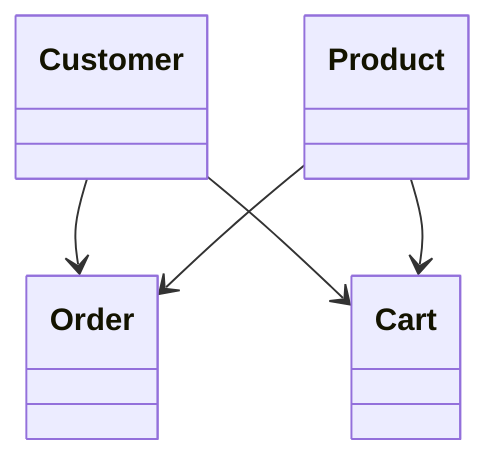
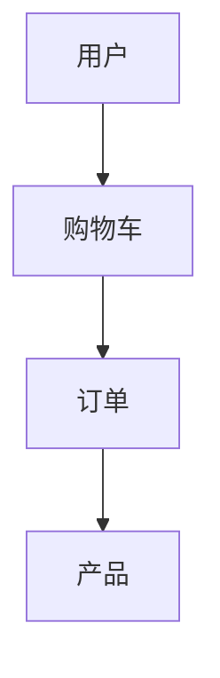
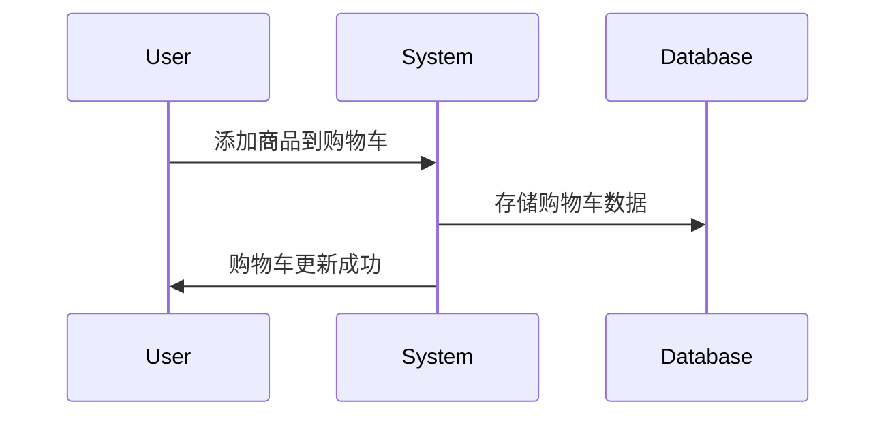

                 


### 让我们一步步思考：技术创新管理的艺术

在当今快速发展的技术时代，技术创新已成为企业竞争的关键因素。然而，如何在保持技术领先的同时，确保系统的稳定性和可靠性，成为许多企业面临的挑战。本文旨在探讨技术创新管理的艺术，通过一步步分析，帮助读者理解如何在创新与稳定之间找到平衡。

#### 第一步：理解技术创新的背景和趋势

技术创新不仅仅是一种技术进步，它更是一种战略选择。让我们首先回顾一下技术创新的历史。从工业革命到互联网时代，技术创新的步伐不断加快。近年来，人工智能、大数据和物联网等新兴技术，正推动着产业变革。这些趋势表明，技术创新已成为推动社会进步的重要力量。

#### 第二步：掌握技术创新的核心概念与联系

技术创新的核心概念包括技术可行性、市场潜力、资源需求等。这些概念相互作用，共同影响技术创新的成败。为了更好地理解这些概念，我们可以通过ER图（实体关系图）来展示它们之间的关系。例如，技术可行性决定了市场的需求，而市场需求又影响着资源的分配。

```mermaid
erDiagram
  Technology_Feasibility ||--|{ Market_Potential } 
  Resource_Requirement ||--|{ Technology_Feasibility }
```

#### 第三步：深入剖析技术创新算法原理

在技术创新过程中，算法扮演着关键角色。以人工智能为例，机器学习算法通过不断学习数据，优化模型，从而实现技术创新。我们可以通过mermaid流程图来展示机器学习的基本流程，并通过Python源代码来阐述算法的实现细节。



在Python源代码示例中，我们可以看到如何实现一个简单的线性回归模型：

```python
import numpy as np
from sklearn.linear_model import LinearRegression

# 数据集
X = np.array([[1], [2], [3], [4], [5]])
y = np.array([1, 2, 2.5, 4, 5])

# 线性回归模型
model = LinearRegression()
model.fit(X, y)

# 模型评估
print(model.score(X, y))

# 预测
print(model.predict([[6]]))
```

此外，我们还需要理解算法背后的数学模型，例如线性回归的公式：

$$
y = \beta_0 + \beta_1x
$$

这里，$y$是因变量，$x$是自变量，$\beta_0$和$\beta_1$是模型参数。

#### 第四步：系统分析与架构设计方案

技术创新不仅需要算法的支持，还需要系统化的架构设计。以一个电商系统为例，我们可以通过mermaid类图来展示系统的功能模块，并通过mermaid架构图来展示各模块之间的关系。





在系统接口设计和交互方面，我们可以通过mermaid序列图来展示用户操作与系统响应的流程。



#### 第五步：项目实战与最佳实践

在技术创新管理中，实战经验至关重要。我们可以通过一个实际项目来展示如何应用技术创新。例如，开发一个智能家居系统，实现远程控制家居设备的功能。在这个项目中，我们需要安装相应的开发环境，编写核心源代码，并进行代码解读与分析。

```python
# 智能家居系统核心代码
class SmartHome:
    def __init__(self):
        self.devices = []

    def add_device(self, device):
        self.devices.append(device)

    def control_device(self, device_name, command):
        for device in self.devices:
            if device.name == device_name:
                device.execute(command)
                break

class Device:
    def __init__(self, name):
        self.name = name

    def execute(self, command):
        if command == "on":
            print(f"{self.name} 已开启")
        elif command == "off":
            print(f"{self.name} 已关闭")
```

在项目实战中，我们还需要注意最佳实践，例如代码质量、系统性能和安全性等。这些最佳实践可以总结为以下几点：

- **代码质量**：遵循良好的编码规范，进行单元测试和集成测试。
- **系统性能**：优化数据库查询，使用缓存技术，减少响应时间。
- **安全性**：实施访问控制和加密技术，保护用户数据安全。

#### 第六步：注意事项与拓展阅读

在技术创新管理过程中，还有一些注意事项值得注意。例如，技术创新的风险管理、团队合作和资源分配等。对于这些内容，我们可以提供以下建议：

- **风险管理**：定期评估技术创新项目的风险，制定风险应对策略。
- **团队合作**：建立跨部门的创新团队，促进沟通与协作。
- **资源分配**：合理分配人力、物力和财力资源，确保技术创新项目的顺利推进。

为了深入了解这些内容，我们可以推荐一些拓展阅读资源，如经典的创新管理书籍、行业报告和技术博客等。

通过以上六步思考，我们可以更好地理解技术创新管理的艺术，找到创新与稳定之间的平衡点，推动企业在技术竞争中取得优势。

### 总结与展望

技术创新管理是一门复杂的艺术，需要我们在创新与稳定之间找到平衡。本文通过一步步的分析，从技术创新的背景、核心概念、算法原理到系统分析与架构设计，再到项目实战和最佳实践，帮助读者全面了解技术创新管理的各个方面。未来，随着技术的不断进步，技术创新管理将变得更加重要。我们期待读者能够运用本文的知识，结合自身实践，推动企业在技术创新的道路上不断前行。

---

**作者：AI天才研究院/AI Genius Institute & 禅与计算机程序设计艺术 /Zen And The Art of Computer Programming**

