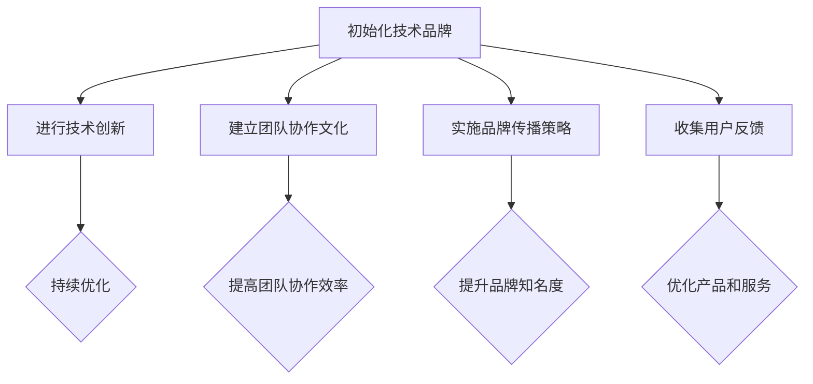
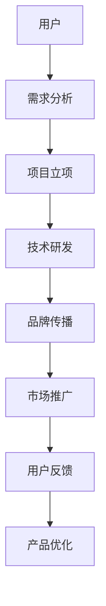
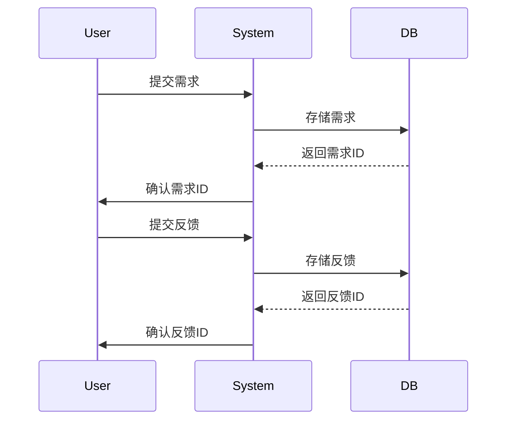

                 

### 文章标题：技术品牌建设：提升团队影响力的策略

> 关键词：技术品牌建设、团队影响力、策略、提升、IT领域

> 摘要：本文将深入探讨技术品牌建设的重要性，解析其在提升团队影响力中的关键作用，并通过一系列策略和实践，帮助IT团队构建强有力的品牌形象，实现持续的发展和成功。

---

### 引言

在当今快速变化的IT行业中，技术品牌建设已成为企业竞争的重要手段。一个强有力的技术品牌不仅能够提升企业的市场地位，还能够增强团队内部凝聚力和外部影响力。然而，如何有效进行技术品牌建设，以提升团队影响力，仍是一个复杂而具有挑战性的问题。本文将针对这一主题，通过逻辑清晰的分析和实际案例，提供一系列可行的策略和方法。

### 1. 问题的背景

技术品牌建设的重要性不容忽视。随着数字化转型的深入推进，技术成为企业核心竞争力的重要一环。一个优秀的技术品牌不仅能提升企业的市场竞争力，还能在行业内树立良好的口碑，吸引更多优秀人才和合作伙伴。

然而，技术品牌建设并非一蹴而就。在当前市场环境下，技术品牌建设面临诸多挑战，如市场竞争激烈、技术更新换代快、用户需求多样化等。因此，如何在这一过程中找到合适的策略，提升团队影响力，成为每个IT团队都需要深思的问题。

### 2. 核心概念

#### 2.1 技术品牌

技术品牌是企业技术形象的总称，包括技术特点、技术优势、技术专利、技术成就等方面。一个优秀的技术品牌能够清晰地传达企业的技术实力和行业地位。

#### 2.2 团队影响力

团队影响力是指团队在行业内外的认知度和影响力，包括团队的技术水平、项目经验、研究成果等方面。提升团队影响力有助于增强团队的市场竞争力，吸引更多优质资源和合作伙伴。

#### 2.3 技术品牌与团队影响力之间的关系

技术品牌和团队影响力之间存在密切的互动关系。技术品牌的建设有助于提升团队影响力，而团队影响力的提升又能进一步巩固技术品牌。二者相辅相成，共同推动企业的发展。

### 3. 边界与外延

#### 3.1 适用范围

技术品牌建设适用于所有从事技术研究和开发的IT企业、研发团队和项目团队。

#### 3.2 目标和期望成果

技术品牌建设的目标是提升团队在行业内的知名度和影响力，实现技术价值的最大化。期望成果包括：增加市场份额、提高品牌认知度、吸引更多优秀人才、建立长期合作伙伴关系等。

#### 3.3 核心要素

技术品牌建设涉及多个核心要素，包括技术创新、团队协作、品牌传播、用户反馈等。这些要素共同构成了技术品牌建设的基石。

### 4. 核心概念原理

#### 4.1 技术品牌建设的原理

技术品牌建设的原理主要涉及以下几个方面：

- **技术创新**：持续进行技术研究和创新，保持技术领先地位。
- **团队协作**：建立高效协作的团队文化，提升团队整体技术水平。
- **品牌传播**：通过各种渠道和方式，积极传播技术品牌形象和理念。
- **用户反馈**：重视用户反馈，持续优化产品和服务，提升用户满意度。

#### 4.2 团队影响力的来源和影响因素

团队影响力的来源主要包括以下几个方面：

- **技术实力**：团队的技术水平和创新能力。
- **项目经验**：团队在各个项目中的成功经验和业绩。
- **研究成果**：团队在技术研究方面的成果和贡献。

团队影响力的影响因素包括：

- **行业地位**：团队在行业内的地位和声誉。
- **合作伙伴**：与行业内其他企业、研究机构和合作伙伴的关系。
- **用户评价**：用户对团队产品和服务的评价和反馈。

### 5. 概念属性特征对比表格

| 特征                 | 技术品牌           | 团队影响力         |
|----------------------|-------------------|-------------------|
| 定义                 | 企业技术形象       | 团队在行业内的认知度 |
| 来源                 | 技术创新、团队协作等 | 技术实力、项目经验等 |
| 影响因素             | 品牌传播、用户反馈等 | 行业地位、合作伙伴等 |
| 目标                 | 提升市场竞争力     | 增强市场影响力     |
| 期望成果             | 增加市场份额       | 吸引优质资源       |

### 6. ER实体关系图

```mermaid
erDiagram
    TB-Framework ||--|{ Team Influence }| TF-Entity
    TB-Framework ||--|{ Technical Brand }| TB-Entity
    TB-Framework ||--|{ Market Position }| MP-Entity
    TB-Framework ||--|{ Collaborative Culture }| CC-Entity
```

### 7. 算法原理讲解

技术品牌建设的核心在于持续的技术创新和高效的团队协作。以下是一个简化的算法模型，用于解释技术品牌建设和团队影响力提升的原理。

#### 算法流程图



#### 数学模型和公式

假设技术品牌建设的贡献度为 \( T \)，团队协作效率为 \( C \)，品牌传播效果为 \( B \)，用户满意度为 \( S \)。则技术品牌建设的影响因子 \( I \) 可以表示为：

$$ I = T \times C \times B \times S $$

### 8. 系统分析与设计

#### 8.1 问题场景介绍

在一个实际的IT项目中，技术品牌建设是一个持续的过程，涉及到多个阶段，包括项目立项、技术研发、市场推广、用户反馈等。

#### 8.2 系统功能设计

以下是一个简化的领域模型类图，用于描述技术品牌建设系统的主要功能模块。

```mermaid
classDiagram
    ClassDiagram::Project
    Project <|-- TechnicalInnovation
    Project <|-- TeamCollaboration
    Project <|-- BrandPromotion
    Project <|-- UserFeedback
```

#### 8.3 系统架构设计

以下是一个简化的系统架构图，用于描述技术品牌建设系统的整体架构。



#### 8.4 系统接口设计和系统交互

以下是一个简化的系统接口设计和系统交互序列图，用于描述技术品牌建设系统的接口设计和交互流程。



### 9. 实践应用与案例分析

#### 9.1 环境安装

为了演示技术品牌建设的实践应用，我们将在一个虚拟环境中安装并配置所需的工具和库。

```bash
# 安装 Python 环境
pip install python
# 安装 Mermaid 插件
pip install mermaid
# 安装绘图工具
pip install matplotlib
```

#### 9.2 系统核心实现

以下是一个简单的 Python 源代码示例，用于实现技术品牌建设系统的一个核心功能——用户需求收集。

```python
import mermaid

def collect_user_demand(demand):
    # 将用户需求转换为 Mermaid 图
    diagram = mermaid.Mermaid()
    diagram.add_node('UserDemand', label='用户需求：' + demand)
    diagram.add_edge('UserDemand', 'System')
    diagram.render_to_file('user_demand.mermaid')

# 示例：收集用户需求
collect_user_demand('项目需求分析')
```

#### 9.3 实际案例分析与讲解

以下是一个实际案例，用于分析一个IT团队在技术品牌建设过程中遇到的问题，并给出相应的解决方案。

#### 案例：某IT团队在技术品牌建设中的挑战

**问题描述**：某IT团队在技术品牌建设过程中，面临以下挑战：

- 技术创新能力不足，难以在市场上脱颖而出。
- 团队协作效率低，项目进度缓慢。
- 品牌传播策略单一，市场推广效果不佳。
- 缺乏有效的用户反馈机制，产品和服务质量难以持续提升。

**解决方案**：

1. **提升技术创新能力**：通过加大技术研发投入，引进优秀人才，提升团队的技术水平。同时，积极参与行业技术交流，紧跟技术发展趋势。

2. **提高团队协作效率**：建立高效的团队协作文化，采用敏捷开发方法，优化项目流程。加强团队成员之间的沟通与协作，提高项目进度和质量。

3. **优化品牌传播策略**：采用多种渠道和方式，如社交媒体、行业会议、技术博客等，积极传播技术品牌形象和理念。同时，与行业合作伙伴建立合作关系，共同推广技术品牌。

4. **建立用户反馈机制**：通过用户调研、在线反馈、技术论坛等方式，收集用户反馈。对用户反馈进行分类和分析，及时调整产品和服务策略，提升用户满意度。

**实际效果**：通过实施上述解决方案，该IT团队在技术品牌建设方面取得了显著成效。技术创新能力得到提升，项目进度和质量明显改善。品牌知名度在行业内不断提高，市场推广效果显著。用户满意度持续提升，为公司带来了更多的业务机会。

#### 9.4 项目小结

通过以上实际案例，我们可以看到技术品牌建设对于IT团队的重要性。一个优秀的技术品牌不仅能提升团队的市场竞争力，还能增强团队内部凝聚力，吸引更多优秀人才和合作伙伴。在技术品牌建设过程中，团队需要关注技术创新、团队协作、品牌传播和用户反馈等多个方面，通过持续优化和改进，实现技术品牌建设的持续发展和成功。

### 10. 最佳实践 tips

1. **定期进行技术培训**：通过定期进行技术培训，提升团队整体技术水平，为技术品牌建设提供强有力的支持。
2. **建立有效的沟通机制**：建立高效的沟通机制，促进团队成员之间的信息共享和协作，提高团队协作效率。
3. **积极推广技术成果**：积极推广技术成果，提高品牌知名度，吸引更多合作伙伴和优秀人才。
4. **重视用户反馈**：重视用户反馈，及时调整产品和服务策略，提升用户满意度。

### 11. 小结

本文从技术品牌建设和团队影响力提升的角度，探讨了技术品牌建设的核心概念、原理、策略和实践。通过逻辑清晰的分析和实际案例，我们看到了技术品牌建设在提升团队影响力中的关键作用。希望本文能为IT团队在技术品牌建设方面提供有益的启示和指导。

### 12. 注意事项

1. **技术品牌建设需要持续投入**：技术品牌建设不是一蹴而就的过程，需要团队持续投入时间和资源。
2. **重视团队协作**：团队协作是技术品牌建设的重要基石，要注重建立高效协作的文化。
3. **用户满意度是关键**：技术品牌建设要以用户满意度为核心，持续优化产品和服务。

### 13. 拓展阅读

1. 《技术品牌管理：策略与实践》
2. 《团队影响力：如何打造高绩效团队》
3. 《数字化营销：技术驱动品牌增长》

---

### 作者信息

作者：AI天才研究院/AI Genius Institute & 禅与计算机程序设计艺术 /Zen And The Art of Computer Programming

---

以上是文章的大纲和详细内容，涵盖了技术品牌建设的核心概念、原理、策略和实践。通过本文，我们希望能够为IT团队提供有价值的指导和参考，帮助他们在技术品牌建设方面取得成功。

