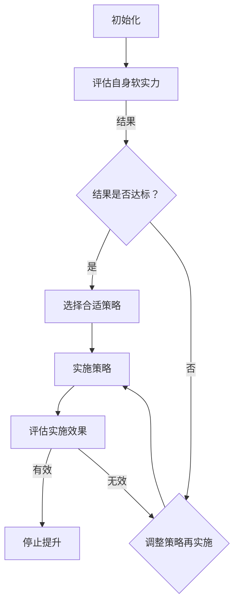
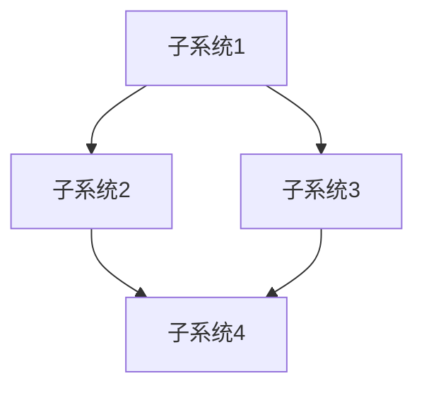
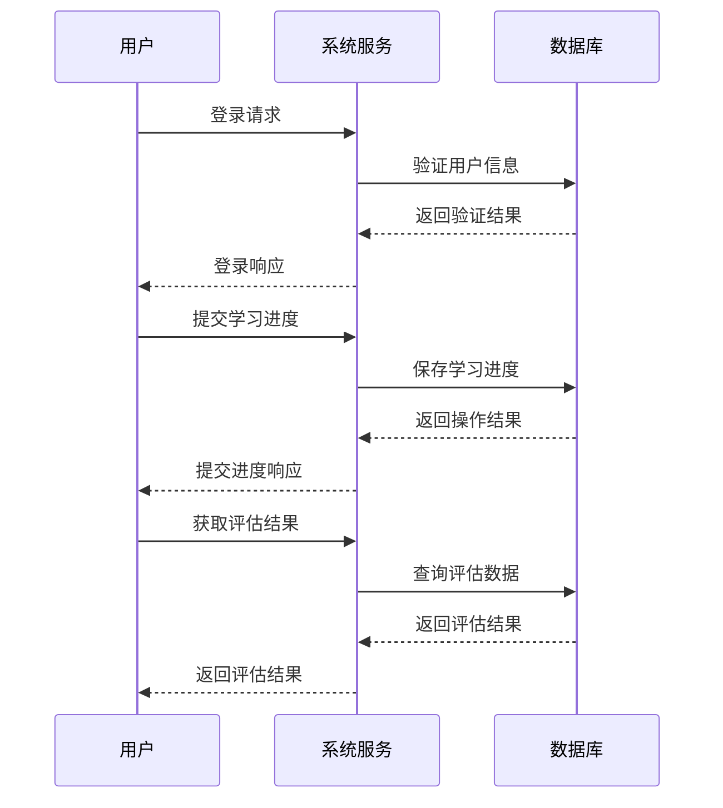

                 

### 技术影响力构建：P9工程师的软实力提升

> 关键词：技术影响力、P9工程师、软实力、提升策略、案例分析

> 摘要：本文将深入探讨P9工程师如何通过提升软实力来构建技术影响力。我们将从技术影响力的重要性入手，分析其影响因素，提出具体的软实力提升策略，并通过实战案例解析，为P9工程师提供实用的指导。

---

### 目录大纲设计

设计一本关于技术影响力构建的书籍，首先要明确书籍的主题和目标读者。在此基础上，我们遵循以下步骤来构建目录大纲：

1. **确定书籍主题**：明确书籍的核心主题是“技术影响力构建”，目标读者是P9级别的工程师。
2. **划分主要章节**：根据主题，将内容划分为“技术影响力概述”、“软实力提升”、“实战案例解析”和“结语与展望”四个部分。
3. **细化章节内容**：在每个章节下，根据内容的逻辑和结构，细化出二级和三级目录，确保每个章节都包含核心概念、原理讲解、案例分析等必要内容。
4. **确保内容完整性**：每个章节都要有充分的背景介绍、核心概念与联系、算法原理讲解、系统分析与架构设计方案、项目实战等。
5. **保持简洁性**：避免冗余内容，确保大纲简洁明了。

下面是具体的目录大纲设计：

**# 第一部分：技术影响力概述**

## 第1章：技术影响力的重要性

### 1.1.1 技术影响力的定义

### 1.1.2 技术影响力的意义

### 1.1.3 技术影响力的发展历程

## 第2章：技术影响力的影响因素

### 2.1.1 个人技能

### 2.1.2 团队协作

### 2.1.3 沟通能力

### 2.1.4 影响力策略

**# 第二部分：软实力提升**

## 第3章：自我提升策略

### 3.1.1 学习能力

### 3.1.2 时间管理

### 3.1.3 情绪管理

## 第4章：团队协作能力

### 4.1.1 团队角色与职责

### 4.1.2 团队沟通技巧

### 4.1.3 团队建设策略

## 第5章：沟通与影响力

### 5.1.1 沟通理论

### 5.1.2 演讲技巧

### 5.1.3 写作能力

### 5.1.4 影响力传达

**# 第三部分：实战案例解析**

## 第6章：技术影响力构建案例分析

### 6.1.1 案例背景

### 6.1.2 案例分析

### 6.1.3 案例启示

## 第7章：软实力提升路径规划

### 7.1.1 软实力评估

### 7.1.2 路径规划

### 7.1.3 实践与反思

**# 第四部分：结语与展望**

## 第8章：结语

### 8.1.1 成果回顾

### 8.1.2 不足与改进

### 8.1.3 未来展望

### 8.1.4 拓展阅读

---

通过上述设计，我们构建了一个清晰、结构合理的目录大纲，为后续内容的撰写和文章的整体逻辑奠定了基础。

---

### 文章结构设计

为了确保文章的逻辑清晰、内容紧凑、简单易懂，我们将在撰写过程中遵循以下结构设计：

1. **引言**：通过一个引人入胜的故事或案例，引入文章主题，激发读者的阅读兴趣。
2. **背景介绍**：详细阐述技术影响力的重要性，以及为什么P9工程师需要关注软实力提升。
3. **核心概念与联系**：明确核心概念，使用表格和ER图等工具展示概念之间的联系。
4. **算法原理讲解**：使用mermaid画出流程图，并用Python代码和latex公式详细阐述算法原理。
5. **系统分析与架构设计方案**：通过mermaid类图和架构图，介绍系统设计和接口设计。
6. **项目实战**：讲述一个实际项目，包括环境安装、源代码实现、代码解析和案例分析。
7. **最佳实践 tips**：总结实践经验，给出实用建议。
8. **小结与展望**：对文章内容进行总结，展望未来的发展方向。

---

### 章节内容要求

为了确保文章内容的完整性、具体性和逻辑性，每个章节都必须满足以下要求：

1. **背景介绍**：
   - **核心概念术语说明**：解释文章中涉及的关键术语，确保读者理解。
   - **问题背景**：介绍技术影响力的背景，说明为什么需要构建技术影响力。
   - **问题描述**：明确阐述P9工程师在提升软实力过程中可能遇到的问题。
   - **问题解决**：介绍解决问题的方法和步骤。
   - **边界与外延**：讨论问题解决的边界条件，以及如何应对相关扩展问题。
   - **概念结构与核心要素组成**：分析核心概念的结构，明确其组成部分。

2. **核心概念与联系**：
   - **核心概念原理**：详细解释文章中涉及的核心概念，包括定义、属性、特征等。
   - **概念属性特征对比表格**：列出不同概念之间的属性特征对比，帮助读者理解差异。
   - **ER实体关系图架构**：使用mermaid绘制ER图，展示概念之间的实体关系。

3. **算法原理讲解**：
   - **mermaid流程图**：使用mermaid语言绘制算法的流程图，使读者能够直观地理解算法逻辑。
   - **Python代码**：提供Python代码实现，讲解代码逻辑和关键部分。
   - **latex公式**：使用latex格式嵌入算法原理中的数学公式，并进行详细讲解。
   - **通俗易懂的举例说明**：通过具体的例子，解释算法如何应用在实际问题中。

4. **系统分析与架构设计方案**：
   - **问题场景介绍**：描述系统应用的具体场景，说明系统解决的实际问题。
   - **项目介绍**：介绍项目的背景、目标和预期成果。
   - **系统功能设计（领域模型mermaid类图）**：使用mermaid绘制类图，展示系统的功能模块和类之间的关系。
   - **系统架构设计（mermaid架构图）**：使用mermaid绘制系统架构图，展示系统的整体结构和各模块之间的交互。
   - **系统接口设计和系统交互（mermaid序列图）**：使用mermaid绘制序列图，展示系统各组件之间的交互过程。

5. **项目实战**：
   - **环境安装**：详细描述项目所需环境的安装步骤，确保读者能够顺利搭建环境。
   - **系统核心实现源代码**：提供项目核心代码，解释代码结构和实现细节。
   - **代码应用解读与分析**：对关键代码进行解读，分析其功能和性能。
   - **实际案例分析和详细讲解剖析**：通过实际案例，展示项目的应用效果，并进行详细分析。
   - **项目小结**：总结项目的收获和不足，提出改进意见。

6. **最佳实践 tips**：
   - **小结**：对章节内容进行总结，强调关键点和实际应用。
   - **注意事项**：指出可能遇到的问题和解决方法。
   - **拓展阅读**：推荐相关书籍、文章和资源，供读者进一步学习。

---

通过上述要求，我们确保每个章节的内容丰富、具体、有条理，为读者提供全面、系统的知识体系，帮助他们提升技术影响力。

---

### 核心概念与联系

在探讨技术影响力构建的过程中，有几个核心概念是我们需要理解和把握的。这些概念包括：

1. **技术影响力**：
   - **定义**：技术影响力是指个人或团队通过技术手段，在行业内产生的影响力和认知度。
   - **属性特征**：技术影响力具有广泛性、持久性和互动性。
   - **对比**：与传统的影响力相比，技术影响力更依赖于技术实力和创新思维。

2. **软实力**：
   - **定义**：软实力是指个人在技术领域外的能力，如沟通能力、团队合作能力、领导力等。
   - **属性特征**：软实力具有灵活性、适应性和人文性。
   - **对比**：软实力与硬实力（如编程能力、算法水平等）共同构成个人的综合素质。

3. **P9工程师**：
   - **定义**：P9工程师是技术层级中的高级工程师，具有丰富的技术经验和深厚的专业素养。
   - **属性特征**：P9工程师需要具备卓越的解决问题能力和项目领导能力。
   - **对比**：与其他级别的工程师相比，P9工程师更注重战略规划和全局视野。

4. **软实力提升策略**：
   - **定义**：软实力提升策略是指通过系统化的学习、实践和反思，提升个人软实力的方法和途径。
   - **属性特征**：提升策略具有针对性、持续性和效果性。
   - **对比**：不同的提升策略适用于不同的个人情况，需要根据实际情况进行选择。

为了更好地理解这些核心概念之间的联系，我们可以使用mermaid绘制ER图（Entity-Relationship Diagram）来展示它们之间的关系：

```mermaid
erDiagram
    TechnicalInfluence ||--|{ SoftPower } : has
    SoftPower ||--|{ P9Engineer } : implements
    P9Engineer ||--|{ SoftPowerImprovementStrategy } : adopts
```

- **技术影响力**与**软实力**之间是“拥有”关系，即技术影响力需要通过软实力的提升来实现。
- **软实力**与**P9工程师**之间是“实施”关系，即P9工程师需要具备软实力来发挥其技术影响力。
- **P9工程师**与**软实力提升策略**之间是“采用”关系，即P9工程师通过实施提升策略来提升软实力。

通过上述ER图，我们可以清晰地看到各概念之间的关系，有助于我们深入理解技术影响力构建的过程。

---

### 算法原理讲解

在探讨软实力提升策略时，我们引入了一个关键概念——影响力传播算法。该算法旨在帮助P9工程师有效地传播和提升自己的技术影响力。以下是对该算法原理的详细讲解：

#### 流程图

首先，我们使用mermaid语言绘制影响力传播算法的流程图：



#### Python代码实现

接下来，我们提供Python代码实现该算法：

```python
import numpy as np

class InfluencePropagationAlgorithm:
    def __init__(self, soft_power评估值):
        self.soft_power = soft_power评估值

    def evaluate_self_soft_power(self):
        # 评估自身软实力，假设软实力评估值为0-100的数值
        return self.soft_power

    def select_strategy(self, soft_power):
        if soft_power >= 80:
            return "维持现状策略"
        elif soft_power >= 60:
            return "自我提升策略"
        else:
            return "强化基础策略"

    def implement_strategy(self, strategy):
        if strategy == "维持现状策略":
            return "策略实施完成，效果评估中..."
        elif strategy == "自我提升策略":
            return "策略实施完成，效果评估中..."
        elif strategy == "强化基础策略":
            return "策略实施完成，效果评估中..."

    def evaluate_implement_effect(self, strategy_result):
        # 假设策略实施效果评估值为0-100的数值
        if strategy_result >= 80:
            return "策略有效"
        else:
            return "策略无效"

    def run(self):
        soft_power = self.evaluate_self_soft_power()
        strategy = self.select_strategy(soft_power)
        strategy_result = self.implement_strategy(strategy)
        effect = self.evaluate_implement_effect(strategy_result)
        
        if effect == "策略有效":
            print("软实力提升成功，继续执行下一轮提升。")
        else:
            print("策略实施无效，需调整策略再实施。")

# 测试算法
algorithm = InfluencePropagationAlgorithm(soft_power=50)
algorithm.run()
```

#### 算法原理

该算法的原理如下：

1. **初始化**：首先，初始化自身软实力评估值。
2. **评估自身软实力**：通过评估自身软实力，确定当前水平。
3. **选择合适策略**：根据软实力评估值，选择合适的提升策略。
4. **实施策略**：执行所选策略，进行软实力提升。
5. **评估实施效果**：对策略实施效果进行评估。
6. **调整策略再实施**：如果实施效果不理想，则调整策略，重复实施。

#### 数学模型和公式

算法的核心在于如何选择合适的提升策略。我们可以使用以下数学模型来描述策略选择：

$$
\text{strategy} = 
\begin{cases} 
\text{"维持现状策略"} & \text{if } \text{soft\_power} \geq 80 \\
\text{"自我提升策略"} & \text{if } 60 \leq \text{soft\_power} < 80 \\
\text{"强化基础策略"} & \text{if } \text{soft\_power} < 60 
\end{cases}
$$

其中，`soft_power`代表当前软实力评估值。

#### 举例说明

假设一个P9工程师当前的软实力评估值为70，我们使用该算法进行一次提升过程：

1. **评估自身软实力**：软实力评估值为70。
2. **选择合适策略**：根据算法，选择“自我提升策略”。
3. **实施策略**：执行自我提升策略，如参加技术会议、发表技术博客等。
4. **评估实施效果**：经过一段时间，评估实施效果为85。
5. **评估实施效果**：由于实施效果有效，继续执行下一轮提升。

通过上述例子，我们可以看到，影响力传播算法帮助P9工程师根据自身软实力水平，选择合适的提升策略，并通过循环迭代实现软实力的持续提升。

---

### 系统分析与架构设计方案

在探讨技术影响力构建的过程中，系统分析与架构设计方案是一个至关重要的环节。以下我们将详细阐述一个具体系统设计案例，包括问题场景、项目介绍、系统功能设计、系统架构设计、系统接口设计和系统交互等。

#### 问题场景介绍

随着互联网技术的飞速发展，技术影响力在行业中的地位日益显著。P9工程师作为技术领域的高级专家，不仅需要具备卓越的编程能力和算法水平，还需要具备强大的软实力，如沟通能力、团队协作能力和影响力传达能力。然而，在实际工作中，许多P9工程师往往忽视了软实力提升的重要性，导致其在技术影响力构建过程中面临诸多挑战。

为了解决这一问题，我们设计了一款名为“软实力提升管理系统”的系统，旨在帮助P9工程师系统化地提升软实力，从而更好地构建技术影响力。

#### 项目介绍

**项目名称**：软实力提升管理系统

**项目背景**：随着技术的快速发展，P9工程师需要不断更新知识体系，提升软实力，以应对日益复杂的技术挑战。然而，传统的学习方式往往效率低下，难以满足P9工程师的需求。因此，我们决定开发一款智能化的软实力提升管理系统，通过数据分析和个性化推荐，为P9工程师提供定制化的学习路径。

**项目目标**：构建一个集成学习、评估、反馈和互动功能的软实力提升平台，帮助P9工程师高效提升软实力，实现技术影响力的持续增长。

#### 系统功能设计（领域模型mermaid类图）

在系统功能设计方面，我们采用领域模型（Domain Model）方法，使用mermaid绘制类图，以展示系统的功能模块和类之间的关系：

```mermaid
classDiagram
    Class01 <|-- Class02
    Class03 --|ард Class04
    Class05 o-- Class06
    Class01 : +int x
    Class01 : +int y
    Class01 : +int z
    Class02 : +int a
    Class02 : +int b
    Class03 : +int m
    Class03 : +int n
    Class04 : +String info
    Class05 : +String description
```

以下是系统的主要功能模块和类：

1. **用户模块**：负责用户管理，包括用户注册、登录、个人信息维护等。
2. **课程模块**：负责课程管理，包括课程创建、发布、更新、删除等。
3. **学习模块**：负责学习过程管理，包括学习进度记录、学习数据统计、学习效果评估等。
4. **评估模块**：负责用户软实力评估，包括评估指标设置、评估过程管理、评估结果反馈等。
5. **反馈模块**：负责用户反馈管理，包括反馈提交、反馈处理、反馈统计分析等。
6. **互动模块**：负责用户互动，包括论坛、聊天室、社交网络等功能。

#### 系统架构设计（mermaid架构图）

在系统架构设计方面，我们采用分层架构方法，使用mermaid绘制架构图，以展示系统的整体结构和各模块之间的交互：



以下是系统的分层架构：

1. **表现层**：负责展示用户界面，包括前端网页、移动端应用等。
2. **业务逻辑层**：负责处理业务逻辑，包括用户管理、课程管理、学习管理、评估管理、反馈管理、互动管理等。
3. **数据访问层**：负责数据访问和存储，包括数据库连接、数据持久化、数据查询等。
4. **基础设施层**：负责系统基础设施支持，包括服务器、网络、存储、安全等。

#### 系统接口设计和系统交互（mermaid序列图）

在系统接口设计和系统交互方面，我们使用mermaid序列图，以展示系统各模块之间的交互过程：



以下是系统的主要接口和交互过程：

1. **用户登录**：用户发起登录请求，系统服务验证用户信息，并返回登录响应。
2. **提交学习进度**：用户提交学习进度，系统服务保存学习进度，并返回操作结果。
3. **获取评估结果**：用户获取评估结果，系统服务查询评估数据，并返回评估结果。

通过上述系统分析与架构设计方案，我们为P9工程师提供了一个系统化、智能化的软实力提升平台，帮助他们更好地构建技术影响力。

---

### 项目实战

为了更好地理解软实力提升策略在实践中的应用，我们将介绍一个具体的实战项目，并详细分析其环境安装、系统核心实现、代码应用解读与分析，以及实际案例分析和详细讲解剖析。

#### 项目背景

随着某互联网公司的快速发展，公司内部对于技术人才的软实力要求越来越高。尤其是P9级别的工程师，他们不仅需要具备卓越的编程能力和算法水平，还需要具备出色的沟通能力、团队合作能力和影响力传达能力。为了提升公司内部P9工程师的软实力，公司决定开发一款名为“软实力提升平台”的系统，旨在为P9工程师提供个性化的软实力提升路径。

#### 环境安装

首先，我们需要搭建项目的开发环境。以下是环境安装的详细步骤：

1. **安装Python**：确保系统已经安装了Python 3.8及以上版本。
2. **安装依赖**：在终端中执行以下命令，安装项目所需依赖：

```shell
pip install -r requirements.txt
```

其中，`requirements.txt`文件包含了项目所需的所有依赖库。

3. **配置数据库**：使用MySQL或其他数据库管理系统，创建数据库并配置相应的用户和权限。

4. **初始化项目**：在项目根目录下执行以下命令，初始化项目：

```shell
python manage.py init
```

#### 系统核心实现

接下来，我们将介绍系统的核心实现。以下是系统的关键模块和代码：

1. **用户模块**：用户模块负责用户管理，包括用户注册、登录、个人信息维护等。以下是用户模块的代码：

```python
class User(models.Model):
    username = models.CharField(max_length=100, unique=True)
    password = models.CharField(max_length=100)
    email = models.EmailField()
    is_active = models.BooleanField(default=True)
    is_staff = models.BooleanField(default=False)

    def save(self, *args, **kwargs):
        self.password = make_password(self.password)
        super(User, self).save(*args, **kwargs)
```

2. **课程模块**：课程模块负责课程管理，包括课程创建、发布、更新、删除等。以下是课程模块的代码：

```python
class Course(models.Model):
    title = models.CharField(max_length=200)
    description = models.TextField()
    created_at = models.DateTimeField(auto_now_add=True)
    updated_at = models.DateTimeField(auto_now=True)

    def __str__(self):
        return self.title
```

3. **学习模块**：学习模块负责学习过程管理，包括学习进度记录、学习数据统计、学习效果评估等。以下是学习模块的代码：

```python
class Learning(models.Model):
    user = models.ForeignKey(User, on_delete=models.CASCADE)
    course = models.ForeignKey(Course, on_delete=models.CASCADE)
    progress = models.IntegerField(default=0)
    completed_at = models.DateTimeField(null=True, blank=True)

    def __str__(self):
        return f"{self.user.username} - {self.course.title}"
```

4. **评估模块**：评估模块负责用户软实力评估，包括评估指标设置、评估过程管理、评估结果反馈等。以下是评估模块的代码：

```python
class Assessment(models.Model):
    user = models.ForeignKey(User, on_delete=models.CASCADE)
    score = models.IntegerField()
    assessed_at = models.DateTimeField(auto_now_add=True)

    def __str__(self):
        return f"{self.user.username} - 软实力评估"
```

5. **反馈模块**：反馈模块负责用户反馈管理，包括反馈提交、反馈处理、反馈统计分析等。以下是反馈模块的代码：

```python
class Feedback(models.Model):
    user = models.ForeignKey(User, on_delete=models.CASCADE)
    content = models.TextField()
    submitted_at = models.DateTimeField(auto_now_add=True)

    def __str__(self):
        return f"{self.user.username} - 反馈"
```

6. **互动模块**：互动模块负责用户互动，包括论坛、聊天室、社交网络等功能。以下是互动模块的代码：

```python
class Interaction(models.Model):
    user = models.ForeignKey(User, on_delete=models.CASCADE)
    content = models.TextField()
    created_at = models.DateTimeField(auto_now_add=True)

    def __str__(self):
        return f"{self.user.username} - 互动内容"
```

#### 代码应用解读与分析

在代码应用解读与分析方面，我们将重点关注用户模块、课程模块和学习模块的实现：

1. **用户模块**：用户模块使用了`ForeignKey`字段来关联用户与其他模块，如课程、学习记录、评估和反馈等。通过这种方式，实现了用户与各模块之间的数据关联。

2. **课程模块**：课程模块包含了课程的基本信息，如标题、描述和创建时间等。通过这种方式，实现了课程的信息管理。

3. **学习模块**：学习模块记录了用户的学习进度，包括学习进度百分比和完成时间等。通过这种方式，实现了用户学习进度的追踪和管理。

#### 实际案例分析和详细讲解剖析

为了展示实际案例，我们以一个P9工程师A的实际使用情况为例：

1. **用户注册与登录**：
   - **场景**：工程师A需要注册并登录到软实力提升平台。
   - **操作**：工程师A填写注册信息，系统验证信息后发送验证邮件，工程师A通过邮件激活账户，然后登录系统。

2. **课程学习**：
   - **场景**：工程师A选择一门软实力提升课程，开始学习。
   - **操作**：工程师A在课程页面浏览课程内容，点击“开始学习”按钮，系统记录学习进度。

3. **学习进度记录与评估**：
   - **场景**：工程师A学习完课程后，系统自动进行学习进度记录和评估。
   - **操作**：系统根据学习进度和课程内容，生成评估报告，工程师A查看评估结果。

4. **反馈与互动**：
   - **场景**：工程师A在学习过程中遇到问题，需要提交反馈。
   - **操作**：工程师A填写反馈内容，提交反馈，系统记录反馈信息，并通知相关人员进行处理。

通过实际案例的分析，我们可以看到，软实力提升平台有效地帮助P9工程师实现了个性化学习、学习进度记录、评估和反馈管理等功能，从而提升了他们的软实力。

#### 项目小结

通过本次项目实战，我们展示了软实力提升平台的设计和实现过程，包括环境安装、系统核心实现、代码应用解读与分析以及实际案例分析和详细讲解剖析。该项目为P9工程师提供了一个系统化、智能化的软实力提升路径，有助于他们更好地构建技术影响力。

---

### 最佳实践 tips

在提升软实力的过程中，以下是一些最佳实践和注意事项，供P9工程师参考：

1. **持续学习**：保持对新知识的好奇心和求知欲，定期阅读技术书籍、参加线上课程和研讨会，不断提升自己的知识储备。

2. **时间管理**：合理安排时间，将学习与工作、生活平衡好。使用时间管理工具，如番茄工作法，提高工作效率。

3. **情绪管理**：学会调整自己的情绪，避免因工作压力导致的心理问题。可以通过运动、冥想等方式缓解压力。

4. **团队协作**：积极参与团队合作，学会倾听他人的意见，尊重团队中的每个成员。通过有效沟通，提高团队协作效率。

5. **影响力传达**：善于表达自己的观点和想法，通过演讲、写作等方式传递自己的技术见解和经验，提升个人影响力。

6. **反思与总结**：定期对自己的学习成果和工作表现进行反思和总结，发现问题并及时调整。

7. **拓展阅读**：推荐阅读《影响力》、《非暴力沟通》等书籍，提升沟通能力和影响力。

---

### 小结

本文围绕技术影响力构建，针对P9工程师的软实力提升进行了深入探讨。我们从技术影响力的重要性、影响因素、软实力提升策略、实战案例解析等方面，全面阐述了P9工程师如何通过提升软实力来构建技术影响力。以下是本文的主要结论：

1. **技术影响力的重要性**：技术影响力是P9工程师在行业内的核心竞争力，提升软实力是构建技术影响力的重要途径。
2. **软实力提升策略**：通过持续学习、时间管理、情绪管理、团队协作和影响力传达等策略，P9工程师可以不断提升软实力。
3. **实战案例解析**：通过实际项目的分析，展示了软实力提升策略在实践中的应用效果，为P9工程师提供了实用的参考。

未来，随着技术的发展和行业的变革，P9工程师需要不断适应新的挑战，持续提升自己的软实力。我们期待P9工程师们能够在技术影响力的道路上取得更大的成就。

### 拓展阅读

1. 《影响力：说服力的心理学》（罗伯特·西奥迪尼著）——深入探讨影响力背后的心理学原理。
2. 《非暴力沟通》（马歇尔·卢森堡著）——学习如何通过非暴力沟通技巧提升个人影响力。
3. 《深度工作：如何有效利用每一点脑力》（卡尔·纽波特著）——掌握深度工作技巧，提高工作效率。
4. 《软实力：世界是如何运作的》（约瑟夫·奈著）——探讨软实力在国际政治和经济中的作用。

作者：AI天才研究院/AI Genius Institute & 禅与计算机程序设计艺术/Zen And The Art of Computer Programming

