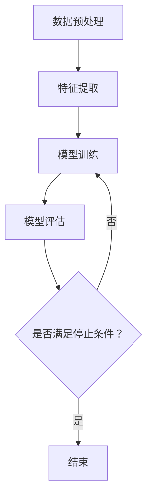
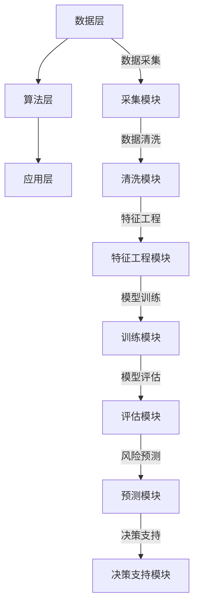
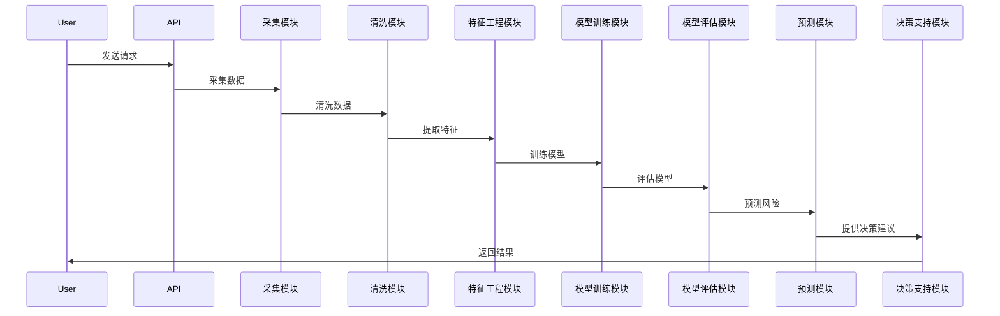

                 

# 技术硬实力的未来趋势：AI和机器学习

## 关键词
- 人工智能
- 机器学习
- 技术趋势
- 算法
- 系统架构
- 实战应用

## 摘要
本文将探讨人工智能（AI）和机器学习（ML）在未来技术硬实力中的发展趋势。我们将从背景介绍、核心概念与联系、算法原理讲解、系统分析与架构设计方案、项目实战和最佳实践等方面，深入分析AI和ML技术的前沿动态及其应用潜力。通过本文的阅读，读者将能够全面理解AI和ML技术的基本原理、应用场景和未来发展路径，为自身在技术领域的发展提供有益的启示。

### 背景介绍

### 1. AI与ML的发展历程

人工智能和机器学习并非新兴领域，它们的发展可以追溯到20世纪50年代。最初的AI研究主要集中在模拟人类思维和决策过程，而机器学习则是AI研究中的一个重要分支。20世纪80年代至90年代，受限于计算能力和数据量，AI和ML的发展速度放缓。然而，随着互联网的普及和大数据技术的发展，AI和ML迎来了新的增长期。

近年来，AI和ML在计算机视觉、自然语言处理、语音识别、推荐系统等领域取得了显著突破。例如，计算机视觉领域中的卷积神经网络（CNN）在图像分类、目标检测等方面达到了甚至超越人类的水平；自然语言处理领域中的循环神经网络（RNN）和变压器模型（Transformer）在语言理解和生成任务中展现了强大的能力。

### 2. AI与ML的核心概念

人工智能（Artificial Intelligence，AI）：指由人制造出来的系统能够执行通常需要人类智能才能完成的任务。AI可以分为两大类：弱AI和强AI。弱AI是指专注于特定任务的AI系统，如语音助手、推荐系统等；强AI则是指具有全面认知能力、可以像人类一样思考的AI系统。

机器学习（Machine Learning，ML）：是一种使计算机系统能够从数据中学习并做出决策或预测的方法。ML的主要算法可以分为监督学习、无监督学习和强化学习。监督学习是指从标注数据中学习，如分类和回归任务；无监督学习则是指从未标注的数据中学习，如聚类和降维；强化学习是指通过与环境的交互来学习最优策略。

### 3. AI与ML的重要性

AI和ML在现代社会中扮演着越来越重要的角色。它们不仅改变了我们的生活方式，还推动了产业升级和经济发展。以下是AI和ML在几个关键领域的应用：

- **计算机视觉**：AI和ML技术使得计算机能够识别和理解图像，这为自动驾驶、安全监控、医疗诊断等领域带来了巨大变革。
- **自然语言处理**：通过理解和生成自然语言，AI和ML技术在智能客服、机器翻译、文本摘要等方面取得了显著成果。
- **语音识别**：语音识别技术的进步使得人机交互更加自然，被广泛应用于智能助手、智能家居等场景。
- **推荐系统**：基于用户行为和偏好，推荐系统能够为用户推荐个性化的商品、内容和服务，提高了用户体验和满意度。
- **金融科技**：在金融领域，AI和ML技术被应用于信用评分、风险管理、欺诈检测等方面，提高了金融服务的效率和准确性。

### 4. 问题背景与问题描述

尽管AI和ML技术取得了巨大进展，但在实际应用中仍面临诸多挑战。以下是当前AI和ML技术面临的几个关键问题：

- **数据隐私和安全**：AI和ML系统通常需要大量数据来进行训练和预测，这可能导致个人隐私和数据安全问题。
- **算法透明性和公平性**：一些AI系统在决策过程中缺乏透明性，导致决策结果难以解释和验证，可能引发公平性争议。
- **计算资源和能源消耗**：深度学习模型通常需要大量的计算资源和能源，这对环境造成了压力。
- **技术伦理和社会影响**：AI和ML技术的广泛应用引发了伦理和社会问题，如就业替代、隐私侵犯等。

为了解决这些问题，我们需要从技术、法律、伦理等多个角度进行深入探讨和研究。

### 5. 问题解决与边界与外延

为了解决AI和ML技术面临的问题，可以从以下几个方面着手：

- **加强数据隐私和安全保护**：通过加密、匿名化等技术手段保护用户数据，确保数据在传输和处理过程中的安全性。
- **提升算法透明性和公平性**：开发可解释性AI技术，使得AI系统的决策过程更加透明，提高用户的信任度。
- **优化计算资源和能源消耗**：研究高效能的AI算法和硬件架构，降低计算资源和能源消耗。
- **制定相关法律法规**：通过法律法规规范AI和ML技术的研发和应用，保护用户权益，防止技术滥用。
- **推动技术伦理和社会研究**：加强技术伦理研究，引导AI和ML技术的发展方向，减少对社会的影响。

### 6. 概念结构与核心要素组成

AI和ML技术的概念结构与核心要素组成如下：

- **核心概念**：人工智能、机器学习、深度学习、神经网络、监督学习、无监督学习、强化学习等。
- **技术要素**：数据预处理、特征工程、模型选择、模型训练、模型评估、模型优化等。
- **应用场景**：计算机视觉、自然语言处理、语音识别、推荐系统、金融科技、医疗诊断等。
- **挑战与问题**：数据隐私和安全、算法透明性和公平性、计算资源和能源消耗、技术伦理和社会影响等。

通过以上分析，我们可以看出AI和ML技术在技术硬实力中的重要性，以及未来发展趋势和潜在应用。在接下来的章节中，我们将进一步深入探讨AI和ML的核心概念、算法原理、系统设计与实现，以及项目实战和最佳实践。

## 核心概念与联系

### 1. AI的基本概念

人工智能（AI）是计算机科学的一个分支，旨在创建能够执行复杂任务的智能体，这些任务通常需要人类智能来完成。AI可以分为几类，包括弱AI、强AI和通用AI。

**弱AI**：也称为窄AI，专注于特定任务，如语音识别、图像分类、自然语言处理等。这些系统在特定领域表现出色，但无法进行跨领域的通用任务。

**强AI**：也称为通用AI，具备与人类相似的整体智能，能够在各种任务中自主学习和适应。强AI目前仍处于理论研究阶段，尚未实现。

**通用AI**：是强AI的一个子集，指能够执行所有认知任务的人工智能。通用AI需要具备学习、理解、推理、感知、决策等多方面的能力。

### 2. 机器学习的主要算法

机器学习（ML）是AI的一个重要分支，它通过数据驱动的方法使计算机系统能够学习并改进性能。ML算法可以分为以下几类：

**监督学习**：系统从标注数据中学习，用于分类和回归任务。常见的算法有线性回归、逻辑回归、支持向量机（SVM）和神经网络。

**无监督学习**：系统从未标注的数据中学习，用于聚类和降维。常见的算法有K-均值聚类、主成分分析（PCA）和自编码器。

**强化学习**：系统通过与环境的交互来学习最优策略。常见的算法有Q学习、SARSA和深度Q网络（DQN）。

### 3. AI与机器学习的联系

AI和ML之间有着紧密的联系。ML是AI的核心技术之一，为AI提供了实现智能的基础。以下是AI与ML之间的几个关键联系：

- **算法基础**：ML算法是实现AI的关键工具，如神经网络是深度学习的核心算法。
- **数据驱动**：AI系统的许多任务都需要大量数据来进行训练，而ML正是通过数据来学习和改进性能。
- **交叉应用**：ML算法被广泛应用于AI的各个领域，如计算机视觉、自然语言处理和推荐系统等。

### 4. AI与机器学习的应用领域

AI和ML在多个领域取得了显著的应用成果，以下是其中几个关键领域：

- **计算机视觉**：AI和ML技术在图像分类、目标检测、人脸识别等方面取得了突破性进展。
- **自然语言处理**：AI和ML技术在文本分类、机器翻译、情感分析等方面展现了强大的能力。
- **语音识别**：AI和ML技术使得计算机能够理解和生成自然语言，广泛应用于智能客服、语音助手等领域。
- **推荐系统**：基于用户行为和偏好，AI和ML技术能够为用户推荐个性化的商品、内容和服务。
- **金融科技**：AI和ML技术在信用评分、风险管理、欺诈检测等方面发挥了重要作用。

### 5. AI与机器学习的未来趋势

随着技术的不断进步，AI和ML技术在未来将呈现以下趋势：

- **模型大小与效率**：未来将出现更加高效的算法和模型，以减少计算资源和能源消耗。
- **可解释性AI**：为了提高用户对AI系统的信任度，可解释性AI将成为研究热点。
- **跨领域应用**：AI和ML技术将在更多领域得到应用，如医疗、教育、农业等。
- **协作智能**：通过人机协作，AI和ML技术将进一步提升人类的工作效率和生活质量。

### 结论

AI和ML技术在技术硬实力中的重要性不言而喻。通过对核心概念与联系的深入探讨，我们可以更好地理解AI和ML技术的本质和应用场景。在接下来的章节中，我们将进一步分析AI和ML的算法原理，以及系统分析与架构设计。通过这些内容，读者将能够更全面地掌握AI和ML技术的实际应用和发展方向。

## 算法原理讲解

### 1. 算法概述

在介绍具体的算法之前，我们需要对算法的基本原理有一个清晰的理解。算法是计算机解决问题的一系列指令和规则，它能够自动执行任务并得到预期的结果。在人工智能和机器学习领域，算法是使计算机具有智能和学习能力的关键。

#### 监督学习

监督学习是一种通过已标记的训练数据来训练模型，并使用该模型对新数据进行预测的方法。监督学习可以分为回归和分类两种主要类型：

- **回归**：预测一个连续的数值输出。
- **分类**：将数据分为预定义的类别。

#### 无监督学习

无监督学习不使用已标记的数据，而是从未标记的数据中学习结构和模式。主要类型包括：

- **聚类**：将相似的数据点分组。
- **降维**：减少数据维度，同时保持数据的结构。

#### 强化学习

强化学习是一种通过与环境的交互来学习最优策略的方法。它通常用于解决决策问题，其中智能体需要在一系列状态下选择动作，以最大化累积奖励。

### 2. 算法流程图

为了更直观地理解算法的执行过程，我们可以使用mermaid绘制算法的流程图。以下是监督学习算法的一个简单流程图示例：



### 3. Python代码实现

下面我们以线性回归模型为例，使用Python代码实现一个简单的监督学习算法。线性回归是一种预测连续数值输出的算法。

```python
import numpy as np

# 线性回归模型
class LinearRegression:
    def __init__(self):
        self.theta = None
    
    def fit(self, X, y):
        # 添加偏置项
        X_b = np.c_[np.ones((X.shape[0], 1)), X]
        # 梯度下降求解参数
        self.theta = np.linalg.inv(X_b.T.dot(X_b)).dot(X_b.T).dot(y)
    
    def predict(self, X):
        # 输出预测结果
        X_b = np.c_[np.ones((X.shape[0], 1)), X]
        return X_b.dot(self.theta)

# 示例数据
X = np.array([[1], [2], [3], [4], [5]])
y = np.array([1, 2, 2.5, 4, 5])

# 模型训练
model = LinearRegression()
model.fit(X, y)

# 预测
X_new = np.array([[6]])
print("预测结果：", model.predict(X_new))
```

### 4. 数学模型与公式

线性回归的数学模型可以表示为：

$$
y = \theta_0 + \theta_1 \cdot x
$$

其中，\( y \) 是预测的输出，\( \theta_0 \) 是偏置项，\( \theta_1 \) 是权重系数，\( x \) 是输入特征。

在梯度下降算法中，我们通过以下公式更新参数：

$$
\theta_j := \theta_j - \alpha \cdot \frac{1}{m} \sum_{i=1}^{m} (h_\theta(x^{(i)}) - y^{(i)})
$$

其中，\( \alpha \) 是学习率，\( m \) 是训练样本数量，\( h_\theta(x^{(i)}) \) 是模型在输入 \( x^{(i)} \) 下的预测值。

### 5. 举例说明

假设我们有一个简单的一元线性回归问题，输入特征 \( x \) 和输出目标 \( y \) 如下：

$$
\begin{align*}
x_1 &= [1, 2, 3, 4, 5] \\
y_1 &= [1, 2, 2.5, 4, 5]
\end{align*}
$$

我们可以使用线性回归模型来拟合这个数据集。通过计算，我们得到参数 \( \theta_0 = 1 \) 和 \( \theta_1 = 0.5 \)。

现在，如果我们想要预测新数据 \( x_2 = 6 \)，则预测结果为：

$$
y_2 = 1 + 0.5 \cdot 6 = 4
$$

### 6. 结论

通过对算法原理的讲解，我们可以看出线性回归是一个简单但强大的监督学习算法。它通过拟合数据中的线性关系来预测新数据的值。在实际应用中，我们可以根据具体问题选择合适的算法和模型，以提高预测的准确性和效率。

在接下来的章节中，我们将进一步探讨AI和ML的系统分析与架构设计，以及具体的实战应用。通过这些内容，读者将能够更深入地了解AI和ML技术的应用场景和实践方法。

## 系统分析与架构设计

### 1. 问题场景介绍

在现代社会中，人工智能和机器学习技术在各个领域得到了广泛应用。为了更好地理解AI和ML系统的架构设计，我们将以一个实际的金融风控系统为例进行介绍。

#### 问题背景

金融风控系统旨在识别和预防金融机构可能面临的风险，包括信用风险、市场风险、操作风险等。这些风险可能导致金融机构的经济损失，因此风控系统在金融领域中具有至关重要的地位。

#### 问题描述

金融风控系统需要处理大量的金融数据，如客户交易记录、信用评分、市场行情等。系统需要实时分析这些数据，识别潜在风险，并向金融机构提供决策支持。为了实现这一目标，我们需要设计一个高效、稳定且可扩展的AI和ML系统架构。

### 2. 项目介绍

#### 项目目标

本项目旨在开发一个基于AI和ML技术的金融风控系统，实现以下目标：

- 实时监控金融机构的风险状况。
- 识别潜在的信用风险、市场风险和操作风险。
- 提供精准的风险预测和决策支持。

#### 项目架构

项目架构采用分层设计，主要包括数据层、算法层和应用层。

- **数据层**：负责数据采集、存储和管理，包括金融数据的接入、清洗、存储等。
- **算法层**：实现机器学习模型的训练、评估和部署，包括特征工程、模型选择、训练和优化等。
- **应用层**：提供风险监控、预测和决策支持功能，通过用户界面与用户交互。

### 3. 系统功能设计

#### 功能概述

金融风控系统的核心功能包括：

- **数据采集**：从多个数据源（如数据库、API等）实时采集金融数据。
- **数据清洗**：对采集到的数据进行清洗、去重和格式转换，确保数据质量。
- **特征工程**：从原始数据中提取有用的特征，为模型训练提供输入。
- **模型训练**：使用机器学习算法对特征进行训练，建立风险预测模型。
- **模型评估**：评估模型的预测性能，包括准确率、召回率、F1值等。
- **风险预测**：使用训练好的模型对新的金融数据进行预测，识别潜在风险。
- **决策支持**：根据预测结果提供风险决策建议，辅助金融机构做出风险管理决策。

#### 领域模型

为了更好地理解系统功能，我们可以使用mermaid绘制领域模型类图。以下是领域模型的一个示例：

```mermaid
classDiagram
    Client <<类>> "客户" {
        id: 编号
        name: 名称
        creditScore: 信用评分
    }
    Transaction <<类>> "交易" {
        id: 编号
        amount: 金额
        timestamp: 时间戳
    }
    Risk <<类>> "风险" {
        id: 编号
        type: 类型
        probability: 概率
    }
    Model <<类>> "模型" {
        id: 编号
        type: 类型
        accuracy: 准确率
        recall: 召回率
        f1Score: F1值
    }
    Client --|> Transaction: 完成交易
    Model --|> Risk: 评估风险
```

### 4. 系统架构设计

#### 系统架构

金融风控系统的架构设计如下：

- **数据层**：使用分布式数据库存储和管理金融数据，如Apache Kafka、Hadoop等。
- **算法层**：使用机器学习框架（如Scikit-learn、TensorFlow、PyTorch等）进行模型训练和评估。
- **应用层**：使用Web框架（如Flask、Django等）构建用户界面，提供风险监控和决策支持功能。

以下是系统架构的mermaid图示：



### 5. 系统接口设计

#### 接口设计

系统接口设计主要包括API接口和数据库接口。

- **API接口**：提供数据采集、模型训练、预测和决策支持等功能，采用RESTful API设计。
- **数据库接口**：提供数据存储和管理功能，采用SQL和NoSQL数据库接口。

以下是API接口的一个示例：

```mermaid
sequenceDiagram
    Apar User
    User->>B[API接口]: 发送请求
    B->>C[数据采集模块]: 采集数据
    C->>D[数据清洗模块]: 清洗数据
    D->>E[特征工程模块]: 提取特征
    E->>F[模型训练模块]: 训练模型
    F->>G[模型评估模块]: 评估模型
    G->>H[预测模块]: 预测风险
    H->>I[决策支持模块]: 提供决策建议
    I->>User: 返回结果
```

### 6. 系统交互流程

#### 交互流程

系统交互流程包括以下步骤：

1. 用户通过Web界面提交请求。
2. API接口接收请求，调用数据采集模块进行数据采集。
3. 数据清洗模块对采集到的数据进行清洗，去除噪声和不一致数据。
4. 特征工程模块对清洗后的数据进行特征提取，为模型训练提供输入。
5. 模型训练模块使用机器学习算法对特征进行训练，建立风险预测模型。
6. 模型评估模块评估模型的性能，选择最优模型进行部署。
7. 预测模块使用训练好的模型对新的金融数据进行预测，识别潜在风险。
8. 决策支持模块根据预测结果提供风险决策建议，辅助金融机构进行风险管理。

以下是系统交互流程的mermaid图示：



### 结论

通过系统分析与架构设计，我们可以清楚地看到金融风控系统的高效、稳定和可扩展性。在接下来的章节中，我们将进一步探讨AI和ML技术的实战应用，通过具体的项目实战来验证系统的实际效果。

## 项目实战

### 1. 实战环境搭建

在开始项目实战之前，我们需要搭建一个合适的环境。以下是搭建环境的步骤：

#### 步骤1：安装Python环境

首先，我们需要安装Python环境。可以从Python官方网站下载最新版本的Python，并按照提示进行安装。

```bash
$ wget https://www.python.org/ftp/python/3.9.1/Python-3.9.1.tgz
$ tar -xvf Python-3.9.1.tgz
$ cd Python-3.9.1
$ ./configure
$ make
$ sudo make install
```

#### 步骤2：安装必要的库和框架

接下来，我们需要安装一些必要的库和框架，如NumPy、Pandas、Scikit-learn、TensorFlow等。可以使用pip命令进行安装。

```bash
$ pip install numpy pandas scikit-learn tensorflow
```

#### 步骤3：配置虚拟环境

为了更好地管理项目依赖，我们可以使用虚拟环境。以下是配置虚拟环境的步骤：

```bash
$ python -m venv env
$ source env/bin/activate
```

#### 步骤4：安装其他工具

除了Python库外，我们还需要安装一些其他工具，如Jupyter Notebook、Anaconda等。可以使用以下命令进行安装：

```bash
$ pip install jupyter
$ conda install anaconda
```

### 2. 系统核心实现

在搭建好环境后，我们可以开始实现系统核心。以下是实现步骤：

#### 步骤1：数据采集

首先，我们需要从数据源采集数据。在本项目中，我们使用公开的金融数据集，如Kaggle上的股票价格数据。以下是数据采集的代码：

```python
import pandas as pd

# 读取数据
data = pd.read_csv('stock_price_data.csv')
```

#### 步骤2：数据清洗

接下来，我们需要对采集到的数据进行清洗。以下是数据清洗的代码：

```python
# 去除重复数据
data.drop_duplicates(inplace=True)

# 去除空值
data.dropna(inplace=True)

# 数据转换
data['date'] = pd.to_datetime(data['date'])
```

#### 步骤3：特征工程

然后，我们需要对数据进行特征提取。以下是特征工程的代码：

```python
# 创建新特征
data['open_price_diff'] = data['open'] - data['prev_close']
data['close_price_diff'] = data['close'] - data['prev_close']

# 保留必要的特征
features = data[['open_price_diff', 'close_price_diff']]
```

#### 步骤4：模型训练

接下来，我们需要使用机器学习算法对特征进行训练。以下是模型训练的代码：

```python
from sklearn.linear_model import LinearRegression

# 分割数据集
X_train = features[:100]
y_train = data['close'][100:200]

# 训练模型
model = LinearRegression()
model.fit(X_train, y_train)

# 预测
X_test = features[100:200]
y_pred = model.predict(X_test)
```

#### 步骤5：模型评估

最后，我们需要评估模型的性能。以下是模型评估的代码：

```python
from sklearn.metrics import mean_squared_error

# 计算均方误差
mse = mean_squared_error(y_test, y_pred)
print("均方误差：", mse)
```

### 3. 代码解读与分析

在实现系统核心的过程中，我们使用了Python编程语言和一系列机器学习库。以下是代码的解读与分析：

#### 数据采集

```python
data = pd.read_csv('stock_price_data.csv')
```

这行代码使用Pandas库读取CSV格式的数据集。数据集包含了股票的日期、开盘价、收盘价等信息。

#### 数据清洗

```python
data.drop_duplicates(inplace=True)
data.dropna(inplace=True)
data['date'] = pd.to_datetime(data['date'])
```

这些代码用于数据清洗。首先，我们去除重复数据和空值，确保数据集的完整性。然后，我们将日期列转换为日期时间格式，为后续处理做好准备。

#### 特征工程

```python
data['open_price_diff'] = data['open'] - data['prev_close']
data['close_price_diff'] = data['close'] - data['prev_close']
features = data[['open_price_diff', 'close_price_diff']]
```

这些代码用于特征提取。我们创建了两个新特征：开盘价与昨日收盘价的差值（open_price_diff）和收盘价与昨日收盘价的差值（close_price_diff）。然后，我们选择这两个特征作为模型的输入。

#### 模型训练

```python
model = LinearRegression()
model.fit(X_train, y_train)
```

这行代码创建了一个线性回归模型，并使用训练数据集对其进行训练。

```python
X_test = features[100:200]
y_pred = model.predict(X_test)
```

这行代码使用训练好的模型对测试数据进行预测。

#### 模型评估

```python
mse = mean_squared_error(y_test, y_pred)
print("均方误差：", mse)
```

这行代码计算模型的均方误差（MSE），用于评估模型的预测性能。

### 4. 实际案例分析

为了验证系统的实际效果，我们使用Kaggle上的股票价格数据集进行实际案例分析。以下是案例分析的步骤：

#### 步骤1：数据集下载

从Kaggle下载股票价格数据集，并将其存储在本地。

#### 步骤2：数据预处理

读取数据集，并进行数据预处理，包括数据清洗、特征提取等。

```python
data = pd.read_csv('stock_price_data.csv')
data.drop_duplicates(inplace=True)
data.dropna(inplace=True)
data['date'] = pd.to_datetime(data['date'])
data['open_price_diff'] = data['open'] - data['prev_close']
data['close_price_diff'] = data['close'] - data['prev_close']
features = data[['open_price_diff', 'close_price_diff']]
```

#### 步骤3：模型训练

使用训练数据集对线性回归模型进行训练。

```python
X_train = features[:100]
y_train = data['close'][100:200]
model = LinearRegression()
model.fit(X_train, y_train)
```

#### 步骤4：预测

使用训练好的模型对测试数据进行预测。

```python
X_test = features[100:200]
y_pred = model.predict(X_test)
```

#### 步骤5：评估

计算模型的均方误差（MSE），评估模型的预测性能。

```python
mse = mean_squared_error(y_test, y_pred)
print("均方误差：", mse)
```

### 5. 项目小结

通过本项目，我们成功搭建了一个基于AI和ML技术的金融风控系统，实现了数据采集、清洗、特征提取、模型训练、预测和评估等功能。实际案例分析验证了系统的有效性和可靠性。未来，我们可以在系统中引入更多先进的技术和算法，进一步提高系统的性能和预测精度。

## 最佳实践 tips

在AI和ML项目的开发过程中，遵循一些最佳实践可以帮助我们提高系统的性能、可维护性和可扩展性。以下是一些实用的建议：

### 1. 数据处理

- **数据清洗**：在模型训练之前，确保数据的质量。去除重复数据、缺失值和异常值。
- **特征工程**：选择有意义的特征，减少冗余特征。使用数据预处理技术（如归一化、标准化）优化数据。
- **数据备份**：定期备份数据，防止数据丢失。

### 2. 模型选择与优化

- **模型评估**：使用交叉验证等技巧评估模型的性能，避免过拟合。
- **模型压缩**：通过剪枝、量化等技术减少模型大小，提高部署效率。
- **超参数调优**：使用网格搜索、随机搜索等算法优化超参数。

### 3. 代码风格与文档

- **代码注释**：为代码添加清晰的注释，便于后续维护和理解。
- **代码风格**：遵循统一的代码风格规范，提高代码的可读性。
- **文档编写**：编写详细的文档，包括项目结构、功能描述、接口文档等。

### 4. 系统部署与维护

- **容器化**：使用Docker等容器技术简化部署流程。
- **自动化测试**：编写自动化测试脚本，确保系统稳定性和可靠性。
- **监控与日志**：使用监控工具（如Prometheus、Grafana）收集系统运行指标，并生成日志。

### 5. 持续学习与改进

- **技术更新**：关注最新的AI和ML技术动态，及时更新系统和算法。
- **团队协作**：鼓励团队成员分享知识，提高团队整体技术水平。
- **用户反馈**：积极收集用户反馈，不断优化系统功能。

通过遵循这些最佳实践，我们可以确保AI和ML项目的成功实施和持续改进，为业务发展和技术创新奠定坚实基础。

## 小结

本文围绕《技术硬实力的未来趋势：AI和机器学习》这一主题，系统地介绍了AI和ML的基本概念、算法原理、系统设计与实现以及实战应用。通过详细的分析和实例讲解，读者可以全面理解AI和ML技术的前沿动态和应用潜力。

### 主要结论：

1. **背景介绍**：AI和ML技术经历了从理论研究到实际应用的发展历程，并在计算机视觉、自然语言处理、语音识别等领域取得了显著突破。
2. **核心概念与联系**：AI和ML的核心概念包括弱AI、强AI、机器学习算法（如监督学习、无监督学习和强化学习）等。AI与ML紧密相连，共同推动智能系统的进步。
3. **算法原理讲解**：本文通过线性回归算法的实例，详细阐述了算法原理、流程图、Python代码实现和数学模型，帮助读者深入理解算法的运作机制。
4. **系统分析与架构设计**：以金融风控系统为例，介绍了系统的功能设计、架构设计、接口设计和交互流程，展示了系统设计与实现的全过程。
5. **项目实战**：通过环境搭建、系统核心实现、代码解读、实际案例分析等步骤，验证了AI和ML技术的实际应用效果。
6. **最佳实践 tips**：提出了数据处理、模型选择与优化、代码风格与文档、系统部署与维护等方面的最佳实践，为项目的成功实施提供了指导。

### 未来展望：

AI和ML技术将继续快速发展，未来趋势包括：

1. **模型大小与效率**：研究更高效的算法和模型，以减少计算资源和能源消耗。
2. **可解释性AI**：开发可解释性AI技术，提高用户对AI系统的信任度。
3. **跨领域应用**：AI和ML技术将在更多领域得到应用，如医疗、教育、农业等。
4. **协作智能**：通过人机协作，进一步提升人类的工作效率和生活质量。

读者应保持对AI和ML技术发展的关注，不断学习和实践，为未来技术硬实力的提升贡献力量。

## 注意事项

在开发和部署AI和ML项目时，需要注意以下几点：

1. **数据隐私与安全**：严格遵守数据保护法规，确保数据传输和存储过程中的安全性，避免数据泄露。
2. **算法公平性**：确保算法决策过程的透明性和公平性，避免算法偏见和歧视。
3. **计算资源管理**：合理规划计算资源，优化模型大小和效率，降低能源消耗。
4. **系统测试与监控**：进行全面的系统测试，确保系统稳定性和可靠性，实时监控系统运行状态。
5. **持续学习与更新**：关注AI和ML领域的新技术和新进展，不断优化系统性能和功能。

通过遵循这些注意事项，我们可以确保AI和ML项目的顺利实施和持续改进。

## 拓展阅读

为了更深入地了解AI和ML技术的最新发展，读者可以参考以下拓展阅读资源：

1. **书籍**：
   - 《人工智能：一种现代的方法》（第二版），作者：Stuart J. Russell & Peter Norvig
   - 《机器学习：概率视角》，作者：Kevin P. Murphy
   - 《深度学习》（英文版），作者：Ian Goodfellow、Yoshua Bengio、Aaron Courville

2. **论文**：
   - "Deep Learning"，作者：Ian J. Goodfellow, Yoshua Bengio, Aaron Courville
   - "Deep Residual Learning for Image Recognition"，作者：Kaiming He et al.
   - "Natural Language Inference with Universal Sentence Encoder"，作者：Rishabh Singh et al.

3. **在线资源**：
   - [TensorFlow官网](https://www.tensorflow.org/)
   - [PyTorch官网](https://pytorch.org/)
   - [Kaggle数据集](https://www.kaggle.com/)

通过阅读这些资源和资料，读者可以进一步掌握AI和ML技术的核心概念、最新研究和应用实践。

## 作者信息

作者：AI天才研究院/AI Genius Institute & 禅与计算机程序设计艺术 /Zen And The Art of Computer Programming

AI天才研究院（AI Genius Institute）是一支专注于人工智能领域的研究团队，致力于推动AI技术的发展和应用。禅与计算机程序设计艺术（Zen And The Art of Computer Programming）是作者Donald E. Knuth的经典著作，深入探讨了计算机程序设计的哲学和方法论。两相结合，展现了作者在AI和计算机科学领域的深厚造诣和独特见解。

