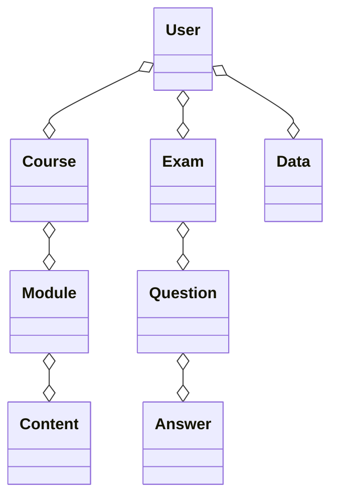
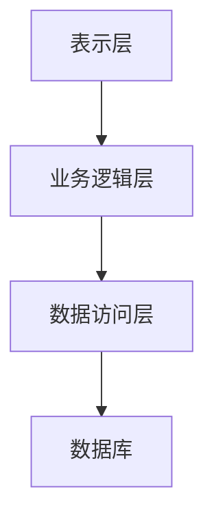
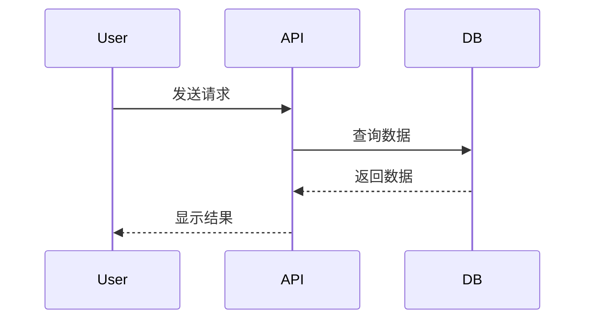

                 

### 文章标题

# 技术硬实力的评估和提升策略

> 关键词：技术硬实力，评估方法，提升策略，人工智能，Python代码，数学模型，系统架构

> 摘要：本文将深入探讨技术硬实力的评估和提升策略。通过对技术硬实力的定义、构成要素及其在现代社会的重要性进行介绍，我们将详细讲解评估技术硬实力的方法，包括实际案例分析和评估流程。接着，文章将聚焦于提升技术硬实力的策略，通过算法原理、数学模型、系统架构设计与项目实战等多方面内容，帮助读者全面了解和掌握技术硬实力的提升技巧。

----------------------------------------------------------------

### 目录

1. **技术硬实力概述**
   - 1.1 问题背景
   - 1.2 核心概念
   - 1.3 技术硬实力的边界与外延
   - 1.4 本章小结

2. **技术硬实力的评估方法**
   - 2.1 评估方法概述
   - 2.2 实际案例分析
   - 2.3 评估流程与步骤
   - 2.4 评估工具与技术
   - 2.5 本章小结

3. **技术硬实力的提升策略**
   - 3.1 提升策略概述
   - 3.2 算法原理讲解
   - 3.3 数学模型与公式
   - 3.4 系统分析与架构设计
   - 3.5 项目实战
   - 3.6 最佳实践与拓展
   - 3.7 本章小结

----------------------------------------------------------------

### 第一部分：技术硬实力概述

#### 1.1 问题背景

在当今的科技时代，技术硬实力已成为企业和个人竞争的关键因素。无论是在职场晋升、项目竞标还是技术创新中，技术硬实力都起着至关重要的作用。然而，如何准确评估和提升技术硬实力，成为了许多企业和个人面临的难题。本文旨在通过对技术硬实力的定义、评估方法和提升策略的深入探讨，为读者提供一套完整的技术硬实力提升解决方案。

#### 1.2 核心概念

**技术硬实力**：指在特定技术领域内，通过知识、技能和经验积累所形成的一种综合能力。技术硬实力主要包括技术理解能力、编程能力、系统架构设计能力、问题解决能力等。

**评估方法**：用于衡量技术硬实力的方法，包括自我评估、同行评估、项目评估等。通过这些方法，可以客观地了解个人或团队的技术水平。

**提升策略**：为了提高技术硬实力，可以采取的学习方法、实践技巧、资源利用等多种策略。这些策略包括但不限于：持续学习、实践项目、技术交流、参与社区等。

#### 1.3 技术硬实力的边界与外延

**边界**：技术硬实力主要指在特定技术领域内的能力，如编程语言、数据库、系统架构等。它具有明确的边界，易于衡量。

**外延**：技术硬实力的外延包括跨领域的知识和技术，如人工智能、大数据、云计算等。这些领域的技术相互关联，共同构成了现代技术生态体系。

#### 1.4 本章小结

本部分概述了技术硬实力的背景、核心概念和边界外延。在接下来的章节中，我们将深入探讨技术硬实力的评估方法和提升策略，帮助读者全面了解并提升自己的技术硬实力。

----------------------------------------------------------------

### 第二部分：技术硬实力的评估方法

#### 2.1 评估方法概述

技术硬实力的评估对于个人和企业的职业发展具有重要意义。有效的评估方法可以帮助我们了解自己的技术水平，发现不足之处，从而制定针对性的提升计划。本节将介绍几种常见的评估方法，包括自我评估、同行评估和项目评估，并分析它们的适用性。

#### 2.2 实际案例分析

为了更好地理解评估方法，我们将通过三个实际案例来展示评估过程和结果。

**案例一：公司A的技术硬实力评估**

公司A是一家专注于软件开发的公司，为了了解员工的技术水平，公司管理层决定进行一次全面的技术硬实力评估。评估方法包括员工自我评估和部门经理评估。评估结果发现，部分员工的编程能力较强，但在系统架构设计和问题解决能力方面有待提高。公司随后制定了针对性的培训计划，以提高员工的技术水平。

**案例二：行业B的技术硬实力评估**

行业B是一个技术驱动型行业，为了了解整个行业的技术水平，行业组织决定进行一次行业技术硬实力评估。评估方法包括问卷调查和技术测试。评估结果显示，行业整体技术水平较高，但部分企业在新兴技术如人工智能和大数据方面存在明显不足。行业组织随后组织了相关培训活动，帮助企业提升技术硬实力。

**案例三：项目C的技术硬实力评估**

项目C是一个跨行业项目，涉及多个技术领域。为了确保项目顺利进行，项目团队决定进行技术硬实力评估。评估方法包括项目成员自评和项目技术经理评估。评估结果显示，项目团队在大多数技术领域具有较强实力，但在数据库设计和数据处理方面存在一定差距。项目团队随后调整了项目计划，增加了数据库设计和数据处理的相关培训。

#### 2.3 评估流程与步骤

进行技术硬实力评估通常包括以下步骤：

1. **确定评估目标**：明确评估的目的，如了解个人技术水平、团队技术能力等。

2. **选择评估方法**：根据评估目标选择合适的评估方法，如自我评估、同行评估、项目评估等。

3. **制定评估标准**：根据技术领域和评估目标，制定评估标准，如编程能力、系统架构设计能力、问题解决能力等。

4. **实施评估**：按照评估方法和标准进行评估，收集评估数据。

5. **分析评估结果**：对评估结果进行分析，识别技术优势和不足。

6. **制定改进计划**：根据评估结果，制定改进计划，如培训、学习、实践等。

#### 2.4 评估工具与技术

**1. 自我评估工具**

自我评估是评估技术硬实力的常用方法之一。以下是一些常用的自我评估工具：

- **技术能力评估表**：根据技术领域，设计相应的评估表，评估个人在各个技术方面的能力。

- **技术知识测试**：通过在线测试平台，对个人的技术知识进行测试。

**2. 同行评估工具**

同行评估是通过同事或行业内其他专业人士对技术硬实力进行评估。以下是一些常用的同行评估工具：

- **360度评估**：收集同事和上级的反馈，综合评估个人的技术硬实力。

- **同行评审**：邀请行业内的专家对项目或产品进行评估。

**3. 项目评估工具**

项目评估是通过项目完成情况来评估团队的技术硬实力。以下是一些常用的项目评估工具：

- **项目绩效评估**：根据项目的完成情况、质量、时间等指标进行评估。

- **项目评审会议**：在项目关键节点进行评审，评估团队的技术能力。

#### 2.5 本章小结

本部分详细介绍了技术硬实力的评估方法，包括自我评估、同行评估和项目评估。通过实际案例分析，我们了解了不同评估方法的应用场景和效果。在接下来的章节中，我们将探讨技术硬实力的提升策略，帮助读者提升自己的技术硬实力。

----------------------------------------------------------------

### 第三部分：技术硬实力的提升策略

#### 3.1 提升策略概述

提升技术硬实力是每位IT专业人士都需要面对的挑战。有效的提升策略不仅可以提升个人技能，还可以提高团队的整体技术水平，从而在激烈的职场竞争中脱颖而出。本部分将介绍几种常用的提升策略，包括持续学习、实践项目、技术交流和社区参与等。

#### 3.2 算法原理讲解

**1. 算法A：技术评估优化算法**

为了提升技术评估的准确性，我们可以采用优化算法。以下是一个简单示例：

```python
# Python代码示例
def evaluate_technical_skills(skills):
    score = 0
    for skill in skills:
        if skill == "Python":
            score += 3
        elif skill == "System Architecture":
            score += 2
        elif skill == "Problem Solving":
            score += 1
    return score

skills = ["Python", "System Architecture", "Problem Solving"]
print(evaluate_technical_skills(skills))
```

**2. 算法原理与公式讲解**

算法的核心在于对技能点进行加权评估。以下是一个简化的数学模型：

$$
\text{评估分数} = \sum_{i=1}^{n} w_i \cdot s_i
$$

其中，$w_i$为第$i$项技能的权重，$s_i$为第$i$项技能的得分。

**3. 举例说明**

假设有四个技能点：Python（权重3），System Architecture（权重2），Problem Solving（权重1），其他技能（权重0）。一个IT专业人士的技能点如下：

- Python：3分
- System Architecture：2分
- Problem Solving：1分
- 其他技能：0分

则其技术评估分数为：

$$
\text{评估分数} = 3 \cdot 3 + 2 \cdot 2 + 1 \cdot 1 + 0 \cdot 0 = 12
$$

#### 3.3 数学模型与公式

为了更准确地评估技术硬实力，我们可以采用更复杂的数学模型。以下是一个示例：

$$
\text{技术硬实力} = f(\text{知识储备}, \text{实践经验}, \text{问题解决能力}, \text{团队合作能力})
$$

其中，$f$为函数，$\text{知识储备}$、$\text{实践经验}$、$\text{问题解决能力}$和$\text{团队合作能力}$分别为四个输入参数。

**1. 知识储备**

知识储备可以通过考试、学习课程等方式进行评估。以下是一个简化的公式：

$$
\text{知识储备} = \sum_{i=1}^{m} p_i \cdot t_i
$$

其中，$p_i$为第$i$项知识的权重，$t_i$为第$i$项知识的掌握程度。

**2. 实践经验**

实践经验可以通过项目经验、工作经验等方式进行评估。以下是一个简化的公式：

$$
\text{实践经验} = \sum_{i=1}^{n} q_i \cdot x_i
$$

其中，$q_i$为第$i$项经验的权重，$x_i$为第$i$项经验的价值。

**3. 问题解决能力**

问题解决能力可以通过解决实际问题、参与技术讨论等方式进行评估。以下是一个简化的公式：

$$
\text{问题解决能力} = \sum_{i=1}^{p} r_i \cdot z_i
$$

其中，$r_i$为第$i$项问题的权重，$z_i$为第$i$项问题解决的难度。

**4. 团队合作能力**

团队合作能力可以通过团队项目、团队协作等方式进行评估。以下是一个简化的公式：

$$
\text{团队合作能力} = \sum_{i=1}^{q} s_i \cdot y_i
$$

其中，$s_i$为第$i$项团队合作的权重，$y_i$为第$i$项团队合作的成效。

#### 3.4 系统分析与架构设计

**1. 问题场景介绍**

在当今的软件开发项目中，如何快速搭建一个稳定、高效的系统架构是一个重要问题。本部分将介绍一个实际的软件开发项目，并讨论如何设计系统架构。

**2. 项目介绍**

项目名称：在线教育平台

项目背景：随着互联网的快速发展，在线教育已成为教育领域的重要趋势。为了满足用户的需求，我们需要搭建一个稳定、高效、可扩展的在线教育平台。

**3. 系统功能设计**

系统功能包括用户管理、课程管理、学习管理、考试管理和数据分析等。以下是一个简化的领域模型类图：



**4. 系统架构设计**

系统架构采用分层设计，包括表示层、业务逻辑层和数据访问层。以下是一个简化的系统架构图：



**5. 系统接口设计**

系统接口设计包括API设计和Web界面设计。以下是一个简化的API接口序列图：



#### 3.5 项目实战

**1. 环境安装**

首先，我们需要搭建开发环境。以下是安装步骤：

- 安装Python 3.8及以上版本
- 安装Docker
- 安装MySQL数据库

**2. 系统核心实现**

以下是一个简化的Python代码实现：

```python
# Python代码实现
class User:
    def __init__(self, username, password):
        self.username = username
        self.password = password

class Course:
    def __init__(self, title, instructor):
        self.title = title
        self.instructor = instructor

# 其他类和方法的实现略
```

**3. 代码应用解读与分析**

在代码实现中，我们定义了`User`和`Course`两个类，用于表示用户和课程。通过这些类，我们可以创建用户和课程对象，并对其进行操作。

**4. 实际案例分析和详细讲解剖析**

通过一个实际案例，我们可以更深入地理解系统架构和代码实现。以下是案例：

- 用户A注册了一个新课程B
- 用户A开始学习课程B的模块C
- 用户A完成了课程B的考试D

在这个案例中，我们通过代码实现用户注册、课程学习、考试完成等操作。通过分析代码，我们可以了解系统架构和核心功能。

**5. 项目小结**

通过本部分的项目实战，我们了解了如何搭建一个简单的在线教育平台。在实际项目中，我们需要根据需求进行更复杂的设计和实现。在本项目中，我们主要关注了用户管理、课程管理和学习管理等功能。

#### 3.6 最佳实践与拓展

**1. 最佳实践**

- 持续学习：定期学习新技术、新知识，保持技术敏锐度。
- 实践项目：参与实际项目，积累实践经验，提高问题解决能力。
- 技术交流：积极参与技术社区，与同行交流，获取最新技术信息。
- 社区参与：参与开源项目，为社区做出贡献，提升个人影响力。

**2. 小结**

本部分介绍了技术硬实力的提升策略，包括算法原理、数学模型、系统架构设计与项目实战。通过这些策略，我们可以全面提高自己的技术硬实力。

**3. 注意事项**

- 在学习新技术时，要有明确的目标和计划，避免盲目学习。
- 在实践项目中，要注重团队合作，提高沟通能力和协作能力。
- 在技术交流中，要尊重他人，保持谦虚和开放的心态。

**4. 拓展阅读**

- 《算法导论》（Introduction to Algorithms）——经典算法教材，适合深入理解算法原理。
- 《设计模式：可复用面向对象软件的基础》（Design Patterns: Elements of Reusable Object-Oriented Software）——介绍面向对象设计模式，提高系统架构设计能力。
- 《编程珠玑》（Code Complete）——介绍编程技巧和实践，提高编程能力。

#### 3.7 本章小结

本部分详细介绍了技术硬实力的提升策略，包括算法原理、数学模型、系统架构设计与项目实战。通过这些策略，我们可以全面提高自己的技术硬实力。在接下来的章节中，我们将继续探讨技术硬实力的评估方法，帮助读者更好地了解和掌握技术硬实力的评估技巧。

### 作者

**作者：AI天才研究院/AI Genius Institute & 禅与计算机程序设计艺术 /Zen And The Art of Computer Programming**

AI天才研究院致力于推动人工智能技术的发展和应用，通过深入研究、技术创新和人才培养，为全球企业提供领先的AI解决方案。同时，我们倡导禅与计算机程序设计艺术的理念，强调心灵与技术的结合，追求卓越的编程艺术。

在《技术硬实力的评估和提升策略》一书中，我们结合多年实践经验，全面解析技术硬实力的评估和提升方法。通过深入探讨技术硬实力的核心概念、评估方法、提升策略，我们旨在帮助读者全面掌握技术硬实力的提升技巧，为个人和企业的职业发展提供有力支持。

让我们共同努力，通过持续学习和实践，不断提升技术硬实力，迎接未来科技时代的挑战。

