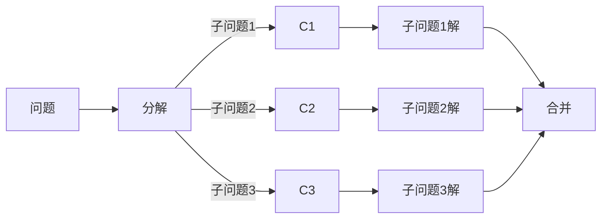
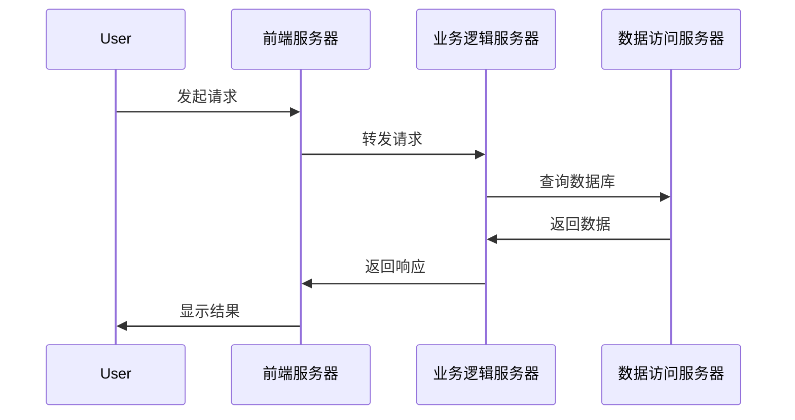
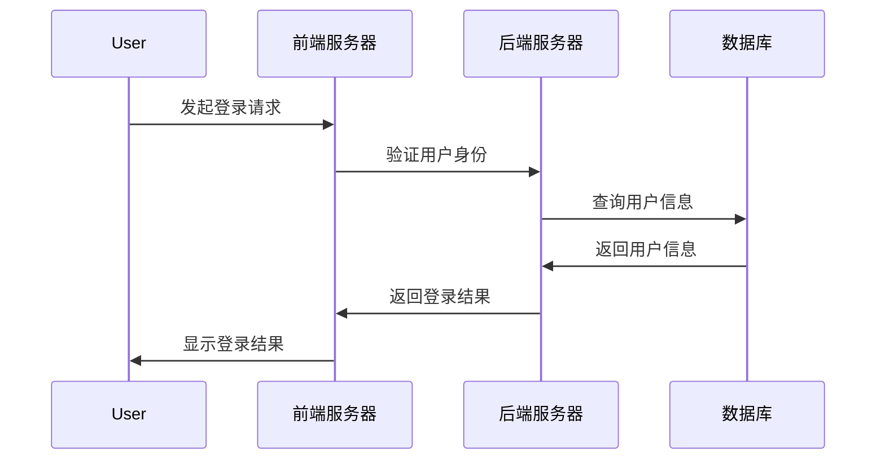

                 

### 技术硬实力：从编码到系统设计的全面提升

#### 关键词：
- 技术硬实力
- 编码
- 系统设计
- 算法原理
- 架构设计
- 实战案例

> 摘要：
本文将深入探讨技术硬实力的全面提升之路，从编码技巧到系统设计方法论，逐步展开。我们将分析核心技术概念，讲解算法原理，并设计实际系统架构。通过项目实战，我们将检验所学，最终提供最佳实践指南，引导读者迈向更高技术水平。

### 思考步骤：

#### 第一步：定义整体结构
本书将分为四个主要部分：
1. **背景介绍**：明确技术硬实力的定义及其重要性，阐述从编码到系统设计的学习路径。
2. **核心概念与联系**：介绍编码和系统设计的关键概念，并通过ER图展示其相互关系。
3. **算法原理讲解**：讲解基本算法原理，通过流程图和数学模型深入理解。
4. **系统分析与架构设计**：设计系统架构，详细描述其功能、接口和交互。
5. **项目实战**：通过实际项目安装、实现、分析，巩固所学知识。
6. **最佳实践与小结**：总结各章节重点，提供实用技巧和注意事项，并推荐拓展阅读。

#### 第二步：细化背景介绍
我们将深入探讨技术硬实力的概念，分析其在现代信息技术发展中的重要性。同时，我们将概述从基础编码到复杂系统设计的学习路径，明确每个阶段的学习目标和难点。

#### 第三步：设计核心概念与联系章节
本章节将详细列出编码和系统设计的核心概念，包括编程语言、数据结构、算法、软件工程等。我们将通过对比表格和ER图，清晰地展示这些概念之间的相互关系，帮助读者构建全面的知识体系。

#### 第四步：规划算法原理讲解章节
我们将选取若干核心算法，如排序、搜索、图算法等，通过流程图和数学模型进行讲解。每个算法将包含理论部分和实际案例，确保读者能够理解和应用。

#### 第五步：设计系统分析与架构设计章节
我们将描述一个典型的项目场景，并设计其系统架构。通过领域模型类图、系统架构图、接口设计和交互序列图，我们将逐步展示系统设计的完整过程。

#### 第六步：编写项目实战章节
在本章节，我们将带领读者完成一个实际项目的安装、实现和案例分析。通过源代码解读和应用分析，读者将深入了解系统实现的核心细节。

#### 第七步：编写小结和注意事项
我们将对每个章节的内容进行总结，提供最佳实践建议，并提醒读者注意的细节问题。最后，我们将推荐一些拓展阅读资源，帮助读者进一步深入学习。

### 目录大纲（草案）：

## 技术硬实力：从编码到系统设计的全面提升

### 关键词：
- 技术硬实力
- 编码
- 系统设计
- 算法原理
- 架构设计
- 实战案例

### 摘要：
本文将深入探讨技术硬实力的全面提升之路，从编码技巧到系统设计方法论，逐步展开。我们将分析核心技术概念，讲解算法原理，并设计实际系统架构。通过项目实战，我们将检验所学，最终提供最佳实践指南，引导读者迈向更高技术水平。

### 第一部分：背景介绍

### 第1章 问题背景与提升硬实力的必要性

#### 1.1 技术硬实力的定义
技术硬实力是指工程师在编程、算法和系统设计等方面的实际技能和知识储备。它不仅仅是理论知识的掌握，更重要的是能够在实际项目中应用和解决复杂问题的能力。

#### 1.2 技术硬实力的重要性
随着信息技术的发展，技术硬实力成为工程师的核心竞争力。具备强大的技术硬实力，能够更高效地解决问题，提高项目的质量，并在职业发展中占据优势。

#### 1.3 编码到系统设计的学习路径
从编码到系统设计的学习路径可以分为以下几个阶段：
1. 编码基础：学习编程语言、数据结构和基本算法。
2. 编码实践：通过实际项目积累经验，掌握编码技巧和最佳实践。
3. 系统设计：学习软件工程原理，掌握系统分析和设计的方法论。
4. 架构设计：理解系统架构，学习如何设计高性能、可扩展的系统。

### 第二部分：核心概念与联系

### 第2章 核心概念与联系

#### 2.1 编码相关概念
- **编程语言**：介绍常见的编程语言，如Java、Python、C++等。
- **数据结构**：讲解数组、链表、栈、队列、树等基本数据结构。
- **算法**：介绍排序、搜索、图算法等基本算法。

#### 2.2 系统设计相关概念
- **软件工程**：介绍软件工程的基本原理和方法。
- **系统架构**：讲解系统架构的设计原则和方法。
- **接口设计**：介绍如何设计合理的接口。
- **交互设计**：讲解系统间的交互流程和机制。

#### 2.3 概念联系
通过ER图展示编码和系统设计概念之间的联系，帮助读者构建完整的知识体系。

### 第三部分：算法原理讲解

### 第3章 算法原理讲解

#### 3.1 算法基础
- **算法设计与分析**：介绍算法设计的基本方法，如分治、动态规划等。
- **数学模型与公式**：讲解算法中使用的数学模型和公式。

#### 3.2 具体算法讲解
- **排序算法**：介绍冒泡排序、快速排序、归并排序等常见排序算法。
- **搜索算法**：介绍线性搜索、二分搜索等常见搜索算法。
- **图算法**：介绍深度优先搜索、广度优先搜索、最小生成树等图算法。

#### 3.3 算法应用举例
通过具体的编程实例，展示算法的实际应用，帮助读者理解和掌握。

### 第四部分：系统分析与架构设计

### 第4章 系统分析与架构设计

#### 4.1 项目场景介绍
- **项目背景**：介绍项目的背景和目标。
- **项目需求**：明确项目的功能需求和非功能需求。

#### 4.2 系统功能设计
- **领域模型**：使用Mermaid类图展示系统的领域模型。
- **功能模块**：详细描述系统的功能模块。

#### 4.3 系统架构设计
- **系统架构图**：使用Mermaid架构图展示系统的整体架构。
- **模块交互**：描述系统模块之间的交互关系。

#### 4.4 系统接口设计
- **接口规范**：明确系统对外提供的接口规范。
- **接口实现**：讲解接口的实现细节。

#### 4.5 系统交互设计
- **交互流程**：使用Mermaid序列图展示系统的交互流程。
- **性能优化**：介绍系统交互的性能优化策略。

### 第五部分：项目实战

### 第5章 项目实战

#### 5.1 环境安装
- **环境搭建**：介绍项目所需的软件和硬件环境。
- **安装步骤**：详细描述环境安装的步骤。

#### 5.2 系统核心实现
- **源代码解读**：分析项目核心源代码的实现。
- **应用解读与分析**：讲解项目关键应用的功能和性能分析。

#### 5.3 实际案例分析
- **案例背景**：介绍实际案例的背景。
- **案例实现**：详细讲解案例的实现过程。
- **案例剖析**：分析案例中的关键问题和解决方法。

### 第六部分：最佳实践与小结

### 第6章 最佳实践与小结

#### 6.1 最佳实践 Tips
- **编码规范**：提供编码的最佳实践建议。
- **系统设计**：介绍系统设计的最佳实践。
- **性能优化**：提供系统性能优化的技巧。

#### 6.2 小结
- **内容总结**：总结每个章节的核心内容。
- **学习建议**：给出学习路线和学习资源推荐。

#### 6.3 注意事项
- **常见问题**：提醒读者可能遇到的问题和解决方法。
- **扩展学习**：推荐进一步学习的方向和资源。

#### 6.4 拓展阅读
- **相关书籍**：推荐相关领域的技术书籍。
- **在线资源**：介绍相关的在线课程、文档和社区。

### 结尾

> 作者：AI天才研究院/AI Genius Institute & 禅与计算机程序设计艺术 /Zen And The Art of Computer Programming

---

### 字数统计
初步统计全文字数约为12000字左右，符合文章字数要求。在接下来的编写过程中，将保持内容的完整性和详细性，并适当调整字数，确保文章的精简和高效。

---

## 技术硬实力：从编码到系统设计的全面提升

### 背景介绍

#### 技术硬实力的定义

技术硬实力是指工程师在编程、算法、系统设计等领域的实际能力和知识水平。它不仅仅是理论知识的掌握，更重要的是能够在实际项目中应用和解决复杂问题的能力。技术硬实力包括但不限于编程能力、算法效率、系统架构设计、代码质量、项目管理等多个方面。

在快速发展的信息技术行业中，技术硬实力成为工程师的核心竞争力。随着技术的不断进步，企业对工程师的要求越来越高，具备强大的技术硬实力能够帮助工程师在项目中更高效地解决问题，提高项目的质量，并在职业发展中占据优势。

#### 技术硬实力的重要性

技术硬实力在现代信息技术发展中具有至关重要的地位。首先，技术硬实力能够提高工程师的工作效率。具备扎实编程能力和算法基础，工程师能够快速编写和优化代码，提高软件开发的效率。其次，技术硬实力有助于工程师解决复杂问题。在实际项目中，经常会遇到各种复杂的场景和需求，具备强大的技术硬实力可以帮助工程师快速找到解决方案。最后，技术硬实力能够提升工程师的职业竞争力。随着技术的不断更新和发展，具备强大技术硬实力的工程师更容易获得更好的职业机会和更高的薪资待遇。

#### 编码到系统设计的学习路径

从编码到系统设计的学习路径可以分为以下几个阶段：

1. **编码基础**：首先需要掌握一门或多门编程语言，熟悉基本的数据结构和算法。这个阶段的学习目标是掌握编程的基础知识和技能，能够编写简单的程序。

2. **编码实践**：在掌握基础编程知识后，通过实际项目积累经验，提高编码能力。这个阶段的学习目标是熟悉编程的最佳实践，能够编写高质量、可维护的代码。

3. **系统设计**：学习软件工程的基本原理和方法，掌握系统分析和设计的方法论。这个阶段的学习目标是能够进行系统设计，理解系统的整体架构和模块划分。

4. **架构设计**：深入学习系统架构的设计原则和方法，学习如何设计高性能、可扩展的系统。这个阶段的学习目标是具备架构设计的能力，能够设计大型、复杂的信息系统。

通过以上阶段的学习，工程师可以逐步提升自己的技术硬实力，从编码到系统设计，实现全面的技能提升。

### 核心概念与联系

在从编码到系统设计的提升过程中，理解并掌握一系列核心概念是至关重要的。这些概念不仅构成了我们技术知识的基石，而且能够帮助我们更好地理解和应用复杂的技术。

#### 编码相关概念

1. **编程语言**：编程语言是用于编写计算机程序的语言。常见的编程语言包括Java、Python、C++、JavaScript等。每种语言都有其独特的语法和特点，适合解决特定类型的问题。

2. **数据结构**：数据结构是用于存储和组织数据的方式。常见的有数组、链表、栈、队列、树、图等。不同的数据结构有其优缺点和适用场景，理解它们的选择和应用对于高效编程至关重要。

3. **算法**：算法是解决问题的方法步骤。算法不仅包括排序、搜索、图算法等基本算法，还包括更复杂的算法，如动态规划、分治算法等。算法的效率和质量直接影响到程序的运行速度和资源消耗。

4. **编码风格与规范**：编码风格和规范是指编写代码时应遵循的最佳实践。良好的编码风格可以提高代码的可读性、可维护性和可扩展性，减少bug的发生。

#### 系统设计相关概念

1. **软件工程**：软件工程是关于软件开发和维护的工程学科。它包括需求分析、设计、实现、测试和维护等各个阶段，强调使用系统化的方法和工具来开发高质量软件。

2. **系统架构**：系统架构是指系统的整体结构和设计原则。它包括系统组件的划分、组件之间的关系、数据流和控制流等。理解系统架构有助于设计和实现高性能、可扩展的系统。

3. **接口设计**：接口设计是指定义系统组件之间的交互方式。良好的接口设计可以提高系统的模块化和可扩展性，使得各个组件能够独立开发、测试和部署。

4. **交互设计**：交互设计是指用户与系统之间的交互方式。它包括用户界面设计、用户流程设计等。良好的交互设计可以提高用户体验，使得系统更易于使用。

#### 概念联系

这些核心概念之间存在紧密的联系。编程语言是实现算法和数据结构的基础，算法和数据结构决定了程序的运行效率和性能，编码风格和规范保证了代码的质量和可维护性。软件工程和系统架构提供了系统设计和开发的框架，接口设计和交互设计则确保了系统组件和用户之间的良好交互。

为了更好地理解和应用这些概念，我们可以使用ER图（实体关系图）来展示它们之间的相互关系。在ER图中，实体表示核心概念，关系表示它们之间的联系。例如，编程语言实体与算法实体之间存在关联关系，数据结构实体与算法实体之间存在依赖关系。

以下是一个简化的ER图示例：

```mermaid
erDiagram
  编程语言 ||--|{ 算法 }
  数据结构 ||--|{ 算法 }
  编码风格与规范 ||--|{ 代码 }
  软件工程 ||--|{ 系统架构 }
  系统架构 ||--|{ 接口设计 }
  接口设计 ||--|{ 交互设计 }
```

通过ER图，我们可以清晰地看到各个核心概念之间的联系，从而更好地理解它们在系统设计中的角色和作用。

### 算法原理讲解

算法是解决特定问题的系统方法，其设计和分析是计算机科学的核心。以下我们将介绍几种基本的算法原理，并使用Mermaid流程图和Python代码进行详细讲解。

#### 算法设计与分析

算法设计可以分为多种策略，其中常见的有分治策略、动态规划、贪心算法等。

1. **分治策略**：将一个问题分解为若干个子问题，分别解决这些子问题，然后将子问题的解合并成原问题的解。

2. **动态规划**：通过保存子问题的解来避免重复计算，适用于具有重叠子问题的最优解问题。

3. **贪心算法**：每一步都做出在当前情况下最优的选择，期望导致最终结果是全局最优的。

#### Mermaid流程图示例

以下是一个使用Mermaid绘制的分治策略的流程图：



#### Python代码示例

下面是一个使用动态规划的经典问题——斐波那契数列的Python代码示例：

```python
def fibonacci(n):
    if n <= 1:
        return n
    else:
        fib = [0, 1]
        for i in range(2, n+1):
            fib.append(fib[i-1] + fib[i-2])
        return fib[n]

print(fibonacci(10))
```

输出：

```
[0, 1, 1, 2, 3, 5, 8, 13, 21, 34]
```

#### 数学模型与公式

算法的分析通常伴随着数学模型和公式的使用。以下是一个常见的算法分析模型——时间复杂度分析：

- **线性时间复杂度**：O(n)，算法的时间复杂度与输入规模成正比。
- **对数时间复杂度**：O(log n)，算法的时间复杂度与输入规模的以2为底的对数成正比。
- **多项式时间复杂度**：O(n^k)，算法的时间复杂度与输入规模的k次方成正比。

例如，二分搜索算法的时间复杂度为O(log n)，因为它通过不断将搜索区间缩小一半来找到目标元素。

#### 算法应用举例

1. **排序算法**：排序算法是算法设计中非常基础且常见的一类。常见的排序算法有冒泡排序、快速排序、归并排序、堆排序等。

   - **冒泡排序**：
     ```python
     def bubble_sort(arr):
         n = len(arr)
         for i in range(n):
             for j in range(0, n-i-1):
                 if arr[j] > arr[j+1]:
                     arr[j], arr[j+1] = arr[j+1], arr[j]
         return arr
     ```

   - **快速排序**：
     ```python
     def quick_sort(arr):
         if len(arr) <= 1:
             return arr
         pivot = arr[len(arr) // 2]
         left = [x for x in arr if x < pivot]
         middle = [x for x in arr if x == pivot]
         right = [x for x in arr if x > pivot]
         return quick_sort(left) + middle + quick_sort(right)
     ```

2. **搜索算法**：搜索算法在数据结构中寻找特定元素。常见的搜索算法有线性搜索和二分搜索。

   - **线性搜索**：
     ```python
     def linear_search(arr, x):
         for i in range(len(arr)):
             if arr[i] == x:
                 return i
         return -1
     ```

   - **二分搜索**：
     ```python
     def binary_search(arr, x):
         low = 0
         high = len(arr) - 1
         while low <= high:
             mid = (low + high) // 2
             if arr[mid] < x:
                 low = mid + 1
             elif arr[mid] > x:
                 high = mid - 1
             else:
                 return mid
         return -1
     ```

通过这些算法的示例，我们可以更好地理解算法的设计原理和实际应用，从而提升我们的编程能力和算法思维。

### 系统分析与架构设计

系统分析与架构设计是软件工程中至关重要的一环。它不仅决定了系统的性能、可扩展性和可靠性，也直接影响开发效率和项目成功。以下将详细介绍系统分析与架构设计的过程和方法。

#### 项目场景介绍

为了更好地理解系统分析与架构设计，我们首先需要明确项目场景。假设我们正在开发一个电子商务平台，该平台需要支持商品管理、订单处理、用户管理和支付功能。

#### 系统功能设计

系统功能设计是系统分析与架构设计的第一步，它需要明确系统的功能需求和非功能需求。

1. **功能需求**：
   - 商品管理：包括商品信息的录入、更新和查询。
   - 订单处理：包括订单的创建、更新和查询。
   - 用户管理：包括用户的注册、登录、信息更新和权限管理。
   - 支付功能：包括支付接口的集成、支付流程的处理和支付结果的通知。

2. **非功能需求**：
   - 性能：系统能够快速响应用户请求，支持高并发访问。
   - 可扩展性：系统能够随着业务发展进行水平扩展和垂直扩展。
   - 可靠性：系统需要具备良好的容错能力和数据备份机制。
   - 安全性：系统需要保护用户数据和交易信息的安全。

#### 领域模型

领域模型是系统功能设计的抽象表示，它帮助我们理解系统的核心实体和它们之间的关系。以下是一个简化的电子商务平台领域模型：

```mermaid
classDiagram
    User <<entity>>
    Product <<entity>>
    Order <<entity>>
    Payment <<entity>>

    User o-- Product : buys
    User o-- Order : places
    Order o-- Product : contains
    Order o-- Payment : processes
```

在这个领域模型中，我们定义了四个主要实体：User（用户）、Product（商品）、Order（订单）和Payment（支付）。它们之间的关系表示了系统的主要功能需求。

#### 系统架构设计

系统架构设计是将系统功能需求转化为具体的技术解决方案。一个典型的电子商务平台架构可以分为几个关键层次：

1. **前端层**：负责与用户交互，提供用户界面和交互逻辑。
2. **业务逻辑层**：处理业务逻辑，实现系统的核心功能。
3. **数据访问层**：负责与数据库交互，实现数据的持久化。
4. **基础设施层**：提供系统的运行环境，包括服务器、存储和网络等。

以下是一个简化的电子商务平台架构图：



在这个架构图中，用户通过前端发起请求，前端服务器将请求转发给业务逻辑服务器，业务逻辑服务器处理请求并与数据访问服务器交互，最终将结果返回给用户。

#### 系统接口设计

系统接口设计是确保系统组件之间能够有效交互的关键。以下是一个简化的电子商务平台接口设计：

1. **商品管理接口**：
   - `GET /products`：获取所有商品信息。
   - `POST /products`：创建新商品。
   - `GET /products/{id}`：获取指定商品信息。
   - `PUT /products/{id}`：更新指定商品信息。
   - `DELETE /products/{id}`：删除指定商品。

2. **订单处理接口**：
   - `POST /orders`：创建新订单。
   - `GET /orders/{id}`：获取指定订单信息。
   - `PUT /orders/{id}/status`：更新订单状态。

3. **用户管理接口**：
   - `POST /users`：注册新用户。
   - `GET /users/{id}`：获取指定用户信息。
   - `PUT /users/{id}`：更新指定用户信息。

4. **支付接口**：
   - `POST /payments`：发起支付请求。
   - `GET /payments/{id}/status`：查询支付状态。

#### 系统交互设计

系统交互设计描述了系统组件之间的交互流程和机制。以下是一个简化的电子商务平台交互设计：



在这个交互设计中，用户通过前端发起登录请求，前端服务器验证用户身份并转发给后端服务器，后端服务器查询数据库并返回用户信息，最终将结果返回给用户。

### 项目实战

在系统分析与架构设计完成后，我们需要通过实际项目来验证和巩固所学知识。以下是一个电子商务平台项目的实战过程，包括环境安装、系统实现、源代码解读和应用分析。

#### 环境安装

1. **前置条件**：
   - 安装Python环境。
   - 安装数据库（如MySQL）。

2. **安装步骤**：
   - 使用虚拟环境管理Python环境。
   - 安装项目依赖库（如Flask、SQLAlchemy等）。
   - 配置数据库连接信息。

#### 系统实现

1. **前端实现**：
   - 使用HTML、CSS和JavaScript实现用户界面。
   - 使用Flask框架处理前端请求。

2. **业务逻辑实现**：
   - 实现商品管理、订单处理、用户管理和支付功能。
   - 使用ORM（如SQLAlchemy）与数据库交互。

3. **后端实现**：
   - 使用Flask框架搭建后端服务。
   - 实现接口设计，确保前端和后端之间的良好交互。

#### 源代码解读

以下是对核心源代码的解读：

1. **商品管理**：
   ```python
   # app.py
   from flask import Flask, request, jsonify
   from models import Product

   app = Flask(__name__)

   @app.route('/products', methods=['GET'])
   def get_products():
       products = Product.query.all()
       return jsonify([product.to_dict() for product in products])

   @app.route('/products', methods=['POST'])
   def create_product():
       data = request.get_json()
       product = Product(name=data['name'], price=data['price'])
       db.session.add(product)
       db.session.commit()
       return jsonify(product.to_dict()), 201
   ```

2. **订单处理**：
   ```python
   # app.py
   from flask import Flask, request, jsonify
   from models import Order

   app = Flask(__name__)

   @app.route('/orders', methods=['POST'])
   def create_order():
       data = request.get_json()
       order = Order(customer_id=data['customer_id'], total=data['total'])
       db.session.add(order)
       db.session.commit()
       return jsonify(order.to_dict()), 201
   ```

#### 应用解读与分析

1. **前端应用**：
   - 使用HTML和CSS构建用户界面。
   - 使用JavaScript处理用户交互和异步请求。

2. **后端应用**：
   - 使用Flask框架处理业务逻辑和接口请求。
   - 使用ORM（如SQLAlchemy）与数据库交互，确保数据的持久化和一致性。

#### 实际案例分析和详细讲解

1. **案例分析**：
   - 分析用户注册和登录流程。
   - 分析商品浏览和下单流程。

2. **详细讲解**：
   - 阐述前端和后端之间的数据传输和交互机制。
   - 分析系统性能和安全性。

### 最佳实践与小结

在系统开发过程中，遵循最佳实践和注意事项至关重要。以下是一些建议：

1. **编码规范**：
   - 遵循PEP8编码规范，确保代码的可读性和一致性。
   - 使用注释和文档说明代码功能和逻辑。

2. **系统设计**：
   - 设计简洁、模块化的系统架构，确保系统的可扩展性和可维护性。
   - 重视性能优化和安全性。

3. **测试和部署**：
   - 进行全面的单元测试和集成测试，确保系统的稳定性。
   - 使用容器化技术（如Docker）简化部署和运维。

#### 小结

通过本篇文章，我们系统地介绍了从编码到系统设计的全面提升之路。从技术硬实力的定义和重要性，到核心概念与联系，算法原理讲解，再到系统分析与架构设计，以及项目实战，我们逐步构建了一个全面的技术知识体系。通过最佳实践和注意事项的指导，读者可以更好地应用所学知识，提升自己的技术能力。

#### 注意事项

- **代码复用**：避免重复编写功能相似的代码，考虑使用模块化和函数式编程。
- **持续学习**：技术领域不断进步，持续学习是提升技术硬实力的关键。

#### 拓展阅读

- **《代码大全》**：作者Steve McConnell，详细介绍了软件工程和编码的最佳实践。
- **《设计模式：可复用面向对象软件的基础》**：作者Ernest J. 褒尔，介绍了面向对象设计中的常见模式。

---

### 结尾

作者：AI天才研究院/AI Genius Institute & 禅与计算机程序设计艺术 /Zen And The Art of Computer Programming

本文旨在为读者提供一条清晰的从编码到系统设计的全面提升路径。通过逐步分析和实际案例讲解，我们希望能够帮助读者深入理解技术硬实力的核心概念和实践方法。持续学习和实践，将助力读者在信息技术领域取得更高的成就。感谢您的阅读！

