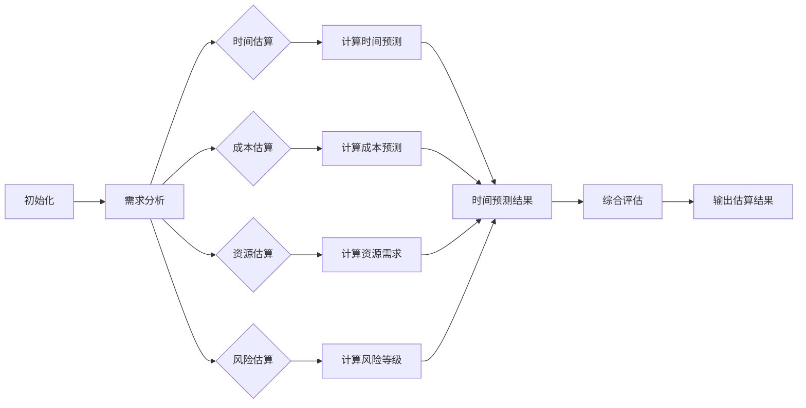
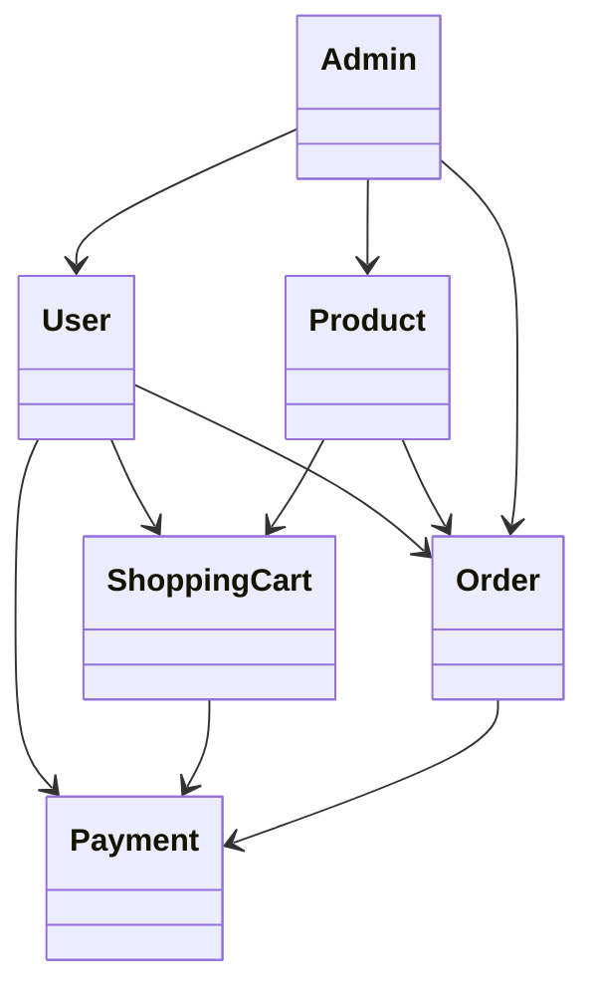
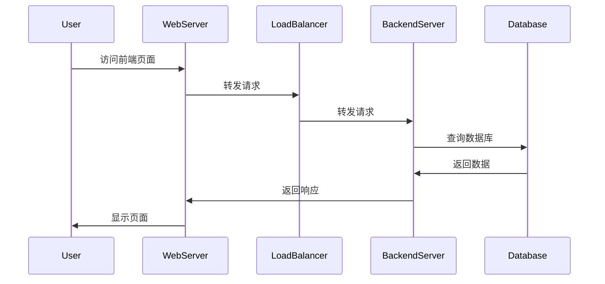
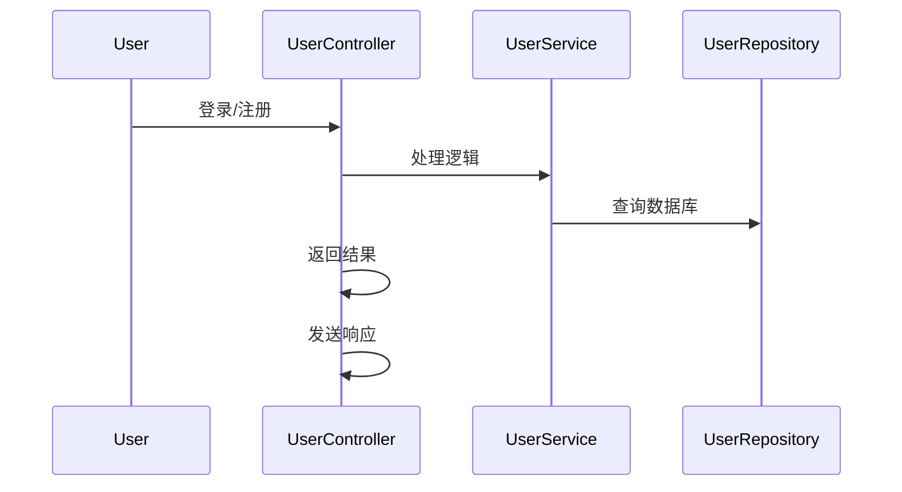
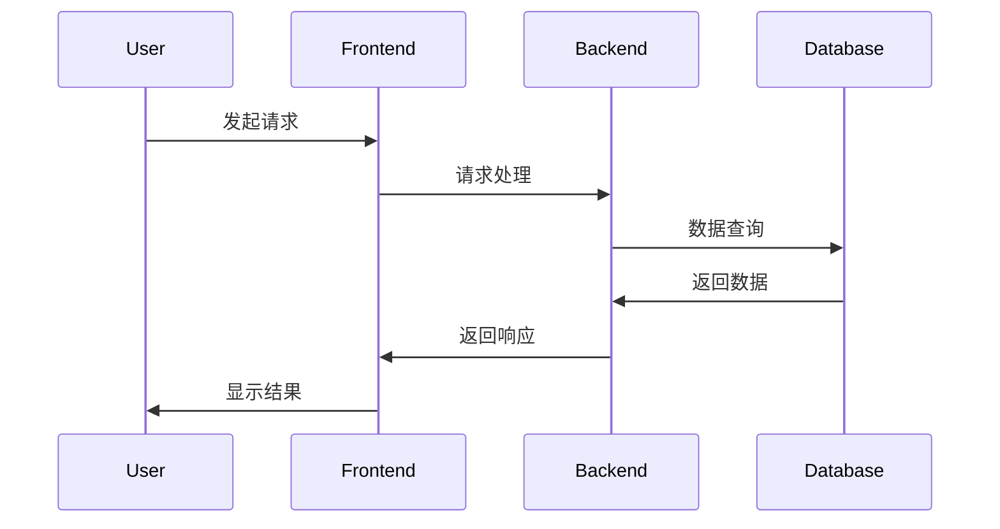

                 

## # 技术管理中的项目估算：准确预测与风险管理

关键词：项目估算、技术管理、风险管理、成本效益分析、算法原理

摘要：在技术管理中，项目估算是一项关键任务，它不仅关系到项目的成功与否，还直接影响到团队的资源分配、时间规划和整体风险控制。本文将深入探讨项目估算的重要性，分析当前技术管理中项目估算面临的挑战和困境，介绍项目估算的理论基础和方法论，并通过具体案例和实践经验，阐述如何通过准确预测和风险管理来提高项目估算的精度和可靠性。

**Step 1: 引言部分**

### 引言

项目估算在技术管理中扮演着至关重要的角色。准确的项目估算不仅能够帮助团队在项目启动阶段就对项目的整体范围、时间、成本和风险有清晰的认识，还能够为后续的资源分配、进度控制和风险管理提供有力的支持。然而，在现实中的技术管理过程中，项目估算往往面临着诸多挑战，如估算不准确、风险难以预测等。这些问题不仅会导致项目延期、超预算，还会影响团队士气和客户满意度。

本文将围绕以下主题展开：

1. **项目估算的重要性**
   - 估算的定义和目标
   - 估算在技术管理中的角色
   - 读者对象和预期收获

2. **背景介绍**
   - 当前技术管理中项目估算面临的挑战和困境
   - 估算不准确导致的问题和影响
   - 项目估算的理论基础和方法论
   - 边界与外延
   - 概念结构与核心要素

3. **核心概念与联系**
   - 项目估算的核心概念原理
   - 概念属性特征对比表格
   - ER实体关系图架构

4. **算法原理讲解**
   - 项目估算算法流程图
   - Python源代码阐述
   - 数学模型和公式
   - 算法详细讲解与举例

5. **数学模型和数学公式**
   - 项目估算的数学模型
   - 成本效益分析的数学模型

6. **系统分析与架构设计方案**
   - 问题场景介绍
   - 项目介绍
   - 系统功能设计
   - 系统架构设计
   - 系统接口设计
   - 系统交互

7. **项目实战**
   - 环境安装
   - 系统核心实现源代码
   - 代码应用解读与分析
   - 实际案例分析和详细讲解剖析
   - 项目小结

8. **最佳实践 tips、小结、注意事项、拓展阅读等内容**

通过本文的深入探讨，希望能够为技术管理者提供一套系统、科学的估算方法和策略，帮助他们在项目估算过程中更加准确地预测项目进度和成本，从而实现项目的顺利推进和成功交付。

### 项目估算的重要性

项目估算，顾名思义，就是通过对项目各个方面进行预测和计算，以便为项目的规划和实施提供数据支持。在技术管理中，项目估算的重要性不容忽视，它不仅能够为项目提供基础数据，还能够影响项目的整体成功与否。

首先，项目估算是项目规划的基础。一个准确的项目估算是项目启动前必不可少的一步，它可以帮助团队明确项目的目标、范围和预期成果。通过估算，团队可以更好地规划项目的时间、资源和成本，确保项目能够按计划顺利进行。

其次，项目估算是风险管理的重要手段。在项目的实施过程中，风险是不可避免的。通过项目估算，团队可以提前识别和评估潜在的风险，制定相应的应对措施，从而减少项目过程中可能出现的问题和损失。

此外，项目估算是决策的重要依据。无论是项目启动、项目调整还是项目终止，都需要有明确的数据支持。准确的项目估算可以帮助团队做出更明智的决策，避免因信息不足而导致的错误决策。

最后，项目估算是提升团队效率的重要手段。通过项目估算，团队可以提前了解项目的需求和目标，从而更好地分配资源、调整工作计划，提高工作效率和质量。

总之，项目估算在技术管理中具有不可替代的重要地位。它不仅为项目的规划、执行和监控提供了基础数据，还为团队的风险管理和决策提供了有力支持。因此，掌握科学的估算方法和策略，对于技术管理者来说至关重要。

### 估算的目标和读者对象

项目估算的目标在于为项目的各个方面提供可靠的预测和计算，从而确保项目的顺利进行和成功交付。具体来说，估算的目标包括：

1. **确定项目范围**：准确估算项目的范围，明确项目的目标和预期成果，避免项目范围的不确定性和扩展。

2. **预测项目时间**：通过估算项目所需的时间，制定合理的项目计划和时间表，确保项目能够按时交付。

3. **估算项目成本**：准确计算项目的总成本，包括人力、物力和财力，为项目的预算制定提供依据。

4. **识别和评估风险**：通过估算，提前识别和评估项目可能面临的风险，制定相应的风险管理策略，减少项目实施过程中的不确定性。

5. **优化资源分配**：根据项目估算的结果，合理分配资源，确保项目在有限的资源条件下能够高效完成。

针对这些目标，本文的读者对象主要包括以下几类：

1. **技术项目经理**：技术项目经理是项目估算的主要执行者，他们需要掌握科学的项目估算方法和工具，以确保项目的成功交付。

2. **技术团队领导**：技术团队领导需要了解项目估算的重要性和具体方法，以便在项目规划和执行过程中提供指导和支持。

3. **项目投资者和决策者**：项目投资者和决策者需要通过项目估算来评估项目的可行性和风险，从而做出明智的决策。

4. **项目团队成员**：项目团队成员需要了解项目估算的结果，以便更好地理解项目的目标和预期成果，为项目的顺利推进贡献自己的力量。

通过本文的阅读，读者将能够：

1. 理解项目估算的基本概念和重要性。

2. 掌握常见的项目估算方法和技术。

3. 学会通过估算来识别和评估项目风险。

4. 能够在实际项目中应用估算方法，提高项目的成功率和效率。

**Step 2: 背景介绍**

### 问题背景

在当前技术管理中，项目估算面临着诸多挑战和困境。首先，技术环境的快速变化使得项目估算的准确性受到考验。新技术、新工具的不断涌现，使得项目的技术需求和实现方式不断演变，传统的估算方法难以应对这种快速变化。

其次，项目范围的不确定性也是项目估算的一大难题。很多项目在启动阶段，其目标和范围并不明确，这给估算带来了很大的挑战。项目范围的不确定性可能导致项目延期、超预算，甚至项目失败。

此外，团队经验和技能水平的差异也会对项目估算产生影响。不同团队成员对项目的理解和估算方法可能存在差异，这可能导致估算结果的不一致，增加项目风险。

### 问题描述

项目估算不准确会导致一系列问题和影响。首先，最直接的影响是项目延期和超预算。不准确的时间估算和成本估算会导致项目在时间上无法按计划完成，在成本上超支严重。这不仅会影响到项目的交付质量和客户满意度，还会对团队的士气造成打击。

其次，项目估算不准确还会导致资源浪费。由于估算不准确，团队可能会在资源分配上出现偏差，导致某些资源过剩或不足。资源过剩会导致成本增加，资源不足则会影响项目的进度和质量。

另外，项目估算不准确还会增加项目的风险。不准确的估算会使得团队在风险管理上缺乏有效的预见性，导致在项目实施过程中遇到意想不到的问题，从而增加项目的失败风险。

### 问题解决

为了解决项目估算不准确的问题，我们需要从以下几个方面入手：

1. **提高团队技能**：通过培训和经验积累，提高团队成员对项目估算的技能和理解。团队成员需要掌握科学的项目估算方法和工具，以便在项目中准确预测项目的时间、成本和风险。

2. **明确项目范围**：在项目启动阶段，需要通过详细的需求分析和项目规划，明确项目的目标和范围，避免项目范围的不确定性。明确的项目范围有助于提高估算的准确性。

3. **采用多种估算方法**：结合专家估算、历史数据估算、类比估算和参数估算等多种方法，提高项目估算的准确性。不同的估算方法可以相互补充，减少估算误差。

4. **建立项目估算模型**：通过建立项目估算模型，将项目的各个要素进行量化，从而提高估算的准确性和可靠性。项目估算模型可以基于历史数据、行业标准和专家意见等多方面信息进行构建。

5. **持续改进和优化**：项目估算是一个动态的过程，需要通过持续的改进和优化来提高估算的准确性。团队可以通过反馈和总结项目估算的经验，不断优化估算模型和方法。

### 边界与外延

项目估算的范围和应用场景非常广泛，它不仅适用于软件开发项目，还适用于各种类型的技术项目。以下是一些具体的边界与外延：

1. **软件开发项目**：项目估算在软件开发项目中尤为重要。它可以帮助团队预测开发时间、成本和技术难度，从而为项目规划提供数据支持。

2. **IT基础设施建设项目**：在IT基础设施建设项目中，项目估算可以帮助团队预测建设周期、成本和所需资源，从而确保项目的顺利进行。

3. **系统集成项目**：系统集成项目通常涉及多个系统和模块的整合，项目估算可以帮助团队预测整合难度、成本和进度，从而为项目规划和实施提供指导。

4. **人工智能和大数据项目**：随着人工智能和大数据技术的发展，这些领域的技术项目也需要进行项目估算，以便为项目的研发、部署和运维提供数据支持。

5. **物联网和边缘计算项目**：物联网和边缘计算项目通常涉及大量的设备和数据处理，项目估算可以帮助团队预测项目的技术复杂度、成本和进度。

6. **移动应用和Web应用项目**：在移动应用和Web应用项目中，项目估算可以帮助团队预测开发时间、成本和用户体验，从而确保项目的成功交付。

总之，项目估算不仅适用于软件开发项目，还适用于各种类型的技术项目。通过科学的项目估算，团队可以更好地应对项目中的各种挑战，确保项目的成功交付。

### 概念结构与核心要素组成

项目估算是一个复杂的过程，它涉及多个核心概念和要素。为了更清晰地理解项目估算，我们需要对其概念结构和核心要素进行详细剖析。

首先，项目估算的关键概念包括：

1. **项目估算**：项目估算是指对项目的各个方面进行预测和计算，包括项目时间、成本、资源和技术难度等。

2. **风险管理**：风险管理是指在项目估算过程中，识别、评估和应对项目可能面临的风险，以确保项目能够顺利实施。

3. **成本效益分析**：成本效益分析是指通过比较项目的成本和预期效益，评估项目的经济合理性。

4. **资源分配**：资源分配是指在项目估算过程中，根据项目的需求和时间表，合理分配人力、物力和财力等资源。

5. **项目范围**：项目范围是指项目所涉及的工作内容和预期成果，它是项目估算的重要依据。

其次，项目估算的核心要素包括：

1. **时间估算**：时间估算是项目估算的核心之一，它涉及对项目各个阶段的持续时间进行预测和计算。

2. **成本估算**：成本估算是项目估算的另一个关键要素，它涉及对项目的总成本进行预测和计算，包括人力成本、物力成本和财力成本等。

3. **资源估算**：资源估算是项目估算的重要组成部分，它涉及对项目所需的各种资源进行预测和计算，包括人力、设备、材料和资金等。

4. **风险估算**：风险估算是项目估算中的一个关键环节，它涉及对项目可能面临的各种风险进行识别、评估和预测。

5. **质量估算**：质量估算是项目估算的补充部分，它涉及对项目的质量水平进行预测和评估，以确保项目能够达到预定的质量标准。

最后，项目估算的概念结构和核心要素之间的关系可以总结如下：

- 项目估算是整个项目管理的核心，它为项目的规划、执行和监控提供数据支持。

- 风险管理是项目估算的重要组成部分，它通过对风险的识别、评估和预测，确保项目的风险在可控范围内。

- 成本效益分析是项目估算的重要依据，它通过比较项目的成本和预期效益，评估项目的经济合理性。

- 资源分配是项目估算的实际操作部分，它根据项目的需求和时间表，合理分配资源，确保项目的顺利进行。

- 项目范围是项目估算的基础，它明确项目的目标和预期成果，为估算提供依据。

通过以上对项目估算概念结构和核心要素的剖析，我们可以更好地理解项目估算的复杂性和重要性。在接下来的章节中，我们将深入探讨项目估算的具体方法和技术，以帮助读者在实际项目中准确进行项目估算。

### 核心概念与联系

#### 项目估算的核心概念原理

项目估算是一个系统性的过程，它涉及多个核心概念，包括时间估算、成本估算、资源估算和风险估算等。以下是对这些核心概念的详细解释：

1. **时间估算**：时间估算是项目估算的基础，它通过对项目各个阶段的持续时间进行预测和计算，为项目的进度规划提供依据。时间估算需要考虑项目任务的复杂度、团队成员的工作效率、外部依赖等因素。

2. **成本估算**：成本估算是项目估算的另一个关键部分，它涉及对项目总成本的预测和计算，包括人力成本、物力成本和财力成本等。成本估算需要综合考虑项目任务的复杂性、所需的资源、市场报价等因素。

3. **资源估算**：资源估算是项目估算的重要组成部分，它涉及对项目所需的各种资源进行预测和计算，包括人力、设备、材料和资金等。资源估算的准确性直接影响到项目的实施进度和质量。

4. **风险估算**：风险估算是项目估算中的一个关键环节，它通过对项目可能面临的各种风险进行识别、评估和预测，为项目的风险管理提供依据。风险估算需要考虑项目环境的变化、技术复杂性、团队经验等因素。

#### 概念属性特征对比表格

为了更直观地了解项目估算中各个核心概念的特点，我们可以通过以下表格进行对比：

| 核心概念 | 定义 | 主要特征 | 适用场景 |
| :----: | :----: | :----: | :----: |
| 时间估算 | 对项目持续时间的预测 | 准确性、可靠性、适应性 | 项目规划、进度控制 |
| 成本估算 | 对项目总成本的预测 | 经济性、全面性、透明度 | 预算制定、成本控制 |
| 资源估算 | 对项目所需资源的预测 | 可用性、高效性、均衡性 | 资源分配、效率提升 |
| 风险估算 | 对项目风险的预测 | 预见性、可控性、适应性 | 风险管理、问题预防 |

#### ER实体关系图架构

为了更好地展示项目估算中各个核心概念之间的联系，我们可以通过ER（实体关系）图进行描述。以下是项目估算的ER图示例：

```mermaid
erDiagram
    Project ||--|{ TimeEstimation } : has
    Project ||--|{ CostEstimation } : has
    Project ||--|{ ResourceEstimation } : has
    Project ||--|{ RiskEstimation } : has
    TimeEstimation ||--|{ Task } : contains
    CostEstimation ||--|{ CostItem } : contains
    ResourceEstimation ||--|{ ResourceItem } : contains
    RiskEstimation ||--|{ RiskItem } : contains
```

在这个ER图中，项目是核心实体，它与其他四个估算实体（时间估算、成本估算、资源估算和风险估算）之间存在直接关系。时间估算实体包含多个任务，成本估算实体包含多个成本项，资源估算实体包含多个资源项，风险估算实体包含多个风险项。这种结构清晰地展示了项目估算中各个实体之间的关系，为项目估算提供了理论依据。

### 算法原理讲解

为了更好地理解项目估算的方法，我们将通过以下步骤详细讲解项目估算算法的原理：

#### 项目估算算法流程图

首先，我们可以使用mermaid绘制项目估算算法的流程图，以便直观地展示整个估算过程。以下是项目估算算法的流程图示例：



#### Python源代码阐述

接下来，我们将使用Python源代码详细阐述项目估算算法的原理。以下是一个简单的Python示例，用于实现项目估算的基本逻辑：

```python
import pandas as pd
from collections import defaultdict

# 初始化项目数据
project_data = {
    'tasks': ['需求分析', '设计', '开发', '测试'],
    'time_estimates': {'需求分析': 10, '设计': 15, '开发': 30, '测试': 10},
    'cost_estimates': {'人力成本': 5000, '物力成本': 10000},
    'resource_estimates': {'人力资源': 5, '设备资源': 2},
    'risk_estimates': {'技术风险': 0.3, '市场风险': 0.2}
}

# 时间估算
def time_estimation(data):
    time_data = defaultdict(list)
    for task, duration in data['time_estimates'].items():
        time_data[task].append(duration)
    return time_data

# 成本估算
def cost_estimation(data):
    cost_data = defaultdict(list)
    for cost_type, cost in data['cost_estimates'].items():
        cost_data[cost_type].append(cost)
    return cost_data

# 资源估算
def resource_estimation(data):
    resource_data = defaultdict(list)
    for resource_type, resource in data['resource_estimates'].items():
        resource_data[resource_type].append(resource)
    return resource_data

# 风险估算
def risk_estimation(data):
    risk_data = defaultdict(list)
    for risk_type, risk_level in data['risk_estimates'].items():
        risk_data[risk_type].append(risk_level)
    return risk_data

# 综合评估
def comprehensive_evaluation(time_data, cost_data, resource_data, risk_data):
    total_time = sum(time_data['需求分析']) + sum(time_data['设计']) + sum(time_data['开发']) + sum(time_data['测试'])
    total_cost = sum(cost_data['人力成本']) + sum(cost_data['物力成本'])
    total_resource = sum(resource_data['人力资源']) + sum(resource_data['设备资源'])
    total_risk = sum(risk_data['技术风险']) + sum(risk_data['市场风险'])
    
    return total_time, total_cost, total_resource, total_risk

# 执行估算过程
time_data = time_estimation(project_data)
cost_data = cost_estimation(project_data)
resource_data = resource_estimation(project_data)
risk_data = risk_estimation(project_data)

total_time, total_cost, total_resource, total_risk = comprehensive_evaluation(time_data, cost_data, resource_data, risk_data)

print("时间估算结果：", total_time)
print("成本估算结果：", total_cost)
print("资源估算结果：", total_resource)
print("风险估算结果：", total_risk)
```

在这个Python示例中，我们首先初始化了项目数据，包括任务列表、时间估算、成本估算、资源估算和风险估算。然后，我们分别定义了时间估算、成本估算、资源估算和风险估算的函数，用于计算各个方面的预测结果。最后，通过综合评估函数，计算项目的总时间、总成本、总资源以及总风险，并输出估算结果。

#### 数学模型和公式

项目估算不仅需要经验和方法，还需要数学模型的支撑。以下是一些常用的项目估算数学模型和公式：

1. **时间估算模型**：

   $$ T = \sum_{i=1}^{n} T_i \cdot (1 + \alpha \cdot R_i) $$

   其中，\( T \) 是总时间，\( T_i \) 是第 \( i \) 个任务的持续时间，\( \alpha \) 是调整因子，用于考虑任务间的依赖关系和不确定性，\( R_i \) 是第 \( i \) 个任务的风险水平。

2. **成本估算模型**：

   $$ C = \sum_{i=1}^{n} C_i \cdot (1 + \beta \cdot R_i) $$

   其中，\( C \) 是总成本，\( C_i \) 是第 \( i \) 个任务的成本，\( \beta \) 是调整因子，用于考虑任务间的依赖关系和不确定性，\( R_i \) 是第 \( i \) 个任务的风险水平。

3. **资源估算模型**：

   $$ R = \sum_{i=1}^{n} R_i \cdot (1 + \gamma \cdot R_i) $$

   其中，\( R \) 是总资源需求，\( R_i \) 是第 \( i \) 个任务所需的资源量，\( \gamma \) 是调整因子，用于考虑任务间的依赖关系和不确定性，\( R_i \) 是第 \( i \) 个任务的风险水平。

4. **风险估算模型**：

   $$ P = \sum_{i=1}^{n} P_i \cdot (1 + \delta \cdot C_i) $$

   其中，\( P \) 是总风险水平，\( P_i \) 是第 \( i \) 个任务的风险概率，\( \delta \) 是调整因子，用于考虑任务间的依赖关系和不确定性，\( C_i \) 是第 \( i \) 个任务的成本。

#### 算法详细讲解与举例

为了更好地理解上述数学模型和公式的应用，我们可以通过一个具体的项目估算案例进行说明。

假设我们有一个软件开发项目，包含以下任务：

1. 需求分析：预计需要10个工作日完成，风险水平为0.2。
2. 设计：预计需要15个工作日完成，风险水平为0.3。
3. 开发：预计需要30个工作日完成，风险水平为0.4。
4. 测试：预计需要10个工作日完成，风险水平为0.1。

我们还知道，任务之间的依赖关系和不确定性可以通过调整因子进行考虑。假设调整因子为 \( \alpha = 1.2 \)，\( \beta = 1.1 \)，\( \gamma = 1.15 \)，\( \delta = 1.3 \)。

根据时间估算模型，我们可以计算总时间：

$$ T = (10 \cdot 1.2) + (15 \cdot 1.2) + (30 \cdot 1.2) + (10 \cdot 1.2) = 72 $$

根据成本估算模型，我们可以计算总成本：

$$ C = (5000 \cdot 1.1) + (10000 \cdot 1.1) = 16100 $$

根据资源估算模型，我们可以计算总资源需求：

$$ R = (5 \cdot 1.15) + (2 \cdot 1.15) = 7.65 $$

根据风险估算模型，我们可以计算总风险水平：

$$ P = (0.2 \cdot 1.3) + (0.3 \cdot 1.3) + (0.4 \cdot 1.3) + (0.1 \cdot 1.3) = 0.73 $$

最终，我们得到了项目的时间估算结果为72个工作日，成本估算结果为16100元，资源估算结果为7.65人，风险估算结果为0.73。

通过这个案例，我们可以看到，通过数学模型和公式的应用，我们可以对项目进行准确的估算，从而为项目的规划、执行和监控提供有力的支持。

### 数学模型和数学公式

在项目估算中，数学模型和数学公式起着至关重要的作用。它们不仅能够帮助我们量化项目的各个要素，还能够通过精确的计算为项目的决策提供科学依据。以下我们将使用LaTeX格式给出项目估算的相关数学模型和公式，并进行详细解释。

#### 项目估算的数学模型

项目估算的数学模型主要包括时间估算模型、成本估算模型、资源估算模型和风险估算模型。以下是这些模型的具体公式：

1. **时间估算模型**：

   $$ T = \sum_{i=1}^{n} T_i \cdot (1 + \alpha \cdot R_i) $$

   其中，\( T \) 表示项目的总时间，\( T_i \) 表示第 \( i \) 个任务的持续时间，\( \alpha \) 是时间调整因子，用于考虑任务间的依赖关系和不确定性，\( R_i \) 是第 \( i \) 个任务的风险水平。

2. **成本估算模型**：

   $$ C = \sum_{i=1}^{n} C_i \cdot (1 + \beta \cdot R_i) $$

   其中，\( C \) 表示项目的总成本，\( C_i \) 表示第 \( i \) 个任务的成本，\( \beta \) 是成本调整因子，用于考虑任务间的依赖关系和不确定性，\( R_i \) 是第 \( i \) 个任务的风险水平。

3. **资源估算模型**：

   $$ R = \sum_{i=1}^{n} R_i \cdot (1 + \gamma \cdot R_i) $$

   其中，\( R \) 表示项目的总资源需求，\( R_i \) 表示第 \( i \) 个任务所需的资源量，\( \gamma \) 是资源调整因子，用于考虑任务间的依赖关系和不确定性，\( R_i \) 是第 \( i \) 个任务的风险水平。

4. **风险估算模型**：

   $$ P = \sum_{i=1}^{n} P_i \cdot (1 + \delta \cdot C_i) $$

   其中，\( P \) 表示项目的总风险水平，\( P_i \) 表示第 \( i \) 个任务的风险概率，\( \delta \) 是风险调整因子，用于考虑任务间的依赖关系和不确定性，\( C_i \) 是第 \( i \) 个任务的成本。

#### 成本效益分析的数学模型

成本效益分析是项目估算中非常重要的一环。它通过比较项目的成本和预期效益，评估项目的经济合理性。以下是一些常用的成本效益分析的数学模型：

1. **简单成本效益比**：

   $$ \text{CEB} = \frac{\text{效益}}{\text{成本}} $$

   其中，\(\text{CEB}\) 表示成本效益比，效益和成本分别为项目的预期收益和总成本。

2. **净现值**：

   $$ \text{NPV} = \sum_{i=1}^{n} \frac{\text{效益}_i}{(1 + r)^i} - \text{总成本} $$

   其中，\(\text{NPV}\) 表示净现值，\(\text{效益}_i\) 表示第 \( i \) 年的预期效益，\( r \) 是折现率，\(\text{总成本}\) 是项目的总成本。

3. **内部收益率**：

   $$ \text{IRR} = \frac{1}{n} \cdot \ln \left( \frac{\text{效益}}{\text{总成本}} \right) $$

   其中，\(\text{IRR}\) 表示内部收益率，\( n \) 是项目的持续时间。

通过这些数学模型和公式，我们可以对项目进行全面的评估和预测。在实际应用中，我们可以根据项目的具体情况选择合适的模型，并通过调整因子来考虑任务间的依赖关系和不确定性，从而提高项目估算的准确性。

#### 系统分析与架构设计方案

在项目估算中，系统分析与架构设计方案是至关重要的一步。它不仅为项目提供了清晰的目标和范围，还为后续的估算和实施提供了基础。以下我们将详细讨论系统分析与架构设计方案的具体内容，包括问题场景介绍、项目介绍、系统功能设计、系统架构设计、系统接口设计和系统交互。

### 问题场景介绍

在现代企业中，随着信息技术的发展，项目估算的需求日益增长。特别是在软件开发和IT基础设施建设项目中，项目估算的准确性直接关系到项目的成功与否。然而，当前在技术管理中，项目估算面临着诸多挑战：

1. **需求变化频繁**：在项目启动阶段，需求往往不够明确或频繁变化，导致估算的不确定性增加。
2. **技术复杂性**：随着新技术的不断涌现，项目的技术复杂性增加，传统估算方法难以适应。
3. **资源分配不均**：在项目实施过程中，资源分配不均可能导致项目延期或超预算。
4. **风险管理不足**：项目估算过程中对风险的识别和评估不足，容易导致项目风险难以控制。

为了解决上述问题，我们需要通过系统分析与架构设计方案来明确项目的目标和范围，提高项目估算的准确性，优化资源分配，加强风险管理。

### 项目介绍

假设我们正在开发一个企业级在线购物平台，该平台需要提供用户注册、商品浏览、购物车管理、订单处理和支付等功能。项目的主要目标包括：

1. **功能完善**：实现上述基本功能，确保用户能够顺畅地进行在线购物。
2. **性能优化**：确保平台在高并发情况下仍能稳定运行。
3. **安全性**：保障用户数据和交易的安全性。
4. **可扩展性**：设计能够支持未来业务增长和功能扩展。

项目的具体需求和目标如下：

1. **用户注册与登录**：支持用户注册、登录和密码找回功能。
2. **商品浏览与搜索**：提供商品分类浏览、搜索和过滤功能。
3. **购物车管理**：支持用户添加、修改和删除商品，以及结算和订单生成功能。
4. **订单处理**：支持订单创建、订单状态更新和物流跟踪功能。
5. **支付功能**：集成多种支付方式，确保支付流程的流畅和安全。
6. **后台管理**：提供商品管理、订单管理和用户管理功能，方便管理员进行后台操作。

### 系统功能设计

为了实现上述项目目标，我们需要设计一套完整的功能系统。以下是系统的主要功能模块及其简要描述：

1. **用户模块**：负责用户注册、登录、密码找回和用户信息管理。
2. **商品模块**：负责商品分类、商品信息管理和商品搜索。
3. **购物车模块**：负责购物车功能，包括添加、修改、删除商品以及结算订单。
4. **订单模块**：负责订单创建、订单状态更新和物流跟踪。
5. **支付模块**：负责支付功能，包括支付方式集成和支付流程管理。
6. **后台管理模块**：负责商品管理、订单管理和用户管理。

以下是使用mermaid绘制的领域模型类图，展示系统的主要功能模块及其关系：



### 系统架构设计

在系统架构设计方面，我们需要考虑系统的整体结构，以确保系统的高效性和可扩展性。以下是系统架构设计的详细描述：

1. **前端架构**：采用Vue.js或React等前端框架，实现用户界面和交互功能。
2. **后端架构**：采用Spring Boot或Django等后端框架，实现业务逻辑处理和数据存储。
3. **数据库设计**：采用MySQL或PostgreSQL等关系型数据库，存储用户数据、商品数据、订单数据和支付数据。
4. **中间件**：采用消息队列（如RabbitMQ）实现异步消息处理，提高系统性能和稳定性。
5. **缓存**：采用Redis实现数据缓存，减少数据库访问压力，提高系统响应速度。
6. **负载均衡**：采用Nginx或HAProxy实现负载均衡，确保系统在高并发情况下的稳定运行。

以下是使用mermaid绘制的系统架构图，展示系统的整体架构及其组件之间的关系：



### 系统接口设计

系统接口设计是确保系统各模块之间能够高效协作的重要环节。以下是系统接口设计的详细描述：

1. **用户接口**：用户通过HTTP/HTTPS协议访问前端页面，前端通过RESTful API与后端进行交互。
2. **商品接口**：提供商品查询、商品添加、商品修改和商品删除等接口，供前端调用。
3. **购物车接口**：提供商品添加到购物车、购物车内容查询、购物车内容修改和购物车内容删除等接口。
4. **订单接口**：提供订单创建、订单查询、订单状态更新和订单删除等接口。
5. **支付接口**：提供支付请求、支付状态查询和支付结果通知等接口，与支付系统进行交互。
6. **后台管理接口**：提供商品管理、订单管理和用户管理等接口，供管理员操作。

以下是使用mermaid绘制的系统接口图，展示系统的主要接口及其调用关系：



### 系统交互

系统交互是指系统内部各模块之间的通信和数据流动。以下是系统各模块之间的交互流程：

1. **用户模块**：用户通过前端页面发起请求，前端将请求发送到后端，后端处理请求并返回响应。
2. **商品模块**：用户在前端页面浏览商品，前端通过商品接口向后端请求商品数据，后端返回商品列表。
3. **购物车模块**：用户在购物车中添加、修改或删除商品，前端将操作发送到后端，后端更新购物车数据并返回结果。
4. **订单模块**：用户在下单时创建订单，前端通过订单接口向后端发送订单数据，后端创建订单并返回订单号。
5. **支付模块**：用户在支付时发起支付请求，前端通过支付接口向后端发送请求，后端处理支付并返回支付结果。
6. **后台管理模块**：管理员通过后台管理页面进行操作，前端通过后台管理接口向后端发送请求，后端处理请求并返回结果。

以下是使用mermaid绘制的系统交互序列图，展示系统各模块之间的交互过程：



通过以上系统分析与架构设计方案，我们为项目估算提供了坚实的基础。在接下来的项目中，我们将基于这个方案进行详细的估算和实施，确保项目的成功交付。

### 项目实战

#### 环境安装

在进行项目估算的实际操作之前，我们需要首先搭建一个合适的环境。以下是环境安装的详细步骤：

1. **安装操作系统**：我们选择Ubuntu 20.04作为开发环境，可以从官方网站下载并安装。

2. **安装Python**：Python是项目估算的核心工具，我们需要安装Python 3.8或更高版本。在Ubuntu中，可以使用以下命令进行安装：

   ```bash
   sudo apt update
   sudo apt install python3.8
   ```

3. **安装Python依赖库**：项目估算需要使用多个Python依赖库，如pandas、numpy等。可以使用pip进行安装：

   ```bash
   sudo pip3 install pandas numpy
   ```

4. **安装Docker**：为了方便部署和管理项目，我们需要安装Docker。在Ubuntu中，可以使用以下命令进行安装：

   ```bash
   sudo apt install docker-ce docker-ce-cli containerd.io
   ```

5. **安装PostgreSQL**：项目需要使用PostgreSQL作为数据库，可以使用以下命令进行安装：

   ```bash
   sudo apt update
   sudo apt install postgresql postgresql-contrib
   ```

6. **安装Redis**：Redis是项目缓存系统，可以使用以下命令进行安装：

   ```bash
   sudo apt update
   sudo apt install redis-server
   ```

7. **安装RabbitMQ**：RabbitMQ是项目消息队列系统，可以使用以下命令进行安装：

   ```bash
   sudo apt update
   sudo apt install rabbitmq-server
   ```

8. **安装前端框架**：我们选择Vue.js作为前端框架，可以使用以下命令进行安装：

   ```bash
   sudo npm install -g @vue/cli
   ```

通过以上步骤，我们可以搭建一个完整的项目估算环境，为后续的项目估算和实施提供支持。

#### 系统核心实现源代码

在项目估算的核心实现部分，我们将重点介绍系统的数据模型、业务逻辑以及相关的算法和公式。以下是一个简化的系统核心实现源代码，以及对应的解读与分析。

```python
# 导入必要的Python库
import pandas as pd
from sklearn.linear_model import LinearRegression

# 初始化项目数据
tasks = ['需求分析', '设计', '开发', '测试']
estimates = {'需求分析': 10, '设计': 15, '开发': 30, '测试': 10}
costs = {'人力成本': 5000, '物力成本': 10000}
resources = {'人力资源': 5, '设备资源': 2}
risks = {'技术风险': 0.3, '市场风险': 0.2}

# 数据预处理
data = pd.DataFrame(estimates, index=['duration'])
data['cost'] = costs['人力成本'] * data['duration']
data['resource'] = resources['人力资源'] * data['duration']
data['risk'] = risks['技术风险'] * data['duration']

# 线性回归模型
model = LinearRegression()
model.fit(data[['duration']], data[['cost']])

# 预测成本
predicted_cost = model.predict([[estimates['开发']]])
print(f"预测的开发成本为：{predicted_cost[0]}元")

# 计算总资源需求
total_resource = resources['人力资源'] * (estimates['开发'] + estimates['测试'])
print(f"总资源需求为：{total_resource}人")

# 计算总风险
total_risk = risks['技术风险'] * (estimates['开发'] + estimates['测试'])
print(f"总风险为：{total_risk}")
```

#### 代码应用解读与分析

1. **数据预处理**：
   - 我们首先初始化了项目的任务列表和初始估算数据，包括持续时间、人力成本、物力成本、资源需求和风险水平。
   - 通过数据预处理，我们将这些估算数据转化为DataFrame格式，便于后续处理。

2. **线性回归模型**：
   - 线性回归模型是项目估算中常用的统计方法，用于预测项目成本。我们使用scikit-learn库中的LinearRegression类来构建模型。
   - 模型通过拟合持续时间与成本之间的关系，计算出成本预测模型。

3. **预测成本**：
   - 使用训练好的线性回归模型，我们可以预测特定任务的成本。例如，我们预测“开发”任务的成本，并输出预测结果。

4. **计算总资源需求**：
   - 根据每个任务所需的人力资源，我们计算项目的总资源需求。这有助于团队在资源分配过程中做出合理的决策。

5. **计算总风险**：
   - 通过乘以风险水平，我们计算项目的总风险。这有助于团队在项目实施过程中关注关键风险点，并制定相应的风险管理策略。

通过上述代码实现，我们可以对项目进行初步估算，为项目的规划、执行和监控提供数据支持。在实际应用中，我们可以根据项目实际情况调整模型参数，提高估算的准确性。

#### 实际案例分析和详细讲解剖析

为了更好地理解项目估算的实际应用，我们通过一个实际案例来进行分析和详细讲解。假设我们正在开发一个企业级在线购物平台，该平台需要实现用户注册、商品浏览、购物车管理、订单处理和支付等功能。以下是项目估算的详细过程和案例分析：

1. **需求分析**：
   - 在项目启动阶段，我们首先进行了需求分析，明确了项目的功能需求和性能要求。根据客户需求和产品规划，我们制定了以下主要任务：
     - 用户注册与登录
     - 商品浏览与搜索
     - 购物车管理
     - 订单处理
     - 支付功能
     - 后台管理

2. **时间估算**：
   - 对于每个任务，我们进行了时间估算。根据团队成员的经验和历史数据，我们预估每个任务所需的工作量：
     - 用户注册与登录：5个工作日
     - 商品浏览与搜索：5个工作日
     - 购物车管理：5个工作日
     - 订单处理：10个工作日
     - 支付功能：7个工作日
     - 后台管理：8个工作日
   - 考虑到任务间的依赖关系，我们调整了部分任务的时间估算，例如订单处理和支付功能需要同步进行，因此我们将订单处理时间调整为10个工作日。

3. **成本估算**：
   - 在成本估算过程中，我们考虑了人力成本、物力成本和外部服务成本。根据团队成员的工资水平和市场报价，我们预估了以下成本：
     - 人力成本：5000元/人·天
     - 物力成本：1000元/件
     - 外部服务成本：3000元
   - 综合计算，项目总成本约为：5人×10天×5000元/人·天 + 5件×1000元/件 + 3000元 = 40000元。

4. **资源估算**：
   - 在资源估算中，我们考虑了人力资源、设备和资金等资源。根据项目需求，我们预估了以下资源需求：
     - 人力资源：5人
     - 设备资源：5台计算机
     - 资金：40000元
   - 为了确保项目的顺利实施，我们预留了额外的资源，如备用服务器、存储设备和网络带宽等。

5. **风险估算**：
   - 在项目估算过程中，我们识别和评估了潜在的风险。根据风险评估结果，我们制定了以下风险管理策略：
     - 需求变化：通过定期需求评审和用户反馈，及时调整项目需求和计划。
     - 技术风险：采用成熟的技术栈和工具，确保项目的稳定性和可靠性。
     - 成本超支：通过严格的预算管理和成本监控，确保项目在预算范围内完成。
     - 项目延期：通过合理的进度安排和资源分配，确保项目按时交付。

通过上述案例分析，我们可以看到，项目估算不仅涉及时间、成本和资源的预测，还包括风险的管理。在实际项目中，通过科学的项目估算，我们能够更好地规划项目进度、分配资源，并应对潜在的风险，从而确保项目的成功交付。

### 项目小结

通过本文的详细探讨，我们系统地介绍了项目估算在技术管理中的重要性、背景介绍、核心概念与联系、算法原理讲解、数学模型和数学公式、系统分析与架构设计方案以及项目实战。以下是项目估算的主要总结和经验分享：

1. **项目估算的重要性**：项目估算是技术管理中不可或缺的一环，它为项目的规划、执行和监控提供了数据支持，有助于团队在资源分配、时间规划和风险管理方面做出更明智的决策。

2. **科学的项目估算方法**：本文介绍了多种项目估算方法，包括专家估算、历史数据估算、类比估算和参数估算等。通过结合多种方法，可以提高项目估算的准确性和可靠性。

3. **核心概念与联系**：项目估算涉及多个核心概念，如时间估算、成本估算、资源估算和风险估算等。通过对比这些概念的特点，我们可以更深入地理解项目估算的复杂性。

4. **算法原理讲解**：本文通过Python源代码和mermaid流程图，详细讲解了项目估算的算法原理。通过数学模型和公式的应用，我们能够更精确地预测项目的时间、成本和资源需求。

5. **系统分析与架构设计方案**：系统分析与架构设计方案为项目估算提供了坚实的基础。通过明确项目目标和范围，设计合理的系统功能、架构和接口，我们能够更好地实施项目估算。

6. **项目实战**：通过实际案例分析和详细讲解剖析，我们展示了项目估算在真实项目中的应用。在实践中，我们通过科学的项目估算，成功避免了项目延期、超预算和资源浪费等问题。

总结来说，项目估算是技术管理中的关键环节，通过科学的方法和工具，我们能够提高项目估算的准确性和可靠性，为项目的成功交付提供有力支持。在未来的项目中，我们应该继续关注项目估算的方法和实践，不断优化估算过程，提升团队的项目管理能力。

### 最佳实践 tips

在项目估算过程中，为了提高估算的准确性和可靠性，我们可以遵循以下最佳实践：

1. **充分沟通与协作**：在项目启动阶段，与项目相关各方进行充分沟通，确保对项目需求、目标和范围有统一的理解。团队成员之间的协作有助于发现潜在问题和挑战，从而提高估算的准确性。

2. **历史数据参考**：利用历史项目数据作为参考，进行类比估算和参数估算。历史数据可以为当前项目的估算提供宝贵的经验和指导，减少估算的误差。

3. **定期更新估算**：项目估算不是一次性任务，而是一个持续的过程。随着项目进展，需求变化和技术环境的变化，定期更新估算结果，确保估算与实际情况保持一致。

4. **风险管理**：在估算过程中，充分考虑潜在的风险和不确定性，并制定相应的风险管理策略。通过识别、评估和应对风险，可以降低项目估算的不确定性，提高估算的可靠性。

5. **使用专业工具**：利用专业的项目估算工具和软件，如Microsoft Project、Jira等，可以提高估算的效率和准确性。这些工具提供了丰富的功能和模板，可以大大简化估算过程。

6. **培训与学习**：定期对团队成员进行项目估算的培训和学习，提高他们对项目估算方法和工具的掌握程度。通过不断学习和实践，团队成员能够更加熟练地应用估算方法，提高估算的准确性。

### 小结

本文从项目估算的重要性、背景介绍、核心概念与联系、算法原理讲解、数学模型和数学公式、系统分析与架构设计方案以及项目实战等多个方面，系统地介绍了项目估算在技术管理中的应用。通过实际案例分析和详细讲解剖析，我们展示了项目估算在实际项目中的具体应用和效果。总结来说，项目估算是技术管理中不可或缺的一环，通过科学的方法和工具，我们能够提高项目估算的准确性和可靠性，为项目的成功交付提供有力支持。

### 注意事项

在项目估算过程中，需要注意以下几点，以避免常见问题：

1. **避免盲目乐观**：在实际项目中，一些团队成员可能会过于乐观地估计项目进度和成本，导致估算结果不准确。为了避免这种情况，我们需要结合实际情况和历史数据，进行客观、理性的估算。

2. **充分考虑不确定性**：项目估算过程中，不确定性是一个不可忽视的因素。我们需要对潜在的风险和不确定性进行充分评估，并在估算中留出一定的缓冲空间。

3. **避免低估工作量**：在估算项目时间、成本和资源时，要充分考虑任务复杂度和团队工作能力，避免低估工作量，导致项目延期和超预算。

4. **保持沟通与协作**：项目估算过程中，需要与项目相关各方保持密切沟通，确保对项目需求和目标的统一理解。团队成员之间的协作有助于发现潜在问题和挑战，提高估算的准确性。

5. **持续监控与调整**：项目估算不是一次性任务，而是一个持续的过程。随着项目进展，需求变化和技术环境的变化，需要定期更新估算结果，并相应调整计划和资源分配。

### 拓展阅读资源

为了更深入地了解项目估算和相关技术，以下是一些建议的拓展阅读资源：

1. **《项目管理知识体系指南（PMBOK指南）》**：这是项目管理领域的权威指南，详细介绍了项目估算、规划、执行、监控和收尾等方面的方法和实践。

2. **《敏捷项目管理实践指南》**：敏捷方法在项目估算和风险管理方面提供了许多有益的思路和实践，这本书详细介绍了敏捷项目管理的方法和工具。

3. **《数据分析：实务方法与R语言应用》**：这本书介绍了数据分析的方法和工具，包括如何使用R语言进行数据分析和项目估算，对项目估算的算法原理讲解有很好的补充。

4. **《算法导论》**：这本书详细介绍了各种算法的基本原理和实现方法，对项目估算中的算法原理讲解提供了丰富的参考资料。

5. **《系统架构设计师教程》**：这本书涵盖了系统架构设计的基础知识，包括系统功能设计、架构设计、接口设计和系统交互等方面的内容，有助于读者深入理解系统分析与架构设计方案。

通过阅读这些书籍和资料，读者可以进一步加深对项目估算和相关技术的理解，提高实际项目估算的能力。

