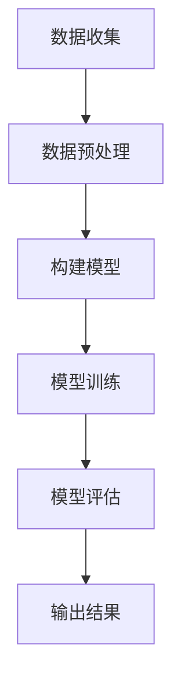
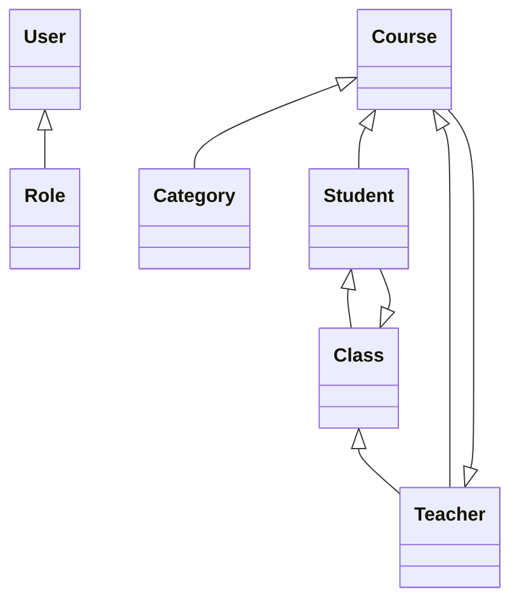
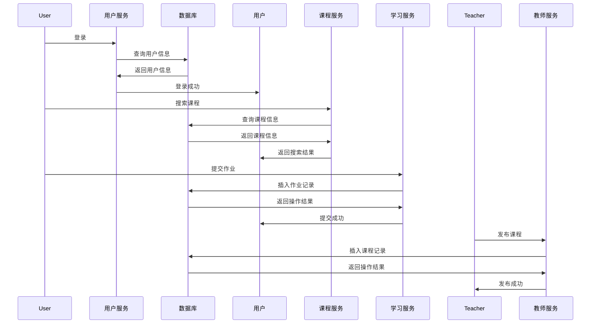

                 

# 技术选型决策框架：在众多选择中做出正确决策

## 关键词：技术选型、决策框架、成本效益分析、算法原理、系统架构设计

## 摘要：

在快速发展的技术环境中，企业面临诸多技术选型挑战。本文将探讨技术选型决策框架的构建与应用，通过分析需求、评估技术、分析风险以及进行成本效益分析，帮助企业做出明智的技术选型决策。同时，本文将详细讲解技术选型决策算法的原理，并结合实际案例进行分析和解读。

## 第一部分：背景介绍

### 第1章：问题背景与选型决策的重要性

#### 1.1.1 问题背景

随着技术的快速发展，企业面临着日益复杂的技术选型挑战。从硬件设备到软件开发工具，从数据库管理系统到云计算平台，企业需要在众多技术选项中做出最佳选择。技术选型决策的正确与否，往往直接关系到企业的长期发展和竞争力。

#### 1.1.2 问题描述

企业在技术选型过程中，往往面临以下挑战：

- 技术种类繁多，如何筛选出最适合企业需求的技术？
- 如何在有限的时间内对多种技术进行全面评估？
- 技术选型决策如何平衡短期效益和长期战略？
- 技术选型过程中如何规避潜在的风险？

#### 1.1.3 问题解决

为了解决上述问题，构建一个全面的技术选型决策框架显得尤为重要。这个框架将包括需求分析、技术评估、风险分析和成本效益分析等关键环节，帮助企业系统地、有针对性地进行技术选型。

#### 1.1.4 边界与外延

技术选型的范围广泛，包括硬件、软件、数据库、开发工具等。不同行业、不同规模的企业在技术选型决策中也有各自的特点和需求。因此，在构建技术选型决策框架时，需要充分考虑这些边界条件，确保框架的普适性和适用性。

### 第2章：核心概念与联系

#### 2.1 核心概念

- 技术选型：选择最适合企业需求的技术。
- 决策框架：一种结构化的决策过程。

#### 2.2 概念属性特征对比表格

| 概念     | 特征1 | 特征2 | 特征3 |
|----------|-------|-------|-------|
| 技术选型 | 清晰性 | 目标性 | 可行性 |
| 决策框架 | 系统性 | 逻辑性 | 实用性 |

#### 2.3 ER实体关系图架构

```mermaid
erDiagram
  Project ||--|{ Technology }| ProjectTechnology
  Company ||--|{ Project }| CompanyProject
```

## 第二部分：决策框架构建

### 第3章：决策框架基础

#### 3.1 决策框架的组成部分

技术选型决策框架由以下五个主要组成部分构成：

- 需求分析
- 技术评估
- 风险分析
- 成本效益分析
- 决策实施与监控

#### 3.2 需求分析

需求分析是技术选型决策的第一步，也是至关重要的一步。需求分析包括以下内容：

- 企业需求：功能、性能、安全性、可扩展性等。
- 用户需求：用户体验、易用性、访问量等。

#### 3.3 技术评估

技术评估是对各种技术选项进行综合比较的过程。评估标准通常包括：

- 现有技术评估：性能、稳定性、社区支持等。
- 新兴技术评估：潜力、创新性、适用性等。

#### 3.4 风险分析

风险分析旨在识别技术选型过程中可能面临的风险，并制定相应的应对策略。风险分析主要包括：

- 技术风险：技术成熟度、未来趋势等。
- 商业风险：市场前景、竞争状况等。

#### 3.5 成本效益分析

成本效益分析是对技术选型的经济可行性进行评估的过程。成本效益分析主要包括：

- 总成本：开发、维护、培训等。
- 效益：收益、效率、市场占有率等。

### 第4章：算法原理讲解

#### 4.1 算法介绍

技术选型决策算法是一种基于数据驱动的优化算法。该算法通过分析需求、评估技术、分析风险和成本效益等数据，自动生成最优技术选型方案。

#### 4.2 算法原理

技术选型决策算法的基本原理可以概括为以下步骤：

1. 数据收集：收集企业需求、技术评估、风险分析、成本效益分析等相关数据。
2. 数据预处理：对收集到的数据进行清洗、整理和归一化处理。
3. 构建模型：利用机器学习算法，构建一个基于输入数据的输出模型。
4. 模型训练：通过历史数据进行模型训练，优化模型参数。
5. 模型评估：对训练完成的模型进行评估，确保其预测准确性。
6. 输出结果：利用模型生成最优技术选型方案。

Mermaid流程图：



#### 4.3 数学模型

$$
\text{算法输出} = \frac{\text{效益}}{\text{成本}}
$$

#### 4.4 详细讲解与举例

假设某企业在技术选型中，评估了两种技术方案，成本与效益如下：

| 技术方案 | 成本（万元） | 效益（万元） |
|----------|--------------|--------------|
| 方案A    | 50           | 70           |
| 方案B    | 100          | 150           |

使用算法计算：

$$
\text{方案A} = \frac{70}{50} = 1.4
$$

$$
\text{方案B} = \frac{150}{100} = 1.5
$$

结果：方案B的效益成本比更高，为更优选择。

### 第5章：系统分析与架构设计方案

#### 5.1 问题场景

某企业计划开发一款在线教育平台，需要选择合适的技术方案以支持平台的高并发、高可用性和良好的用户体验。

#### 5.2 项目介绍

项目名称：在线教育平台

目标：搭建一个可扩展、高可用、易维护的在线教育平台，满足百万级用户同时在线访问的需求。

#### 5.3 系统功能设计

系统功能设计包括以下几个方面：

- 用户管理：用户注册、登录、个人信息管理、权限控制等。
- 课程管理：课程创建、发布、更新、分类、搜索等。
- 学习管理：学习进度、作业提交、考试、成绩管理等。
- 教师管理：教师注册、课程发布、作业批改、成绩录入等。
- 数据分析：用户行为分析、课程效果分析、学习数据统计等。

领域模型类图（Mermaid）：



#### 5.4 系统架构设计

系统架构设计采用微服务架构，主要模块包括：

- 用户服务：处理用户注册、登录、权限控制等。
- 课程服务：处理课程创建、发布、更新、分类、搜索等。
- 学习服务：处理学习进度、作业提交、考试、成绩管理等。
- 教师服务：处理教师注册、课程发布、作业批改、成绩录入等。
- 数据分析服务：处理用户行为分析、课程效果分析、学习数据统计等。

系统架构图（Mermaid）：



#### 5.5 系统接口设计

系统接口设计主要包括以下方面：

- 用户接口：用户注册、登录、课程搜索、作业提交等。
- 内部接口：用户管理、课程管理、学习管理、教师管理、数据分析等。

#### 5.6 系统交互

系统交互主要涉及以下环节：

- 用户与用户服务之间的交互：用户注册、登录、课程搜索、作业提交等。
- 用户服务与其他服务之间的交互：用户信息查询、课程信息查询、作业记录插入等。

## 第三部分：项目实战

### 第6章：环境安装与系统核心实现

#### 6.1 环境安装

在开始项目开发之前，需要安装以下环境：

- 开发工具：如IDEA、VSCode等。
- 服务器：如Linux服务器、Docker等。
- 数据库：如MySQL、PostgreSQL等。
- Web框架：如Spring Boot、Django等。

#### 6.2 系统核心实现

系统核心实现主要包括以下模块：

- 用户服务：实现用户注册、登录、权限控制等功能。
- 课程服务：实现课程创建、发布、更新、分类、搜索等功能。
- 学习服务：实现学习进度、作业提交、考试、成绩管理等功能。
- 教师服务：实现教师注册、课程发布、作业批改、成绩录入等功能。
- 数据分析服务：实现用户行为分析、课程效果分析、学习数据统计等功能。

### 第7章：代码应用解读与分析

#### 7.1 用户服务代码解读

用户服务是系统的核心模块之一，主要负责用户注册、登录和权限控制等功能。以下是用户服务中用户注册功能的代码示例：

```java
public ResponseDTO register(UserDTO userDTO) {
    // 验证用户输入是否合法
    if (!validUser(userDTO)) {
        return ResponseDTO.error("用户名或密码格式错误");
    }
    
    // 查询用户是否存在
    User user = userRepository.findByUsername(userDTO.getUsername());
    if (user != null) {
        return ResponseDTO.error("用户已存在");
    }
    
    // 创建用户并保存到数据库
    user = new User();
    user.setUsername(userDTO.getUsername());
    user.setPassword(passwordEncoder.encode(userDTO.getPassword()));
    userRepository.save(user);
    
    return ResponseDTO.success("注册成功");
}
```

#### 7.2 代码应用分析与优化

在对用户服务进行代码解读之后，可以对代码进行优化。以下是一些可能的优化建议：

- 验证用户输入时，可以增加正则表达式验证，确保用户名和密码符合特定格式要求。
- 在查询用户是否存在时，可以增加缓存机制，减少数据库查询次数，提高系统性能。
- 代码中使用静态方法进行操作，可以考虑将相关操作封装为类方法，提高代码复用性。

### 第8章：实际案例分析与详细讲解

#### 8.1 案例背景

某在线教育平台在技术选型过程中，面临以下挑战：

- 需要支持大规模用户同时在线访问，对系统性能有较高要求。
- 需要保证系统高可用性，避免因故障导致用户数据丢失。
- 需要支持课程视频的实时播放和录制，对音视频处理能力有较高要求。

#### 8.2 技术选型分析

针对上述挑战，平台进行了以下技术选型分析：

- 数据库选型：考虑到系统需要处理大量数据，同时保证查询性能，平台选择了MySQL数据库。
- Web框架选型：为了提高开发效率，平台选择了Spring Boot框架。
- 音视频处理选型：为了支持课程视频的实时播放和录制，平台选择了FFmpeg进行音视频处理。

#### 8.3 案例总结与启示

通过上述技术选型分析，平台成功搭建了一个高性能、高可用、易扩展的在线教育平台。以下是一些案例总结和启示：

- 技术选型要充分考虑系统性能、可用性和扩展性等关键因素。
- 不同技术之间需要相互协调，形成一个完整的解决方案。
- 技术选型决策过程中，要充分了解技术优势和劣势，避免盲目跟风。

### 第9章：项目小结

#### 9.1 项目成果

通过项目实践，平台成功实现了以下成果：

- 构建了一个可扩展、高可用、易维护的在线教育平台。
- 实现了用户注册、登录、权限控制、课程管理、学习管理、教师管理等功能。
- 对技术选型决策进行了详细分析和实践，为后续项目提供了有益的经验和启示。

#### 9.2 经验与教训

在项目实施过程中，我们积累了以下经验和教训：

- 技术选型要充分了解企业需求，确保技术方案符合实际需求。
- 项目团队要具备一定的技术储备和跨领域知识，以便在技术选型过程中做出明智决策。
- 项目管理要注重沟通与协作，确保项目进度和质量。

### 第10章：最佳实践 tips

#### 10.1 技术选型最佳实践

- 充分了解企业需求和业务场景，确保技术选型符合实际需求。
- 分析不同技术方案的优劣势，综合考虑技术成熟度、社区支持、成本等因素。
- 技术选型要具备前瞻性，考虑未来发展趋势和潜在需求。

#### 10.2 项目管理最佳实践

- 制定详细的项目计划和进度表，确保项目按时完成。
- 建立有效的沟通机制，确保团队成员之间的信息畅通。
- 加强项目风险管理和应急响应能力，确保项目顺利进行。

### 第11章：小结与注意事项

#### 11.1 小结

本文通过构建技术选型决策框架，详细分析了需求分析、技术评估、风险分析和成本效益分析等关键环节。同时，结合实际案例，对技术选型决策进行了深入解读。通过本文的介绍，读者可以了解到如何在实际项目中进行技术选型决策，提高项目成功率。

#### 11.2 注意事项

- 技术选型决策要充分考虑企业需求和业务场景，避免盲目跟风。
- 技术选型要具备前瞻性，考虑未来发展趋势和潜在需求。
- 技术选型决策过程中，要充分了解技术优势和劣势，确保技术方案的可行性和可持续性。

### 第12章：拓展阅读

#### 12.1 技术选型相关书籍推荐

- 《技术架构：构建可靠的企业级Web系统》
- 《软件架构设计：基于模式、原则与实践》
- 《敏捷软件开发：原则、模式与实践》

#### 12.2 技术选型相关网站推荐

- InfoQ：https://www.infoq.cn/
- CNCF：https://www.cncf.io/
- The Morning Paper：https://www晨读纸条.com/

## 作者信息

作者：AI天才研究院/AI Genius Institute & 禅与计算机程序设计艺术 /Zen And The Art of Computer Programming

