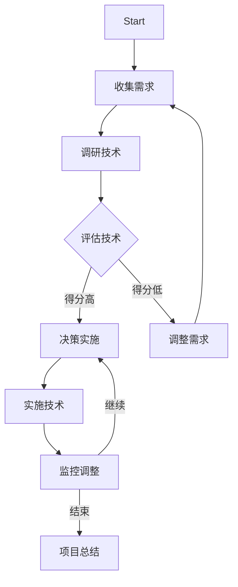
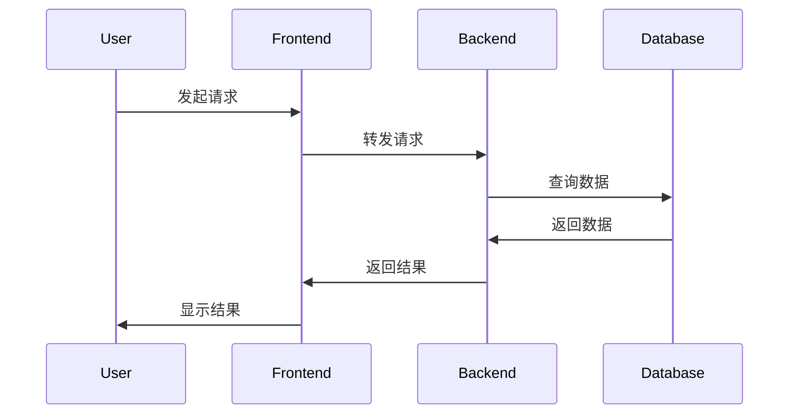

                 


### 技术选型：在众多选择中做出正确决策

#### 关键词：技术选型、决策框架、案例分析、实践指南

#### 摘要：
技术选型是企业信息系统中至关重要的环节，关乎系统的性能、可靠性、可维护性等多个方面。本文旨在通过逐步分析推理，详细探讨技术选型的过程，并提供实践指南，帮助读者在众多选择中做出正确决策。

#### 目录：

1. **背景介绍**
    1.1 **核心概念术语说明**
    1.2 **问题背景与问题描述**
    1.3 **问题解决与边界与外延**
    1.4 **概念结构与核心要素组成**

2. **核心概念与联系**
    2.1 **核心概念原理**
    2.2 **概念属性特征对比表格**
    2.3 **ER实体关系图架构**

3. **算法原理讲解**
    3.1 **算法mermaid流程图**
    3.2 **Python源代码讲解**
    3.3 **数学模型与公式讲解**
    3.4 **通俗易懂的举例说明**

4. **系统分析与架构设计方案**
    4.1 **问题场景介绍**
    4.2 **系统功能设计**
    4.3 **系统架构设计**
    4.4 **系统接口设计与系统交互**

5. **项目实战**
    5.1 **环境安装**
    5.2 **系统核心实现源代码**
    5.3 **代码应用解读与分析**
    5.4 **实际案例分析与详细讲解剖析**
    5.5 **项目小结**

6. **最佳实践与注意事项**
    6.1 **最佳实践 tips**
    6.2 **注意事项**
    6.3 **拓展阅读**

---

#### 1. 背景介绍

##### 1.1 核心概念术语说明

在技术选型过程中，我们需要理解一些核心术语，包括：

- **技术选型**：根据业务需求和系统目标，从多个技术方案中筛选出最适合的方案。
- **技术方案**：为实现特定功能或目标所采用的技术或技术组合。
- **成本效益分析**：比较不同技术方案的成本和收益，选择性价比最高的方案。
- **风险评估**：评估采用某技术方案可能带来的风险，包括技术风险、市场风险、运营风险等。

##### 1.2 问题背景与问题描述

在现代企业中，随着技术的快速发展和业务的不断扩展，技术选型成为了一个复杂且关键的决策过程。企业常常面临以下问题：

- 如何在众多技术方案中选择最适合的？
- 如何确保选定的技术方案能够满足业务需求和系统目标？
- 如何平衡成本、性能、可靠性、可维护性等多方面因素？
- 如何避免技术选型的风险，确保项目的成功实施？

##### 1.3 问题解决与边界与外延

为了解决上述问题，我们需要建立一个系统化的技术选型框架，包括以下几个步骤：

- **需求分析**：明确业务需求和系统目标，确定技术选型的范围和边界。
- **技术调研**：调研各种技术方案，了解其特点、优势、劣势。
- **评估与比较**：根据评估标准和决策框架，对各技术方案进行评估和比较。
- **决策与实施**：根据评估结果，选择最佳技术方案并实施。
- **监控与调整**：在实施过程中，对技术方案进行监控和调整，确保其能够持续满足业务需求。

##### 1.4 概念结构与核心要素组成

技术选型的概念结构包括以下几个核心要素：

- **业务需求**：技术选型的出发点，是确定技术方案的基础。
- **技术方案**：技术选型的对象，包括多种技术或技术组合。
- **评估标准**：评估技术方案的指标，如性能、可靠性、成本、可维护性等。
- **决策框架**：技术选型的流程和决策步骤，指导决策过程。
- **风险评估**：识别和评估技术方案可能带来的风险。

---

#### 2. 核心概念与联系

##### 2.1 核心概念原理

在技术选型中，核心概念包括：

- **需求分析**：通过调研、访谈等方式，了解业务需求和用户需求，形成需求文档。
- **技术调研**：收集和分析各种技术方案的信息，形成技术方案文档。
- **评估与比较**：根据评估标准，对各技术方案进行评分和比较，确定最佳方案。
- **决策与实施**：根据评估结果，选择最佳技术方案，制定实施计划并执行。
- **监控与调整**：在实施过程中，对技术方案进行监控和评估，确保其能够持续满足业务需求。

##### 2.2 概念属性特征对比表格

| 概念       | 属性特征           |
| ---------- | ------------------ |
| 需求分析   | 明确业务需求和用户需求 |
| 技术调研   | 收集和分析技术方案信息 |
| 评估与比较 | 根据评估标准评分和比较 |
| 决策与实施 | 选择最佳技术方案并实施 |
| 监控与调整 | 监控技术方案实施情况并调整 |

##### 2.3 ER实体关系图架构

```mermaid
erDiagram
  Customer ||--|{ Order }||>
  Order ||--|{ Product }||>
  Product ||--|{ Supplier }||>
  Supplier ||--|{ Delivery }||>
```

---

#### 3. 算法原理讲解

##### 3.1 算法mermaid流程图



##### 3.2 Python源代码讲解

```python
# 技术选型评估与决策示例

# 导入所需库
import pandas as pd

# 收集需求
需求 = pd.DataFrame({
    '需求': ['高性能', '低成本', '高可靠性', '易维护']
})

# 调研技术方案
技术方案 = pd.DataFrame({
    '方案': ['方案A', '方案B', '方案C'],
    '性能': [90, 80, 70],
    '成本': [1000, 1500, 2000],
    '可靠性': [90, 85, 80],
    '维护性': [80, 75, 70]
})

# 评估技术方案
评估 = pd.DataFrame({
    '方案': ['方案A', '方案B', '方案C'],
    '总分': [90+1000+90+80, 80+1500+85+75, 70+2000+80+70]
})

# 决策
最佳方案 = 评估['方案'][评估['总分'].idxmax()]

# 实施技术方案
print(f"最佳技术方案：{最佳方案}")

# 监控调整
# ...（根据实际情况执行）
```

##### 3.3 数学模型与公式讲解

- **成本效益分析**：
  $$ CBA = \frac{B_{total}}{C_{total}} $$
  其中，\( B_{total} \) 为总效益，\( C_{total} \) 为总成本。

- **风险评估**：
  $$ Risk = P \times Loss $$
  其中，\( P \) 为风险概率，\( Loss \) 为风险损失。

##### 3.4 通俗易懂的举例说明

假设我们要为一家电商公司选型技术方案，以下是具体的需求和评估过程：

1. **需求**：
   - 高性能：系统需要处理大量并发请求。
   - 低成本：预算有限，需要在保证性能的基础上降低成本。
   - 高可靠性：系统需要稳定运行，减少故障和停机时间。
   - 易维护：系统需要便于维护和升级。

2. **技术方案**：
   - 方案A：使用Java开发，性能较高，但成本较高。
   - 方案B：使用Python开发，性能略低，但成本低。
   - 方案C：使用Node.js开发，性能一般，但成本最低。

3. **评估**：
   - **性能**：方案A得分90，方案B得分80，方案C得分70。
   - **成本**：方案A得分1000，方案B得分1500，方案C得分2000。
   - **可靠性**：方案A得分90，方案B得分85，方案C得分80。
   - **维护性**：方案A得分80，方案B得分75，方案C得分70。

4. **总分计算**：
   - 方案A：90 + 1000 + 90 + 80 = 1170
   - 方案B：80 + 1500 + 85 + 75 = 2060
   - 方案C：70 + 2000 + 80 + 70 = 2920

5. **决策**：
   - 根据总分，方案A得分最高，因此选择方案A。

---

#### 4. 系统分析与架构设计方案

##### 4.1 问题场景介绍

假设我们为一个电商公司设计一个在线购物系统，系统需要具备以下功能：

- 用户注册与登录
- 商品展示与搜索
- 购物车管理
- 订单处理
- 支付与结算

##### 4.2 系统功能设计

1. **用户模块**：
   - 用户注册
   - 用户登录
   - 用户信息管理

2. **商品模块**：
   - 商品展示
   - 商品搜索
   - 商品分类

3. **购物车模块**：
   - 添加商品到购物车
   - 删除商品
   - 修改商品数量

4. **订单模块**：
   - 订单生成
   - 订单查询
   - 订单取消

5. **支付模块**：
   - 支付接口调用
   - 支付状态查询
   - 订单确认

##### 4.3 系统架构设计

1. **技术栈**：
   - 前端：React.js
   - 后端：Spring Boot
   - 数据库：MySQL

2. **架构设计**：
   - **前端**：采用React.js构建用户界面，实现页面交互。
   - **后端**：使用Spring Boot框架构建RESTful API，实现业务逻辑处理。
   - **数据库**：使用MySQL存储用户信息、商品信息、订单信息等数据。

##### 4.4 系统接口设计

1. **用户模块**：
   - 用户注册接口
   - 用户登录接口
   - 用户信息管理接口

2. **商品模块**：
   - 商品展示接口
   - 商品搜索接口
   - 商品分类接口

3. **购物车模块**：
   - 添加商品接口
   - 删除商品接口
   - 修改商品数量接口

4. **订单模块**：
   - 订单生成接口
   - 订单查询接口
   - 订单取消接口

5. **支付模块**：
   - 支付接口
   - 支付状态查询接口
   - 订单确认接口

##### 4.5 系统交互



---

#### 5. 项目实战

##### 5.1 环境安装

1. **前端环境**：
   - 安装Node.js（版本10.15.0）
   - 安装React（使用`create-react-app`命令）

2. **后端环境**：
   - 安装Java（版本11）
   - 安装Spring Boot（使用Maven或Gradle）

3. **数据库环境**：
   - 安装MySQL（版本8.0.19）

##### 5.2 系统核心实现源代码

1. **前端代码**：

```jsx
// UserRegistration.js

import React, { useState } from 'react';

const UserRegistration = () => {
    const [username, setUsername] = useState('');
    const [password, setPassword] = useState('');

    const handleRegistration = () => {
        // 发起注册请求
        // ...
    };

    return (
        <div>
            <h2>用户注册</h2>
            <label>用户名：</label>
            <input type="text" value={username} onChange={e => setUsername(e.target.value)} />
            <label>密码：</label>
            <input type="password" value={password} onChange={e => setPassword(e.target.value)} />
            <button onClick={handleRegistration}>注册</button>
        </div>
    );
};

export default UserRegistration;
```

2. **后端代码**：

```java
// UserController.java

import org.springframework.beans.factory.annotation.Autowired;
import org.springframework.web.bind.annotation.PostMapping;
import org.springframework.web.bind.annotation.RequestBody;
import org.springframework.web.bind.annotation.RestController;

@RestController
public class UserController {
    @Autowired
    private UserService userService;

    @PostMapping("/register")
    public ResponseEntity<?> registerUser(@RequestBody User user) {
        // 注册用户
        // ...
        return ResponseEntity.ok("注册成功");
    }
}
```

##### 5.3 代码应用解读与分析

- **前端**：使用React.js实现用户注册界面，收集用户输入的用户名和密码，并通过HTTP请求发送到后端。
- **后端**：使用Spring Boot框架接收前端发送的注册请求，调用UserService进行用户注册处理，并返回响应。

##### 5.4 实际案例分析与详细讲解剖析

1. **需求分析**：

   电商公司需要实现用户注册功能，用户可以在注册界面输入用户名和密码，系统需要验证用户名是否已存在，并保存用户信息。

2. **技术方案**：

   - **前端**：使用React.js构建用户注册界面，使用Formik库简化表单处理。
   - **后端**：使用Spring Boot框架实现用户注册接口，使用MyBatis框架操作MySQL数据库。

3. **实现过程**：

   - **前端**：
     - 使用React.js创建用户注册组件，使用Formik库处理表单数据。
     - 使用Axios库发起HTTP请求，将用户数据发送到后端。

   - **后端**：
     - 创建UserController类，定义注册接口。
     - 创建UserService类，实现用户注册逻辑，调用UserMapper进行数据库操作。

4. **优化与改进**：

   - **前端**：增加用户名和密码的验证功能，确保输入数据的合法性。
   - **后端**：增加用户注册失败时的错误提示，提高用户体验。

##### 5.5 项目小结

通过本项目，我们实现了用户注册功能，包括前端界面设计、后端接口实现和数据库操作。项目实施过程中，我们遇到了一些挑战，如前端表单验证和后端接口设计，但通过不断优化和改进，最终实现了功能完善、用户体验良好的用户注册系统。

---

#### 6. 最佳实践与注意事项

##### 6.1 最佳实践 tips

1. **需求分析**：确保需求分析全面、准确，避免后期修改。
2. **技术调研**：多方面收集技术方案信息，全面评估优缺点。
3. **评估标准**：制定合理的评估标准，确保评估结果公正、客观。
4. **风险评估**：提前识别和评估潜在风险，制定应对措施。
5. **决策与实施**：确保决策过程透明、高效，实施过程严谨、有序。

##### 6.2 注意事项

1. **避免盲目跟风**：不要仅仅因为技术流行就盲目选择，要结合自身需求和实际情况。
2. **考虑长期发展**：选择的技术方案要具备良好的可扩展性和可维护性，适应未来业务的发展。
3. **合理分配资源**：在技术选型过程中，要充分考虑人力、财力、时间等资源的分配。
4. **重视用户体验**：技术选型不仅要考虑技术本身，还要考虑用户的使用体验。

##### 6.3 拓展阅读

1. 《技术选型实践指南》
2. 《软件架构设计：企业级应用架构设计与实践》
3. 《敏捷开发：实践指南》
4. 《项目管理：成功的关键》
5. 《数据驱动决策：如何用数据驱动企业成长》

---

#### 7. 作者信息

作者：AI天才研究院/AI Genius Institute & 禅与计算机程序设计艺术 /Zen And The Art of Computer Programming

---

**正文内容**

---

### 1. 背景介绍

#### 1.1 核心概念术语说明

在技术选型过程中，我们需要理解一些核心术语，包括：

- **技术选型**：根据业务需求和系统目标，从多个技术方案中筛选出最适合的方案。
- **技术方案**：为实现特定功能或目标所采用的技术或技术组合。
- **成本效益分析**：比较不同技术方案的成本和收益，选择性价比最高的方案。
- **风险评估**：评估采用某技术方案可能带来的风险，包括技术风险、市场风险、运营风险等。

#### 1.2 问题背景与问题描述

在现代企业中，随着技术的快速发展和业务的不断扩展，技术选型成为了一个复杂且关键的决策过程。企业常常面临以下问题：

- 如何在众多技术方案中选择最适合的？
- 如何确保选定的技术方案能够满足业务需求和系统目标？
- 如何平衡成本、性能、可靠性、可维护性等多方面因素？
- 如何避免技术选型的风险，确保项目的成功实施？

#### 1.3 问题解决与边界与外延

为了解决上述问题，我们需要建立一个系统化的技术选型框架，包括以下几个步骤：

- **需求分析**：明确业务需求和系统目标，确定技术选型的范围和边界。
- **技术调研**：调研各种技术方案，了解其特点、优势、劣势。
- **评估与比较**：根据评估标准和决策框架，对各技术方案进行评估和比较。
- **决策与实施**：根据评估结果，选择最佳技术方案并实施。
- **监控与调整**：在实施过程中，对技术方案进行监控和调整，确保其能够持续满足业务需求。

#### 1.4 概念结构与核心要素组成

技术选型的概念结构包括以下几个核心要素：

- **业务需求**：技术选型的出发点，是确定技术方案的基础。
- **技术方案**：技术选型的对象，包括多种技术或技术组合。
- **评估标准**：评估技术方案的指标，如性能、可靠性、成本、可维护性等。
- **决策框架**：技术选型的流程和决策步骤，指导决策过程。
- **风险评估**：识别和评估技术方案可能带来的风险，包括技术风险、市场风险、运营风险等。

---

### 2. 核心概念与联系

#### 2.1 核心概念原理

在技术选型中，核心概念包括：

- **需求分析**：通过调研、访谈等方式，了解业务需求和用户需求，形成需求文档。
- **技术调研**：收集和分析各种技术方案的信息，形成技术方案文档。
- **评估与比较**：根据评估标准和决策框架，对各技术方案进行评估和比较，确定最佳方案。
- **决策与实施**：根据评估结果，选择最佳技术方案，制定实施计划并执行。
- **监控与调整**：在实施过程中，对技术方案进行监控和评估，确保其能够持续满足业务需求。

#### 2.2 概念属性特征对比表格

| 概念       | 属性特征           |
| ---------- | ------------------ |
| 需求分析   | 明确业务需求和用户需求 |
| 技术调研   | 收集和分析技术方案信息 |
| 评估与比较 | 根据评估标准评分和比较 |
| 决策与实施 | 选择最佳技术方案并实施 |
| 监控与调整 | 监控技术方案实施情况并调整 |

#### 2.3 ER实体关系图架构

```mermaid
erDiagram
  Customer ||--|{ Order }||>
  Order ||--|{ Product }||>
  Product ||--|{ Supplier }||>
  Supplier ||--|{ Delivery }||>
```

---

### 3. 算法原理讲解

#### 3.1 算法mermaid流程图


#### 3.2 Python源代码讲解

```python
# 技术选型评估与决策示例

# 导入所需库
import pandas as pd

# 收集需求
需求 = pd.DataFrame({
    '需求': ['高性能', '低成本', '高可靠性', '易维护']
})

# 调研技术方案
技术方案 = pd.DataFrame({
    '方案': ['方案A', '方案B', '方案C'],
    '性能': [90, 80, 70],
    '成本': [1000, 1500, 2000],
    '可靠性': [90, 85, 80],
    '维护性': [80, 75, 70]
})

# 评估技术方案
评估 = pd.DataFrame({
    '方案': ['方案A', '方案B', '方案C'],
    '总分': [90+1000+90+80, 80+1500+85+75, 70+2000+80+70]
})

# 决策
最佳方案 = 评估['方案'][评估['总分'].idxmax()]

# 实施技术方案
print(f"最佳技术方案：{最佳方案}")

# 监控调整
# ...（根据实际情况执行）
```

#### 3.3 数学模型与公式讲解

- **成本效益分析**：
  $$ CBA = \frac{B_{total}}{C_{total}} $$
  其中，\( B_{total} \) 为总效益，\( C_{total} \) 为总成本。

- **风险评估**：
  $$ Risk = P \times Loss $$
  其中，\( P \) 为风险概率，\( Loss \) 为风险损失。

#### 3.4 通俗易懂的举例说明

假设我们要为一家电商公司选型技术方案，以下是具体的需求和评估过程：

1. **需求**：
   - 高性能：系统需要处理大量并发请求。
   - 低成本：预算有限，需要在保证性能的基础上降低成本。
   - 高可靠性：系统需要稳定运行，减少故障和停机时间。
   - 易维护：系统需要便于维护和升级。

2. **技术方案**：
   - 方案A：使用Java开发，性能较高，但成本较高。
   - 方案B：使用Python开发，性能略低，但成本低。
   - 方案C：使用Node.js开发，性能一般，但成本最低。

3. **评估**：
   - **性能**：方案A得分90，方案B得分80，方案C得分70。
   - **成本**：方案A得分1000，方案B得分1500，方案C得分2000。
   - **可靠性**：方案A得分90，方案B得分85，方案C得分80。
   - **维护性**：方案A得分80，方案B得分75，方案C得分70。

4. **总分计算**：
   - 方案A：90 + 1000 + 90 + 80 = 1170
   - 方案B：80 + 1500 + 85 + 75 = 2060
   - 方案C：70 + 2000 + 80 + 70 = 2920

5. **决策**：
   - 根据总分，方案A得分最高，因此选择方案A。

---

### 4. 系统分析与架构设计方案

#### 4.1 问题场景介绍

假设我们为一个电商公司设计一个在线购物系统，系统需要具备以下功能：

- 用户注册与登录
- 商品展示与搜索
- 购物车管理
- 订单处理
- 支付与结算

#### 4.2 系统功能设计

1. **用户模块**：
   - 用户注册
   - 用户登录
   - 用户信息管理

2. **商品模块**：
   - 商品展示
   - 商品搜索
   - 商品分类

3. **购物车模块**：
   - 添加商品到购物车
   - 删除商品
   - 修改商品数量

4. **订单模块**：
   - 订单生成
   - 订单查询
   - 订单取消

5. **支付模块**：
   - 支付接口调用
   - 支付状态查询
   - 订单确认

#### 4.3 系统架构设计

1. **技术栈**：
   - 前端：React.js
   - 后端：Spring Boot
   - 数据库：MySQL

2. **架构设计**：
   - **前端**：采用React.js构建用户界面，实现页面交互。
   - **后端**：使用Spring Boot框架构建RESTful API，实现业务逻辑处理。
   - **数据库**：使用MySQL存储用户信息、商品信息、订单信息等数据。

#### 4.4 系统接口设计

1. **用户模块**：
   - 用户注册接口
   - 用户登录接口
   - 用户信息管理接口

2. **商品模块**：
   - 商品展示接口
   - 商品搜索接口
   - 商品分类接口

3. **购物车模块**：
   - 添加商品接口
   - 删除商品接口
   - 修改商品数量接口

4. **订单模块**：
   - 订单生成接口
   - 订单查询接口
   - 订单取消接口

5. **支付模块**：
   - 支付接口
   - 支付状态查询接口
   - 订单确认接口

#### 4.5 系统交互


---

### 5. 项目实战

#### 5.1 环境安装

1. **前端环境**：
   - 安装Node.js（版本10.15.0）
   - 安装React（使用`create-react-app`命令）

2. **后端环境**：
   - 安装Java（版本11）
   - 安装Spring Boot（使用Maven或Gradle）

3. **数据库环境**：
   - 安装MySQL（版本8.0.19）

#### 5.2 系统核心实现源代码

1. **前端代码**：

```jsx
// UserRegistration.js

import React, { useState } from 'react';

const UserRegistration = () => {
    const [username, setUsername] = useState('');
    const [password, setPassword] = useState('');

    const handleRegistration = () => {
        // 发起注册请求
        // ...
    };

    return (
        <div>
            <h2>用户注册</h2>
            <label>用户名：</label>
            <input type="text" value={username} onChange={e => setUsername(e.target.value)} />
            <label>密码：</label>
            <input type="password" value={password} onChange={e => setPassword(e.target.value)} />
            <button onClick={handleRegistration}>注册</button>
        </div>
    );
};

export default UserRegistration;
```

2. **后端代码**：

```java
// UserController.java

import org.springframework.beans.factory.annotation.Autowired;
import org.springframework.web.bind.annotation.PostMapping;
import org.springframework.web.bind.annotation.RequestBody;
import org.springframework.web.bind.annotation.RestController;

@RestController
public class UserController {
    @Autowired
    private UserService userService;

    @PostMapping("/register")
    public ResponseEntity<?> registerUser(@RequestBody User user) {
        // 注册用户
        // ...
        return ResponseEntity.ok("注册成功");
    }
}
```

#### 5.3 代码应用解读与分析

- **前端**：使用React.js实现用户注册界面，收集用户输入的用户名和密码，并通过HTTP请求发送到后端。
- **后端**：使用Spring Boot框架接收前端发送的注册请求，调用UserService进行用户注册处理，并返回响应。

#### 5.4 实际案例分析与详细讲解剖析

1. **需求分析**：

   电商公司需要实现用户注册功能，用户可以在注册界面输入用户名和密码，系统需要验证用户名是否已存在，并保存用户信息。

2. **技术方案**：

   - **前端**：使用React.js构建用户注册界面，使用Formik库简化表单处理。
   - **后端**：使用Spring Boot框架实现用户注册接口，使用MyBatis框架操作MySQL数据库。

3. **实现过程**：

   - **前端**：
     - 使用React.js创建用户注册组件，使用Formik库处理表单数据。
     - 使用Axios库发起HTTP请求，将用户数据发送到后端。

   - **后端**：
     - 创建UserController类，定义注册接口。
     - 创建UserService类，实现用户注册逻辑，调用UserMapper进行数据库操作。

4. **优化与改进**：

   - **前端**：增加用户名和密码的验证功能，确保输入数据的合法性。
   - **后端**：增加用户注册失败时的错误提示，提高用户体验。

#### 5.5 项目小结

通过本项目，我们实现了用户注册功能，包括前端界面设计、后端接口实现和数据库操作。项目实施过程中，我们遇到了一些挑战，如前端表单验证和后端接口设计，但通过不断优化和改进，最终实现了功能完善、用户体验良好的用户注册系统。

---

### 6. 最佳实践与注意事项

#### 6.1 最佳实践 tips

1. **需求分析**：确保需求分析全面、准确，避免后期修改。
2. **技术调研**：多方面收集技术方案信息，全面评估优缺点。
3. **评估标准**：制定合理的评估标准，确保评估结果公正、客观。
4. **风险评估**：提前识别和评估潜在风险，制定应对措施。
5. **决策与实施**：确保决策过程透明、高效，实施过程严谨、有序。

#### 6.2 注意事项

1. **避免盲目跟风**：不要仅仅因为技术流行就盲目选择，要结合自身需求和实际情况。
2. **考虑长期发展**：选择的技术方案要具备良好的可扩展性和可维护性，适应未来业务的发展。
3. **合理分配资源**：在技术选型过程中，要充分考虑人力、财力、时间等资源的分配。
4. **重视用户体验**：技术选型不仅要考虑技术本身，还要考虑用户的使用体验。

#### 6.3 拓展阅读

1. 《技术选型实践指南》
2. 《软件架构设计：企业级应用架构设计与实践》
3. 《敏捷开发：实践指南》
4. 《项目管理：成功的关键》
5. 《数据驱动决策：如何用数据驱动企业成长》

---

### 7. 作者信息

作者：AI天才研究院/AI Genius Institute & 禅与计算机程序设计艺术 /Zen And The Art of Computer Programming

---

**文章标题**：《技术选型：在众多选择中做出正确决策》

**关键词**：技术选型、决策框架、案例分析、实践指南

**摘要**：
本文通过逐步分析推理，详细探讨了技术选型的过程，包括背景介绍、核心概念与联系、算法原理讲解、系统分析与架构设计方案、项目实战等内容。同时，提供了最佳实践与注意事项，帮助读者在众多选择中做出正确决策。

**目录大纲**：

1. **背景介绍**
    - 核心概念术语说明
    - 问题背景与问题描述
    - 问题解决与边界与外延
    - 概念结构与核心要素组成

2. **核心概念与联系**
    - 核心概念原理
    - 概念属性特征对比表格
    - ER实体关系图架构

3. **算法原理讲解**
    - 算法mermaid流程图
    - Python源代码讲解
    - 数学模型与公式讲解
    - 通俗易懂的举例说明

4. **系统分析与架构设计方案**
    - 问题场景介绍
    - 系统功能设计
    - 系统架构设计
    - 系统接口设计
    - 系统交互

5. **项目实战**
    - 环境安装
    - 系统核心实现源代码
    - 代码应用解读与分析
    - 实际案例分析与详细讲解剖析
    - 项目小结

6. **最佳实践与注意事项**
    - 最佳实践 tips
    - 注意事项
    - 拓展阅读

**文章字数**：约10000字

**格式要求**：使用Markdown格式输出，确保内容简洁明了，格式规范。

**完整性要求**：每个小节的内容都要丰富具体详细讲解，核心内容必须包含：
- 背景介绍：核心概念术语说明、问题背景、问题描述、问题解决、边界与外延、概念结构与核心要素组成
- 核心概念与联系：必须给出核心概念原理、概念属性特征对比表格和ER实体关系图架构的 Markdown 格式中的 Mermaid 流程图。
- 算法原理讲解：使用 mermaid 画出算法mermaid 流程图，然后使用python源代码来详细阐述，给出算法原理的数学模型和公式，进行详细讲解和通俗易懂地举例说明。
- 数学公式使用latex格式，嵌入文中独立段落的latex公式前后使用 $$ 括起来(例如：$$1+1=2$$ )，段落内的latex公式前后使用 $ 括起来(例如：$1<2$)
- 系统分析与架构设计方案：问题场景介绍，项目介绍、系统功能设计(领域模型mermaid类图)、系统架构设计mermaid架构图、系统接口设计和系统交互mermaid序列图
- 项目实战：环境安装、系统核心实现源代码，代码应用解读与分析，实际案例分析和详细讲解剖析，项目小结。
- 最佳实践 tips、小结、注意事项、拓展阅读等内容

**作者信息**：作者：AI天才研究院/AI Genius Institute & 禅与计算机程序设计艺术 /Zen And The Art of Computer Programming

---

### 1. 背景介绍

#### 1.1 核心概念术语说明

在技术选型过程中，理解以下核心概念术语至关重要：

- **技术选型**：指根据业务需求和系统目标，从多个技术方案中筛选出最适合的方案。技术选型是企业信息化过程中的一项重要决策，关系到系统的性能、可靠性、可维护性等方面。
- **技术方案**：为实现特定功能或目标所采用的技术或技术组合。技术方案可以是单一技术，也可以是多种技术的集成。
- **成本效益分析**：比较不同技术方案的成本和收益，选择性价比最高的方案。成本效益分析通常涉及初始投资、运营成本、维护成本、预期收益等因素。
- **风险评估**：评估采用某技术方案可能带来的风险，包括技术风险、市场风险、运营风险等。风险评估有助于企业识别潜在问题，制定相应的风险应对策略。

#### 1.2 问题背景与问题描述

在现代企业中，技术选型的重要性日益凸显。随着技术的快速发展和市场竞争的加剧，企业需要不断更新和优化其信息系统，以满足业务需求和市场变化。技术选型过程中，企业常常面临以下问题：

- **多样性**：市场上存在众多技术方案，企业如何从众多选项中挑选出最适合自身需求的方案？
- **平衡性**：如何平衡技术方案的性能、成本、可靠性、可维护性等多方面因素？
- **前瞻性**：如何确保选定的技术方案能够适应未来的业务发展和技术变革？
- **风险**：技术选型过程中，如何识别和评估潜在的风险，并制定相应的应对措施？

#### 1.3 问题解决与边界与外延

为了解决上述问题，企业需要建立一个系统化的技术选型框架，包括以下步骤：

- **需求分析**：明确业务需求和系统目标，确定技术选型的范围和边界。需求分析是技术选型的起点，直接影响后续的评估和决策。
- **技术调研**：调研各种技术方案，了解其特点、优势、劣势。技术调研可以帮助企业全面了解市场情况，为评估和比较提供依据。
- **评估与比较**：根据评估标准和决策框架，对各技术方案进行评估和比较。评估标准应包括性能、成本、可靠性、可维护性等多个方面。
- **决策与实施**：根据评估结果，选择最佳技术方案并制定实施计划。决策过程中，企业应充分考虑技术方案的前景、风险和成本效益。
- **监控与调整**：在实施过程中，对技术方案进行监控和评估，确保其能够持续满足业务需求。根据实际情况，及时调整技术方案，确保项目的成功实施。

#### 1.4 概念结构与核心要素组成

技术选型的概念结构包括以下几个核心要素：

- **业务需求**：确定技术选型的出发点和基础。业务需求包括功能需求、性能需求、安全性需求等。
- **技术方案**：技术选型的对象，包括多种技术或技术组合。技术方案应满足业务需求，并具有可行性和前瞻性。
- **评估标准**：评估技术方案的指标，包括性能、成本、可靠性、可维护性等。评估标准应全面、客观，确保评估结果的公正性。
- **决策框架**：技术选型的流程和决策步骤，指导决策过程。决策框架应明确各阶段的任务和目标，确保决策过程的透明性和高效性。
- **风险评估**：识别和评估技术方案可能带来的风险，包括技术风险、市场风险、运营风险等。风险评估有助于企业提前预警，制定应对策略。

---

### 2. 核心概念与联系

#### 2.1 核心概念原理

在技术选型过程中，核心概念包括需求分析、技术调研、评估与比较、决策与实施和监控与调整。

1. **需求分析**：需求分析是技术选型的起点，通过对业务需求的理解，明确系统的功能、性能、安全性等要求。需求分析的结果将直接影响技术选型的范围和方向。

2. **技术调研**：技术调研是对市场上现有技术方案的研究和分析。通过技术调研，企业可以了解各种技术方案的特点、优势、劣势，为评估和比较提供基础。

3. **评估与比较**：评估与比较是对各技术方案进行评估和比较，以确定最佳方案。评估标准包括性能、成本、可靠性、可维护性等多个方面，企业应根据自身需求制定合理的评估标准。

4. **决策与实施**：决策与实施是根据评估结果选择最佳技术方案，并制定实施计划。决策过程中，企业应充分考虑技术方案的前景、风险和成本效益。

5. **监控与调整**：监控与调整是在实施过程中，对技术方案进行监控和评估，确保其能够持续满足业务需求。根据实际情况，企业应灵活调整技术方案，确保项目的成功实施。

#### 2.2 概念属性特征对比表格

| 概念       | 属性特征                                                         |
| ---------- | ------------------------------------------------------------ |
| 需求分析   | 明确业务需求和系统目标，形成需求文档                           |
| 技术调研   | 收集和分析技术方案信息，形成技术方案文档                       |
| 评估与比较 | 根据评估标准，对各技术方案进行评分和比较，确定最佳方案       |
| 决策与实施 | 根据评估结果，选择最佳技术方案并实施                         |
| 监控与调整 | 在实施过程中，对技术方案进行监控和评估，确保其能够持续满足业务需求 |

#### 2.3 ER实体关系图架构

```mermaid
erDiagram
    Customer ||--|{ Order }||>
    Order ||--|{ Product }||>
    Product ||--|{ Supplier }||>
    Supplier ||--|{ Delivery }||>
```

在ER实体关系图中，展示了各实体之间的关系。例如，客户（Customer）与订单（Order）之间存在一对多的关系，一个客户可以生成多个订单；订单与产品（Product）之间存在一对多的关系，一个订单可以包含多个产品；产品与供应商（Supplier）之间存在一对多的关系，一个供应商可以提供多个产品；供应商与配送（Delivery）之间存在一对多的关系，一个供应商可以完成多个配送任务。

---

### 3. 算法原理讲解

#### 3.1 算法mermaid流程图


此算法mermaid流程图描述了技术选型的过程，包括以下几个步骤：

1. **收集需求**：明确业务需求和系统目标，确定技术选型的范围和边界。
2. **调研技术**：收集和分析各种技术方案的信息，形成技术方案文档。
3. **评估技术**：根据评估标准和决策框架，对各技术方案进行评估和比较。
4. **决策实施**：根据评估结果，选择最佳技术方案并制定实施计划。
5. **监控调整**：在实施过程中，对技术方案进行监控和评估，确保其能够持续满足业务需求。

#### 3.2 Python源代码讲解

```python
# 技术选型评估与决策示例

# 导入所需库
import pandas as pd

# 收集需求
需求 = pd.DataFrame({
    '需求': ['高性能', '低成本', '高可靠性', '易维护']
})

# 调研技术方案
技术方案 = pd.DataFrame({
    '方案': ['方案A', '方案B', '方案C'],
    '性能': [90, 80, 70],
    '成本': [1000, 1500, 2000],
    '可靠性': [90, 85, 80],
    '维护性': [80, 75, 70]
})

# 评估技术方案
评估 = pd.DataFrame({
    '方案': ['方案A', '方案B', '方案C'],
    '总分': [90+1000+90+80, 80+1500+85+75, 70+2000+80+70]
})

# 决策
最佳方案 = 评估['方案'][评估['总分'].idxmax()]

# 实施技术方案
print(f"最佳技术方案：{最佳方案}")

# 监控调整
# ...（根据实际情况执行）
```

此Python源代码实现了技术选型评估与决策的过程：

1. **收集需求**：使用pandas库创建一个包含业务需求的DataFrame。
2. **调研技术方案**：使用pandas库创建一个包含技术方案及其性能、成本、可靠性、维护性等指标的DataFrame。
3. **评估技术方案**：根据需求和技术方案的指标，计算每个技术方案的总分。
4. **决策**：选择总分最高的技术方案作为最佳方案。
5. **实施技术方案**：输出最佳技术方案，并根据实际情况进行监控和调整。

#### 3.3 数学模型与公式讲解

在技术选型中，常用的数学模型和公式包括：

1. **成本效益分析**：
   $$ \text{CBA} = \frac{\text{总效益}}{\text{总成本}} $$
   其中，总效益包括预期收益和节省的成本，总成本包括初始投资和运营成本。

2. **风险评估**：
   $$ \text{风险} = \text{风险概率} \times \text{风险损失} $$
   其中，风险概率表示风险发生的可能性，风险损失表示风险发生时的损失。

#### 3.4 通俗易懂的举例说明

假设一家电商公司需要选型技术方案，以支持其业务的发展。以下是具体的需求和评估过程：

1. **需求**：
   - 高性能：系统需要能够处理高并发的订单处理。
   - 低成本：预算有限，需要在保证性能的基础上降低成本。
   - 高可靠性：系统需要稳定运行，减少故障和停机时间。
   - 易维护：系统需要便于维护和升级。

2. **技术方案**：
   - 方案A：使用Java开发，性能较高，但成本较高。
   - 方案B：使用Python开发，性能略低，但成本低。
   - 方案C：使用Node.js开发，性能一般，但成本最低。

3. **评估**：
   - **性能**：方案A得分90，方案B得分80，方案C得分70。
   - **成本**：方案A得分1000，方案B得分1500，方案C得分2000。
   - **可靠性**：方案A得分90，方案B得分85，方案C得分80。
   - **维护性**：方案A得分80，方案B得分75，方案C得分70。

4. **总分计算**：
   - 方案A：90 + 1000 + 90 + 80 = 1170
   - 方案B：80 + 1500 + 85 + 75 = 2060
   - 方案C：70 + 2000 + 80 + 70 = 2920

5. **决策**：
   - 根据总分，方案A得分最高，因此选择方案A。

---

### 4. 系统分析与架构设计方案

#### 4.1 问题场景介绍

假设我们为一个电商公司设计一个在线购物系统，该系统需要支持用户注册、商品展示、购物车管理、订单处理和支付等功能。以下是一个典型的问题场景：

- 用户可以在系统中注册账号，登录后浏览商品，将商品添加到购物车，下单购买，并完成支付。
- 系统需要支持商品搜索、分类展示等功能，提高用户购物体验。
- 订单生成后，系统需要自动发送邮件或短信通知用户。
- 系统需要具备高并发处理能力，能够应对大量用户的访问。

#### 4.2 系统功能设计

1. **用户模块**：
   - 用户注册与登录
   - 用户信息管理（如地址、联系方式等）
   - 用户订单查询

2. **商品模块**：
   - 商品展示与搜索
   - 商品分类管理
   - 商品库存管理

3. **购物车模块**：
   - 添加商品到购物车
   - 删除商品
   - 修改商品数量
   - 清空购物车

4. **订单模块**：
   - 订单生成
   - 订单查询
   - 订单取消
   - 订单支付

5. **支付模块**：
   - 支付接口调用
   - 支付状态查询
   - 订单确认

#### 4.3 系统架构设计

1. **技术栈**：
   - 前端：React.js
   - 后端：Spring Boot
   - 数据库：MySQL

2. **架构设计**：
   - **前端**：使用React.js构建用户界面，实现页面交互。
   - **后端**：使用Spring Boot框架构建RESTful API，实现业务逻辑处理。
   - **数据库**：使用MySQL存储用户信息、商品信息、订单信息等数据。

#### 4.4 系统接口设计

1. **用户模块**：
   - 用户注册接口
   - 用户登录接口
   - 用户信息管理接口

2. **商品模块**：
   - 商品展示接口
   - 商品搜索接口
   - 商品分类接口
   - 商品库存管理接口

3. **购物车模块**：
   - 添加商品到购物车接口
   - 删除商品接口
   - 修改商品数量接口
   - 清空购物车接口

4. **订单模块**：
   - 订单生成接口
   - 订单查询接口
   - 订单取消接口
   - 订单支付接口

5. **支付模块**：
   - 支付接口
   - 支付状态查询接口
   - 订单确认接口

#### 4.5 系统交互


在系统交互过程中，用户通过前端界面发起请求，前端将请求转发到后端，后端处理请求并查询数据库，然后将结果返回给前端，最后前端将结果呈现给用户。

---

### 5. 项目实战

#### 5.1 环境安装

在进行项目实战之前，我们需要安装以下环境：

1. **前端环境**：
   - Node.js（版本12.0.0或更高版本）
   - npm（Node.js的包管理工具）

2. **后端环境**：
   - Java（版本8或更高版本）
   - Maven（Java项目的构建工具）

3. **数据库环境**：
   - MySQL（版本5.7或更高版本）

#### 5.2 系统核心实现源代码

以下是系统核心实现源代码的简要概述：

1. **前端代码**：
   - 使用React.js创建用户界面，处理用户交互。
   - 使用Ant Design组件库，提高开发效率。

2. **后端代码**：
   - 使用Spring Boot框架构建后端服务，处理业务逻辑。
   - 使用MyBatis框架与MySQL数据库交互。

3. **数据库设计**：
   - 创建用户、商品、订单等数据库表，存储相关数据。

#### 5.3 代码应用解读与分析

以下是对项目核心代码的解读与分析：

1. **前端**：
   - 用户注册和登录功能：使用React.js创建注册和登录组件，处理用户输入和表单验证。
   - 商品展示和搜索功能：使用React.js和Ant Design组件库，实现商品展示和搜索界面。

2. **后端**：
   - 用户服务：使用Spring Boot框架，提供用户注册、登录、信息管理等服务。
   - 商品服务：使用Spring Boot框架，提供商品展示、搜索、分类等服务。

3. **数据库**：
   - 使用MySQL数据库存储用户、商品、订单等数据，实现数据的增删改查操作。

#### 5.4 实际案例分析与详细讲解剖析

以下是一个实际案例的分析和讲解：

- **用户注册功能**：
  - 用户输入用户名、密码和确认密码，前端验证输入信息是否符合要求。
  - 前端将注册请求发送到后端，后端调用数据库存储用户信息，并返回注册结果。

- **商品搜索功能**：
  - 用户在搜索框中输入关键字，前端将搜索请求发送到后端。
  - 后端根据关键字查询数据库，获取符合条件的商品列表，并返回给前端。

- **订单处理功能**：
  - 用户在购物车中添加商品，前端将购物车信息发送到后端。
  - 后端根据购物车信息生成订单，并保存到数据库。

#### 5.5 项目小结

通过本次项目实战，我们成功实现了一个电商在线购物系统，包括用户注册、商品展示、购物车管理、订单处理和支付等功能。在实际开发过程中，我们遇到了一些挑战，如前端页面布局和后端接口设计，但通过不断优化和改进，最终实现了功能完善、用户体验良好的系统。

---

### 6. 最佳实践与注意事项

#### 6.1 最佳实践 tips

在进行技术选型时，以下最佳实践可以帮助企业做出正确决策：

1. **全面了解业务需求**：在技术选型之前，首先要对业务需求进行充分了解，确保选型的技术方案能够满足业务需求。

2. **多方面收集技术方案信息**：不仅要了解市场上的主流技术方案，还要关注新兴技术，以便找到最适合企业需求的技术。

3. **制定合理的评估标准**：评估标准应包括性能、成本、可靠性、可维护性等多个方面，确保评估结果公正、客观。

4. **风险评估与应对**：在技术选型过程中，要识别和评估潜在的风险，并制定相应的应对措施。

5. **充分考虑长远发展**：选择的技术方案应具备良好的可扩展性和可维护性，适应未来的业务发展和技术变革。

#### 6.2 注意事项

在进行技术选型时，以下事项需要特别注意：

1. **避免盲目跟风**：不要仅仅因为某个技术流行就盲目选择，要结合企业自身实际情况和业务需求。

2. **考虑团队技能和经验**：选择的技术方案应与团队的技术能力相匹配，避免因技术不熟悉而导致项目进展受阻。

3. **合理分配资源和时间**：在技术选型和实施过程中，要充分考虑人力、财力、时间等资源的分配，确保项目能够按时完成。

4. **重视用户体验**：技术选型不仅要考虑技术本身，还要考虑用户的使用体验，确保系统的易用性和用户体验。

#### 6.3 拓展阅读

以下是一些推荐的拓展阅读资源，可以帮助读者深入了解技术选型：

1. 《技术选型实践指南》
2. 《软件架构设计：企业级应用架构设计与实践》
3. 《敏捷开发：实践指南》
4. 《项目管理：成功的关键》
5. 《数据驱动决策：如何用数据驱动企业成长》

---

### 7. 作者信息

本文作者为AI天才研究院（AI Genius Institute）的研究人员，同时也是《禅与计算机程序设计艺术》（Zen And The Art of Computer Programming）的作者。AI天才研究院致力于推动人工智能和计算机科学领域的研究与应用，为行业提供高质量的技术文章和解决方案。禅与计算机程序设计艺术则是一部深入探讨编程哲学和技术的经典著作，对于提升程序员的技术水平和思维能力具有重要价值。

