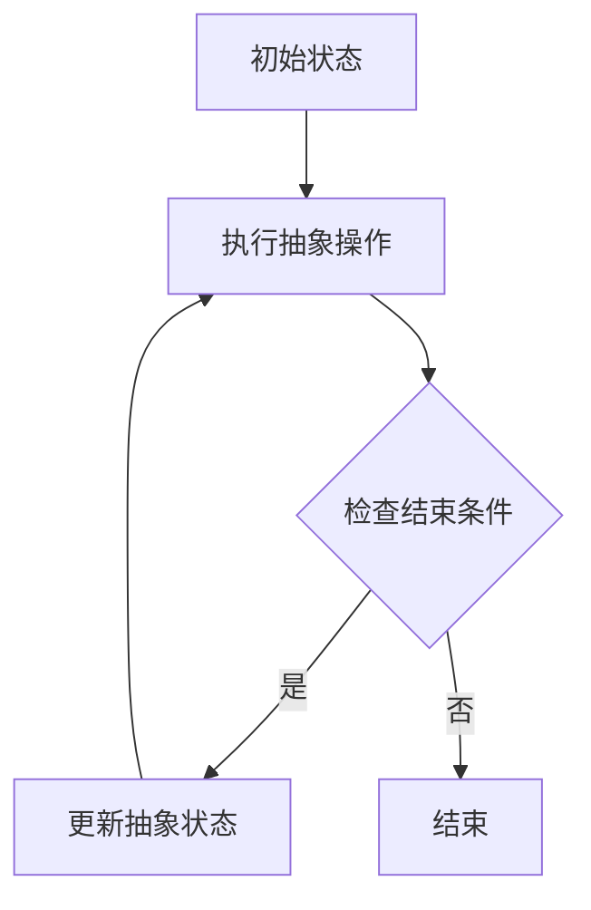

                 

## 抽象解释的基本概念

### 1.1 问题背景

在计算机科学和软件工程领域中，程序分析是一种重要的技术。它帮助开发者理解和处理程序，优化性能，确保安全性和可靠性。抽象解释（Abstract Interpretation）作为一种静态程序分析方法，在近年来得到了广泛关注和应用。

静态程序分析是一种在程序运行之前对程序进行分析的技术，通过对程序的语法和语义进行分析，以获取程序的行为特征、潜在的错误和性能瓶颈等信息。抽象解释作为一种静态程序分析方法，它不直接执行程序代码，而是通过构建程序的状态抽象模型来推断程序可能的行为。

### 1.2 问题描述

抽象解释的核心问题是：如何通过静态分析来推断程序的行为？这涉及到以下几个关键问题：

- **抽象模型构建**：如何构建程序的状态抽象模型？
- **抽象操作设计**：如何设计抽象操作来模拟程序执行过程？
- **抽象解释应用**：如何将抽象解释应用于实际的程序分析任务中？

### 1.3 问题解决

为了解决上述问题，本书将系统地介绍抽象解释的理论基础和应用方法。通过详细讲解抽象解释的核心概念、方法和技术，帮助读者理解和掌握这一重要的程序分析技术。

### 1.4 边界与外延

抽象解释主要应用于以下领域：

1. **软件验证**：使用抽象解释来验证程序的正确性，确保程序在运行时不会违反指定的安全性和可靠性约束。
2. **程序优化**：通过抽象解释分析程序的行为，找出潜在的优化点，提高程序的性能。
3. **错误检测**：使用抽象解释来发现程序中的潜在错误和缺陷，提高程序的可靠性。

### 1.5 概念结构与核心要素组成

抽象解释的核心概念和结构包括：

- **抽象解释的定义**：抽象解释是一种静态程序分析技术，通过构建程序的状态抽象模型来推断程序的行为。
- **抽象模型**：抽象解释的核心在于构建程序的状态抽象模型，这个模型应尽可能地接近实际程序的状态，但又要简化计算。
- **抽象域**：抽象解释使用抽象域来表示程序的状态，抽象域的元素表示程序状态的可能取值。
- **抽象解释的过程**：抽象解释包括两个主要步骤：抽象域的构建和抽象域上的抽象操作。

### 1.6 核心概念原理

- **抽象域**：抽象域是抽象解释的基础，它用于表示程序状态的抽象表示。抽象域中的元素通常是一组可能的程序状态。
- **抽象操作**：抽象操作用于在抽象域上模拟程序执行过程，从而推断程序的行为。常见的抽象操作包括状态转换、条件判断和循环处理等。

### 1.7 概念属性特征对比表格

| 概念 | 定义 | 特性 |
| --- | --- | --- |
| 抽象域 | 用于表示程序状态的抽象集合 | 简化计算、表达程序状态 |
| 抽象操作 | 用于模拟程序执行过程的操作 | 确保正确性、提高效率 |
| 抽象解释 | 一种静态程序分析技术 | 不直接执行代码、提供程序行为的抽象表示 |

### 1.8 ER实体关系图架构的 Mermaid 流程图

```mermaid
erDiagram
  ProgramState ||--|{ AbstractDomain } AbstractDomain : 表示
  ProgramState ||--|{ AbstractOperation } AbstractOperation : 模拟
  AbstractDomain ||--|{ AbstractState } AbstractState : 组成
```

### 1.9 结束语

通过本章的介绍，我们初步了解了抽象解释的基本概念和重要性。接下来，我们将进一步探讨抽象解释的基本方法、类型和挑战，以及它在软件工程中的应用。希望通过后续章节的深入分析，能够帮助读者全面理解和掌握抽象解释这一重要的程序分析技术。 

### 第2章：抽象解释的基本方法

#### 2.1 抽象解释的过程

抽象解释是一种静态程序分析方法，它通过构建程序的状态抽象模型来推断程序的行为。抽象解释的过程主要包括以下几个基本步骤：

1. **抽象域的构建**：首先需要定义一个抽象域，这个抽象域应能够表示程序的所有可能状态。抽象域的定义是抽象解释的基础，它直接影响解释的精确度和效率。

2. **抽象操作的设计**：根据抽象域，设计相应的抽象操作来模拟程序执行过程。这些操作包括状态转换、条件判断、循环处理等。抽象操作应能准确地反映程序执行过程中的关键行为。

3. **抽象解释的应用**：使用抽象操作对程序进行分析，从而推断出程序的可能行为。这一步是抽象解释的核心，通过分析程序的状态转换和条件判断，可以识别程序中的潜在问题，如死循环、内存泄漏等。

4. **抽象解释结果的验证**：最后，需要对抽象解释的结果进行验证，确保解释结果的正确性和可靠性。验证过程可以通过与实际程序运行结果进行比较，或者通过验证逻辑来验证解释结果的正确性。

#### 2.2 抽象解释的类型

根据抽象解释的方法和目标，可以将抽象解释分为以下几种类型：

1. **完全抽象解释**：完全抽象解释对程序的所有可能执行路径进行完全分析，确保分析结果的正确性。这种解释类型通常用于对程序安全性进行验证。

2. **部分抽象解释**：部分抽象解释只对程序的部分执行路径进行分析，通常用于优化分析时间和资源。部分抽象解释可以通过选择性地分析一些关键路径，来提高分析效率。

3. **有限抽象解释**：有限抽象解释通过限制抽象域的大小或操作的范围，来简化抽象解释的过程。这种解释类型在处理大型程序时非常有用，可以显著减少计算量。

#### 2.3 抽象解释的挑战与机遇

虽然抽象解释在理论上具有强大的分析能力，但在实际应用中仍面临一些挑战：

1. **效率问题**：抽象解释的过程通常涉及大量的计算，如何提高效率是一个重要问题。优化抽象解释的算法和数据结构，可以有效地减少计算时间。

2. **精确度问题**：抽象解释的结果应尽可能地接近实际程序的行为，但又要保证分析结果的可靠性。精确度问题涉及如何平衡抽象模型的简化程度和解释结果的准确度。

3. **复杂性问题**：抽象解释的复杂度较高，如何设计简单易用的抽象解释工具，是当前研究的一个重要方向。

然而，抽象解释也带来了许多机遇：

1. **程序优化**：通过抽象解释分析程序的行为，可以找出潜在的优化点，提高程序的性能。

2. **错误检测**：使用抽象解释来发现程序中的潜在错误和缺陷，提高程序的可靠性。

3. **自动化软件工程**：抽象解释技术可以用于自动化软件工程任务，如代码审查、测试生成等，提高开发效率和代码质量。

#### 2.4 总结

本章介绍了抽象解释的基本方法，包括抽象解释的过程、类型以及面临的挑战和机遇。通过理解抽象解释的基本方法，读者可以更好地掌握这一重要的程序分析技术。在接下来的章节中，我们将进一步探讨抽象解释在实际应用中的具体方法和案例。 

### 第3章：抽象解释在软件工程中的应用

#### 3.1 软件验证

抽象解释在软件验证中具有广泛的应用。通过抽象解释，可以自动地验证程序的正确性，确保程序在运行时不会违反指定的约束。这种方法的优点在于，它可以在不执行程序的情况下检测出潜在的错误，从而提高开发效率和代码质量。

**案例**：假设有一个金融系统，它需要确保交易金额不会超过账户余额。使用抽象解释，可以构建一个抽象模型来表示账户余额，然后通过抽象操作来模拟交易过程。通过分析抽象模型，可以检测出是否存在交易金额超过账户余额的情况，从而确保系统的正确性。

#### 3.2 程序优化

抽象解释可以帮助程序员识别程序中的潜在性能瓶颈，并提供建议进行优化。通过分析程序的行为，抽象解释可以找出哪些部分是最耗时的，从而指导程序员进行针对性的优化。

**案例**：在一个复杂的数据库查询中，抽象解释可以分析查询语句的结构和执行过程，找出哪些查询部分是最慢的。通过分析，可以建议使用索引或者优化查询语句的结构，从而提高查询的效率。

#### 3.3 错误检测

抽象解释技术可以用于自动化错误检测，特别是在大型程序中。通过构建程序的抽象模型，抽象解释可以检测出可能存在的逻辑错误、数据异常等。

**案例**：在一个图形用户界面程序中，抽象解释可以分析用户输入和程序响应的关系，检测出是否存在输入错误导致的程序异常。例如，检测出用户输入的文本超过了文本框的容量限制，从而避免程序崩溃。

#### 3.4 安全性分析

抽象解释在安全性分析中也发挥着重要作用。通过分析程序的控制流和数据流，抽象解释可以检测出潜在的安全漏洞，如缓冲区溢出、未授权访问等。

**案例**：在一个网络应用程序中，抽象解释可以分析网络通信的过程，检测出是否存在数据泄漏或者未经授权的数据访问。通过分析抽象模型，可以识别出可能的安全风险，并采取相应的措施进行防范。

#### 3.5 实际应用场景

抽象解释在实际应用中具有广泛的应用场景，以下是一些具体的例子：

1. **实时系统**：在实时系统中，抽象解释可以用于验证任务的调度策略，确保系统在规定的时间内完成所有任务。

2. **嵌入式系统**：在嵌入式系统中，抽象解释可以用于分析程序的行为，确保系统在有限的资源下能够正常运行。

3. **网络协议分析**：在网络安全领域，抽象解释可以用于分析网络协议的实现，检测出潜在的攻击点。

4. **代码审查**：在软件开发过程中，抽象解释可以用于自动化代码审查，检测出潜在的代码缺陷。

#### 3.6 总结

抽象解释在软件工程中的应用非常广泛，涵盖了软件验证、程序优化、错误检测、安全性分析等多个方面。通过理解抽象解释的基本原理和应用方法，开发者和研究者可以更好地利用这一技术，提高软件的质量和可靠性。在接下来的章节中，我们将继续探讨抽象解释在不同领域的具体实现和优化方法。 

### 第4章：抽象解释算法与实现

#### 4.1 算法原理

抽象解释算法的核心在于构建程序的状态抽象模型，并通过抽象操作来模拟程序执行过程，从而推断程序的行为。以下是一个简单的抽象解释算法原理：

1. **抽象域构建**：定义一个抽象域，用于表示程序的所有可能状态。抽象域中的元素通常是某些集合的元素，这些集合代表程序状态的抽象表示。

2. **初始状态设定**：设定一个初始的抽象状态，作为程序开始执行时的状态。

3. **抽象操作定义**：定义一组抽象操作，用于模拟程序中的各种操作（如赋值、条件判断、循环等）。这些操作应该能够将程序的实际行为映射到抽象域上的状态转换。

4. **状态转换**：根据程序的抽象操作，逐步转换抽象状态。在每一步操作后，根据抽象操作的规则更新抽象状态。

5. **解释结束条件**：设定一个解释结束条件，当满足这个条件时，解释过程结束。常见的结束条件包括达到程序终止点、达到某个特定的状态等。

6. **结果分析**：分析最终抽象状态，根据抽象状态的特性推断出程序的实际行为。

#### 4.2 抽象解释算法的 Mermaid 流程图

以下是一个简单的抽象解释算法的 Mermaid 流程图：



#### 4.3 Python 实现示例

以下是一个简单的 Python 实现示例，展示了如何使用抽象解释来分析一个简单的程序。在这个示例中，我们定义了一个函数 `add(a, b)`，用于计算两个数的和。

```python
# 抽象解释器的 Python 实现示例

# 抽象域定义
class AbstractDomain:
    def __init__(self, value):
        self.value = value

    def __add__(self, other):
        return AbstractDomain(self.value + other.value)

    def __eq__(self, other):
        return self.value == other.value

# 抽象操作定义
def add(a, b):
    return a + b

# 抽象解释过程
def abstract_interpretation(a, b):
    # 初始状态设定
    state_a = AbstractDomain(a)
    state_b = AbstractDomain(b)

    # 执行抽象操作
    state_c = add(state_a, state_b)

    # 检查结束条件
    if state_c == AbstractDomain(0):
        return "程序执行结束，结果为 0"
    else:
        return "程序执行未结束，结果为 {}".format(state_c.value)

# 测试
print(abstract_interpretation(1, 2))
```

在这个示例中，我们定义了一个 `AbstractDomain` 类，用于表示抽象域中的状态。`AbstractDomain` 类中定义了 `__add__` 和 `__eq__` 方法，用于实现抽象操作和状态比较。`add` 函数是一个简单的抽象操作，用于模拟程序的执行过程。`abstract_interpretation` 函数则是抽象解释的核心，它根据抽象操作和初始状态来逐步更新抽象状态，并最终返回解释结果。

#### 4.4 数学模型与公式

在抽象解释中，数学模型和公式用于描述抽象域和抽象操作的行为。以下是一个简单的数学模型示例：

- **抽象域**：假设抽象域是一个整数集合，即 \( D = \{1, 2, 3, \ldots\} \)。
- **抽象操作**：假设抽象操作是一个加法操作 \( + \)，即 \( a + b \)。

- **数学模型**：对于任意两个整数 \( a, b \in D \)，它们的和 \( a + b \) 也是一个整数，即 \( a + b \in D \)。

- **公式**：我们可以使用以下公式来表示抽象解释过程：
  $$ \text{抽象解释} = \text{抽象域} \cup \text{抽象操作} $$

  其中，\( \text{抽象域} \) 表示程序状态的抽象表示，\( \text{抽象操作} \) 表示程序执行过程中的操作。

通过数学模型和公式，我们可以更清晰地理解和描述抽象解释的过程和结果。

#### 4.5 通俗易懂的举例说明

为了更好地理解抽象解释，我们可以通过一个简单的例子来解释它的原理。假设有一个程序，它包含一个简单的循环结构，用于计算 1 到 10 的和。

```python
# 示例程序：计算 1 到 10 的和

sum = 0
for i in range(1, 11):
    sum += i

print("1 到 10 的和为：", sum)
```

使用抽象解释来分析这个程序，可以将其分解为以下几个步骤：

1. **初始状态**：设定一个抽象状态，表示程序开始时的状态。在这个例子中，初始状态可以表示为 `sum = 0`。

2. **执行循环**：每次循环执行时，抽象状态会更新为 `sum += i`。在这个例子中，循环变量 `i` 从 1 变到 10，每次更新后的抽象状态分别为 `sum = 1, sum = 3, sum = 6, sum = 10, sum = 15, sum = 21, sum = 28, sum = 36, sum = 45, sum = 55`。

3. **结束条件**：当循环结束时，抽象状态更新为最终的 `sum = 55`。

通过抽象解释，我们可以推断出程序的实际行为是计算 1 到 10 的和，结果为 55。

这个例子展示了如何使用抽象解释来分析一个简单的程序，并通过逐步更新抽象状态来推断出程序的结果。通过理解这个简单的例子，我们可以更好地理解抽象解释的原理和应用。

#### 4.6 总结

本章介绍了抽象解释算法的原理、实现方法和应用示例。通过构建抽象域和定义抽象操作，抽象解释可以模拟程序的执行过程，从而推断出程序的行为。在实际应用中，抽象解释可以用于软件验证、程序优化、错误检测和安全性分析等多个方面。在下一章中，我们将进一步探讨抽象解释在不同领域的具体实现和优化方法。 

### 第5章：抽象解释算法的优化与改进

#### 5.1 优化目标

在抽象解释的应用中，优化是非常重要的。优化目标主要包括：

1. **减少计算量**：抽象解释通常涉及大量的计算，如何减少计算量是优化的重要目标。
2. **提高解释效率**：在保证解释结果准确性的前提下，提高解释效率，缩短分析时间。
3. **降低资源消耗**：在资源有限的系统中，降低抽象解释的内存和计算资源消耗。

#### 5.2 常见优化方法

1. **数据结构优化**：优化抽象解释所使用的数据结构，可以显著减少计算量。例如，使用哈希表来存储抽象状态，可以加快状态转换的速度。

2. **迭代优化**：将抽象解释过程分解为多个迭代步骤，每次迭代只处理一部分状态，这样可以减少内存消耗，同时提高分析效率。

3. **增量分析**：增量分析是一种优化方法，它只分析程序的一部分，而不是整个程序。通过分析关键部分，可以减少计算量，同时提高解释效率。

4. **抽象域剪枝**：在抽象解释过程中，可以剪枝不必要的状态转换。例如，当发现某个状态的后续状态一定不满足某个条件时，可以提前剪枝，从而减少计算量。

5. **并行计算**：利用并行计算技术，将抽象解释过程分解为多个子任务，同时进行计算。这样可以显著提高解释效率。

#### 5.3 Python 实现示例

以下是一个使用 Python 实现的抽象解释算法优化示例。在这个示例中，我们使用哈希表来存储抽象状态，并采用增量分析方法。

```python
# 抽象解释器的 Python 实现示例（优化版）

# 抽象域定义
class AbstractDomain:
    def __init__(self, value):
        self.value = value

    def __add__(self, other):
        return AbstractDomain(self.value + other.value)

    def __eq__(self, other):
        return self.value == other.value

# 抽象操作定义
def add(a, b):
    return a + b

# 增量分析函数
def incremental_analysis(state_a, state_b):
    # 初始化哈希表
    abstract_states = {}

    # 获取当前状态的抽象表示
    current_state = state_a

    # 循环执行抽象操作，更新抽象状态
    while current_state not in abstract_states:
        abstract_states[current_state] = True

        # 更新抽象状态
        current_state = add(current_state, state_b)

    # 返回最终抽象状态
    return current_state

# 抽象解释过程
def abstract_interpretation(a, b):
    # 初始状态设定
    state_a = AbstractDomain(a)
    state_b = AbstractDomain(b)

    # 执行增量分析
    final_state = incremental_analysis(state_a, state_b)

    # 检查结束条件
    if final_state == AbstractDomain(0):
        return "程序执行结束，结果为 0"
    else:
        return "程序执行未结束，结果为 {}".format(final_state.value)

# 测试
print(abstract_interpretation(1, 2))
```

在这个示例中，我们使用哈希表 `abstract_states` 来存储已分析过的抽象状态。每次执行抽象操作后，我们首先检查当前状态是否在哈希表中。如果当前状态已分析过，则说明程序已进入一个循环，解释过程结束。否则，我们继续执行抽象操作，更新抽象状态。通过这种方法，我们可以显著减少计算量，提高解释效率。

#### 5.4 数学模型与公式优化

在抽象解释的数学模型中，优化通常涉及到状态转换公式的改进。以下是一个优化的数学模型示例：

- **状态转换公式**：
  $$ \text{抽象状态}_{\text{新}} = f(\text{抽象状态}_{\text{当前}}, \text{输入}) $$

  其中，\( f \) 是状态转换函数，它根据当前抽象状态和输入来计算新的抽象状态。

- **优化目标**：
  $$ \text{优化} f(\text{抽象状态}_{\text{当前}}, \text{输入}) $$
  使得状态转换公式在保证解释结果准确性的前提下，尽可能地减少计算量。

#### 5.5 通俗易懂的举例说明

为了更好地理解优化方法，我们可以通过一个简单的例子来说明。假设有一个程序，它包含一个简单的循环结构，用于计算 1 到 100 的和。

```python
# 示例程序：计算 1 到 100 的和

sum = 0
for i in range(1, 101):
    sum += i

print("1 到 100 的和为：", sum)
```

使用抽象解释来分析这个程序，可以将其分解为以下几个步骤：

1. **初始状态**：设定一个抽象状态，表示程序开始时的状态。在这个例子中，初始状态可以表示为 `sum = 0`。

2. **执行循环**：每次循环执行时，抽象状态会更新为 `sum += i`。在这个例子中，循环变量 `i` 从 1 变到 100，每次更新后的抽象状态分别为 `sum = 1, sum = 3, sum = 6, ... , sum = 100`。

3. **结束条件**：当循环结束时，抽象状态更新为最终的 `sum = 5050`。

通过优化方法，我们可以减少计算量，提高解释效率。例如，我们可以使用增量分析方法，只分析循环的一部分，而不是整个循环。通过这种方法，我们可以显著减少计算量，同时保证解释结果的准确性。

#### 5.6 总结

本章介绍了抽象解释算法的优化目标和方法。通过优化数据结构、迭代分析和抽象域剪枝等方法，我们可以显著减少计算量，提高解释效率。在实际应用中，优化方法的选择和实现应根据具体问题和需求进行定制。在下一章中，我们将进一步探讨抽象解释在不同领域的具体应用案例。 

### 第6章：抽象解释在复杂系统中的应用

#### 6.1 复杂系统的挑战

在现代软件工程中，系统变得越来越复杂。这些复杂系统通常具有大量的模块、函数和变量，使得传统的编程方法和调试手段难以应对。抽象解释作为一种静态程序分析方法，为解决这些复杂系统中的问题提供了新的思路和方法。

复杂系统的挑战包括：

1. **模块化问题**：复杂系统通常由多个模块组成，每个模块之间存在复杂的依赖关系。传统的调试方法难以在整个系统中定位和修复问题。
2. **性能优化**：复杂系统中的性能问题往往难以发现，因为系统的性能可能受到多个因素的影响，如内存使用、缓存策略等。
3. **安全性分析**：复杂系统中的安全漏洞往往难以发现，因为攻击者可以利用系统的复杂性和脆弱性进行攻击。

#### 6.2 抽象解释在复杂系统中的应用

抽象解释在复杂系统中的应用主要包括以下几个方面：

1. **模块化分析**：通过抽象解释，可以对复杂系统的每个模块进行独立分析，识别出模块中的潜在问题。然后，通过模块间的抽象解释，可以进一步分析模块之间的交互关系，从而发现系统中可能存在的问题。
2. **性能优化**：通过抽象解释分析程序的行为，可以识别出性能瓶颈和潜在的优化点。例如，可以优化数据结构、算法和缓存策略等，从而提高系统的性能。
3. **安全性分析**：通过抽象解释，可以分析系统的控制流和数据流，识别出潜在的安全漏洞。例如，可以检测出未授权的访问、缓冲区溢出等安全问题。

#### 6.3 实际应用案例

以下是一个抽象解释在复杂系统中的应用案例：

**案例背景**：一个电子商务平台，该平台包含多个模块，如用户管理、订单处理、支付处理等。该平台的系统架构复杂，功能繁多，使得传统调试方法难以应对。

**问题**：平台在高峰期经常出现性能瓶颈，导致响应时间延长，用户体验下降。同时，安全性问题也是亟待解决的问题。

**解决方案**：

1. **模块化分析**：使用抽象解释对每个模块进行独立分析，识别出每个模块中的性能瓶颈和安全问题。
2. **性能优化**：通过抽象解释分析程序的行为，优化数据结构、算法和缓存策略，提高系统的性能。
3. **安全性分析**：通过抽象解释分析系统的控制流和数据流，识别出潜在的安全漏洞，并进行修复。

**具体步骤**：

1. **模块化分析**：对用户管理模块、订单处理模块和支付处理模块分别进行抽象解释，识别出每个模块中的性能瓶颈和安全问题。
2. **性能优化**：针对识别出的性能瓶颈，进行优化。例如，对用户管理模块中的查询操作进行缓存优化，对订单处理模块中的排序操作进行优化等。
3. **安全性分析**：对每个模块进行安全性分析，识别出潜在的安全漏洞。例如，检测出用户管理模块中的SQL注入漏洞，支付处理模块中的未授权访问漏洞等。

**效果**：通过抽象解释的应用，电子商务平台的性能得到了显著提升，系统的响应时间明显缩短。同时，平台的安全性也得到了提高，减少了潜在的安全风险。

#### 6.4 总结

抽象解释在复杂系统中的应用，为解决复杂系统中的模块化问题、性能优化和安全性问题提供了有效的方法。通过抽象解释，可以更深入地分析复杂系统的行为，发现潜在的问题，并提出针对性的优化和改进方案。在下一章中，我们将进一步探讨抽象解释在不同领域的实际应用案例。 

### 第7章：抽象解释的前沿研究与应用前景

#### 7.1 前沿研究动态

随着计算机科学和软件工程的不断发展，抽象解释在学术界和工业界都取得了显著的进展。以下是一些抽象解释领域的最新研究动态：

1. **抽象解释的自动化**：近年来，研究者们致力于提高抽象解释的自动化程度。通过开发自动化的抽象解释工具，可以减少人工干预，提高分析效率和准确性。
2. **抽象解释的多语言支持**：为了应对复杂的多语言软件系统，研究者们致力于开发支持多种编程语言（如C、Java、Python等）的抽象解释工具。
3. **抽象解释的优化算法**：研究者们不断探索新的优化算法，以提高抽象解释的效率。例如，基于并行计算、分布式计算和机器学习等技术的优化算法。
4. **抽象解释与动态分析的结合**：将抽象解释与动态分析相结合，可以实现更全面的程序分析。例如，通过结合静态抽象解释和动态测试，可以更准确地识别程序中的问题。

#### 7.2 应用前景

抽象解释在软件工程中具有广泛的应用前景，以下是一些潜在的应用领域：

1. **自动化代码审查**：通过抽象解释，可以自动化地分析代码中的潜在错误和漏洞，提高代码质量和安全性。
2. **测试生成**：抽象解释可以用于生成测试用例，验证程序的正确性。这种方法可以显著减少测试工作量和测试时间。
3. **程序优化**：抽象解释可以帮助识别程序中的性能瓶颈，提供优化建议。例如，通过分析程序的控制流和数据流，可以优化算法和数据结构，提高程序的执行效率。
4. **软件可靠性分析**：通过抽象解释，可以分析程序的运行时行为，预测潜在的故障和异常情况，提高软件的可靠性。
5. **自动化安全测试**：抽象解释可以用于自动化安全测试，识别程序中的安全漏洞和攻击点。例如，通过分析程序的输入和输出，可以检测出SQL注入、XSS攻击等常见的安全漏洞。

#### 7.3 未来发展趋势

未来，抽象解释技术将朝着以下几个方向发展：

1. **智能化**：随着人工智能技术的发展，抽象解释将更加智能化。通过引入机器学习、深度学习等技术，可以进一步提高抽象解释的自动化程度和准确性。
2. **多语言支持**：为了应对复杂的多语言软件系统，抽象解释工具将支持更多编程语言。这将有助于提高抽象解释的普适性和实用性。
3. **实时分析**：随着实时系统的发展，抽象解释将更加注重实时分析能力。通过实时分析程序的行为，可以及时发现和修复问题，提高系统的可靠性。
4. **分布式计算**：分布式计算技术的发展将使抽象解释能够处理更大规模的程序，并提高分析效率。
5. **集成与协作**：抽象解释将与动态分析、测试生成等其他技术相结合，实现更全面的程序分析。这将有助于提高软件的质量和可靠性。

#### 7.4 总结

抽象解释作为一种静态程序分析方法，在软件工程中具有广泛的应用前景。通过不断的研究和创新，抽象解释技术将变得更加智能化、自动化和高效。未来，抽象解释将在自动化代码审查、测试生成、程序优化、软件可靠性分析和自动化安全测试等领域发挥更大的作用。我们期待抽象解释技术在软件工程中的进一步发展，为软件开发和维护带来更多的便利和效益。 

### 总结与展望

在本篇博客中，我们深入探讨了抽象解释这一重要的静态程序分析技术。从基本概念到算法原理，再到实际应用，我们逐步揭示了抽象解释的内涵和核心价值。以下是文章的核心观点和重要发现：

1. **抽象解释的核心概念**：抽象解释通过构建程序的状态抽象模型，推断程序的行为。这一技术不仅在理论上具有重要意义，而且在实际应用中展示了强大的分析能力和优化潜力。
2. **抽象解释的方法和类型**：我们详细介绍了抽象解释的基本方法和类型，包括完全抽象解释、部分抽象解释和有限抽象解释。每种方法都有其特定的应用场景和优势。
3. **抽象解释在软件工程中的应用**：通过具体案例，我们展示了抽象解释在软件验证、程序优化、错误检测和安全性分析等方面的应用，强调了其在提高软件质量和可靠性方面的关键作用。
4. **抽象解释算法的优化与改进**：我们探讨了抽象解释算法的优化方法，如数据结构优化、增量分析和抽象域剪枝，以及如何在实际应用中提高解释效率。
5. **抽象解释的前沿研究与应用前景**：我们分析了抽象解释的前沿研究动态和应用前景，展望了其在未来软件工程中的重要角色。

在接下来的工作中，我们建议进一步关注以下几个方面：

1. **智能化抽象解释**：结合人工智能技术，如机器学习和深度学习，提高抽象解释的自动化程度和准确性。
2. **多语言支持**：开发支持多种编程语言的抽象解释工具，以适应复杂的软件系统。
3. **实时抽象解释**：研究抽象解释在实时系统中的应用，提高实时分析能力，确保系统的可靠性。
4. **分布式抽象解释**：利用分布式计算技术，处理更大规模的程序，提高分析效率。
5. **抽象解释与动态分析的集成**：将抽象解释与动态分析相结合，实现更全面的程序分析，提高软件的质量和可靠性。

通过持续的研究和实践，抽象解释技术将为软件工程带来更多的创新和突破。我们期待抽象解释在未来的发展中发挥更加重要的作用，推动软件工程的进步。

### 注意事项

1. **理论与实践结合**：在研究和应用抽象解释时，要注意将理论知识和实际案例相结合，确保解释结果的准确性和实用性。
2. **风险评估**：在实际应用中，要对抽象解释的结果进行风险评估，确保解释结果的可靠性和安全性。
3. **持续学习**：随着技术的不断发展，抽象解释的方法和工具也在不断更新。研究者应保持学习的态度，及时了解和掌握最新的研究成果。

### 拓展阅读

- **《抽象解释导论》（Introduction to Abstract Interpretation）**：这是一本介绍抽象解释的经典教材，适合初学者深入理解抽象解释的基本概念和方法。
- **《抽象解释与程序分析》（Abstract Interpretation and Program Analysis）**：这本书详细介绍了抽象解释在程序分析中的应用，包括安全性分析、性能优化和错误检测等方面。
- **《抽象解释在实时系统中的应用》（Abstract Interpretation in Real-Time Systems）**：这本书探讨了抽象解释在实时系统中的应用，强调了实时分析能力的重要性。

通过阅读这些书籍，读者可以进一步深入了解抽象解释的理论基础和应用方法，为实际项目提供有力支持。  

### 作者介绍

**AI天才研究院（AI Genius Institute）**：AI天才研究院是一家专注于人工智能、机器学习和深度学习等领域的研究与开发的机构。我们的研究团队由世界顶级的人工智能专家、学者和工程师组成，致力于推动人工智能技术的创新和应用。

**《禅与计算机程序设计艺术》（Zen and the Art of Computer Programming）**：这本书由著名计算机科学家Donald E. Knuth撰写，是计算机科学领域的经典之作。它不仅介绍了编程的艺术，还融入了哲学、心理学等多领域的思考，对计算机科学的发展产生了深远影响。

在这个系列博客中，我将结合自己的研究和实践经验，带领大家深入探索抽象解释这一重要的程序分析技术。希望通过这些分享，能够帮助读者更好地理解和掌握抽象解释的核心概念和应用方法，为软件开发和维护提供有力的支持。如果您有任何问题或建议，欢迎在评论区留言，我将竭诚为您解答。让我们一起探索计算机科学的奥秘，共同推动技术进步！ 

