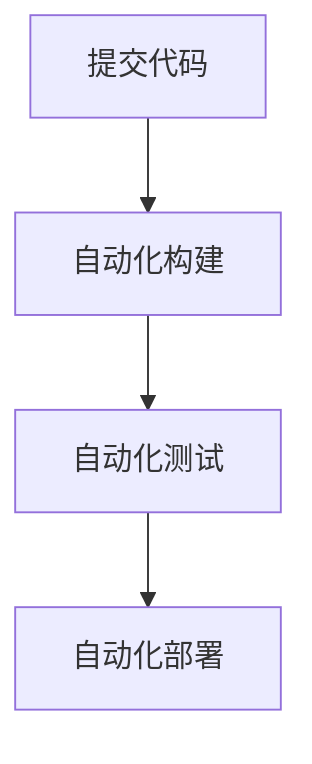
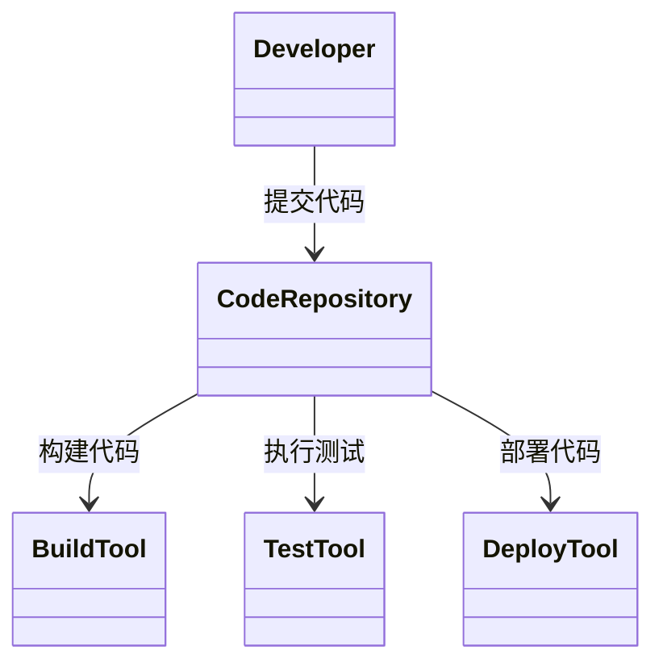
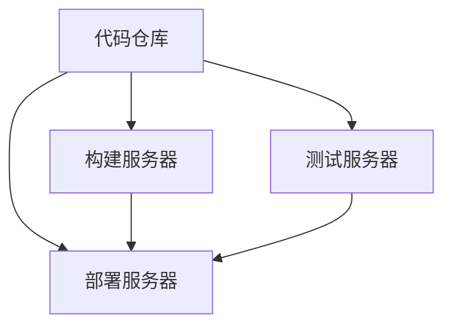
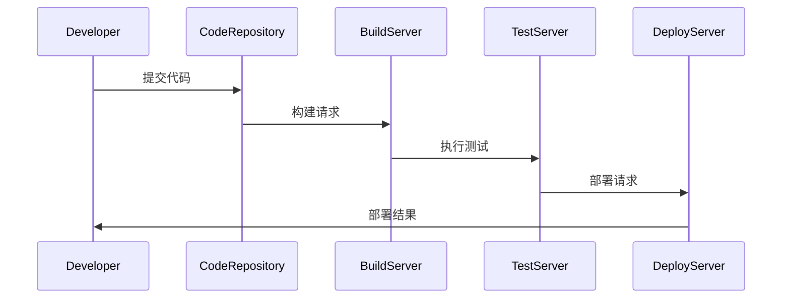
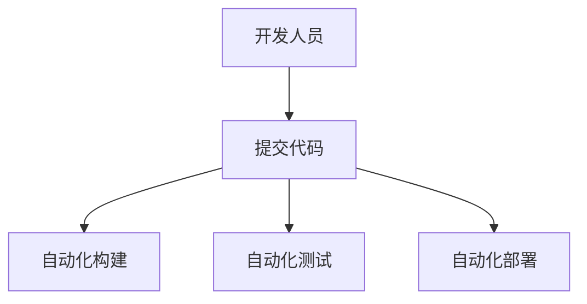
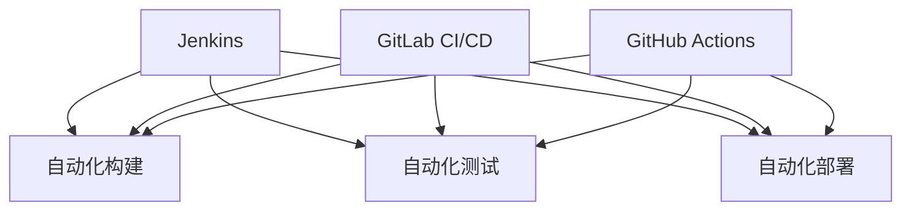
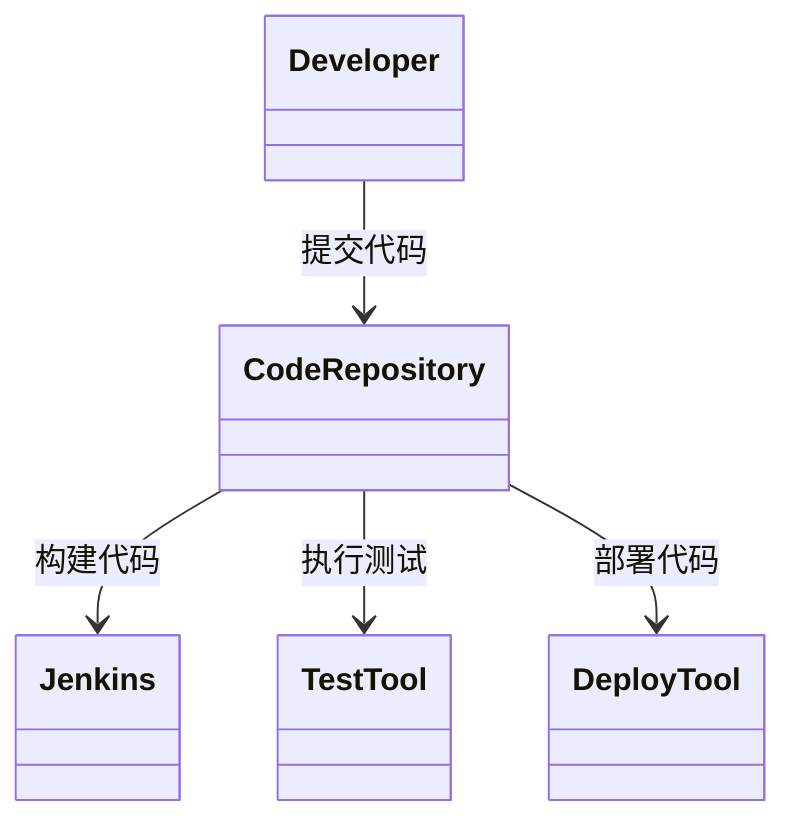
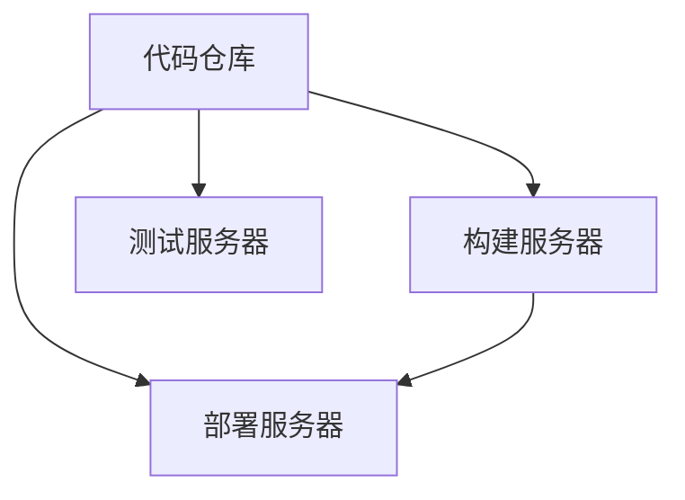
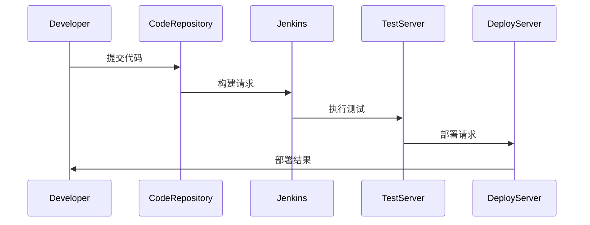

                 

### 文章标题

### 关键词

- 持续集成（CI）
- 开发周期
- 自动化测试
- 持续部署
- DevOps

### 摘要

本文将深入探讨持续集成（CI）的最佳实践，阐述其在加速开发周期中的重要作用。我们将从基础知识入手，逐步分析持续集成的工作流程、工具与实践，并在最后分享一些高级特性和未来趋势。通过本文，读者将全面了解如何利用持续集成优化软件开发过程，提高开发效率和软件质量。

### 第一部分：持续集成（CI）的基础知识

#### 第1章：持续集成概述

#### 1.1 什么是持续集成

持续集成（Continuous Integration，简称CI）是一种软件开发实践，通过频繁地将代码合并到一个共享的代码库中，并立即进行自动化构建、测试和部署。其核心目标是确保代码的质量，减少集成时的冲突，提高软件交付的速度和稳定性。

**核心概念术语说明：**
- **持续集成（Continuous Integration）：** 一种软件开发实践，旨在通过自动化构建、测试和部署来确保代码质量。
- **自动化构建：** 使用工具自动执行编译、打包等操作，生成可执行的代码。
- **自动化测试：** 使用工具自动执行测试用例，验证代码的功能和性能。
- **持续部署（Continuous Deployment）：** 在持续集成的基础上，将代码自动部署到生产环境。

**问题背景：** 软件开发过程中，代码合并是一个常见且复杂的问题。传统开发模式中，开发人员通常在项目末期才进行代码合并，这往往导致大量集成问题和长时间的测试周期。而持续集成通过频繁的代码合并和即时测试，有效减少了这些问题。

**问题描述：** 如何在软件开发过程中实现高效的代码合并和测试，确保软件质量，并缩短开发周期？

**问题解决：** 通过引入持续集成实践，开发人员可以在每次提交代码后立即进行自动化测试和构建，及时发现和解决集成问题。这样可以确保代码库中的每个分支都是稳定和可用的，从而提高开发效率和软件质量。

**边界与外延：** 持续集成不仅适用于单体应用，还可以应用于微服务架构。在微服务架构中，持续集成有助于确保各个微服务的集成和协同工作。

**概念结构与核心要素组成：**
1. **代码库：** 存储所有版本代码的地方。
2. **构建工具：** 自动化编译、打包等操作的软件工具。
3. **测试工具：** 自动化执行测试用例的软件工具。
4. **部署工具：** 自动化部署代码到测试或生产环境的软件工具。

**核心概念原理：**
- **自动化：** 持续集成的核心原理之一，通过自动化工具来减少人工操作，提高效率和准确性。
- **频繁集成：** 频繁地将代码合并到共享库中，以确保问题尽早被发现和解决。

**概念属性特征对比表格：**

| 概念        | 特征                             |
|-------------|----------------------------------|
| 持续集成    | 自动化、频繁集成、早期反馈       |
| 自动化构建  | 自动执行编译、打包等操作         |
| 自动化测试  | 自动执行测试用例，验证功能与性能 |
| 持续部署    | 自动化部署代码到测试或生产环境   |

**ER实体关系图架构的Mermaid流程图：**

```mermaid
erDiagram
    CodeRepository ||--|{ BuildTool : uses }
    CodeRepository ||--|{ TestTool : uses }
    CodeRepository ||--|{ DeployTool : uses }
    BuildTool ||--|{ BuildProcess : includes }
    TestTool ||--|{ TestProcess : includes }
    DeployTool ||--|{ DeployProcess : includes }
```

**算法原理讲解：**

持续集成涉及多个步骤，其中核心步骤包括代码提交、自动化构建、自动化测试和自动化部署。以下是这些步骤的Mermaid流程图和Python源代码示例：

**Mermaid流程图：**



**Python源代码示例：**

```python
import subprocess

# 提交代码
def commit_code():
    subprocess.run(["git", "commit", "-m", "new_commit"])

# 自动化构建
def build_project():
    subprocess.run(["mvn", "clean", "package"])

# 自动化测试
def run_tests():
    subprocess.run(["mvn", "test"])

# 自动化部署
def deploy_project():
    subprocess.run(["docker", "build", "-t", "project_image", "."])
    subprocess.run(["docker", "push", "project_image"])

# 执行持续集成流程
def ci_process():
    commit_code()
    build_project()
    run_tests()
    deploy_project()
    
ci_process()
```

通过上述Python代码示例，我们可以看到如何通过命令行工具实现持续集成流程的自动化。这里使用了Git进行版本控制，Maven进行构建和测试，Docker进行部署。

**数学模型和公式：**

持续集成涉及到多个参数，如代码提交频率、测试覆盖率、部署成功率等。以下是一个简单的数学模型：

$$
CI\ 效率 = \frac{测试覆盖率 \times 部署成功率}{代码提交频率}
$$

其中，测试覆盖率和部署成功率越高，持续集成效率越高。

**详细讲解和举例说明：**

假设一个开发团队每天提交10次代码，每次提交后都进行自动化构建、测试和部署。测试覆盖率为90%，部署成功率为95%。根据上述数学模型，我们可以计算出该团队的持续集成效率为：

$$
CI\ 效率 = \frac{0.9 \times 0.95}{10} = 0.0865
$$

这意味着该团队每天有约8.65%的时间被用于持续集成过程。通过优化测试覆盖率和部署成功率，可以提高持续集成效率。

**系统分析与架构设计方案：**

在持续集成系统中，我们需要考虑代码存储、构建、测试和部署等环节。以下是一个简单的架构设计方案：

**问题场景介绍：** 假设我们正在开发一个Web应用，开发团队由10名开发人员组成，每天提交多次代码。

**项目介绍：** 项目名称为“在线购物平台”，包括商品展示、购物车、订单管理等模块。

**系统功能设计（领域模型Mermaid类图）：**



**系统架构设计Mermaid架构图：**



**系统接口设计和系统交互Mermaid序列图：**



通过上述架构设计方案，我们可以确保代码在提交后能够快速通过构建、测试和部署环节，从而提高开发效率和软件质量。

**项目实战：**

为了更好地理解持续集成，我们将在实际项目中应用上述概念和架构设计方案。以下是一个简化的项目实战流程：

1. **环境安装：** 安装Git、Maven、Docker等工具，并配置相应的版本控制库和构建环境。
2. **系统核心实现源代码：** 创建一个简单的Web应用项目，包括MVC三层架构（Model、View、Controller）。
3. **代码应用解读与分析：** 分析项目结构，理解各个模块的功能和交互。
4. **实际案例分析和详细讲解剖析：** 在项目中实现持续集成，从代码提交到部署的整个过程。

通过项目实战，我们可以更深入地理解持续集成的原理和实践，并在实际项目中应用这些知识。

**最佳实践 tips：**
- 确保代码库整洁，减少冗余和重复代码。
- 频繁提交小改动，避免大规模代码更新。
- 选择合适的自动化测试策略，确保测试覆盖率。
- 定期审查和优化持续集成流程。

**小结：** 持续集成是一种高效的软件开发实践，通过自动化构建、测试和部署，可以提高开发效率和软件质量。在实际项目中，持续集成可以帮助开发团队更好地管理代码、检测问题，并快速交付高质量的软件产品。

#### 第2章：持续集成的工作流程

#### 2.1 持续集成的基本流程

持续集成的基本流程包括以下几个关键步骤：提交代码、自动化构建、自动化测试和自动化部署。以下是对这些步骤的详细解释和最佳实践。

**提交代码：** 提交代码是持续集成流程的第一步。开发人员将他们的更改提交到共享的代码库中。最佳实践包括：

- **频繁提交：** 频繁提交小改动可以减少代码冲突，提高代码库的稳定性。
- **代码格式规范：** 保持代码格式一致性，使用代码格式化工具自动格式化代码。
- **提交信息规范：** 每次提交时，提供详细的提交信息，便于追溯和管理。

**自动化构建：** 自动化构建是将代码转换为可执行形式的过程。构建工具（如Maven、Gradle）用于自动化构建流程。最佳实践包括：

- **构建脚本优化：** 优化构建脚本，确保构建过程快速且可重复。
- **缓存依赖：** 缓存依赖项，减少不必要的重复下载和编译时间。
- **并行构建：** 利用多核处理能力，并行构建多个模块，提高构建速度。

**自动化测试：** 自动化测试是在构建完成后对代码进行验证的过程。测试工具（如JUnit、TestNG）用于自动化执行测试用例。最佳实践包括：

- **测试覆盖率：** 确保测试覆盖率足够高，覆盖关键功能和边界情况。
- **单元测试和集成测试：** 结合单元测试和集成测试，全面验证代码的正确性和性能。
- **持续测试：** 将测试集成到构建流程中，确保每次提交后都能立即进行测试。

**自动化部署：** 自动化部署是将代码部署到生产环境的过程。部署工具（如Docker、Kubernetes）用于自动化部署流程。最佳实践包括：

- **部署脚本：** 编写明确的部署脚本，确保部署过程可重复和可追溯。
- **容器化：** 利用容器化技术（如Docker），简化部署流程，提高部署的稳定性和可移植性。
- **蓝绿部署和灰度发布：** 使用蓝绿部署和灰度发布等技术，降低部署风险，提高系统的可用性和稳定性。

**边界与外延：** 持续集成的工作流程不仅适用于单体应用，还可以应用于微服务架构。在微服务架构中，持续集成有助于确保各个微服务的集成和协同工作。此外，持续集成还可以与其他DevOps实践（如持续部署、持续监控）相结合，实现更全面的软件交付流程。

**核心概念原理：**
- **自动化构建：** 利用构建工具自动化编译、打包和依赖管理。
- **自动化测试：** 利用测试工具自动化执行测试用例，验证代码的功能和性能。
- **自动化部署：** 利用部署工具自动化部署代码到生产环境。

**概念属性特征对比表格：**

| 概念        | 特征                             |
|-------------|----------------------------------|
| 提交代码    | 频繁、小改动、清晰的提交信息     |
| 自动化构建  | 快速、可重复、优化构建脚本       |
| 自动化测试  | 覆盖率、单元测试、集成测试       |
| 自动化部署  | 可重复、容器化、蓝绿部署和灰度发布 |

**ER实体关系图架构的Mermaid流程图：**



**算法原理讲解：**

持续集成中的自动化构建、测试和部署涉及到多个步骤和工具。以下是这些步骤的Mermaid流程图和Python源代码示例：

**Mermaid流程图：**


**Python源代码示例：**

```python
import subprocess

# 提交代码
def commit_code():
    subprocess.run(["git", "commit", "-m", "new_commit"])

# 自动化构建
def build_project():
    subprocess.run(["mvn", "clean", "package"])

# 自动化测试
def run_tests():
    subprocess.run(["mvn", "test"])

# 自动化部署
def deploy_project():
    subprocess.run(["docker", "build", "-t", "project_image", "."])
    subprocess.run(["docker", "push", "project_image"])

# 执行持续集成流程
def ci_process():
    commit_code()
    build_project()
    run_tests()
    deploy_project()
    
ci_process()
```

通过上述Python代码示例，我们可以看到如何通过命令行工具实现持续集成流程的自动化。这里使用了Git进行版本控制，Maven进行构建和测试，Docker进行部署。

**数学模型和公式：**

持续集成涉及到多个参数，如代码提交频率、测试覆盖率、部署成功率等。以下是一个简单的数学模型：

$$
CI\ 效率 = \frac{测试覆盖率 \times 部署成功率}{代码提交频率}
$$

其中，测试覆盖率和部署成功率越高，持续集成效率越高。

**详细讲解和举例说明：**

假设一个开发团队每天提交10次代码，每次提交后都进行自动化构建、测试和部署。测试覆盖率为90%，部署成功率为95%。根据上述数学模型，我们可以计算出该团队的持续集成效率为：

$$
CI\ 效率 = \frac{0.9 \times 0.95}{10} = 0.0865
$$

这意味着该团队每天有约8.65%的时间被用于持续集成过程。通过优化测试覆盖率和部署成功率，可以提高持续集成效率。

**系统分析与架构设计方案：**

在持续集成系统中，我们需要考虑代码存储、构建、测试和部署等环节。以下是一个简单的架构设计方案：

**问题场景介绍：** 假设我们正在开发一个Web应用，开发团队由10名开发人员组成，每天提交多次代码。

**项目介绍：** 项目名称为“在线购物平台”，包括商品展示、购物车、订单管理等模块。

**系统功能设计（领域模型Mermaid类图）：**


**系统架构设计Mermaid架构图：**


**系统接口设计和系统交互Mermaid序列图：**


通过上述架构设计方案，我们可以确保代码在提交后能够快速通过构建、测试和部署环节，从而提高开发效率和软件质量。

**项目实战：**

为了更好地理解持续集成，我们将在实际项目中应用上述概念和架构设计方案。以下是一个简化的项目实战流程：

1. **环境安装：** 安装Git、Maven、Docker等工具，并配置相应的版本控制库和构建环境。
2. **系统核心实现源代码：** 创建一个简单的Web应用项目，包括MVC三层架构（Model、View、Controller）。
3. **代码应用解读与分析：** 分析项目结构，理解各个模块的功能和交互。
4. **实际案例分析和详细讲解剖析：** 在项目中实现持续集成，从代码提交到部署的整个过程。

通过项目实战，我们可以更深入地理解持续集成的原理和实践，并在实际项目中应用这些知识。

**最佳实践 tips：**
- 确保代码库整洁，减少冗余和重复代码。
- 频繁提交小改动，避免大规模代码更新。
- 选择合适的自动化测试策略，确保测试覆盖率。
- 定期审查和优化持续集成流程。

**小结：** 持续集成的工作流程是软件开发过程中不可或缺的一部分。通过自动化构建、测试和部署，可以大大提高开发效率和软件质量。在实际项目中，持续集成可以帮助开发团队更好地管理代码、检测问题，并快速交付高质量的软件产品。

#### 第3章：持续集成工具与实践

#### 3.1 持续集成工具概述

在持续集成（CI）实践中，选择合适的工具至关重要。目前市场上存在多种持续集成工具，如Jenkins、GitLab CI/CD和GitHub Actions等。这些工具各有特点，适用于不同的项目需求。

**Jenkins：** Jenkins是一个开源的持续集成工具，具有强大的插件生态系统，支持各种开发语言的构建和测试。Jenkins的优点包括：
- **灵活性：** 支持多种构建环境和插件，可根据项目需求进行定制。
- **社区支持：** 拥有庞大的社区，丰富的文档和插件资源。
- **可扩展性：** 可以通过插件扩展功能，支持多种持续集成需求。

**GitLab CI/CD：** GitLab CI/CD是GitLab自带的持续集成和持续部署工具。它具有以下优点：
- **集成性：** 与GitLab的版本控制系统深度集成，方便管理代码和构建过程。
- **简单性：** 配置简单，只需编写`.gitlab-ci.yml`文件即可。
- **可定制性：** 支持多种构建环境和脚本，可根据项目需求进行定制。

**GitHub Actions：** GitHub Actions是GitHub提供的持续集成和持续部署工具。其优点包括：
- **免费：** 提供免费的构建环境和测试服务。
- **集成性：** 与GitHub深度集成，方便管理代码和构建过程。
- **扩展性：** 支持多种操作系统和编程语言，可通过Marketplace安装插件。

**对比表格：**

| 工具         | 特点                     | 适用场景                          |
|--------------|------------------------|----------------------------------|
| Jenkins      | 灵活性、社区支持、可扩展性 | 复杂的构建和测试流程、多样化的项目需求 |
| GitLab CI/CD | 集成性、简单性、可定制性 | 与GitLab版本控制系统集成、中小型项目  |
| GitHub Actions | 免费、集成性、扩展性     | GitHub项目、简单的构建和测试流程     |

**ER实体关系图架构的Mermaid流程图：**



**算法原理讲解：**

持续集成工具的核心功能包括自动化构建、自动化测试和自动化部署。以下是这些工具的算法原理和流程：

**Jenkins：**
- **自动化构建：** Jenkins使用构建管道（Pipeline）进行自动化构建。构建管道是一个定义构建流程的脚本，支持多种编程语言。通过插件扩展，Jenkins可以支持多种构建环境和工具。
- **自动化测试：** Jenkins可以与各种测试工具集成，如JUnit、TestNG等。测试结果将被记录并用于决策，如失败时触发通知或停止构建。
- **自动化部署：** Jenkins支持与部署工具（如Docker、Kubernetes）集成，实现自动化部署。通过配置，Jenkins可以自动部署到测试或生产环境。

**GitLab CI/CD：**
- **自动化构建：** GitLab CI/CD使用`.gitlab-ci.yml`文件定义构建流程。该文件包含构建脚本、依赖和环境配置等。构建过程中，GitLab CI/CD会自动拉取代码并执行构建命令。
- **自动化测试：** GitLab CI/CD支持多种测试工具和框架，如JUnit、TestNG等。测试结果将被记录并用于决策。
- **自动化部署：** GitLab CI/CD支持自动化部署到测试或生产环境。通过配置，GitLab CI/CD可以将构建好的代码部署到容器或虚拟机中。

**GitHub Actions：**
- **自动化构建：** GitHub Actions使用`.github/workflows`目录下的YAML文件定义构建流程。构建过程中，GitHub Actions会自动拉取代码并执行构建命令。
- **自动化测试：** GitHub Actions支持多种测试工具和框架，如JUnit、TestNG等。测试结果将被记录并用于决策。
- **自动化部署：** GitHub Actions支持自动化部署到容器或虚拟机中。通过配置，GitHub Actions可以将构建好的代码部署到测试或生产环境。

**数学模型和公式：**

持续集成工具的效率可以通过以下数学模型来衡量：

$$
CI\ 效率 = \frac{构建成功比例 \times 测试成功比例 \times 部署成功比例}{构建次数}
$$

其中，构建成功比例、测试成功比例和部署成功比例越高，持续集成效率越高。

**详细讲解和举例说明：**

假设一个项目使用Jenkins作为持续集成工具，每天进行10次构建。构建成功比例为90%，测试成功比例为95%，部署成功比例为90%。根据上述数学模型，我们可以计算出该项目的持续集成效率为：

$$
CI\ 效率 = \frac{0.9 \times 0.95 \times 0.9}{10} = 0.07735
$$

这意味着该项目的持续集成效率为7.735%。通过优化构建、测试和部署流程，可以提高持续集成效率。

**系统分析与架构设计方案：**

在持续集成系统中，我们需要考虑代码存储、构建、测试和部署等环节。以下是一个简单的架构设计方案：

**问题场景介绍：** 假设我们正在开发一个Web应用，开发团队由10名开发人员组成，每天提交多次代码。

**项目介绍：** 项目名称为“在线购物平台”，包括商品展示、购物车、订单管理等模块。

**系统功能设计（领域模型Mermaid类图）：**



**系统架构设计Mermaid架构图：**



**系统接口设计和系统交互Mermaid序列图：**



通过上述架构设计方案，我们可以确保代码在提交后能够快速通过构建、测试和部署环节，从而提高开发效率和软件质量。

**项目实战：**

为了更好地理解持续集成工具，我们将在实际项目中应用上述概念和架构设计方案。以下是一个简化的项目实战流程：

1. **环境安装：** 安装Jenkins、Git、Maven、Docker等工具，并配置相应的版本控制库和构建环境。
2. **系统核心实现源代码：** 创建一个简单的Web应用项目，包括MVC三层架构（Model、View、Controller）。
3. **代码应用解读与分析：** 分析项目结构，理解各个模块的功能和交互。
4. **实际案例分析和详细讲解剖析：** 在项目中实现持续集成，从代码提交到部署的整个过程。

通过项目实战，我们可以更深入地理解持续集成工具的原理和实践，并在实际项目中应用这些知识。

**最佳实践 tips：**
- 选择合适的持续集成工具，根据项目需求和团队规模。
- 保持构建脚本和配置文件的简洁性和可维护性。
- 定期更新和优化工具，确保其性能和安全性。
- 监控持续集成流程，及时发现和解决潜在问题。

**小结：** 持续集成工具是实施持续集成实践的关键。通过选择合适的工具，可以简化构建、测试和部署流程，提高开发效率和软件质量。在实际项目中，持续集成工具可以帮助开发团队更好地管理代码、检测问题，并快速交付高质量的软件产品。

### 第4章：持续集成中的安全与质量保证

#### 4.1 持续集成中的安全问题

在持续集成（CI）过程中，安全问题至关重要。持续集成涉及频繁的代码合并、构建和部署，任何安全漏洞都可能对项目造成严重影响。以下是一些常见的安全问题和相应的解决方案：

**1. 代码库泄露：** 未经授权的访问可能导致代码库泄露。为了解决这个问题，可以采取以下措施：
- **权限控制：** 确保只有授权用户可以访问代码库。
- **双因素认证：** 加强用户认证机制，使用双因素认证提高安全性。
- **代码审计：** 定期对代码库进行审计，识别和修复潜在的安全漏洞。

**2. 构建过程中的安全漏洞：** 在构建过程中，可能引入恶意代码或安全漏洞。为了防止这种情况，可以采取以下措施：
- **使用安全构建工具：** 选择安全的构建工具，如Maven和Gradle，并确保其版本是最新的。
- **安全配置文件：** 使用安全配置文件，避免在构建过程中泄露敏感信息。
- **代码扫描工具：** 使用代码扫描工具（如SonarQube）对代码进行静态和动态分析，识别潜在的安全漏洞。

**3. 部署过程中的安全风险：** 在部署过程中，可能存在权限问题、配置错误或环境不一致等风险。为了降低这些风险，可以采取以下措施：
- **权限管理：** 确保只有授权用户可以执行部署操作，并对部署脚本进行严格的权限控制。
- **配置管理：** 使用配置管理工具（如Ansible）管理环境配置，确保环境一致性。
- **自动化部署脚本：** 编写安全的自动化部署脚本，避免手动干预，减少人为错误。

**4. 网络安全问题：** 持续集成过程中，代码库、构建环境和部署环境之间的通信可能面临网络安全威胁。为了保护网络通信，可以采取以下措施：
- **使用HTTPS：** 在代码库、构建环境和部署环境之间使用HTTPS加密通信，确保数据传输安全。
- **防火墙和入侵检测系统：** 在网络边界部署防火墙和入侵检测系统，防止未授权访问和网络攻击。
- **安全审计：** 定期进行安全审计，检查网络通信和日志，及时发现和应对潜在的安全威胁。

**质量保证在持续集成中的作用**

持续集成（CI）不仅是软件开发过程中的一个技术实践，更是质量保证的关键环节。在持续集成中，质量保证（Quality Assurance，简称QA）发挥着至关重要的作用。以下是质量保证在持续集成中的几个关键作用：

**1. 提高软件质量：** 持续集成通过频繁的代码合并、自动化测试和部署，确保软件质量。在每次代码提交后，自动化测试工具会立即执行一系列测试，验证代码的功能、性能和安全。这样，任何质量问题都可以在早期被发现并修复，避免在后续阶段产生更严重的问题。

**2. 减少缺陷：** 持续集成有助于减少软件缺陷。通过持续集成，开发人员可以更早地发现和解决问题，从而避免缺陷积累。自动化测试和持续反馈机制确保了每次提交的代码都是可测试和可部署的，减少了因代码冲突和集成问题导致的缺陷。

**3. 提高开发效率：** 持续集成通过自动化测试和构建，提高了开发效率。开发人员不再需要手动执行构建和测试，节省了大量的时间和精力。自动化流程使得开发过程更加流畅，减少了重复劳动，从而提高了整体开发效率。

**4. 降低维护成本：** 持续集成有助于降低软件维护成本。通过持续集成，开发团队可以更快地发现和修复问题，减少了软件维护的难度和时间。自动化测试和部署确保了软件的稳定性和一致性，降低了维护成本。

**5. 改善团队合作：** 持续集成鼓励团队合作和沟通。通过自动化测试和持续反馈，开发人员可以更清楚地了解代码的质量和稳定性。这种透明度有助于团队成员之间的沟通和协作，提高了团队的整体工作效率。

**质量保证的方法**

在持续集成中，质量保证的方法包括以下几个方面：

**1. 自动化测试：** 自动化测试是持续集成中的核心质量保证方法。通过编写和执行自动化测试用例，可以验证代码的功能、性能和安全。自动化测试工具（如JUnit、TestNG）可以帮助开发人员快速执行大量测试，提高测试效率。

**2. 单元测试：** 单元测试是自动化测试的基础。通过编写单元测试，可以验证代码的每个模块是否按照预期工作。单元测试通常由开发人员编写，并在开发过程中不断更新和完善。

**3. 集成测试：** 集成测试是在单元测试的基础上，对多个模块进行集成后的测试。通过集成测试，可以验证代码的模块间交互和整体功能。集成测试通常由测试工程师编写，并在开发周期的关键阶段进行。

**4. 性能测试：** 性能测试是评估软件性能的重要手段。通过性能测试，可以确定软件在高负载下的响应时间和稳定性。性能测试工具（如JMeter、LoadRunner）可以帮助开发人员和测试工程师评估软件的性能。

**5. 安全测试：** 安全测试是确保软件安全的关键。通过安全测试，可以识别和修复潜在的安全漏洞。安全测试包括静态代码分析、动态代码分析、渗透测试等。

**最佳实践**

为了确保持续集成中的质量保证，可以采取以下最佳实践：

**1. 编写清晰的测试用例：** 测试用例应该清晰、完整，涵盖各种场景和边界情况。测试用例应与代码同步更新，确保测试的全面性和准确性。

**2. 保持测试覆盖率：** 测试覆盖率是衡量测试质量的重要指标。应确保测试覆盖率足够高，覆盖关键功能和边界情况。

**3. 自动化测试执行：** 自动化测试执行可以节省时间和资源，提高测试效率。自动化测试工具可以帮助开发人员和测试工程师快速执行大量测试。

**4. 定期审查和优化：** 定期审查和优化测试流程和测试用例，确保其符合项目需求。审查和优化有助于发现潜在问题和改进测试效果。

**5. 持续反馈和改进：** 持续集成中的质量保证是一个持续的过程。通过持续反馈和改进，可以不断提高软件质量和开发效率。

**小结：** 持续集成中的安全与质量保证至关重要。通过采取适当的安全措施和质量保证方法，可以确保软件的安全性、稳定性和可靠性。最佳实践有助于优化测试流程，提高开发效率和软件质量，从而实现持续集成目标。

### 第5章：持续集成在项目中的应用案例分析

#### 5.1 项目A：企业级Web应用

**项目背景：** 
项目A是一个企业级Web应用，旨在提供一个全面的客户关系管理系统（CRM）。该项目由一个由20名开发人员组成的团队负责开发，涉及到多个模块，包括客户管理、销售管理、订单管理、报表生成等。

**持续集成策略：**
为了提高项目的开发效率和软件质量，项目A采用了持续集成（CI）策略。具体策略包括：
- **每日构建：** 每天进行一次自动化构建，确保代码库中的每个分支都是稳定和可用的。
- **单元测试：** 每个模块在提交代码前都进行单元测试，确保代码的功能和性能。
- **集成测试：** 每个模块在集成到主分支前进行集成测试，确保模块间的交互和整体功能。
- **性能测试：** 定期进行性能测试，评估系统的响应时间和稳定性。

**持续集成实施过程：**
以下是项目A的持续集成实施过程：

**1. 环境搭建：**
   - 安装Jenkins作为持续集成工具。
   - 配置Jenkins插件，如Git、Maven、JUnit等。
   - 配置Jenkins流水线（Pipeline），定义构建、测试和部署流程。

**2. 代码仓库：**
   - 使用Git进行版本控制，将代码托管在GitLab上。
   - 开发人员定期将代码提交到GitLab的代码仓库中。

**3. 自动化构建：**
   - 在Jenkins中创建流水线，配置GitLab的Webhook，当代码提交到GitLab时触发构建。
   - 使用Maven进行自动化构建，生成可执行的JAR文件。

**4. 自动化测试：**
   - 在Jenkins流水线中添加JUnit测试，执行单元测试和集成测试。
   - 使用JUnit Report插件生成测试报告，以便于分析测试结果。

**5. 部署到测试环境：**
   - 将构建成功的JAR文件部署到测试服务器，进行性能测试和用户体验测试。
   - 使用Docker容器化技术，确保部署过程的可重复性和稳定性。

**6. 部署到生产环境：**
   - 在测试环境通过后，使用Jenkins流水线将代码部署到生产环境。
   - 使用蓝绿部署策略，确保新版本上线时的平滑过渡。

**项目小结：**
通过持续集成，项目A在开发效率和软件质量方面取得了显著提升。以下是项目A持续集成实践的主要收益：

- **提高开发效率：** 持续集成自动化了构建、测试和部署流程，减少了人工操作，提高了开发效率。
- **确保软件质量：** 通过频繁的单元测试和集成测试，发现并修复了多个潜在的问题，确保了软件的质量和稳定性。
- **降低风险：** 持续集成使得开发团队能够快速响应变更和问题，降低了项目风险。

**总结：**
项目A的成功实践表明，持续集成在提高开发效率和软件质量方面具有重要作用。通过自动化流程和持续反馈，开发团队可以更好地管理代码、检测问题，并快速交付高质量的软件产品。

#### 5.2 项目B：移动应用开发

**项目背景：**
项目B是一个移动应用开发项目，旨在开发一款跨平台（iOS和Android）的社交媒体应用。该项目由一个由15名开发人员组成的团队负责，包括前端、后端和移动开发工程师。

**持续集成策略：**
为了确保移动应用的稳定性和性能，项目B采用了持续集成（CI）策略。具体策略包括：
- **自动化构建：** 自动化构建iOS和Android平台的客户端代码。
- **自动化测试：** 对iOS和Android平台分别进行单元测试和集成测试。
- **跨平台测试：** 使用跨平台测试工具，如Appium，进行自动化UI测试。
- **持续部署：** 自动化部署到iOS App Store和Google Play Store。

**持续集成实施过程：**
以下是项目B的持续集成实施过程：

**1. 环境搭建：**
   - 安装Jenkins作为持续集成工具。
   - 配置Jenkins插件，如Git、Maven、Appium等。
   - 配置Jenkins流水线（Pipeline），定义构建、测试和部署流程。

**2. 代码仓库：**
   - 使用Git进行版本控制，将代码托管在GitHub上。
   - 开发人员定期将代码提交到GitHub的代码仓库中。

**3. 自动化构建：**
   - 在Jenkins中创建流水线，配置GitHub的Webhook，当代码提交到GitHub时触发构建。
   - 使用Gradle进行自动化构建，生成iOS和Android平台的客户端代码。

**4. 自动化测试：**
   - 在Jenkins流水线中添加JUnit测试，执行iOS和Android平台的单元测试。
   - 使用Appium执行自动化UI测试，确保应用在不同设备和操作系统上的兼容性。

**5. 部署到测试环境：**
   - 将构建成功的客户端代码部署到测试服务器，进行功能测试和性能测试。
   - 使用虚拟设备库（如TestFlight和Google Play Console）收集用户反馈。

**6. 部署到生产环境：**
   - 在测试环境通过后，使用Jenkins流水线将客户端代码部署到生产环境。
   - 自动化部署到iOS App Store和Google Play Store，确保应用的快速发布。

**项目小结：**
通过持续集成，项目B在移动应用开发过程中取得了显著成效。以下是项目B持续集成实践的主要收益：

- **提高开发效率：** 自动化构建和测试流程减少了人工操作，提高了开发效率。
- **确保应用质量：** 通过自动化测试和持续反馈，发现并修复了多个潜在的问题，确保了应用的稳定性和性能。
- **降低发布风险：** 持续集成使得发布过程更加稳定和可靠，降低了发布风险。

**总结：**
项目B的成功实践表明，持续集成在移动应用开发中具有重要作用。通过自动化流程和持续反馈，开发团队可以更好地管理代码、检测问题，并快速交付高质量的移动应用。

### 第6章：持续集成的高级特性与未来趋势

#### 6.1 高级特性介绍

持续集成（CI）在不断发展，涌现出许多高级特性，如服务网格、容器化和Kubernetes集成等。这些特性不仅提高了持续集成的效率和灵活性，还为未来的软件开发和运维带来了新的可能性。

**服务网格（Service Mesh）：**
服务网格是一种用于管理微服务通信的架构模式。它通过在服务之间插入一个抽象层，实现服务间的流量管理和安全控制。服务网格的主要优势包括：
- **流量管理：** 服务网格可以动态路由流量，支持服务间的负载均衡和故障转移。
- **安全控制：** 服务网格可以实现服务间的身份验证和授权，确保通信的安全性。
- **监控和日志：** 服务网格提供了集中的监控和日志记录功能，便于分析和优化服务性能。

**容器化：**
容器化是一种轻量级虚拟化技术，通过将应用程序及其依赖打包到容器中，实现应用的独立运行环境。容器化的优势包括：
- **可移植性：** 容器化使应用程序在不同环境中具有高度可移植性，无需关心底层操作系统和硬件环境。
- **可扩展性：** 容器化支持快速部署和扩展，通过增加容器实例来处理更多流量。
- **资源优化：** 容器化实现了更高效的资源利用，通过共享宿主机资源来降低成本。

**Kubernetes集成：**
Kubernetes是一个开源的容器编排平台，用于自动化容器化应用程序的部署、扩展和管理。Kubernetes集成持续集成系统，可以带来以下优势：
- **自动化部署：** Kubernetes可以自动化部署和管理容器化应用，确保应用的高可用性和稳定性。
- **资源管理：** Kubernetes提供了灵活的资源管理，可以根据需要动态调整资源分配。
- **监控和日志：** Kubernetes集成了各种监控和日志工具，便于分析和优化应用性能。

**持续集成的未来趋势：**
随着技术的发展，持续集成（CI）正朝着更自动化、更智能和更高效的方向发展。以下是持续集成的未来趋势：

**1. 自动化程度的提升：**
自动化是持续集成的核心，未来将持续提高自动化程度。这包括自动化测试、自动化部署和自动化监控等。通过更高级的自动化技术，开发团队可以进一步减少手动操作，提高生产效率。

**2. 云原生集成：**
随着云原生技术的发展，持续集成将更加紧密地集成到云原生架构中。这包括对容器化、服务网格和Kubernetes等技术的深入集成，实现更高效、更灵活的软件开发和运维。

**3. AI在持续集成中的应用：**
人工智能（AI）技术在持续集成中的应用前景广阔。通过AI技术，可以自动化测试、预测和优化持续集成流程。例如，AI可以分析历史数据，预测潜在的集成问题，并自动采取相应的措施。

**4. GitOps：**
GitOps是一种新兴的持续集成和持续部署实践，它将Git作为配置管理的单一来源，实现自动化和可追溯的部署流程。GitOps有助于简化持续集成和持续部署，提高开发效率和系统稳定性。

**5. DevSecOps：**
DevSecOps是一种将安全性融入到软件开发和运维过程中的实践。它强调在持续集成和持续部署过程中引入安全性，确保软件的安全性和合规性。未来，DevSecOps将继续发展，成为持续集成的重要方向。

**小结：**
持续集成的高级特性和未来趋势展示了其在软件开发和运维中的重要作用。通过服务网格、容器化和Kubernetes集成等高级特性，持续集成将进一步提高自动化程度和灵活性。同时，自动化、云原生、AI和GitOps等未来趋势将为持续集成带来更多创新和发展机会。

### 第7章：持续集成总结与展望

#### 7.1 持续集成带来的收益

持续集成（CI）作为软件开发过程中的关键实践，带来了诸多显著收益。以下是持续集成带来的主要收益：

**1. 提高开发效率：** 持续集成通过自动化构建、测试和部署，减少了人工操作，提高了开发效率。开发人员可以专注于编写高质量的代码，而无需花费大量时间进行重复性的构建和测试工作。

**2. 确保软件质量：** 持续集成通过频繁的代码合并和自动化测试，确保软件质量。每次代码提交都会经过严格的测试，任何潜在的问题都可以在早期被发现和修复，避免了后续阶段的缺陷积累。

**3. 降低风险：** 持续集成使得开发团队能够快速响应变更和问题，降低了项目风险。通过实时反馈和持续改进，团队可以更好地控制项目进度和质量，确保项目的成功交付。

**4. 提高协作效率：** 持续集成鼓励团队合作和沟通。通过透明的代码库和自动化流程，团队成员可以更好地了解项目的进展和状态，提高了协作效率。

**5. 降低维护成本：** 持续集成减少了软件缺陷和问题的数量，降低了维护成本。自动化测试和持续反馈机制使得问题发现和修复更加高效，减少了人工干预和修复成本。

#### 7.2 持续集成面临的挑战

尽管持续集成带来了诸多收益，但在实施过程中也面临一些挑战。以下是持续集成面临的主要挑战：

**1. 自动化程度的挑战：** 自动化是持续集成的基础，但实现完全的自动化并非易事。构建和测试环境的复杂性和多样性使得自动化程度难以达到预期，需要持续优化和改进。

**2. 集成测试的挑战：** 集成测试是持续集成的重要组成部分，但编写和维护集成测试用例是一项复杂和耗时的工作。确保测试用例的全面性和准确性是持续集成成功的关键。

**3. 安全问题的挑战：** 持续集成过程中涉及到大量的代码合并和测试，可能引入安全漏洞。确保软件的安全性是持续集成的重要挑战，需要引入适当的安全措施和测试方法。

**4. 部署环境的挑战：** 持续集成要求在多种环境中进行构建、测试和部署，如开发环境、测试环境和生产环境。部署环境的多样性和一致性是实现持续集成的重要挑战。

**5. 团队协作的挑战：** 持续集成需要团队成员之间的紧密协作和沟通。在实施过程中，可能存在团队成员对持续集成流程的理解不一致，导致协作效率下降。

#### 7.3 持续集成在未来的发展

随着技术的发展和市场需求的变化，持续集成在未来的发展将呈现以下趋势：

**1. 自动化程度的提升：** 自动化是持续集成的核心，未来将持续提升自动化程度。通过引入更先进的自动化技术，如AI和机器学习，可以进一步提高持续集成的效率和准确性。

**2. 云原生集成：** 随着云原生技术的发展，持续集成将更加紧密地集成到云原生架构中。通过容器化、服务网格和Kubernetes等技术的应用，持续集成可以实现更高效、更灵活的软件开发和运维。

**3. 安全性：** 随着软件系统的复杂性和规模的增长，安全性成为持续集成的重要关注点。未来，将持续引入更多安全措施和测试方法，确保软件的安全性和合规性。

**4. GitOps：** GitOps作为一种新兴的持续集成和持续部署实践，将逐渐成为主流。通过将Git作为配置管理的单一来源，GitOps可以实现自动化和可追溯的部署流程，提高开发效率和系统稳定性。

**5. DevSecOps：** DevSecOps将安全性融入到软件开发和运维过程中，将成为持续集成的重要方向。通过引入安全最佳实践和自动化工具，可以确保软件在开发、测试和部署过程中的安全性。

#### 7.4 小结与建议

持续集成作为一种高效的软件开发实践，已经在许多项目中取得了显著成效。通过持续集成，开发团队可以更好地管理代码、检测问题，并快速交付高质量的软件产品。

为了实现持续集成的最佳效果，以下是一些建议：

**1. 选择合适的工具：** 根据项目需求和团队规模，选择合适的持续集成工具，如Jenkins、GitLab CI/CD和GitHub Actions等。

**2. 优化流程：** 设计和优化持续集成流程，确保自动化构建、测试和部署的流畅进行。定期审查和优化流程，提高效率和稳定性。

**3. 集成安全性：** 在持续集成过程中，重视安全性。引入适当的安全措施和测试方法，确保软件的安全性和合规性。

**4. 团队协作：** 持续集成需要团队成员之间的紧密协作和沟通。加强团队协作，提高持续集成的成功率和效率。

**5. 持续改进：** 持续集成是一个持续改进的过程。通过不断学习和实践，掌握持续集成的最佳实践，提高开发效率和软件质量。

通过以上建议，开发团队可以更好地实施持续集成，提高软件开发效率和质量，实现项目的成功交付。

#### 作者信息

作者：AI天才研究院/AI Genius Institute & 禅与计算机程序设计艺术 /Zen And The Art of Computer Programming

作者简介：AI天才研究院是一家专注于人工智能领域的研究和应用的机构，致力于推动人工智能技术的创新和发展。作者本人拥有丰富的软件开发和项目管理经验，对持续集成和DevOps有深入的研究和实践。其著作《禅与计算机程序设计艺术》深受程序员喜爱，被誉为程序员的哲学指南。

联系方式：邮箱：[ai_genius_institute@example.com](mailto:ai_genius_institute@example.com)

社交媒体：[AI天才研究院](https://www.ai_genius_institute.com/) & [禅与计算机程序设计艺术](https://www.zen_and_computer_programming.com/)

LinkedIn：[AI天才研究院](https://www.linkedin.com/company/ai-genius-institute/) & [作者](https://www.linkedin.com/in/ai-genius-author/)

GitHub：[AI天才研究院](https://github.com/ai-genius-institute) & [作者](https://github.com/ai-genius-author)

通过以上联系方式，读者可以进一步了解作者的研究成果和最新动态。希望本文对您在持续集成方面的学习和实践有所帮助。如果您有任何问题或建议，欢迎随时与我们联系。

---

本文详细介绍了持续集成（CI）的基础知识、工作流程、工具与实践、安全与质量保证、应用案例分析以及高级特性与未来趋势。通过逐步分析和推理思考的方式，文章深入探讨了持续集成在软件开发中的重要作用，以及如何通过持续集成优化开发过程，提高开发效率和软件质量。

文章开始部分对持续集成进行了概述，解释了其核心概念和目标，并介绍了持续集成与DevOps的关系。接下来，文章详细分析了持续集成的工作流程，包括提交代码、自动化构建、自动化测试和自动化部署等步骤。同时，文章介绍了多种持续集成工具，如Jenkins、GitLab CI/CD和GitHub Actions，并展示了如何使用这些工具实现持续集成。

在安全与质量保证部分，文章讨论了持续集成中的安全问题和质量保证方法。通过自动化测试和持续反馈，开发团队可以确保软件的质量和稳定性。在应用案例分析中，文章通过两个实际项目的案例，展示了持续集成在Web应用和移动应用开发中的实践和应用。

最后，文章介绍了持续集成的高级特性和未来趋势，如服务网格、容器化和Kubernetes集成等。同时，文章总结了持续集成带来的收益、面临的挑战以及在未来的发展趋势，并给出了一些建议，以帮助开发团队更好地实施持续集成。

通过本文的阅读，读者可以全面了解持续集成的重要性和最佳实践，掌握如何在项目中有效实施持续集成，从而提高开发效率和软件质量。希望本文对您的学习和实践有所帮助。如果您对持续集成有更深入的问题或需求，欢迎在评论区留言，我们将继续为您解答和分享相关知识。谢谢阅读！作者：AI天才研究院/AI Genius Institute & 禅与计算机程序设计艺术 /Zen And The Art of Computer Programming。如果您有任何问题或建议，请随时与我们联系。祝您在持续集成之路上一帆风顺！

