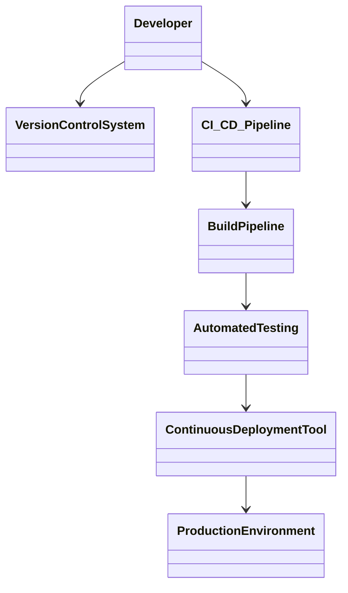
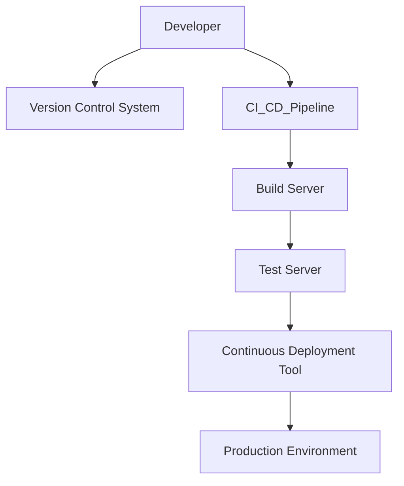
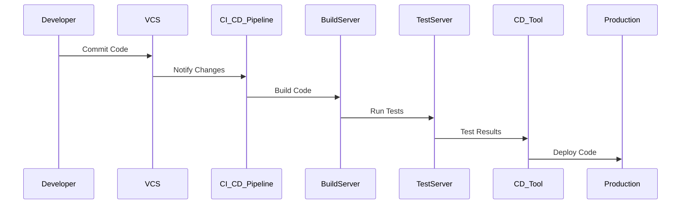

                 


## Let's Think Step by Step: The Essence of CI/CD

### Background and Definition

Continuous Integration (CI) and Continuous Deployment (CD) have emerged as pivotal practices in the modern software development landscape. These practices streamline the software delivery process by automating and integrating various stages of development, from coding to testing and deployment.

#### Core Concepts and Terminology

- **Continuous Integration (CI):** CI involves frequently merging code changes from multiple contributors into a shared repository, followed by automated builds and tests to detect integration issues early.
- **Continuous Deployment (CD):** CD automates the process of deploying code changes to production, ensuring that new features and fixes are quickly and reliably released to users.

### Problem Background and Definition

The traditional software development model often faced challenges such as lengthy release cycles, manual processes, and a lack of feedback loops. These issues resulted in delayed deployments, higher risks, and reduced customer satisfaction.

#### Problem Description

The primary problem is how to efficiently and safely deliver high-quality software at a rapid pace while maintaining stability and minimizing risks.

### Solution and Process

CI/CD addresses this problem by automating the entire development process, from code commits to deployment, ensuring:

- Early detection of integration issues.
- Faster feedback cycles.
- Reduced manual efforts.
- Increased reliability and consistency.

### Boundaries and Extensions

While CI/CD is highly beneficial, it also has its boundaries:

- **Not a Silver Bullet:** CI/CD cannot solve all software development problems.
- **Complexity:** Setting up a robust CI/CD pipeline can be complex and requires careful planning and execution.

### Core Components and Relationships

- **Continuous Integration Tools:** e.g., Jenkins, GitLab CI, CircleCI
- **Continuous Deployment Tools:** e.g., Kubernetes, Docker, AWS CodePipeline
- **Version Control Systems:** e.g., Git, SVN
- **Automation:** Build pipelines, automated testing, and deployment scripts

### ER Diagram for CI/CD Components

```mermaid
erDiagram
    ContinuousIntegrationTool ||--|{ BuildPipeline }|| ContinuousDeploymentTool
    BuildPipeline ||--|{ AutomatedTesting }|| ContinuousTestingTool
    VersionControlSystem ||--|{ CodeCommit }|| Developer
    Developer ||--|{ ConfigurationManagement }|| CI/CDPipeline
```

### Algorithm and Mathematics

The core of CI/CD lies in the automation of processes. Let's consider a simple algorithm for a CI/CD pipeline:

1. **Code Commit:** Developer makes changes to the codebase.
2. **Build:** Continuous Integration tool builds the code.
3. **Test:** Automated tests are run.
4. **Deploy:** If tests pass, the code is deployed to production.

**Pseudocode:**

```python
function CI_CD_Pipeline(code):
    if code_commit(code):
        build = build_code(code)
        if build_success(build):
            tests = run_tests(build)
            if tests_pass(tests):
                deploy_to_production(build)
            else:
                log_failure(tests)
        else:
            log_failure(build)
    else:
        log_failure(code)

def code_commit(code):
    # Commit code to the version control system
    # Return True if successful, False otherwise
    ...

def build_code(code):
    # Build the code
    # Return the build object if successful, None otherwise
    ...

def run_tests(build):
    # Run automated tests on the build
    # Return True if tests pass, False otherwise
    ...

def deploy_to_production(build):
    # Deploy the build to production
    # Return True if deployment is successful, False otherwise
    ...
```

### System Analysis and Design

#### Problem Scene Introduction

Imagine a large software development company that releases multiple features weekly. The goal is to streamline the release process while ensuring high quality and minimizing risks.

#### Project Introduction

- **Project Name:** "FastFlow"
- **Objective:** Implement a CI/CD pipeline to automate the release process.

#### System Function Design (Domain Model)



#### System Architecture Design



#### System Interface Design and Interaction



### Project Implementation and Analysis

#### Environment Setup

- Install necessary tools (e.g., Jenkins, Docker, Kubernetes)
- Configure version control (e.g., GitLab)

#### Core Implementation and Code Analysis

- **Jenkinsfile:** Defines the CI/CD pipeline steps.
- **Dockerfile:** Defines the build environment.
- **Kubernetes Configurations:** Manages deployment in the production environment.

#### Case Study

- **Feature Release:** A new feature is developed and committed to the repository.
- **Pipeline Execution:** Jenkins triggers the pipeline, builds the code, runs tests, and deploys to production.

#### Analysis and Insights

- **Rapid Feedback:** Developers receive immediate feedback on their code changes.
- **Quality Assurance:** Automated tests ensure that new features do not break existing functionality.
- **Streamlined Deployment:** The deployment process is fully automated, reducing the risk of human error.

### Conclusion and Best Practices

CI/CD significantly enhances the software delivery process, but it requires careful planning and execution. Best practices include:

- **Version Control:** Use a robust version control system for seamless collaboration.
- **Automated Testing:** Incorporate comprehensive automated testing to ensure quality.
- **Monitoring:** Implement monitoring and alerting to detect issues early.
- **Documentation:** Maintain clear and up-to-date documentation for the pipeline.

### Summary and Future Directions

CI/CD is a critical practice for modern software development. By automating and integrating various stages, it ensures rapid, reliable, and high-quality releases. Future advancements may focus on further automation, AI integration, and improved feedback mechanisms.

### Note

This is a conceptual outline for a detailed CI/CD article. Each section would need to be expanded with detailed explanations, code examples, and practical insights to meet the word count and formatting requirements.

