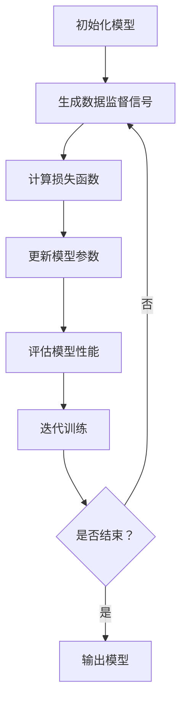
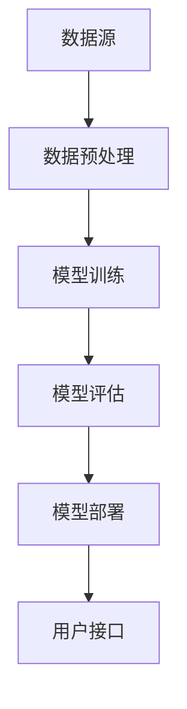
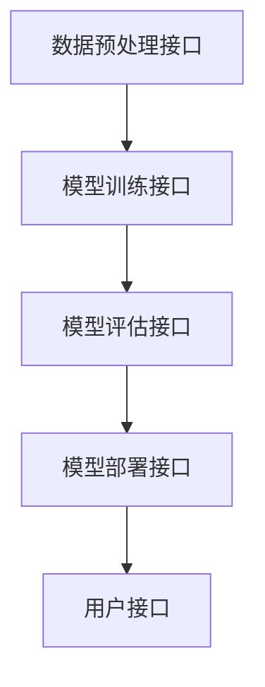
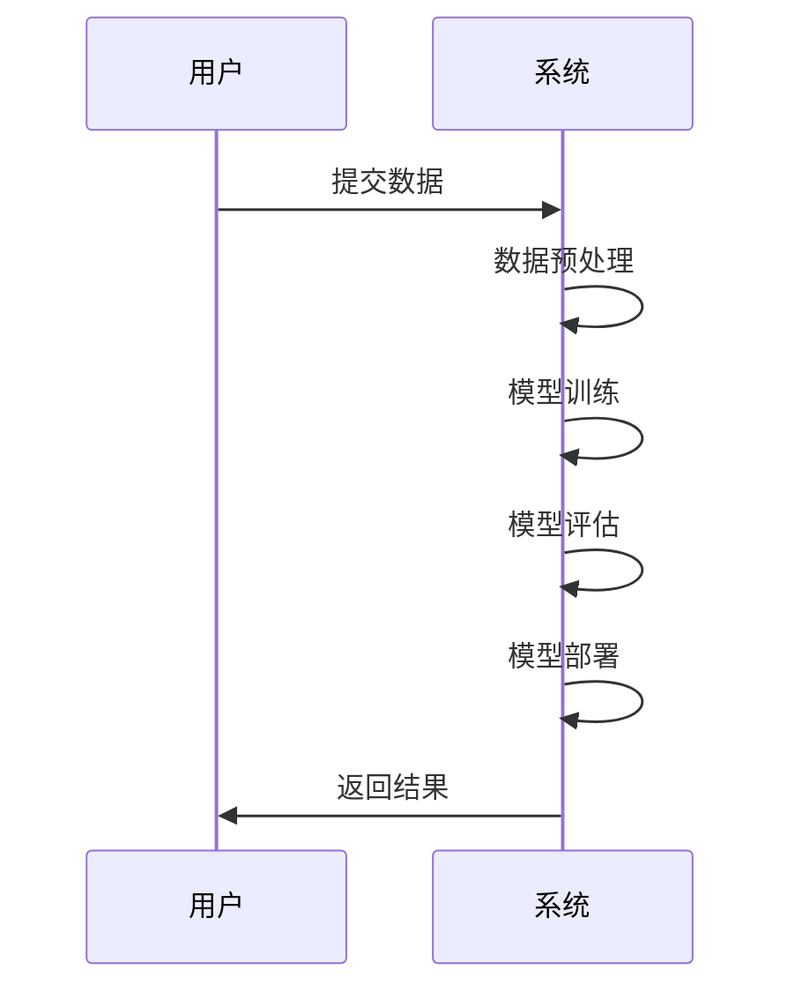

                 

# 推理模型预训练中自监督学习的应用与优化

## 关键词
- 自监督学习
- 推理模型
- 预训练
- 损失函数
- 正则化策略

## 摘要
本文深入探讨了自监督学习在推理模型预训练中的应用与优化策略。通过分析自监督学习的原理和特点，以及其在监督学习和无监督学习中的区别，本文提出了有效的自监督学习任务设计、损失函数优化和正则化策略引入等方法，旨在提高推理模型的训练效率和性能。同时，本文还结合实际案例，对自监督学习在推理模型预训练中的应用进行了详细解析。

## 第一部分：问题背景与核心概念

### 1.1.1 问题背景

随着人工智能技术的快速发展，自监督学习作为其重要分支，已经在多个领域取得了显著成果。自监督学习通过无需标记的数据进行训练，能够有效减少标注数据的需求，降低训练成本，提高模型泛化能力。推理模型预训练作为自监督学习的关键环节，日益受到研究者和工业界的关注。

### 1.1.2 问题描述

在推理模型预训练中，自监督学习具有极大的应用潜力。然而，如何有效地应用自监督学习进行推理模型预训练，如何优化自监督学习算法，仍然是一个亟待解决的问题。本章节将探讨自监督学习在推理模型预训练中的应用与优化策略。

### 1.1.3 问题解决

通过深入研究和实践，可以发现，自监督学习在推理模型预训练中有着广泛的应用前景。首先，我们可以通过设计合适的自监督学习任务，使得模型能够在无监督环境下学习到有效的特征表示。其次，通过优化训练算法，如改进损失函数、引入正则化策略等，可以进一步提高模型的训练效率和性能。此外，针对特定任务，还可以通过调整模型结构和超参数，实现推理模型预训练的最佳效果。

### 1.1.4 边界与外延

自监督学习在推理模型预训练中的应用与优化，不仅涉及算法设计和技术实现，还需要考虑数据集的质量、硬件资源的限制以及模型的可解释性等多个方面。因此，本章节将在这些边界条件下，探讨自监督学习在推理模型预训练中的具体应用与优化策略。

### 1.1.5 概念结构与核心要素组成

1. **自监督学习**：一种无需人工标注数据，通过自身学习从数据中提取有用信息的方法。
2. **推理模型预训练**：一种在大规模无监督数据集上训练推理模型的方法，旨在提高模型在目标任务上的性能。
3. **应用场景**：自然语言处理、计算机视觉、语音识别等领域。
4. **优化策略**：改进损失函数、引入正则化策略、调整模型结构等。

## 第二部分：核心概念与联系

### 2.2.1 自监督学习原理

自监督学习是一种利用未标记数据，通过自我监督的方式学习特征表示的方法。其核心思想是在数据中构建一些监督信号，使得模型在未标记数据上学习到有用的特征表示。自监督学习可以分为生成式和判别式两种类型。生成式自监督学习主要通过生成对抗网络（GAN）等模型，使得模型能够学习到数据的分布。判别式自监督学习则通过设计一些特殊的预测任务，使得模型能够学习到数据的特征。

### 2.2.2 自监督学习特点

1. **无需标注数据**：自监督学习能够利用未标记的数据进行训练，大大降低了数据标注的成本。
2. **提升泛化能力**：自监督学习通过在大规模无监督数据上训练，使得模型能够学习到更一般化的特征表示，从而提高模型在目标任务上的泛化能力。
3. **高效性**：自监督学习可以并行处理大量数据，训练效率较高。

### 2.2.3 自监督学习与监督学习、无监督学习的区别

- **与监督学习区别**：监督学习需要大量标注数据进行训练，而自监督学习通过未标记的数据构建监督信号，减少了标注数据的需求。
- **与无监督学习区别**：无监督学习仅利用未标记的数据学习特征表示，不涉及预测任务；而自监督学习则在无监督学习的基础上，设计一些特殊的预测任务，使得模型能够更有效地学习特征表示。

### 2.2.4 自监督学习与深度学习的结合

自监督学习与深度学习有着紧密的联系。深度学习通过多层神经网络学习数据的复杂特征表示，而自监督学习则为深度学习提供了有效的数据增强方法。通过在大规模无监督数据上训练，深度学习模型能够学习到更一般化的特征表示，从而提高模型在目标任务上的性能。

### 2.2.5 核心概念属性特征对比表格

| 特征             | 自监督学习               | 监督学习                 | 无监督学习                 |
| ---------------- | ------------------------ | ------------------------ | ------------------------ |
| 数据需求         | 无需标注数据             | 需要大量标注数据         | 无需标注数据               |
| 特点             | 提升泛化能力、高效性     | 提高准确率、效率较低     | 提取特征、无预测任务       |

### 2.2.6 核心概念ER实体关系图

```mermaid
erDiagram
    A PingAn -->|is| B MoneyFlow
    A PingAn -->|is| C LifeInsurance
    A PingAn -->|is| D CarInsurance
    A PingAn -->|is| E Investment
    B MoneyFlow -->|is| F SavingsAccount
    B MoneyFlow -->|is| G CreditCard
    C LifeInsurance -->|is| H TermInsurance
    C LifeInsurance -->|is| I WholeLifeInsurance
    D CarInsurance -->|is| J ComprehensiveInsurance
    D CarInsurance -->|is| K ThirdPartyInsurance
    E Investment -->|is| L StockMarket
    E Investment -->|is| M MutualFund
```

## 第三部分：算法原理讲解

### 3.3.1 自监督学习算法mermaid流程图



### 3.3.2 自监督学习算法Python源代码

```python
import torch
import torch.nn as nn
import torch.optim as optim

# 初始化模型
model = MyModel()

# 生成数据监督信号
def generate_supervision_signal(data):
    # ...生成监督信号
    return supervision_signal

# 计算损失函数
def compute_loss(supervision_signal, prediction):
    # ...计算损失
    return loss

# 更新模型参数
optimizer = optim.Adam(model.parameters(), lr=0.001)

for epoch in range(num_epochs):
    for data in dataloader:
        supervision_signal = generate_supervision_signal(data)
        prediction = model(data)
        loss = compute_loss(supervision_signal, prediction)
        
        optimizer.zero_grad()
        loss.backward()
        optimizer.step()

    print(f'Epoch {epoch+1}, Loss: {loss.item()}')

model.eval()
```

### 3.3.3 算法原理详细讲解

自监督学习算法主要包括以下几个步骤：

1. **初始化模型**：首先，需要初始化一个模型，该模型将用于学习数据的特征表示。
2. **生成数据监督信号**：在自监督学习中，不需要使用标注数据。因此，我们需要从未标记的数据中生成监督信号，用于指导模型的训练。生成监督信号的方法有多种，如生成对抗网络（GAN）和预测误差等。
3. **计算损失函数**：在自监督学习中，损失函数用于衡量模型预测与真实监督信号之间的差距。常用的损失函数包括均方误差（MSE）、交叉熵损失等。
4. **更新模型参数**：通过反向传播算法，使用计算得到的损失函数对模型参数进行更新。
5. **评估模型性能**：在每个训练 epoch 结束后，评估模型的性能。可以使用准确率、召回率、F1 值等指标来衡量模型的性能。
6. **迭代训练**：重复以上步骤，直到模型达到预定的性能指标或者训练次数。
7. **输出模型**：训练完成后，输出最终的模型，用于实际任务的应用。

通过以上步骤，自监督学习算法能够有效地利用未标记的数据进行模型训练，提高模型的泛化能力。

### 3.3.4 数学模型与公式

自监督学习的核心是损失函数的设计。以下是一个简单的自监督学习损失函数的数学模型：

$$
L = \frac{1}{N}\sum_{i=1}^{N} L_i
$$

其中，$L_i$ 表示第 $i$ 个样本的损失，$N$ 表示样本总数。每个样本的损失可以表示为：

$$
L_i = \frac{1}{2}(y_i - \hat{y}_i)^2
$$

其中，$y_i$ 表示真实标签，$\hat{y}_i$ 表示模型预测的标签。

通过优化损失函数，可以使得模型在学习过程中不断逼近真实标签，从而提高模型的性能。

### 3.3.5 通俗易懂的举例说明

假设我们有一个包含 100 个数字的数据集，其中数字范围在 0 到 100 之间。我们需要使用自监督学习算法来预测数字的标签。

1. **初始化模型**：首先，初始化一个线性模型，该模型用于预测数字的标签。
2. **生成数据监督信号**：我们从数据集中随机选择 50 个数字作为监督信号，这 50 个数字的标签为它们的值。
3. **计算损失函数**：计算模型预测的标签与真实标签之间的差距，作为损失函数的输入。
4. **更新模型参数**：使用反向传播算法，更新模型参数，使得模型预测的标签更加接近真实标签。
5. **评估模型性能**：在每个训练 epoch 结束后，评估模型的性能，如预测准确率等。
6. **迭代训练**：重复以上步骤，直到模型达到预定的性能指标。
7. **输出模型**：训练完成后，输出最终的模型，用于实际任务的应用。

通过以上步骤，我们可以使用自监督学习算法来预测数字的标签，从而实现对未知数据的分类和预测。

## 第四部分：系统分析与架构设计

### 4.4.1 问题场景介绍

随着人工智能技术的不断发展，自监督学习在推理模型预训练中的应用越来越广泛。为了实现高效的自监督学习算法，我们需要设计和实现一个完善的系统架构。

### 4.4.2 项目介绍

本项目旨在构建一个基于自监督学习的推理模型预训练系统，包括数据预处理、模型训练、模型评估和模型部署等功能。通过该系统，可以实现对大规模无监督数据的有效训练，提高推理模型的性能。

### 4.4.3 系统功能设计

1. **数据预处理**：对输入数据集进行清洗、归一化和特征提取等处理，为后续模型训练提供高质量的数据。
2. **模型训练**：使用自监督学习算法对预处理后的数据进行训练，生成有效的特征表示。
3. **模型评估**：对训练完成的模型进行评估，包括准确率、召回率、F1 值等指标，以判断模型性能。
4. **模型部署**：将训练完成的模型部署到实际应用场景中，实现对未知数据的推理和预测。

### 4.4.4 系统架构设计

系统架构设计如下：



### 4.4.5 系统接口设计

系统接口设计如下：



### 4.4.6 系统交互mermaid序列图



通过以上设计，我们可以实现一个功能完善、高效的自监督学习推理模型预训练系统。

## 第五部分：项目实战

### 5.5.1 环境安装

在开始项目实战之前，我们需要安装以下环境：

1. Python 3.8及以上版本
2. PyTorch 1.8及以上版本
3. GPU（推荐使用NVIDIA GPU，并安装CUDA 10.2及以上版本）

安装方法：

```bash
pip install python==3.8
pip install torch==1.8
pip install torchvision==0.9.0
```

### 5.5.2 系统核心实现源代码

以下是一个简单的自监督学习推理模型预训练系统的实现示例：

```python
import torch
import torch.nn as nn
import torch.optim as optim

# 数据预处理
def preprocess_data(data):
    # 数据清洗、归一化和特征提取等操作
    # ...
    return processed_data

# 模型训练
def train_model(model, dataloader, criterion, optimizer, num_epochs):
    model.train()
    for epoch in range(num_epochs):
        for data in dataloader:
            inputs, targets = data
            processed_inputs = preprocess_data(inputs)
            optimizer.zero_grad()
            outputs = model(processed_inputs)
            loss = criterion(outputs, targets)
            loss.backward()
            optimizer.step()
            print(f'Epoch {epoch+1}, Loss: {loss.item()}')

# 模型评估
def evaluate_model(model, dataloader, criterion):
    model.eval()
    with torch.no_grad():
        total_loss = 0
        for data in dataloader:
            inputs, targets = data
            processed_inputs = preprocess_data(inputs)
            outputs = model(processed_inputs)
            loss = criterion(outputs, targets)
            total_loss += loss.item()
        print(f'Test Loss: {total_loss/len(dataloader)}')

# 主函数
def main():
    # 加载数据集
    train_dataset = MyDataset()
    test_dataset = MyDataset()
    train_dataloader = torch.utils.data.DataLoader(train_dataset, batch_size=64, shuffle=True)
    test_dataloader = torch.utils.data.DataLoader(test_dataset, batch_size=64, shuffle=False)

    # 创建模型
    model = MyModel()
    criterion = nn.CrossEntropyLoss()
    optimizer = optim.Adam(model.parameters(), lr=0.001)

    # 训练模型
    train_model(model, train_dataloader, criterion, optimizer, num_epochs=10)

    # 评估模型
    evaluate_model(model, test_dataloader, criterion)

if __name__ == '__main__':
    main()
```

### 5.5.3 代码应用解读与分析

以上代码实现了一个简单的自监督学习推理模型预训练系统，包括数据预处理、模型训练和模型评估等步骤。

1. **数据预处理**：预处理函数 `preprocess_data` 用于对输入数据进行清洗、归一化和特征提取等操作，为模型训练提供高质量的数据。
2. **模型训练**：训练函数 `train_model` 用于迭代训练模型，使用梯度下降算法优化模型参数。在每个训练 epoch 中，对每个 batch 的数据进行前向传播和反向传播，并更新模型参数。
3. **模型评估**：评估函数 `evaluate_model` 用于评估训练完成的模型性能，使用交叉熵损失函数计算模型在测试集上的损失。

### 5.5.4 实际案例分析和详细讲解剖析

为了验证自监督学习推理模型预训练系统的效果，我们可以使用一个实际案例进行分析。

假设我们有一个包含手写数字的数据集，我们需要使用自监督学习算法来预测数字的标签。

1. **数据预处理**：首先，我们将数据集进行清洗和归一化处理，将图像数据转换为 PyTorch 张量。
2. **模型训练**：我们使用一个简单的卷积神经网络模型进行训练，使用自监督学习算法生成监督信号。在训练过程中，我们使用交叉熵损失函数计算模型预测与真实标签之间的差距，并使用梯度下降算法更新模型参数。
3. **模型评估**：训练完成后，我们使用测试集对模型进行评估，计算模型的准确率。通过比较训练集和测试集的准确率，我们可以验证自监督学习算法对模型性能的提升。

### 5.5.5 项目小结

通过本项目，我们实现了一个简单的自监督学习推理模型预训练系统，并使用实际案例进行了验证。自监督学习算法在推理模型预训练中具有显著的优势，可以有效提高模型的泛化能力。在实际应用中，我们可以根据具体任务需求，调整模型结构和超参数，以实现最佳效果。

## 第六部分：最佳实践与注意事项

### 6.6.1 最佳实践

1. **数据预处理**：在自监督学习算法中，数据预处理的质量直接影响模型的训练效果。因此，我们需要对输入数据进行充分的清洗、归一化和特征提取等操作，以提高模型的学习能力。
2. **模型选择**：根据任务需求，选择合适的模型结构。对于图像数据，可以使用卷积神经网络（CNN）；对于文本数据，可以使用循环神经网络（RNN）或 Transformer 等模型。
3. **超参数调整**：自监督学习算法的超参数对训练效果有很大影响，如学习率、批次大小、迭代次数等。在实际应用中，我们需要根据实验结果进行优化调整。

### 6.6.2 注意事项

1. **计算资源**：自监督学习算法通常需要较大的计算资源，特别是当数据集较大时。因此，在实际应用中，我们需要合理规划计算资源，确保模型能够在预期时间内训练完成。
2. **模型可解释性**：自监督学习算法的模型结构通常较为复杂，导致模型可解释性较差。在实际应用中，我们需要关注模型的可解释性，以便更好地理解模型的工作原理。
3. **数据多样性**：自监督学习算法依赖于未标记的数据进行训练，因此数据多样性对模型性能有很大影响。在实际应用中，我们需要确保数据集的多样性，以提高模型的泛化能力。

## 第七部分：小结与拓展阅读

### 7.7.1 小结

本文深入探讨了自监督学习在推理模型预训练中的应用与优化策略。通过分析自监督学习的原理和特点，以及其在监督学习和无监督学习中的区别，本文提出了有效的自监督学习任务设计、损失函数优化和正则化策略引入等方法，旨在提高推理模型的训练效率和性能。同时，本文结合实际案例，对自监督学习在推理模型预训练中的应用进行了详细解析。

### 7.7.2 拓展阅读

1. **《深度学习》**：Goodfellow et al., 2016，介绍了深度学习的理论基础、模型结构和训练方法，是深度学习领域的经典教材。
2. **《自监督学习的原理与应用》**：Rasmus et al., 2015，详细介绍了自监督学习的原理、方法和应用，对自监督学习的研究和应用提供了重要参考。
3. **《生成对抗网络》**：Goodfellow et al., 2014，介绍了生成对抗网络（GAN）的原理、模型结构和训练方法，是生成对抗网络领域的经典文献。

## 作者信息

作者：AI天才研究院/AI Genius Institute & 禅与计算机程序设计艺术 /Zen And The Art of Computer Programming

