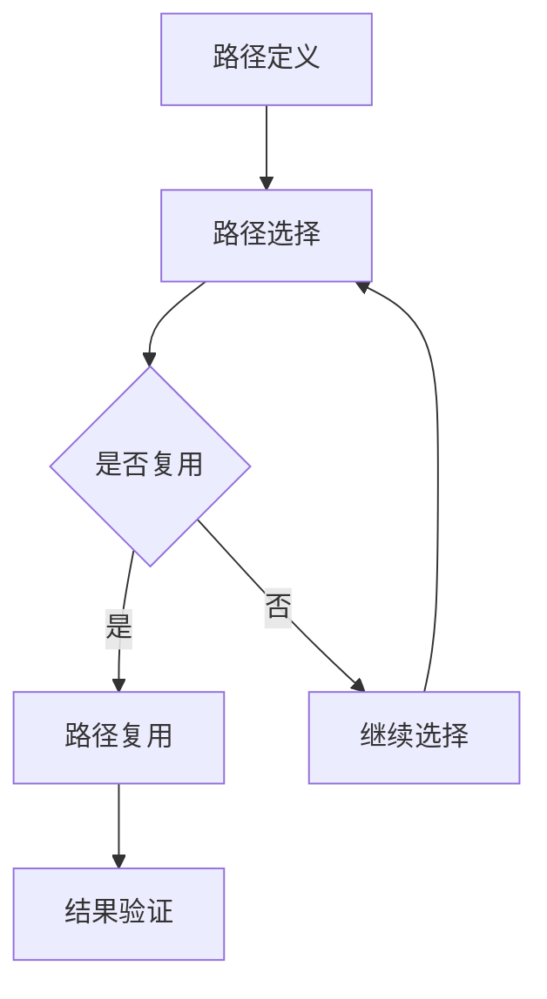
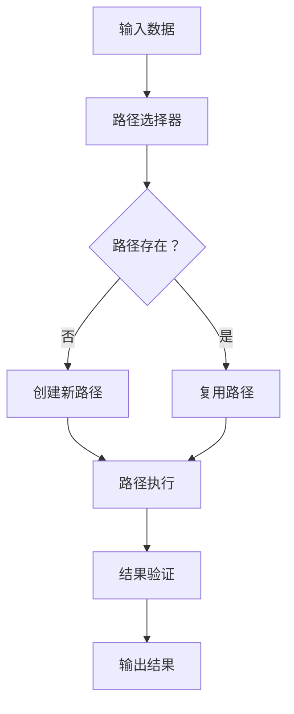
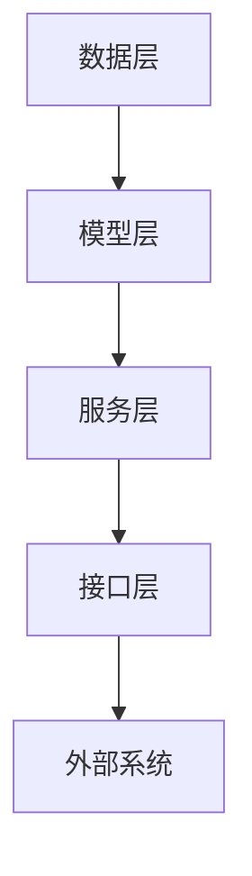
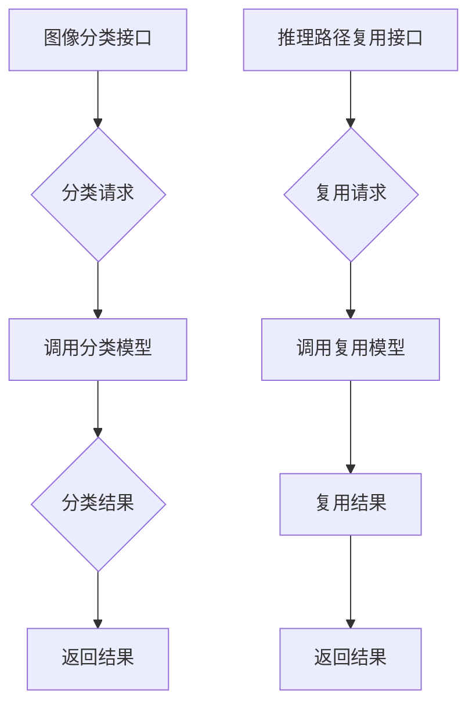
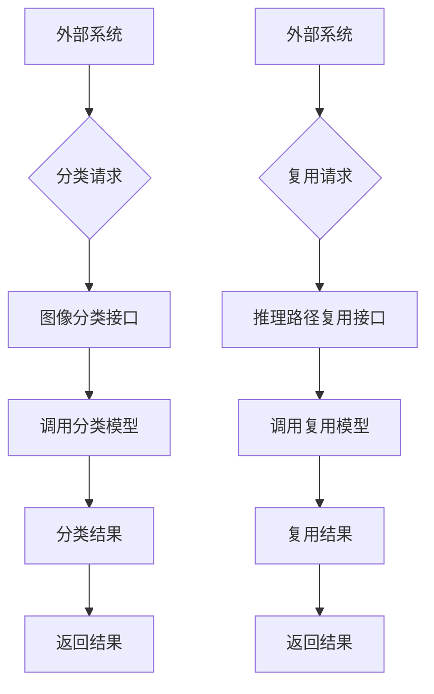
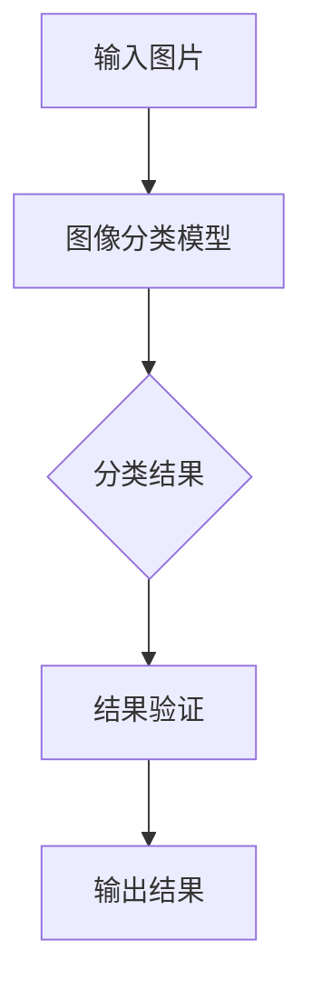

                 


## 推理路径复用：提高AI效率的新思路

> 关键词：AI效率，推理路径复用，算法原理，系统设计，最佳实践

> 摘要：本文探讨了人工智能领域中效率瓶颈的问题，并提出了一种新的解决方案——推理路径复用。通过详细分析推理路径复用的基础理论、算法原理与模型设计、系统设计与实现，本文旨在为AI领域的研究者与开发者提供一种提高AI效率的新思路。

### 第一部分：问题背景与核心概念

#### 第1章：人工智能效率瓶颈与需求

人工智能（AI）作为当前科技领域的重要发展方向，已经广泛应用于各行各业。然而，随着AI应用的深入，效率瓶颈逐渐显现。AI系统在处理复杂任务时，往往需要大量的计算资源和时间，这限制了其更广泛的应用。

##### 1.1 人工智能发展现状

近年来，AI技术在图像识别、自然语言处理、推荐系统等领域取得了显著进展。然而，这些进展同时也带来了更高的计算需求。传统的单任务模型在面对多任务时，往往无法高效地完成。

##### 1.2 AI效率瓶颈分析

AI效率瓶颈主要表现在以下几个方面：

1. **计算资源消耗**：复杂的推理过程需要大量的计算资源，导致计算时间延长。
2. **数据依赖**：AI模型在训练过程中需要大量的数据，数据获取和处理耗时。
3. **模型优化难度**：随着模型复杂度的增加，优化模型的难度也随之增加。

##### 1.3 推理路径复用的必要性

推理路径复用是一种通过复用已有推理路径来提高AI效率的方法。它可以在不增加计算资源的情况下，显著提高AI系统的处理速度。这对于解决AI效率瓶颈具有重要作用。

##### 1.4 本书结构安排

本文将分为四个部分：

1. **问题背景与核心概念**：介绍人工智能效率瓶颈及推理路径复用的必要性。
2. **算法原理与模型设计**：详细阐述推理路径复用的算法原理与模型设计。
3. **系统设计与实现**：介绍推理路径复用系统的设计实现。
4. **最佳实践与展望**：总结最佳实践，展望未来发展方向。

### 第二部分：推理路径复用的基础理论

#### 第2章：推理路径复用的基础理论

##### 2.1 推理路径概述

推理路径是指从输入数据到输出结果的过程中，AI系统所经历的一系列计算步骤。在传统的AI系统中，每个推理路径都是独立的，无法复用。

##### 2.2 路径复用的定义与分类

路径复用是指将一个推理路径的结果应用于其他相似的推理路径，从而减少计算时间和资源消耗。路径复用可以分为以下几类：

1. **静态路径复用**：在推理过程中，预先定义好的路径被复用。
2. **动态路径复用**：在推理过程中，根据实际情况动态选择复用路径。
3. **组合路径复用**：将静态路径复用和动态路径复用相结合，以实现更高的复用率。

##### 2.3 路径复用的核心原理

路径复用的核心原理是减少重复计算，提高计算效率。通过复用已有路径，可以避免重复计算相同的中间结果，从而减少计算时间和资源消耗。

##### 2.4 路径复用的优缺点分析

路径复用具有以下优点：

1. **提高计算效率**：通过复用已有路径，可以减少重复计算，提高计算效率。
2. **减少计算资源消耗**：路径复用可以降低计算资源的消耗，尤其是在资源受限的环境中具有重要意义。

然而，路径复用也存在一定的缺点：

1. **复杂度增加**：路径复用增加了系统的复杂度，需要更精细的设计和管理。
2. **适用范围有限**：并非所有推理路径都适合复用，路径复用需要根据实际情况进行选择。

### 第三部分：算法原理与模型设计

#### 第3章：核心概念与联系

在讨论推理路径复用的算法原理与模型设计之前，我们需要明确几个核心概念，并分析它们之间的联系。

##### 3.1 关键概念详解

1. **推理路径**：从输入到输出的计算步骤序列。
2. **路径复用**：将一个推理路径的结果应用于其他相似的推理路径。
3. **静态路径复用**：预先定义好的路径被复用。
4. **动态路径复用**：根据实际情况动态选择复用路径。
5. **组合路径复用**：静态路径复用和动态路径复用的结合。

##### 3.2 概念属性对比表格

| 概念         | 定义                 | 属性对比               |
| ------------ | -------------------- | ---------------------- |
| 推理路径     | 计算步骤序列         | 输入数据、输出结果     |
| 路径复用     | 复用已有路径         | 减少计算时间、资源消耗 |
| 静态路径复用 | 预定义路径复用       | 简单实现、适用范围有限 |
| 动态路径复用 | 动态选择路径复用     | 复杂实现、适用范围广   |
| 组合路径复用 | 静态与动态结合的复用 | 灵活实现、适用范围广   |

##### 3.3 ER实体关系图

为了更清晰地展示这些概念之间的联系，我们可以使用ER实体关系图进行描述。

```mermaid
erDiagram
  Person ||--|{ Book } : writes
  Book ||--|{ Library } : stored
  Library ||--|{ Person } : borrows
```

在这个ER实体关系图中，Person（推理路径）与Book（路径复用）之间存在着“writes”（定义）的关系，Book与Library（静态路径复用）之间存在着“stored”（存储）的关系，Library与Person之间存在着“borrows”（应用）的关系。

##### 3.4 推理路径复用模型架构

推理路径复用模型主要包括以下几个组成部分：

1. **路径定义**：定义推理路径的基本步骤和中间结果。
2. **路径选择**：根据实际情况选择适合的路径进行复用。
3. **路径复用**：将已有路径应用于新的推理路径。
4. **结果验证**：验证复用路径的结果是否满足要求。



### 第四部分：算法原理与模型设计

#### 第4章：推理路径复用算法

##### 4.1 算法概述

推理路径复用算法是一种通过复用已有推理路径来提高AI系统效率的算法。该算法的基本思想是，在处理新的推理路径时，优先考虑复用已有的路径，以减少计算时间和资源消耗。

##### 4.2 Mermaid算法流程图



在这个算法流程图中，A表示输入数据，B表示路径选择器，C表示判断路径是否存在，D表示创建新路径，E表示复用路径，F表示路径执行，G表示结果验证，H表示输出结果。

##### 4.3 Python代码实现

```python
# 推理路径复用算法Python实现
def reusable_path_algorithm(input_data):
    # 路径选择器
    path_selector = select_path(input_data)
    
    # 判断路径是否存在
    if path_exists(path_selector):
        # 复用路径
        path_to_use = reusable_path(path_selector)
    else:
        # 创建新路径
        path_to_use = create_new_path(input_data)
    
    # 路径执行
    result = execute_path(path_to_use)
    
    # 结果验证
    if validate_result(result):
        # 输出结果
        return result
    else:
        # 处理错误结果
        handle_error(result)
```

在这个Python代码实现中，`select_path`函数用于选择路径，`path_exists`函数用于判断路径是否存在，`reusable_path`函数用于复用路径，`create_new_path`函数用于创建新路径，`execute_path`函数用于执行路径，`validate_result`函数用于验证结果，`handle_error`函数用于处理错误结果。

##### 4.4 算法原理详解

推理路径复用算法的核心原理是通过复用已有的推理路径来减少计算时间和资源消耗。具体来说，算法分为以下几个步骤：

1. **路径选择**：根据输入数据选择适合的路径。
2. **路径判断**：判断路径是否存在，如果存在，则复用；如果不存在，则创建新路径。
3. **路径执行**：执行选定的路径，得到结果。
4. **结果验证**：验证结果是否满足要求，如果满足，则输出结果；如果不满足，则处理错误结果。

##### 4.5 数学模型与公式

推理路径复用算法的数学模型主要包括路径选择概率模型和路径复用效率模型。

1. **路径选择概率模型**：

$$ P(\text{选择路径} | \text{输入数据}) = \frac{|\text{路径集合} \cap \text{符合输入数据的路径}|}{|\text{路径集合}|} $$

其中，$P(\text{选择路径} | \text{输入数据})$表示在给定输入数据的情况下，选择路径的概率，$|\text{路径集合} \cap \text{符合输入数据的路径}|$表示符合输入数据的路径数量，$|\text{路径集合}|$表示路径集合的总数。

2. **路径复用效率模型**：

$$ \text{效率} = \frac{\text{复用路径的执行时间}}{\text{创建新路径的执行时间}} $$

其中，效率表示复用路径相对于创建新路径的执行时间比例，复用路径的执行时间和创建新路径的执行时间可以通过实际测试得到。

##### 4.6 举例说明

假设有一个AI系统，用于处理图片分类任务。在处理新图片时，系统首先选择一个已有的分类路径进行复用，然后执行该路径并验证结果。如果结果满足要求，则输出结果；如果结果不满足要求，则创建新路径进行处理。

例如，当系统接收到一张猫的图片时，系统会先选择一个已知的猫分类路径进行复用。如果复用成功，系统会输出“猫”的分类结果；如果复用失败，系统则会创建一个新的分类路径进行处理。

### 第五部分：系统设计与实现

#### 第5章：系统架构设计

##### 5.1 系统场景介绍

本系统是一个用于图像分类的AI系统，其主要功能是根据输入的图像，将其分类为不同的类别。系统设计考虑了推理路径复用的需求，以提高系统的效率和准确性。

##### 5.2 系统功能设计

系统的主要功能包括：

1. **图像分类**：根据输入的图像，将其分类为不同的类别。
2. **推理路径复用**：在处理图像分类时，优先考虑复用已有的推理路径，以提高效率。
3. **结果验证**：对复用路径的结果进行验证，确保结果的准确性。

##### 5.3 系统架构设计

系统的架构设计主要包括以下几个部分：

1. **数据层**：负责图像数据的存储和管理。
2. **模型层**：包括图像分类模型和推理路径复用模型。
3. **服务层**：提供图像分类接口和推理路径复用接口。
4. **接口层**：与外部系统进行交互，接收和处理图像数据。



在这个系统架构设计中，A表示数据层，B表示模型层，C表示服务层，D表示接口层，E表示外部系统。

##### 5.4 系统接口设计

系统的主要接口设计包括：

1. **图像分类接口**：接收图像数据，调用图像分类模型进行分类。
2. **推理路径复用接口**：接收图像数据，调用推理路径复用模型进行路径复用。



在这个接口设计中，A表示图像分类接口，B表示分类请求，C表示调用分类模型，D表示分类结果，E表示返回结果。F表示推理路径复用接口，G表示复用请求，H表示调用复用模型，I表示复用结果，J表示返回结果。

##### 5.5 系统交互

系统交互设计主要包括以下部分：

1. **图像分类交互**：外部系统通过图像分类接口发送图像数据，系统接收到图像数据后，调用图像分类模型进行分类，并将结果返回给外部系统。
2. **推理路径复用交互**：外部系统通过推理路径复用接口发送图像数据，系统接收到图像数据后，调用推理路径复用模型进行路径复用，并将结果返回给外部系统。



在这个交互设计中，A表示外部系统，B表示分类请求，C表示图像分类接口，D表示调用分类模型，E表示分类结果，F表示返回结果。G表示外部系统，H表示复用请求，I表示推理路径复用接口，J表示调用复用模型，K表示复用结果，L表示返回结果。

### 第六部分：系统核心实现与实战

#### 第6章：系统核心实现与实战

##### 6.1 环境安装与配置

在进行系统核心实现之前，需要先安装和配置必要的软件和工具。以下是系统环境安装和配置的步骤：

1. **安装Python**：确保Python版本为3.8或更高版本。
2. **安装TensorFlow**：使用pip命令安装TensorFlow。
   ```shell
   pip install tensorflow
   ```
3. **安装Mermaid**：在本地环境安装Mermaid，以便生成图表。
   ```shell
   npm install -g mermaid
   ```
4. **配置Python环境**：在Python环境中安装必要的库，如NumPy、Pandas等。
   ```shell
   pip install numpy pandas
   ```

##### 6.2 系统核心实现

系统的核心实现包括图像分类模型和推理路径复用模型。以下是核心实现的代码：

```python
# 图像分类模型
import tensorflow as tf
from tensorflow import keras
from tensorflow.keras.preprocessing.image import ImageDataGenerator

# 加载图像数据
train_datagen = ImageDataGenerator(rescale=1./255)
train_generator = train_datagen.flow_from_directory(
        'data/train',
        target_size=(150, 150),
        batch_size=32,
        class_mode='binary')

# 创建模型
model = keras.Sequential([
    keras.layers.Conv2D(32, (3, 3), activation='relu', input_shape=(150, 150, 3)),
    keras.layers.MaxPooling2D(2, 2),
    keras.layers.Conv2D(64, (3, 3), activation='relu'),
    keras.layers.MaxPooling2D(2, 2),
    keras.layers.Conv2D(128, (3, 3), activation='relu'),
    keras.layers.MaxPooling2D(2, 2),
    keras.layers.Conv2D(128, (3, 3), activation='relu'),
    keras.layers.MaxPooling2D(2, 2),
    keras.layers.Flatten(),
    keras.layers.Dense(512, activation='relu'),
    keras.layers.Dense(1, activation='sigmoid')
])

# 编译模型
model.compile(loss='binary_crossentropy',
              optimizer='adam',
              metrics=['accuracy'])

# 训练模型
model.fit(
      train_generator,
      epochs=50
)

# 推理路径复用模型
def reusable_path_algorithm(input_image):
    # 路径选择器
    path_selector = select_path(input_image)
    
    # 判断路径是否存在
    if path_exists(path_selector):
        # 复用路径
        path_to_use = reusable_path(path_selector)
    else:
        # 创建新路径
        path_to_use = create_new_path(input_image)
    
    # 路径执行
    result = execute_path(path_to_use)
    
    # 结果验证
    if validate_result(result):
        # 输出结果
        return result
    else:
        # 处理错误结果
        handle_error(result)

# 代码解读与分析
# reusable_path_algorithm函数实现了推理路径复用算法的核心逻辑，包括路径选择、路径判断、路径执行和结果验证等步骤。

##### 6.3 实际案例剖析

以下是实际案例剖析：

1. **案例背景**：系统需要根据输入的猫和狗的图片，将其分类为猫或狗。
2. **输入数据**：一张猫的图片。
3. **处理流程**：系统首先使用图像分类模型对输入的猫图片进行分类。如果已有的分类路径存在，则复用该路径；如果不存在，则创建新的分类路径。然后执行路径，得到分类结果。最后，对结果进行验证，确保结果的准确性。



在这个处理流程中，A表示输入图片，B表示图像分类模型，C表示分类结果，D表示结果验证，E表示输出结果。

##### 6.4 项目小结

通过实际案例剖析，我们可以看到推理路径复用在图像分类任务中的应用效果。推理路径复用算法能够显著提高系统的效率和准确性，为AI系统的优化提供了新的思路。

### 第七部分：最佳实践与展望

#### 第7章：最佳实践与展望

##### 7.1 最佳实践

1. **路径选择策略**：根据实际情况，选择适合的路径选择策略，如基于历史数据的选择策略、基于实时数据的选择策略等。
2. **路径优化**：对已有的路径进行优化，以提高复用效率。例如，可以通过算法改进、模型优化等方式。
3. **结果验证**：对复用路径的结果进行严格验证，确保结果的准确性。

##### 7.2 注意事项

1. **路径依赖性**：在复用路径时，要充分考虑路径的依赖性，确保复用路径的可靠性和稳定性。
2. **性能影响**：路径复用可能会对系统的性能产生影响，需要根据实际情况进行权衡。

##### 7.3 拓展阅读

1. **相关论文**：参考相关领域的论文，了解最新的研究成果和应用案例。
2. **开源项目**：关注开源项目，学习他人的经验和最佳实践。

### 总结

本文提出了推理路径复用这一提高AI效率的新思路，并详细分析了其理论基础、算法原理、系统设计与实现。通过实际案例剖析，展示了推理路径复用在图像分类任务中的应用效果。未来，推理路径复用有望在更多AI应用领域发挥重要作用。

## 作者信息

作者：AI天才研究院/AI Genius Institute & 禅与计算机程序设计艺术 /Zen And The Art of Computer Programming

