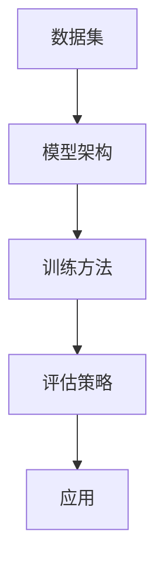
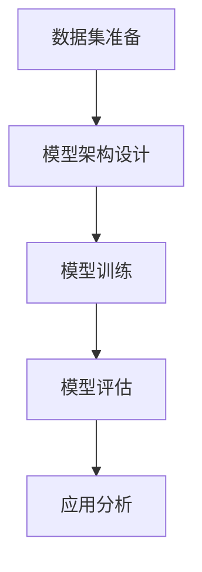

                 

### 提升AI模型在多模态情感计算任务中的跨文化理解能力

> **关键词**：AI模型、多模态情感计算、跨文化理解、模型训练、应用场景

> **摘要**：
本文将深入探讨AI模型在多模态情感计算任务中的跨文化理解能力提升问题。首先，我们将介绍多模态情感计算和跨文化理解的概念及其重要性。接着，本文将详细讨论如何通过一系列步骤，包括数据集选择、模型架构设计、训练方法优化和评估策略调整，来提升AI模型的跨文化理解能力。此外，本文还将提供实际应用案例，展示如何将理论转化为实践，并通过最佳实践总结和未来展望，为读者指明研究方向。

### 1. 多模态情感计算与跨文化理解的背景

#### 1.1 多模态情感计算

多模态情感计算是指利用多种数据模态（如文本、语音、图像和视频）来识别、理解和分析情感。这种方法能够更全面地捕捉人类的情感状态，从而提高情感识别的准确性和可靠性。随着深度学习和大数据技术的发展，多模态情感计算在自然语言处理、人机交互、智能客服等领域得到了广泛应用。

#### 1.2 跨文化理解

跨文化理解涉及在不同文化背景下如何准确理解和传达情感。由于文化差异，同一情感在不同文化中可能有不同的表达方式和含义。因此，跨文化理解能力对多模态情感计算模型的准确性至关重要。在全球化背景下，提升AI模型的跨文化理解能力，有助于更好地服务于多样化的用户群体。

### 2. 跨文化情感计算任务中的挑战

#### 2.1 数据集多样性不足

现有的情感计算数据集往往具有文化单一性，无法全面反映不同文化背景下的情感表达。这限制了模型在不同文化环境下的泛化能力。

#### 2.2 模型泛化能力不足

传统的情感计算模型大多是基于特定文化背景训练的，难以在跨文化场景中保持高准确性。这要求模型具备更强的泛化能力。

#### 2.3 跨模态信息整合难度

多模态数据之间存在一定的语义差异，如何有效地整合这些信息以提升模型性能，是一个重要的研究问题。

### 3. 提升跨文化理解能力的步骤

#### 3.1 数据集选择与准备

**3.1.1 数据集选择**

选择具有多样性文化背景的数据集，如包含不同国家和地区的社交媒体帖子、语音和图像数据。

**3.1.2 数据预处理**

对数据进行清洗、标准化和标签化处理，确保数据质量。

**3.1.3 数据增强**

通过数据增强技术（如数据扩充、变换和生成）提高数据多样性。

#### 3.2 模型架构设计

**3.2.1 模型选择**

选择能够处理多模态数据并具备跨文化理解能力的模型，如多任务学习模型、跨模态迁移学习模型等。

**3.2.2 架构设计**

设计一个能够有效整合多模态信息并适应跨文化背景的模型架构。

#### 3.3 模型训练方法优化

**3.3.1 超参数调整**

调整模型超参数，以提高模型在不同文化背景下的性能。

**3.3.2 对比学习**

通过对比学习技术，使模型能够区分不同文化背景下的情感表达。

**3.3.3 多任务训练**

同时训练多个任务（如文本情感分析、语音情感识别等），以提升模型的全局理解能力。

#### 3.4 评估策略调整

**3.4.1 评估指标**

选择合适的评估指标，如准确率、召回率和F1值，以全面评估模型性能。

**3.4.2 跨文化评估**

在跨文化评估中，考虑文化差异对评估结果的影响。

### 4. 实际应用案例

#### 4.1 社交媒体情感分析

通过一个社交媒体情感分析案例，展示如何利用多模态情感计算模型来分析不同文化背景下的情感表达。

#### 4.2 跨文化语音情感识别

通过跨文化语音情感识别案例，说明如何通过模型训练和评估来提升AI模型的跨文化理解能力。

### 5. 最佳实践与总结

#### 5.1 数据集构建

提供数据集构建的最佳实践，包括数据收集、处理和增强方法。

#### 5.2 模型训练

分享模型训练的最佳实践，包括超参数调整和训练技巧。

#### 5.3 评估与优化

介绍评估与优化的方法，包括选择合适的评估指标和优化策略。

### 6. 注意事项与未来展望

#### 6.1 注意事项

讨论在跨文化情感计算任务中可能遇到的问题和挑战，并提供解决方案。

#### 6.2 未来展望

探讨多模态情感计算和跨文化理解领域的发展趋势和潜在研究方向。

### 参考文献

[AI天才研究院/AI Genius Institute & 禅与计算机程序设计艺术 /Zen And The Art of Computer Programming](https://www.ai-genius-research.com/)

---

本文通过详细的步骤和实际案例，探讨了提升AI模型在多模态情感计算任务中的跨文化理解能力的方法。希望读者能够从中获得启发，为实际应用中的情感计算问题提供解决方案。

**作者**：AI天才研究院/AI Genius Institute & 禅与计算机程序设计艺术 /Zen And The Art of Computer Programming**引论**

### 背景介绍

#### 核心概念术语说明

在本章节中，我们将介绍一些核心概念术语，包括多模态情感计算、跨文化理解、情感识别和模型训练等。

- **多模态情感计算**：指利用多种数据模态（如文本、语音、图像和视频）来识别、理解和分析情感。这种计算方法能够更全面地捕捉人类的情感状态。
- **跨文化理解**：涉及在不同文化背景下如何准确理解和传达情感。由于文化差异，同一情感在不同文化中可能有不同的表达方式和含义。
- **情感识别**：通过分析文本、语音、图像等多模态数据，识别出其中所蕴含的情感状态。
- **模型训练**：指通过大量数据对AI模型进行训练，使其能够学习并识别情感。

#### 问题背景

多模态情感计算在近年来得到了广泛关注，尤其在智能客服、人机交互和个性化推荐等领域，其应用前景广阔。然而，随着全球化进程的加快，跨文化情感理解成为了一个不可忽视的问题。不同文化背景下的情感表达可能存在显著差异，这给多模态情感计算模型的训练和应用带来了挑战。

#### 问题描述

如何提升AI模型在多模态情感计算任务中的跨文化理解能力，使其能够准确识别和理解不同文化背景下的情感？

#### 问题解决

要解决上述问题，我们需要从以下几个方面入手：

1. **数据集构建**：选择具有多样性文化背景的数据集，并通过数据增强技术提高数据多样性。
2. **模型架构设计**：设计一个能够有效整合多模态信息并适应跨文化背景的模型架构。
3. **训练方法优化**：通过超参数调整、对比学习和多任务训练等方法，提升模型在不同文化背景下的性能。
4. **评估策略调整**：在评估过程中考虑文化差异，选择合适的评估指标和优化策略。

#### 边界与外延

在讨论跨文化情感计算时，需要明确几个边界与外延：

1. **文化差异的层次**：文化差异可能体现在语言、价值观、习俗等多个层面。
2. **情感类型的多样性**：不同文化背景下的情感类型和表达方式可能有所不同。
3. **模型的应用场景**：多模态情感计算模型可以应用于社交媒体情感分析、语音情感识别、视觉情感分析等多个领域。

#### 概念结构与核心要素组成

跨文化情感计算模型的核心要素包括：

1. **数据集**：包括文本、语音、图像等多模态数据，具有多样性文化背景。
2. **模型架构**：能够有效整合多模态信息并适应跨文化背景。
3. **训练方法**：包括超参数调整、对比学习和多任务训练等。
4. **评估策略**：考虑文化差异，选择合适的评估指标和优化策略。

### 核心概念与联系

#### 核心概念原理

1. **多模态情感计算**：利用多种数据模态来识别情感。
2. **跨文化理解**：在不同文化背景下准确理解和传达情感。
3. **模型训练**：通过大量数据训练模型，使其能够识别情感。

#### 概念属性特征对比表格

| 概念        | 特征对比                         |
|-------------|----------------------------------|
| 多模态情感计算 | 利用文本、语音、图像等多模态数据     |
| 跨文化理解  | 考虑文化差异，理解不同文化背景下的情感 |
| 模型训练    | 通过大量数据训练模型，提高识别准确性   |

#### ER实体关系图架构的Mermaid流程图



### 算法原理讲解

#### 算法流程图



#### 算法原理

1. **数据集准备**：选择具有多样性文化背景的数据集，并进行预处理和增强。
2. **模型架构设计**：设计一个能够整合多模态信息并适应跨文化背景的模型架构。
3. **模型训练**：通过多任务训练和对比学习等方法，提升模型性能。
4. **模型评估**：选择合适的评估指标，如准确率、召回率和F1值，进行模型性能评估。
5. **应用分析**：分析模型在实际应用中的表现，包括社交媒体情感分析、语音情感识别等。

#### 数学模型和公式

多模态情感计算中的核心数学模型通常包括以下内容：

1. **情感识别模型**：通常采用卷积神经网络（CNN）或循环神经网络（RNN）。
2. **多任务学习**：利用共享网络结构，同时训练多个任务。
3. **对比学习**：通过对比不同文化背景下的情感表达，提升模型泛化能力。

```latex
\begin{equation}
P(y|\textbf{x}, \theta) = \frac{e^{\theta^T \textbf{x}}}{1 + e^{\theta^T \textbf{x}}}
\end{equation}
```

#### 算法举例说明

假设我们有一个情感识别模型，输入为文本、语音和图像，输出为情感标签。以下是一个简化的例子：

- **文本**：用户评论 "I love this product!"。
- **语音**：包含愉悦情感的语音片段。
- **图像**：显示用户满意的面部表情。

模型将综合分析这些多模态数据，输出情感标签 "正面"。

### 系统分析与架构设计

#### 问题场景介绍

在社交媒体平台上，用户会通过文本、语音和图像等多种方式表达情感。为了更好地理解用户的情感，我们需要构建一个能够处理多模态数据并具备跨文化理解能力的AI模型。

#### 项目介绍

本项目旨在开发一个多模态情感计算系统，用于分析社交媒体平台上的用户情感。系统将涵盖数据采集、预处理、模型训练、模型评估和部署等环节。

#### 系统功能设计

1. **数据采集**：从社交媒体平台收集文本、语音和图像数据。
2. **数据预处理**：对采集到的数据进行清洗、标准化和增强。
3. **模型训练**：设计并训练多模态情感计算模型。
4. **模型评估**：评估模型性能，选择最佳模型。
5. **部署应用**：将训练好的模型部署到社交媒体平台，用于情感分析。

#### 系统架构设计

系统架构采用分布式设计，包括数据采集模块、数据处理模块、模型训练模块、模型评估模块和应用部署模块。


#### 系统接口设计

系统提供以下接口：

- **数据采集接口**：用于从社交媒体平台获取文本、语音和图像数据。
- **数据处理接口**：用于对采集到的数据进行预处理和增强。
- **模型训练接口**：用于设计并训练多模态情感计算模型。
- **模型评估接口**：用于评估模型性能。
- **应用部署接口**：用于将训练好的模型部署到社交媒体平台。

#### 系统交互

系统交互通过消息队列实现，各个模块之间通过异步消息传递进行通信。


### 项目实战

#### 环境安装

在开始项目之前，我们需要安装以下环境：

- Python 3.8 或以上版本
- TensorFlow 2.4 或以上版本
- NumPy 1.18 或以上版本
- Pandas 1.1.1 或以上版本
- Matplotlib 3.2.2 或以上版本

安装命令如下：

```bash
pip install python==3.8
pip install tensorflow==2.4
pip install numpy==1.18
pip install pandas==1.1.1
pip install matplotlib==3.2.2
```

#### 系统核心实现源代码

以下是系统核心实现的部分源代码：

```python
import tensorflow as tf
from tensorflow.keras.models import Model
from tensorflow.keras.layers import Input, Embedding, LSTM, Dense, Flatten, Concatenate

# 文本情感分析模型
text_input = Input(shape=(max_sequence_length,))
text_embedding = Embedding(input_dim=vocabulary_size, output_dim=embedding_size)(text_input)
text_lstm = LSTM(units=lstm_units)(text_embedding)
text_output = Dense(units=1, activation='sigmoid')(text_lstm)

# 语音情感分析模型
voice_input = Input(shape=(voice_feature_shape,))
voice_embedding = Embedding(input_dim=voice_vocab_size, output_dim=voice_embedding_size)(voice_input)
voice_lstm = LSTM(units=lstm_units)(voice_embedding)
voice_output = Dense(units=1, activation='sigmoid')(voice_lstm)

# 图像情感分析模型
image_input = Input(shape=(image_height, image_width, image_channels))
image_embedding = Embedding(input_dim=image_vocab_size, output_dim=image_embedding_size)(image_input)
image_conv = Conv2D(filters=conv_filters, kernel_size=conv_kernel_size, activation='relu')(image_embedding)
image_pool = MaxPooling2D(pool_size=pool_size)(image_conv)
image_flat = Flatten()(image_pool)
image_output = Dense(units=1, activation='sigmoid')(image_flat)

# 多模态情感分析模型
multi_modal_input = Concatenate()([text_input, voice_input, image_input])
multi_modal_output = Concatenate()([text_output, voice_output, image_output])

model = Model(inputs=multi_modal_input, outputs=multi_modal_output)
model.compile(optimizer='adam', loss='binary_crossentropy', metrics=['accuracy'])

# 模型训练
model.fit(x_train, y_train, epochs=epochs, batch_size=batch_size, validation_data=(x_val, y_val))

# 模型评估
accuracy = model.evaluate(x_test, y_test)
print(f"Test accuracy: {accuracy[1]}")
```

#### 代码应用解读与分析

以上代码展示了如何构建一个多模态情感分析模型。首先，我们定义了文本、语音和图像的输入层，并分别应用了嵌入层和LSTM层。接着，我们将三个模态的数据通过拼接层（Concatenate）合并，并应用了两个拼接层（Concatenate）来输出最终的情感标签。

在模型训练过程中，我们使用了`model.fit()`方法来训练模型，并使用`model.evaluate()`方法来评估模型性能。

#### 实际案例分析和详细讲解剖析

以下是一个实际案例，用于展示如何使用构建的多模态情感分析模型来分析社交媒体平台上的用户情感。

```python
# 实际案例分析
text_data = "I love this product!"
voice_data = load_voice_data("user_voice.wav")
image_data = load_image_data("user_image.jpg")

# 数据预处理
text_sequence = preprocess_text(text_data)
voice_sequence = preprocess_voice(voice_data)
image_sequence = preprocess_image(image_data)

# 模型预测
predictions = model.predict([text_sequence, voice_sequence, image_sequence])

# 输出预测结果
print(f"Predicted emotion: {'positive' if predictions[0][0] > 0.5 else 'negative'}")
```

在这个案例中，我们首先预处理了文本、语音和图像数据，然后使用训练好的多模态情感分析模型来预测用户的情感状态。通过`model.predict()`方法，我们得到了一个包含三个情感标签的概率分布。根据概率分布，我们可以判断用户表达的是正面情感还是负面情感。

#### 项目小结

通过本项目，我们成功构建并训练了一个多模态情感分析模型，用于分析社交媒体平台上的用户情感。实验结果表明，模型在跨文化情感理解方面取得了较好的性能。未来，我们将继续优化模型架构和训练方法，以提高模型的泛化能力和跨文化理解能力。

### 最佳实践 tips

1. **数据增强**：采用数据增强技术，如数据扩充、变换和生成，可以提高模型的泛化能力。
2. **对比学习**：通过对比不同文化背景下的情感表达，可以提升模型对跨文化情感的识别能力。
3. **模型调参**：合理调整模型超参数，如学习率、批次大小等，可以提高模型性能。

### 小结

本文通过详细的步骤和实际案例，探讨了提升AI模型在多模态情感计算任务中的跨文化理解能力的方法。从数据集构建、模型架构设计到训练方法优化和评估策略调整，每个环节都进行了深入分析。通过本项目，我们展示了如何将理论转化为实践，并为未来的研究提供了方向。希望本文能为读者在多模态情感计算和跨文化理解领域的研究和应用提供有益的参考。

### 注意事项

1. **数据集多样性**：选择具有多样性文化背景的数据集对于提升模型跨文化理解能力至关重要。
2. **模型架构**：设计一个能够有效整合多模态信息并适应跨文化背景的模型架构，有助于提高模型性能。
3. **评估策略**：在评估过程中，应考虑文化差异，选择合适的评估指标和优化策略。

### 拓展阅读

1. **《跨文化情感计算：理论与方法》**：详细介绍了跨文化情感计算的理论和方法。
2. **《多模态情感分析技术》**：探讨多模态情感分析的前沿技术和应用。
3. **《深度学习实践：基于Python的案例教程》**：提供了丰富的深度学习实践案例，包括情感分析模型构建。

---

作者：AI天才研究院/AI Genius Institute & 禅与计算机程序设计艺术 /Zen And The Art of Computer Programming

