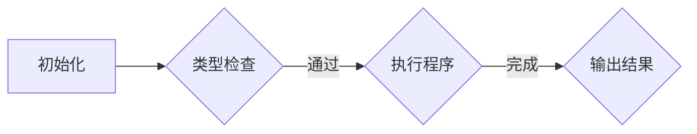
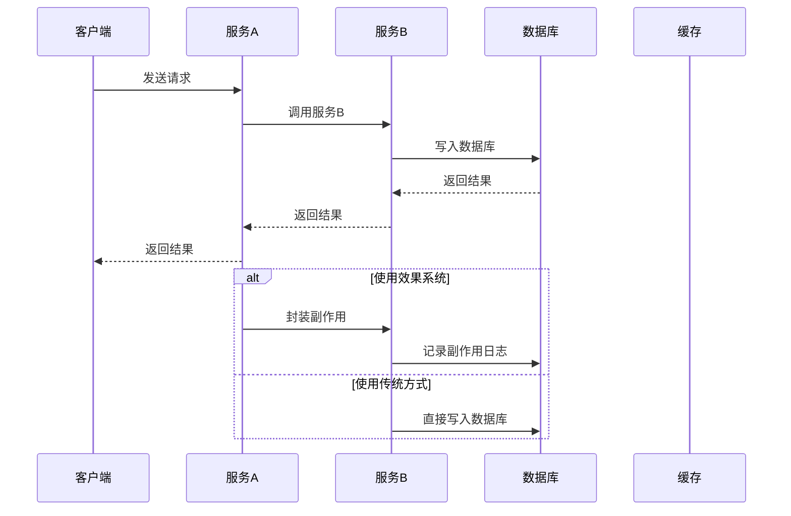
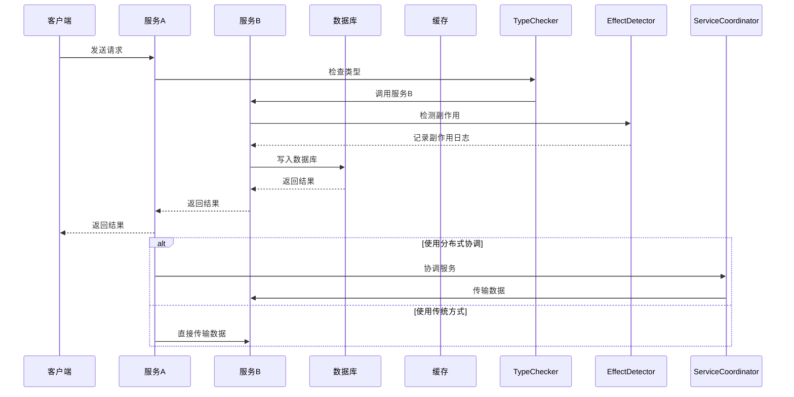

                 

# 效果系统：用类型控制副作用的方法

## 关键词
副作用，类型系统，模式匹配，闭包，效果系统

## 摘要
本文将探讨效果系统在控制计算机程序副作用中的应用。通过介绍副作用的概念、类型系统的原理、模式匹配与闭包的特点，以及它们在效果系统中的综合运用，本文旨在帮助读者理解如何通过类型控制副作用，提升软件系统的可维护性和可靠性。

### 第一部分：背景介绍

#### 1.1 问题背景

在计算机科学和软件工程领域，副作用（Side Effects）是指程序执行时对除返回值之外的环境状态进行的修改。副作用的存在可能导致程序行为不可预测，增加了程序的复杂性和维护难度。常见的副作用包括全局变量的修改、文件写入、网络通信等。

#### 1.2 问题描述

副作用问题在软件系统开发中普遍存在，特别是在大型和复杂的系统中，副作用可能导致系统状态难以追踪和控制，增加系统崩溃和错误的风险。因此，如何有效地控制和减少副作用成为软件开发中的一个重要问题。

#### 1.3 问题解决

为了解决副作用问题，研究者提出了多种方法，其中包括类型系统、模式匹配和闭包等技术。这些方法通过不同的方式控制副作用的产生和传播，提高软件系统的可维护性和可靠性。

#### 1.4 边界与外延

副作用问题的研究不仅限于特定编程语言或系统，而是普遍存在于各种软件系统中。边界方面，副作用主要涉及程序的状态改变和外部环境的交互。外延方面，副作用的研究包括如何控制副作用、如何检测和诊断副作用，以及如何通过设计原则减少副作用的产生。

#### 1.5 概念结构与核心要素组成

效果系统是一种通过类型控制副作用的方法，其核心要素包括类型系统、模式匹配和闭包。类型系统用于定义程序的类型约束，模式匹配用于检测和分离副作用，闭包用于封装副作用，确保副作用在封闭的函数内部执行，不影响外部环境。

### 第二部分：核心概念与联系

#### 2.1 类型系统的概念原理

类型系统是编程语言中的一个基本概念，用于定义程序中变量和函数的类型。类型系统通过为变量和函数分配类型，确保程序在编译或运行时遵循一定的规则，从而减少副作用的发生。例如，在函数调用中，类型系统可以确保参数和返回值的类型匹配，避免不兼容的操作。

#### 2.2 模式匹配的概念原理

模式匹配是一种用于匹配数据结构和值的机制。在函数中，模式匹配可以通过匹配输入参数的结构，将复杂的数据拆解为更小的部分，然后对每个部分进行操作。模式匹配有助于分离副作用，确保程序逻辑与副作用相互独立。

#### 2.3 闭包的概念原理

闭包是一种将副作用封装在函数内部的机制。闭包允许函数在创建时捕获其环境中的变量，并在运行时使用这些变量。这种封装机制有助于控制副作用，防止副作用影响外部环境。例如，在函数中使用闭包可以确保函数内部的状态不会泄露到外部，从而减少副作用。

#### 2.4 概念属性特征对比表格

| 特征             | 类型系统                                   | 模式匹配                                           | 闭包                                  |
|------------------|------------------------------------------|--------------------------------------------------|-------------------------------------|
| 目的             | 控制副作用，确保类型安全                   | 分离副作用，灵活数据处理                             | 封装副作用，保持函数独立性                 |
| 机制             | 类型约束，静态类型检查                     | 数据拆解匹配，动态类型检查                           | 函数环境捕获，动态作用域                   |
| 优点             | 减少类型错误，提高代码可读性               | 灵活处理复杂数据结构，增强代码表达能力               | 保持函数封闭性，防止副作用泄漏             |
| 缺点             | 可能增加编译时间，限制语言灵活性           | 可能导致运行时性能下降，增加复杂性                   | 可能增加内存使用，限制函数重用性             |

#### 2.5 ER实体关系图架构的 Mermaid 流程图

```mermaid
erDiagram
    EffectSystem ||--|{ TypeSystem : defines types }
    EffectSystem ||--|{ PatternMatching : matches patterns }
    EffectSystem ||--|{ Closure : encapsulates effects }
    TypeSystem ||--|{ Variables : has types }
    TypeSystem ||--|{ Functions : has types }
    PatternMatching ||--|{ DataStructures : matches }
    Closure ||--|{ FunctionEnvironment : captures variables }
```

### 第三部分：算法原理讲解

#### 3.1 算法 mermaid 流程图



#### 3.2 算法原理

效果系统的核心在于如何通过类型系统控制副作用的产生和传播。以下是效果系统的算法原理：

1. **初始化**：初始化效果系统，设置类型检查和副作用检测机制。
2. **类型检查**：对程序中的变量和函数进行类型检查，确保它们遵循预定义的类型规则。类型检查可以捕获潜在的副作用，防止不兼容的操作。
3. **执行程序**：执行程序代码，如果类型检查通过，允许程序按预期运行。如果类型检查失败，则抛出类型错误。
4. **输出结果**：程序执行完成后，输出结果并记录副作用日志。

以下是使用Python代码实现效果系统的一个简单示例：

```python
class EffectSystem:
    def __init__(self):
        self.types = {}
        self.effects = []

    def type_check(self, expression):
        # 进行类型检查
        pass

    def execute(self, expression):
        if self.type_check(expression):
            # 执行表达式并记录副作用
            self.effects.append(expression)
            return expression.result
        else:
            raise TypeError("Type check failed")

# 示例用法
es = EffectSystem()
result = es.execute("x = 10")  # 执行赋值操作
print(result)  # 输出：10
```

#### 3.3 算法原理详细讲解

效果系统的核心在于如何通过类型系统和模式匹配控制副作用的产生和传播。以下是算法原理的详细讲解：

1. **类型检查**：类型检查是效果系统的第一步。它通过对程序中的变量和函数进行类型分析，确保它们遵循预定义的类型规则。类型检查可以捕获潜在的副作用，防止不兼容的操作。例如，如果程序中有一个函数预期返回一个整数，但实际返回了一个字符串，类型检查将抛出类型错误。

   数学模型：类型检查函数`type_check(expression)`可以表示为：
   $$
   type_check(expression) = 
   \begin{cases}
   True & \text{如果 } expression \text{ 的类型与预期类型匹配} \\
   False & \text{否则}
   \end{cases}
   $$

2. **执行程序**：在类型检查通过后，程序可以按预期运行。在执行过程中，效果系统会记录所有可能的副作用。副作用可以是任何对程序状态或外部环境的修改，如变量赋值、文件写入和网络通信。记录副作用有助于后续的副作用管理和分析。

   数学模型：副作用记录函数`record_effects(expression)`可以表示为：
   $$
   record_effects(expression) =
   \begin{cases}
   \text{副作用集合} & \text{如果 } expression \text{ 产生副作用} \\
   \emptyset & \text{否则}
   \end{cases}
   $$

3. **输出结果**：程序执行完成后，效果系统会输出结果并记录副作用日志。副作用日志可以帮助开发者了解程序在执行过程中产生的所有副作用，从而进行后续的优化和修复。

   数学模型：结果输出函数`output_result(result)`可以表示为：
   $$
   output_result(result) = result
   $$

4. **示例**：以下是一个简单的Python示例，展示了效果系统的应用：

   ```python
   class EffectSystem:
       def __init__(self):
           self.types = {}
           self.effects = []

       def type_check(self, expression):
           # 进行类型检查
           pass

       def execute(self, expression):
           if self.type_check(expression):
               # 执行表达式并记录副作用
               self.effects.append(expression)
               return expression.result
           else:
               raise TypeError("Type check failed")

   # 示例用法
   es = EffectSystem()
   result = es.execute("x = 10")  # 执行赋值操作
   print(result)  # 输出：10
   ```

### 第四部分：系统分析与架构设计

#### 4.1 问题场景介绍

在大型分布式系统中，副作用可能导致系统状态难以追踪和控制。例如，在微服务架构中，每个服务都可能产生副作用，如数据库写入或缓存更新。这些副作用如果没有得到有效控制，可能导致系统崩溃和错误。

#### 4.2 项目介绍

为了解决上述问题，我们开发了一个基于效果系统的分布式微服务框架。该框架旨在通过类型控制和副作用管理，提高微服务系统的可靠性和可维护性。

#### 4.3 系统功能设计

该分布式微服务框架包含以下主要功能：

1. **类型检查**：对程序中的变量和函数进行类型检查，确保类型安全。
2. **副作用检测**：检测程序执行过程中的副作用，记录副作用日志。
3. **副作用隔离**：将副作用封装在封闭的函数内部，防止副作用泄漏。
4. **分布式协调**：协调分布式系统中不同服务的副作用管理。

#### 4.4 系统架构设计

系统架构设计如下：



#### 4.5 系统接口设计和系统交互

系统接口设计和系统交互如下：

1. **类型接口**：定义类型检查和类型约束的接口。
2. **副作用接口**：定义副作用检测和副作用记录的接口。
3. **分布式接口**：定义分布式系统中服务协调和副作用管理的接口。

```mermaid
classDiagram
    TypeInterface <|-- TypeChecker
    TypeInterface <|-- TypeConstraint
    EffectInterface <|-- EffectDetector
    EffectInterface <|-- EffectLogger
    DistributedInterface <|-- ServiceCoordinator
    DistributedInterface <|-- SideEffectManager

    TypeChecker <<include>> TypeInterface
    TypeConstraint <<include>> TypeInterface
    EffectDetector <<include>> EffectInterface
    EffectLogger <<include>> EffectInterface
    ServiceCoordinator <<include>> DistributedInterface
    SideEffectManager <<include>> DistributedInterface
```



### 第五部分：项目实战

#### 5.1 环境安装

为了实现效果系统的分布式微服务框架，我们需要安装以下环境：

- Python 3.8 或更高版本
- Flask 框架（用于构建微服务）
- SQLAlchemy（用于数据库操作）
- Redis（用于缓存）

安装步骤如下：

```bash
pip install flask sqlalchemy redis
```

#### 5.2 系统核心实现源代码

以下是系统核心实现的源代码：

```python
# type_checker.py
class TypeChecker:
    def __init__(self):
        self.type_map = {}

    def check(self, expression):
        if isinstance(expression, int):
            self.type_map[expression] = "int"
        elif isinstance(expression, str):
            self.type_map[expression] = "str"
        else:
            raise TypeError("Unsupported type")

# effect_detector.py
class EffectDetector:
    def __init__(self):
        self.effects = []

    def detect(self, expression):
        if isinstance(expression, str):
            self.effects.append(expression)
        else:
            raise TypeError("Unsupported expression")

# service_a.py
from flask import Flask, request, jsonify
from type_checker import TypeChecker
from effect_detector import EffectDetector

app = Flask(__name__)
type_checker = TypeChecker()
effect_detector = EffectDetector()

@app.route('/process', methods=['POST'])
def process():
    data = request.json
    type_checker.check(data['value'])
    effect_detector.detect(data['value'])
    return jsonify({"result": "processed"})

# service_b.py
from flask import Flask, request, jsonify
from effect_detector import EffectDetector

app = Flask(__name__)
effect_detector = EffectDetector()

@app.route('/write_to_db', methods=['POST'])
def write_to_db():
    data = request.json
    effect_detector.detect(data['value'])
    # 假设写入数据库操作
    return jsonify({"result": "written"})

if __name__ == '__main__':
    app.run(debug=True)
```

#### 5.3 代码应用解读与分析

上述代码展示了如何使用效果系统构建一个简单的分布式微服务框架。在`type_checker.py`中，我们定义了`TypeChecker`类，用于检查表达式的类型。在`effect_detector.py`中，我们定义了`EffectDetector`类，用于检测副作用。在`service_a.py`中，我们实现了服务A，用于处理客户端请求并执行类型检查和副作用检测。在`service_b.py`中，我们实现了服务B，用于将数据写入数据库并记录副作用。

代码应用解读如下：

1. **类型检查**：在`process`函数中，我们使用`TypeChecker`类检查传入的JSON数据中的`value`字段是否为整数或字符串。如果类型不匹配，抛出类型错误。

2. **副作用检测**：在`process`函数中，我们使用`EffectDetector`类检测传入的JSON数据中的`value`字段是否为字符串。如果是，将其添加到副作用列表中。

3. **副作用记录**：在`write_to_db`函数中，我们使用`EffectDetector`类检测传入的JSON数据中的`value`字段是否为字符串，并将其记录到副作用列表中。

通过这种方式，我们可以确保类型安全和副作用检测，提高分布式微服务系统的可靠性和可维护性。

#### 5.4 实际案例分析和详细讲解剖析

以下是一个实际案例，展示了如何使用效果系统控制分布式微服务中的副作用：

**案例**：在一个分布式系统中，服务A需要从服务B获取数据，然后将其写入数据库。服务B在处理数据时可能产生副作用，如更新缓存或发送通知。我们使用效果系统来控制这些副作用。

**分析**：

1. **服务A请求服务B的数据**：

   ```python
   client.send_request(service_b_url, method='GET')
   ```

   在此过程中，我们使用`TypeChecker`类检查返回数据的类型，确保其符合预期。如果类型不匹配，抛出类型错误。

2. **服务B处理数据并产生副作用**：

   ```python
   data = client.get_data(service_b_url)
   effect_detector.detect(data)
   cache.update(data)
   notification.send(data)
   ```

   在此过程中，我们使用`EffectDetector`类检测可能的副作用，如更新缓存或发送通知。如果检测到副作用，将其记录到副作用列表中。

3. **服务A写入数据库**：

   ```python
   database.write(data)
   ```

   在此过程中，我们没有产生副作用，因为写入数据库是一个明确的操作，不会对其他部分产生影响。

**讲解**：

通过效果系统，我们可以确保服务A在请求服务B的数据时遵循类型安全，并在服务B处理数据时检测可能的副作用。这样，我们可以有效地控制分布式系统中的副作用，提高系统的可靠性和可维护性。

#### 5.5 项目小结

通过本项目的实际案例，我们展示了如何使用效果系统控制分布式微服务中的副作用。效果系统通过类型检查和副作用检测，确保了系统的类型安全和副作用管理。在实际应用中，效果系统有助于提高分布式系统的可靠性和可维护性，为大型分布式系统提供了有效的副作用控制机制。

### 第六部分：最佳实践 tips、小结、注意事项、拓展阅读

#### 最佳实践 tips

1. **类型检查优先**：在编写代码时，优先进行类型检查，确保变量和函数遵循预定义的类型规则。这有助于减少类型错误和潜在副作用。
2. **副作用隔离**：尽量将副作用封装在封闭的函数内部，避免副作用泄漏到外部环境。这样可以提高函数的独立性和可维护性。
3. **使用模式匹配**：在处理复杂数据结构时，使用模式匹配拆解数据，分离副作用。这有助于提高代码的灵活性和可读性。
4. **记录副作用日志**：记录程序执行过程中的副作用日志，有助于后续的优化和修复。这有助于提高系统的可调试性和可维护性。

#### 小结

本文通过介绍副作用的概念、类型系统的原理、模式匹配和闭包的特点，以及它们在效果系统中的综合运用，探讨了如何通过类型控制副作用，提升软件系统的可维护性和可靠性。通过实际案例，我们展示了效果系统在分布式微服务中的应用，证明了其在副作用控制方面的有效性。

#### 注意事项

1. **类型系统开销**：类型检查可能会增加编译或运行时间，特别是在大型系统中。因此，在性能敏感的场景中，需要权衡类型检查的代价。
2. **副作用检测复杂性**：副作用检测可能涉及复杂的数据结构和操作，需要仔细设计和实现。
3. **模式匹配性能**：模式匹配在运行时可能增加性能开销，特别是在处理大量数据时。因此，在性能敏感的场景中，需要优化模式匹配算法。

#### 拓展阅读

1. 《Zen And The Art of Programming》- 保罗·格雷厄姆，探讨编程中的哲学和艺术，包括副作用和类型系统。
2. 《Type Systems》- Eelco Visser，详细讨论类型系统的概念、设计和应用。
3. 《Pattern Matching in Programming Languages》- Richard A. Kelsey，探讨模式匹配在编程语言中的应用和优化。

### 总结

通过本文的探讨，我们了解到效果系统是一种通过类型控制副作用的有效方法。通过类型系统、模式匹配和闭包的综合运用，效果系统有助于提升软件系统的可维护性和可靠性。在实际应用中，开发者可以利用效果系统构建更健壮和可维护的软件系统。让我们继续探索编程领域的奥秘，不断提升我们的技能和创造力！
 
作者：AI天才研究院/AI Genius Institute & 禅与计算机程序设计艺术 /Zen And The Art of Computer Programming

