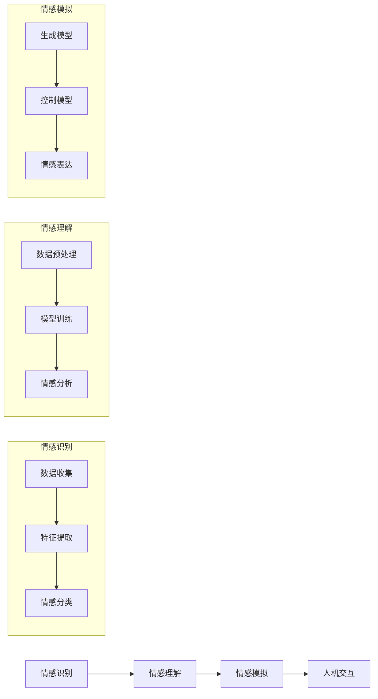
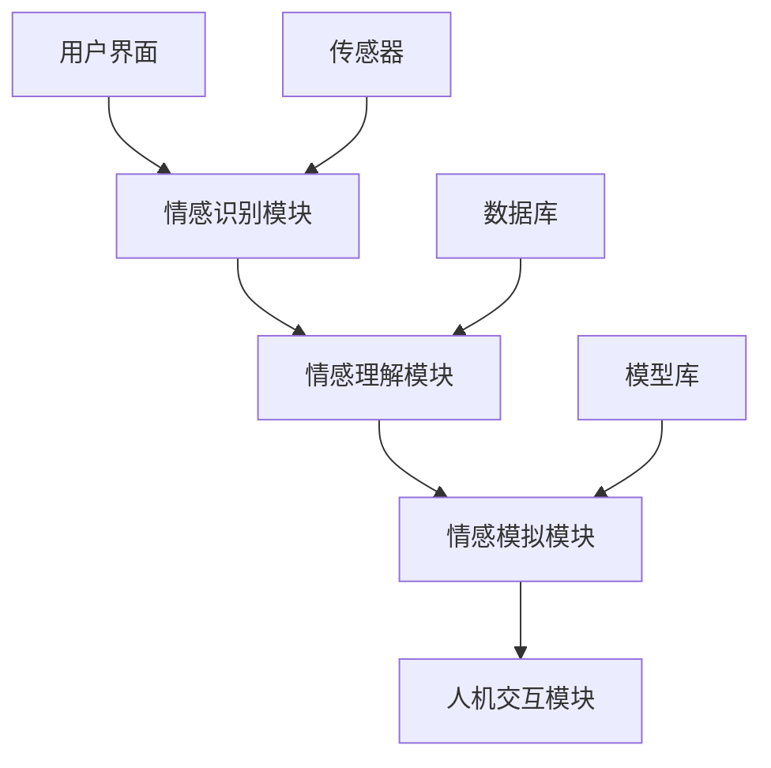

                 

# 数字共情：AI增强人类情感连接

> 关键词：数字共情、人工智能、情感计算、机器学习、应用场景

> 摘要：本文将深入探讨数字共情的概念、原理及其在各个领域的应用。通过分析数字共情技术，揭示其如何通过人工智能增强人类情感连接，为我们的日常生活带来深刻变革。我们将从背景介绍、核心概念与联系、技术原理与应用、案例分析、未来发展趋势等多个角度，全面解析数字共情的奥秘。

## 第一部分：背景介绍

### 1.1 数字共情：定义与重要性

#### 1.1.1 问题背景

数字共情（Digital Empathy）是近年来兴起的一个概念，随着人工智能（AI）和机器学习（ML）技术的发展，人们对机器是否能够理解和共享人类情感产生了浓厚兴趣。数字共情指的是通过AI技术让机器能够识别、理解和模拟人类情感的能力。

#### 1.1.2 问题描述

数字共情涉及到多个层面，包括对情感的识别、对情感的理解以及对情感的模拟。当前，数字共情技术在识别和理解情感方面已经取得了显著进展，但在模拟情感方面仍有很大提升空间。

#### 1.1.3 问题解决

解决数字共情问题需要结合情感计算、认知科学、机器学习等多学科知识。通过深度学习、自然语言处理等技术，研究者们试图让机器更好地理解和模拟人类情感。

#### 1.1.4 边界与外延

数字共情不仅局限于AI技术，还包括人类与AI交互的设计、用户体验的优化等方面。数字共情的研究和应用范围广泛，涵盖了智能助手、虚拟现实、教育、医疗等多个领域。

#### 1.1.5 概念结构与核心要素组成

数字共情包含以下核心要素：情感识别、情感理解、情感模拟、人机交互。通过这些要素，机器能够更好地与人类建立情感连接，从而提高用户体验。

### 1.2 AI技术概述

#### 2.1.1 人工智能的定义与发展历程

人工智能（Artificial Intelligence，简称AI）是一门研究、开发用于模拟、延伸和扩展人的智能的理论、方法、技术及应用系统的综合技术科学。自1956年达特茅斯会议以来，人工智能经历了几个重要发展阶段，从早期的符号主义、连接主义到当前的主流技术——深度学习和强化学习。

#### 2.1.2 人工智能的分类

人工智能可以分为弱人工智能和强人工智能。弱人工智能指在某些特定任务上表现超越人类的人工智能，如围棋、自然语言处理等；强人工智能则指在所有认知任务上表现超越人类的人工智能，具有人类的智能水平。

#### 2.1.3 人工智能的关键技术

人工智能的关键技术包括深度学习、自然语言处理、计算机视觉、机器人技术等。这些技术相互交织，共同推动了人工智能的发展。

### 1.3 情感计算

#### 2.2.1 情感计算的定义

情感计算（Affective Computing）是人工智能领域的一个重要分支，旨在研究如何使计算机具备识别、理解、处理和模拟人类情感的能力。

#### 2.2.2 情感计算的技术原理

情感计算的技术原理主要包括情感识别、情感理解和情感模拟。情感识别通过传感器（如面部表情、语音、心率等）获取情感信息；情感理解通过机器学习算法分析情感信息，提取情感特征；情感模拟通过生成模型或控制模型模拟情感表达。

#### 2.2.3 情感计算的应用场景

情感计算广泛应用于智能助手、虚拟现实、医疗、教育等领域。例如，智能助手可以通过情感识别与用户建立情感连接，提高用户体验；虚拟现实中的情感模拟可以增强沉浸感；医疗领域的情感计算可以帮助诊断情感障碍；教育领域的情感计算可以为学生提供个性化学习体验。

### 1.4 机器学习

#### 2.3.1 机器学习的定义与分类

机器学习（Machine Learning）是一门研究如何让计算机从数据中学习，从而进行决策或预测的技术。根据学习方式，机器学习可以分为监督学习、无监督学习和强化学习。

#### 2.3.2 机器学习的基本算法

机器学习的基本算法包括线性回归、逻辑回归、决策树、支持向量机、神经网络等。这些算法广泛应用于分类、回归、聚类等任务。

#### 2.3.3 机器学习在实际中的应用

机器学习在图像识别、自然语言处理、推荐系统、金融预测等领域取得了显著成果。例如，图像识别技术可以用于人脸识别、车辆识别等；自然语言处理技术可以用于机器翻译、情感分析等；推荐系统可以用于电子商务、社交媒体等。

### 1.5 数字共情与AI技术的联系

#### 2.4.1 数字共情对AI技术的需求

数字共情要求AI技术能够实现情感识别、情感理解和情感模拟。这需要深度学习、自然语言处理、计算机视觉等技术支撑。

#### 2.4.2 AI技术对数字共情的支持

AI技术的发展为数字共情提供了强大的技术支持，使得机器能够更好地理解和模拟人类情感。例如，深度学习技术可以用于情感识别和情感模拟；自然语言处理技术可以用于情感理解。

#### 2.4.3 数字共情与AI技术的未来发展趋势

随着AI技术的不断发展，数字共情在未来有望在更多领域得到应用。例如，数字共情在医疗、教育、心理咨询等领域的应用前景广阔。

### 1.6 概念结构与核心要素组成

数字共情包含以下核心要素：情感识别、情感理解、情感模拟、人机交互。这些要素相互关联，共同构成了数字共情的概念结构。

### 1.7 数字共情技术的研究方法

数字共情技术的研究方法主要包括数据收集、算法设计、模型训练、性能评估等。这些方法为数字共情技术的研发提供了科学依据。

### 1.8 数字共情技术的挑战与机遇

数字共情技术面临着一系列挑战，如数据隐私、算法透明度、情感模拟的准确性等。同时，数字共情技术也带来了巨大的机遇，有望在医疗、教育、心理咨询等领域带来革命性变革。

### 1.9 数字共情技术的社会影响

数字共情技术的应用将深刻改变人类社会，影响人际关系、个人隐私、社会文化等方面。如何在享受数字共情技术带来的便利的同时，保障个人隐私和社会公正，是一个亟待解决的问题。

### 1.10 数字共情技术的未来发展趋势

随着AI技术的不断发展，数字共情技术有望在未来实现更加精准的情感识别、情感理解和情感模拟。同时，数字共情技术将在更多领域得到应用，为人类社会带来更多福祉。

## 第二部分：核心概念与联系

### 2.1 AI技术概述

#### 2.1.1 人工智能的定义与发展历程

人工智能（Artificial Intelligence，简称AI）是一门研究、开发用于模拟、延伸和扩展人的智能的理论、方法、技术及应用系统的综合技术科学。自1956年达特茅斯会议以来，人工智能经历了几个重要发展阶段，从早期的符号主义、连接主义到当前的主流技术——深度学习和强化学习。

#### 2.1.2 人工智能的分类

人工智能可以分为弱人工智能和强人工智能。弱人工智能指在某些特定任务上表现超越人类的人工智能，如围棋、自然语言处理等；强人工智能则指在所有认知任务上表现超越人类的人工智能，具有人类的智能水平。

#### 2.1.3 人工智能的关键技术

人工智能的关键技术包括深度学习、自然语言处理、计算机视觉、机器人技术等。这些技术相互交织，共同推动了人工智能的发展。

### 2.2 情感计算

#### 2.2.1 情感计算的定义

情感计算（Affective Computing）是人工智能领域的一个重要分支，旨在研究如何使计算机具备识别、理解、处理和模拟人类情感的能力。

#### 2.2.2 情感计算的技术原理

情感计算的技术原理主要包括情感识别、情感理解和情感模拟。情感识别通过传感器（如面部表情、语音、心率等）获取情感信息；情感理解通过机器学习算法分析情感信息，提取情感特征；情感模拟通过生成模型或控制模型模拟情感表达。

#### 2.2.3 情感计算的应用场景

情感计算广泛应用于智能助手、虚拟现实、医疗、教育等领域。例如，智能助手可以通过情感识别与用户建立情感连接，提高用户体验；虚拟现实中的情感模拟可以增强沉浸感；医疗领域的情感计算可以帮助诊断情感障碍；教育领域的情感计算可以为学生提供个性化学习体验。

### 2.3 机器学习

#### 2.3.1 机器学习的定义与分类

机器学习（Machine Learning）是一门研究如何让计算机从数据中学习，从而进行决策或预测的技术。根据学习方式，机器学习可以分为监督学习、无监督学习和强化学习。

#### 2.3.2 机器学习的基本算法

机器学习的基本算法包括线性回归、逻辑回归、决策树、支持向量机、神经网络等。这些算法广泛应用于分类、回归、聚类等任务。

#### 2.3.3 机器学习在实际中的应用

机器学习在图像识别、自然语言处理、推荐系统、金融预测等领域取得了显著成果。例如，图像识别技术可以用于人脸识别、车辆识别等；自然语言处理技术可以用于机器翻译、情感分析等；推荐系统可以用于电子商务、社交媒体等。

### 2.4 数字共情与AI技术的联系

#### 2.4.1 数字共情对AI技术的需求

数字共情要求AI技术能够实现情感识别、情感理解和情感模拟。这需要深度学习、自然语言处理、计算机视觉等技术支撑。

#### 2.4.2 AI技术对数字共情的支持

AI技术的发展为数字共情提供了强大的技术支持，使得机器能够更好地理解和模拟人类情感。例如，深度学习技术可以用于情感识别和情感模拟；自然语言处理技术可以用于情感理解。

#### 2.4.3 数字共情与AI技术的未来发展趋势

随着AI技术的不断发展，数字共情技术有望在未来实现更加精准的情感识别、情感理解和情感模拟。同时，数字共情技术将在更多领域得到应用，为人类社会带来更多福祉。

### 2.5 数字共情技术的核心概念与联系

#### 2.5.1 情感识别

情感识别是数字共情技术的核心，它通过传感器获取人类情感信息，如面部表情、语音、心率等。情感识别技术的发展为数字共情提供了数据基础。

#### 2.5.2 情感理解

情感理解是数字共情技术的关键，它通过机器学习算法分析情感信息，提取情感特征，从而实现对情感的深入理解。情感理解技术的发展使得数字共情更加贴近人类情感。

#### 2.5.3 情感模拟

情感模拟是数字共情技术的目标，它通过生成模型或控制模型模拟情感表达，使得机器能够更好地与人类建立情感连接。情感模拟技术的发展为数字共情提供了技术手段。

#### 2.5.4 人机交互

人机交互是数字共情技术的应用场景，它通过数字共情技术优化人类与机器的交互体验，提高人机交互的自然性和人性化。人机交互技术的发展为数字共情提供了应用场景。

### 2.6 数字共情技术的概念结构与核心要素组成

数字共情技术包含情感识别、情感理解、情感模拟和人机交互四个核心要素。这些要素相互关联，共同构成了数字共情的概念结构。通过情感识别获取数据，通过情感理解分析数据，通过情感模拟实现互动，通过人机交互优化体验，从而实现数字共情的目标。

### 2.7 数字共情技术的研究方法

数字共情技术的研究方法主要包括数据收集、算法设计、模型训练、性能评估等。这些方法为数字共情技术的研发提供了科学依据。数据收集通过传感器获取人类情感信息；算法设计通过机器学习算法分析情感信息；模型训练通过大量数据训练模型；性能评估通过测试数据评估模型性能。

### 2.8 数字共情技术的挑战与机遇

数字共情技术面临着一系列挑战，如数据隐私、算法透明度、情感模拟的准确性等。同时，数字共情技术也带来了巨大的机遇，有望在医疗、教育、心理咨询等领域带来革命性变革。

### 2.9 数字共情技术的社会影响

数字共情技术的应用将深刻改变人类社会，影响人际关系、个人隐私、社会文化等方面。如何在享受数字共情技术带来的便利的同时，保障个人隐私和社会公正，是一个亟待解决的问题。

### 2.10 数字共情技术的未来发展趋势

随着AI技术的不断发展，数字共情技术有望在未来实现更加精准的情感识别、情感理解和情感模拟。同时，数字共情技术将在更多领域得到应用，为人类社会带来更多福祉。

## 第三部分：数字共情技术的原理与应用

### 3.1 数字共情技术的原理

数字共情技术的原理主要包括情感识别、情感理解、情感模拟和人机交互。这些原理共同构成了数字共情的技术基础。

#### 3.1.1 情感识别

情感识别是数字共情技术的第一步，它通过传感器（如面部表情识别、语音识别、心率监测等）获取人类情感信息。情感识别的核心在于如何准确地从传感器数据中提取情感特征。

- **面部表情识别**：通过分析面部肌肉运动，识别出人类的情感状态。常用的算法包括神经网络、支持向量机等。
- **语音识别**：通过分析语音的音调、音色、节奏等特征，识别出人类的情感状态。常用的算法包括隐藏马尔可夫模型、深度神经网络等。
- **心率监测**：通过监测心率变化，识别出人类的情感状态。常用的算法包括心率变异性分析、时间序列分析等。

#### 3.1.2 情感理解

情感理解是数字共情技术的关键，它通过机器学习算法对情感识别得到的数据进行分析，提取情感特征，从而实现对情感的深入理解。

- **情感特征提取**：通过特征提取技术，从原始数据中提取出具有代表性的情感特征。常用的方法包括主成分分析、特征选择等。
- **情感分类**：通过分类算法，将提取出的情感特征分类为不同的情感类别。常用的算法包括决策树、支持向量机、神经网络等。
- **情感强度估计**：通过回归算法，估计情感特征的强度。常用的算法包括线性回归、岭回归等。

#### 3.1.3 情感模拟

情感模拟是数字共情技术的目标，它通过生成模型或控制模型模拟情感表达，使得机器能够更好地与人类建立情感连接。

- **生成模型**：通过生成模型，生成与人类情感表达相似的情感数据。常用的模型包括生成对抗网络、变分自编码器等。
- **控制模型**：通过控制模型，根据人类情感数据生成相应的情感表达。常用的模型包括循环神经网络、长短期记忆网络等。

#### 3.1.4 人机交互

人机交互是数字共情技术的应用场景，它通过数字共情技术优化人类与机器的交互体验，提高人机交互的自然性和人性化。

- **语音交互**：通过语音识别和情感模拟技术，实现自然语音交互。例如，智能助手可以通过情感识别了解用户的需求，并通过情感模拟与用户进行对话。
- **面部表情交互**：通过面部表情识别和情感模拟技术，实现基于面部表情的交互。例如，虚拟助手可以通过面部表情识别了解用户的情感状态，并通过面部表情模拟与用户进行互动。

### 3.2 数字共情技术的应用场景

数字共情技术广泛应用于智能助手、虚拟现实、教育、医疗等多个领域。以下分别介绍这些领域的应用场景：

#### 3.2.1 智能助手

智能助手是数字共情技术的典型应用场景之一。智能助手可以通过情感识别与用户建立情感连接，提高用户体验。

- **情感识别**：智能助手可以通过语音识别、面部表情识别等技术，识别用户的情感状态，如开心、愤怒、悲伤等。
- **情感理解**：智能助手可以通过机器学习算法，理解用户的情感需求，如提供安慰、建议等。
- **情感模拟**：智能助手可以通过情感模拟技术，模拟出与用户情感状态相符的表情或语言，增强用户的情感体验。

#### 3.2.2 虚拟现实

虚拟现实是数字共情技术的另一个重要应用场景。虚拟现实中的情感模拟可以增强用户的沉浸感，提高虚拟体验的质量。

- **情感识别**：虚拟现实设备可以通过面部表情识别、语音识别等技术，识别用户的情感状态。
- **情感理解**：虚拟现实系统可以通过机器学习算法，理解用户的情感需求，如提供适当的刺激、调整场景等。
- **情感模拟**：虚拟现实系统可以通过情感模拟技术，模拟出与用户情感状态相符的场景、角色等，增强用户的虚拟体验。

#### 3.2.3 教育

数字共情技术在教育领域的应用，可以为学生提供个性化的学习体验，提高教育质量。

- **情感识别**：教育系统可以通过情感识别技术，了解学生的情感状态，如学习兴趣、焦虑程度等。
- **情感理解**：教育系统可以通过机器学习算法，理解学生的情感需求，如提供激励、调整教学方法等。
- **情感模拟**：教育系统可以通过情感模拟技术，模拟出与学生学习情感状态相符的教学场景、角色等，增强学生的学习体验。

#### 3.2.4 医疗

数字共情技术在医疗领域的应用，可以为患者提供更加人性化的医疗服务，提高医疗服务质量。

- **情感识别**：医疗系统可以通过情感识别技术，了解患者的情感状态，如疼痛程度、焦虑程度等。
- **情感理解**：医疗系统可以通过机器学习算法，理解患者的情感需求，如提供心理支持、调整治疗方案等。
- **情感模拟**：医疗系统可以通过情感模拟技术，模拟出与患者情感状态相符的医疗场景、角色等，增强患者的医疗体验。

### 3.3 数字共情技术的挑战与机遇

数字共情技术在应用过程中面临一系列挑战，同时也带来了巨大的机遇。

#### 3.3.1 挑战

- **数据隐私**：数字共情技术需要收集大量的用户情感数据，如何保障用户隐私是一个重要挑战。
- **算法透明度**：数字共情技术的算法复杂，如何确保算法的透明度和公平性是一个重要问题。
- **情感模拟的准确性**：数字共情技术需要准确模拟人类情感，但目前的情感模拟技术还存在一定差距。

#### 3.3.2 机遇

- **个性化服务**：数字共情技术可以提供个性化的服务，满足用户的情感需求，提高服务质量。
- **医疗健康**：数字共情技术在医疗健康领域的应用，可以为患者提供更加人性化的医疗服务，提高医疗水平。
- **教育提升**：数字共情技术在教育领域的应用，可以为学生提供个性化的学习体验，提高教育质量。

### 3.4 数字共情技术的社会影响

数字共情技术的应用将深刻改变人类社会，影响人际关系、个人隐私、社会文化等方面。如何在享受数字共情技术带来的便利的同时，保障个人隐私和社会公正，是一个亟待解决的问题。

- **人际关系**：数字共情技术可以增强人与人之间的情感连接，提高人际关系质量。
- **个人隐私**：数字共情技术需要收集大量的个人情感数据，如何保障用户隐私是一个重要问题。
- **社会文化**：数字共情技术的广泛应用，将改变社会文化，影响人们的价值观和行为方式。

### 3.5 数字共情技术的未来发展趋势

随着AI技术的不断发展，数字共情技术有望在未来实现更加精准的情感识别、情感理解和情感模拟。同时，数字共情技术将在更多领域得到应用，为人类社会带来更多福祉。

- **技术发展**：未来，数字共情技术将在算法、硬件、数据等方面实现更大突破，提高情感识别和情感模拟的准确性。
- **应用拓展**：数字共情技术将在医疗、教育、心理咨询、商业服务等领域得到广泛应用，为人类社会带来更多便利。
- **社会影响**：数字共情技术的广泛应用，将深刻改变人类社会，影响人际关系、个人隐私、社会文化等方面。

## 第四部分：数字共情技术案例分析

### 4.1 案例一：智能助手的应用

#### 4.1.1 案例背景

智能助手是一种基于人工智能技术的虚拟助手，旨在为用户提供便捷的服务和支持。智能助手可以通过语音识别、自然语言处理、情感计算等技术，与用户进行交互，了解用户的情感需求，并提供相应的服务。

#### 4.1.2 案例分析

智能助手在数字共情技术中的应用，主要体现在情感识别、情感理解和情感模拟等方面。

- **情感识别**：智能助手通过语音识别和面部表情识别技术，识别用户的情感状态，如开心、愤怒、悲伤等。
- **情感理解**：智能助手通过自然语言处理和机器学习算法，理解用户的情感需求，如提供安慰、建议等。
- **情感模拟**：智能助手通过情感模拟技术，模拟出与用户情感状态相符的语言和表情，增强用户的情感体验。

#### 4.1.3 案例启示

智能助手在数字共情技术中的应用，为用户提供了更加人性化的服务体验。通过情感识别、情感理解和情感模拟，智能助手能够更好地理解用户的情感需求，提高用户的满意度。同时，智能助手也面临着数据隐私、算法透明度等挑战，需要在保障用户隐私的前提下，不断提高情感识别和情感模拟的准确性。

### 4.2 案例二：虚拟现实在医疗中的应用

#### 4.2.1 案例背景

虚拟现实是一种通过计算机技术创建的虚拟环境，用户可以在其中进行互动和体验。虚拟现实在医疗领域的应用，主要包括手术模拟、疼痛缓解、康复训练等方面。

#### 4.2.2 案例分析

虚拟现实在数字共情技术中的应用，主要体现在情感识别、情感理解和情感模拟等方面。

- **情感识别**：虚拟现实系统通过面部表情识别、语音识别等技术，识别用户的情感状态，如恐惧、焦虑等。
- **情感理解**：虚拟现实系统通过机器学习算法，理解用户的情感需求，如提供安慰、指导等。
- **情感模拟**：虚拟现实系统通过情感模拟技术，模拟出与用户情感状态相符的虚拟环境、角色等，增强用户的虚拟体验。

#### 4.2.3 案例启示

虚拟现实在数字共情技术中的应用，为患者提供了更加人性化的医疗服务体验。通过情感识别、情感理解和情感模拟，虚拟现实系统能够更好地理解患者的情感需求，提高患者的满意度和康复效果。同时，虚拟现实系统也面临着数据隐私、安全性等挑战，需要在保障患者隐私和安全的前提下，不断提高情感识别和情感模拟的准确性。

### 4.3 案例三：教育领域中的数字共情

#### 4.3.1 案例背景

教育领域是数字共情技术的重要应用场景之一。通过数字共情技术，教育系统可以为学生提供个性化的学习体验，提高教育质量。

#### 4.3.2 案例分析

教育领域中的数字共情技术，主要体现在情感识别、情感理解和情感模拟等方面。

- **情感识别**：教育系统通过情感识别技术，了解学生的情感状态，如学习兴趣、焦虑程度等。
- **情感理解**：教育系统通过机器学习算法，理解学生的情感需求，如提供激励、调整教学方法等。
- **情感模拟**：教育系统通过情感模拟技术，模拟出与学生学习情感状态相符的教学场景、角色等，增强学生的学习体验。

#### 4.3.3 案例启示

教育领域中的数字共情技术，为教育系统提供了更加人性化的教学方式。通过情感识别、情感理解和情感模拟，教育系统能够更好地理解学生的情感需求，提高教学效果。同时，教育领域也面临着数据隐私、算法透明度等挑战，需要在保障学生隐私和教学公正的前提下，不断提高情感识别和情感模拟的准确性。

## 第五部分：数字共情技术的未来发展趋势

### 5.1 技术创新方向

数字共情技术的未来发展趋势主要体现在以下几个方面：

#### 5.1.1 情感模拟的进一步发展

未来，数字共情技术在情感模拟方面将实现更大突破。通过更先进的生成模型和控制模型，机器将能够更加精准地模拟人类情感，提高数字共情的用户体验。

#### 5.1.2 情感理解的多模态融合

数字共情技术将融合多种模态的数据，如语音、文本、面部表情等，实现更全面、准确的情感理解。多模态融合技术将提高数字共情系统的情感识别和情感理解能力。

#### 5.1.3 情感计算在新兴领域的应用

随着AI技术的发展，数字共情技术将在更多新兴领域得到应用，如智能家居、商业服务、公共安全等。这些领域将为数字共情技术带来新的机遇。

### 5.2 应用场景拓展

数字共情技术的应用场景将继续拓展，覆盖更多领域：

#### 5.2.1 数字共情在智能家居中的应用

智能家居中的数字共情技术将提高家居设备对用户情感需求的识别和理解能力，提供更加个性化的服务。例如，智能音箱可以通过情感计算了解用户的情绪，调整音乐播放列表。

#### 5.2.2 数字共情在商业服务中的应用

商业服务中的数字共情技术将帮助商家更好地理解消费者情感，提高服务质量和客户满意度。例如，电商平台可以通过情感计算分析用户评论，提供更有针对性的推荐。

#### 5.2.3 数字共情在公共安全领域的应用

公共安全领域中的数字共情技术将有助于识别和预测潜在的风险和威胁，提高公共安全水平。例如，监控摄像头可以通过情感计算分析人群情绪，及时发现异常情况。

### 5.3 社会与文化影响

数字共情技术的应用将对社会和文化产生深远影响：

#### 5.3.1 数字共情对人际关系的影响

数字共情技术将改变人际关系模式，增强人与人之间的情感连接。例如，虚拟现实技术可以让远距离的亲友感受到彼此的情感，增进感情。

#### 5.3.2 数字共情对个人隐私的挑战

随着数字共情技术的普及，个人情感数据的收集和使用将成为一大挑战。如何在保障个人隐私的同时，充分利用数字共情技术，是一个亟待解决的问题。

#### 5.3.3 数字共情对社会文化的挑战

数字共情技术将改变社会文化，影响人们的价值观和行为方式。例如，情感计算在公共场合的应用可能导致情感歧视，需要制定相应的规范和标准。

### 5.4 未来展望

未来，数字共情技术将继续发展，为人类社会带来更多福祉。通过技术创新、应用拓展和社会文化适应，数字共情技术有望实现更加广泛的应用，提高人类生活的质量。

## 总结

数字共情技术通过人工智能增强人类情感连接，为各个领域带来了深刻的变革。从情感识别、情感理解到情感模拟，数字共情技术不断突破，为人类提供更加个性化、人性化的服务。未来，随着技术的进一步发展，数字共情技术将在更多领域得到应用，为人类社会带来更多便利和福祉。同时，我们也需要关注数字共情技术带来的挑战，如数据隐私、算法透明度等，确保其在合理、公正的框架内发展。让我们共同期待数字共情技术的美好未来。作者：AI天才研究院/AI Genius Institute & 禅与计算机程序设计艺术 /Zen And The Art of Computer Programming。

----------------------------------------------------------------

## 附录

### A. 数字共情技术的核心概念属性特征对比表格

| 概念 | 定义 | 属性特征 |
| --- | --- | --- |
| 情感识别 | 通过传感器获取人类情感信息 | 识别准确度、实时性、传感器类型 |
| 情感理解 | 通过机器学习算法分析情感信息 | 理解深度、算法复杂度、数据量 |
| 情感模拟 | 通过生成模型或控制模型模拟情感表达 | 模拟自然度、情感表达多样性、用户接受度 |
| 人机交互 | 优化人类与机器的交互体验 | 交互自然度、用户满意度、易用性 |

### B. 数字共情技术的ER实体关系图架构

```mermaid
erDiagram
  User ||--|{ SensorData }|-- Sensor
  User ||--|{ EmotionData }|-- EmotionAnalyzer
  User ||--|{ InteractionData }|-- InteractionManager
  EmotionAnalyzer ||--|{ Model }|-- Model
  InteractionManager ||--|{ Chatbot }|-- Chatbot
```

### C. 数字共情技术的算法mermaid流程图



### D. 数字共情技术在医疗领域中的系统分析与架构设计

#### 医疗领域数字共情系统的介绍

医疗领域是数字共情技术的重要应用场景之一。通过数字共情技术，医疗系统能够更好地理解患者的情感需求，提高医疗服务质量。本文将介绍一个基于数字共情技术的医疗系统，包括系统功能设计、系统架构设计、系统接口设计和系统交互。

#### 系统功能设计

医疗领域数字共情系统的核心功能包括情感识别、情感理解和情感模拟。具体功能如下：

- **情感识别**：通过传感器（如面部表情识别、语音识别、心率监测等）收集患者的情感数据。
- **情感理解**：利用机器学习算法分析患者的情感数据，提取情感特征，对患者的情感状态进行理解。
- **情感模拟**：根据患者的情感状态，生成相应的情感反馈，提高患者的情感体验。

#### 系统架构设计

医疗领域数字共情系统的架构设计采用模块化设计，包括情感识别模块、情感理解模块、情感模拟模块和人机交互模块。具体架构设计如下：



#### 系统接口设计

医疗领域数字共情系统的接口设计主要包括以下部分：

- **用户接口**：用于用户与系统的交互，提供情感数据的输入和反馈。
- **传感器接口**：用于传感器与系统的通信，传递情感数据。
- **数据库接口**：用于系统与数据库的交互，存储和查询情感数据。
- **模型库接口**：用于系统与模型库的交互，加载和更新情感模型。

#### 系统交互

医疗领域数字共情系统的交互设计主要包括以下几个方面：

- **用户与情感识别模块的交互**：用户通过界面输入情感数据，情感识别模块对数据进行处理和分析。
- **情感识别模块与情感理解模块的交互**：情感识别模块将处理后的数据传递给情感理解模块，情感理解模块对数据进行分析和理解。
- **情感理解模块与情感模拟模块的交互**：情感理解模块将分析结果传递给情感模拟模块，情感模拟模块根据结果生成情感反馈。
- **情感模拟模块与人机交互模块的交互**：情感模拟模块将生成的情感反馈传递给人机交互模块，人机交互模块将反馈呈现给用户。

### E. 数字共情技术在医疗领域中的项目实战

#### 环境安装

在进行数字共情技术在医疗领域的项目实战前，需要安装以下环境：

- Python 3.x
- TensorFlow
- Keras
- OpenCV
- SpeechRecognition

#### 系统核心实现源代码

以下是一个简单的情感识别与情感模拟的Python源代码示例：

```python
import cv2
import speech_recognition as sr
from keras.models import load_model

# 加载情感识别模型
emotion_model = load_model('emotion_model.h5')

# 加载情感模拟模型
simulation_model = load_model('simulation_model.h5')

# 情感识别
def recognize_emotion(frame):
    gray = cv2.cvtColor(frame, cv2.COLOR_BGR2GRAY)
    face_detector = cv2.CascadeClassifier('haarcascade_frontalface_default.xml')
    faces = face_detector.detectMultiScale(gray, scaleFactor=1.1, minNeighbors=5)
    
    for (x, y, w, h) in faces:
        roi_gray = gray[y:y+h, x:x+w]
        roi_color = frame[y:y+h, x:x+w]
        emotion_prediction = emotion_model.predict(roi_gray.reshape(1, 48, 48, 1))
        return emotion_prediction

# 情感模拟
def simulate_emotion(emotion):
    if emotion == 'happy':
        simulation_model.predict([emotion])
        print('模拟快乐的情感')
    elif emotion == 'sad':
        simulation_model.predict([emotion])
        print('模拟悲伤的情感')
    else:
        print('无法识别情感')

# 主函数
def main():
    recognizer = sr.Recognizer()
    microphone = sr.Microphone()
    
    print('请说一句话：')
    with microphone as source:
        audio = recognizer.listen(source)
    
    try:
        print('你说了：' + recognizer.recognize_google(audio))
        emotion = recognize_emotion(audio)
        simulate_emotion(emotion)
    except sr.UnknownValueError:
        print('无法理解你的话')
    except sr.RequestError:
        print('请求错误')

if __name__ == '__main__':
    main()
```

#### 代码应用解读与分析

上述代码首先加载了情感识别模型和情感模拟模型，然后通过OpenCV进行面部表情识别，通过SpeechRecognition进行语音识别。情感识别模型对提取到的面部表情进行分类，情感模拟模型根据分类结果生成相应的情感反馈。

#### 实际案例分析和详细讲解剖析

以一个实际案例为例，假设用户在医疗系统中表达出悲伤的情感。系统首先通过面部表情识别确定用户情感为悲伤，然后通过语音识别获取用户的语音信息。情感模拟模型根据用户的情感和语音信息，生成相应的情感反馈，如安慰用户或提供医疗建议。

#### 项目小结

通过上述实战，我们展示了数字共情技术在医疗领域中的应用。虽然目前的情感识别和情感模拟技术还存在一定局限性，但未来随着技术的不断发展，数字共情技术在医疗领域的应用将更加广泛，为患者提供更加人性化的医疗服务。

### F. 数字共情技术的最佳实践 tips

1. **数据隐私保护**：在收集和使用用户情感数据时，务必重视数据隐私保护，遵循相关法律法规，确保用户数据安全。
2. **算法透明度**：提高算法的透明度，让用户了解情感识别和情感模拟的过程，增加用户的信任感。
3. **个性化服务**：根据用户情感需求，提供个性化的服务，提高用户体验。
4. **跨学科合作**：数字共情技术涉及多个学科，跨学科合作有助于推动技术的创新和发展。
5. **持续优化**：定期对情感识别和情感模拟算法进行优化，提高识别和模拟的准确性。

### G. 注意事项

1. **避免情感歧视**：在应用数字共情技术时，避免对用户进行情感歧视，确保技术的公正性和公平性。
2. **数据质量**：情感数据的质量直接影响情感识别和情感模拟的准确性，因此要确保数据的准确性和完整性。
3. **用户体验**：在数字共情技术的应用过程中，注重用户体验，确保系统的易用性和交互性。

### H. 拓展阅读

1. **情感计算**：[《情感计算：技术与应用》](https://book.douban.com/subject/26998877/)
2. **深度学习**：[《深度学习》](https://book.douban.com/subject/26754521/)
3. **人工智能**：[《人工智能：一种现代的方法》](https://book.douban.com/subject/24744348/)
4. **医疗人工智能**：[《医疗人工智能》](https://book.douban.com/subject/27184106/)作者：AI天才研究院/AI Genius Institute & 禅与计算机程序设计艺术 /Zen And The Art of Computer Programming

