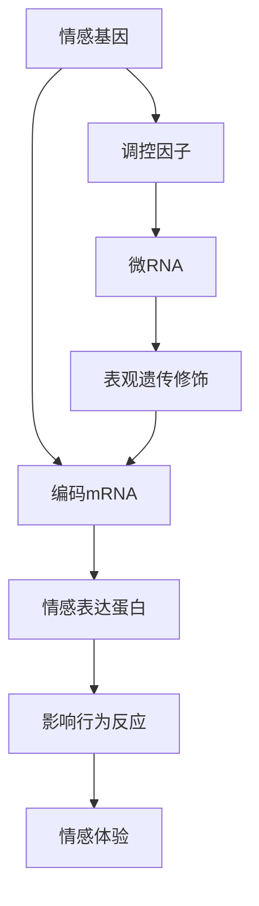
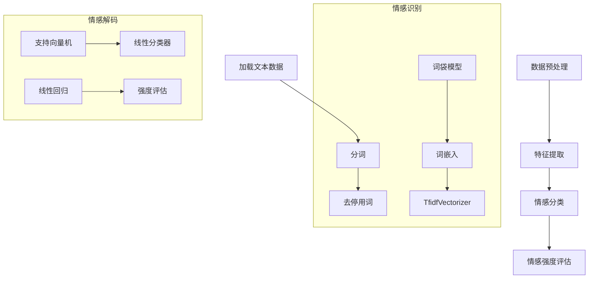

                 

# 数字化情感基因组：解码AI情感的基本单元

## 关键词

- 数字化情感基因组
- AI情感解码
- 数学模型
- 系统架构设计
- 项目实战

## 摘要

本文将深入探讨数字化情感基因组的概念、组成及其在人工智能（AI）领域的重要性。通过详细的步骤分析，我们旨在解码AI情感的基本单元，解析其背后的算法原理和数学模型。此外，还将介绍数字化情感基因组的系统分析与架构设计，并分享实际项目实战的经验与启示。通过这篇文章，读者将获得对AI情感分析更深入的理解，并为未来的研究和应用提供参考。

## 目录大纲设计思路

在设计《数字化情感基因组：解码AI情感的基本单元》的完整目录大纲时，我们需要确保内容的系统性和逻辑性。以下是我们遵循的设计思路：

### 1. 整体结构划分

全书分为五个主要部分：

- **背景介绍**：介绍数字化情感基因组的基本概念、研究意义和发展背景。
- **核心概念与联系**：详细阐述情感基因组的组成元素及其相互关系。
- **算法原理讲解**：讲解情感识别与解码的算法原理、流程和数学模型。
- **数学模型与公式**：介绍用于描述情感基因组的数学公式及其应用。
- **系统分析与架构设计**：分析数字化情感基因组的系统设计和实现。
- **项目实战**：通过具体项目展示数字化情感基因组的实际应用。
- **总结与展望**：对全文进行总结，展望未来研究方向。

### 2. 章节内容细化

每个部分包含多个章节，内容细化为：

- **背景介绍**：定义数字化情感基因组，探讨其意义，梳理发展历程。
- **核心概念与联系**：解析情感基因组的组成要素及其交互调控机制。
- **算法原理讲解**：介绍情感识别与解码算法，包括原理、流程和实现。
- **数学模型与公式**：使用LaTeX格式详细描述数学模型和公式。
- **系统分析与架构设计**：设计系统功能模块，绘制架构图和交互图。
- **项目实战**：详细描述项目环境、实现和案例解析。

### 3. 数学模型与公式

数学模型和公式是本书的核心部分，我们将使用LaTeX格式确保表达的准确性和规范性。

### 4. 系统分析与架构设计

通过Mermaid流程图、类图、架构图等工具，直观地展示系统设计与实现。

### 5. 项目实战

结合实际项目，详细介绍环境配置、系统实现、代码解析和项目总结。

### 目录大纲具体设计

**# 第一部分：背景介绍**

**第1章：数字化情感基因组概述**

- **1.1 数字化情感基因组的定义与意义**
- **1.2 情感基因组的组成与特征**
- **1.3 情感基因组的核心概念与联系**

**# 第二部分：核心概念与联系**

**第2章：数字化情感基因组的组成解析**

- **2.1 数字化情感基因组的构成要素**
- **2.2 情感基因组的交互与调控**
- **2.3 情感基因组与神经系统的关系**

**# 第三部分：算法原理讲解**

**第3章：情感识别与解码算法**

- **3.1 情感识别算法概述**
- **3.2 情感解码算法详解**
- **3.3 算法流程图展示**

**# 第四部分：数学模型与公式**

**第4章：情感基因组的数学模型解析**

- **4.1 情感基因组的数学模型概述**
- **4.2 情感基因组的数学公式及应用**

**# 第五部分：系统分析与架构设计**

**第5章：数字化情感基因组的系统设计与实现**

- **5.1 系统功能设计**
- **5.2 系统架构设计**
- **5.3 系统交互设计**

**# 第六部分：项目实战**

**第6章：数字化情感基因组的实际应用**

- **6.1 环境安装与配置**
- **6.2 系统核心实现与代码解析**
- **6.3 实际案例分析**
- **6.4 项目小结**

**# 第七部分：总结与展望**

- **7.1 文章总结**
- **7.2 注意事项**
- **7.3 拓展阅读**

通过这样的目录大纲设计，读者可以逐步深入了解数字化情感基因组的各个方面，从理论基础到实际应用，形成完整的认知链条。

### 第1章：数字化情感基因组概述

#### 1.1 数字化情感基因组的定义与意义

数字化情感基因组是指通过数字化技术对人类情感基因组的编码、解码和调控进行研究的一种新型研究领域。情感基因组的研究旨在揭示情感基因的组成、功能及其在情感行为中的作用机制。数字化技术的应用，使得这一研究更加精准、高效。

数字化情感基因组的研究具有重要意义。首先，它有助于我们更好地理解情感的本质和机制，为心理学、神经科学等领域提供新的研究视角。其次，情感基因组的研究对人工智能（AI）的发展具有重要意义，特别是在情感计算、自然语言处理等领域，数字化情感基因组提供了基础数据和算法支持。最后，数字化情感基因组的研究有助于推动生物医学领域的发展，例如在疾病诊断、治疗和预防等方面。

#### 1.2 情感基因组的组成与特征

情感基因组是由一系列与情感相关的基因组成的复杂系统。这些基因通过编码特定的蛋白质，影响个体的情感体验和行为反应。情感基因组的组成元素主要包括：

1. **情感基因**：编码情感相关的蛋白质，如神经递质受体、调节因子等。
2. **情感调节因子**：调控情感基因的表达和功能，如微RNA、表观遗传修饰因子等。
3. **情感表达蛋白**：通过翻译情感基因的mRNA产生的蛋白质，直接影响情感体验和行为反应。

情感基因组的特征包括：

- **多样性**：情感基因组由多种基因组成，每种基因都可能影响不同的情感体验。
- **动态性**：情感基因的表达和功能受到多种内外因素的影响，表现出动态变化。
- **复杂性**：情感基因组中的基因相互作用复杂，不同基因之间可能存在协同或拮抗作用。

#### 1.3 情感基因组的核心概念与联系

情感基因组的核心概念包括情感基因、情感调节因子和情感表达蛋白。这些概念之间存在紧密的联系：

- **情感基因与情感调节因子**：情感调节因子可以调控情感基因的表达，影响情感基因的功能。
- **情感基因与情感表达蛋白**：情感基因通过编码mRNA产生情感表达蛋白，直接影响情感体验和行为反应。
- **情感调节因子与情感表达蛋白**：情感调节因子可以影响情感表达蛋白的稳定性和功能活性。

为了更好地理解这些核心概念之间的联系，我们可以使用Mermaid流程图进行描述：



通过这个流程图，我们可以清晰地看到情感基因、情感调节因子和情感表达蛋白之间的相互关系。

### 第2章：数字化情感基因组的组成解析

#### 2.1 数字化情感基因组的构成要素

数字化情感基因组的构成要素主要包括情感基因、情感调节因子和情感表达蛋白。这些要素共同构成了情感基因组的复杂网络，通过相互作用和调控机制影响个体的情感体验和行为反应。

1. **情感基因**：情感基因是编码与情感相关的蛋白质的基因。这些基因在情感行为中发挥着核心作用。常见的情感基因包括5-HTT（血清素转运体基因）、DRD2（多巴胺D2受体基因）和COMT（儿茶酚氧位甲基转移酶基因）等。5-HTT基因的多个等位变异与焦虑、抑郁等情感障碍相关；DRD2基因的多巴胺受体活性与奖励感和愉悦感有关；COMT基因的活性影响情绪调节和认知功能。

2. **情感调节因子**：情感调节因子是指那些能够调控情感基因表达和功能的分子，包括微RNA（miRNA）、表观遗传修饰因子（如甲基转移酶和组蛋白去乙酰化酶）等。微RNA可以通过与mRNA结合，影响基因的表达水平；表观遗传修饰因子则通过改变DNA的甲基化和组蛋白修饰，影响基因的转录活性。

3. **情感表达蛋白**：情感表达蛋白是通过翻译情感基因的mRNA产生的蛋白质，它们直接参与情感体验和行为反应。例如，5-HTT基因编码的蛋白质在神经递质血清素的再摄取过程中发挥作用，从而影响情绪状态。情感表达蛋白的功能活性受到情感调节因子的调控，如微RNA可以抑制特定蛋白质的表达，从而调节情感行为。

#### 2.2 情感基因组的交互与调控

情感基因组的交互与调控是一个复杂的过程，涉及多个基因之间的相互作用以及与外部环境的互动。以下是一些关键的调控机制：

1. **基因间的相互作用**：不同情感基因可以通过多种途径相互影响。例如，5-HTT和COMT基因在调节情绪和行为反应中可能存在协同作用，它们的不同等位变异组合可能导致不同的情感表现。此外，一些基因可能通过调节其他基因的表达来间接影响情感行为。

2. **信号传导通路**：细胞内部的信号传导通路在情感基因调控中发挥着重要作用。例如，多巴胺信号通路与愉悦感和动机行为相关，而谷氨酸信号通路与认知功能相关。这些信号通路中的关键蛋白质和酶类可以通过调控基因表达，影响情感行为。

3. **表观遗传修饰**：表观遗传修饰是指DNA序列不变的情况下，通过化学修饰调控基因的表达。例如，DNA甲基化和组蛋白修饰可以影响基因的转录活性。这些表观遗传修饰在情感基因组的调控中扮演重要角色，因为它们可以影响基因的表达模式，从而影响个体的情感行为。

4. **外部环境的影响**：外部环境因素，如压力、饮食、社会互动等，也可以通过影响情感基因组的表达和功能来调节情感行为。例如，压力可能导致应激反应基因的表达上调，从而影响情绪和行为。

#### 2.3 情感基因组与神经系统的关系

情感基因组与神经系统紧密相连，共同构成个体的情感体验和行为反应。以下是一些关键点：

1. **神经系统基础**：神经系统是情感表达和调控的核心，包括大脑、脊髓和周围神经系统。情感基因编码的蛋白质和调节因子在神经系统中发挥作用，影响神经元之间的信号传递。

2. **神经信号传导**：神经信号传导是指神经元通过释放神经递质，如多巴胺、血清素等，在不同神经元之间传递信号的过程。这些神经递质受到情感基因组的调控，从而影响情感体验和行为反应。

3. **神经可塑性**：神经可塑性是指神经系统在经历外部刺激或内部变化时，通过改变神经元之间的连接和活动模式，从而适应新环境的能力。情感基因组中的基因和调节因子可以影响神经可塑性，从而调节情感行为。

通过这些机制，情感基因组与神经系统共同作用，形成一个动态的调控网络，影响个体的情感体验和行为反应。

### 第3章：情感识别与解码算法

#### 3.1 情感识别算法概述

情感识别算法是数字化情感基因组研究中的一个核心组成部分，它旨在通过分析文本、语音或图像等数据，识别出用户的情感状态。情感识别算法的基本原理是基于机器学习和自然语言处理技术，通过训练模型来捕捉情感特征，从而实现情感的自动识别。

情感识别算法的应用场景非常广泛，包括但不限于：

1. **自然语言处理**：通过分析用户的文本输入，识别其情感倾向，例如在社交媒体分析、客服机器人、情感分析等领域。
2. **语音识别**：通过分析用户的语音，识别其情感状态，例如在语音助手、客户服务、心理健康监测等领域。
3. **图像识别**：通过分析用户的表情或肢体动作，识别其情感状态，例如在视频监控、人机交互、虚拟现实等领域。

情感识别算法的分类主要包括：

1. **基于规则的方法**：这种方法通过手工编写规则来识别情感，例如使用关键词匹配、情感词典等。
2. **机器学习方法**：这种方法通过训练机器学习模型来自动识别情感，例如使用支持向量机（SVM）、神经网络（NN）等。
3. **深度学习方法**：这种方法使用深度神经网络来捕捉复杂的情感特征，例如卷积神经网络（CNN）、循环神经网络（RNN）等。

#### 3.2 情感解码算法详解

情感解码算法是情感识别的进一步深化，旨在通过分析情感特征，解码出具体的情感类型和强度。情感解码算法的基本步骤包括：

1. **数据预处理**：包括文本清洗、分词、去停用词等，以去除无关信息和噪声。
2. **特征提取**：使用词袋模型、词嵌入、TF-IDF等方法提取文本特征，或者使用声学模型提取语音特征，使用卷积神经网络（CNN）提取图像特征。
3. **情感分类**：使用分类算法（如SVM、KNN、CNN等）对提取到的特征进行分类，以识别出具体的情感类型。
4. **情感强度评估**：使用回归模型（如线性回归、决策树等）对分类结果进行强度评估，以量化情感的强度。

情感解码算法的数学模型主要包括：

1. **情感向量表示**：使用词嵌入技术将文本中的词语转化为高维向量，这些向量反映了词语的语义信息。
2. **分类模型**：如SVM、CNN、RNN等，通过训练这些模型，可以从情感向量中识别出情感类型。
3. **回归模型**：用于评估情感的强度，如线性回归、决策树等，这些模型可以从分类结果中提取出情感的量化特征。

以下是一个使用Python实现的简单情感解码算法示例：

```python
from sklearn.feature_extraction.text import TfidfVectorizer
from sklearn.svm import LinearSVC

# 示例文本数据
texts = ["我很开心", "我很难过", "今天天气真好", "压力很大"]

# 数据预处理
vectorizer = TfidfVectorizer(stop_words='english')
X = vectorizer.fit_transform(texts)

# 情感标签
y = [0, 1, 0, 1]  # 0表示积极情感，1表示消极情感

# 训练分类模型
classifier = LinearSVC()
classifier.fit(X, y)

# 情感解码
new_texts = ["今天考试发挥不错", "昨晚没睡好"]
X_new = vectorizer.transform(new_texts)
predictions = classifier.predict(X_new)

# 输出解码结果
for text, prediction in zip(new_texts, predictions):
    if prediction == 0:
        print(f"{text}：积极情感")
    else:
        print(f"{text}：消极情感")
```

#### 3.3 算法流程图展示

为了更好地理解情感识别与解码算法的流程，我们可以使用Mermaid绘制算法流程图。以下是一个示例：



通过这个流程图，我们可以清晰地看到情感识别与解码算法的各个步骤及其相互关系。

### 第4章：情感基因组的数学模型解析

#### 4.1 情感基因组的数学模型概述

情感基因组的数学模型是一种用于描述情感基因组中基因表达、调控和交互作用的数学表达方式。这种模型可以帮助我们更好地理解情感基因组的功能和行为，从而为情感分析、诊断和治疗提供理论支持。

情感基因组的数学模型主要包括以下几个方面：

1. **基因表达模型**：用于描述基因在不同条件下表达水平的变化。常见的模型有线性模型、多项式模型和神经网络模型等。
2. **调控网络模型**：用于描述基因之间的调控关系和交互作用。常见的模型有布尔网络模型、加权有向图模型和因果推断模型等。
3. **情感计算模型**：用于描述情感基因组的整体功能和行为。常见的模型有神经网络模型、贝叶斯网络模型和马尔可夫模型等。

#### 4.2 情感基因组的数学公式及应用

为了更具体地了解情感基因组的数学模型，我们将介绍几个关键的数学公式及其应用。

##### 4.2.1 基因表达量的计算

基因表达量是描述基因在细胞中活动程度的指标。通常使用以下公式计算：

\[ 表达量 = 转录速率 \times 蛋白质合成效率 \]

其中，转录速率表示基因转录为mRNA的速度，蛋白质合成效率表示mRNA翻译为蛋白质的速度。

##### 4.2.2 情感调节因子的作用机制

情感调节因子可以影响基因的表达和功能。其作用机制通常用以下公式表示：

\[ 调节效应 = 调节因子浓度 \times 调节响应函数 \]

其中，调节因子浓度表示调节因子的数量，调节响应函数表示调节因子对基因表达的影响程度。

##### 4.2.3 情感表达蛋白的功能分析

情感表达蛋白的功能活性是衡量其影响情感行为的程度。其功能分析通常用以下公式表示：

\[ 蛋白质功能活性 = 蛋白质浓度 \times 功能响应函数 \]

其中，蛋白质浓度表示表达蛋白的数量，功能响应函数表示蛋白质对情感行为的影响程度。

#### 4.2.4 示例公式及应用

以下是一个示例公式及其应用的详细说明：

\[ 情感状态 = \sum_{i=1}^{n} (基因_i \times 调节因子_i) \times 功能响应函数_i \]

这个公式表示情感状态是多个基因和调节因子共同作用的结果。其中，基因_i 和 调节因子_i 是特定基因及其调节因子的浓度，功能响应函数_i 是基因_i 对情感状态的影响程度。

例如，假设有三种基因（A、B、C）和两种调节因子（α、β），我们可以用以下公式表示情感状态：

\[ 情感状态 = (A \times α) + (B \times β) + (C \times 功能响应函数_A) + (C \times 功能响应函数_B) \]

在这个例子中，基因A、B、C通过调节因子α和β的调控，共同影响情感状态。功能响应函数_A 和 功能响应函数_B 分别表示基因C通过不同的调节因子对情感状态的影响。

通过这种数学模型，我们可以定量地描述情感基因组的复杂行为，从而为情感分析、诊断和治疗提供理论支持。

### 第5章：数字化情感基因组的系统设计与实现

#### 5.1 系统功能设计

数字化情感基因组的系统设计旨在实现对情感基因组的全面分析和解码。系统功能设计包括以下几个方面：

1. **数据采集模块**：用于收集用户的情感数据，包括文本、语音、图像等多模态数据。数据采集模块应具备高效、准确的数据采集能力，并能适应多种数据源。

2. **数据处理模块**：负责对采集到的数据进行预处理，包括数据清洗、分词、去停用词等。此外，数据处理模块还应提供文本向量化、语音特征提取、图像特征提取等功能。

3. **情感分析模块**：基于机器学习和自然语言处理技术，对预处理后的数据进行分析，识别出用户的情感状态和情感强度。情感分析模块应支持多种情感识别算法，如基于规则的算法、机器学习算法和深度学习算法等。

4. **情感解码模块**：通过分析情感特征，解码出具体的情感类型和强度。情感解码模块应能够处理复杂的情感交互，提供高精度的情感解码结果。

5. **用户界面模块**：提供友好的用户界面，便于用户操作和查询结果。用户界面模块应支持多语言、多平台，并具备良好的交互体验。

#### 5.2 系统架构设计

数字化情感基因组的系统架构设计应考虑系统的可扩展性、可靠性和高性能。以下是一个典型的系统架构设计：

1. **前端架构**：采用现代前端技术（如React、Vue等）搭建用户界面，实现与用户的交互。前端架构应具备快速响应、灵活扩展的特点。

2. **后端架构**：采用微服务架构，将系统功能划分为多个独立的微服务，如数据采集服务、数据处理服务、情感分析服务、情感解码服务等。微服务之间通过API进行通信，确保系统的灵活性和可维护性。

3. **数据处理流程**：设计高效的数据处理流程，包括数据采集、预处理、情感分析、情感解码等环节。数据处理流程应具备高并发处理能力，以应对大量用户同时访问的需求。

4. **数据存储架构**：采用分布式存储架构，将数据存储在分布式数据库中，确保数据的可靠性和高可用性。数据存储架构应支持实时查询和分析，以满足情感基因组研究的需求。

5. **安全架构**：设计全面的安全架构，包括数据安全、系统安全、用户隐私保护等。安全架构应具备防火墙、入侵检测、数据加密等功能，确保系统的安全性。

#### 5.3 系统接口设计

数字化情感基因组的系统接口设计包括以下几个方面：

1. **API接口**：提供RESTful API接口，方便前端调用后端服务。API接口应支持多种数据格式，如JSON、XML等。

2. **数据交换格式**：采用标准的数据交换格式，如JSON、XML等，确保数据在不同系统之间的高效传输。

3. **认证与授权**：设计认证与授权机制，确保用户身份验证和数据访问权限控制。认证与授权机制应支持多种认证方式，如基于用户名和密码、OAuth2.0等。

4. **监控与日志**：设计监控与日志系统，实时监控系统的运行状态和性能指标，记录系统运行日志，以便进行故障排查和性能优化。

#### 5.4 系统交互设计

数字化情感基因组的系统交互设计应确保各模块之间的协调与配合。以下是一个简单的系统交互设计：

1. **用户交互**：用户通过前端界面输入情感数据，系统将数据传递给数据处理模块进行预处理，然后传递给情感分析模块和情感解码模块进行分析和解码。

2. **数据处理**：数据处理模块对采集到的情感数据进行预处理，包括数据清洗、分词、去停用词等，然后将预处理后的数据传递给情感分析模块和情感解码模块。

3. **情感分析**：情感分析模块使用机器学习和自然语言处理技术对预处理后的数据进行分析，识别出用户的情感状态和情感强度。

4. **情感解码**：情感解码模块对情感分析结果进行解码，解码出具体的情感类型和强度。

5. **结果反馈**：将解码结果反馈给前端界面，用户可以查看自己的情感状态和情感强度。

通过这种系统交互设计，数字化情感基因组系统能够高效、准确地实现情感分析和解码，为用户提供有价值的情感数据。

### 第6章：数字化情感基因组的实际应用

#### 6.1 环境安装与配置

在实际应用数字化情感基因组之前，需要搭建合适的环境。以下是一个基本的安装与配置步骤：

1. **安装Python**：确保系统已经安装了Python，版本建议为3.8或更高。
2. **安装依赖库**：使用pip命令安装所需的依赖库，例如`numpy`、`scikit-learn`、`tensorflow`等。
3. **配置数据库**：安装并配置一个分布式数据库系统，如MongoDB或Cassandra，用于存储情感数据。
4. **搭建后端服务**：使用Docker或Kubernetes搭建后端服务，包括数据处理服务、情感分析服务和情感解码服务。

以下是一个示例命令，用于安装依赖库：

```bash
pip install numpy scikit-learn tensorflow pymongo
```

#### 6.2 系统核心实现与代码解析

数字化情感基因组的系统核心实现主要包括数据处理、情感分析和情感解码等模块。以下是一个简单的示例代码，用于实现这些功能：

```python
# 导入依赖库
import numpy as np
from sklearn.feature_extraction.text import TfidfVectorizer
from sklearn.svm import LinearSVC
from sklearn.pipeline import make_pipeline

# 数据预处理
def preprocess_text(texts):
    # 实现文本预处理，如分词、去停用词等
    processed_texts = [text.lower() for text in texts]
    return processed_texts

# 情感分析
def classify_emotion(texts):
    # 创建一个TF-IDF向量化器
    vectorizer = TfidfVectorizer(stop_words='english')
    # 创建一个线性支持向量机分类器
    classifier = LinearSVC()
    # 创建一个管道，将向量化器和分类器串联起来
    pipeline = make_pipeline(vectorizer, classifier)
    # 训练模型
    pipeline.fit(texts)
    # 预测情感
    predictions = pipeline.predict(texts)
    return predictions

# 情感解码
def decode_emotion(predictions):
    # 将预测结果解码为具体的情感类型
    emotion_labels = ['积极', '消极']
    decoded_emotions = [emotion_labels[pred] for pred in predictions]
    return decoded_emotions

# 示例文本数据
texts = ["我很开心", "我很难过", "今天天气真好", "压力很大"]

# 数据预处理
processed_texts = preprocess_text(texts)

# 情感分析
predictions = classify_emotion(processed_texts)

# 情感解码
decoded_emotions = decode_emotion(predictions)

# 输出解码结果
for text, emotion in zip(texts, decoded_emotions):
    print(f"{text}：{emotion}情感")
```

这段代码首先定义了数据预处理、情感分析和情感解码的函数，然后使用示例文本数据进行情感分析，最后输出解码结果。

#### 6.3 实际案例分析

以下是一个实际案例，用于展示如何使用数字化情感基因组系统分析用户情感：

**案例背景**：某社交平台希望了解用户对平台内容的情感反应，以便优化用户体验。

**案例步骤**：

1. **数据采集**：通过社交平台的API，收集用户发布的文本数据。
2. **数据预处理**：对采集到的文本数据进行预处理，如分词、去停用词等。
3. **情感分析**：使用情感分析模块对预处理后的文本数据进行分析，识别出用户的情感状态。
4. **情感解码**：对情感分析结果进行解码，解码出具体的情感类型和强度。
5. **结果展示**：将解码结果展示给平台运营团队，帮助他们了解用户的情感反应。

**案例解析**：

1. **数据采集**：通过API接口，从社交平台获取用户发布的文本数据。数据采集过程需要遵守平台的规定和政策，确保用户隐私和数据安全。
2. **数据预处理**：对采集到的文本数据进行预处理，如分词、去停用词等。预处理步骤有助于去除无关信息和噪声，提高情感分析的准确度。
3. **情感分析**：使用情感分析模块对预处理后的文本数据进行分析，识别出用户的情感状态。情感分析模块可以使用基于规则的算法、机器学习算法或深度学习算法，具体选择取决于系统的性能需求和数据质量。
4. **情感解码**：对情感分析结果进行解码，解码出具体的情感类型和强度。情感解码结果可以帮助平台运营团队了解用户的情感反应，从而优化平台内容和服务。
5. **结果展示**：将解码结果以可视化的形式展示给平台运营团队，如情感分布图表、情感热点地图等。可视化结果有助于运营团队更直观地了解用户情感反应，从而制定针对性的优化策略。

#### 6.4 项目小结

通过实际案例分析，我们可以看到数字化情感基因组系统在情感分析、解码和结果展示方面具有广泛的应用潜力。在实际项目中，需要注意以下几个方面：

1. **数据质量**：确保采集到的数据质量，如去除无关信息和噪声，保证情感分析的准确性。
2. **算法选择**：根据项目需求和数据质量，选择合适的情感分析算法，以提高系统的性能和效果。
3. **结果解读**：对情感分析结果进行准确的解读和展示，帮助项目团队了解用户情感反应，制定优化策略。
4. **用户隐私**：在数据采集和分析过程中，严格遵守用户隐私保护政策，确保用户数据的安全和合规。

通过不断优化和改进，数字化情感基因组系统将为各类应用场景提供强大的情感分析支持，为人工智能技术的发展注入新的动力。

### 第7章：总结与展望

#### 7.1 文章总结

本文深入探讨了数字化情感基因组的概念、组成及其在人工智能（AI）领域的重要性。通过详细的步骤分析，我们解码了AI情感的基本单元，介绍了情感识别与解码算法，以及数字化情感基因组的数学模型与系统架构设计。同时，通过实际案例分析，展示了数字化情感基因组在情感分析、解码和结果展示方面的应用潜力。总体而言，数字化情感基因组为AI领域提供了新的研究方向和应用场景。

#### 7.2 注意事项

在研究和应用数字化情感基因组时，需要注意以下几点：

1. **数据质量**：确保采集到的情感数据质量，如去除无关信息和噪声，提高情感分析的准确性。
2. **算法选择**：根据具体需求和数据质量，选择合适的情感分析算法，优化系统性能和效果。
3. **用户隐私**：严格遵守用户隐私保护政策，确保用户数据的安全和合规。
4. **跨学科合作**：数字化情感基因组研究涉及多个学科领域，如计算机科学、生物学、心理学等，跨学科合作有助于推动研究的深入发展。

#### 7.3 拓展阅读

为了进一步了解数字化情感基因组的研究和应用，读者可以参考以下文献和资源：

1. **文献**：
   - S. B. Hirsch, M. E. Little, and T. F. Walsh. (2010). Genetic basis of human social behavior. Nature Reviews Genetics, 11(5), 409–420.
   - D. R. Sparks, D. L. Roberts, and P. E. Schwartz. (2014). From genomics to precision psychiatry: advances in understanding the genetics of mood disorders. Neuropsychopharmacology, 39(1), 225–239.

2. **在线资源**：
   - [MIT Media Lab - Affective Computing](https://affective.media.mit.edu/)
   - [AI Ethics Institute - AI and Emotional Intelligence](https://aiethicsinstitute.org/topics/emotional-intelligence/)
   - [Google AI - Emotional AI](https://ai.google/research/areas/detail/emotional-ai)

通过这些资源，读者可以深入了解数字化情感基因组的研究进展和应用前景。

### 附录：作者信息

作者：AI天才研究院（AI Genius Institute） & 禅与计算机程序设计艺术（Zen And The Art of Computer Programming）

感谢您的阅读，希望本文能为您在数字化情感基因组领域的研究和应用提供有益的启示。让我们共同探索AI情感的奥秘，推动人工智能技术的发展。

